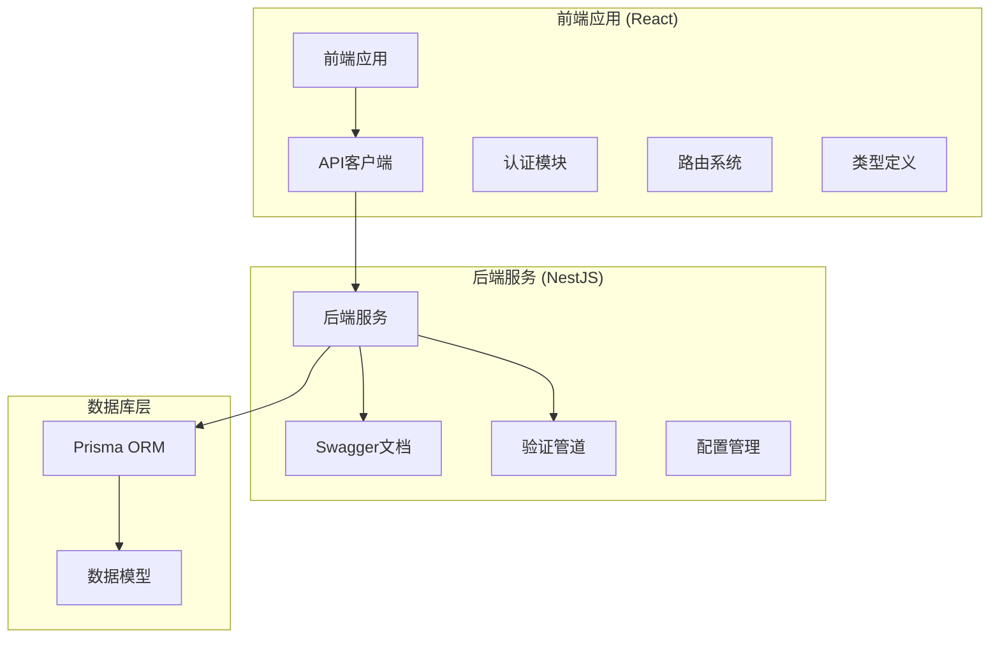
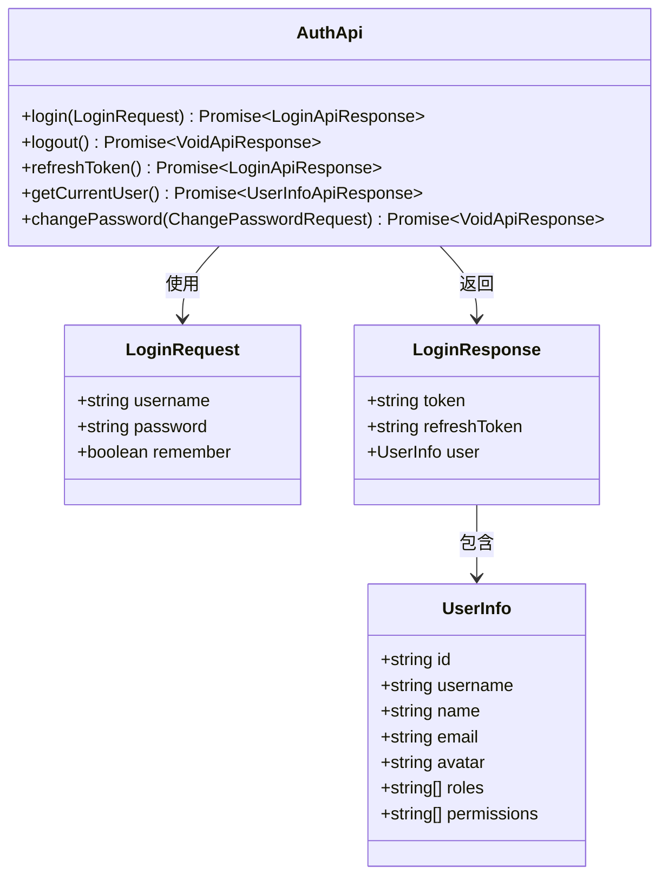
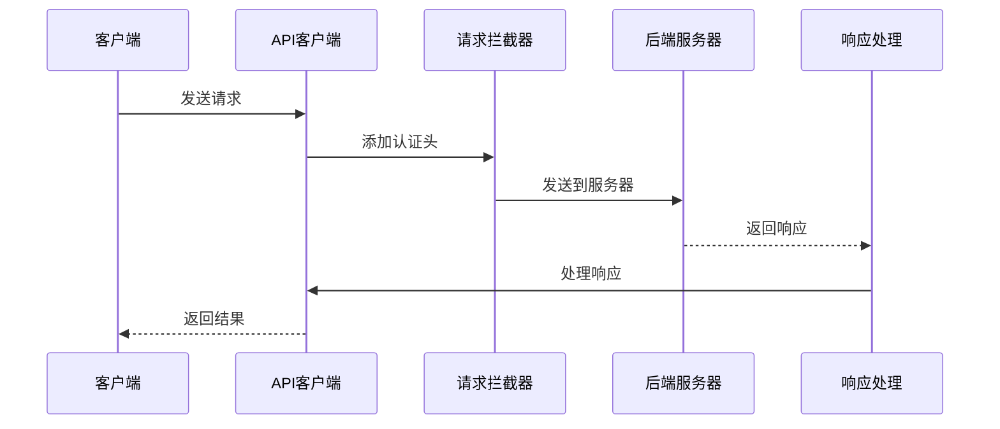
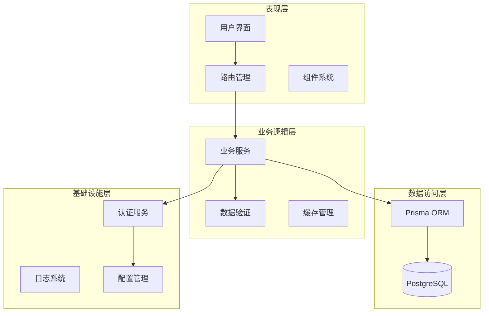
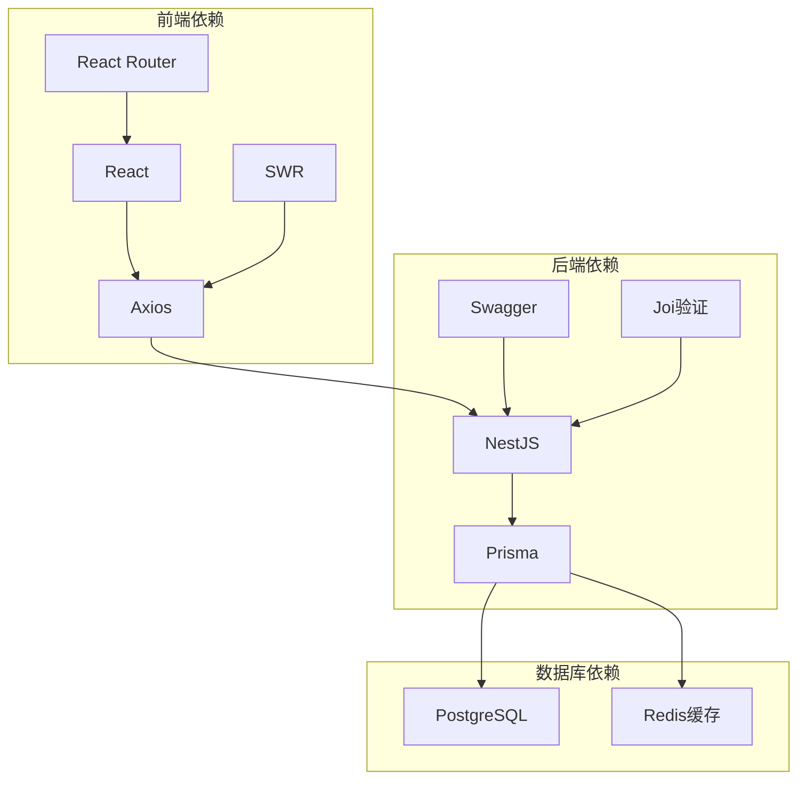
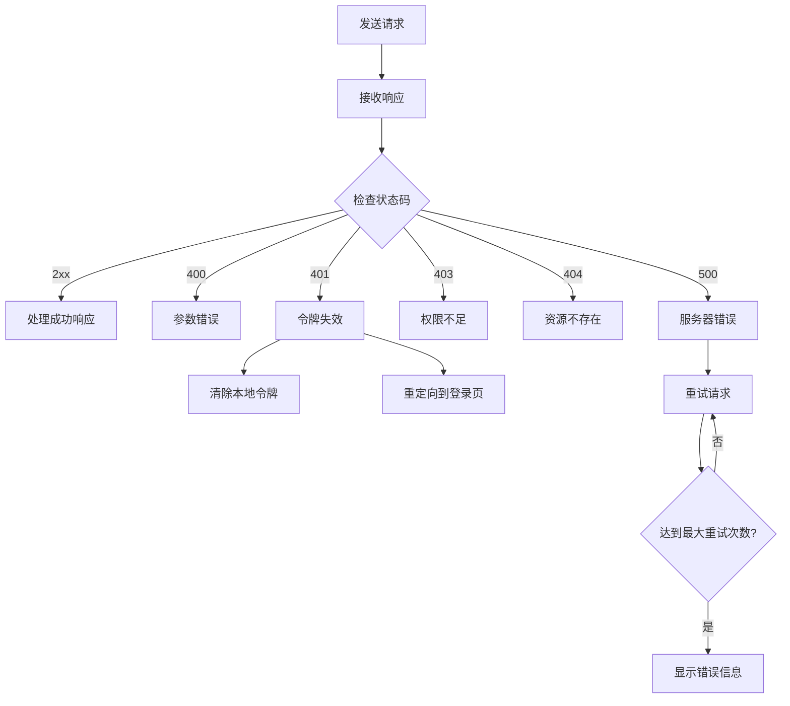
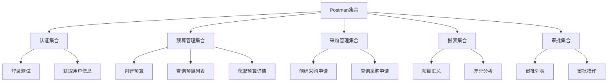

# API接口文档

<cite>
**本文档引用的文件**
- [auth.api.ts](file://src/api/modules/auth.api.ts)
- [auth.types.ts](file://src/api/types/auth.types.ts)
- [client.ts](file://src/api/client.ts)
- [index.ts](file://src/types/index.ts)
- [constants.ts](file://src/utils/constants.ts)
- [main.ts](file://server/src/main.ts)
- [app.module.ts](file://server/src/app.module.ts)
- [schema.prisma](file://server/src/prisma/schema.prisma)
- [routes.ts](file://src/router/routes.ts)
- [useAuth.ts](file://src/hooks/useAuth.ts)
- [vite.config.ts](file://vite.config.ts)
</cite>

## 目录
1. [简介](#简介)
2. [项目结构](#项目结构)
3. [核心组件](#核心组件)
4. [架构概览](#架构概览)
5. [详细组件分析](#详细组件分析)
6. [依赖关系分析](#依赖关系分析)
7. [性能考虑](#性能考虑)
8. [故障排除指南](#故障排除指南)
9. [结论](#结论)
10. [附录](#附录)

## 简介

企业预算管理系统是一个基于React前端和NestJS后端的企业级预算管理解决方案。该系统提供了完整的预算管理、采购管理、审批流程和数据分析功能，支持多部门、多层次的预算控制和执行跟踪。

系统采用前后端分离架构，前端使用React + TypeScript构建用户界面，后端使用NestJS + Prisma提供RESTful API服务。通过Swagger文档生成工具，系统自动生成API接口文档，便于开发者和用户理解和使用。

## 项目结构

系统采用模块化设计，主要分为以下几个核心部分：



**图表来源**
- [main.ts:1-51](file://server/src/main.ts#L1-L51)
- [app.module.ts:1-52](file://server/src/app.module.ts#L1-L52)
- [client.ts:1-183](file://src/api/client.ts#L1-L183)

**章节来源**
- [main.ts:1-51](file://server/src/main.ts#L1-L51)
- [app.module.ts:1-52](file://server/src/app.module.ts#L1-L52)
- [routes.ts:1-122](file://src/router/routes.ts#L1-L122)

## 核心组件

### 认证API模块

认证模块提供了用户身份验证和会话管理的核心功能，包括登录、登出、令牌刷新和用户信息获取等接口。



**图表来源**
- [auth.api.ts:14-49](file://src/api/modules/auth.api.ts#L14-L49)
- [auth.types.ts:5-25](file://src/api/types/auth.types.ts#L5-L25)

### API客户端封装

API客户端基于Axios实现了统一的HTTP请求处理，包括请求拦截器、响应拦截器和错误处理机制。



**图表来源**
- [client.ts:21-94](file://src/api/client.ts#L21-L94)

**章节来源**
- [auth.api.ts:1-50](file://src/api/modules/auth.api.ts#L1-L50)
- [auth.types.ts:1-44](file://src/api/types/auth.types.ts#L1-L44)
- [client.ts:1-183](file://src/api/client.ts#L1-L183)

## 架构概览

系统采用分层架构设计，确保了良好的可维护性和扩展性：



**图表来源**
- [main.ts:1-51](file://server/src/main.ts#L1-L51)
- [schema.prisma:1-448](file://server/src/prisma/schema.prisma#L1-L448)

**章节来源**
- [main.ts:1-51](file://server/src/main.ts#L1-L51)
- [schema.prisma:1-448](file://server/src/prisma/schema.prisma#L1-L448)

## 详细组件分析

### 认证API详细说明

#### 登录接口
- **HTTP方法**: POST
- **URL模式**: `/auth/login`
- **请求参数**:
  - username: 用户名 (string, 必填)
  - password: 密码 (string, 必填)
  - remember: 是否记住登录 (boolean, 可选)
- **响应格式**:
  - token: 访问令牌 (string)
  - refreshToken: 刷新令牌 (string, 可选)
  - user: 用户信息 (object)

#### 用户登出接口
- **HTTP方法**: POST
- **URL模式**: `/auth/logout`
- **请求参数**: 无
- **响应格式**: 无内容响应

#### 令牌刷新接口
- **HTTP方法**: POST
- **URL模式**: `/auth/refresh`
- **请求参数**: 无
- **响应格式**: 登录响应格式

#### 获取用户信息接口
- **HTTP方法**: GET
- **URL模式**: `/auth/me`
- **请求参数**: 无
- **响应格式**: 用户信息对象

#### 修改密码接口
- **HTTP方法**: PUT
- **URL模式**: `/auth/password`
- **请求参数**:
  - oldPassword: 旧密码 (string, 必填)
  - newPassword: 新密码 (string, 必填)
- **响应格式**: 无内容响应

**章节来源**
- [auth.api.ts:14-49](file://src/api/modules/auth.api.ts#L14-L49)
- [auth.types.ts:5-34](file://src/api/types/auth.types.ts#L5-L34)

### 预算管理API

基于Prisma数据模型，系统支持以下预算管理功能：

#### 预算创建接口
- **HTTP方法**: POST
- **URL模式**: `/budgets`
- **请求参数**: 预算基本信息和明细项
- **响应格式**: 创建的预算对象

#### 预算查询接口
- **HTTP方法**: GET
- **URL模式**: `/budgets`
- **查询参数**:
  - page: 页码 (默认: 1)
  - pageSize: 每页数量 (默认: 20)
  - departmentId: 部门ID (可选)
  - status: 状态 (可选)
  - year: 年度 (可选)
- **响应格式**: 分页结果，包含预算列表

#### 预算详情接口
- **HTTP方法**: GET
- **URL模式**: `/budgets/{id}`
- **路径参数**: 预算ID
- **响应格式**: 预算详细信息

#### 预算更新接口
- **HTTP方法**: PUT
- **URL模式**: `/budgets/{id}`
- **路径参数**: 预算ID
- **请求参数**: 更新的预算信息
- **响应格式**: 更新后的预算对象

#### 预算删除接口
- **HTTP方法**: DELETE
- **URL模式**: `/budgets/{id}`
- **路径参数**: 预算ID
- **响应格式**: 删除确认

**章节来源**
- [schema.prisma:107-134](file://server/src/prisma/schema.prisma#L107-L134)
- [index.ts:80-99](file://src/types/index.ts#L80-L99)

### 采购管理API

#### 采购申请创建接口
- **HTTP方法**: POST
- **URL模式**: `/purchase-requests`
- **请求参数**: 采购申请详细信息
- **响应格式**: 创建的采购申请对象

#### 采购申请查询接口
- **HTTP方法**: GET
- **URL模式**: `/purchase-requests`
- **查询参数**:
  - page: 页码
  - pageSize: 每页数量
  - budgetId: 预算ID (可选)
  - status: 状态 (可选)
- **响应格式**: 分页结果，包含采购申请列表

#### 采购申请详情接口
- **HTTP方法**: GET
- **URL模式**: `/purchase-requests/{id}`
- **路径参数**: 采购申请ID
- **响应格式**: 采购申请详细信息

#### 采购申请更新接口
- **HTTP方法**: PUT
- **URL模式**: `/purchase-requests/{id}`
- **路径参数**: 采购申请ID
- **请求参数**: 更新的采购申请信息
- **响应格式**: 更新后的采购申请对象

**章节来源**
- [schema.prisma:178-200](file://server/src/prisma/schema.prisma#L178-L200)
- [index.ts:157-175](file://src/types/index.ts#L157-L175)

### 数据分析API

#### 预算汇总接口
- **HTTP方法**: GET
- **URL模式**: `/reports/budget-summary`
- **查询参数**:
  - type: 预算类型 (Opex/Capex)
  - status: 状态
  - departmentId: 部门ID
- **响应格式**: 预算汇总统计信息

#### 执行率分析接口
- **HTTP方法**: GET
- **URL模式**: `/reports/execution-rate`
- **查询参数**:
  - startDate: 开始日期
  - endDate: 结束日期
  - departmentId: 部门ID
- **响应格式**: 执行率分析数据

#### 预算差异分析接口
- **HTTP方法**: GET
- **URL模式**: `/reports/variance-analysis`
- **查询参数**:
  - period: 分析周期
  - dimension: 分析维度
- **响应格式**: 差异分析结果

**章节来源**
- [Analysis.tsx:1-163](file://src/pages/Analysis.tsx#L1-L163)
- [constants.ts:1-111](file://src/utils/constants.ts#L1-L111)

### 审批管理API

#### 审批流程查询接口
- **HTTP方法**: GET
- **URL模式**: `/approvals`
- **查询参数**:
  - page: 页码
  - pageSize: 每页数量
  - status: 状态
  - approverId: 审批人ID
- **响应格式**: 审批流程列表

#### 审批操作接口
- **HTTP方法**: POST
- **URL模式**: `/approvals/{id}/action`
- **路径参数**: 审批流程ID
- **请求参数**:
  - action: 审批动作 (APPROVE/REJECT)
  - comment: 审批意见
- **响应格式**: 审批结果

**章节来源**
- [schema.prisma:233-264](file://server/src/prisma/schema.prisma#L233-L264)
- [index.ts:220-245](file://src/types/index.ts#L220-L245)

## 依赖关系分析

系统各组件之间的依赖关系如下：



**图表来源**
- [package.json](file://package.json)
- [main.ts:1-51](file://server/src/main.ts#L1-L51)
- [schema.prisma:1-448](file://server/src/prisma/schema.prisma#L1-L448)

**章节来源**
- [package.json](file://package.json)
- [main.ts:1-51](file://server/src/main.ts#L1-L51)

## 性能考虑

### 缓存策略
- **前端缓存**: 使用SWR实现智能缓存和自动刷新
- **后端缓存**: Redis缓存热点数据，减少数据库压力
- **静态资源**: CDN加速静态资源加载

### 数据库优化
- **索引优化**: 为常用查询字段建立索引
- **查询优化**: 使用分页查询避免大数据集加载
- **连接池**: 配置合理的数据库连接池大小

### API性能
- **请求合并**: 减少HTTP请求次数
- **响应压缩**: 启用Gzip压缩
- **超时设置**: 合理的请求超时配置

## 故障排除指南

### 常见错误码说明

| 错误码 | 描述 | 可能原因 | 解决方案 |
|--------|------|----------|----------|
| 400 | 请求参数错误 | 参数格式不正确 | 检查请求参数格式和必填字段 |
| 401 | 未授权 | 令牌过期或无效 | 重新登录获取新令牌 |
| 403 | 拒绝访问 | 权限不足 | 检查用户权限和角色 |
| 404 | 资源不存在 | ID错误或已被删除 | 验证资源ID的有效性 |
| 500 | 服务器内部错误 | 服务器异常 | 检查服务器日志和数据库连接 |

### 错误处理流程



**图表来源**
- [client.ts:52-94](file://src/api/client.ts#L52-L94)

**章节来源**
- [client.ts:52-94](file://src/api/client.ts#L52-L94)

## 结论

企业预算管理系统提供了完整的预算管理解决方案，具有以下特点：

1. **完整的功能覆盖**: 支持预算创建、采购管理、审批流程和数据分析等核心功能
2. **良好的架构设计**: 采用前后端分离和模块化设计，便于维护和扩展
3. **完善的API文档**: 基于Swagger自动生成API文档，便于开发者使用
4. **安全可靠**: 实现了完整的认证授权机制和数据验证
5. **性能优化**: 采用多种性能优化策略，确保系统的高效运行

系统通过标准化的API接口和清晰的数据模型，为企业提供了可靠的预算管理工具，有助于提高预算管理的效率和准确性。

## 附录

### API调用示例

#### 认证流程示例
```javascript
// 登录
const loginResponse = await authApi.login({
  username: "admin",
  password: "password123"
});

// 使用令牌访问受保护的API
const userInfo = await authApi.getCurrentUser();

// 刷新令牌
const refreshResponse = await authApi.refreshToken();
```

#### 预算管理示例
```javascript
// 创建预算
const budgetData = {
  name: "2024年度研发预算",
  departmentId: "dept_123",
  type: "OPEX",
  year: 2024,
  items: [
    {
      name: "研发材料",
      category: "材料费",
      budget: 500000
    }
  ]
};

const newBudget = await budgetApi.create(budgetData);
```

### 参数验证规则

#### 用户名验证
- 长度: 3-20个字符
- 格式: 字母数字下划线
- 唯一性: 在系统中唯一

#### 密码验证
- 长度: 至少8个字符
- 复杂度: 包含大小写字母和数字
- 安全性: 使用bcrypt哈希存储

#### 预算金额验证
- 数值范围: 0到999999999.99
- 精度: 保留两位小数
- 校验: 预算总额必须等于明细项之和

### 安全考虑

#### 认证安全
- JWT令牌有效期: 24小时
- 刷新令牌: 7天有效期
- 令牌存储: 安全的HTTP-only Cookie
- CSRF防护: 同源策略验证

#### 数据安全
- 敏感数据加密: 数据库层面加密
- SQL注入防护: 参数化查询
- XSS防护: 输入输出过滤
- CORS配置: 严格的跨域策略

#### 权限控制
- 基于角色的访问控制(RBAC)
- 细粒度权限管理
- 操作审计日志
- 最小权限原则

### Postman集合

系统支持Postman集合格式，包含所有API端点的完整测试用例。集合结构如下：



**章节来源**
- [auth.api.ts:1-50](file://src/api/modules/auth.api.ts#L1-L50)
- [useAuth.ts:1-84](file://src/hooks/useAuth.ts#L1-L84)
- [constants.ts:1-111](file://src/utils/constants.ts#L1-L111)