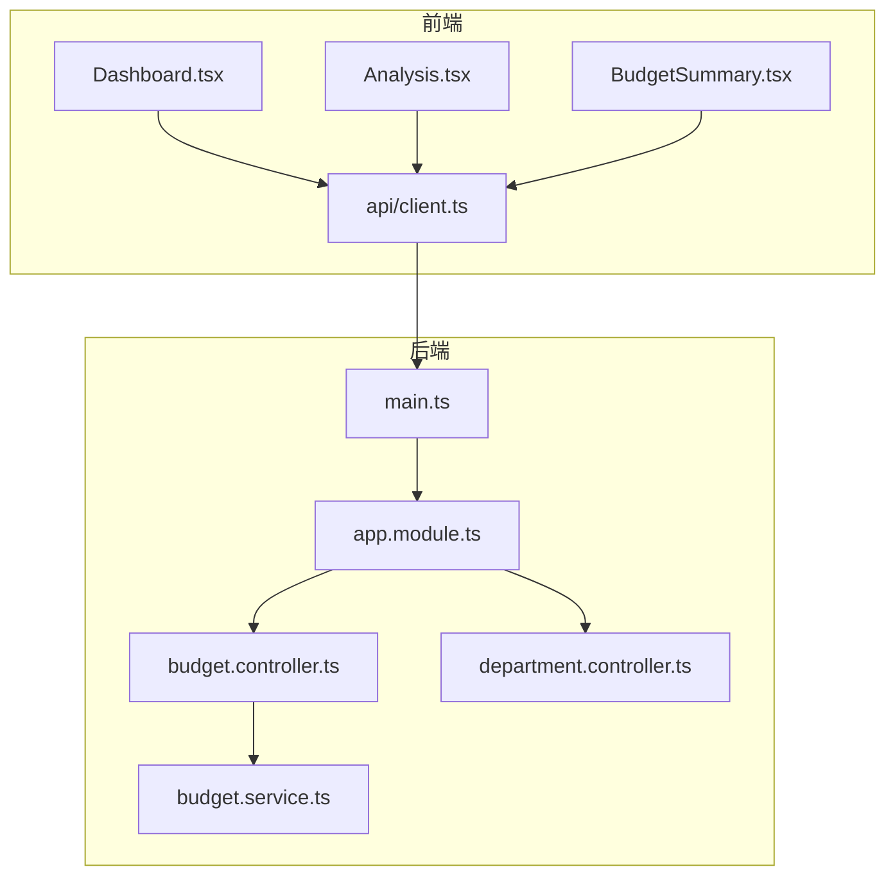
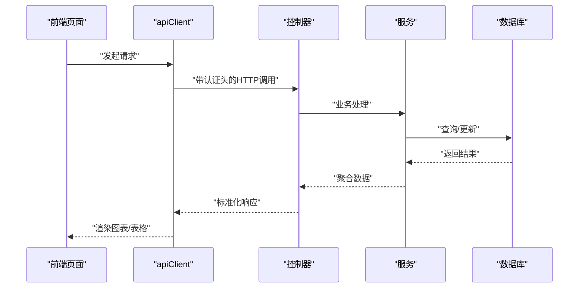
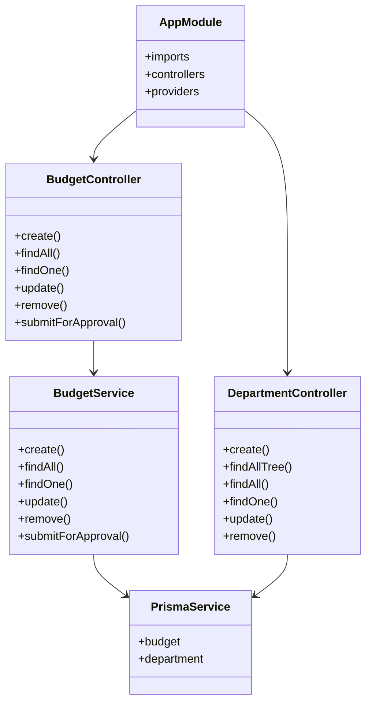

# 数据分析API

<cite>
**本文引用的文件**
- [server/src/main.ts](file://server/src/main.ts)
- [server/src/app.module.ts](file://server/src/app.module.ts)
- [server/src/modules/budget/budget.module.ts](file://server/src/modules/budget/budget.module.ts)
- [server/src/modules/budget/budget.controller.ts](file://server/src/modules/budget/budget.controller.ts)
- [server/src/modules/budget/budget.service.ts](file://server/src/modules/budget/budget.service.ts)
- [server/src/modules/department/department.module.ts](file://server/src/modules/department/department.module.ts)
- [server/src/modules/department/department.controller.ts](file://server/src/modules/department/department.controller.ts)
- [src/api/client.ts](file://src/api/client.ts)
- [src/types/index.ts](file://src/types/index.ts)
- [src/pages/Dashboard.tsx](file://src/pages/Dashboard.tsx)
- [src/pages/Analysis.tsx](file://src/pages/Analysis.tsx)
- [src/pages/BudgetSummary.tsx](file://src/pages/BudgetSummary.tsx)
</cite>

## 目录
1. [简介](#简介)
2. [项目结构](#项目结构)
3. [核心组件](#核心组件)
4. [架构总览](#架构总览)
5. [详细组件分析](#详细组件分析)
6. [依赖关系分析](#依赖关系分析)
7. [性能考虑](#性能考虑)
8. [故障排查指南](#故障排查指南)
9. [结论](#结论)
10. [附录](#附录)

## 简介
本文件面向“数据分析API”的全面接口文档，聚焦以下核心能力：
- 仪表盘数据获取：预算总览、部门预算执行、预算类型分布、月度趋势、预警告警等。
- 预算汇总分析：按部门/类型/状态的预算汇总与明细。
- 预算趋势预测：基于历史月度数据的趋势分析与可视化。
- 预算差异分析：预算与实际支出的差异、差异率与状态标记。
- 高级分析功能：预算占用率计算、部门预算对比、时间序列分析。
- 报表生成接口：参数配置、数据格式与导出流程。
- 实时监控与预警通知：告警卡片、通知类型与状态标识。
- 图表数据接口：响应格式与前端集成指南。
- 性能优化与缓存策略：分页、过滤、缓存与CDN建议。

本项目采用前后端分离架构，后端基于 NestJS + Prisma，前端基于 React + Recharts，通过 Swagger 提供在线接口文档。

## 项目结构
后端模块化组织，核心模块包括认证、部门、预算等；前端页面包含仪表盘、分析、预算汇总等展示组件；API 客户端封装了统一的请求/响应拦截与错误处理。

图示来源
- [server/src/main.ts:1-59](file://server/src/main.ts#L1-L59)
- [server/src/app.module.ts:1-30](file://server/src/app.module.ts#L1-L30)
- [server/src/modules/budget/budget.controller.ts:1-62](file://server/src/modules/budget/budget.controller.ts#L1-L62)
- [server/src/modules/budget/budget.service.ts:1-157](file://server/src/modules/budget/budget.service.ts#L1-L157)
- [server/src/modules/department/department.controller.ts:1-63](file://server/src/modules/department/department.controller.ts#L1-L63)
- [src/api/client.ts:1-183](file://src/api/client.ts#L1-L183)

章节来源
- [server/src/main.ts:1-59](file://server/src/main.ts#L1-L59)
- [server/src/app.module.ts:1-30](file://server/src/app.module.ts#L1-L30)
- [src/api/client.ts:1-183](file://src/api/client.ts#L1-L183)

## 核心组件
- 后端应用启动与全局配置：CORS、全局前缀、验证管道、异常过滤器、拦截器、Swagger 文档。
- 模块装配：AppModule 引入 Prisma、Auth、Department、Budget 模块。
- 预算模块：预算控制器暴露 CRUD、提交审批等接口；预算服务负责业务逻辑与数据库交互。
- 部门模块：部门控制器提供树形结构与基础 CRUD 接口。
- 前端 API 客户端：统一封装 Axios 实例、请求/响应拦截、错误处理、下载/上传工具。
- 前端页面：Dashboard、Analysis、BudgetSummary 展示 Mock 数据与图表集成。

章节来源
- [server/src/main.ts:9-59](file://server/src/main.ts#L9-L59)
- [server/src/app.module.ts:10-29](file://server/src/app.module.ts#L10-L29)
- [server/src/modules/budget/budget.controller.ts:1-62](file://server/src/modules/budget/budget.controller.ts#L1-L62)
- [server/src/modules/budget/budget.service.ts:1-157](file://server/src/modules/budget/budget.service.ts#L1-L157)
- [server/src/modules/department/department.controller.ts:1-63](file://server/src/modules/department/department.controller.ts#L1-L63)
- [src/api/client.ts:12-100](file://src/api/client.ts#L12-L100)

## 架构总览
后端通过 Swagger 暴露 API 文档，前端通过 apiClient 发起请求并携带 Bearer Token。预算与部门模块提供数据分析所需的基础数据。

图示来源
- [src/api/client.ts:105-136](file://src/api/client.ts#L105-L136)
- [server/src/modules/budget/budget.controller.ts:14-61](file://server/src/modules/budget/budget.controller.ts#L14-L61)
- [server/src/modules/budget/budget.service.ts:47-84](file://server/src/modules/budget/budget.service.ts#L47-L84)

## 详细组件分析

### 仪表盘数据接口
- 接口目标：提供预算总览、部门预算执行、预算类型分布、月度趋势、预警告警等数据。
- 前端图表：Recharts 使用 Mock 数据进行渲染，便于对接真实接口。
- 关键字段与格式：
  - 预算总览：总预算、已用、剩余、Capex、Opex 及其已用值。
  - 部门预算执行：部门名称、预算、已用、剩余。
  - 预算类型分布：Capex、Opex 的占比与金额。
  - 月度趋势：月份、预算、实际。
  - 预警告警：部门、消息、类型（warning/danger/info）、预算ID。
- 前端集成要点：
  - 使用 formatCurrency 对数值进行本地化格式化。
  - 执行率阈值用于状态标签与进度条颜色区分。

章节来源
- [src/pages/Dashboard.tsx:19-57](file://src/pages/Dashboard.tsx#L19-L57)
- [src/pages/Dashboard.tsx:65-144](file://src/pages/Dashboard.tsx#L65-L144)
- [src/pages/Dashboard.tsx:148-215](file://src/pages/Dashboard.tsx#L148-L215)
- [src/pages/Dashboard.tsx:217-271](file://src/pages/Dashboard.tsx#L217-L271)

### 预算汇总分析接口
- 接口目标：按部门/类型/状态汇总预算信息，并支持导出与查看详情。
- 关键字段与格式：
  - 预算摘要：版本、部门、类型（Opex/Capex）、总金额、状态、创建人、创建日期。
  - 部门明细：Opex/Capex 分项与合计。
- 前端功能：筛选器（类型/状态）、表格展示、下载按钮占位。

章节来源
- [src/pages/BudgetSummary.tsx:4-39](file://src/pages/BudgetSummary.tsx#L4-L39)
- [src/pages/BudgetSummary.tsx:64-141](file://src/pages/BudgetSummary.tsx#L64-L141)
- [src/pages/BudgetSummary.tsx:143-190](file://src/pages/BudgetSummary.tsx#L143-L190)

### 预算差异分析接口
- 接口目标：提供部门维度与月度维度的预算差异分析，支持差异趋势图与明细表。
- 关键字段与格式：
  - 部门维度：预算、实际、差异、差异率、状态（节约/超支）。
  - 月度维度：预算、实际、差异。
- 前端功能：统计卡片（总预算、实际支出、差异、执行率）、差异趋势线图、差异明细表。

章节来源
- [src/pages/Analysis.tsx:14-33](file://src/pages/Analysis.tsx#L14-L33)
- [src/pages/Analysis.tsx:56-76](file://src/pages/Analysis.tsx#L56-L76)
- [src/pages/Analysis.tsx:78-117](file://src/pages/Analysis.tsx#L78-L117)
- [src/pages/Analysis.tsx:119-160](file://src/pages/Analysis.tsx#L119-L160)

### 高级分析功能
- 预算占用率计算：总已用/总预算 × 100%，以及 Capex/Opex 分类占用率。
- 部门预算对比：横向对比各预算与已用金额，结合执行率状态标签。
- 时间序列分析：月度预算与实际的对比，支持趋势线图与差异线图。

章节来源
- [src/pages/Dashboard.tsx:65-67](file://src/pages/Dashboard.tsx#L65-L67)
- [src/pages/Analysis.tsx:38-46](file://src/pages/Analysis.tsx#L38-L46)

### 报表生成接口
- 参数配置：
  - 分页：page、pageSize
  - 过滤：departmentId、year、status
  - 排序：sortBy、sortOrder（建议）
- 数据格式：
  - 列表返回：items、total、page、pageSize、totalPages
  - 详情返回：预算对象（含部门、明细、审批流程）
- 导出流程：前端调用下载方法，后端返回二进制流（需在后端实现具体导出逻辑）。

章节来源
- [server/src/modules/budget/budget.controller.ts:20-36](file://server/src/modules/budget/budget.controller.ts#L20-L36)
- [server/src/modules/budget/budget.service.ts:47-84](file://server/src/modules/budget/budget.service.ts#L47-L84)
- [src/api/client.ts:141-154](file://src/api/client.ts#L141-L154)

### 实时监控与预警通知
- 告警卡片：前端展示多个告警项，包含部门、消息与类型。
- 通知类型：审批待处理、审批结果、预算预警、预算超支、系统、报表就绪等。
- 前端状态：根据执行率或差异率动态设置标签颜色与状态文案。

章节来源
- [src/pages/Dashboard.tsx:53-100](file://src/pages/Dashboard.tsx#L53-L100)
- [src/types/index.ts:263-282](file://src/types/index.ts#L263-L282)

### 图表数据接口与前端集成
- 响应格式建议：
  - 仪表盘：总览对象、部门数组、趋势数组、告警数组
  - 分析：部门分析数组、月度分析数组、汇总统计
  - 汇总：摘要数组、部门明细对象
- 前端集成指南：
  - 使用 Recharts 的 BarChart、LineChart、PieChart 组件映射后端返回字段。
  - 使用 formatCurrency 在前端统一格式化货币值。
  - 执行率与差异率用于状态标签与颜色映射。

章节来源
- [src/pages/Dashboard.tsx:19-57](file://src/pages/Dashboard.tsx#L19-L57)
- [src/pages/Analysis.tsx:14-33](file://src/pages/Analysis.tsx#L14-L33)
- [src/pages/BudgetSummary.tsx:16-39](file://src/pages/BudgetSummary.tsx#L16-L39)

## 依赖关系分析
- 应用层：AppModule 装配 Prisma、Auth、Department、Budget 模块。
- 控制器层：BudgetController、DepartmentController 提供 REST 接口。
- 服务层：BudgetService、DepartmentService 处理业务逻辑与数据库交互。
- 前端：apiClient 统一请求与错误处理，页面组件负责数据展示与交互。

图示来源
- [server/src/app.module.ts:10-29](file://server/src/app.module.ts#L10-L29)
- [server/src/modules/budget/budget.controller.ts:11-61](file://server/src/modules/budget/budget.controller.ts#L11-L61)
- [server/src/modules/budget/budget.service.ts:6-157](file://server/src/modules/budget/budget.service.ts#L6-L157)
- [server/src/modules/department/department.controller.ts:12-62](file://server/src/modules/department/department.controller.ts#L12-L62)

章节来源
- [server/src/app.module.ts:10-29](file://server/src/app.module.ts#L10-L29)
- [server/src/modules/budget/budget.controller.ts:11-61](file://server/src/modules/budget/budget.controller.ts#L11-L61)
- [server/src/modules/budget/budget.service.ts:6-157](file://server/src/modules/budget/budget.service.ts#L6-L157)
- [server/src/modules/department/department.controller.ts:12-62](file://server/src/modules/department/department.controller.ts#L12-L62)

## 性能考虑
- 分页与过滤：后端已提供分页与多条件过滤，建议前端默认合理 pageSize，避免一次性加载过多数据。
- 缓存策略：
  - 读多写少的数据（如预算汇总、部门树）可引入 Redis 缓存，设置 TTL（如 5-15 分钟）。
  - 对高频查询（如仪表盘总览）可增加本地内存缓存或浏览器缓存。
- CDN 与静态资源：图表库与字体资源走 CDN，减少首屏阻塞。
- 请求去重：对相同查询参数的请求进行去重，避免重复请求。
- 数据压缩：启用 Gzip/Br 压缩，降低传输体积。
- 并发控制：限制同时请求数量，避免雪崩效应。

## 故障排查指南
- 认证失败（401）：检查本地存储中的 token 是否存在且未过期，确认请求头是否正确添加 Authorization。
- 参数校验失败（400）：核对查询参数类型与必填项，确保分页参数合法。
- 资源不存在（404）：确认 ID 或路径正确，检查后端是否存在对应记录。
- 服务器错误（500/502/503）：查看后端日志，定位异常堆栈；前端提示用户稍后重试。
- 网络错误：检查网络连通性与代理设置，确认跨域配置正确。

章节来源
- [src/api/client.ts:52-94](file://src/api/client.ts#L52-L94)
- [server/src/main.ts:15-19](file://server/src/main.ts#L15-L19)

## 结论
本项目提供了清晰的前后端分离架构与完善的 API 文档入口。通过预算与部门模块，前端可实现仪表盘、差异分析、预算汇总等核心分析场景。建议后续完善后端报表导出、预警通知推送与缓存策略，持续提升用户体验与系统性能。

## 附录
- Swagger 在线文档：启动后可在 http://localhost:3000/api/docs 访问。
- 全局前缀：所有接口均以 /api 开头。
- 认证方式：Bearer Token，需在请求头 Authorization 中携带。

章节来源
- [server/src/main.ts:39-48](file://server/src/main.ts#L39-L48)
- [server/src/main.ts:22](file://server/src/main.ts#L22)
- [server/src/main.ts:44](file://server/src/main.ts#L44)