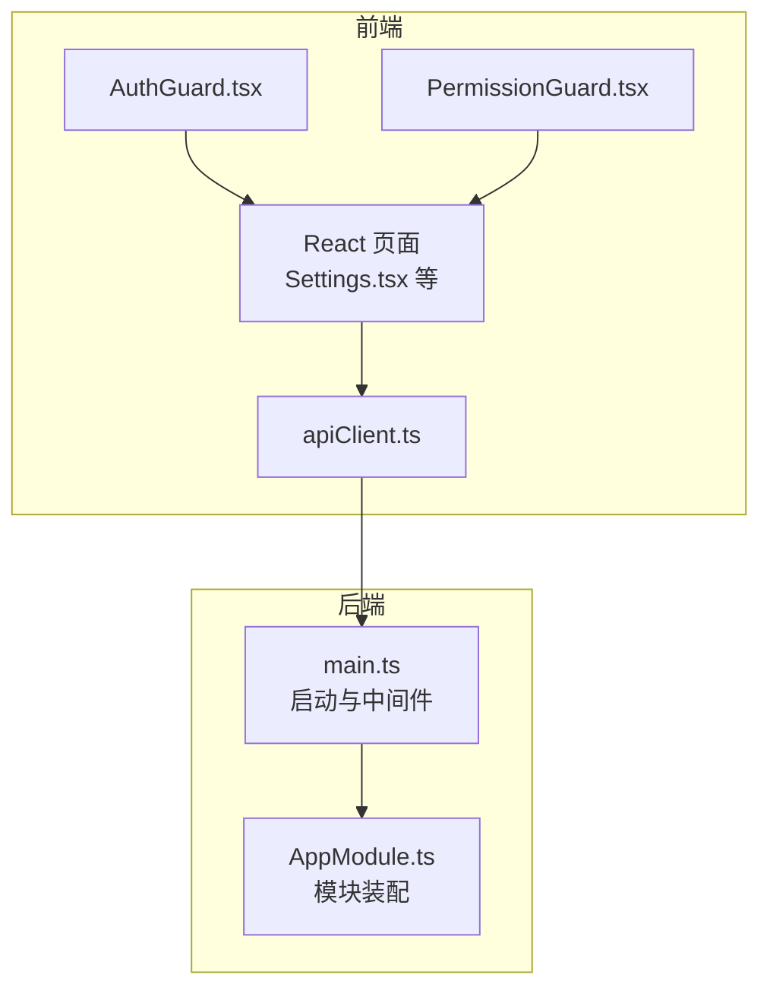
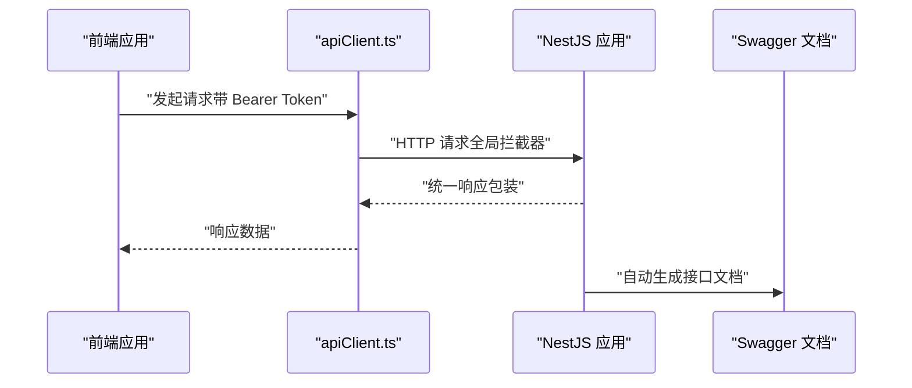
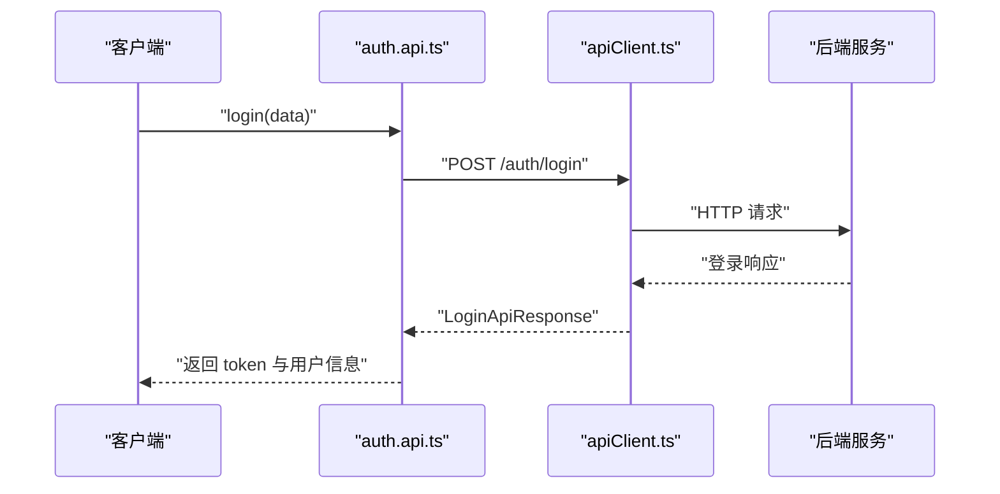
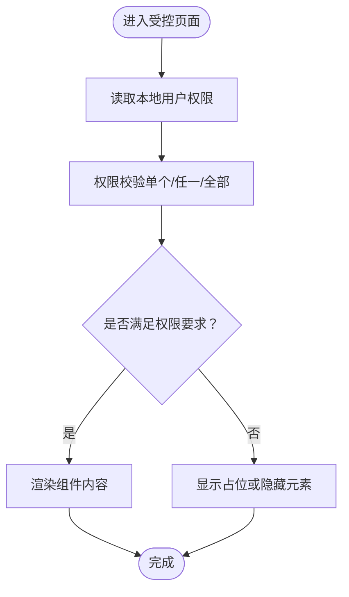
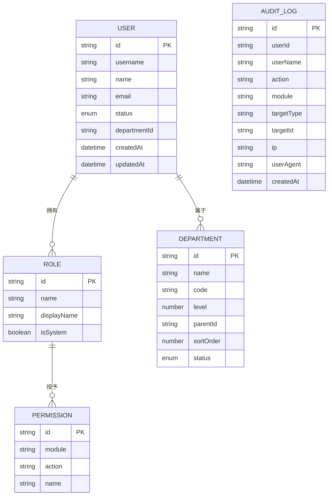
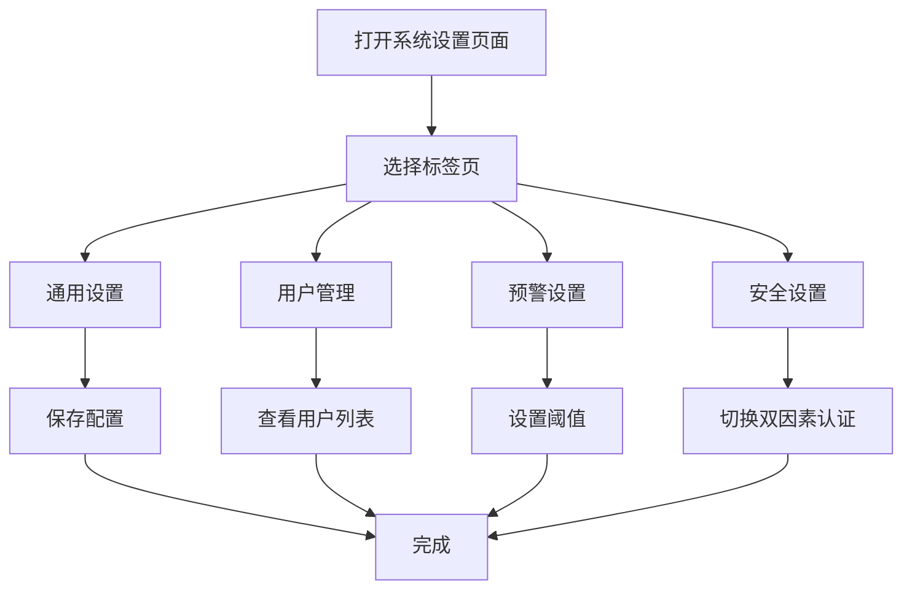
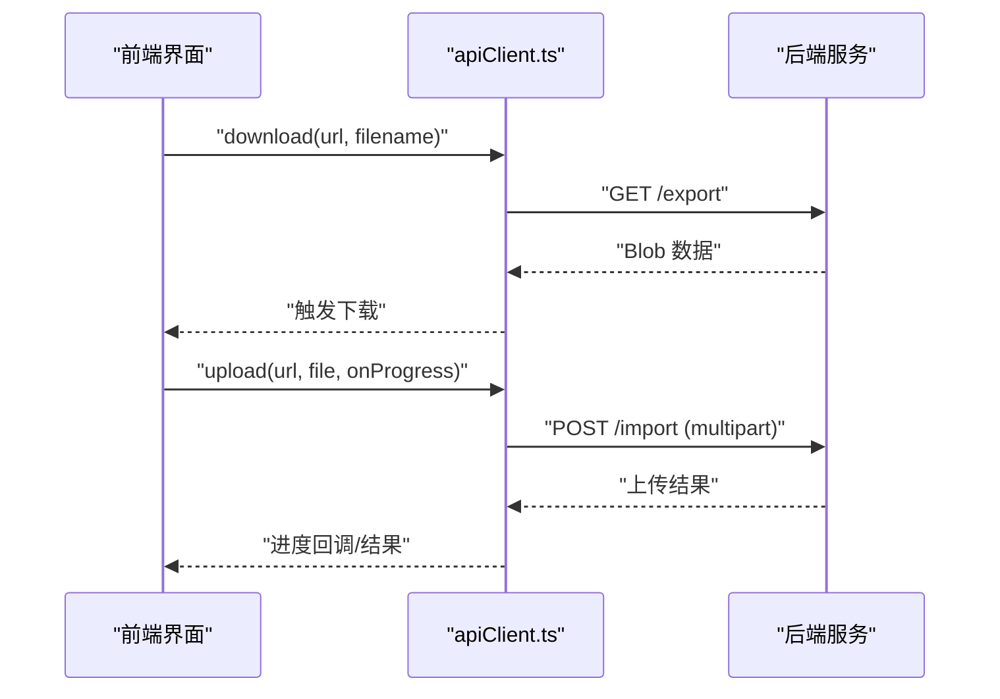
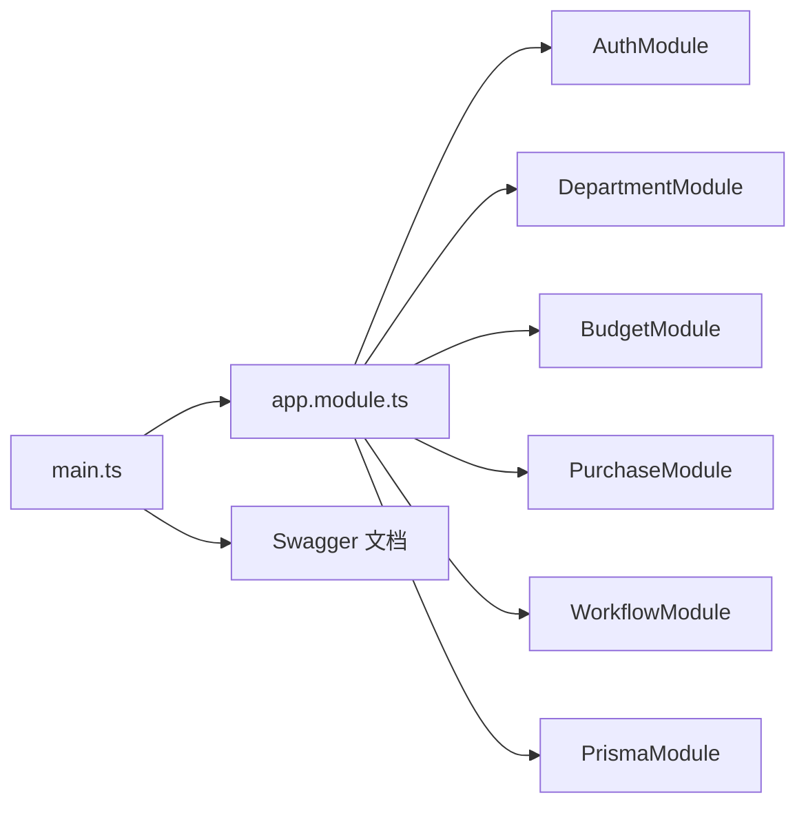

# 系统管理API

<cite>
**本文引用的文件**
- [server/src/app.module.ts](file://server/src/app.module.ts)
- [server/src/main.ts](file://server/src/main.ts)
- [src/api/modules/auth.api.ts](file://src/api/modules/auth.api.ts)
- [src/api/types/auth.types.ts](file://src/api/types/auth.types.ts)
- [src/components/guard/AuthGuard.tsx](file://src/components/guard/AuthGuard.tsx)
- [src/components/guard/PermissionGuard.tsx](file://src/components/guard/PermissionGuard.tsx)
- [src/utils/permission.ts](file://src/utils/permission.ts)
- [src/types/index.ts](file://src/types/index.ts)
- [src/api/client.ts](file://src/api/client.ts)
- [src/pages/Settings.tsx](file://src/pages/Settings.tsx)
</cite>

## 目录
1. [简介](#简介)
2. [项目结构](#项目结构)
3. [核心组件](#核心组件)
4. [架构总览](#架构总览)
5. [详细组件分析](#详细组件分析)
6. [依赖关系分析](#依赖关系分析)
7. [性能考虑](#性能考虑)
8. [故障排查指南](#故障排查指南)
9. [结论](#结论)
10. [附录](#附录)

## 简介
本文件面向系统管理API，聚焦于系统配置与后台管理能力，包括但不限于：
- 部门管理、用户管理、权限管理
- 数据字典管理、系统参数配置
- 角色权限分配、组织架构管理
- 用户权限验证、系统日志查询
- Excel数据导出、系统备份恢复
- 系统集成与第三方对接指南

同时，文档提供接口的请求参数、响应格式与权限控制机制，并以可视化图示呈现调用流程与数据模型。

## 项目结构
后端采用 NestJS 架构，前端使用 Vite + React，通过统一的 API 客户端进行交互；全局启用 CORS、统一验证管道、异常过滤器与响应拦截器；Swagger 提供在线接口文档。

**图表来源**
- [server/src/main.ts:1-59](file://server/src/main.ts#L1-L59)
- [server/src/app.module.ts:1-34](file://server/src/app.module.ts#L1-L34)
- [src/api/client.ts:1-183](file://src/api/client.ts#L1-L183)
- [src/components/guard/AuthGuard.tsx:1-31](file://src/components/guard/AuthGuard.tsx#L1-L31)
- [src/components/guard/PermissionGuard.tsx:1-88](file://src/components/guard/PermissionGuard.tsx#L1-L88)

**章节来源**
- [server/src/main.ts:1-59](file://server/src/main.ts#L1-L59)
- [server/src/app.module.ts:1-34](file://server/src/app.module.ts#L1-L34)

## 核心组件
- 认证与会话：登录、登出、刷新令牌、获取当前用户信息、修改密码
- 权限体系：基于角色的权限校验、权限守卫组件、权限枚举
- 数据模型：用户、角色、权限、部门、审计日志等
- API 客户端：统一请求/响应拦截、错误处理、文件下载/上传
- 设置页面：系统参数配置入口（通用设置、用户管理、预警设置、安全设置）

**章节来源**
- [src/api/modules/auth.api.ts:1-50](file://src/api/modules/auth.api.ts#L1-L50)
- [src/api/types/auth.types.ts:1-44](file://src/api/types/auth.types.ts#L1-L44)
- [src/utils/permission.ts:1-84](file://src/utils/permission.ts#L1-L84)
- [src/types/index.ts:1-338](file://src/types/index.ts#L1-L338)
- [src/api/client.ts:1-183](file://src/api/client.ts#L1-L183)
- [src/pages/Settings.tsx:1-160](file://src/pages/Settings.tsx#L1-L160)

## 架构总览
系统采用前后端分离架构，前端通过 apiClient 发起请求，后端统一前缀为 api，支持跨域、全局验证与统一响应包装。Swagger 在线文档位于 /api/docs。

**图表来源**
- [server/src/main.ts:39-48](file://server/src/main.ts#L39-L48)
- [src/api/client.ts:21-96](file://src/api/client.ts#L21-L96)

**章节来源**
- [server/src/main.ts:21-48](file://server/src/main.ts#L21-L48)
- [src/api/client.ts:12-100](file://src/api/client.ts#L12-L100)

## 详细组件分析

### 认证与会话 API
- 登录：提交用户名与密码，返回 token、refreshToken 与用户信息
- 登出：使当前会话失效
- 刷新 Token：使用 refresh token 获取新 token
- 获取当前用户：查询当前登录用户信息
- 修改密码：更新当前用户的密码

请求参数与响应格式参考类型定义，统一使用 ApiResponse 包裹。

**图表来源**
- [src/api/modules/auth.api.ts:14-48](file://src/api/modules/auth.api.ts#L14-L48)
- [src/api/client.ts:105-118](file://src/api/client.ts#L105-L118)
- [src/api/types/auth.types.ts:5-39](file://src/api/types/auth.types.ts#L5-L39)

**章节来源**
- [src/api/modules/auth.api.ts:1-50](file://src/api/modules/auth.api.ts#L1-L50)
- [src/api/types/auth.types.ts:1-44](file://src/api/types/auth.types.ts#L1-L44)
- [src/api/client.ts:1-183](file://src/api/client.ts#L1-L183)

### 权限控制与守卫
- 权限判断：支持单个权限、任一权限、全部权限校验
- 权限守卫组件：在 UI 层对按钮/功能进行细粒度权限控制
- 权限枚举：涵盖预算、采购、审批、报表与系统管理等模块权限

**图表来源**
- [src/components/guard/PermissionGuard.tsx:15-46](file://src/components/guard/PermissionGuard.tsx#L15-L46)
- [src/utils/permission.ts:11-41](file://src/utils/permission.ts#L11-L41)

**章节来源**
- [src/components/guard/PermissionGuard.tsx:1-88](file://src/components/guard/PermissionGuard.tsx#L1-L88)
- [src/utils/permission.ts:1-84](file://src/utils/permission.ts#L1-L84)

### 数据模型与系统管理实体
- 用户：id、用户名、姓名、邮箱、状态、所属部门、角色集合
- 角色：id、名称、显示名、描述、系统内置标记、权限集合
- 权限：模块、操作、名称
- 部门：id、名称、编码、层级、父节点、排序、状态
- 审计日志：用户、动作、模块、目标类型/ID、IP、UA、时间

**图表来源**
- [src/types/index.ts:3-53](file://src/types/index.ts#L3-L53)
- [src/types/index.ts:55-76](file://src/types/index.ts#L55-L76)
- [src/types/index.ts:284-299](file://src/types/index.ts#L284-L299)

**章节来源**
- [src/types/index.ts:1-338](file://src/types/index.ts#L1-L338)

### 系统参数配置与设置页面
- 通用设置：公司名称、财年起始月份、货币单位
- 用户管理：用户列表展示（Mock）
- 预警设置：预算消耗预警阈值
- 安全设置：双因素认证开关

**图表来源**
- [src/pages/Settings.tsx:13-160](file://src/pages/Settings.tsx#L13-L160)

**章节来源**
- [src/pages/Settings.tsx:1-160](file://src/pages/Settings.tsx#L1-L160)

### 文件下载与上传（运维导出/导入）
- 下载：以 blob 形式下载文件并触发浏览器下载
- 上传：multipart/form-data 上传文件并支持进度回调

**图表来源**
- [src/api/client.ts:141-180](file://src/api/client.ts#L141-L180)

**章节来源**
- [src/api/client.ts:1-183](file://src/api/client.ts#L1-L183)

## 依赖关系分析
- 启动与中间件：全局前缀、CORS、验证管道、异常过滤器、拦截器、Swagger
- 模块装配：AuthModule、DepartmentModule、BudgetModule、PurchaseModule、WorkflowModule、PrismaModule
- 前端客户端：Axios 实例、请求/响应拦截器、错误处理、下载/上传封装

**图表来源**
- [server/src/main.ts:9-58](file://server/src/main.ts#L9-L58)
- [server/src/app.module.ts:12-32](file://server/src/app.module.ts#L12-L32)

**章节来源**
- [server/src/main.ts:1-59](file://server/src/main.ts#L1-L59)
- [server/src/app.module.ts:1-34](file://server/src/app.module.ts#L1-L34)

## 性能考虑
- 请求超时与重试：建议在前端对关键请求设置合理超时与有限重试策略
- 缓存策略：GET 请求自动附加时间戳参数避免缓存问题
- 大文件传输：上传/下载建议分片与断点续传（当前实现为简单封装）
- 响应拦截：统一错误处理减少重复逻辑，提升稳定性

[本节为通用指导，不直接分析具体文件]

## 故障排查指南
- 401 未授权：清除本地 token 与用户信息并跳转登录页
- 403 拒绝访问：检查用户权限与角色配置
- 404 资源不存在：确认接口路径与版本前缀
- 5xx 服务器错误：查看后端日志与 Swagger 文档定位问题
- 网络错误：检查 CORS 配置与代理设置

**章节来源**
- [src/api/client.ts:52-94](file://src/api/client.ts#L52-L94)
- [server/src/main.ts:15-19](file://server/src/main.ts#L15-L19)

## 结论
本系统管理API围绕认证、权限、组织与配置展开，结合前端守卫与后端模块化设计，形成清晰的权限边界与一致的响应格式。建议后续完善以下方面：
- 补充系统管理模块（用户、角色、部门、参数、审计日志）的后端接口与文档
- 明确各接口的鉴权策略与权限范围
- 扩展审计日志查询与导出能力
- 完善数据字典与系统参数的增删改查接口

[本节为总结性内容，不直接分析具体文件]

## 附录

### 接口规范与权限对照
- 认证相关：需登录态；部分操作需系统管理类权限
- 权限相关：使用权限枚举进行细粒度控制
- 系统参数：仅具备系统配置权限的用户可修改
- 日志查询：需审计查看权限

**章节来源**
- [src/utils/permission.ts:53-83](file://src/utils/permission.ts#L53-L83)
- [src/api/types/auth.types.ts:17-25](file://src/api/types/auth.types.ts#L17-L25)

### 系统集成与第三方对接指南
- 认证方式：使用 Bearer Token 进行鉴权
- 跨域配置：根据部署环境调整 CORS_ORIGIN
- 文档访问：启动后访问 /api/docs 查看接口详情
- 前端对接：通过 apiClient 统一发起请求，遵循 ApiResponse 格式

**章节来源**
- [server/src/main.ts:40-48](file://server/src/main.ts#L40-L48)
- [src/api/client.ts:21-44](file://src/api/client.ts#L21-L44)