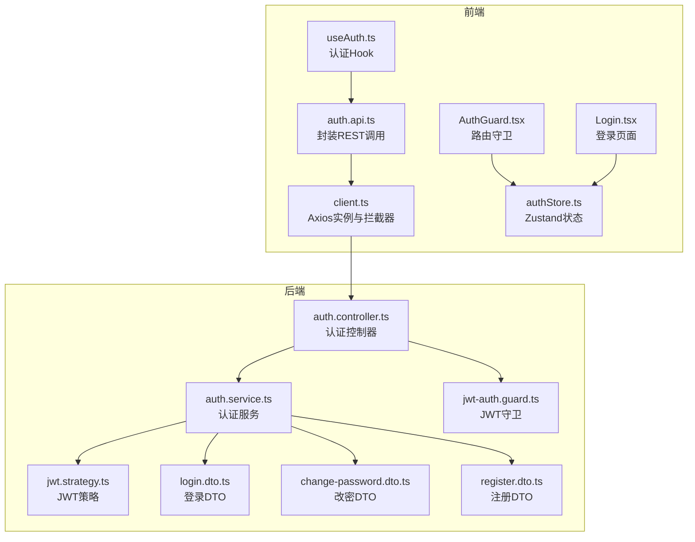
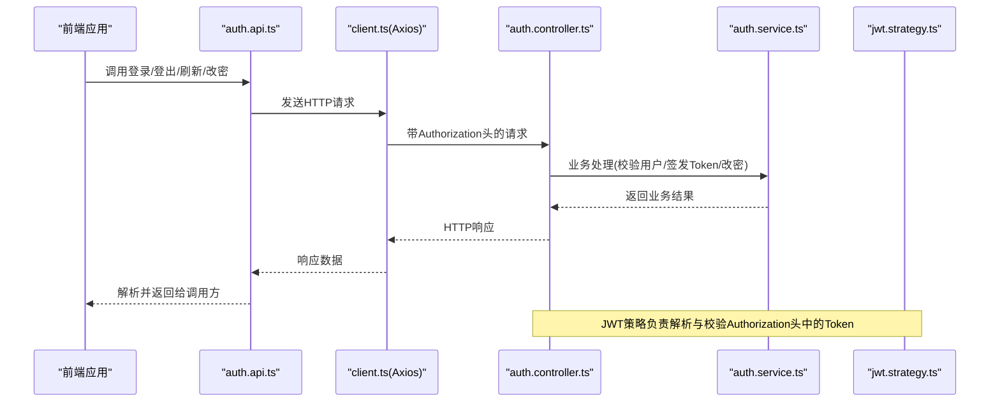
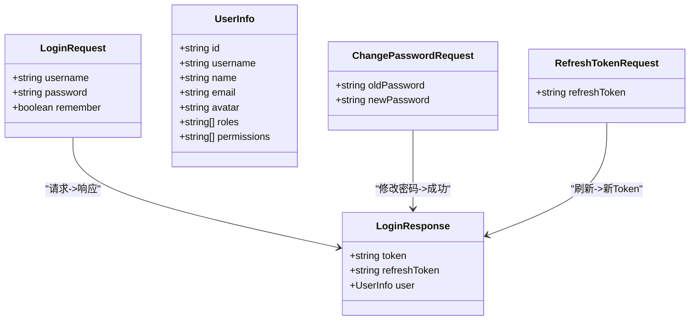
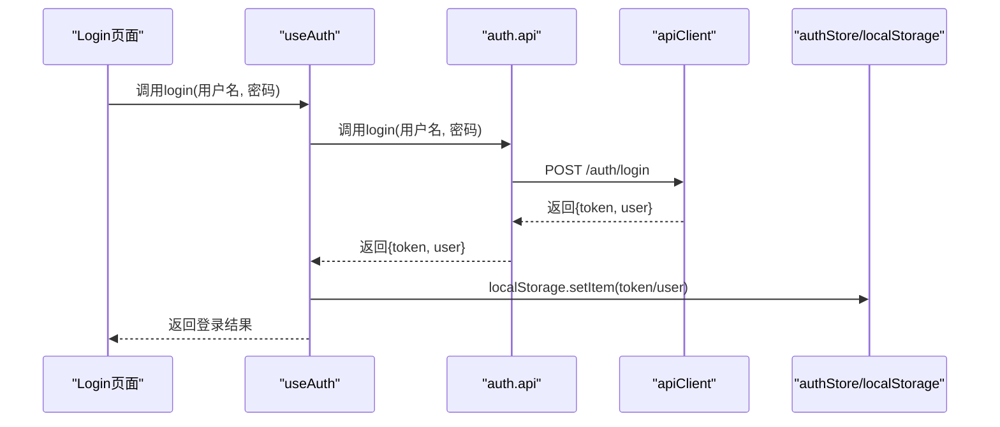
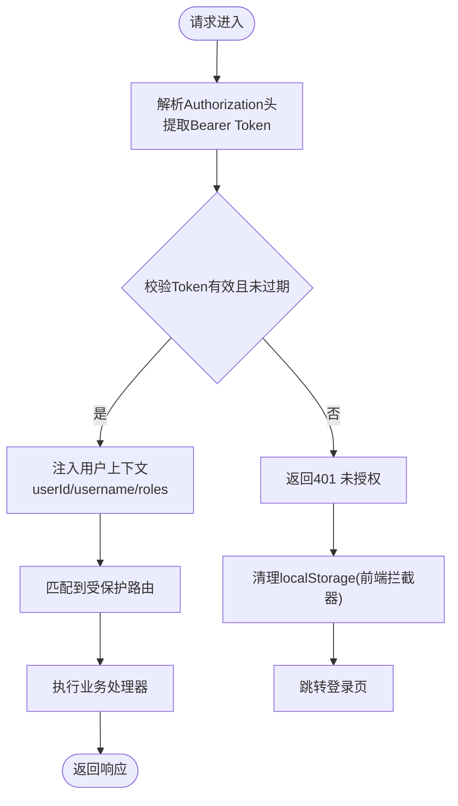
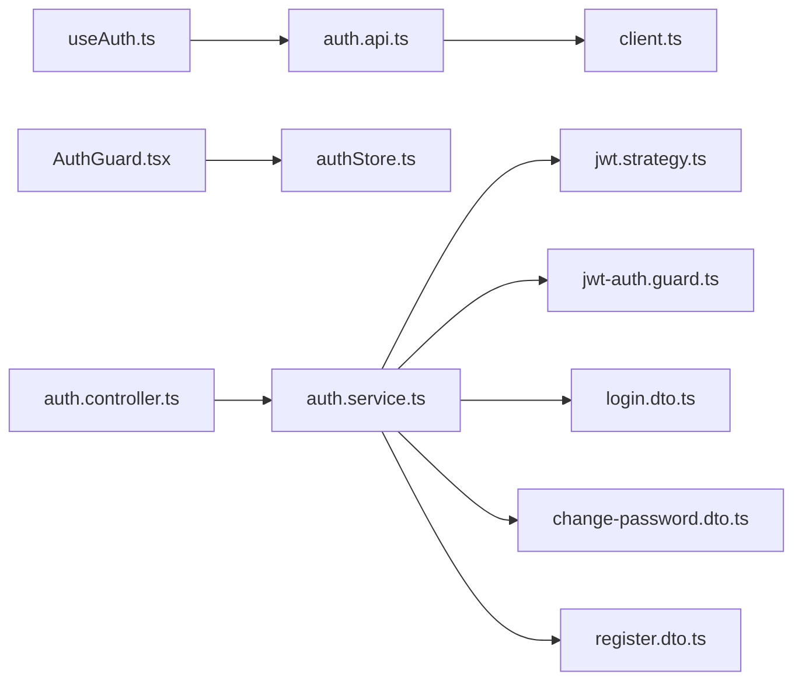

# 认证API

<cite>
**本文引用的文件**
- [auth.api.ts](file://src/api/modules/auth.api.ts)
- [auth.types.ts](file://src/api/types/auth.types.ts)
- [client.ts](file://src/api/client.ts)
- [useAuth.ts](file://src/hooks/useAuth.ts)
- [AuthGuard.tsx](file://src/components/guard/AuthGuard.tsx)
- [Login.tsx](file://src/pages/Login.tsx)
- [authStore.ts](file://src/store/authStore.ts)
- [auth.controller.ts](file://server/src/modules/auth/auth.controller.ts)
- [auth.service.ts](file://server/src/modules/auth/auth.service.ts)
- [jwt.strategy.ts](file://server/src/modules/auth/strategies/jwt.strategy.ts)
- [jwt-auth.guard.ts](file://server/src/modules/auth/guards/jwt-auth.guard.ts)
- [login.dto.ts](file://server/src/modules/auth/dto/login.dto.ts)
- [change-password.dto.ts](file://server/src/modules/auth/dto/change-password.dto.ts)
- [register.dto.ts](file://server/src/modules/auth/dto/register.dto.ts)
</cite>

## 目录
1. [简介](#简介)
2. [项目结构](#项目结构)
3. [核心组件](#核心组件)
4. [架构总览](#架构总览)
5. [详细组件分析](#详细组件分析)
6. [依赖关系分析](#依赖关系分析)
7. [性能与安全考量](#性能与安全考量)
8. [故障排查指南](#故障排查指南)
9. [结论](#结论)
10. [附录](#附录)

## 简介
本文件为预算管理系统的认证API提供完整、可操作的接口文档，覆盖用户登录、登出、Token刷新、获取当前用户信息以及修改密码等核心能力。文档同时说明JWT令牌的使用方式、认证头设置、Token过期处理机制、参数校验规则与安全注意事项，并对前端认证中间件与权限验证流程进行说明。

## 项目结构
认证相关代码在前后端分别实现：
- 前端侧通过API模块封装REST调用，使用Axios客户端统一添加认证头；通过自定义Hook集中处理登录态与用户信息；通过路由守卫控制页面访问。
- 后端侧通过NestJS控制器暴露认证接口，使用Passport JWT策略进行鉴权，服务层完成用户校验、Token签发与密码变更逻辑。

图表来源
- [auth.api.ts:1-50](file://src/api/modules/auth.api.ts#L1-L50)
- [client.ts:1-183](file://src/api/client.ts#L1-L183)
- [useAuth.ts:1-84](file://src/hooks/useAuth.ts#L1-L84)
- [AuthGuard.tsx:1-31](file://src/components/guard/AuthGuard.tsx#L1-L31)
- [Login.tsx:1-102](file://src/pages/Login.tsx#L1-L102)
- [authStore.ts:1-31](file://src/store/authStore.ts#L1-L31)
- [auth.controller.ts:1-62](file://server/src/modules/auth/auth.controller.ts#L1-L62)
- [auth.service.ts:1-229](file://server/src/modules/auth/auth.service.ts#L1-L229)
- [jwt.strategy.ts:1-24](file://server/src/modules/auth/strategies/jwt.strategy.ts#L1-L24)
- [jwt-auth.guard.ts:1-5](file://server/src/modules/auth/guards/jwt-auth.guard.ts#L1-L5)
- [login.dto.ts:1-21](file://server/src/modules/auth/dto/login.dto.ts#L1-L21)
- [change-password.dto.ts:1-16](file://server/src/modules/auth/dto/change-password.dto.ts#L1-L16)
- [register.dto.ts:1-34](file://server/src/modules/auth/dto/register.dto.ts#L1-L34)

章节来源
- [auth.api.ts:1-50](file://src/api/modules/auth.api.ts#L1-L50)
- [client.ts:1-183](file://src/api/client.ts#L1-L183)
- [useAuth.ts:1-84](file://src/hooks/useAuth.ts#L1-L84)
- [AuthGuard.tsx:1-31](file://src/components/guard/AuthGuard.tsx#L1-L31)
- [Login.tsx:1-102](file://src/pages/Login.tsx#L1-L102)
- [authStore.ts:1-31](file://src/store/authStore.ts#L1-L31)
- [auth.controller.ts:1-62](file://server/src/modules/auth/auth.controller.ts#L1-L62)
- [auth.service.ts:1-229](file://server/src/modules/auth/auth.service.ts#L1-L229)
- [jwt.strategy.ts:1-24](file://server/src/modules/auth/strategies/jwt.strategy.ts#L1-L24)
- [jwt-auth.guard.ts:1-5](file://server/src/modules/auth/guards/jwt-auth.guard.ts#L1-L5)
- [login.dto.ts:1-21](file://server/src/modules/auth/dto/login.dto.ts#L1-L21)
- [change-password.dto.ts:1-16](file://server/src/modules/auth/dto/change-password.dto.ts#L1-L16)
- [register.dto.ts:1-34](file://server/src/modules/auth/dto/register.dto.ts#L1-L34)

## 核心组件
- 前端API模块：封装登录、登出、刷新Token、获取当前用户、修改密码等REST接口调用。
- Axios客户端：自动注入Authorization头，统一处理401未授权并重定向至登录页。
- 自定义Hook：集中处理登录成功后的Token与用户信息持久化、登出清理、获取当前用户信息、判断登录态与读取用户信息。
- 路由守卫：基于本地Token判断访问权限，保护受保护页面。
- 后端控制器：暴露认证相关端点，使用JWT守卫保护需要登录的接口。
- JWT策略与守卫：从Authorization头解析JWT，校验过期与签名，注入用户上下文。
- DTO校验：使用class-validator对请求参数进行强约束。

章节来源
- [auth.api.ts:1-50](file://src/api/modules/auth.api.ts#L1-L50)
- [client.ts:1-183](file://src/api/client.ts#L1-L183)
- [useAuth.ts:1-84](file://src/hooks/useAuth.ts#L1-L84)
- [AuthGuard.tsx:1-31](file://src/components/guard/AuthGuard.tsx#L1-L31)
- [auth.controller.ts:1-62](file://server/src/modules/auth/auth.controller.ts#L1-L62)
- [jwt.strategy.ts:1-24](file://server/src/modules/auth/strategies/jwt.strategy.ts#L1-L24)
- [jwt-auth.guard.ts:1-5](file://server/src/modules/auth/guards/jwt-auth.guard.ts#L1-L5)
- [login.dto.ts:1-21](file://server/src/modules/auth/dto/login.dto.ts#L1-L21)
- [change-password.dto.ts:1-16](file://server/src/modules/auth/dto/change-password.dto.ts#L1-L16)
- [register.dto.ts:1-34](file://server/src/modules/auth/dto/register.dto.ts#L1-L34)

## 架构总览
下图展示从前端发起认证请求到后端鉴权与返回响应的整体流程。

图表来源
- [auth.api.ts:1-50](file://src/api/modules/auth.api.ts#L1-L50)
- [client.ts:1-183](file://src/api/client.ts#L1-L183)
- [auth.controller.ts:1-62](file://server/src/modules/auth/auth.controller.ts#L1-L62)
- [auth.service.ts:1-229](file://server/src/modules/auth/auth.service.ts#L1-L229)
- [jwt.strategy.ts:1-24](file://server/src/modules/auth/strategies/jwt.strategy.ts#L1-L24)

## 详细组件分析

### 接口清单与规范

- 登录
  - 方法与路径：POST /auth/login
  - 请求体字段：
    - username: string（必填）
    - password: string（必填，最小长度6）
    - remember: boolean（可选）
  - 成功响应：包含token、refreshToken与用户信息
  - 失败响应：401 未授权（用户名或密码错误）
  - 参数校验：后端使用class-validator进行非空、字符串类型与最小长度校验
  - 安全要点：密码经bcrypt校验；登录成功后更新最近登录时间
  - 前端行为：登录成功后将token与用户信息写入localStorage，并在后续请求中自动附加Authorization头

- 刷新Token
  - 方法与路径：POST /auth/refresh
  - 请求体字段：
    - refreshToken: string（必填）
  - 成功响应：返回新的token与refreshToken及用户信息
  - 失败响应：401 未授权（无效的刷新令牌）
  - 参数校验：后端校验refreshToken有效性与用户状态
  - 安全要点：refreshToken有效期更长，但需妥善保管

- 登出
  - 方法与路径：POST /auth/logout
  - 请求体：无
  - 成功响应：返回登出成功消息
  - 失败响应：401 未授权（Token无效或过期）
  - 安全要点：当前实现为无状态登出，建议结合黑名单策略增强安全性

- 获取当前用户信息
  - 方法与路径：GET /auth/me
  - 请求头：Authorization: Bearer <token>
  - 成功响应：返回当前用户信息（含id、username、name、email、avatar、roles、permissions）
  - 失败响应：401 未授权（Token无效或过期）

- 修改密码
  - 方法与路径：PUT /auth/password
  - 请求头：Authorization: Bearer <token>
  - 请求体字段：
    - oldPassword: string（必填，最小长度6）
    - newPassword: string（必填，最小长度6）
  - 成功响应：返回修改成功消息
  - 失败响应：401 未授权（旧密码错误）、404 用户不存在

章节来源
- [auth.controller.ts:14-60](file://server/src/modules/auth/auth.controller.ts#L14-L60)
- [auth.service.ts:18-204](file://server/src/modules/auth/auth.service.ts#L18-L204)
- [login.dto.ts:4-20](file://server/src/modules/auth/dto/login.dto.ts#L4-L20)
- [change-password.dto.ts:4-15](file://server/src/modules/auth/dto/change-password.dto.ts#L4-L15)
- [auth.types.ts:5-34](file://src/api/types/auth.types.ts#L5-L34)
- [auth.api.ts:18-48](file://src/api/modules/auth.api.ts#L18-L48)
- [client.ts:22-44](file://src/api/client.ts#L22-L44)

### 数据模型

图表来源
- [auth.types.ts:5-34](file://src/api/types/auth.types.ts#L5-L34)

章节来源
- [auth.types.ts:1-44](file://src/api/types/auth.types.ts#L1-L44)

### 前端调用序列

图表来源
- [Login.tsx:14-38](file://src/pages/Login.tsx#L14-L38)
- [useAuth.ts:12-21](file://src/hooks/useAuth.ts#L12-L21)
- [auth.api.ts:18-19](file://src/api/modules/auth.api.ts#L18-L19)
- [client.ts:22-28](file://src/api/client.ts#L22-L28)
- [authStore.ts:19-26](file://src/store/authStore.ts#L19-L26)

章节来源
- [Login.tsx:1-102](file://src/pages/Login.tsx#L1-L102)
- [useAuth.ts:1-84](file://src/hooks/useAuth.ts#L1-L84)
- [auth.api.ts:1-50](file://src/api/modules/auth.api.ts#L1-L50)
- [client.ts:1-183](file://src/api/client.ts#L1-L183)
- [authStore.ts:1-31](file://src/store/authStore.ts#L1-L31)

### 后端鉴权流程

图表来源
- [jwt.strategy.ts:8-23](file://server/src/modules/auth/strategies/jwt.strategy.ts#L8-L23)
- [jwt-auth.guard.ts:1-5](file://server/src/modules/auth/guards/jwt-auth.guard.ts#L1-L5)
- [client.ts:61-66](file://src/api/client.ts#L61-L66)

章节来源
- [jwt.strategy.ts:1-24](file://server/src/modules/auth/strategies/jwt.strategy.ts#L1-L24)
- [jwt-auth.guard.ts:1-5](file://server/src/modules/auth/guards/jwt-auth.guard.ts#L1-L5)
- [client.ts:52-94](file://src/api/client.ts#L52-L94)

### 参数校验与错误码

- 登录
  - 参数校验：用户名非空、字符串；密码非空、字符串、最小长度6；remember可选布尔值
  - 错误码：401 未授权（用户名或密码错误）

- 注册
  - 参数校验：用户名非空、字符串、最小长度3；密码非空、字符串、最小长度6；姓名非空；邮箱/手机号可选
  - 错误码：400 用户名已存在

- 修改密码
  - 参数校验：旧密码与新密码均非空、字符串、最小长度6
  - 错误码：401 未授权（旧密码错误或用户不存在）

- 刷新Token
  - 参数校验：refreshToken非空
  - 错误码：401 未授权（无效的刷新令牌）

章节来源
- [login.dto.ts:4-20](file://server/src/modules/auth/dto/login.dto.ts#L4-L20)
- [register.dto.ts:4-33](file://server/src/modules/auth/dto/register.dto.ts#L4-L33)
- [change-password.dto.ts:4-15](file://server/src/modules/auth/dto/change-password.dto.ts#L4-L15)
- [auth.service.ts:96-138](file://server/src/modules/auth/auth.service.ts#L96-L138)
- [auth.service.ts:143-168](file://server/src/modules/auth/auth.service.ts#L143-L168)
- [auth.service.ts:173-204](file://server/src/modules/auth/auth.service.ts#L173-L204)

### 安全与最佳实践
- Token使用
  - Authorization头格式：Bearer <token>
  - 前端自动在每次请求中附加该头
  - 后端通过Passport JWT策略解析并校验
- Token过期处理
  - 前端拦截器遇到401时清除localStorage中的token与用户信息，并跳转登录页
  - 建议使用refreshToken在过期前刷新，避免频繁登录
- 密码安全
  - 登录与改密均使用bcrypt进行哈希校验
  - 建议引入密码复杂度策略与历史密码限制
- 会话管理
  - 当前为无状态登出，建议引入黑名单策略或短期会话配合刷新机制

章节来源
- [client.ts:22-28](file://src/api/client.ts#L22-L28)
- [client.ts:61-66](file://src/api/client.ts#L61-L66)
- [jwt.strategy.ts:8-14](file://server/src/modules/auth/strategies/jwt.strategy.ts#L8-L14)
- [auth.service.ts:43-47](file://server/src/modules/auth/auth.service.ts#L43-L47)
- [auth.service.ts:158-165](file://server/src/modules/auth/auth.service.ts#L158-L165)

## 依赖关系分析

图表来源
- [auth.api.ts:1-50](file://src/api/modules/auth.api.ts#L1-L50)
- [client.ts:1-183](file://src/api/client.ts#L1-L183)
- [useAuth.ts:1-84](file://src/hooks/useAuth.ts#L1-L84)
- [AuthGuard.tsx:1-31](file://src/components/guard/AuthGuard.tsx#L1-L31)
- [authStore.ts:1-31](file://src/store/authStore.ts#L1-L31)
- [auth.controller.ts:1-62](file://server/src/modules/auth/auth.controller.ts#L1-L62)
- [auth.service.ts:1-229](file://server/src/modules/auth/auth.service.ts#L1-L229)
- [jwt.strategy.ts:1-24](file://server/src/modules/auth/strategies/jwt.strategy.ts#L1-L24)
- [jwt-auth.guard.ts:1-5](file://server/src/modules/auth/guards/jwt-auth.guard.ts#L1-L5)
- [login.dto.ts:1-21](file://server/src/modules/auth/dto/login.dto.ts#L1-L21)
- [change-password.dto.ts:1-16](file://server/src/modules/auth/dto/change-password.dto.ts#L1-L16)
- [register.dto.ts:1-34](file://server/src/modules/auth/dto/register.dto.ts#L1-L34)

章节来源
- [auth.api.ts:1-50](file://src/api/modules/auth.api.ts#L1-L50)
- [client.ts:1-183](file://src/api/client.ts#L1-L183)
- [useAuth.ts:1-84](file://src/hooks/useAuth.ts#L1-L84)
- [AuthGuard.tsx:1-31](file://src/components/guard/AuthGuard.tsx#L1-L31)
- [authStore.ts:1-31](file://src/store/authStore.ts#L1-L31)
- [auth.controller.ts:1-62](file://server/src/modules/auth/auth.controller.ts#L1-L62)
- [auth.service.ts:1-229](file://server/src/modules/auth/auth.service.ts#L1-L229)
- [jwt.strategy.ts:1-24](file://server/src/modules/auth/strategies/jwt.strategy.ts#L1-L24)
- [jwt-auth.guard.ts:1-5](file://server/src/modules/auth/guards/jwt-auth.guard.ts#L1-L5)
- [login.dto.ts:1-21](file://server/src/modules/auth/dto/login.dto.ts#L1-L21)
- [change-password.dto.ts:1-16](file://server/src/modules/auth/dto/change-password.dto.ts#L1-L16)
- [register.dto.ts:1-34](file://server/src/modules/auth/dto/register.dto.ts#L1-L34)

## 性能与安全考量
- 性能
  - 使用Axios统一拦截器减少重复代码，提升一致性与可维护性
  - 前端按需调用接口，避免不必要的请求
- 安全
  - 强制使用HTTPS传输，避免Token在传输过程中被窃取
  - 建议启用CORS白名单与安全响应头
  - 对敏感操作（改密、登出）建议增加二次确认与审计日志
  - 建议引入刷新Token黑名单、IP绑定与设备指纹等高级防护

## 故障排查指南
- 登录后仍提示未授权
  - 检查Authorization头是否正确附加（Bearer <token>）
  - 确认localStorage中是否存在token
  - 若出现401，前端拦截器会自动清除token并跳转登录页
- Token过期频繁
  - 建议在前端实现刷新Token逻辑，在过期前主动刷新
  - 合理设置expiresIn与refreshExpiresIn
- 修改密码失败
  - 确认旧密码输入正确
  - 确认新密码满足最小长度要求
- 登出无效
  - 当前为无状态登出，建议结合黑名单策略或服务端会话管理

章节来源
- [client.ts:52-94](file://src/api/client.ts#L52-L94)
- [useAuth.ts:26-36](file://src/hooks/useAuth.ts#L26-L36)
- [auth.service.ts:143-168](file://server/src/modules/auth/auth.service.ts#L143-L168)

## 结论
本认证API通过前后端协同实现了标准的JWT认证流程：前端负责请求封装与登录态管理，后端负责用户校验与Token签发。通过路由守卫与拦截器确保了受保护资源的安全访问。建议在生产环境中进一步完善Token黑名单、密码策略与审计日志等安全措施。

## 附录

### 请求与响应示例（路径引用）
- 登录请求示例：[auth.api.ts:18-19](file://src/api/modules/auth.api.ts#L18-L19)
- 登录响应示例：[auth.service.ts:65-91](file://server/src/modules/auth/auth.service.ts#L65-L91)
- 获取当前用户请求示例：[auth.api.ts:39-40](file://src/api/modules/auth.api.ts#L39-L40)
- 获取当前用户响应示例：[auth.types.ts:17-25](file://src/api/types/auth.types.ts#L17-L25)
- 修改密码请求示例：[auth.api.ts:46-47](file://src/api/modules/auth.api.ts#L46-L47)
- 修改密码响应示例：[auth.service.ts:143-168](file://server/src/modules/auth/auth.service.ts#L143-L168)

### 参数校验规则（路径引用）
- 登录DTO校验：[login.dto.ts:4-20](file://server/src/modules/auth/dto/login.dto.ts#L4-L20)
- 注册DTO校验：[register.dto.ts:4-33](file://server/src/modules/auth/dto/register.dto.ts#L4-L33)
- 修改密码DTO校验：[change-password.dto.ts:4-15](file://server/src/modules/auth/dto/change-password.dto.ts#L4-L15)