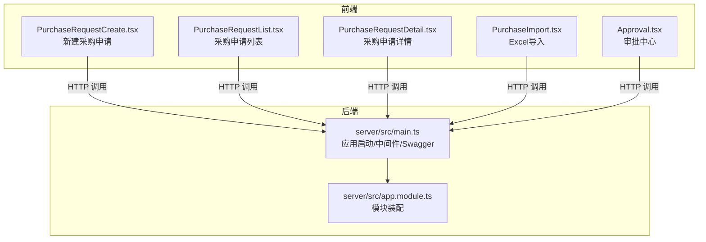
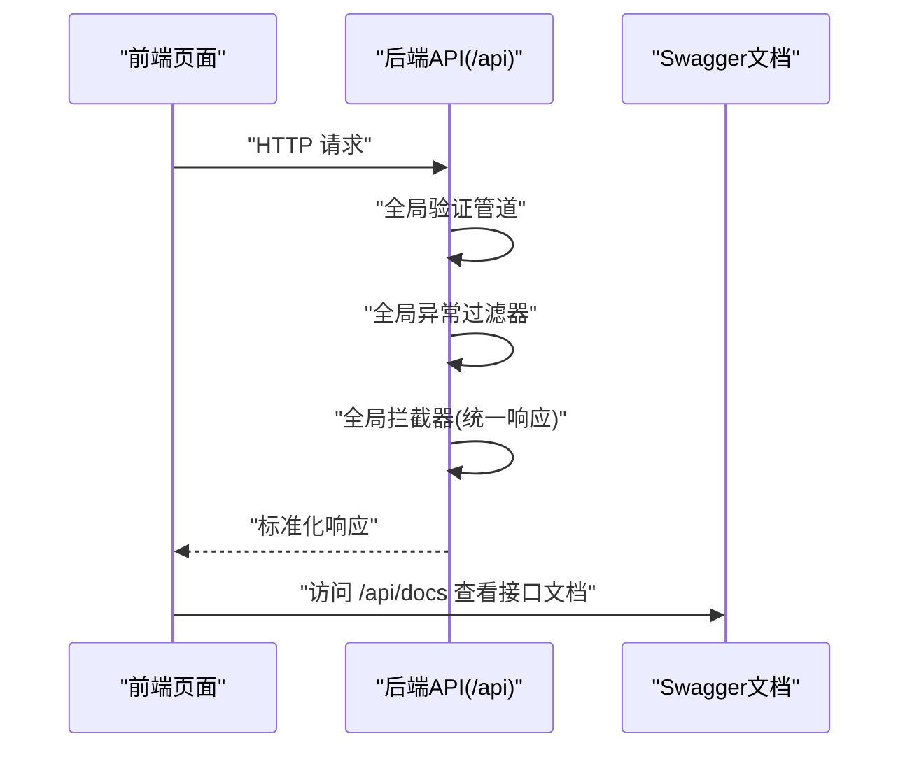
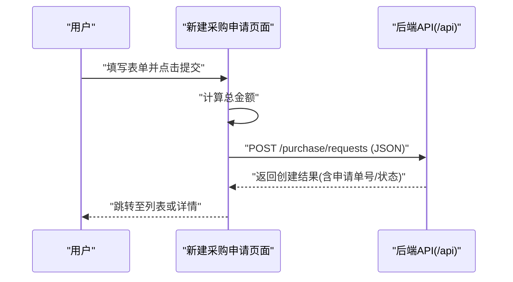
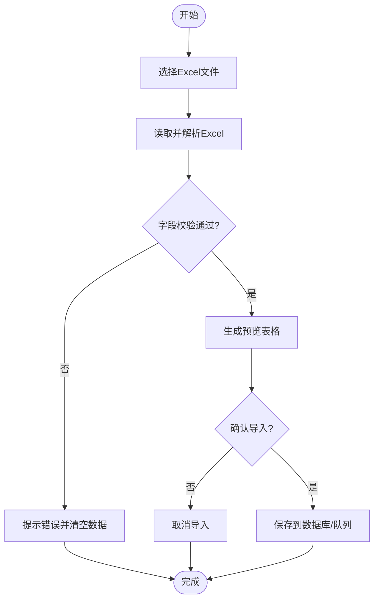
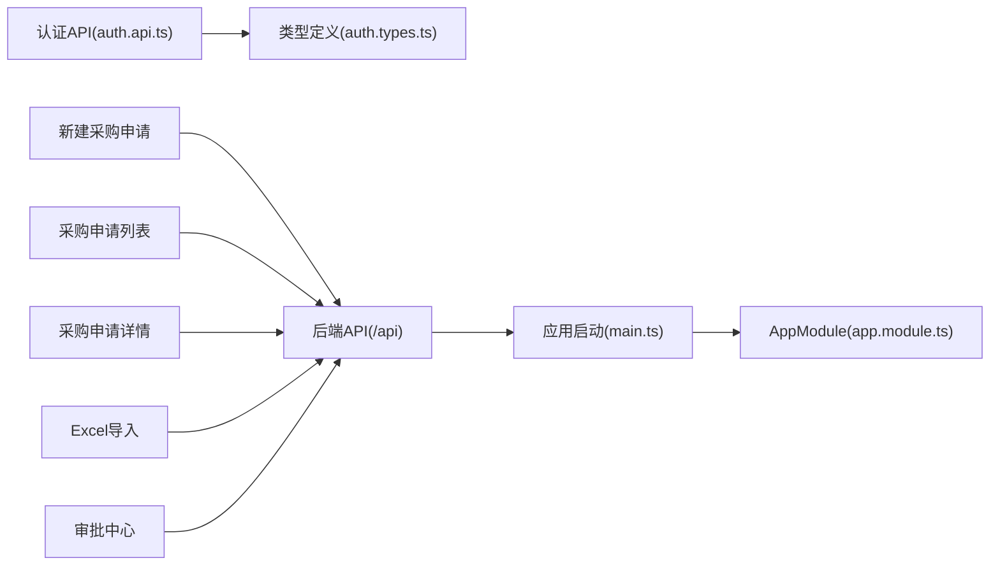

# 采购管理API

<cite>
**本文引用的文件**
- [server/src/main.ts](file://server/src/main.ts)
- [server/src/app.module.ts](file://server/src/app.module.ts)
- [src/api/modules/auth.api.ts](file://src/api/modules/auth.api.ts)
- [src/api/types/auth.types.ts](file://src/api/types/auth.types.ts)
- [src/pages/PurchaseRequestCreate.tsx](file://src/pages/PurchaseRequestCreate.tsx)
- [src/pages/PurchaseRequestList.tsx](file://src/pages/PurchaseRequestList.tsx)
- [src/pages/PurchaseRequestDetail.tsx](file://src/pages/PurchaseRequestDetail.tsx)
- [src/pages/PurchaseImport.tsx](file://src/pages/PurchaseImport.tsx)
- [src/pages/Approval.tsx](file://src/pages/Approval.tsx)
</cite>

## 目录
1. [简介](#简介)
2. [项目结构](#项目结构)
3. [核心组件](#核心组件)
4. [架构总览](#架构总览)
5. [详细组件分析](#详细组件分析)
6. [依赖关系分析](#依赖关系分析)
7. [性能考虑](#性能考虑)
8. [故障排查指南](#故障排查指南)
9. [结论](#结论)
10. [附录](#附录)

## 简介
本文件为“企业预算管理系统”中的采购管理API提供完整、可操作的接口文档与最佳实践指南。内容覆盖采购申请的创建、查询、详情、状态更新，Excel批量导入、结算数据导入，以及采购审批流程（通过、拒绝、撤回）等核心能力，并对采购项目管理与统计分析等辅助功能给出API规范建议。文档同时提供请求参数说明、响应格式定义、错误处理机制、调用示例与最佳实践。

## 项目结构
前端采用React + Vite构建，后端采用NestJS，全局启用Swagger文档、统一异常过滤器与全局拦截器。采购管理相关页面位于src/pages下，包括采购申请创建、列表、详情、Excel导入、审批中心等；认证相关API位于src/api/modules与src/api/types中。

图表来源
- [server/src/main.ts:1-59](file://server/src/main.ts#L1-L59)
- [server/src/app.module.ts:1-26](file://server/src/app.module.ts#L1-L26)
- [src/pages/PurchaseRequestCreate.tsx:1-202](file://src/pages/PurchaseRequestCreate.tsx#L1-L202)
- [src/pages/PurchaseRequestList.tsx:1-212](file://src/pages/PurchaseRequestList.tsx#L1-L212)
- [src/pages/PurchaseRequestDetail.tsx:1-219](file://src/pages/PurchaseRequestDetail.tsx#L1-L219)
- [src/pages/PurchaseImport.tsx:1-170](file://src/pages/PurchaseImport.tsx#L1-L170)
- [src/pages/Approval.tsx:1-99](file://src/pages/Approval.tsx#L1-L99)

章节来源
- [server/src/main.ts:1-59](file://server/src/main.ts#L1-L59)
- [server/src/app.module.ts:1-26](file://server/src/app.module.ts#L1-L26)

## 核心组件
- 应用启动与中间件
  - 全局前缀：/api
  - CORS：按环境变量配置
  - 全局验证管道：白名单、非装饰字段禁止、自动类型转换
  - 全局异常过滤器：统一错误响应
  - 全局拦截器：统一响应包装
  - Swagger：/api/docs
- 认证API（示例）
  - 登录、登出、刷新Token、获取当前用户、修改密码
- 采购管理页面（前端演示）
  - 新建采购申请、列表、详情、Excel导入、审批中心

章节来源
- [server/src/main.ts:1-59](file://server/src/main.ts#L1-L59)
- [src/api/modules/auth.api.ts:1-50](file://src/api/modules/auth.api.ts#L1-L50)
- [src/api/types/auth.types.ts:1-44](file://src/api/types/auth.types.ts#L1-L44)
- [src/pages/PurchaseRequestCreate.tsx:1-202](file://src/pages/PurchaseRequestCreate.tsx#L1-L202)
- [src/pages/PurchaseRequestList.tsx:1-212](file://src/pages/PurchaseRequestList.tsx#L1-L212)
- [src/pages/PurchaseRequestDetail.tsx:1-219](file://src/pages/PurchaseRequestDetail.tsx#L1-L219)
- [src/pages/PurchaseImport.tsx:1-170](file://src/pages/PurchaseImport.tsx#L1-L170)
- [src/pages/Approval.tsx:1-99](file://src/pages/Approval.tsx#L1-L99)

## 架构总览
系统采用前后端分离架构：前端负责UI与交互，后端提供REST API与文档。全局中间件确保请求校验、异常捕获与响应格式统一。认证API用于用户登录与会话管理，采购相关页面通过HTTP客户端发起请求并与后端交互。

图表来源
- [server/src/main.ts:1-59](file://server/src/main.ts#L1-L59)

章节来源
- [server/src/main.ts:1-59](file://server/src/main.ts#L1-L59)

## 详细组件分析

### 采购申请创建
- 功能概述
  - 前端表单收集预算条目、物品明细、数量、单价、用途等信息
  - 计算总金额并展示大写金额
  - 支持保存草稿与提交申请
- 关键字段
  - 预算条目标识、物品名称、规格型号、数量、单价、用途说明
- 调用流程（概念示意）

- 请求参数（示例字段）
  - 预算条目标识、物品名称、规格型号、数量、单价、用途说明
- 响应格式（示例）
  - 成功：包含申请单号、状态、创建时间
  - 失败：错误码、错误消息
- 最佳实践
  - 使用全局验证管道保证字段合法性
  - 前端进行基础校验（必填、数值范围），后端再次校验
  - 提交后立即跳转至详情页以便跟踪审批进度

章节来源
- [src/pages/PurchaseRequestCreate.tsx:1-202](file://src/pages/PurchaseRequestCreate.tsx#L1-L202)

### 采购申请查询
- 功能概述
  - 支持按申请单号、申请人等条件筛选
  - 支持按状态过滤（草稿、审批中、已批准、已拒绝）
  - 展示金额、当前审批步骤、申请日期等关键信息
- 查询参数（示例）
  - 关键词搜索、状态过滤、分页参数
- 响应格式（示例）
  - 列表项包含申请单号、申请人、部门、物品、金额、当前步骤、状态、申请日期
- 最佳实践
  - 使用分页查询避免一次性加载过多数据
  - 对关键词与状态进行白名单校验

章节来源
- [src/pages/PurchaseRequestList.tsx:1-212](file://src/pages/PurchaseRequestList.tsx#L1-L212)

### 采购申请详情
- 功能概述
  - 展示申请基本信息、关联预算条目、采购明细、审批流程
  - 当前审批节点允许审批操作（批准/拒绝）
- 关键字段
  - 申请单号、申请人、部门、预算编号、物品明细、总金额、用途说明、审批步骤、状态
- 审批流程（五级）
  - 需求人提交 → 部门负责人 → 预算管理员 → 财务 → 采购部
- 最佳实践
  - 仅在当前步骤显示审批按钮
  - 审批意见必填或可选，建议默认为空

章节来源
- [src/pages/PurchaseRequestDetail.tsx:1-219](file://src/pages/PurchaseRequestDetail.tsx#L1-L219)

### 采购申请状态更新
- 功能概述
  - 支持审批通过、拒绝、撤回等状态变更
  - 更新审批流程中的当前步骤与状态
- 接口设计（示例）
  - POST /purchase/requests/{id}/approve
  - POST /purchase/requests/{id}/reject
  - POST /purchase/requests/{id}/withdraw
- 请求参数（示例）
  - 审批意见、操作人信息
- 响应格式（示例）
  - 成功：返回最新状态与当前审批步骤
  - 失败：返回错误码与错误消息

章节来源
- [src/pages/PurchaseRequestDetail.tsx:1-219](file://src/pages/PurchaseRequestDetail.tsx#L1-L219)

### Excel数据导入（采购订单）
- 功能概述
  - 支持上传Excel文件，解析并预览数据
  - 支持下载导入模板
- 文件字段映射（示例）
  - 订单号、供应商、金额、日期、状态、预算编号
- 流程示意

- 最佳实践
  - 限制文件大小与格式
  - 字段缺失时提供默认值或报错
  - 导入成功后清空文件输入并提示数量

章节来源
- [src/pages/PurchaseImport.tsx:1-170](file://src/pages/PurchaseImport.tsx#L1-L170)

### 结算数据导入（建议）
- 功能概述
  - 支持上传结算Excel，解析结算金额、结算日期、结算状态等
  - 与采购申请关联，更新状态与结算信息
- 字段建议
  - 采购申请单号、结算金额、结算日期、结算状态、备注
- 最佳实践
  - 与采购申请状态联动，仅允许已批准的申请进行结算
  - 导入幂等性处理，避免重复结算

（本节为规范建议，不直接对应具体源码文件）

### 采购审批流程API（建议）
- 端点设计（示例）
  - GET /purchase/requests/{id}/approvals — 获取审批历史
  - POST /purchase/requests/{id}/approve — 审批通过
  - POST /purchase/requests/{id}/reject — 审批拒绝
  - POST /purchase/requests/{id}/withdraw — 撤回申请
- 参数与响应
  - 审批意见、操作人、审批时间
  - 返回最新状态与当前步骤
- 最佳实践
  - 严格校验当前审批人权限
  - 记录审批日志便于审计

（本节为规范建议，不直接对应具体源码文件）

### 采购项目管理与统计分析（建议）
- 项目管理
  - 新建/编辑/删除预算条目
  - 预算条目与采购申请关联
- 统计分析
  - 申请量、金额、状态分布
  - 部门维度、时间维度统计
- 最佳实践
  - 提供分页与筛选参数
  - 支持导出统计报表

（本节为规范建议，不直接对应具体源码文件）

## 依赖关系分析
- 前端页面依赖HTTP客户端发起请求
- 后端通过全局中间件统一处理请求与响应
- 认证API提供登录、登出、刷新Token等能力

图表来源
- [src/api/modules/auth.api.ts:1-50](file://src/api/modules/auth.api.ts#L1-L50)
- [src/api/types/auth.types.ts:1-44](file://src/api/types/auth.types.ts#L1-L44)
- [src/pages/PurchaseRequestCreate.tsx:1-202](file://src/pages/PurchaseRequestCreate.tsx#L1-L202)
- [src/pages/PurchaseRequestList.tsx:1-212](file://src/pages/PurchaseRequestList.tsx#L1-L212)
- [src/pages/PurchaseRequestDetail.tsx:1-219](file://src/pages/PurchaseRequestDetail.tsx#L1-L219)
- [src/pages/PurchaseImport.tsx:1-170](file://src/pages/PurchaseImport.tsx#L1-L170)
- [src/pages/Approval.tsx:1-99](file://src/pages/Approval.tsx#L1-L99)
- [server/src/main.ts:1-59](file://server/src/main.ts#L1-L59)
- [server/src/app.module.ts:1-26](file://server/src/app.module.ts#L1-L26)

章节来源
- [src/api/modules/auth.api.ts:1-50](file://src/api/modules/auth.api.ts#L1-L50)
- [src/api/types/auth.types.ts:1-44](file://src/api/types/auth.types.ts#L1-L44)
- [server/src/main.ts:1-59](file://server/src/main.ts#L1-L59)
- [server/src/app.module.ts:1-26](file://server/src/app.module.ts#L1-L26)

## 性能考虑
- 分页查询：列表接口必须支持分页，避免一次性传输大量数据
- 缓存策略：对静态配置与只读数据进行缓存
- 并发控制：审批接口需加锁或乐观锁，防止并发状态冲突
- 文件上传：限制文件大小与并发数，解析过程异步化
- 响应压缩：开启Gzip压缩以降低带宽占用

## 故障排查指南
- 常见错误
  - 参数校验失败：检查必填字段与类型
  - 权限不足：确认Token有效与角色权限
  - 文件格式错误：确保Excel列名与顺序正确
- 日志与监控
  - 记录请求ID、用户ID、操作时间、耗时
  - 对异常进行统一捕获并返回标准错误格式
- 调试建议
  - 使用Swagger文档调试接口
  - 前端打印请求与响应，定位问题

章节来源
- [server/src/main.ts:1-59](file://server/src/main.ts#L1-L59)

## 结论
本文档基于现有前端页面与后端启动配置，给出了采购管理API的接口规范、调用流程、参数与响应格式、错误处理与最佳实践。后续可在后端完善具体的控制器与服务层实现，并补充认证、审批、导入等接口的具体路由与业务逻辑。

## 附录
- 调用示例（概念）
  - 新建采购申请：POST /api/purchase/requests
  - 查询申请列表：GET /api/purchase/requests
  - 获取申请详情：GET /api/purchase/requests/{id}
  - 审批通过：POST /api/purchase/requests/{id}/approve
  - 审批拒绝：POST /api/purchase/requests/{id}/reject
  - 撤回申请：POST /api/purchase/requests/{id}/withdraw
  - Excel导入：POST /api/purchase/import/orders
  - 认证相关：POST /api/auth/login、POST /api/auth/logout、POST /api/auth/refresh、GET /api/auth/me、PUT /api/auth/password