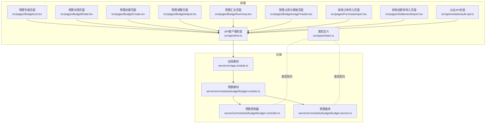
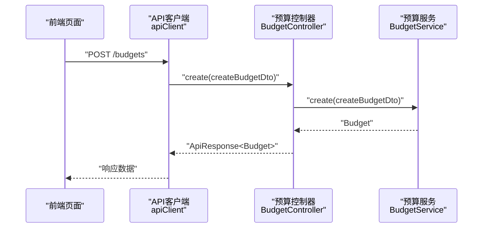
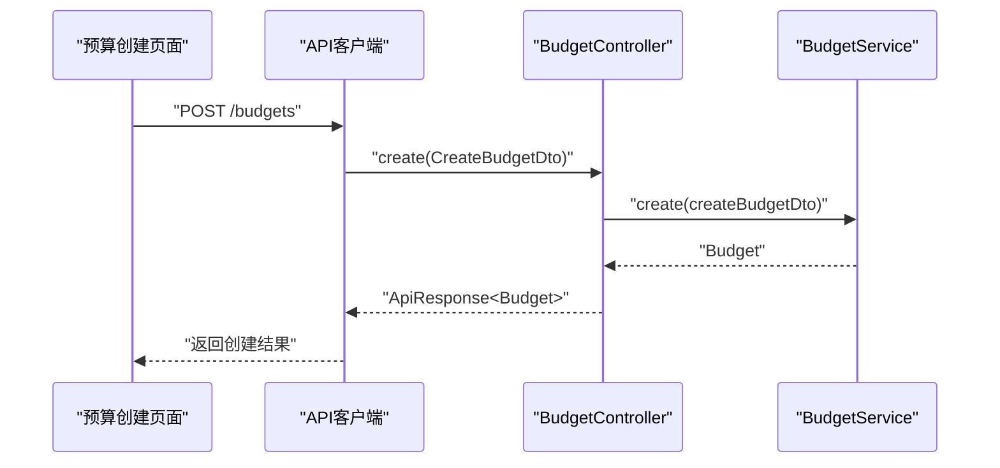
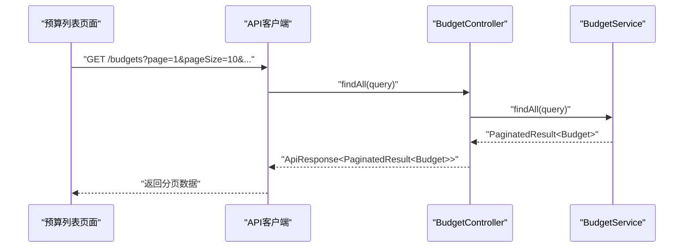
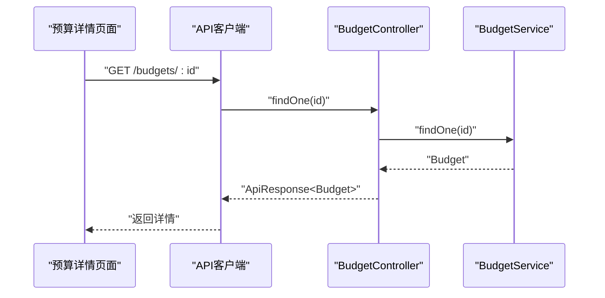
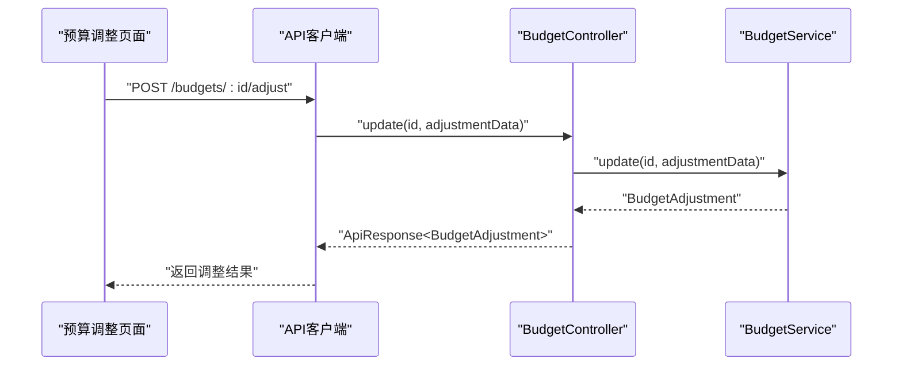
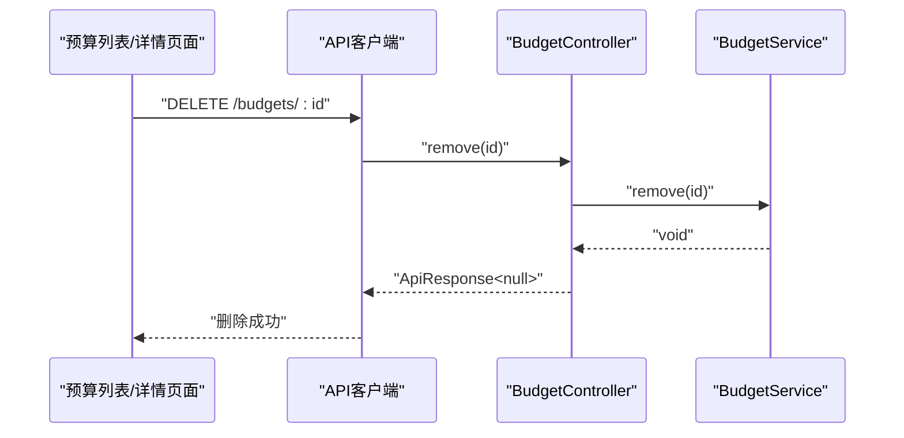
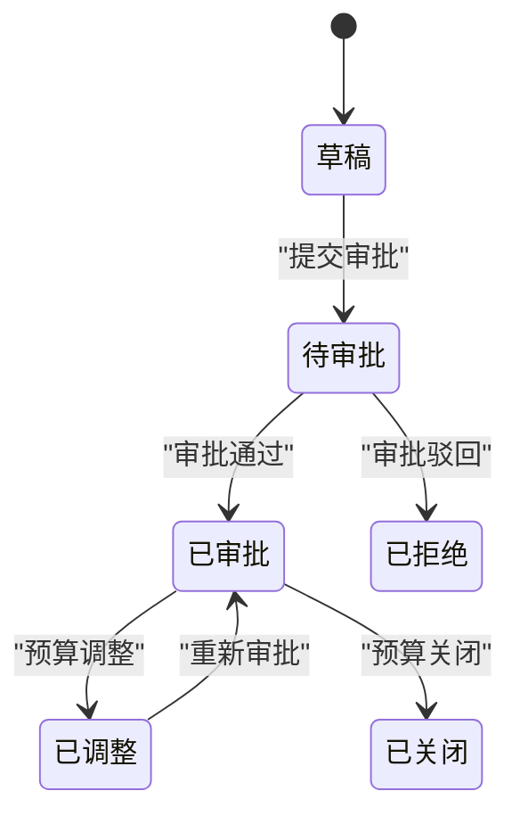
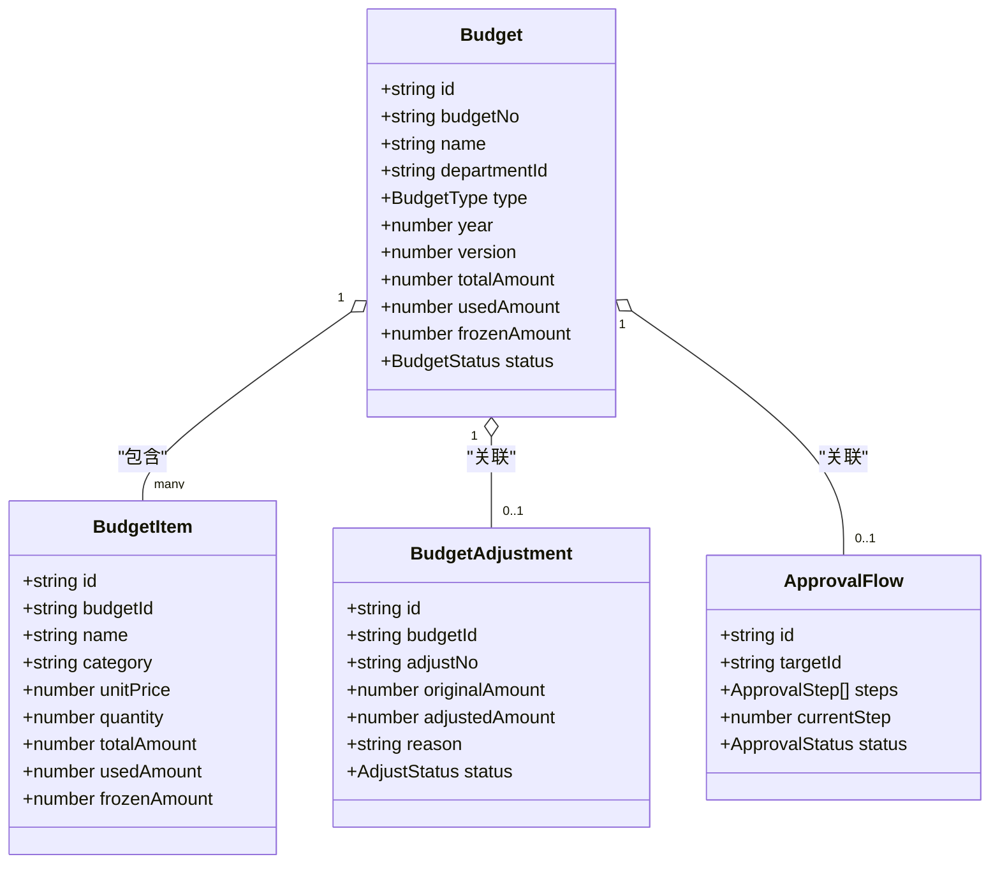

# 预算管理API

<cite>
**本文引用的文件**
- [src/api/modules/auth.api.ts](file://src/api/modules/auth.api.ts)
- [src/api/types/auth.types.ts](file://src/api/types/auth.types.ts)
- [src/api/client.ts](file://src/api/client.ts)
- [src/types/index.ts](file://src/types/index.ts)
- [src/pages/BudgetList.tsx](file://src/pages/BudgetList.tsx)
- [src/pages/BudgetDetail.tsx](file://src/pages/BudgetDetail.tsx)
- [src/pages/BudgetCreate.tsx](file://src/pages/BudgetCreate.tsx)
- [src/pages/BudgetAdjust.tsx](file://src/pages/BudgetAdjust.tsx)
- [src/pages/BudgetSummary.tsx](file://src/pages/BudgetSummary.tsx)
- [src/pages/BudgetUsageTracker.tsx](file://src/pages/BudgetUsageTracker.tsx)
- [src/pages/PurchaseImport.tsx](file://src/pages/PurchaseImport.tsx)
- [src/pages/SettlementImport.tsx](file://src/pages/SettlementImport.tsx)
- [src/router/routes.ts](file://src/router/routes.ts)
- [server/src/app.module.ts](file://server/src/app.module.ts)
- [server/src/modules/budget/budget.controller.ts](file://server/src/modules/budget/budget.controller.ts)
- [server/src/modules/budget/budget.module.ts](file://server/src/modules/budget/budget.module.ts)
- [server/src/modules/budget/budget.service.ts](file://server/src/modules/budget/budget.service.ts)
</cite>

## 目录
1. [简介](#简介)
2. [项目结构](#项目结构)
3. [核心组件](#核心组件)
4. [架构总览](#架构总览)
5. [详细组件分析](#详细组件分析)
6. [依赖关系分析](#依赖关系分析)
7. [性能考虑](#性能考虑)
8. [故障排除指南](#故障排除指南)
9. [结论](#结论)
10. [附录](#附录)

## 简介
本文件为预算管理系统的接口文档，覆盖预算生命周期管理（创建、调整、查询、详情、删除）、预算状态与审批流程、预算项目管理、预算汇总统计、预算执行监控、预算导入导出与模板管理等能力。文档面向前端与后端开发者，提供统一的请求参数、响应格式、分页与排序规则说明，并给出调用示例与错误处理建议。

## 项目结构
前端采用React + TypeScript，后端采用NestJS，数据库使用Prisma。前端通过Axios封装的apiClient进行HTTP通信，统一拦截器处理鉴权与错误；后端通过模块化组织业务逻辑，预算模块提供预算相关控制器与服务。

**图表来源**
- [src/router/routes.ts:25-121](file://src/router/routes.ts#L25-L121)
- [server/src/app.module.ts:8-25](file://server/src/app.module.ts#L8-L25)
- [server/src/modules/budget/budget.module.ts:1-11](file://server/src/modules/budget/budget.module.ts#L1-L11)
- [server/src/modules/budget/budget.controller.ts:7-60](file://server/src/modules/budget/budget.controller.ts#L7-L60)
- [server/src/modules/budget/budget.service.ts:5-20](file://server/src/modules/budget/budget.service.ts#L5-L20)

**章节来源**
- [src/router/routes.ts:25-121](file://src/router/routes.ts#L25-L121)
- [server/src/app.module.ts:8-25](file://server/src/app.module.ts#L8-L25)

## 核心组件
- API客户端封装：统一请求/响应拦截、鉴权头注入、错误处理与文件上传下载。
- 类型系统：定义预算、预算项、预算调整、审批流程、工作流模板、通知、审计日志等核心实体与枚举。
- 页面组件：预算列表、详情、创建、调整、汇总、执行监控、导入导出等UI组件。
- 后端模块：AppModule聚合模块，BudgetModule提供预算控制器与服务。

**章节来源**
- [src/api/client.ts:12-100](file://src/api/client.ts#L12-L100)
- [src/types/index.ts:80-153](file://src/types/index.ts#L80-L153)
- [server/src/app.module.ts:8-25](file://server/src/app.module.ts#L8-L25)
- [server/src/modules/budget/budget.module.ts:1-11](file://server/src/modules/budget/budget.module.ts#L1-L11)

## 架构总览
前端通过Axios实例发送HTTP请求，后端NestJS接收请求，BudgetController处理路由，BudgetService执行业务逻辑，最终返回统一格式的响应体。

**图表来源**
- [server/src/modules/budget/budget.controller.ts:15-17](file://server/src/modules/budget/budget.controller.ts#L15-L17)
- [server/src/modules/budget/budget.service.ts:11-13](file://server/src/modules/budget/budget.service.ts#L11-L13)
- [src/api/client.ts:105-118](file://src/api/client.ts#L105-L118)

## 详细组件分析

### 1) 预算创建
- 功能概述：创建新预算，支持Opex/Capex类型、指定年份与部门，包含预算明细项。
- 前端交互：BudgetCreate页面收集基本信息与明细，提交时构造请求体。
- 后端接口：BudgetController.create接收CreateBudgetDto，BudgetService.create执行持久化。
- 请求参数（示例字段）
  - 名称：字符串，必填
  - 部门：字符串，必填
  - 类型：枚举值（OPEX/CAPEX），必填
  - 年度：数字，必填
  - 明细数组：每项包含名称、类别、预算金额等
- 响应格式：统一响应体，data为创建的预算对象
- 错误处理：400参数错误、401未授权、403拒绝访问、500服务器错误

**图表来源**
- [src/pages/BudgetCreate.tsx:42-47](file://src/pages/BudgetCreate.tsx#L42-L47)
- [server/src/modules/budget/budget.controller.ts:15-17](file://server/src/modules/budget/budget.controller.ts#L15-L17)
- [server/src/modules/budget/budget.service.ts:11-13](file://server/src/modules/budget/budget.service.ts#L11-L13)

**章节来源**
- [src/pages/BudgetCreate.tsx:14-47](file://src/pages/BudgetCreate.tsx#L14-L47)
- [server/src/modules/budget/budget.controller.ts:15-17](file://server/src/modules/budget/budget.controller.ts#L15-L17)
- [server/src/modules/budget/budget.service.ts:11-13](file://server/src/modules/budget/budget.service.ts#L11-L13)

### 2) 预算查询（列表）
- 功能概述：分页查询预算列表，支持按名称/部门模糊搜索、按类型与状态过滤。
- 前端交互：BudgetList页面提供筛选器与分页展示，mock数据演示交互。
- 接口规范
  - 方法：GET
  - 路径：/budgets
  - 查询参数：
    - page：页码（默认1）
    - pageSize：每页条数（默认10）
    - sortBy：排序字段（如name、department、createdAt等）
    - sortOrder：asc/desc
    - 关键词：search（模糊匹配名称或部门）
    - 类型：type（Opex/Capex）
    - 状态：status（draft/pending/approved/rejected/adjusted）
  - 响应：分页结果，包含items、total、page、pageSize、totalPages
- 错误处理：同上

**图表来源**
- [server/src/modules/budget/budget.controller.ts:28-33](file://server/src/modules/budget/budget.controller.ts#L28-L33)
- [server/src/modules/budget/budget.service.ts:15-18](file://server/src/modules/budget/budget.service.ts#L15-L18)
- [src/types/index.ts:317-330](file://src/types/index.ts#L317-L330)

**章节来源**
- [src/pages/BudgetList.tsx:47-52](file://src/pages/BudgetList.tsx#L47-L52)
- [server/src/modules/budget/budget.controller.ts:28-33](file://server/src/modules/budget/budget.controller.ts#L28-L33)
- [src/types/index.ts:317-330](file://src/types/index.ts#L317-L330)

### 3) 预算详情获取
- 功能概述：根据预算ID获取详情，包含预算基础信息、明细、审批历史等。
- 前端交互：BudgetDetail页面展示统计卡片、明细表格与审批记录。
- 接口规范
  - 方法：GET
  - 路径：/budgets/{id}
  - 响应：统一响应体，data为预算详情对象
- 错误处理：同上

**图表来源**
- [server/src/modules/budget/budget.controller.ts:40-41](file://server/src/modules/budget/budget.controller.ts#L40-L41)
- [server/src/modules/budget/budget.service.ts:19-20](file://server/src/modules/budget/budget.service.ts#L19-L20)

**章节来源**
- [src/pages/BudgetDetail.tsx:32-34](file://src/pages/BudgetDetail.tsx#L32-L34)
- [server/src/modules/budget/budget.controller.ts:40-41](file://server/src/modules/budget/budget.controller.ts#L40-L41)
- [server/src/modules/budget/budget.service.ts:19-20](file://server/src/modules/budget/budget.service.ts#L19-L20)

### 4) 预算调整
- 功能概述：对现有预算进行调整，记录调整原因与明细差异。
- 前端交互：BudgetAdjust页面展示原预算与调整明细，提交后导航回详情。
- 接口规范
  - 方法：POST（建议）/PUT（视后端设计）
  - 路径：/budgets/{id}/adjust 或 /budgets/adjust
  - 请求体：包含调整原因、明细数组（原金额、调整后金额、单项原因）
  - 响应：统一响应体，data为调整记录
- 错误处理：同上

**图表来源**
- [src/pages/BudgetAdjust.tsx:29-34](file://src/pages/BudgetAdjust.tsx#L29-L34)
- [server/src/modules/budget/budget.controller.ts:46-47](file://server/src/modules/budget/budget.controller.ts#L46-L47)
- [server/src/modules/budget/budget.service.ts:19-20](file://server/src/modules/budget/budget.service.ts#L19-L20)

**章节来源**
- [src/pages/BudgetAdjust.tsx:16-34](file://src/pages/BudgetAdjust.tsx#L16-L34)
- [server/src/modules/budget/budget.controller.ts:46-47](file://server/src/modules/budget/budget.controller.ts#L46-L47)
- [server/src/modules/budget/budget.service.ts:19-20](file://server/src/modules/budget/budget.service.ts#L19-L20)

### 5) 预算删除
- 功能概述：删除指定预算（需满足业务规则，如仅草稿状态允许删除）。
- 接口规范
  - 方法：DELETE
  - 路径：/budgets/{id}
  - 响应：统一响应体，data为null
- 错误处理：同上

**图表来源**
- [server/src/modules/budget/budget.controller.ts:52-53](file://server/src/modules/budget/budget.controller.ts#L52-L53)
- [server/src/modules/budget/budget.service.ts:19-20](file://server/src/modules/budget/budget.service.ts#L19-L20)

**章节来源**
- [server/src/modules/budget/budget.controller.ts:52-53](file://server/src/modules/budget/budget.controller.ts#L52-L53)
- [server/src/modules/budget/budget.service.ts:19-20](file://server/src/modules/budget/budget.service.ts#L19-L20)

### 6) 预算状态管理与审批流程
- 状态枚举：DRAFT、PENDING、APPROVED、REJECTED、ADJUSTED、CLOSED
- 审批流程：ApprovalFlow包含步骤、审批人、动作（approve/reject/withdraw）、状态等
- 提交审批：BudgetController.submitForApproval触发审批流程
- 前端交互：详情页在草稿状态下显示“提交审批”按钮

**图表来源**
- [src/types/index.ts:106-113](file://src/types/index.ts#L106-L113)
- [src/types/index.ts:247-259](file://src/types/index.ts#L247-L259)
- [server/src/modules/budget/budget.controller.ts:58-59](file://server/src/modules/budget/budget.controller.ts#L58-L59)

**章节来源**
- [src/types/index.ts:106-113](file://src/types/index.ts#L106-L113)
- [src/types/index.ts:247-259](file://src/types/index.ts#L247-L259)
- [src/pages/BudgetDetail.tsx:55-59](file://src/pages/BudgetDetail.tsx#L55-L59)
- [server/src/modules/budget/budget.controller.ts:58-59](file://server/src/modules/budget/budget.controller.ts#L58-L59)

### 7) 预算项目管理
- 预算项字段：名称、类别、规格、单价、数量、小计、用途、供应商、交货日期、月度计划等
- 支持在创建/调整时维护预算项明细
- 前端交互：BudgetCreate与BudgetAdjust页面均包含预算项表格

**章节来源**
- [src/types/index.ts:115-134](file://src/types/index.ts#L115-L134)
- [src/pages/BudgetCreate.tsx:21-40](file://src/pages/BudgetCreate.tsx#L21-L40)
- [src/pages/BudgetAdjust.tsx:19-27](file://src/pages/BudgetAdjust.tsx#L19-L27)

### 8) 预算汇总统计
- 功能概述：按版本、部门、类型、状态汇总预算信息，支持下载与查看
- 前端交互：BudgetSummary页面展示汇总表与部门明细

**章节来源**
- [src/pages/BudgetSummary.tsx:41-141](file://src/pages/BudgetSummary.tsx#L41-L141)

### 9) 预算执行监控
- 功能概述：实时监控预算占用、使用与可用余额，解释占用与释放机制
- 指标：总预算、已占用（申请中）、已使用（已批准）、可用余额、使用率
- 前端交互：BudgetUsageTracker页面展示统计卡片与明细

**章节来源**
- [src/pages/BudgetUsageTracker.tsx:38-213](file://src/pages/BudgetUsageTracker.tsx#L38-L213)

### 10) 预算导入导出与模板管理
- 采购订单导入：支持Excel模板下载与数据预览，确认后导入
- 财务结算单导入：同上
- 模板字段：订单号/结算单号、供应商/发票号、金额、日期、预算编号等

**章节来源**
- [src/pages/PurchaseImport.tsx:14-169](file://src/pages/PurchaseImport.tsx#L14-L169)
- [src/pages/SettlementImport.tsx:14-144](file://src/pages/SettlementImport.tsx#L14-L144)

## 依赖关系分析
- 前端类型与后端契约：src/types/index.ts定义了Budget、BudgetItem、BudgetAdjustment、ApprovalFlow等核心类型，前后端通过这些类型保持一致。
- 模块耦合：AppModule聚合AuthModule与BudgetModule；BudgetModule内部控制器与服务解耦，便于扩展。
- 前端与后端：API客户端统一封装HTTP请求，后端控制器作为入口，服务层承载业务逻辑。

**图表来源**
- [src/types/index.ts:80-153](file://src/types/index.ts#L80-L153)

**章节来源**
- [src/types/index.ts:80-153](file://src/types/index.ts#L80-L153)
- [server/src/app.module.ts:8-25](file://server/src/app.module.ts#L8-L25)

## 性能考虑
- 分页与排序：列表查询支持page/pageSize与sortBy/sortOrder，建议后端实现索引优化与LIMIT/OFFSET控制。
- 缓存策略：对于只读列表与详情，可在前端引入缓存与防抖，减少重复请求。
- 文件上传：上传进度回调与Blob下载避免大文件阻塞UI。
- 并发控制：批量导入时建议限制并发与增加节流。

## 故障排除指南
- 400 参数错误：检查请求体字段类型与必填项。
- 401 未授权：确认本地token存在且未过期，必要时刷新token。
- 403 拒绝访问：检查用户角色与权限。
- 404 资源不存在：确认ID有效或路径正确。
- 5xx 服务器错误：查看后端日志与数据库连接状态。

**章节来源**
- [src/api/client.ts:54-93](file://src/api/client.ts#L54-L93)

## 结论
本接口文档基于现有前端页面与类型定义梳理了预算管理的核心能力，明确了请求参数、响应格式、分页与排序规则，并提供了错误处理建议。后续可结合后端控制器与服务实现进一步完善接口契约与数据模型。

## 附录

### A. 统一响应格式
- 字段
  - code：数字，业务状态码
  - message：字符串，提示信息
  - data：任意，具体数据
  - timestamp：字符串，响应时间

**章节来源**
- [src/types/index.ts:332-337](file://src/types/index.ts#L332-L337)

### B. 分页与排序规则
- 查询参数
  - page：默认1
  - pageSize：默认10
  - sortBy：可选，如name、department、createdAt等
  - sortOrder：asc/desc
- 响应
  - items：数组
  - total：总数
  - page：当前页
  - pageSize：每页大小
  - totalPages：总页数

**章节来源**
- [src/types/index.ts:317-330](file://src/types/index.ts#L317-L330)

### C. 调用示例（路径引用）
- 创建预算
  - [src/pages/BudgetCreate.tsx:42-47](file://src/pages/BudgetCreate.tsx#L42-L47)
  - [server/src/modules/budget/budget.controller.ts:15-17](file://server/src/modules/budget/budget.controller.ts#L15-L17)
- 查询预算列表
  - [src/pages/BudgetList.tsx:47-52](file://src/pages/BudgetList.tsx#L47-L52)
  - [server/src/modules/budget/budget.controller.ts:28-33](file://server/src/modules/budget/budget.controller.ts#L28-L33)
- 获取预算详情
  - [src/pages/BudgetDetail.tsx:32-34](file://src/pages/BudgetDetail.tsx#L32-L34)
  - [server/src/modules/budget/budget.controller.ts:40-41](file://server/src/modules/budget/budget.controller.ts#L40-L41)
- 调整预算
  - [src/pages/BudgetAdjust.tsx:29-34](file://src/pages/BudgetAdjust.tsx#L29-L34)
  - [server/src/modules/budget/budget.controller.ts:46-47](file://server/src/modules/budget/budget.controller.ts#L46-L47)
- 删除预算
  - [server/src/modules/budget/budget.controller.ts:52-53](file://server/src/modules/budget/budget.controller.ts#L52-L53)
- 提交审批
  - [server/src/modules/budget/budget.controller.ts:58-59](file://server/src/modules/budget/budget.controller.ts#L58-L59)