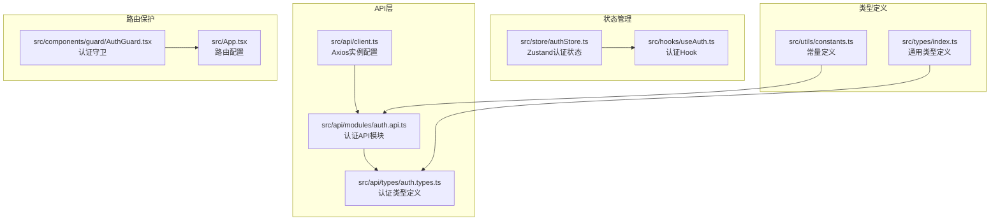
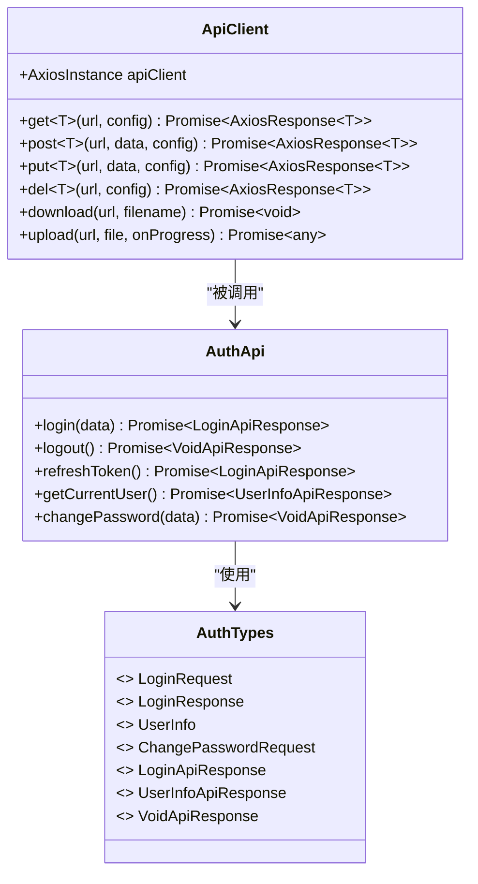
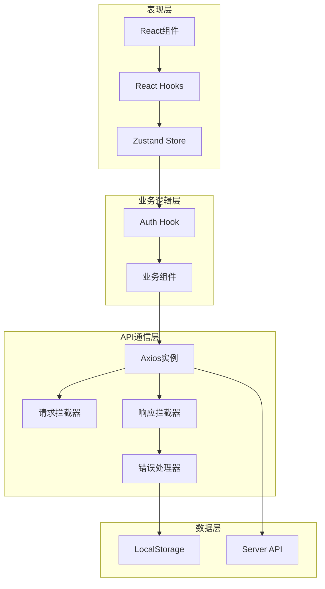
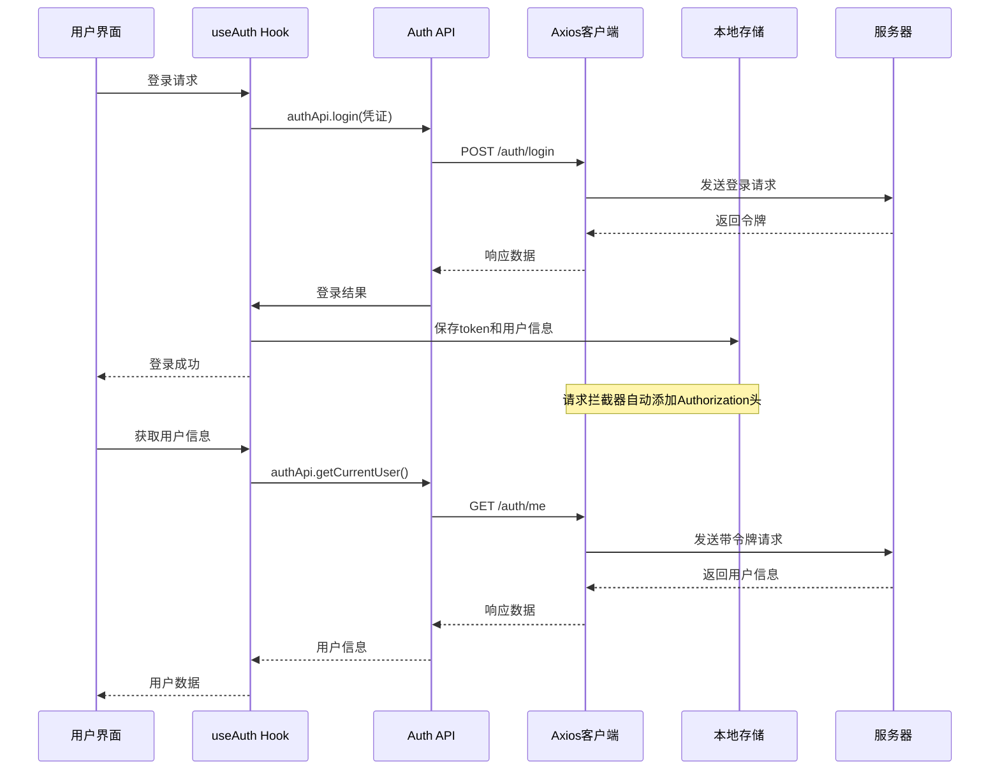
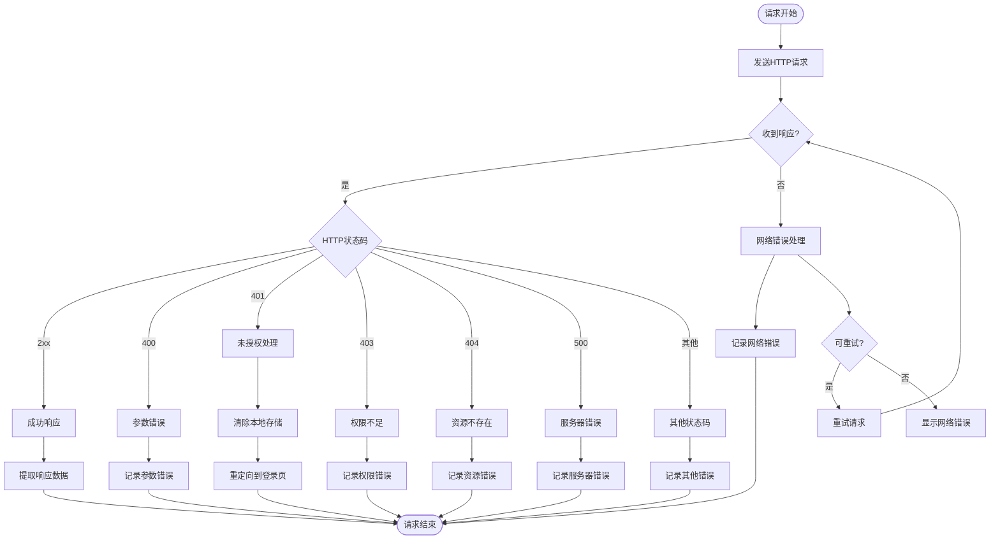
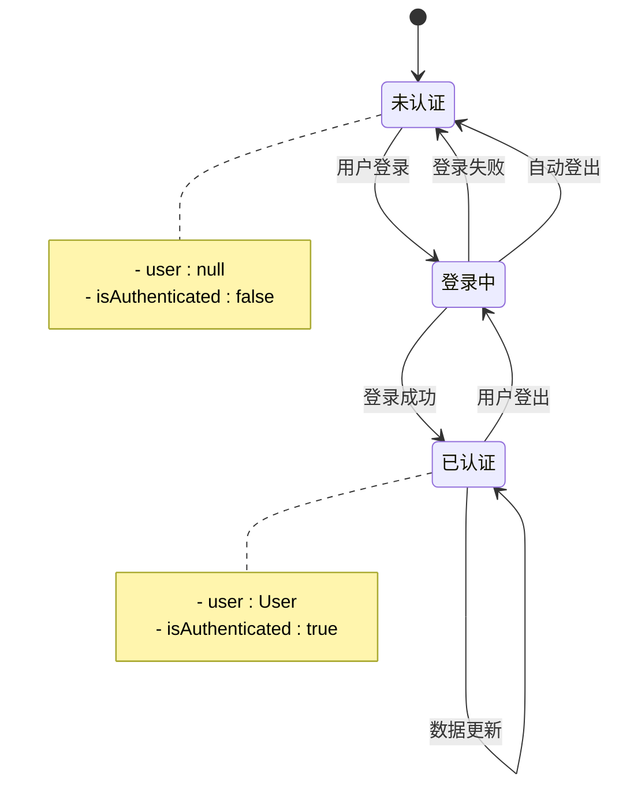
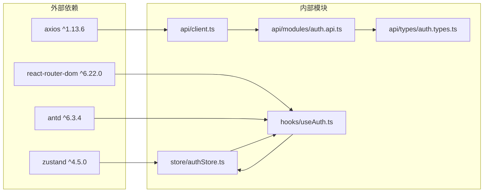

# API客户端设计

<cite>
**本文档引用的文件**
- [client.ts](file://src/api/client.ts)
- [auth.api.ts](file://src/api/modules/auth.api.ts)
- [auth.types.ts](file://src/api/types/auth.types.ts)
- [useAuth.ts](file://src/hooks/useAuth.ts)
- [authStore.ts](file://src/store/authStore.ts)
- [AuthGuard.tsx](file://src/components/guard/AuthGuard.tsx)
- [index.ts](file://src/types/index.ts)
- [constants.ts](file://src/utils/constants.ts)
- [App.tsx](file://src/App.tsx)
- [package.json](file://package.json)
</cite>

## 目录
1. [简介](#简介)
2. [项目结构](#项目结构)
3. [核心组件](#核心组件)
4. [架构概览](#架构概览)
5. [详细组件分析](#详细组件分析)
6. [依赖分析](#依赖分析)
7. [性能考虑](#性能考虑)
8. [故障排除指南](#故障排除指南)
9. [结论](#结论)
10. [附录](#附录)

## 简介

本文件详细阐述预算管理系统的API客户端设计，重点分析Axios实例配置、拦截器设计、认证令牌管理、错误处理机制以及TypeScript类型定义在API层的应用。该系统采用现代化前端架构，结合React Hooks、Zustand状态管理和Axios HTTP客户端，构建了完整的API通信层。

## 项目结构

预算管理系统的API客户端采用模块化设计，主要包含以下核心目录结构：

**图表来源**
- [client.ts:1-183](file://src/api/client.ts#L1-L183)
- [auth.api.ts:1-50](file://src/api/modules/auth.api.ts#L1-L50)
- [auth.types.ts:1-44](file://src/api/types/auth.types.ts#L1-L44)
- [authStore.ts:1-31](file://src/store/authStore.ts#L1-L31)
- [useAuth.ts:1-84](file://src/hooks/useAuth.ts#L1-L84)
- [index.ts:1-338](file://src/types/index.ts#L1-L338)
- [constants.ts:1-111](file://src/utils/constants.ts#L1-L111)
- [AuthGuard.tsx:1-31](file://src/components/guard/AuthGuard.tsx#L1-L31)
- [App.tsx:1-66](file://src/App.tsx#L1-L66)

**章节来源**
- [client.ts:1-183](file://src/api/client.ts#L1-L183)
- [auth.api.ts:1-50](file://src/api/modules/auth.api.ts#L1-L50)
- [auth.types.ts:1-44](file://src/api/types/auth.types.ts#L1-L44)
- [authStore.ts:1-31](file://src/store/authStore.ts#L1-L31)
- [useAuth.ts:1-84](file://src/hooks/useAuth.ts#L1-L84)
- [index.ts:1-338](file://src/types/index.ts#L1-L338)
- [constants.ts:1-111](file://src/utils/constants.ts#L1-L111)
- [AuthGuard.tsx:1-31](file://src/components/guard/AuthGuard.tsx#L1-L31)
- [App.tsx:1-66](file://src/App.tsx#L1-L66)

## 核心组件

### Axios实例配置

API客户端的核心是经过精心配置的Axios实例，具备以下关键特性：

**基础配置**
- **基础URL**: 从环境变量读取，支持开发和生产环境分离
- **超时设置**: 30秒超时，确保网络请求不会无限等待
- **默认头部**: 设置JSON内容类型，统一API通信格式

**请求拦截器功能**
- **认证令牌自动添加**: 从localStorage读取token并添加Authorization头
- **防缓存机制**: 对GET请求自动添加时间戳参数
- **错误日志记录**: 捕获并记录请求阶段的错误

**响应拦截器功能**
- **统一数据提取**: 直接返回响应对象，简化调用方处理
- **多级错误处理**: 处理HTTP状态码、网络错误和请求异常
- **自动登出机制**: 处理401未授权状态，清除本地存储并重定向

**章节来源**
- [client.ts:12-97](file://src/api/client.ts#L12-L97)

### API模块组织方式

系统采用按功能模块划分的API组织方式：

**图表来源**
- [client.ts:105-180](file://src/api/client.ts#L105-L180)
- [auth.api.ts:14-49](file://src/api/modules/auth.api.ts#L14-L49)
- [auth.types.ts:5-44](file://src/api/types/auth.types.ts#L5-L44)

**章节来源**
- [auth.api.ts:14-49](file://src/api/modules/auth.api.ts#L14-L49)
- [auth.types.ts:5-44](file://src/api/types/auth.types.ts#L5-L44)

### 类型定义体系

系统建立了完整的TypeScript类型定义体系：

**认证相关类型**
- `LoginRequest`: 登录请求参数接口
- `LoginResponse`: 登录响应数据结构
- `UserInfo`: 用户信息接口
- `ChangePasswordRequest`: 修改密码请求接口

**通用响应类型**
- `ApiResponse<T>`: 统一响应包装接口
- `PaginatedResult<T>`: 分页结果接口
- `PaginationQuery`: 分页查询参数接口

**章节来源**
- [auth.types.ts:5-44](file://src/api/types/auth.types.ts#L5-L44)
- [index.ts:332-338](file://src/types/index.ts#L332-L338)

## 架构概览

系统采用分层架构设计，各层职责明确：

**图表来源**
- [client.ts:21-94](file://src/api/client.ts#L21-L94)
- [useAuth.ts:8-83](file://src/hooks/useAuth.ts#L8-L83)
- [authStore.ts:19-31](file://src/store/authStore.ts#L19-L31)

## 详细组件分析

### 认证令牌管理机制

系统实现了完整的认证令牌生命周期管理：

**图表来源**
- [useAuth.ts:12-21](file://src/hooks/useAuth.ts#L12-L21)
- [auth.api.ts:18-40](file://src/api/modules/auth.api.ts#L18-L40)
- [client.ts:22-44](file://src/api/client.ts#L22-L44)

**章节来源**
- [useAuth.ts:12-51](file://src/hooks/useAuth.ts#L12-L51)
- [auth.api.ts:18-40](file://src/api/modules/auth.api.ts#L18-L40)
- [client.ts:22-44](file://src/api/client.ts#L22-L44)

### 错误处理机制

系统实现了多层次的错误处理机制：

**图表来源**
- [client.ts:52-94](file://src/api/client.ts#L52-L94)

**章节来源**
- [client.ts:52-94](file://src/api/client.ts#L52-L94)

### 文件上传下载功能

系统提供了完整的文件处理能力：

**文件上传流程**
- 使用FormData格式上传
- 支持进度回调
- 自动设置正确的Content-Type

**文件下载流程**
- 设置blob响应类型
- 动态创建下载链接
- 自动清理临时资源

**章节来源**
- [client.ts:141-180](file://src/api/client.ts#L141-L180)

### 状态管理集成

系统采用Zustand实现轻量级状态管理：

**图表来源**
- [authStore.ts:19-31](file://src/store/authStore.ts#L19-L31)

**章节来源**
- [authStore.ts:19-31](file://src/store/authStore.ts#L19-L31)

## 依赖分析

系统依赖关系清晰，各模块耦合度适中：

**图表来源**
- [package.json:12-32](file://package.json#L12-L32)
- [client.ts:1](file://src/api/client.ts#L1)
- [auth.api.ts:1](file://src/api/modules/auth.api.ts#L1)

**章节来源**
- [package.json:12-32](file://package.json#L12-L32)

## 性能考虑

### 请求优化策略

**防缓存机制**
- GET请求自动添加时间戳参数，避免浏览器缓存
- 确保数据实时性，但可能增加网络负载

**超时控制**
- 30秒超时设置平衡响应时间和用户体验
- 可根据网络环境调整超时值

**错误重试**
- 当前实现未包含自动重试机制
- 建议在关键业务场景添加指数退避重试

### 内存管理

**临时资源清理**
- 下载完成后及时清理Object URL
- 避免内存泄漏

**状态管理优化**
- Zustand提供轻量级状态管理
- 避免不必要的状态更新

## 故障排除指南

### 常见问题诊断

**认证相关问题**
- 检查localStorage中的token是否存在
- 验证服务器端点路径正确性
- 确认CORS配置允许跨域请求

**网络连接问题**
- 检查API_BASE_URL环境变量
- 验证防火墙和代理设置
- 确认服务器可达性

**类型定义问题**
- 确保TypeScript编译器版本兼容
- 检查类型导入路径正确性
- 验证接口字段匹配

### 调试技巧

**开发工具使用**
- 利用浏览器开发者工具监控网络请求
- 检查请求头和响应头信息
- 分析错误堆栈信息

**日志记录**
- 在拦截器中添加详细的日志输出
- 区分开发和生产环境的日志级别
- 使用结构化日志便于分析

**章节来源**
- [client.ts:40-43](file://src/api/client.ts#L40-L43)
- [client.ts:86-90](file://src/api/client.ts#L86-L90)

## 结论

预算管理系统的API客户端设计体现了现代前端开发的最佳实践：

**架构优势**
- 清晰的分层架构，职责分离明确
- 完整的TypeScript类型系统，提升代码质量
- 合理的状态管理，避免过度复杂化

**功能完整性**
- 全面的认证管理机制
- 统一的错误处理策略
- 完善的文件处理能力

**改进建议**
- 添加自动重试机制
- 实现请求缓存策略
- 增强测试覆盖率
- 优化性能监控

## 附录

### API调用最佳实践

**请求设计**
- 使用泛型类型确保类型安全
- 合理使用分页参数
- 避免发送不必要的数据

**错误处理**
- 在调用方处理特定错误类型
- 提供用户友好的错误提示
- 记录错误日志便于追踪

**性能优化**
- 合理使用缓存策略
- 避免频繁的重复请求
- 优化数据传输格式

### 测试策略建议

**单元测试**
- 测试API模块的各个函数
- 验证类型定义的正确性
- 测试错误处理分支

**集成测试**
- 测试完整的认证流程
- 验证拦截器功能
- 测试状态管理集成

**Mock数据使用**
- 创建模拟服务器响应
- 测试各种错误场景
- 验证UI组件行为