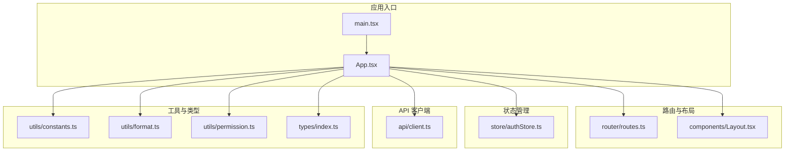
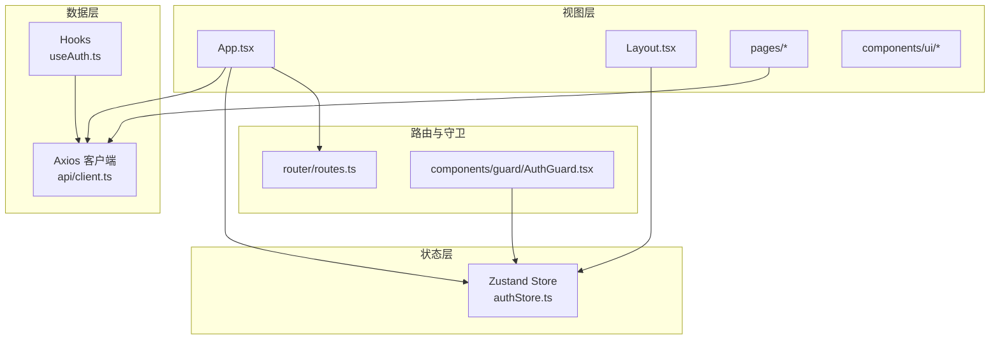
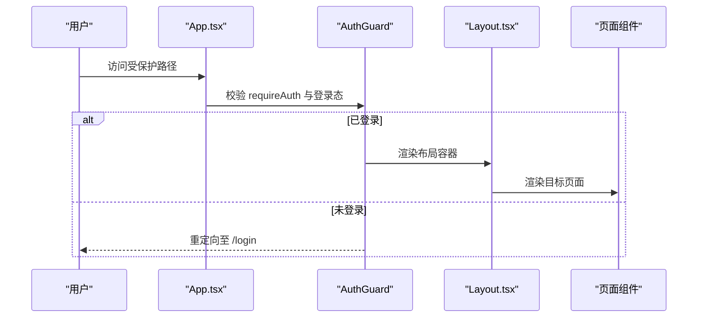
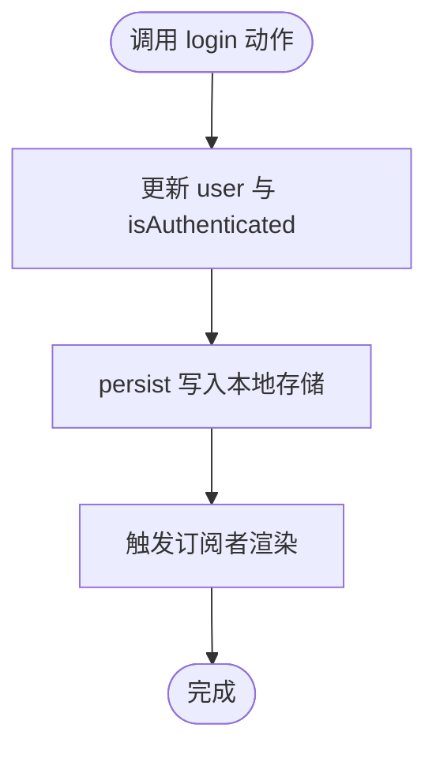
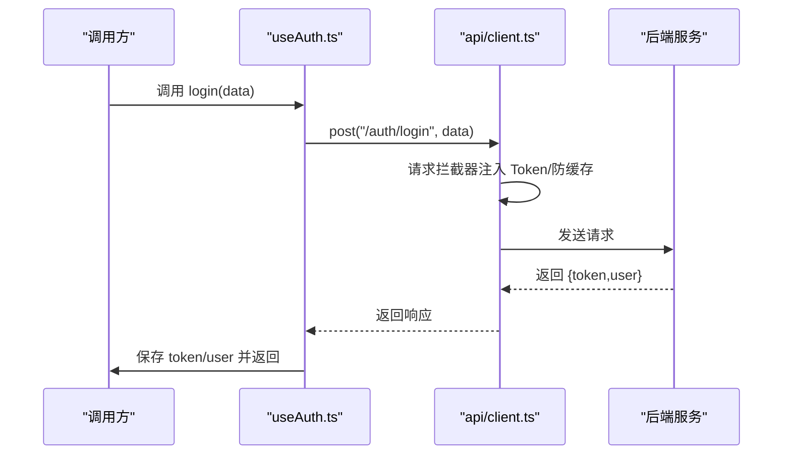
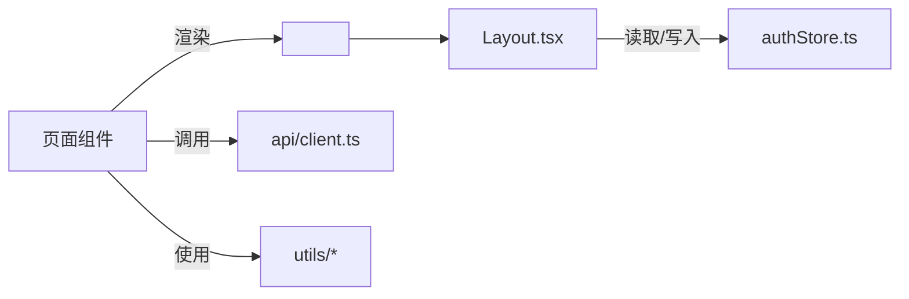
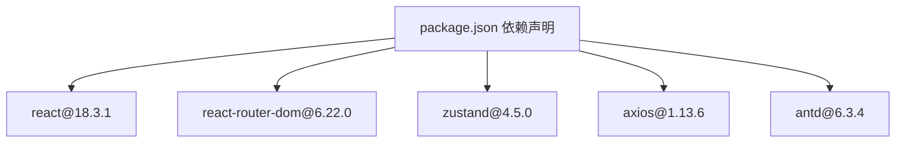

# 前端架构

<cite>
**本文引用的文件**
- [package.json](file://package.json)
- [main.tsx](file://src/main.tsx)
- [App.tsx](file://src/App.tsx)
- [Layout.tsx](file://src/components/Layout.tsx)
- [routes.ts](file://src/router/routes.ts)
- [authStore.ts](file://src/store/authStore.ts)
- [client.ts](file://src/api/client.ts)
- [useAuth.ts](file://src/hooks/useAuth.ts)
- [auth.api.ts](file://src/api/modules/auth.api.ts)
- [constants.ts](file://src/utils/constants.ts)
- [format.ts](file://src/utils/format.ts)
- [permission.ts](file://src/utils/permission.ts)
- [index.ts（类型）](file://src/types/index.ts)
- [DataTable.tsx](file://src/components/ui/Table/DataTable.tsx)
- [AuthGuard.tsx](file://src/components/guard/AuthGuard.tsx)
</cite>

## 更新摘要
**所做更改**
- 更新了React 18 + TypeScript + Ant Design 5的完整架构实现
- 新增了路由系统与页面导航的详细分析
- 完善了状态管理架构（Zustand）的最佳实践
- 扩展了API客户端设计的详细说明
- 增强了组件通信与数据流管理方案
- 更新了性能优化策略和代码组织规范

## 目录
1. [引言](#引言)
2. [项目结构](#项目结构)
3. [核心组件](#核心组件)
4. [架构总览](#架构总览)
5. [详细组件分析](#详细组件分析)
6. [依赖分析](#依赖分析)
7. [性能考虑](#性能考虑)
8. [故障排查指南](#故障排查指南)
9. [结论](#结论)
10. [附录](#附录)

## 引言
本文件面向预算管理系统的前端架构，围绕 React 18 + TypeScript + Ant Design 5 技术栈展开，系统性阐述项目目录结构、页面与组件分层、路由与导航、状态管理（Zustand）、API 客户端（Axios）设计、组件通信与数据流、性能优化策略以及代码组织规范。目标是帮助开发者快速理解并高效扩展该系统。

## 项目结构
项目采用按功能域与职责分层的组织方式：
- 应用入口与样式：入口文件负责挂载应用与全局样式引入；布局组件统一承载导航与内容区域。
- 页面层：各业务页面组件位于 pages 目录，按功能划分（如预算、采购、审批、分析等）。
- 组件层：components 目录下包含 UI 组件（ui）与业务组件（business），以及守卫组件（guard）。
- 路由层：router 目录集中管理路由配置与懒加载策略。
- 状态层：store 目录使用 Zustand 管理认证状态，并通过中间件持久化。
- API 层：api 目录封装 Axios 实例、请求/响应拦截器与常用方法（GET/POST/PUT/DELETE、上传/下载）。
- 工具层：utils 提供常量、格式化、权限判断与通用工具函数。
- 类型层：types 定义系统核心数据模型与枚举，确保类型安全。
- 构建与脚本：根目录 package.json 管理依赖与构建脚本。

**图表来源**
- [main.tsx:1-26](file://src/main.tsx#L1-L26)
- [App.tsx:1-66](file://src/App.tsx#L1-L66)
- [routes.ts:1-122](file://src/router/routes.ts#L1-L122)
- [Layout.tsx:1-99](file://src/components/Layout.tsx#L1-L99)
- [authStore.ts:1-31](file://src/store/authStore.ts#L1-L31)
- [client.ts:1-183](file://src/api/client.ts#L1-L183)
- [constants.ts:1-111](file://src/utils/constants.ts#L1-L111)
- [format.ts:1-166](file://src/utils/format.ts#L1-L166)
- [permission.ts:1-84](file://src/utils/permission.ts#L1-L84)
- [index.ts（类型）:1-338](file://src/types/index.ts#L1-L338)

**章节来源**
- [main.tsx:1-26](file://src/main.tsx#L1-L26)
- [App.tsx:1-66](file://src/App.tsx#L1-L66)
- [routes.ts:1-122](file://src/router/routes.ts#L1-L122)
- [Layout.tsx:1-99](file://src/components/Layout.tsx#L1-L99)
- [authStore.ts:1-31](file://src/store/authStore.ts#L1-L31)
- [client.ts:1-183](file://src/api/client.ts#L1-L183)
- [constants.ts:1-111](file://src/utils/constants.ts#L1-L111)
- [format.ts:1-166](file://src/utils/format.ts#L1-L166)
- [permission.ts:1-84](file://src/utils/permission.ts#L1-L84)
- [index.ts（类型）:1-338](file://src/types/index.ts#L1-L338)

## 核心组件
- 应用根组件 App：基于 react-router-dom 的路由配置，提供私有路由包装与登录页路由。
- 布局组件 Layout：提供顶部栏、侧边栏、移动端菜单、用户信息与登出流程。
- 认证状态管理：使用 Zustand 管理用户信息与登录态，并持久化到本地存储。
- API 客户端：封装 Axios 实例，统一添加 Token、防缓存参数、统一错误处理与文件上传/下载能力。
- 路由配置：集中导出路由表，支持懒加载与鉴权控制。
- 工具与类型：常量、格式化、权限工具与完整类型定义，保障一致性与可维护性。

**章节来源**
- [App.tsx:1-66](file://src/App.tsx#L1-L66)
- [Layout.tsx:1-99](file://src/components/Layout.tsx#L1-L99)
- [authStore.ts:1-31](file://src/store/authStore.ts#L1-L31)
- [client.ts:1-183](file://src/api/client.ts#L1-L183)
- [routes.ts:1-122](file://src/router/routes.ts#L1-L122)
- [constants.ts:1-111](file://src/utils/constants.ts#L1-L111)
- [format.ts:1-166](file://src/utils/format.ts#L1-L166)
- [permission.ts:1-84](file://src/utils/permission.ts#L1-L84)
- [index.ts（类型）:1-338](file://src/types/index.ts#L1-L338)

## 架构总览
前端采用"页面组件 + 业务组件 + UI 组件"的分层设计，结合路由懒加载与状态持久化，形成清晰的职责边界与可扩展性。

**图表来源**
- [App.tsx:1-66](file://src/App.tsx#L1-L66)
- [Layout.tsx:1-99](file://src/components/Layout.tsx#L1-L99)
- [authStore.ts:1-31](file://src/store/authStore.ts#L1-L31)
- [client.ts:1-183](file://src/api/client.ts#L1-L183)
- [routes.ts:1-122](file://src/router/routes.ts#L1-L122)
- [AuthGuard.tsx:1-31](file://src/components/guard/AuthGuard.tsx#L1-L31)
- [useAuth.ts:1-84](file://src/hooks/useAuth.ts#L1-L84)

## 详细组件分析

### 路由系统与页面导航
- 路由配置：集中导出路由表，包含路径、元素与鉴权需求；支持首页重定向与嵌套布局。
- 懒加载：通过 React.lazy 对页面组件进行按需加载，降低首屏体积。
- 私有路由：在 App 中以高阶形式包裹 Layout，内部通过 Zustand 读取登录态决定放行或跳转登录。
- 导航实现：Layout 使用 NavLink 与 useNavigate 实现侧边栏导航与移动端菜单切换。

**图表来源**
- [App.tsx:24-27](file://src/App.tsx#L24-L27)
- [AuthGuard.tsx:13-30](file://src/components/guard/AuthGuard.tsx#L13-L30)
- [Layout.tsx:18-99](file://src/components/Layout.tsx#L18-L99)
- [routes.ts:25-121](file://src/router/routes.ts#L25-L121)

**章节来源**
- [App.tsx:1-66](file://src/App.tsx#L1-L66)
- [routes.ts:1-122](file://src/router/routes.ts#L1-L122)
- [AuthGuard.tsx:1-31](file://src/components/guard/AuthGuard.tsx#L1-L31)
- [Layout.tsx:1-99](file://src/components/Layout.tsx#L1-L99)

### 状态管理架构（Zustand）
- Store 设计：定义用户、登录态与动作（login/logout），使用 persist 中间件持久化到本地存储。
- 使用方式：在 App 与 Layout 中通过 selector 读取登录态；在登录 Hook 中触发 login 动作。
- 最佳实践：将轻量状态放入 Zustand；复杂场景可结合 React Query；避免跨 Store 耦合。

**图表来源**
- [authStore.ts:19-30](file://src/store/authStore.ts#L19-L30)
- [App.tsx:22-27](file://src/App.tsx#L22-L27)
- [Layout.tsx:18-26](file://src/components/Layout.tsx#L18-L26)

**章节来源**
- [authStore.ts:1-31](file://src/store/authStore.ts#L1-L31)
- [App.tsx:22-27](file://src/App.tsx#L22-L27)
- [Layout.tsx:18-26](file://src/components/Layout.tsx#L18-L26)

### API 客户端设计（Axios）
- 实例创建：设置基础 URL、超时、默认头，保证一致的请求行为。
- 请求拦截器：自动注入 Authorization 头；对 GET 请求追加时间戳参数防缓存。
- 响应拦截器：统一错误处理（401 清理本地存储并跳转登录；其他状态打印日志）。
- 方法封装：提供 get/post/put/del 与 upload/download 辅助方法，简化调用。
- 错误处理：区分服务端状态码与网络错误，统一返回 Promise.reject 以便上层捕获。

**图表来源**
- [useAuth.ts:12-21](file://src/hooks/useAuth.ts#L12-L21)
- [client.ts:105-118](file://src/api/client.ts#L105-L118)
- [client.ts:21-44](file://src/api/client.ts#L21-L44)
- [client.ts:46-94](file://src/api/client.ts#L46-L94)

**章节来源**
- [client.ts:1-183](file://src/api/client.ts#L1-L183)
- [useAuth.ts:1-84](file://src/hooks/useAuth.ts#L1-L84)

### 组件通信与数据流
- 页面到布局：通过 Outlet 在 Layout 中渲染子页面，实现布局与页面解耦。
- 布局到状态：Layout 通过 Zustand 读取用户信息与登录态，触发 logout 动作。
- 表单与校验：可结合 react-hook-form 与 Ant Design 表单组件，配合类型定义提升健壮性。
- 数据展示：UI 组件（如 DataTable）负责表格渲染与交互，业务组件负责数据聚合与逻辑处理。

**图表来源**
- [Layout.tsx:94-96](file://src/components/Layout.tsx#L94-L96)
- [authStore.ts:19-30](file://src/store/authStore.ts#L19-L30)
- [client.ts:105-183](file://src/api/client.ts#L105-L183)
- [format.ts:1-166](file://src/utils/format.ts#L1-L166)

**章节来源**
- [Layout.tsx:1-99](file://src/components/Layout.tsx#L1-L99)
- [authStore.ts:1-31](file://src/store/authStore.ts#L1-L31)
- [client.ts:1-183](file://src/api/client.ts#L1-L183)
- [format.ts:1-166](file://src/utils/format.ts#L1-L166)

### UI 组件与业务组件
- UI 组件：以 Ant Design 为基础，提供可复用的表格、按钮、标签等，关注外观与交互。
- 业务组件：封装具体业务逻辑（如预算项、采购明细），与 API 客户端协作。
- 示例：DataTable 展示了列定义、排序、分页与渲染逻辑，便于扩展为预算/采购列表。

**章节来源**
- [DataTable.tsx:1-108](file://src/components/ui/Table/DataTable.tsx#L1-L108)

### 权限与守卫
- 权限工具：提供 hasPermission/hasAnyPermission/hasAllPermissions 与权限枚举，支持模块化权限控制。
- 守卫组件：AuthGuard 根据 requireAuth 与登录态决定放行或重定向，适合路由级保护。
- 状态联动：Layout 与 App 通过 Zustand 读取用户角色与权限，驱动界面显示与交互。

**章节来源**
- [permission.ts:1-84](file://src/utils/permission.ts#L1-L84)
- [AuthGuard.tsx:1-31](file://src/components/guard/AuthGuard.tsx#L1-L31)
- [authStore.ts:1-31](file://src/store/authStore.ts#L1-L31)

## 依赖分析
- 运行时依赖：React 18.3.1、React Router 6.22.0、Ant Design 6.3.4、Zustand 4.5.0、Axios 1.13.6、i18n、图表库等。
- 开发依赖：Vite、TypeScript 5.4.2、ESLint、React 插件等。
- 关键耦合点：App 依赖路由与状态；页面依赖 API 客户端与工具；布局依赖状态与守卫。

**图表来源**
- [package.json:12-43](file://package.json#L12-L43)

**章节来源**
- [package.json:1-45](file://package.json#L1-L45)

## 性能考虑
- 路由懒加载：通过 React.lazy 与 Suspense 减少首屏包体，提升初始加载速度。
- 状态最小化：Zustand 仅存放必要状态，避免过度拆分导致的重复渲染。
- 请求拦截：GET 自动追加时间戳防缓存，避免陈旧数据；统一错误处理减少重复逻辑。
- UI 优化：Ant Design 组件按需引入与样式隔离，避免全局污染。
- 工具函数：防抖/节流、深拷贝、格式化等工具减少重复计算与 DOM 操作。

**章节来源**
- [routes.ts:1-22](file://src/router/routes.ts#L1-L22)
- [client.ts:30-36](file://src/api/client.ts#L30-L36)
- [format.ts:79-107](file://src/utils/format.ts#L79-L107)

## 故障排查指南
- 登录态异常：确认 localStorage 是否存在 token；检查 401 统一处理逻辑是否执行清理与跳转。
- 请求失败：查看响应拦截器输出的日志，定位状态码或网络错误；核对基础 URL 与超时配置。
- 路由跳转问题：检查路由表与守卫组件 requireAuth 配置；确认私有路由包裹是否生效。
- 样式缺失：确认 main.tsx 中样式导入顺序与作用域；检查 CSS 变量与主题配置。
- 类型错误：核对 types/index.ts 中接口定义与实际响应结构是否一致。

**章节来源**
- [client.ts:52-94](file://src/api/client.ts#L52-L94)
- [AuthGuard.tsx:13-30](file://src/components/guard/AuthGuard.tsx#L13-L30)
- [main.tsx:1-26](file://src/main.tsx#L1-L26)
- [index.ts（类型）:1-338](file://src/types/index.ts#L1-L338)

## 结论
该前端架构以 React 18 + TypeScript + Ant Design 5 为核心，结合 Zustand 状态管理、Axios API 客户端与 Ant Design UI 组件，实现了清晰的分层设计与良好的可维护性。通过路由懒加载、统一拦截器与权限守卫，系统在用户体验与开发效率之间取得平衡。建议后续持续完善类型体系、引入缓存策略与国际化模块，并在复杂页面中进一步拆分业务组件，保持单一职责与高内聚。

## 附录
- 代码组织规范
  - 目录命名：pages（页面）、components（组件）、store（状态）、api（API）、utils（工具）、types（类型）、router（路由）。
  - 组件命名：大驼峰；页面组件与 UI 组件分离；UI 组件尽量无副作用。
  - 状态管理：Zustand 仅存放轻量状态；复杂数据使用 React Query 或 Redux Toolkit。
  - API 调用：统一通过 api/client.ts；错误处理集中在拦截器；上传/下载使用专用方法。
  - 样式：按页面引入样式文件；避免全局污染；CSS 变量集中管理。
  - 类型：所有对外接口与响应均在 types/index.ts 中定义；使用枚举与只读常量提升可读性。
  - 路由：集中导出路由表；守卫组件统一鉴权；懒加载提升性能。
  - 工具函数：格式化、权限、防抖/节流等独立模块；避免在组件中重复实现。