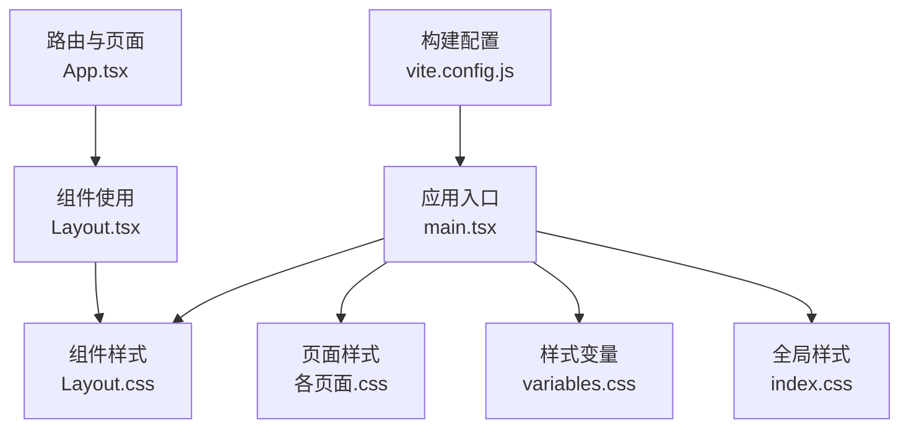
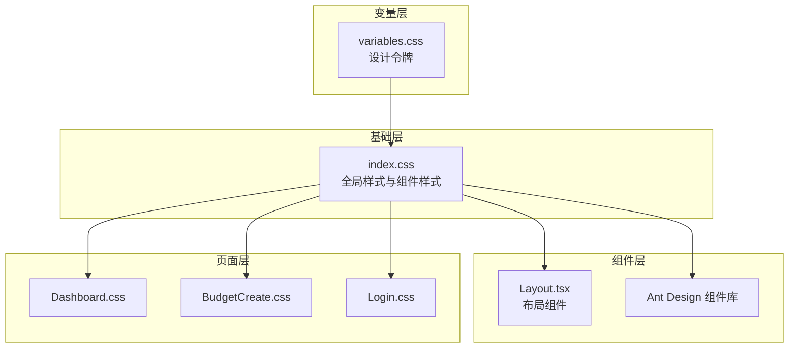
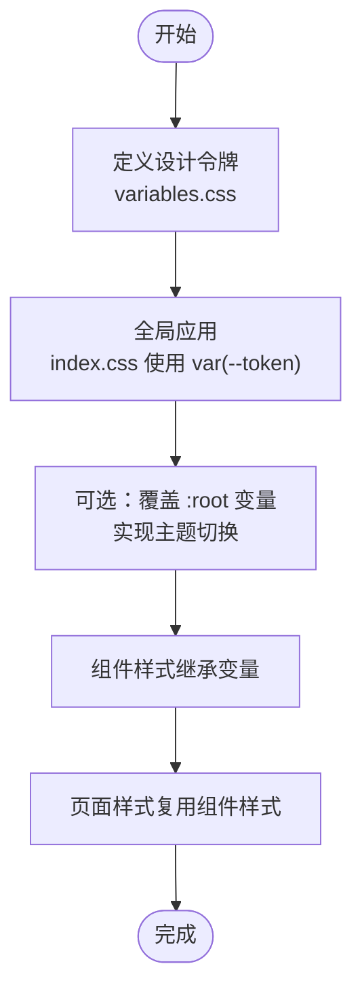
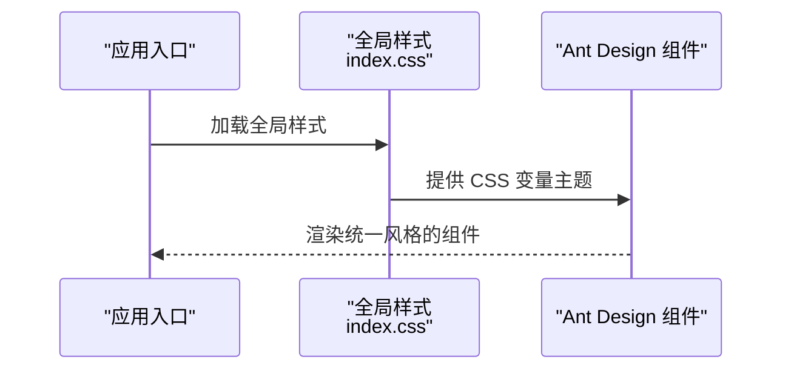
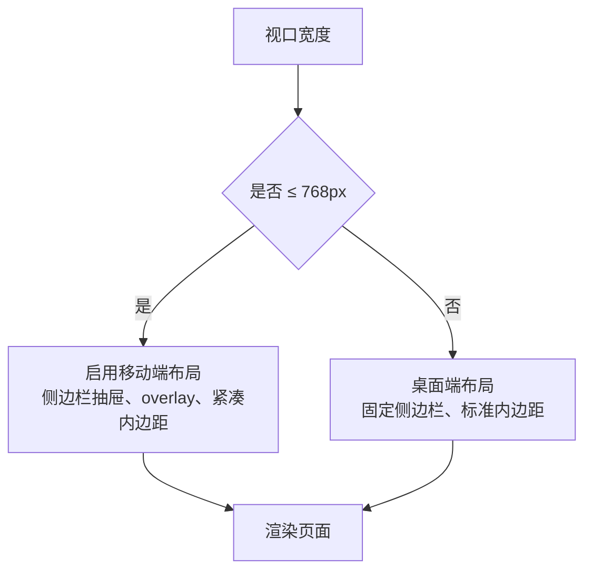
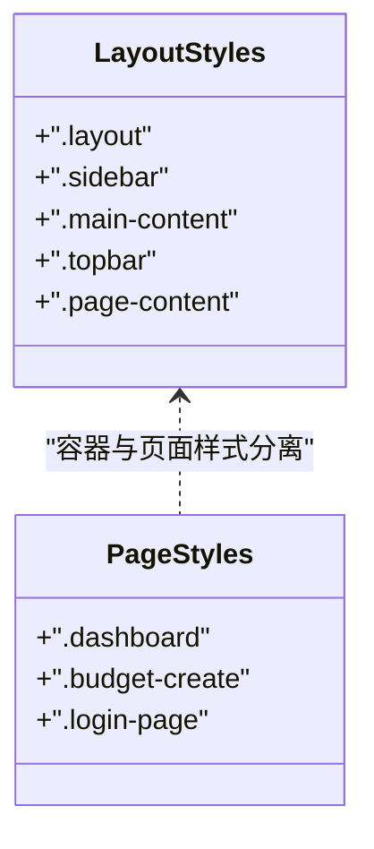
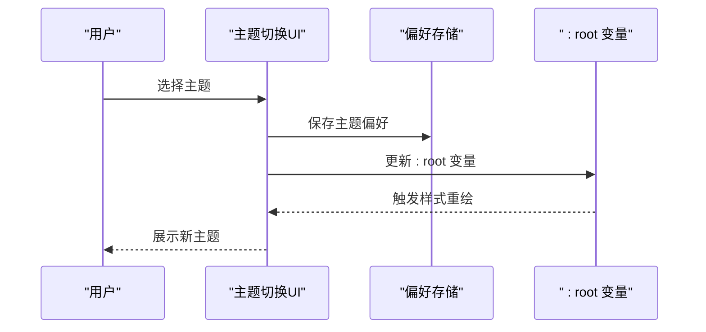
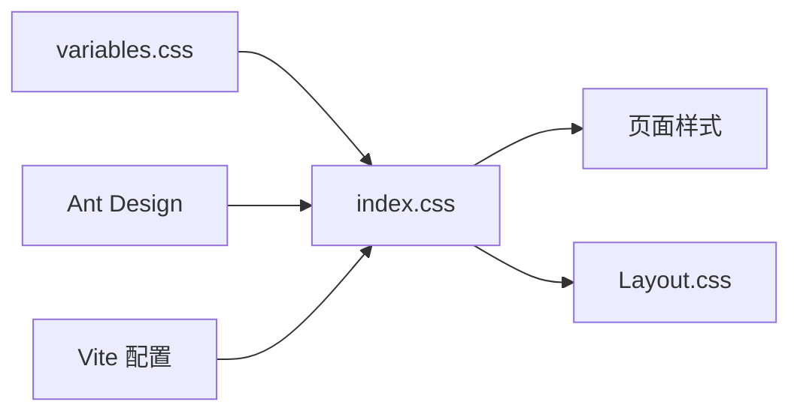

# 样式系统与主题设计

<cite>
**本文档引用的文件**
- [variables.css](file://src/styles/variables.css)
- [index.css](file://src/index.css)
- [Layout.css](file://src/components/Layout.css)
- [Dashboard.css](file://src/pages/Dashboard.css)
- [BudgetCreate.css](file://src/pages/BudgetCreate.css)
- [Login.css](file://src/pages/Login.css)
- [Layout.tsx](file://src/components/Layout.tsx)
- [Dashboard.tsx](file://src/pages/Dashboard.tsx)
- [App.tsx](file://src/App.tsx)
- [main.tsx](file://src/main.tsx)
- [vite.config.js](file://vite.config.js)
- [package.json](file://package.json)
</cite>

## 目录
1. [简介](#简介)
2. [项目结构](#项目结构)
3. [核心组件](#核心组件)
4. [架构概览](#架构概览)
5. [详细组件分析](#详细组件分析)
6. [依赖分析](#依赖分析)
7. [性能考虑](#性能考虑)
8. [故障排除指南](#故障排除指南)
9. [结论](#结论)
10. [附录](#附录)

## 简介
本文件面向预算管理系统的样式系统与主题设计，系统性阐述以下内容：
- CSS 变量体系的设计与使用，以及主题定制机制
- Ant Design 组件的主题覆盖与样式定制方法
- 响应式设计策略与移动端适配方案
- 组件样式封装原则与样式隔离技术
- CSS 模块化与样式组织最佳实践
- 样式性能优化与浏览器兼容性处理
- 动态主题切换与用户偏好保存的实现方案

## 项目结构
样式系统采用分层与模块化组织方式：
- 全局基础变量与重置：通过根作用域变量统一管理颜色、字号、间距、圆角、阴影等设计令牌，并在全局层面进行样式重置与基础排版。
- 页面级样式：每个页面独立的样式文件，使用页面前缀避免类名冲突，配合工具类提升开发效率。
- 组件级样式：如布局组件的样式文件，负责容器、导航、侧边栏等复用组件的视觉表现。
- 全局入口：在应用入口集中引入全局样式与页面样式，确保样式加载顺序与优先级。

图表来源
- [main.tsx:1-26](file://src/main.tsx#L1-L26)
- [index.css:1-464](file://src/index.css#L1-L464)
- [variables.css:1-202](file://src/styles/variables.css#L1-L202)
- [Layout.css:1-227](file://src/components/Layout.css#L1-L227)
- [App.tsx:1-66](file://src/App.tsx#L1-L66)
- [vite.config.js:1-23](file://vite.config.js#L1-L23)

章节来源
- [main.tsx:1-26](file://src/main.tsx#L1-L26)
- [index.css:1-464](file://src/index.css#L1-L464)
- [variables.css:1-202](file://src/styles/variables.css#L1-L202)
- [Layout.css:1-227](file://src/components/Layout.css#L1-L227)
- [App.tsx:1-66](file://src/App.tsx#L1-L66)
- [vite.config.js:1-23](file://vite.config.js#L1-L23)

## 核心组件
本节聚焦样式系统的关键组成与职责划分：

- 样式变量系统（CSS 自定义属性）
  - 提供主色、成功/警告/错误色、文本与背景色、边框色、字号、行高、间距、圆角、阴影、过渡等设计令牌。
  - 在全局 HTML 与组件中通过 var() 引用，形成统一的主题语义层。

- 全局样式与工具类
  - 统一字体、字号、行高、颜色与背景，提供基础按钮、卡片、输入、表格、标签、选择器、模态框、统计卡片、进度条、分页、空状态、标签页等通用组件样式。
  - 提供 flex、对齐、间距等工具类，提升布局一致性与开发效率。

- 页面与组件样式
  - 页面样式以页面前缀命名，避免类名冲突；在组件内部通过 className 使用。
  - 布局组件样式负责侧边栏、顶部栏、遮罩层与移动端交互逻辑。

- 构建与加载顺序
  - Vite 别名与代理配置保证资源解析正确。
  - 应用入口按需引入全局样式与页面样式，确保变量优先于组件样式被解析。

章节来源
- [variables.css:1-202](file://src/styles/variables.css#L1-L202)
- [index.css:1-464](file://src/index.css#L1-L464)
- [Layout.css:1-227](file://src/components/Layout.css#L1-L227)
- [vite.config.js:1-23](file://vite.config.js#L1-L23)
- [main.tsx:1-26](file://src/main.tsx#L1-L26)

## 架构概览
样式系统整体遵循“变量 → 基础 → 组件 → 页面”的层次化架构，结合 Ant Design 的组件生态，实现主题覆盖与样式定制。

图表来源
- [variables.css:1-202](file://src/styles/variables.css#L1-L202)
- [index.css:1-464](file://src/index.css#L1-L464)
- [Layout.tsx:1-99](file://src/components/Layout.tsx#L1-L99)
- [Dashboard.css:1-91](file://src/pages/Dashboard.css#L1-L91)
- [BudgetCreate.css:1-37](file://src/pages/BudgetCreate.css#L1-L37)
- [Login.css:1-78](file://src/pages/Login.css#L1-L78)

## 详细组件分析

### CSS 变量系统与主题定制
- 设计令牌维度
  - 色彩：主色、成功/警告/错误色、文本与背景、边框色
  - 排版：字号、行高
  - 间距：xs/sm/md/lg/xl/xxl
  - 角度：xs/sm/md/lg/xl/xxl
  - 阴影：sm/md/lg/xl
  - 过渡：fast/normal/slow
- 使用模式
  - 全局 HTML 与组件内统一通过 var(--token) 引用
  - 页面与组件样式通过继承或覆盖 :root 变量实现主题切换
- 主题定制建议
  - 通过修改 :root 变量快速切换主题
  - 为不同场景（日/夜间）提供预设变量集，运行时切换 :root 样式表

图表来源
- [variables.css:1-202](file://src/styles/variables.css#L1-L202)
- [index.css:1-464](file://src/index.css#L1-L464)

章节来源
- [variables.css:1-202](file://src/styles/variables.css#L1-L202)
- [index.css:1-464](file://src/index.css#L1-L464)

### Ant Design 组件的主题覆盖与样式定制
- 依赖与版本
  - 项目使用 Ant Design v6.x，具备完善的主题系统与 CSS 变量支持能力
- 覆盖策略
  - 通过 CSS 变量覆盖 Ant Design 内部设计令牌，实现主色、尺寸、圆角、阴影等统一
  - 在全局样式中声明 :root 变量后，Ant Design 组件会自动继承这些变量
- 定制方法
  - 在 index.css 中集中声明主题变量，确保 Ant Design 组件与自定义组件风格一致
  - 对特定组件进行局部覆盖，避免影响全局

图表来源
- [index.css:1-464](file://src/index.css#L1-L464)
- [package.json:12-33](file://package.json#L12-L33)

章节来源
- [package.json:12-33](file://package.json#L12-L33)
- [index.css:1-464](file://src/index.css#L1-L464)

### 响应式设计与移动端适配
- 断点策略
  - 采用 768px 作为移动端断点，针对侧边栏、菜单按钮、内容区域与间距进行适配
- 实现要点
  - 侧边栏在移动端默认隐藏并通过 overlay 控制显隐
  - 主内容区域在移动端取消左侧边距并调整内边距
  - 表单网格、统计卡片与图表网格在小屏下自动换列，保证可读性

图表来源
- [Layout.css:199-227](file://src/components/Layout.css#L199-L227)
- [Dashboard.css:83-91](file://src/pages/Dashboard.css#L83-L91)
- [BudgetCreate.css:33-37](file://src/pages/BudgetCreate.css#L33-L37)

章节来源
- [Layout.css:199-227](file://src/components/Layout.css#L199-L227)
- [Dashboard.css:83-91](file://src/pages/Dashboard.css#L83-L91)
- [BudgetCreate.css:33-37](file://src/pages/BudgetCreate.css#L33-L37)

### 组件样式封装与样式隔离
- 封装原则
  - 页面样式以页面前缀命名，避免跨页面污染
  - 组件样式独立文件，仅暴露必要的类名接口
- 隔离技术
  - 使用作用域选择器（如 .page-class .child）限定样式范围
  - 通过工具类减少特异性，降低样式冲突概率
  - 布局组件使用独立容器类，避免与页面样式混用

图表来源
- [Layout.css:1-227](file://src/components/Layout.css#L1-L227)
- [Dashboard.css:1-91](file://src/pages/Dashboard.css#L1-L91)
- [BudgetCreate.css:1-37](file://src/pages/BudgetCreate.css#L1-L37)
- [Login.css:1-78](file://src/pages/Login.css#L1-L78)

章节来源
- [Layout.css:1-227](file://src/components/Layout.css#L1-L227)
- [Dashboard.css:1-91](file://src/pages/Dashboard.css#L1-L91)
- [BudgetCreate.css:1-37](file://src/pages/BudgetCreate.css#L1-L37)
- [Login.css:1-78](file://src/pages/Login.css#L1-L78)

### CSS 模块化与样式组织最佳实践
- 文件组织
  - 全局变量：styles/variables.css
  - 全局样式：index.css
  - 页面样式：各页面独立 .css 文件
  - 组件样式：组件目录下的 .css 文件
- 类名规范
  - 页面前缀 + 子元素层级命名，如 .dashboard .page-header
  - 工具类用于布局与间距，如 .flex、.gap-md、.text-center
- 加载顺序
  - 先加载变量与全局样式，再加载页面样式，确保变量优先解析

章节来源
- [variables.css:1-202](file://src/styles/variables.css#L1-L202)
- [index.css:1-464](file://src/index.css#L1-L464)
- [main.tsx:1-26](file://src/main.tsx#L1-L26)

### 动态主题切换与用户偏好保存
- 主题切换方案
  - 运行时修改 :root 变量，实现主色、文本、背景、边框等整体切换
  - 结合本地存储持久化用户偏好，刷新后恢复
- 用户偏好保存
  - 使用本地存储或会话存储保存主题键值，应用启动时读取并应用
- 与 Ant Design 协同
  - Ant Design 组件自动继承新的 CSS 变量，无需额外配置

图表来源
- [variables.css:1-202](file://src/styles/variables.css#L1-L202)
- [index.css:1-464](file://src/index.css#L1-L464)

章节来源
- [variables.css:1-202](file://src/styles/variables.css#L1-L202)
- [index.css:1-464](file://src/index.css#L1-L464)

## 依赖分析
- 外部依赖
  - Ant Design v6.x：提供丰富的 UI 组件与主题系统
  - Vite：提供开发服务器、代理与别名解析
- 样式依赖关系
  - index.css 依赖 variables.css 的设计令牌
  - 各页面样式依赖 index.css 的基础组件样式
  - 布局组件样式与页面样式相互独立，通过容器类连接

图表来源
- [variables.css:1-202](file://src/styles/variables.css#L1-L202)
- [index.css:1-464](file://src/index.css#L1-L464)
- [Layout.css:1-227](file://src/components/Layout.css#L1-L227)
- [package.json:12-33](file://package.json#L12-L33)
- [vite.config.js:1-23](file://vite.config.js#L1-L23)

章节来源
- [package.json:12-33](file://package.json#L12-L33)
- [vite.config.js:1-23](file://vite.config.js#L1-L23)
- [variables.css:1-202](file://src/styles/variables.css#L1-L202)
- [index.css:1-464](file://src/index.css#L1-L464)
- [Layout.css:1-227](file://src/components/Layout.css#L1-L227)

## 性能考虑
- 样式体积控制
  - 合理拆分样式文件，避免重复定义相同规则
  - 使用工具类减少特异性与冗余样式
- 加载与渲染
  - 通过入口集中引入样式，减少网络请求数
  - 避免在组件内动态生成大量内联样式，优先使用 CSS 变量与类名切换
- 浏览器兼容性
  - CSS 变量在现代浏览器中广泛支持，可结合降级方案（如回退颜色）保障兼容
  - 媒体查询与 Flexbox 在移动端适配中保持良好兼容性

## 故障排除指南
- 样式未生效
  - 检查变量是否在全局样式中定义且优先于组件样式被加载
  - 确认类名拼写与作用域选择器是否正确
- 主题切换无效
  - 确认 :root 变量更新逻辑与存储读取流程
  - 检查 Ant Design 组件是否支持当前主题变量映射
- 移动端显示异常
  - 检查媒体查询断点与选择器优先级
  - 确认容器类与页面类的组合使用是否正确

章节来源
- [variables.css:1-202](file://src/styles/variables.css#L1-L202)
- [index.css:1-464](file://src/index.css#L1-L464)
- [Layout.css:199-227](file://src/components/Layout.css#L199-L227)

## 结论
预算管理系统的样式系统以 CSS 变量为核心，结合 Ant Design 组件库实现了统一、可扩展的主题体系。通过分层组织与模块化管理，系统在保证开发效率的同时兼顾了可维护性与性能。响应式设计与移动端适配策略完善，能够满足多终端使用需求。建议在后续迭代中进一步完善动态主题切换与用户偏好持久化机制，并持续优化样式体积与加载性能。

## 附录
- 关键文件路径
  - 样式变量：src/styles/variables.css
  - 全局样式：src/index.css
  - 布局样式：src/components/Layout.css
  - 页面样式：src/pages/*.css
  - 应用入口：src/main.tsx
  - 路由与组件：src/App.tsx, src/components/Layout.tsx
  - 构建配置：vite.config.js
  - 依赖信息：package.json