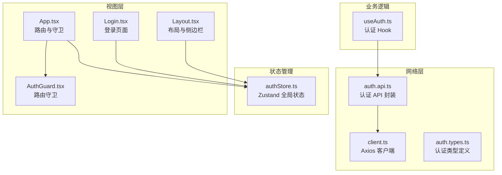
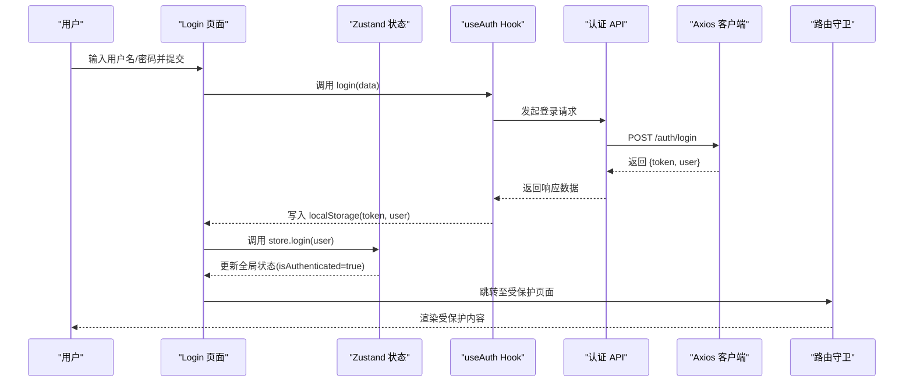
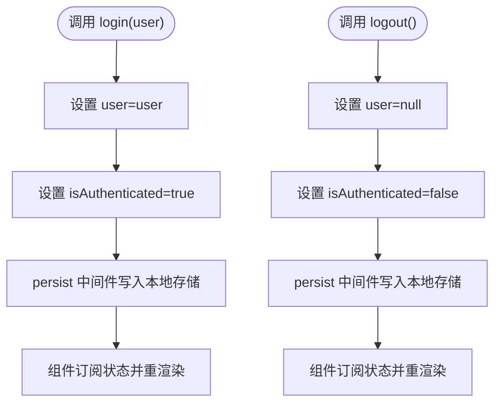
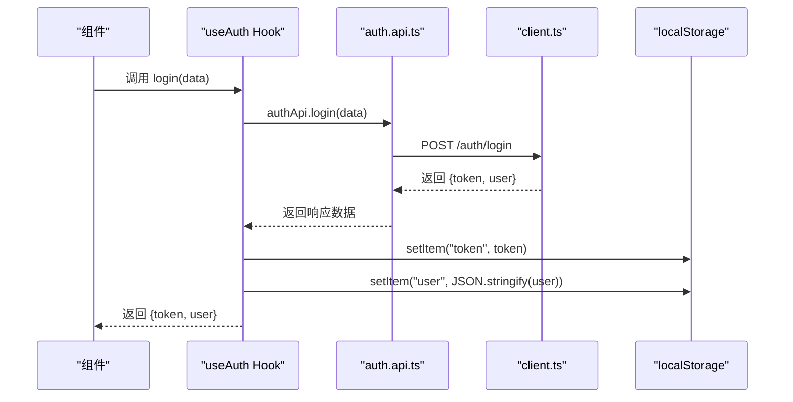
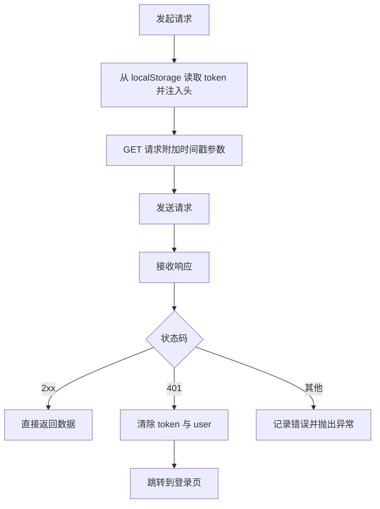
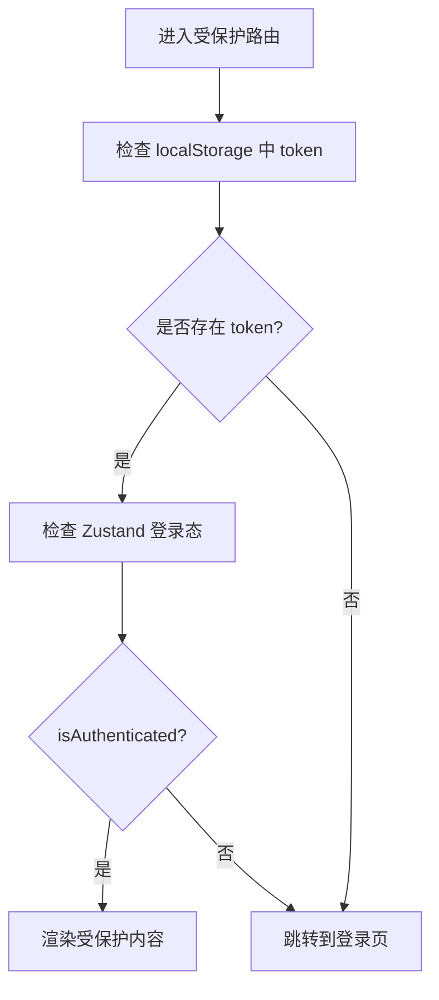
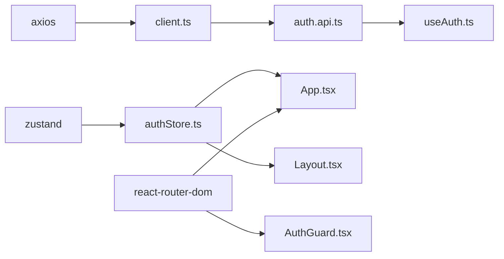

# 状态管理架构

<cite>
**本文引用的文件**
- [authStore.ts](file://src/store/authStore.ts)
- [useAuth.ts](file://src/hooks/useAuth.ts)
- [auth.api.ts](file://src/api/modules/auth.api.ts)
- [client.ts](file://src/api/client.ts)
- [auth.types.ts](file://src/api/types/auth.types.ts)
- [AuthGuard.tsx](file://src/components/guard/AuthGuard.tsx)
- [App.tsx](file://src/App.tsx)
- [Login.tsx](file://src/pages/Login.tsx)
- [Layout.tsx](file://src/components/Layout.tsx)
- [package.json](file://package.json)
</cite>

## 目录
1. [引言](#引言)
2. [项目结构](#项目结构)
3. [核心组件](#核心组件)
4. [架构概览](#架构概览)
5. [详细组件分析](#详细组件分析)
6. [依赖关系分析](#依赖关系分析)
7. [性能考虑](#性能考虑)
8. [故障排查指南](#故障排查指南)
9. [结论](#结论)
10. [附录](#附录)

## 引言
本文件系统性梳理预算管理系统的状态管理架构，重点围绕 Zustand 的选择与应用展开，详细说明 authStore 的设计模式（状态结构、动作定义、中间件）、useAuth Hook 的实现与组件使用模式、全局状态与局部状态的划分原则、状态持久化与同步方案、最佳实践与性能优化策略，以及调试与开发工具的使用方法。该系统采用前端轻量状态管理库 Zustand，结合 React Router 进行路由级鉴权控制，形成“持久化全局状态 + API 会话”的双轨机制，既保证了用户体验的连续性，又确保了鉴权与权限控制的可靠性。

## 项目结构
系统采用按功能域分层的组织方式：
- store 层：集中存放状态管理逻辑，当前仅包含认证状态管理。
- hooks 层：封装与后端 API 对接的业务逻辑，如 useAuth。
- api 层：统一的 HTTP 客户端与接口定义，负责与后端通信。
- components 层：UI 组件与守卫组件，负责渲染与路由保护。
- pages 层：页面级组件，组合 store 与 hooks 实现业务功能。
- router 层：路由配置与私有路由包装。

**图表来源**
- [authStore.ts:1-31](file://src/store/authStore.ts#L1-L31)
- [useAuth.ts:1-84](file://src/hooks/useAuth.ts#L1-L84)
- [auth.api.ts:1-50](file://src/api/modules/auth.api.ts#L1-L50)
- [client.ts:1-183](file://src/api/client.ts#L1-L183)
- [auth.types.ts:1-44](file://src/api/types/auth.types.ts#L1-L44)
- [AuthGuard.tsx:1-31](file://src/components/guard/AuthGuard.tsx#L1-L31)
- [App.tsx:1-66](file://src/App.tsx#L1-L66)
- [Login.tsx:1-102](file://src/pages/Login.tsx#L1-L102)
- [Layout.tsx:1-99](file://src/components/Layout.tsx#L1-L99)

**章节来源**
- [App.tsx:1-66](file://src/App.tsx#L1-L66)
- [package.json:1-45](file://package.json#L1-L45)

## 核心组件
- Zustand 全局状态：以 authStore 为核心，提供用户信息与登录态的持久化存储，简化跨组件共享逻辑。
- useAuth Hook：封装登录、登出、修改密码、获取当前用户、判断登录态、读取本地用户信息等业务方法，与后端 API 解耦。
- Axios 客户端：统一请求与响应拦截，自动注入 Token，集中处理 401 等错误场景。
- 路由守卫：结合 localStorage 与 Zustand 登录态，实现页面级鉴权控制。

**章节来源**
- [authStore.ts:1-31](file://src/store/authStore.ts#L1-L31)
- [useAuth.ts:1-84](file://src/hooks/useAuth.ts#L1-L84)
- [client.ts:1-183](file://src/api/client.ts#L1-L183)
- [AuthGuard.tsx:1-31](file://src/components/guard/AuthGuard.tsx#L1-L31)

## 架构概览
系统采用“Zustand 全局状态 + Axios 客户端 + 路由守卫”的三层协作架构：
- Zustand：持久化存储用户信息与登录态，避免刷新丢失。
- Axios：统一处理 Token 注入与错误处理，401 自动清理本地存储并跳转登录。
- 路由守卫：在客户端层面进行访问控制，提升用户体验与安全性。

**图表来源**
- [Login.tsx:14-38](file://src/pages/Login.tsx#L14-L38)
- [useAuth.ts:12-21](file://src/hooks/useAuth.ts#L12-L21)
- [auth.api.ts:18-20](file://src/api/modules/auth.api.ts#L18-L20)
- [client.ts:22-44](file://src/api/client.ts#L22-L44)
- [authStore.ts:19-31](file://src/store/authStore.ts#L19-L31)
- [App.tsx:24-27](file://src/App.tsx#L24-L27)

## 详细组件分析

### Zustand 认证状态管理（authStore）
- 设计目标：提供最小可用的认证状态与动作，配合 persist 中间件实现持久化。
- 状态结构：
  - user：当前登录用户信息，初始为空。
  - isAuthenticated：布尔值，表示登录态。
- 动作定义：
  - login(user)：设置用户信息与登录态。
  - logout()：清空用户信息与登录态。
- 中间件使用：
  - persist：将状态序列化存储于本地存储，键名为 'auth-storage'，实现刷新不丢失。
- 数据流：
  - 组件通过 useAuthStore 选择器订阅状态变化，触发重渲染。
  - 登录成功后，store 更新状态；登出时，store 清空状态。

**图表来源**
- [authStore.ts:19-31](file://src/store/authStore.ts#L19-L31)

**章节来源**
- [authStore.ts:1-31](file://src/store/authStore.ts#L1-L31)

### useAuth Hook 实现与使用模式
- 功能范围：
  - 登录：调用后端登录接口，成功后写入 localStorage 并返回 token 与 user。
  - 登出：调用后端登出接口，无论成功与否均清理 localStorage。
  - 修改密码：调用后端修改密码接口。
  - 获取当前用户：调用后端获取用户信息接口。
  - 判断登录态：基于 localStorage 是否存在 token。
  - 读取用户信息：从 localStorage 读取并解析用户 JSON。
- 使用模式：
  - 在登录页 Login.tsx 中，通过 store.login(user) 更新全局状态，同时 useAuth.login() 写入本地存储。
  - 在 Layout.tsx 中，通过 store.user 读取用户信息并展示。
  - 在 App.tsx 中，通过 store.isAuthenticated 控制私有路由渲染。

**图表来源**
- [useAuth.ts:12-21](file://src/hooks/useAuth.ts#L12-L21)
- [auth.api.ts:18-20](file://src/api/modules/auth.api.ts#L18-L20)
- [client.ts:22-44](file://src/api/client.ts#L22-L44)

**章节来源**
- [useAuth.ts:1-84](file://src/hooks/useAuth.ts#L1-L84)
- [auth.api.ts:1-50](file://src/api/modules/auth.api.ts#L1-L50)
- [client.ts:1-183](file://src/api/client.ts#L1-L183)

### Axios 客户端与错误处理
- 请求拦截：
  - 自动从 localStorage 读取 token 并注入 Authorization 头。
  - 对 GET 请求附加时间戳参数，防止缓存。
- 响应拦截：
  - 统一处理 401 未授权：清除本地存储并跳转登录页。
  - 其他错误码输出对应日志，便于定位问题。
- 文件上传/下载：
  - 提供 upload/download 封装，支持进度回调与二进制下载。

**图表来源**
- [client.ts:22-94](file://src/api/client.ts#L22-L94)

**章节来源**
- [client.ts:1-183](file://src/api/client.ts#L1-L183)

### 路由守卫与鉴权控制
- 客户端守卫：
  - AuthGuard：根据 requireAuth 与 localStorage 中的 token 决定是否跳转登录或首页。
- 应用级守卫：
  - App.tsx 中的 PrivateRoute：基于 Zustand 的 isAuthenticated 决定渲染受保护内容。
- 协同机制：
  - localStorage 与 Zustand 双轨并行，确保刷新后仍能正确识别登录态。

**图表来源**
- [AuthGuard.tsx:17-29](file://src/components/guard/AuthGuard.tsx#L17-L29)
- [App.tsx:24-27](file://src/App.tsx#L24-L27)

**章节来源**
- [AuthGuard.tsx:1-31](file://src/components/guard/AuthGuard.tsx#L1-L31)
- [App.tsx:1-66](file://src/App.tsx#L1-L66)

### 组件中的使用模式
- Login 页面：
  - 通过 store.login(user) 更新全局状态，随后跳转首页。
- Layout 布局：
  - 通过 store.user 展示用户信息与角色，通过 store.logout() 执行登出。
- 全局状态与局部状态划分：
  - 全局状态：用户信息与登录态（跨页面共享）。
  - 局部状态：表单输入、按钮 loading、侧边栏开关等（组件内隔离）。

**章节来源**
- [Login.tsx:1-102](file://src/pages/Login.tsx#L1-L102)
- [Layout.tsx:1-99](file://src/components/Layout.tsx#L1-L99)

## 依赖关系分析
- 外部依赖：
  - zustand：提供轻量级状态管理与持久化能力。
  - axios：统一网络请求与错误处理。
  - react-router-dom：路由与守卫。
- 内部依赖：
  - authStore 依赖 persist 中间件实现持久化。
  - useAuth 依赖 auth.api.ts 与 client.ts。
  - App 与 Layout 依赖 authStore。
  - AuthGuard 依赖 localStorage 与 react-router-dom。

**图表来源**
- [authStore.ts:1-31](file://src/store/authStore.ts#L1-L31)
- [client.ts:1-183](file://src/api/client.ts#L1-L183)
- [auth.api.ts:1-50](file://src/api/modules/auth.api.ts#L1-L50)
- [useAuth.ts:1-84](file://src/hooks/useAuth.ts#L1-L84)
- [App.tsx:1-66](file://src/App.tsx#L1-L66)
- [AuthGuard.tsx:1-31](file://src/components/guard/AuthGuard.tsx#L1-L31)

**章节来源**
- [package.json:1-45](file://package.json#L1-L45)

## 性能考虑
- 状态粒度与订阅：
  - 使用选择器订阅最小必要状态，避免不必要的重渲染。
  - 将用户信息与登录态拆分为独立字段，按需订阅。
- 持久化策略：
  - 仅持久化必要的登录态与用户信息，避免存储大型对象。
  - 合理设置持久化键名，避免命名冲突。
- 网络请求优化：
  - GET 请求附加时间戳参数，防止缓存导致的数据陈旧。
  - 统一错误处理，减少重复逻辑。
- 组件渲染优化：
  - 使用 React.memo 或 useMemo 缓存计算结果（在需要时引入）。
  - 将高频更新的局部状态与全局状态分离，降低全局重渲染频率。

[本节为通用指导，无需特定文件引用]

## 故障排查指南
- 登录后页面空白或反复跳转登录：
  - 检查 localStorage 中 token 与 user 是否正确写入。
  - 确认 Axios 请求拦截器是否成功注入 Authorization 头。
  - 查看 401 错误处理是否触发了自动跳转。
- 登出后状态未更新：
  - 确认 store.logout() 是否被调用。
  - 检查 persist 中间件是否正确写入空状态。
- 路由守卫失效：
  - 检查 AuthGuard 与 App 中的 isAuthenticated 条件逻辑。
  - 确认 localStorage 与 Zustand 登录态一致性。

**章节来源**
- [client.ts:52-94](file://src/api/client.ts#L52-L94)
- [useAuth.ts:26-36](file://src/hooks/useAuth.ts#L26-L36)
- [authStore.ts:19-31](file://src/store/authStore.ts#L19-L31)
- [App.tsx:24-27](file://src/App.tsx#L24-L27)

## 结论
本系统通过 Zustand 实现轻量、可持久化的全局状态管理，结合 useAuth Hook 与 Axios 客户端，构建了“前端持久化 + 后端会话”的双轨鉴权体系。路由守卫进一步增强了访问控制的可靠性。整体架构具备良好的扩展性与可维护性，适合预算管理这类多角色、多页面的企业级应用。

[本节为总结，无需特定文件引用]

## 附录

### 状态持久化与同步方案
- 持久化：
  - 使用 persist 中间件将登录态与用户信息写入本地存储，键名为 'auth-storage'。
- 同步：
  - 登录成功后，store.login(user) 与 useAuth.login() 同步更新全局状态与本地存储。
  - 登出时，store.logout() 与 useAuth.logout() 同步清理全局状态与本地存储。
- 一致性：
  - 客户端守卫优先检查 localStorage，应用守卫再检查 Zustand 登录态，确保双重保障。

**章节来源**
- [authStore.ts:19-31](file://src/store/authStore.ts#L19-L31)
- [useAuth.ts:12-36](file://src/hooks/useAuth.ts#L12-L36)
- [client.ts:22-44](file://src/api/client.ts#L22-L44)

### 最佳实践与性能优化策略
- 最小状态原则：仅存储必要字段，避免冗余。
- 选择器订阅：按需订阅状态，减少重渲染。
- 动作聚合：将相关状态更新合并为单一动作，保持原子性。
- 错误处理：集中处理 401 等关键错误，统一行为。
- 开发工具：结合 React DevTools 与 Zustand Devtools 进行调试。

[本节为通用指导，无需特定文件引用]

### 状态调试与开发工具使用
- Zustand Devtools：可追踪状态变更、动作调用与快照回放。
- React DevTools：观察组件渲染与 props 变更，定位重渲染热点。
- 浏览器开发者工具：检查 localStorage 与网络请求，验证 Token 注入与错误处理。

[本节为通用指导，无需特定文件引用]