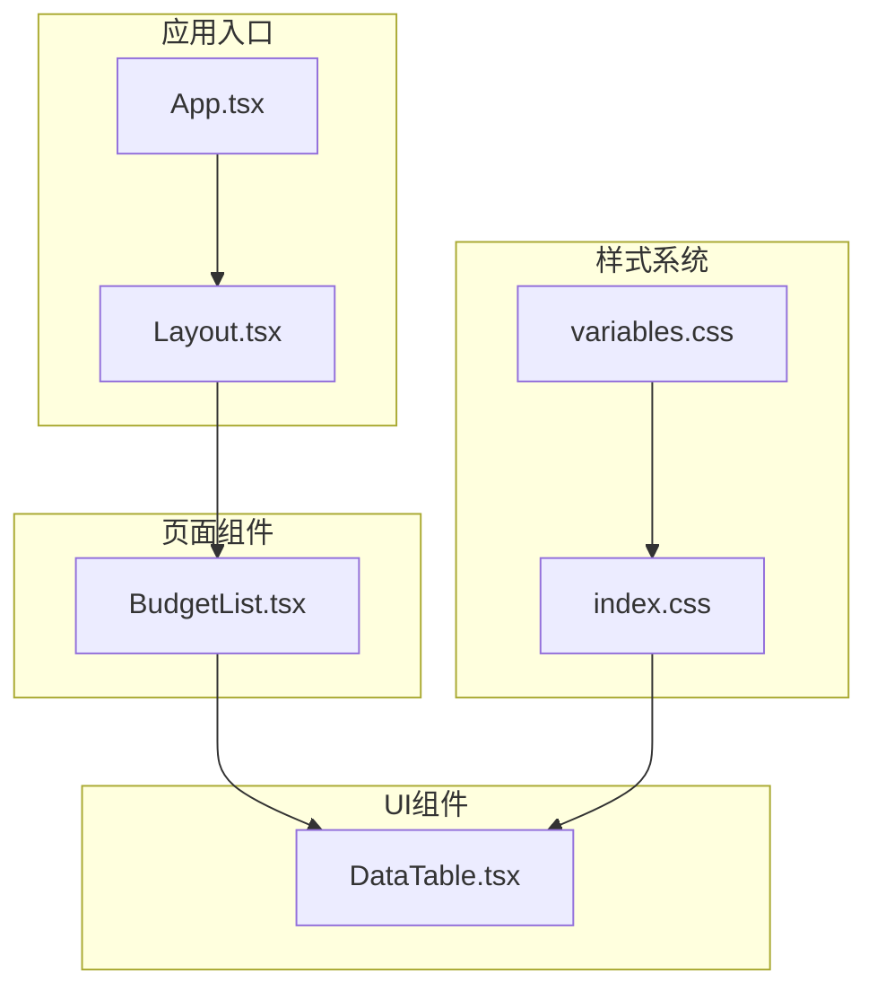
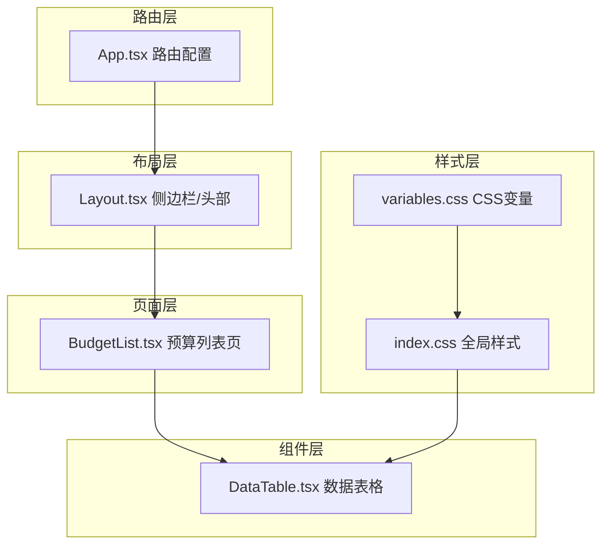
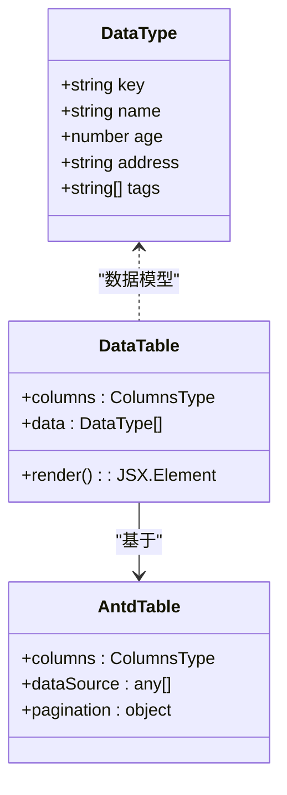
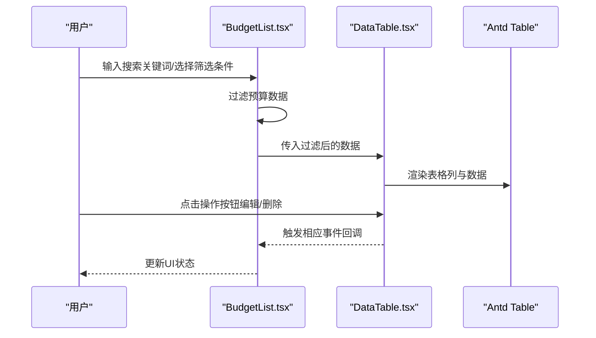
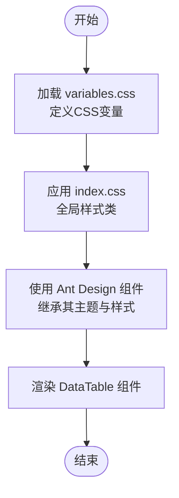
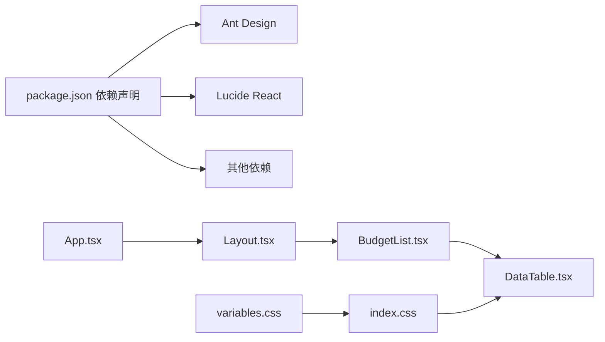

# UI组件库

<cite>
**本文档引用的文件**
- [DataTable.tsx](file://src/components/ui/Table/DataTable.tsx)
- [Layout.tsx](file://src/components/Layout.tsx)
- [variables.css](file://src/styles/variables.css)
- [index.css](file://src/index.css)
- [BudgetList.tsx](file://src/pages/BudgetList.tsx)
- [App.tsx](file://src/App.tsx)
- [vite.config.js](file://vite.config.js)
- [package.json](file://package.json)
</cite>

## 目录
1. [简介](#简介)
2. [项目结构](#项目结构)
3. [核心组件](#核心组件)
4. [架构总览](#架构总览)
5. [详细组件分析](#详细组件分析)
6. [依赖关系分析](#依赖关系分析)
7. [性能考虑](#性能考虑)
8. [故障排除指南](#故障排除指南)
9. [结论](#结论)
10. [附录](#附录)

## 简介
本文件面向预算管理系统的UI组件库，重点围绕DataTable等核心UI组件进行深入解析。内容涵盖：
- 数据表格的渲染机制、排序与筛选、分页处理
- 组件属性配置、事件回调、样式定制选项
- 与Ant Design的设计集成与主题定制策略
- 组件可复用性设计（通用属性抽象、默认值处理、错误边界）
- 使用示例、性能优化建议与自定义扩展方法

## 项目结构
项目采用前端单页应用架构，UI组件集中在src/components目录下，页面组件位于src/pages，样式通过CSS变量与全局样式统一管理。DataTable作为核心UI组件位于src/components/ui/Table/DataTable.tsx，配合BudgetList页面展示其在业务场景中的使用方式。

图表来源
- [App.tsx:1-66](file://src/App.tsx#L1-L66)
- [Layout.tsx:1-99](file://src/components/Layout.tsx#L1-L99)
- [DataTable.tsx:1-108](file://src/components/ui/Table/DataTable.tsx#L1-L108)
- [BudgetList.tsx:1-329](file://src/pages/BudgetList.tsx#L1-L329)
- [variables.css:1-202](file://src/styles/variables.css#L1-L202)
- [index.css:1-464](file://src/index.css#L1-L464)

章节来源
- [App.tsx:1-66](file://src/App.tsx#L1-L66)
- [Layout.tsx:1-99](file://src/components/Layout.tsx#L1-L99)
- [DataTable.tsx:1-108](file://src/components/ui/Table/DataTable.tsx#L1-L108)
- [BudgetList.tsx:1-329](file://src/pages/BudgetList.tsx#L1-L329)
- [variables.css:1-202](file://src/styles/variables.css#L1-L202)
- [index.css:1-464](file://src/index.css#L1-L464)

## 核心组件
本节聚焦DataTable组件的设计理念与实现细节，包括数据表格的渲染机制、排序与筛选、分页处理，以及与Ant Design的集成方式。

- 设计理念
  - 基于Ant Design Table组件进行二次封装，保留其强大的数据表格能力，同时提供更贴合业务的默认配置与样式。
  - 通过ColumnsType接口定义列结构，支持排序、筛选、自定义渲染（如标签Tag、操作按钮）。
  - 内置分页配置，支持每页条数切换、快速跳转与总数显示。

- 实现要点
  - 列定义：包含姓名、年龄、地址、标签、操作等列，其中标签列通过条件渲染生成不同颜色的Tag；操作列提供编辑与删除按钮。
  - 数据源：内置示例数据，便于演示与开发调试。
  - 分页：pageSize固定为10，开启size变更器与快速跳转，并自定义总数文案。

- 与Ant Design的集成
  - 引入Ant Design的Table、Button、Tag、Space等组件，确保一致的交互体验与视觉风格。
  - 通过Ant Design提供的国际化、主题与样式体系，实现统一的UI语言。

章节来源
- [DataTable.tsx:12-107](file://src/components/ui/Table/DataTable.tsx#L12-L107)

## 架构总览
从应用到组件再到样式的整体架构如下：

图表来源
- [App.tsx:29-64](file://src/App.tsx#L29-L64)
- [Layout.tsx:18-98](file://src/components/Layout.tsx#L18-L98)
- [BudgetList.tsx:28-329](file://src/pages/BudgetList.tsx#L28-L329)
- [DataTable.tsx:16-107](file://src/components/ui/Table/DataTable.tsx#L16-L107)
- [variables.css:1-202](file://src/styles/variables.css#L1-L202)
- [index.css:1-464](file://src/index.css#L1-L464)

## 详细组件分析

### DataTable组件分析
DataTable是基于Ant Design Table的增强型表格组件，具备以下特性：
- 渲染机制：通过columns与dataSource驱动表格渲染，支持列级别的自定义渲染。
- 排序与筛选：列定义中提供sorter函数，实现本地排序；页面层通过过滤器实现筛选。
- 分页处理：内置分页配置，支持每页数量切换、快速跳转与总数显示。
- 样式定制：结合全局CSS变量与Ant Design主题，实现统一的视觉风格。

图表来源
- [DataTable.tsx:4-107](file://src/components/ui/Table/DataTable.tsx#L4-L107)

章节来源
- [DataTable.tsx:12-107](file://src/components/ui/Table/DataTable.tsx#L12-L107)

### 页面级使用流程（BudgetList）
BudgetList页面展示了DataTable在业务场景中的典型用法，包括：
- 数据过滤：通过searchTerm、typeFilter、statusFilter实现多维筛选。
- 表格渲染：使用DataTable组件展示预算列表，包含预算金额、已使用、执行率、状态等字段。
- 操作交互：提供查看、编辑、删除等操作入口。

图表来源
- [BudgetList.tsx:28-329](file://src/pages/BudgetList.tsx#L28-L329)
- [DataTable.tsx:16-107](file://src/components/ui/Table/DataTable.tsx#L16-L107)

章节来源
- [BudgetList.tsx:28-329](file://src/pages/BudgetList.tsx#L28-L329)

### 样式与主题定制
- CSS变量体系：通过variables.css定义全局主题变量（主色、成功色、警告色、错误色、文本色、背景色、边框色、字号、行高、间距、圆角、阴影、过渡），为组件提供一致的主题语义。
- 全局样式：index.css引入variables.css并定义通用样式类（按钮、输入框、卡片、表格、标签、模态框、统计卡、进度条、分页、空状态、标签页等），用于补充Ant Design未覆盖的样式需求。
- Ant Design主题集成：项目依赖Ant Design，通过其内置的主题与样式体系实现统一的UI语言；同时可通过CSS变量与全局样式进行微调与扩展。

图表来源
- [variables.css:1-202](file://src/styles/variables.css#L1-L202)
- [index.css:1-464](file://src/index.css#L1-L464)
- [DataTable.tsx:16-107](file://src/components/ui/Table/DataTable.tsx#L16-L107)

章节来源
- [variables.css:1-202](file://src/styles/variables.css#L1-L202)
- [index.css:1-464](file://src/index.css#L1-L464)

## 依赖关系分析
- 外部依赖
  - Ant Design：提供Table、Button、Tag、Space等UI组件，以及主题与样式体系。
  - Lucide React：提供图标资源，用于页面导航与操作按钮。
  - 其他依赖：Axios、React Router、Recharts、ExcelJS等，支撑网络请求、路由、图表与文件处理。
- 内部依赖
  - App.tsx负责路由配置，Layout.tsx提供布局容器，BudgetList.tsx承载业务页面，DataTable.tsx作为核心UI组件被页面引用。
  - 样式系统通过variables.css与index.css形成上下层级关系，为组件提供统一的视觉基础。

图表来源
- [package.json:12-32](file://package.json#L12-L32)
- [App.tsx:1-66](file://src/App.tsx#L1-L66)
- [Layout.tsx:1-99](file://src/components/Layout.tsx#L1-L99)
- [BudgetList.tsx:1-329](file://src/pages/BudgetList.tsx#L1-L329)
- [DataTable.tsx:1-108](file://src/components/ui/Table/DataTable.tsx#L1-L108)
- [variables.css:1-202](file://src/styles/variables.css#L1-L202)
- [index.css:1-464](file://src/index.css#L1-L464)

章节来源
- [package.json:12-32](file://package.json#L12-L32)
- [App.tsx:1-66](file://src/App.tsx#L1-L66)
- [Layout.tsx:1-99](file://src/components/Layout.tsx#L1-L99)
- [BudgetList.tsx:1-329](file://src/pages/BudgetList.tsx#L1-L329)
- [DataTable.tsx:1-108](file://src/components/ui/Table/DataTable.tsx#L1-L108)
- [variables.css:1-202](file://src/styles/variables.css#L1-L202)
- [index.css:1-464](file://src/index.css#L1-L464)

## 性能考虑
- 渲染优化
  - 使用稳定的key值（如DataType.key）提升列表渲染性能，避免不必要的重排。
  - 对复杂列渲染（如标签Tag）进行条件判断与缓存，减少重复计算。
- 数据处理
  - 在BudgetList中对数据进行本地过滤与排序，建议在大数据量时考虑服务端分页与筛选以减轻前端压力。
- 样式加载
  - 通过CSS变量集中管理主题，避免重复定义；合理拆分样式文件，按需引入，减少首屏体积。
- 依赖管理
  - Ant Design组件按需引入，避免全量打包；结合Vite的Tree Shaking能力进一步优化包体大小。

## 故障排除指南
- 表格不显示数据
  - 检查dataSource是否正确传入，确认DataType接口与实际数据结构一致。
  - 确认columns定义的dataIndex与数据字段匹配。
- 排序/筛选无效
  - 确认列定义中的sorter函数逻辑正确，且数据类型支持比较运算。
  - 检查页面层过滤逻辑（如BudgetList中的filter函数）是否正确应用。
- 分页异常
  - 确认pagination配置项（pageSize、showSizeChanger、showQuickJumper、showTotal）是否按预期设置。
- 样式不生效
  - 检查variables.css与index.css是否正确引入，确认CSS变量命名与使用一致。
  - 若使用Ant Design主题，请确保版本兼容性与样式覆盖策略正确。

章节来源
- [DataTable.tsx:16-107](file://src/components/ui/Table/DataTable.tsx#L16-L107)
- [BudgetList.tsx:47-52](file://src/pages/BudgetList.tsx#L47-L52)
- [variables.css:1-202](file://src/styles/variables.css#L1-L202)
- [index.css:1-464](file://src/index.css#L1-L464)

## 结论
本UI组件库以Ant Design为基础，结合项目主题与业务场景，提供了可复用、可扩展的数据表格组件。通过统一的CSS变量体系与全局样式，实现了视觉一致性与灵活定制。建议在后续迭代中：
- 将DataTable抽象为可配置的通用组件，支持外部传入columns、dataSource、pagination等属性。
- 提供默认值与错误边界处理，增强组件的健壮性与易用性。
- 在大数据场景下引入服务端分页与筛选，提升性能与用户体验。

## 附录

### 组件属性与事件参考
- 属性
  - columns：列定义数组，支持排序、筛选与自定义渲染。
  - dataSource：数据源数组，建议使用稳定key。
  - pagination：分页配置对象，支持每页数量、快速跳转与总数显示。
- 事件
  - 排序事件：通过列定义中的sorter回调处理排序逻辑。
  - 筛选事件：通过页面层过滤器处理筛选逻辑。
  - 分页事件：通过pagination配置与Ant Design的分页回调处理翻页逻辑。

章节来源
- [DataTable.tsx:16-107](file://src/components/ui/Table/DataTable.tsx#L16-L107)
- [BudgetList.tsx:47-52](file://src/pages/BudgetList.tsx#L47-L52)

### 使用示例与最佳实践
- 基础用法
  - 在页面组件中引入DataTable，传入columns与dataSource，即可渲染表格。
- 自定义渲染
  - 在列定义的render函数中实现标签、按钮等自定义内容。
- 样式定制
  - 通过CSS变量与全局样式类进行主题定制与样式覆盖。
- 性能优化
  - 对大数据量场景采用服务端分页与筛选；对复杂渲染进行缓存与简化。

章节来源
- [DataTable.tsx:16-107](file://src/components/ui/Table/DataTable.tsx#L16-L107)
- [BudgetList.tsx:28-329](file://src/pages/BudgetList.tsx#L28-L329)
- [variables.css:1-202](file://src/styles/variables.css#L1-L202)
- [index.css:1-464](file://src/index.css#L1-L464)