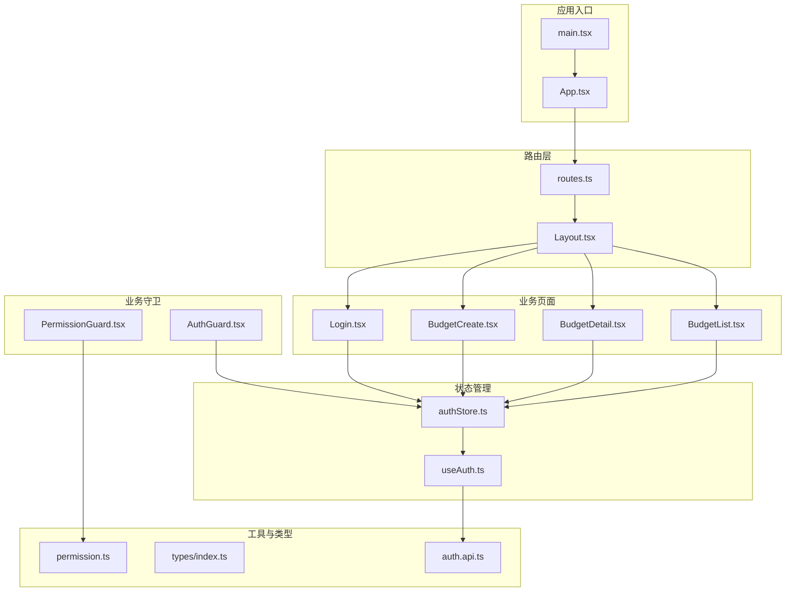
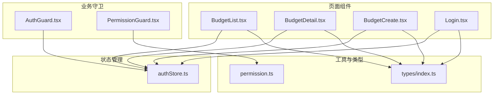
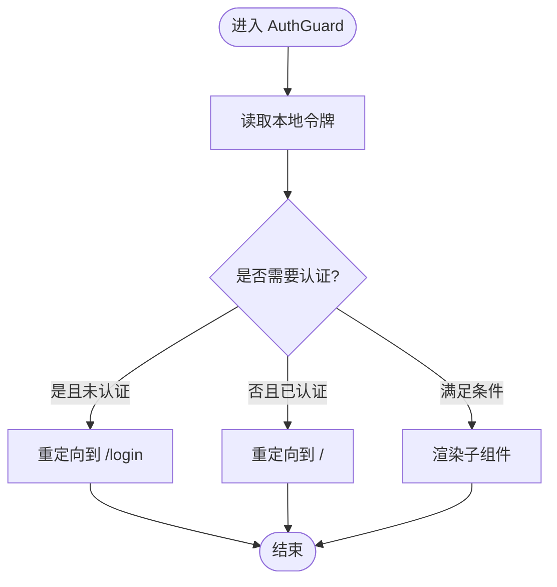
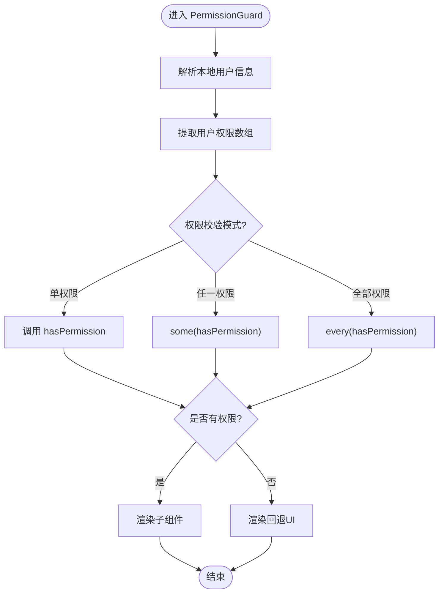
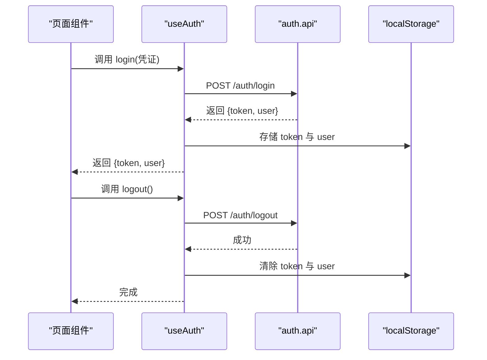
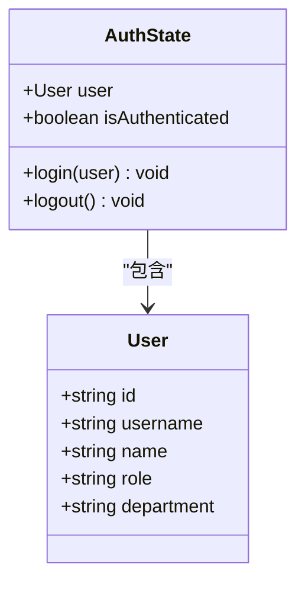
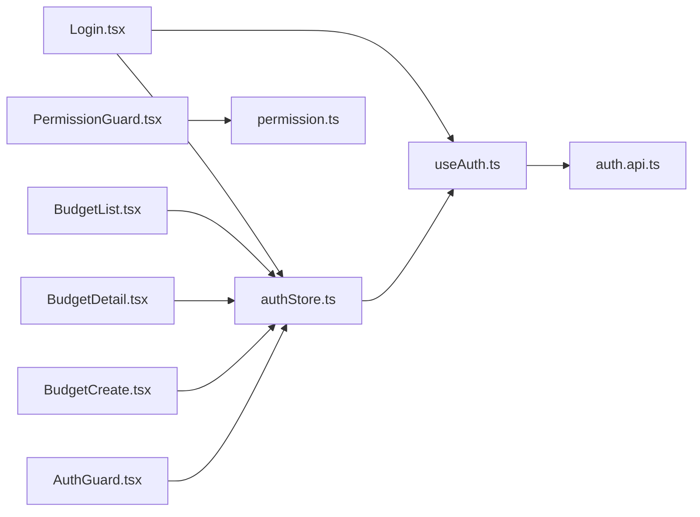

# 业务组件封装

<cite>
**本文引用的文件**
- [AuthGuard.tsx](file://src/components/guard/AuthGuard.tsx)
- [PermissionGuard.tsx](file://src/components/guard/PermissionGuard.tsx)
- [authStore.ts](file://src/store/authStore.ts)
- [useAuth.ts](file://src/hooks/useAuth.ts)
- [permission.ts](file://src/utils/permission.ts)
- [routes.ts](file://src/router/routes.ts)
- [index.ts](file://src/types/index.ts)
- [auth.api.ts](file://src/api/modules/auth.api.ts)
- [BudgetList.tsx](file://src/pages/BudgetList.tsx)
- [BudgetDetail.tsx](file://src/pages/BudgetDetail.tsx)
- [BudgetCreate.tsx](file://src/pages/BudgetCreate.tsx)
- [Login.tsx](file://src/pages/Login.tsx)
- [Layout.tsx](file://src/components/Layout.tsx)
- [DataTable.tsx](file://src/components/ui/Table/DataTable.tsx)
- [App.tsx](file://src/App.tsx)
- [main.tsx](file://src/main.tsx)
</cite>

## 目录
1. [引言](#引言)
2. [项目结构](#项目结构)
3. [核心组件](#核心组件)
4. [架构总览](#架构总览)
5. [详细组件分析](#详细组件分析)
6. [依赖关系分析](#依赖关系分析)
7. [性能考虑](#性能考虑)
8. [故障排查指南](#故障排查指南)
9. [结论](#结论)
10. [附录](#附录)

## 引言
本文件围绕预算管理系统的“业务组件封装”主题，系统化梳理前端业务组件的设计原则、封装策略与集成方式，重点覆盖以下方面：
- 权限守卫组件（AuthGuard、PermissionGuard）的实现机制与路由保护策略
- 业务组件与状态管理系统（Zustand）的集成模式
- 组件间通信与事件传递机制
- 开发规范与测试策略建议

## 项目结构
系统采用按功能域划分的目录组织方式，核心结构如下：
- components：通用UI与业务守卫组件
- pages：页面级业务组件
- store：状态管理（Zustand）
- hooks：自定义Hook（如认证）
- api：API客户端与类型
- router：路由配置
- utils：工具函数（权限等）
- types：全局类型定义



**图示来源**
- [main.tsx:1-26](file://src/main.tsx#L1-L26)
- [App.tsx:1-66](file://src/App.tsx#L1-L66)
- [routes.ts:1-122](file://src/router/routes.ts#L1-L122)
- [Layout.tsx:1-99](file://src/components/Layout.tsx#L1-L99)
- [BudgetList.tsx:1-329](file://src/pages/BudgetList.tsx#L1-L329)
- [BudgetDetail.tsx:1-159](file://src/pages/BudgetDetail.tsx#L1-L159)
- [BudgetCreate.tsx:1-200](file://src/pages/BudgetCreate.tsx#L1-L200)
- [Login.tsx:1-102](file://src/pages/Login.tsx#L1-L102)
- [AuthGuard.tsx:1-31](file://src/components/guard/AuthGuard.tsx#L1-L31)
- [PermissionGuard.tsx:1-88](file://src/components/guard/PermissionGuard.tsx#L1-L88)
- [authStore.ts:1-31](file://src/store/authStore.ts#L1-L31)
- [useAuth.ts:1-84](file://src/hooks/useAuth.ts#L1-L84)
- [permission.ts:1-84](file://src/utils/permission.ts#L1-L84)
- [auth.api.ts:1-50](file://src/api/modules/auth.api.ts#L1-L50)

**章节来源**
- [main.tsx:1-26](file://src/main.tsx#L1-L26)
- [App.tsx:1-66](file://src/App.tsx#L1-L66)
- [routes.ts:1-122](file://src/router/routes.ts#L1-L122)

## 核心组件
本节聚焦于业务组件封装的关键构件及其职责边界。

- 认证守卫（AuthGuard）
  - 职责：基于本地认证状态保护页面访问；支持“必须登录/无需登录”的切换
  - 关键点：读取本地存储中的令牌，决定重定向或放行
- 权限守卫（PermissionGuard）
  - 职责：在UI层面进行细粒度权限控制（按钮、功能块）
  - 关键点：从本地存储解析用户权限，支持“任一/全部”权限校验
- 认证Hook（useAuth）
  - 职责：封装登录、登出、修改密码、获取当前用户等API调用
  - 关键点：与后端API对接，维护本地存储
- Zustand认证Store（authStore）
  - 职责：管理用户会话状态与认证标志位，支持持久化
  - 关键点：提供login/logout方法，持久化到本地存储
- 权限工具（permission）
  - 职责：权限判断、权限枚举、权限字符串生成
  - 关键点：管理员拥有所有权限；提供“任一/全部”权限检查

**章节来源**
- [AuthGuard.tsx:1-31](file://src/components/guard/AuthGuard.tsx#L1-L31)
- [PermissionGuard.tsx:1-88](file://src/components/guard/PermissionGuard.tsx#L1-L88)
- [useAuth.ts:1-84](file://src/hooks/useAuth.ts#L1-L84)
- [authStore.ts:1-31](file://src/store/authStore.ts#L1-L31)
- [permission.ts:1-84](file://src/utils/permission.ts#L1-L84)

## 架构总览
系统采用“页面组件 + 业务守卫 + 状态管理 + 工具函数”的分层架构：
- 页面组件负责业务展示与交互
- 业务守卫负责路由与UI级权限控制
- 状态管理负责认证状态与用户信息
- 工具函数提供权限判断与类型支撑



**图示来源**
- [BudgetList.tsx:1-329](file://src/pages/BudgetList.tsx#L1-L329)
- [BudgetDetail.tsx:1-159](file://src/pages/BudgetDetail.tsx#L1-L159)
- [BudgetCreate.tsx:1-200](file://src/pages/BudgetCreate.tsx#L1-L200)
- [Login.tsx:1-102](file://src/pages/Login.tsx#L1-L102)
- [AuthGuard.tsx:1-31](file://src/components/guard/AuthGuard.tsx#L1-L31)
- [PermissionGuard.tsx:1-88](file://src/components/guard/PermissionGuard.tsx#L1-L88)
- [authStore.ts:1-31](file://src/store/authStore.ts#L1-L31)
- [permission.ts:1-84](file://src/utils/permission.ts#L1-L84)
- [index.ts:1-338](file://src/types/index.ts#L1-L338)

## 详细组件分析

### 认证守卫组件（AuthGuard）
- 设计原则
  - 单一职责：仅处理认证相关的路由保护
  - 可配置性：通过属性控制是否需要认证
  - 无侵入性：以高阶组件形式包裹子节点
- 数据流向
  - 读取本地存储中的令牌
  - 根据requireAuth与认证状态决定重定向或渲染子节点
- 错误处理
  - 未认证且需要认证时，重定向至登录页
  - 已认证且无需认证时，重定向至首页



**图示来源**
- [AuthGuard.tsx:13-30](file://src/components/guard/AuthGuard.tsx#L13-L30)

**章节来源**
- [AuthGuard.tsx:1-31](file://src/components/guard/AuthGuard.tsx#L1-L31)

### 权限守卫组件（PermissionGuard）
- 设计原则
  - UI级权限控制：在按钮、菜单项等UI元素上进行权限判断
  - 支持多种校验模式：单权限、任一权限、全部权限
  - 可定制回退UI：无权限时显示占位或隐藏
- 数据流向
  - 从本地存储解析用户权限
  - 调用权限工具函数进行判断
  - 决定渲染子节点或回退UI
- Hook辅助（usePermission）
  - 提供权限查询能力，便于在业务组件中直接使用



**图示来源**
- [PermissionGuard.tsx:15-46](file://src/components/guard/PermissionGuard.tsx#L15-L46)
- [permission.ts:11-21](file://src/utils/permission.ts#L11-L21)

**章节来源**
- [PermissionGuard.tsx:1-88](file://src/components/guard/PermissionGuard.tsx#L1-L88)
- [permission.ts:1-84](file://src/utils/permission.ts#L1-L84)

### 认证Hook与API集成（useAuth + auth.api）
- 设计原则
  - 将API调用封装为易用的Hook，屏蔽网络细节
  - 本地存储与服务端状态保持一致
- 数据流向
  - 登录成功后写入令牌与用户信息
  - 登出时清理本地存储并调用后端接口
  - 提供获取当前用户与检查登录状态的方法



**图示来源**
- [useAuth.ts:12-36](file://src/hooks/useAuth.ts#L12-L36)
- [auth.api.ts:14-49](file://src/api/modules/auth.api.ts#L14-L49)

**章节来源**
- [useAuth.ts:1-84](file://src/hooks/useAuth.ts#L1-L84)
- [auth.api.ts:1-50](file://src/api/modules/auth.api.ts#L1-L50)

### Zustand认证Store（authStore）
- 设计原则
  - 轻量级状态管理，集中管理认证状态
  - 支持持久化，避免刷新丢失状态
- 数据结构
  - user：当前用户信息
  - isAuthenticated：认证标志
  - login/logout：状态更新方法
- 集成方式
  - 页面组件通过store读取认证状态
  - 守卫组件通过store判断是否放行



**图示来源**
- [authStore.ts:4-17](file://src/store/authStore.ts#L4-L17)

**章节来源**
- [authStore.ts:1-31](file://src/store/authStore.ts#L1-L31)

### 页面组件与业务组件
- 预算列表（BudgetList）
  - 职责：预算数据展示、筛选、新增/编辑弹窗
  - 交互：本地状态驱动UI，模拟数据驱动
- 预算详情（BudgetDetail）
  - 职责：预算概览、明细、审批历史
  - 交互：参数路由驱动详情加载
- 预算创建（BudgetCreate）
  - 职责：预算表单、明细行增删改
  - 交互：表单联动计算预算合计

```mermaid
sequenceDiagram
participant User as "用户"
participant List as "BudgetList"
participant Detail as "BudgetDetail"
participant Create as "BudgetCreate"
User->>List : 打开预算列表
List-->>User : 展示预算表格与筛选器
User->>List : 点击“新建预算”
List->>Create : 跳转到创建页
Create-->>User : 表单输入与合计计算
User->>Detail : 点击“查看”进入详情
Detail-->>User : 展示概览、明细与审批历史
```

**图示来源**
- [BudgetList.tsx:28-105](file://src/pages/BudgetList.tsx#L28-L105)
- [BudgetDetail.tsx:32-60](file://src/pages/BudgetDetail.tsx#L32-L60)
- [BudgetCreate.tsx:12-47](file://src/pages/BudgetCreate.tsx#L12-L47)

**章节来源**
- [BudgetList.tsx:1-329](file://src/pages/BudgetList.tsx#L1-L329)
- [BudgetDetail.tsx:1-159](file://src/pages/BudgetDetail.tsx#L1-L159)
- [BudgetCreate.tsx:1-200](file://src/pages/BudgetCreate.tsx#L1-L200)

### UI组件与表格示例（DataTable）
- 设计原则：基于第三方UI库（Ant Design）构建增强型表格
- 功能：列定义、排序、筛选、分页、渲染器
- 适用场景：业务数据展示与交互

**章节来源**
- [DataTable.tsx:1-108](file://src/components/ui/Table/DataTable.tsx#L1-L108)

## 依赖关系分析
- 组件耦合
  - 页面组件依赖状态管理（Zustand）与工具函数（权限）
  - 业务守卫依赖状态管理与权限工具
  - 认证Hook依赖API模块
- 外部依赖
  - React Router：路由与导航
  - Zustand：状态管理
  - Ant Design：UI组件库
  - Lucide：图标库



**图示来源**
- [Login.tsx:1-102](file://src/pages/Login.tsx#L1-L102)
- [BudgetList.tsx:1-329](file://src/pages/BudgetList.tsx#L1-L329)
- [BudgetDetail.tsx:1-159](file://src/pages/BudgetDetail.tsx#L1-L159)
- [BudgetCreate.tsx:1-200](file://src/pages/BudgetCreate.tsx#L1-L200)
- [AuthGuard.tsx:1-31](file://src/components/guard/AuthGuard.tsx#L1-L31)
- [PermissionGuard.tsx:1-88](file://src/components/guard/PermissionGuard.tsx#L1-L88)
- [authStore.ts:1-31](file://src/store/authStore.ts#L1-L31)
- [useAuth.ts:1-84](file://src/hooks/useAuth.ts#L1-L84)
- [auth.api.ts:1-50](file://src/api/modules/auth.api.ts#L1-L50)

**章节来源**
- [App.tsx:24-27](file://src/App.tsx#L24-L27)
- [Layout.tsx:18-26](file://src/components/Layout.tsx#L18-L26)

## 性能考虑
- 路由懒加载：页面组件采用懒加载，降低首屏负载
- 状态局部化：Zustand按需订阅，避免全局重渲染
- 本地存储：认证信息持久化，减少重复登录
- UI优化：表格组件使用虚拟化与分页，提升大数据展示性能

[本节为通用指导，不直接分析具体文件]

## 故障排查指南
- 登录后无法进入受保护页面
  - 检查本地存储中是否存在令牌
  - 确认守卫组件的requireAuth配置
- 权限按钮不显示
  - 检查本地用户信息中的权限数组
  - 确认权限字符串格式与权限枚举一致
- 登出后仍显示受保护内容
  - 确认登出流程是否清除本地存储
  - 检查路由守卫是否正确读取状态
- 页面刷新丢失登录状态
  - 确认Zustand持久化配置是否生效

**章节来源**
- [AuthGuard.tsx:17-27](file://src/components/guard/AuthGuard.tsx#L17-L27)
- [PermissionGuard.tsx:22-43](file://src/components/guard/PermissionGuard.tsx#L22-L43)
- [useAuth.ts:26-36](file://src/hooks/useAuth.ts#L26-L36)
- [authStore.ts:19-31](file://src/store/authStore.ts#L19-L31)

## 结论
本系统通过“页面组件 + 业务守卫 + 状态管理 + 工具函数”的分层架构，实现了清晰的职责划分与良好的扩展性。认证与权限控制在多个层次协同工作，既保证了安全性，又提升了用户体验。建议在后续迭代中进一步完善权限模型与API对接，持续优化性能与可维护性。

[本节为总结性内容，不直接分析具体文件]

## 附录
- 开发规范建议
  - 组件命名：语义化、可读性强
  - 文件组织：按功能域划分，避免交叉依赖
  - 类型约束：全面使用TypeScript类型
  - 状态管理：最小化共享状态，优先使用局部状态
- 测试策略建议
  - 单元测试：针对Hook与工具函数进行断言
  - 集成测试：页面组件与路由守卫的组合场景
  - 端到端测试：登录、权限控制、关键业务流程

[本节为通用指导，不直接分析具体文件]