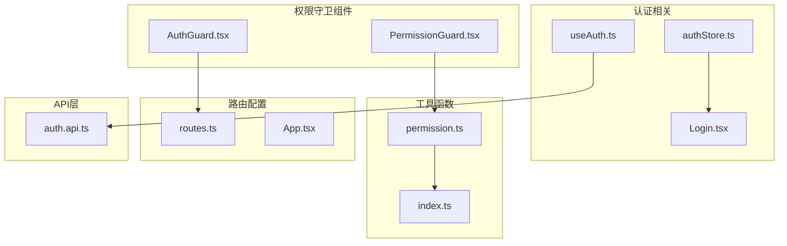
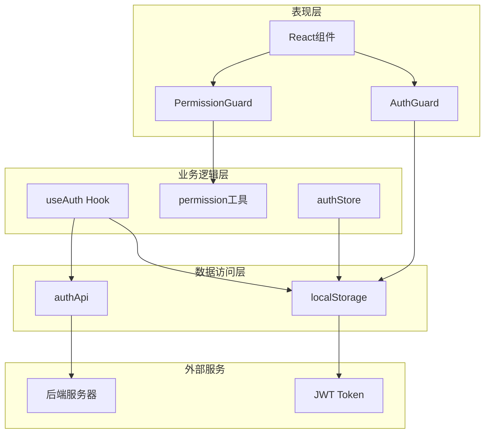
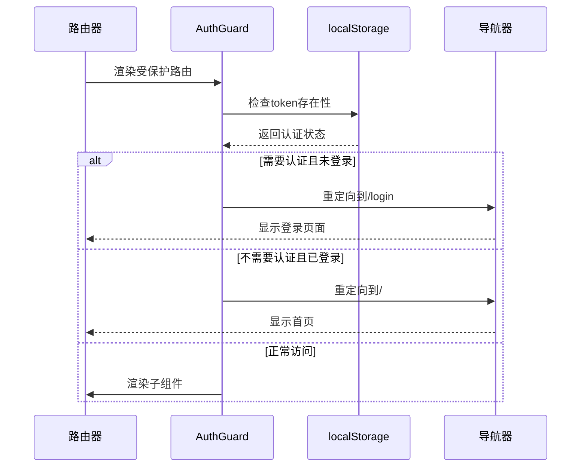
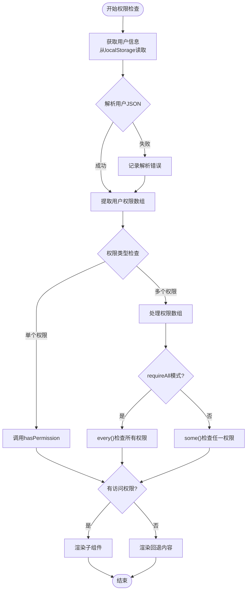
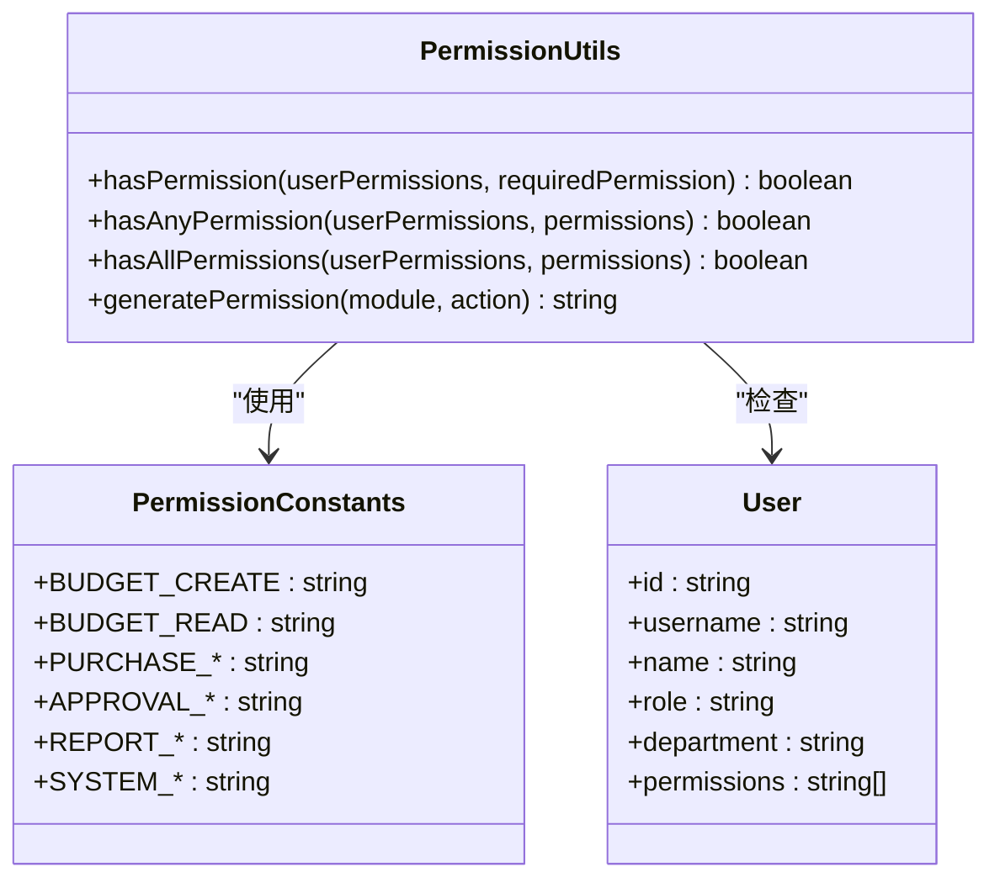
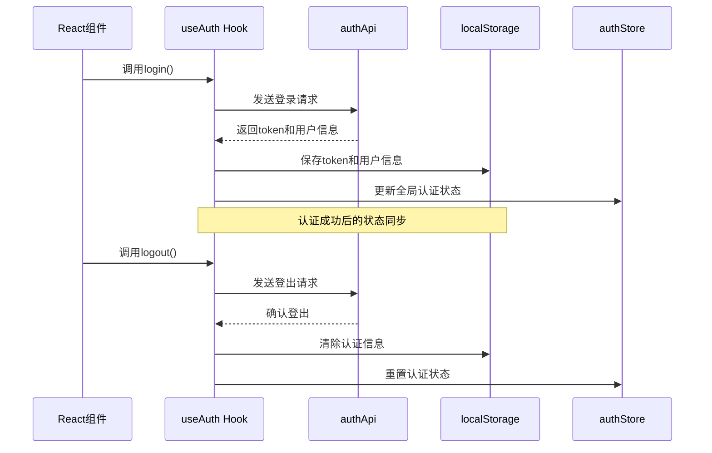
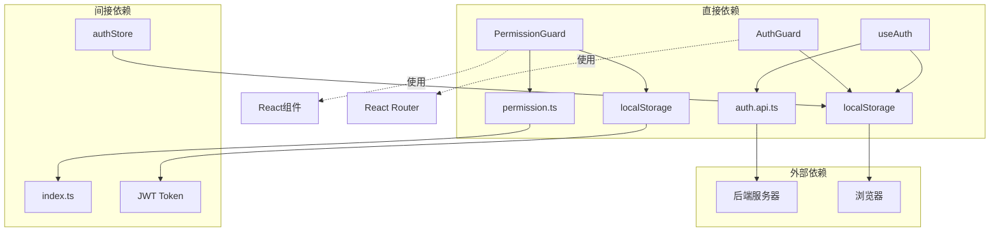

# 权限守卫组件

<cite>
**本文档引用的文件**
- [AuthGuard.tsx](file://src/components/guard/AuthGuard.tsx)
- [PermissionGuard.tsx](file://src/components/guard/PermissionGuard.tsx)
- [useAuth.ts](file://src/hooks/useAuth.ts)
- [authStore.ts](file://src/store/authStore.ts)
- [permission.ts](file://src/utils/permission.ts)
- [routes.ts](file://src/router/routes.ts)
- [App.tsx](file://src/App.tsx)
- [auth.api.ts](file://src/api/modules/auth.api.ts)
- [Login.tsx](file://src/pages/Login.tsx)
- [index.ts](file://src/types/index.ts)
</cite>

## 目录
1. [简介](#简介)
2. [项目结构](#项目结构)
3. [核心组件](#核心组件)
4. [架构概览](#架构概览)
5. [详细组件分析](#详细组件分析)
6. [依赖关系分析](#依赖关系分析)
7. [性能考虑](#性能考虑)
8. [故障排除指南](#故障排除指南)
9. [结论](#结论)
10. [附录](#附录)

## 简介

预算管理系统的权限守卫组件是实现细粒度访问控制的核心机制。本文档深入解析了AuthGuard和PermissionGuard两个关键组件的实现原理和工作机制，涵盖JWT令牌验证流程、用户身份认证、权限检查逻辑等核心功能。

系统采用双重认证机制：路由级别的AuthGuard用于页面级访问控制，按钮级的PermissionGuard用于UI元素的细粒度权限控制。通过localStorage存储认证状态和用户信息，结合Zustand状态管理库实现全局状态同步。

## 项目结构

权限守卫组件位于src/components/guard目录下，与认证相关的Hook、Store、工具函数分布在不同的模块中：



**图表来源**
- [AuthGuard.tsx:1-31](file://src/components/guard/AuthGuard.tsx#L1-L31)
- [PermissionGuard.tsx:1-88](file://src/components/guard/PermissionGuard.tsx#L1-L88)
- [useAuth.ts:1-84](file://src/hooks/useAuth.ts#L1-L84)
- [authStore.ts:1-31](file://src/store/authStore.ts#L1-L31)

**章节来源**
- [AuthGuard.tsx:1-31](file://src/components/guard/AuthGuard.tsx#L1-L31)
- [PermissionGuard.tsx:1-88](file://src/components/guard/PermissionGuard.tsx#L1-L88)
- [useAuth.ts:1-84](file://src/hooks/useAuth.ts#L1-L84)
- [authStore.ts:1-31](file://src/store/authStore.ts#L1-L31)

## 核心组件

### AuthGuard - 路由级认证守卫

AuthGuard是一个React组件，负责路由级别的访问控制。它通过检查localStorage中的token来判断用户是否已认证，并根据requireAuth属性决定重定向行为。

**主要特性：**
- 支持可选认证和强制认证两种模式
- 自动重定向到登录页或首页
- 无状态组件设计，性能优化

### PermissionGuard - 按钮级权限守卫

PermissionGuard专门用于UI元素的权限控制，支持单个权限和多个权限的组合验证，以及requireAll选项控制权限匹配策略。

**核心功能：**
- 动态权限判断和UI元素条件渲染
- 支持任意权限和所有权限两种验证模式
- 自定义回退内容显示

**章节来源**
- [AuthGuard.tsx:9-30](file://src/components/guard/AuthGuard.tsx#L9-L30)
- [PermissionGuard.tsx:11-46](file://src/components/guard/PermissionGuard.tsx#L11-L46)

## 架构概览

系统采用分层架构设计，权限控制贯穿整个应用：



**图表来源**
- [App.tsx:24-27](file://src/App.tsx#L24-L27)
- [useAuth.ts:12-21](file://src/hooks/useAuth.ts#L12-L21)
- [authStore.ts:19-31](file://src/store/authStore.ts#L19-L31)

## 详细组件分析

### AuthGuard组件深度解析

AuthGuard实现了简洁而高效的路由级认证机制：



**图表来源**
- [AuthGuard.tsx:13-30](file://src/components/guard/AuthGuard.tsx#L13-L30)

**实现特点：**
- 使用localStorage存储JWT token
- 支持requireAuth参数控制认证需求
- 自动处理重定向逻辑

**章节来源**
- [AuthGuard.tsx:13-30](file://src/components/guard/AuthGuard.tsx#L13-L30)

### PermissionGuard组件深度解析

PermissionGuard提供了灵活的权限控制系统：



**图表来源**
- [PermissionGuard.tsx:15-46](file://src/components/guard/PermissionGuard.tsx#L15-L46)

**权限验证策略：**
- 管理员拥有所有权限（包含admin或*）
- 支持requireAll和requireAny两种验证模式
- 自定义回退内容处理权限不足情况

**章节来源**
- [PermissionGuard.tsx:15-88](file://src/components/guard/PermissionGuard.tsx#L15-L88)

### 权限工具函数系统

系统提供了完整的权限管理工具集：



**图表来源**
- [permission.ts:11-84](file://src/utils/permission.ts#L11-L84)

**权限枚举体系：**
- 预算管理权限：create、read、update、delete、approve、export
- 采购管理权限：create、read、update、delete、approve、export  
- 审批权限：read、approve
- 报表权限：read、export
- 系统管理权限：user.manage、role.manage、config、audit

**章节来源**
- [permission.ts:11-84](file://src/utils/permission.ts#L11-L84)

### 认证Hook集成

useAuth Hook提供了完整的认证生命周期管理：



**图表来源**
- [useAuth.ts:12-36](file://src/hooks/useAuth.ts#L12-L36)
- [authStore.ts:19-26](file://src/store/authStore.ts#L19-L26)

**认证流程特点：**
- 异步API调用和状态更新
- localStorage持久化存储
- 全局状态同步机制
- 错误处理和异常捕获

**章节来源**
- [useAuth.ts:12-82](file://src/hooks/useAuth.ts#L12-L82)

### 路由配置与权限控制

系统采用声明式路由配置，每个路由都明确标注了认证需求：

| 路由路径 | 认证需求 | 页面描述 |
|---------|---------|---------|
| /login | false | 登录页面 |
| / | true | 仪表板 |
| /budgets | true | 预算列表 |
| /budgets/create | true | 新建预算 |
| /budgets/:id | true | 预算详情 |
| /purchases | true | 采购申请列表 |
| /approvals | true | 审批页面 |
| /settings | true | 系统设置 |

**章节来源**
- [routes.ts:25-121](file://src/router/routes.ts#L25-L121)

## 依赖关系分析

权限守卫组件之间的依赖关系清晰明确：



**图表来源**
- [PermissionGuard.tsx:1-2](file://src/components/guard/PermissionGuard.tsx#L1-L2)
- [useAuth.ts:2-3](file://src/hooks/useAuth.ts#L2-L3)

**依赖特点：**
- 最小化外部依赖，提高组件独立性
- localStorage作为单一数据源
- 清晰的模块边界和职责分离

**章节来源**
- [PermissionGuard.tsx:1-2](file://src/components/guard/PermissionGuard.tsx#L1-L2)
- [useAuth.ts:2-3](file://src/hooks/useAuth.ts#L2-L3)

## 性能考虑

### 缓存策略
- localStorage读写操作避免重复网络请求
- 权限检查结果可缓存减少重复计算
- 组件渲染优化避免不必要的重新渲染

### 内存管理
- 及时清理localStorage中的过期数据
- 合理使用React.memo优化组件性能
- 避免在权限检查中进行昂贵的计算操作

### 网络优化
- 批量权限检查减少API调用次数
- 智能重试机制处理网络异常
- 缓存用户信息避免重复获取

## 故障排除指南

### 常见问题及解决方案

**问题1：权限检查总是返回false**
- 检查localStorage中user数据格式
- 验证权限字符串格式是否正确
- 确认管理员权限标识符存在

**问题2：路由重定向循环**
- 检查localStorage中token状态
- 验证路由配置的requiresAuth属性
- 确认AuthGuard组件参数设置

**问题3：权限变更不生效**
- 刷新页面确保状态同步
- 检查useAuth Hook的状态更新
- 验证authStore的持久化配置

**章节来源**
- [PermissionGuard.tsx:25-32](file://src/components/guard/PermissionGuard.tsx#L25-L32)
- [useAuth.ts:63-73](file://src/hooks/useAuth.ts#L63-L73)

## 结论

预算管理系统的权限守卫组件设计精良，实现了从路由级到按钮级的全方位访问控制。通过localStorage存储和Zustand状态管理的结合，系统提供了高效、可靠的权限控制机制。

主要优势：
- **模块化设计**：组件职责清晰，易于维护和扩展
- **灵活性强**：支持多种权限验证模式和自定义配置
- **性能优化**：最小化依赖，优化渲染性能
- **用户体验**：无缝的认证体验和友好的错误处理

建议的改进方向：
- 集成JWT令牌刷新机制
- 实现权限缓存和批量检查
- 增加权限审计日志功能
- 支持动态权限配置

## 附录

### 使用示例

**路由级权限控制：**
```typescript
// 在路由配置中使用
<Route path="/protected" element={
  <AuthGuard requireAuth={true}>
    <ProtectedComponent />
  </AuthGuard>
} />
```

**按钮级权限控制：**
```typescript
// 在组件中使用
<PermissionGuard permission="budget.create" fallback={<span>无权限</span>}>
  <button>新建预算</button>
</PermissionGuard>
```

**Hook权限检查：**
```typescript
// 使用usePermission Hook
const { checkPermission, checkAnyPermission } = usePermission();
const canCreate = checkPermission('budget.create');
const canManage = checkAnyPermission(['budget.update', 'budget.delete']);
```

### 最佳实践

1. **权限设计原则**
   - 使用模块化权限命名空间
   - 优先使用管理员权限标识符
   - 避免硬编码权限字符串

2. **性能优化**
   - 缓存权限检查结果
   - 批量权限验证减少开销
   - 智能重渲染避免不必要的更新

3. **安全考虑**
   - 严格验证用户输入
   - 实施适当的错误处理
   - 定期清理过期的认证数据

4. **用户体验**
   - 提供清晰的权限提示信息
   - 实现优雅的降级处理
   - 保持一致的权限反馈机制