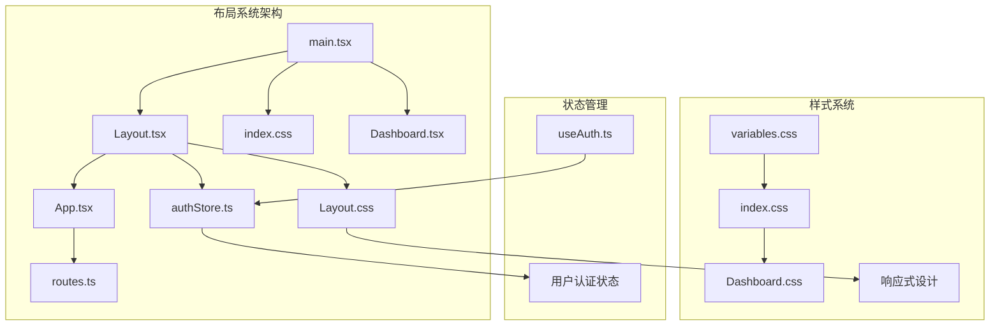
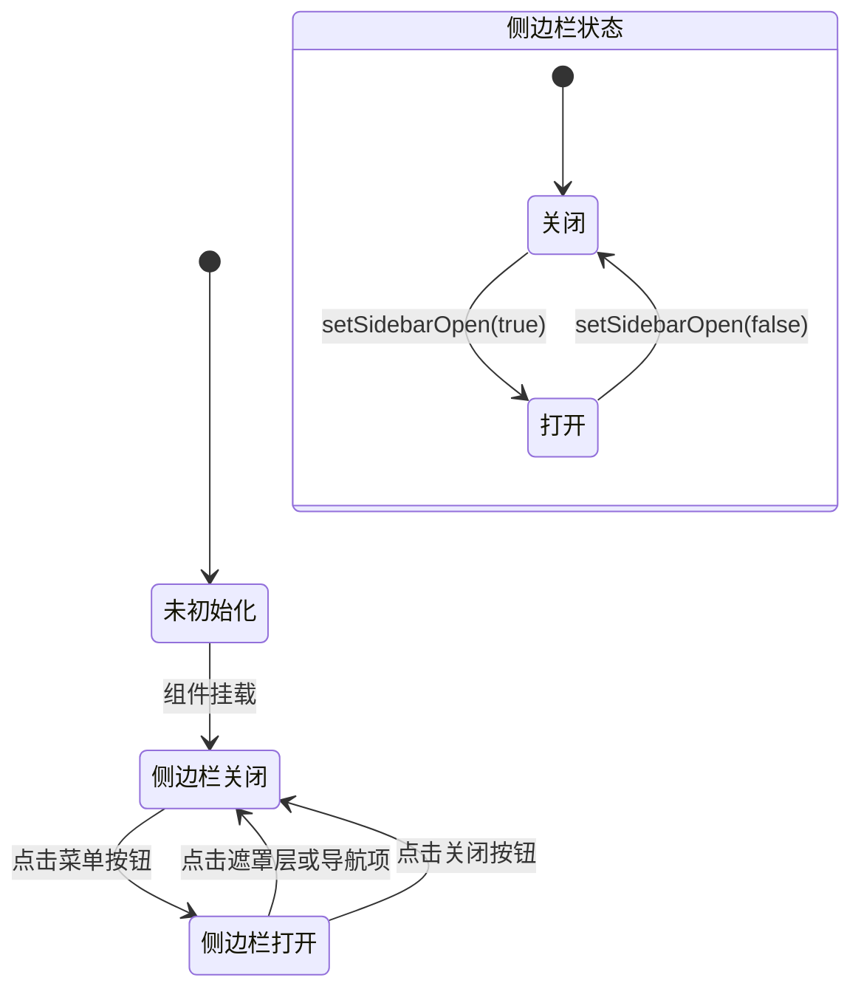
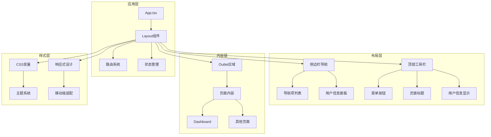
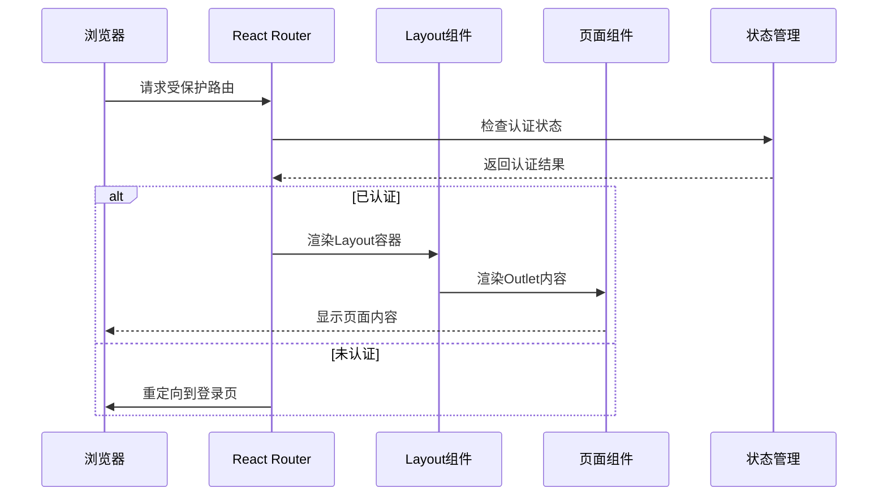
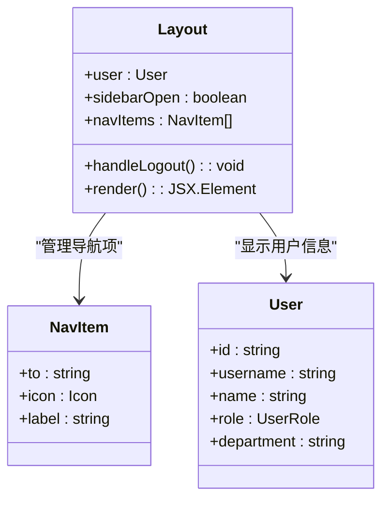
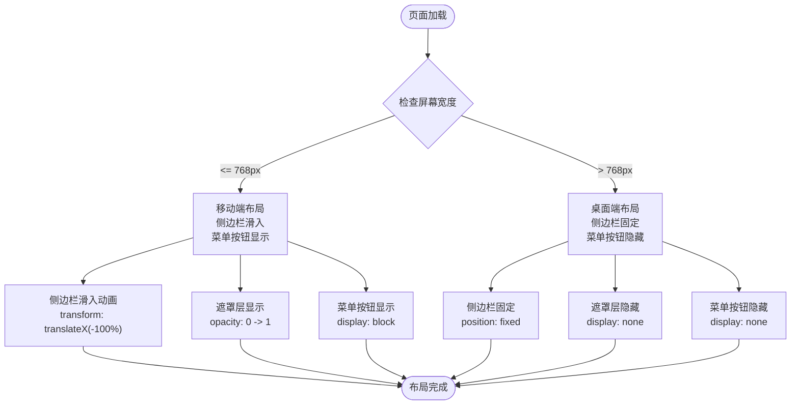
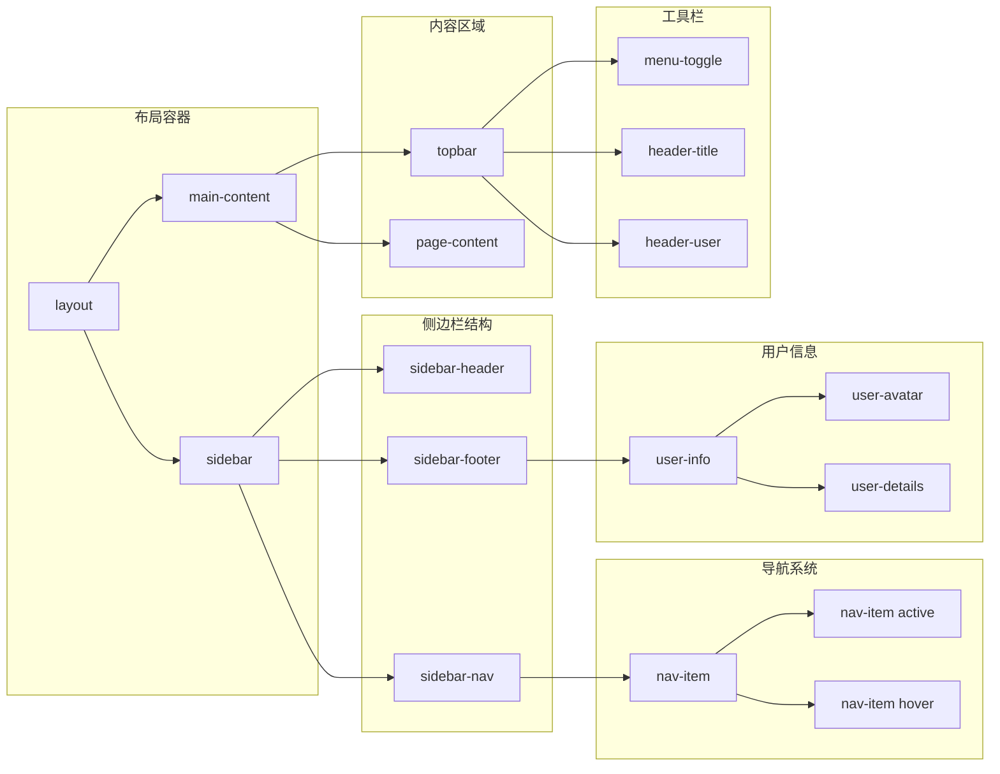
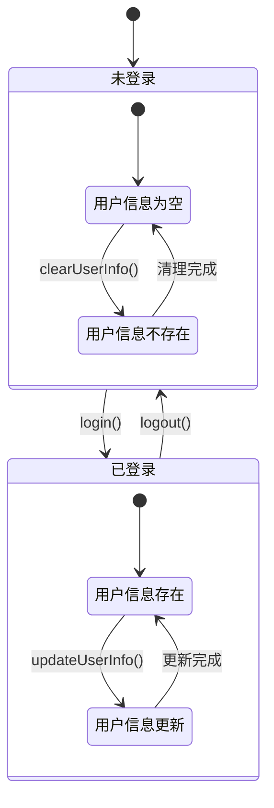
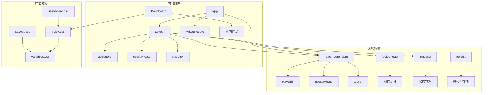
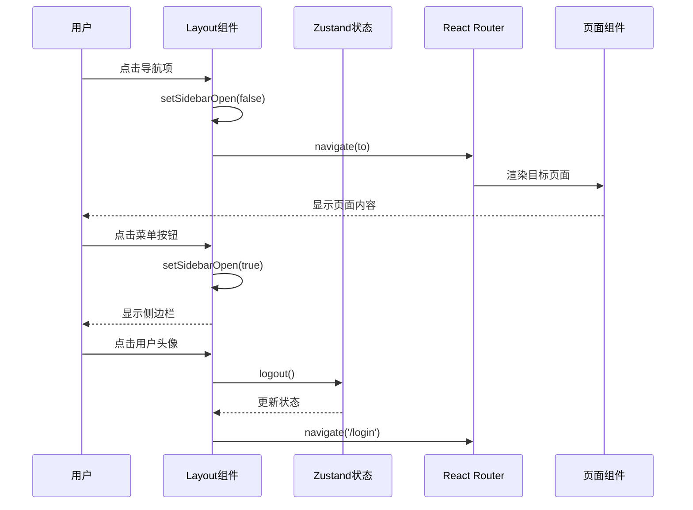

# 布局系统设计

<cite>
**本文档引用的文件**
- [Layout.tsx](file://src/components/Layout.tsx)
- [Layout.css](file://src/components/Layout.css)
- [App.tsx](file://src/App.tsx)
- [routes.ts](file://src/router/routes.ts)
- [authStore.ts](file://src/store/authStore.ts)
- [variables.css](file://src/styles/variables.css)
- [useAuth.ts](file://src/hooks/useAuth.ts)
- [Dashboard.tsx](file://src/pages/Dashboard.tsx)
- [main.tsx](file://src/main.tsx)
- [Dashboard.css](file://src/pages/Dashboard.css)
- [index.css](file://src/index.css)
</cite>

## 目录
1. [简介](#简介)
2. [项目结构](#项目结构)
3. [核心组件](#核心组件)
4. [架构概览](#架构概览)
5. [详细组件分析](#详细组件分析)
6. [依赖关系分析](#依赖关系分析)
7. [性能考虑](#性能考虑)
8. [故障排除指南](#故障排除指南)
9. [结论](#结论)

## 简介

预算管理系统采用现代化的前端架构，基于React和TypeScript构建。布局系统作为整个应用的核心基础设施，提供了统一的导航体验和响应式设计支持。该系统实现了完整的侧边栏导航、移动端适配、用户状态管理和路由集成等功能。

## 项目结构

预算管理系统的布局系统采用模块化设计，主要包含以下核心文件：

**图表来源**
- [Layout.tsx:1-99](file://src/components/Layout.tsx#L1-L99)
- [App.tsx:1-66](file://src/App.tsx#L1-L66)
- [authStore.ts:1-31](file://src/store/authStore.ts#L1-L31)

**章节来源**
- [Layout.tsx:1-99](file://src/components/Layout.tsx#L1-L99)
- [App.tsx:1-66](file://src/App.tsx#L1-L66)
- [main.tsx:1-26](file://src/main.tsx#L1-L26)

## 核心组件

### Layout组件架构

Layout组件是整个应用的根布局容器，负责管理全局导航、侧边栏和内容区域渲染。该组件采用函数式组件设计，结合React Hooks实现状态管理。

#### 组件职责
- **全局导航管理**: 提供统一的侧边栏导航系统
- **响应式布局**: 支持桌面端和移动端的不同布局模式
- **用户状态展示**: 显示当前登录用户的头像和角色信息
- **路由集成**: 与React Router集成，实现Outlet内容区域渲染

#### 状态管理机制

**图表来源**
- [Layout.tsx:21-26](file://src/components/Layout.tsx#L21-L26)

**章节来源**
- [Layout.tsx:18-99](file://src/components/Layout.tsx#L18-L99)

## 架构概览

### 整体架构设计

预算管理系统的布局架构采用分层设计模式，确保各组件职责清晰、耦合度低：

**图表来源**
- [App.tsx:29-64](file://src/App.tsx#L29-L64)
- [Layout.tsx:43-98](file://src/components/Layout.tsx#L43-L98)

### 路由系统集成

布局系统与路由系统的集成采用了嵌套路由的设计模式，通过Layout组件作为所有受保护页面的父级容器：

**图表来源**
- [App.tsx:24-27](file://src/App.tsx#L24-L27)
- [Layout.tsx:94](file://src/components/Layout.tsx#L94)

**章节来源**
- [App.tsx:29-64](file://src/App.tsx#L29-L64)
- [routes.ts:25-121](file://src/router/routes.ts#L25-L121)

## 详细组件分析

### Layout组件详细分析

#### 导航系统实现

Layout组件的导航系统采用动态生成的方式，通过navItems数组定义所有可用的导航项：

**图表来源**
- [Layout.tsx:28-41](file://src/components/Layout.tsx#L28-L41)
- [authStore.ts:4-10](file://src/store/authStore.ts#L4-L10)

#### 响应式布局实现

布局系统实现了完整的响应式设计，针对不同屏幕尺寸提供优化的用户体验：

**图表来源**
- [Layout.css:199-227](file://src/components/Layout.css#L199-L227)

#### 移动端适配策略

移动端适配采用了滑动侧边栏的设计，提供流畅的用户体验：

| 特性 | 桌面端 | 移动端 |
|------|--------|--------|
| 侧边栏位置 | 固定在左侧 | 从左侧滑入 |
| 菜单按钮 | 隐藏 | 显示 |
| 遮罩层 | 无 | 显示半透明遮罩 |
| 内容区域 | 有左侧边距 | 无左侧边距 |
| 导航激活态 | 点击切换 | 点击后自动关闭 |

**章节来源**
- [Layout.tsx:43-98](file://src/components/Layout.tsx#L43-L98)
- [Layout.css:199-227](file://src/components/Layout.css#L199-L227)

### 样式系统分析

#### CSS类名体系

布局系统的CSS类名采用BEM（Block Element Modifier）命名规范，确保样式组织的清晰性和可维护性：

**图表来源**
- [Layout.css:1-227](file://src/components/Layout.css#L1-L227)

#### 样式组织原则

样式系统遵循以下组织原则：

1. **模块化设计**: 每个组件都有独立的样式文件
2. **变量优先**: 使用CSS变量统一管理主题色彩和间距
3. **响应式优先**: 移动端优先的设计理念
4. **语义化命名**: 类名清晰表达组件功能和状态

**章节来源**
- [Layout.css:1-227](file://src/components/Layout.css#L1-L227)
- [variables.css:1-202](file://src/styles/variables.css#L1-L202)

### 状态管理机制

#### 用户认证状态管理

系统采用Zustand作为状态管理库，实现了轻量级但功能强大的状态管理：

**图表来源**
- [authStore.ts:19-31](file://src/store/authStore.ts#L19-L31)

#### 侧边栏状态管理

侧边栏状态通过useState Hook管理，实现了简单的布尔值状态切换：

| 状态 | 值 | 触发条件 | 影响范围 |
|------|-----|----------|----------|
| sidebarOpen | false | 组件初始化、点击遮罩层、选择导航项 | 侧边栏隐藏、遮罩层透明度 |
| sidebarOpen | true | 点击菜单按钮 | 侧边栏显示、遮罩层不透明 |

**章节来源**
- [authStore.ts:12-17](file://src/store/authStore.ts#L12-L17)
- [Layout.tsx:21](file://src/components/Layout.tsx#L21)

## 依赖关系分析

### 组件依赖图

**图表来源**
- [Layout.tsx:1-16](file://src/components/Layout.tsx#L1-L16)
- [App.tsx:1-22](file://src/App.tsx#L1-L22)

### 数据流分析

**图表来源**
- [Layout.tsx:23-26](file://src/components/Layout.tsx#L23-L26)
- [authStore.ts:24-25](file://src/store/authStore.ts#L24-L25)

**章节来源**
- [Layout.tsx:1-99](file://src/components/Layout.tsx#L1-L99)
- [authStore.ts:1-31](file://src/store/authStore.ts#L1-L31)

## 性能考虑

### 性能优化策略

#### 1. 组件渲染优化

- **条件渲染**: 侧边栏和遮罩层仅在需要时渲染
- **状态最小化**: 仅管理必要的状态变量
- **事件处理优化**: 使用箭头函数避免重复绑定

#### 2. 样式性能优化

- **CSS变量缓存**: 使用CSS变量减少样式计算
- **媒体查询优化**: 避免复杂的媒体查询嵌套
- **过渡动画**: 使用transform属性触发GPU加速

#### 3. 路由性能优化

- **懒加载**: 页面组件采用懒加载减少初始包大小
- **路由缓存**: 受保护路由使用私有路由组件

### 最佳实践建议

1. **状态管理最佳实践**
   - 将UI状态与业务状态分离
   - 使用不可变数据结构
   - 合理使用状态提升

2. **样式组织最佳实践**
   - 遵循BEM命名规范
   - 使用CSS变量统一管理主题
   - 避免深层嵌套选择器

3. **性能优化最佳实践**
   - 实施代码分割
   - 使用React.memo优化组件渲染
   - 避免不必要的重渲染

## 故障排除指南

### 常见问题及解决方案

#### 1. 侧边栏无法关闭问题

**症状**: 点击导航项后侧边栏仍然保持打开状态

**可能原因**:
- `onClick`事件处理函数未正确调用
- 状态更新逻辑错误

**解决方案**:
- 检查导航项的`onClick`属性
- 确认`setSidebarOpen(false)`调用时机

#### 2. 移动端布局异常

**症状**: 移动端侧边栏滑入动画不流畅

**可能原因**:
- CSS transform属性未正确设置
- 媒体查询条件判断错误

**解决方案**:
- 验证`translateX(-100%)`和`translateX(0)`的转换值
- 检查媒体查询断点设置

#### 3. 用户信息显示异常

**症状**: 用户头像或角色信息显示为空

**可能原因**:
- 用户状态未正确更新
- 状态持久化存储问题

**解决方案**:
- 检查`useAuthStore`的状态更新逻辑
- 验证localStorage中的用户数据格式

**章节来源**
- [Layout.tsx:55-66](file://src/components/Layout.tsx#L55-L66)
- [authStore.ts:24-25](file://src/store/authStore.ts#L24-L25)

## 结论

预算管理系统的布局系统展现了现代前端开发的最佳实践，通过合理的架构设计和组件化实现，提供了优秀的用户体验和良好的可维护性。

### 系统优势

1. **架构清晰**: 分层设计确保了各组件职责明确
2. **响应式设计**: 完整的移动端适配方案
3. **状态管理**: 轻量级但功能完备的状态管理
4. **样式组织**: 模块化的样式系统便于维护
5. **性能优化**: 多层次的性能优化策略

### 技术亮点

- **组件复用**: Layout组件可作为其他项目的模板
- **扩展性强**: 易于添加新的导航项和功能模块
- **维护友好**: 清晰的代码结构和注释
- **测试友好**: 模块化设计便于单元测试

### 改进建议

1. **国际化支持**: 添加多语言支持功能
2. **主题切换**: 实现深色/浅色主题切换
3. **无障碍访问**: 增强无障碍访问功能
4. **性能监控**: 添加性能指标监控

该布局系统为预算管理应用提供了坚实的基础框架，为后续的功能扩展和维护奠定了良好的基础。