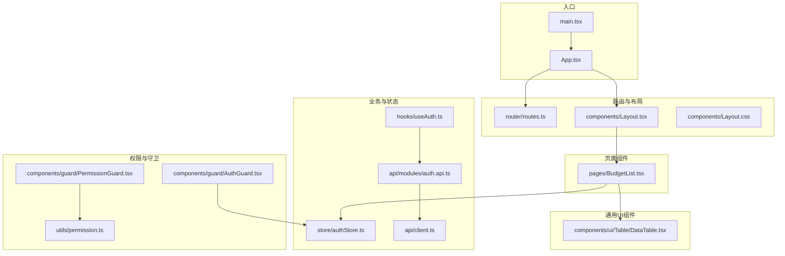
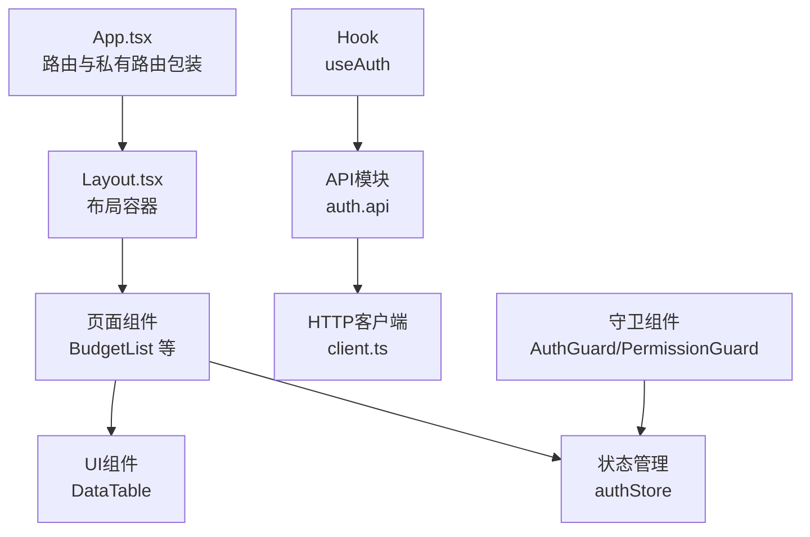
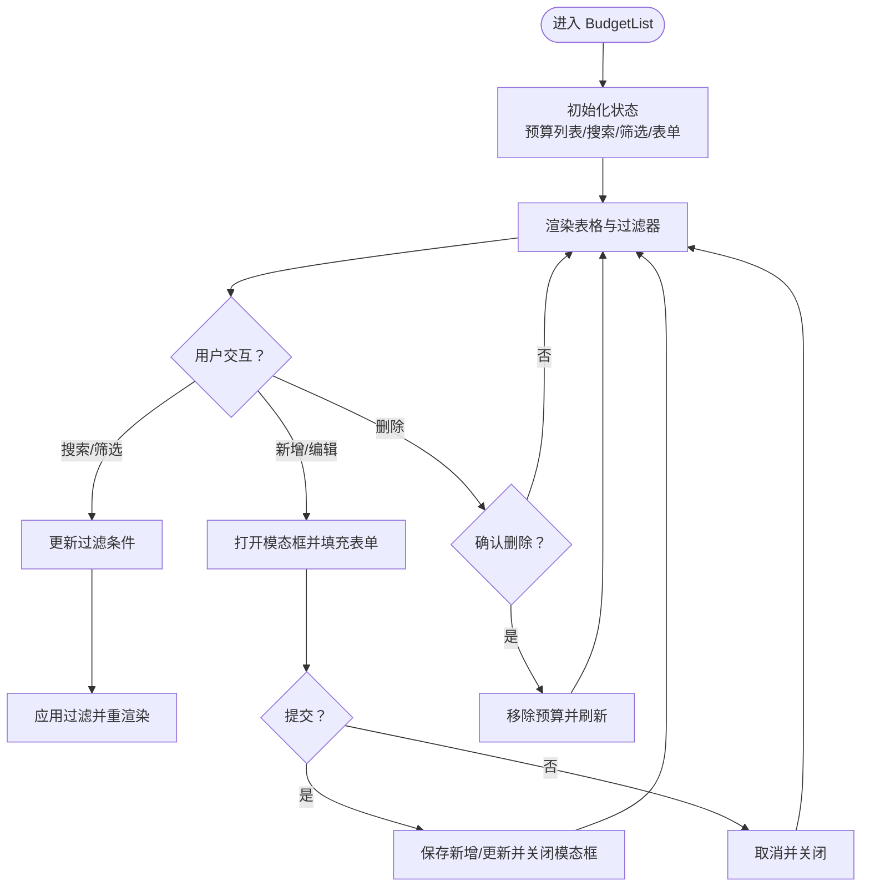
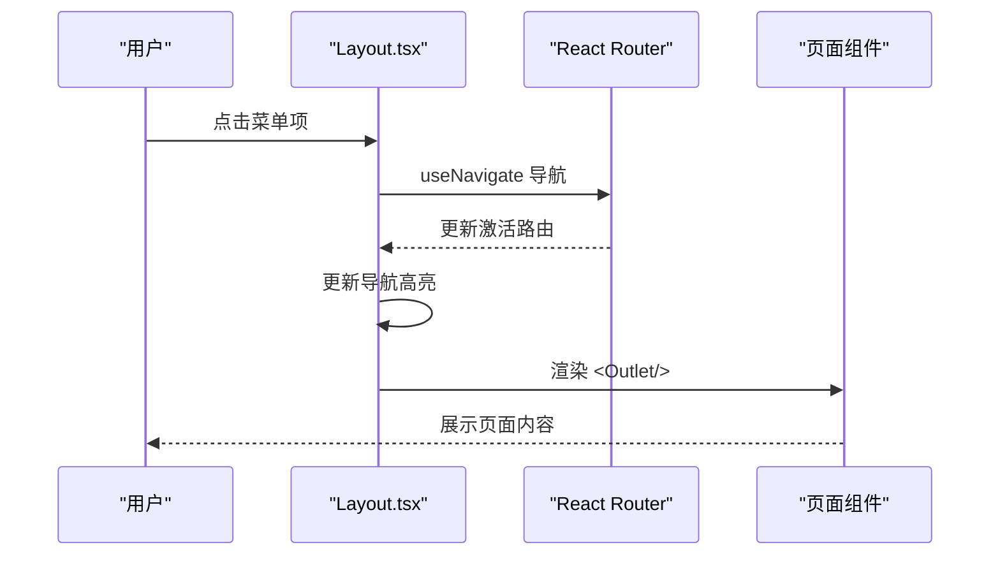
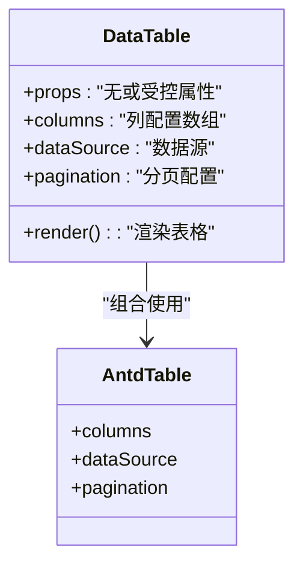
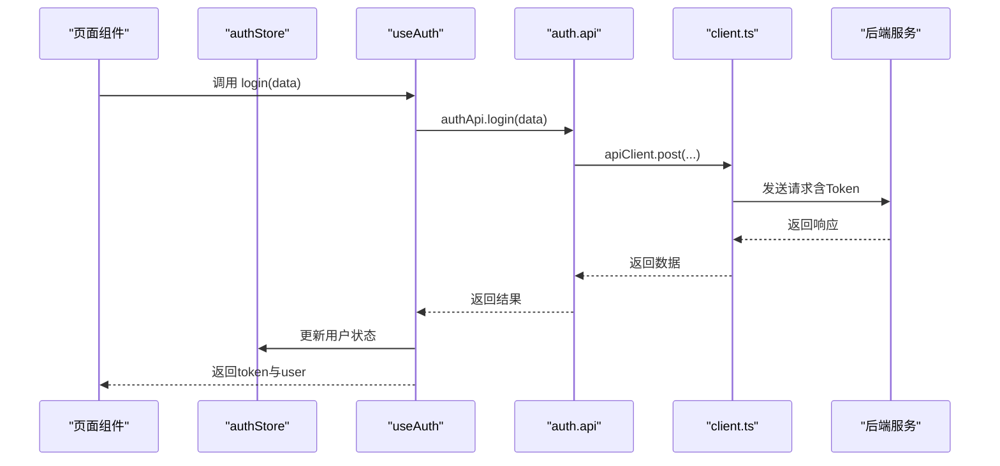
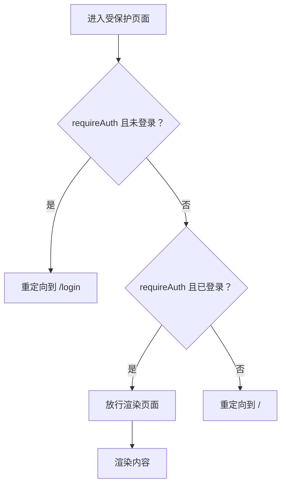
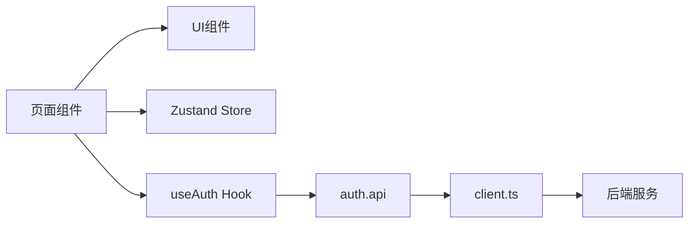

# 组件架构与设计模式

<cite>
**本文引用的文件**
- [src\App.tsx](file://src\App.tsx)
- [src\components\Layout.tsx](file://src\components\Layout.tsx)
- [src\components\Layout.css](file://src\components\Layout.css)
- [src\components\ui\Table\DataTable.tsx](file://src\components\ui\Table\DataTable.tsx)
- [src\hooks\useAuth.ts](file://src\hooks\useAuth.ts)
- [src\router\routes.ts](file://src\router\routes.ts)
- [src\store\authStore.ts](file://src\store\authStore.ts)
- [src\pages\BudgetList.tsx](file://src\pages\BudgetList.tsx)
- [src\api\client.ts](file://src\api\client.ts)
- [src\api\modules\auth.api.ts](file://src\api\modules\auth.api.ts)
- [src\components\guard\AuthGuard.tsx](file://src\components\guard\AuthGuard.tsx)
- [src\components\guard\PermissionGuard.tsx](file://src\components\guard\PermissionGuard.tsx)
- [src\utils\permission.ts](file://src\utils\permission.ts)
- [src\utils\format.ts](file://src\utils\format.ts)
- [src\types\index.ts](file://src\types\index.ts)
- [src\main.tsx](file://src\main.tsx)
- [package.json](file://package.json)
</cite>

## 目录
1. [引言](#引言)
2. [项目结构](#项目结构)
3. [核心组件](#核心组件)
4. [架构总览](#架构总览)
5. [组件详解](#组件详解)
6. [依赖关系分析](#依赖关系分析)
7. [性能考量](#性能考量)
8. [故障排查指南](#故障排查指南)
9. [结论](#结论)
10. [附录](#附录)

## 引言
本文件面向预算管理系统的前端组件架构，系统性梳理页面组件、业务组件与UI组件的职责边界与协作方式；深入解析Layout组件的布局体系与响应式实现；总结通用UI组件（如DataTable）的设计模式与可复用性策略；阐述业务组件的封装思路与组件间通信机制；给出最佳实践、性能优化建议、测试策略与调试方法，并对自定义Hook进行设计与使用模式说明。

## 项目结构
项目采用按功能域分层的组织方式：
- 页面层（pages）：承载路由级视图与业务交互逻辑，负责数据展示与用户操作编排
- 组件层（components）：包含布局组件、通用UI组件与守卫组件
- 钩子层（hooks）：封装跨组件的业务逻辑与副作用
- 路由层（router）：集中管理路由与懒加载策略
- 存储层（store）：状态管理（Zustand）
- API层（api）：统一HTTP客户端与模块化接口封装
- 工具层（utils）：格式化、权限、通用工具
- 类型层（types）：全站TS类型定义
- 入口（main.tsx/App.tsx）：应用启动与路由挂载

图表来源
- [src\main.tsx:1-26](file://src\main.tsx#L1-L26)
- [src\App.tsx:1-66](file://src\App.tsx#L1-L66)
- [src\router\routes.ts:1-122](file://src\router\routes.ts#L1-L122)
- [src\components\Layout.tsx:1-99](file://src\components\Layout.tsx#L1-L99)
- [src\components\Layout.css:1-227](file://src\components\Layout.css#L1-L227)
- [src\pages\BudgetList.tsx:1-329](file://src\pages\BudgetList.tsx#L1-L329)
- [src\components\ui\Table\DataTable.tsx:1-108](file://src\components\ui\Table\DataTable.tsx#L1-L108)
- [src\store\authStore.ts:1-31](file://src\store\authStore.ts#L1-L31)
- [src\hooks\useAuth.ts:1-84](file://src\hooks\useAuth.ts#L1-L84)
- [src\api\modules\auth.api.ts:1-50](file://src\api\modules\auth.api.ts#L1-L50)
- [src\api\client.ts:1-183](file://src\api\client.ts#L1-L183)
- [src\components\guard\AuthGuard.tsx:1-31](file://src\components\guard\AuthGuard.tsx#L1-L31)
- [src\components\guard\PermissionGuard.tsx:1-88](file://src\components\guard\PermissionGuard.tsx#L1-L88)
- [src\utils\permission.ts:1-84](file://src\utils\permission.ts#L1-L84)

章节来源
- [src\main.tsx:1-26](file://src\main.tsx#L1-L26)
- [src\App.tsx:1-66](file://src\App.tsx#L1-L66)
- [src\router\routes.ts:1-122](file://src\router\routes.ts#L1-L122)

## 核心组件
- 应用入口与路由：通过BrowserRouter集中注册路由，使用私有路由包装器实现鉴权拦截
- 布局组件：提供侧边栏、顶部栏、移动端抽屉与响应式布局
- 通用UI组件：基于Ant Design的增强表格组件，支持分页、排序、筛选与渲染扩展
- 业务组件：页面组件承担数据过滤、表单提交、状态管理等业务逻辑
- 状态与Hook：Zustand状态管理与useAuth Hook封装认证流程
- 权限与守卫：页面级与元素级权限控制，支持多权限策略
- API与拦截器：统一Axios实例、请求/响应拦截器与错误处理

章节来源
- [src\App.tsx:24-66](file://src\App.tsx#L24-L66)
- [src\components\Layout.tsx:18-99](file://src\components\Layout.tsx#L18-L99)
- [src\components\ui\Table\DataTable.tsx:16-108](file://src\components\ui\Table\DataTable.tsx#L16-L108)
- [src\pages\BudgetList.tsx:28-329](file://src\pages\BudgetList.tsx#L28-L329)
- [src\store\authStore.ts:19-31](file://src\store\authStore.ts#L19-L31)
- [src\hooks\useAuth.ts:8-84](file://src\hooks\useAuth.ts#L8-L84)
- [src\components\guard\AuthGuard.tsx:13-31](file://src\components\guard\AuthGuard.tsx#L13-L31)
- [src\components\guard\PermissionGuard.tsx:15-88](file://src\components\guard\PermissionGuard.tsx#L15-L88)
- [src\api\client.ts:12-100](file://src\api\client.ts#L12-L100)

## 架构总览
系统采用“页面组件 + 业务组件 + UI组件”的分层设计：
- 页面组件：负责业务数据聚合、状态管理与交互编排
- 业务组件：封装领域模型与流程（如预算、采购、审批），通过Hook与Store解耦
- UI组件：提供高内聚、低耦合的可复用界面单元
- 布局组件：统一导航、头部与侧边栏，支撑整体视觉与交互一致性
- 权限与守卫：在路由与元素层面保障安全边界
- API层：统一网络访问与错误处理，屏蔽底层细节

图表来源
- [src\App.tsx:29-66](file://src\App.tsx#L29-L66)
- [src\components\Layout.tsx:18-99](file://src\components\Layout.tsx#L18-L99)
- [src\pages\BudgetList.tsx:28-329](file://src\pages\BudgetList.tsx#L28-L329)
- [src\components\ui\Table\DataTable.tsx:16-108](file://src\components\ui\Table\DataTable.tsx#L16-L108)
- [src\store\authStore.ts:19-31](file://src\store\authStore.ts#L19-L31)
- [src\hooks\useAuth.ts:8-84](file://src\hooks\useAuth.ts#L8-L84)
- [src\api\modules\auth.api.ts:14-50](file://src\api\modules\auth.api.ts#L14-L50)
- [src\api\client.ts:12-100](file://src\api\client.ts#L12-L100)
- [src\components\guard\AuthGuard.tsx:13-31](file://src\components\guard\AuthGuard.tsx#L13-L31)
- [src\components\guard\PermissionGuard.tsx:15-88](file://src\components\guard\PermissionGuard.tsx#L15-L88)

## 组件详解

### 页面组件：BudgetList 的职责与实现
- 职责划分
  - 数据展示：预算列表、状态标签、进度条、执行率计算
  - 过滤与搜索：关键词、类型、状态三类筛选
  - 表单交互：新增/编辑预算的模态框与表单校验
  - 路由联动：跳转详情、编辑、调整等子页面
- 设计要点
  - 使用本地状态管理预算集合与表单数据，便于演示与快速迭代
  - 通过格式化工具与常量映射提升可读性与一致性
  - 采用条件渲染与空状态提示，改善用户体验
- 性能建议
  - 大列表建议引入虚拟滚动与分页
  - 过滤逻辑可结合防抖优化

图表来源
- [src\pages\BudgetList.tsx:28-329](file://src\pages\BudgetList.tsx#L28-L329)

章节来源
- [src\pages\BudgetList.tsx:28-329](file://src\pages\BudgetList.tsx#L28-L329)

### 布局组件：Layout 的设计与布局系统
- 设计目标
  - 提供统一的导航与内容区域，支持移动端抽屉式侧边栏
  - 与路由配合，实现导航高亮与面包屑基础能力
- 关键特性
  - 侧边栏抽屉：移动端overlay遮罩与open状态切换
  - 顶部栏：菜单按钮、标题与用户信息展示
  - 与Outlet配合，承载页面内容
- 响应式实现
  - 通过CSS媒体查询在小屏设备隐藏侧边栏并启用抽屉
  - 主内容区域在小屏下自动适配

图表来源
- [src\components\Layout.tsx:18-99](file://src\components\Layout.tsx#L18-L99)
- [src\components\Layout.css:199-227](file://src\components\Layout.css#L199-L227)

章节来源
- [src\components\Layout.tsx:18-99](file://src\components\Layout.tsx#L18-L99)
- [src\components\Layout.css:1-227](file://src\components\Layout.css#L1-L227)

### 通用UI组件：DataTable 的设计模式与可复用性
- 设计模式
  - 以列配置（ColumnsType）为中心，支持排序、筛选与自定义渲染
  - 通过dataSource注入数据，统一分页与总数展示
  - 将“展示”与“行为”分离，便于扩展操作列
- 可复用性考虑
  - 列定义抽取为外部配置，支持不同页面复用
  - 渲染函数与样式分离，便于主题定制
  - 保持无状态或最小状态，降低耦合
- 扩展建议
  - 引入受控分页与远程数据源
  - 支持批量操作与行选择

图表来源
- [src\components\ui\Table\DataTable.tsx:16-108](file://src\components\ui\Table\DataTable.tsx#L16-L108)

章节来源
- [src\components\ui\Table\DataTable.tsx:16-108](file://src\components\ui\Table\DataTable.tsx#L16-L108)

### 业务组件封装与组件间通信
- 页面组件与UI组件
  - 页面组件负责业务数据与交互，UI组件负责展示与事件回调
  - 通过props传递数据与回调，保持单向数据流
- 页面组件与状态管理
  - 使用Zustand管理用户会话状态，避免跨层级传递
  - 在页面中读取store状态，减少重复请求
- 页面组件与Hook
  - useAuth封装登录、登出、改密等流程，页面仅关注调用
  - Hook内部使用API模块与本地存储，隔离副作用
- 页面组件与API
  - 通过auth.api与client.ts统一发起HTTP请求，集中处理Token与错误

图表来源
- [src\pages\BudgetList.tsx:28-329](file://src\pages\BudgetList.tsx#L28-L329)
- [src\store\authStore.ts:19-31](file://src\store\authStore.ts#L19-L31)
- [src\hooks\useAuth.ts:12-21](file://src\hooks\useAuth.ts#L12-L21)
- [src\api\modules\auth.api.ts:18-20](file://src\api\modules\auth.api.ts#L18-L20)
- [src\api\client.ts:22-44](file://src\api\client.ts#L22-L44)

章节来源
- [src\store\authStore.ts:19-31](file://src\store\authStore.ts#L19-L31)
- [src\hooks\useAuth.ts:8-84](file://src\hooks\useAuth.ts#L8-L84)
- [src\api\modules\auth.api.ts:14-50](file://src\api\modules\auth.api.ts#L14-L50)
- [src\api\client.ts:12-100](file://src\api\client.ts#L12-L100)

### 权限守卫与权限控制
- 页面级守卫：AuthGuard根据requireAuth决定是否放行或重定向
- 元素级守卫：PermissionGuard支持单权限或多权限（与/或）、是否全部满足
- 权限工具：hasPermission、hasAnyPermission、hasAllPermissions与权限枚举
- 使用建议
  - 在路由层标注requiresAuth，在UI层使用PermissionGuard细化按钮权限
  - 权限来源于用户信息中的permissions字段，注意解析异常处理

图表来源
- [src\components\guard\AuthGuard.tsx:13-31](file://src\components\guard\AuthGuard.tsx#L13-L31)
- [src\components\guard\PermissionGuard.tsx:15-88](file://src\components\guard\PermissionGuard.tsx#L15-L88)
- [src\utils\permission.ts:11-41](file://src\utils\permission.ts#L11-L41)

章节来源
- [src\components\guard\AuthGuard.tsx:13-31](file://src\components\guard\AuthGuard.tsx#L13-L31)
- [src\components\guard\PermissionGuard.tsx:15-88](file://src\components\guard\PermissionGuard.tsx#L15-L88)
- [src\utils\permission.ts:11-84](file://src\utils\permission.ts#L11-L84)

### 自定义Hook：useAuth 的设计与使用模式
- 设计原则
  - 将副作用（网络请求、本地存储）封装在Hook内部
  - 对外暴露纯函数式API，便于测试与复用
  - 使用useCallback稳定回调引用，避免不必要重渲染
- 使用模式
  - 页面组件通过useAuth调用login/logout/changePassword/getCurrentUser
  - 结合路由守卫与状态管理，实现完整的认证生命周期
- 错误处理
  - 登出异常捕获并清理本地存储，保证状态一致

章节来源
- [src\hooks\useAuth.ts:8-84](file://src\hooks\useAuth.ts#L8-L84)
- [src\api\modules\auth.api.ts:14-50](file://src\api\modules\auth.api.ts#L14-L50)
- [src\api\client.ts:46-94](file://src\api\client.ts#L46-L94)

## 依赖关系分析
- 组件耦合
  - 页面组件与UI组件松耦合：通过props传递数据与回调
  - 页面组件与状态管理弱耦合：仅在需要时读写store
  - 页面组件与Hook弱耦合：通过函数调用完成业务流程
- 外部依赖
  - Ant Design提供UI基础能力
  - React Router提供路由与导航
  - Zustand提供轻量状态管理
  - Axios提供HTTP请求与拦截器
- 循环依赖
  - 当前结构未见循环依赖，遵循单向数据流

图表来源
- [src\pages\BudgetList.tsx:28-329](file://src\pages\BudgetList.tsx#L28-L329)
- [src\components\ui\Table\DataTable.tsx:16-108](file://src\components\ui\Table\DataTable.tsx#L16-L108)
- [src\store\authStore.ts:19-31](file://src\store\authStore.ts#L19-L31)
- [src\hooks\useAuth.ts:8-84](file://src\hooks\useAuth.ts#L8-L84)
- [src\api\modules\auth.api.ts:14-50](file://src\api\modules\auth.api.ts#L14-L50)
- [src\api\client.ts:12-100](file://src\api\client.ts#L12-L100)

章节来源
- [package.json:12-32](file://package.json#L12-L32)

## 性能考量
- 路由与懒加载
  - 使用React.lazy与Suspense延迟加载页面组件，减少首屏体积
- 列表渲染
  - 大数据量场景建议引入虚拟列表、分页与服务端筛选
- 网络请求
  - 请求拦截器统一添加Token与时间戳，响应拦截器集中处理错误码
  - 对高频请求使用防抖/节流（参考工具库中的debounce/throttle）
- 状态管理
  - Zustand按需拆分模块，避免全局状态爆炸
- UI渲染
  - DataTable列配置尽量复用，减少重复渲染
  - 使用useMemo/useCallback稳定props，避免子组件不必要重渲染

章节来源
- [src\router\routes.ts:1-122](file://src\router\routes.ts#L1-L122)
- [src\api\client.ts:22-94](file://src\api\client.ts#L22-L94)
- [src\utils\format.ts:81-107](file://src\utils\format.ts#L81-L107)

## 故障排查指南
- 登录后无法访问受保护页面
  - 检查私有路由包装器与状态管理是否同步
  - 确认useAuth返回的isAuthenticated与store状态一致
- Token失效导致频繁跳转登录
  - 检查响应拦截器对401的处理逻辑与本地存储清理
  - 确认请求拦截器正确附加Authorization头
- 权限按钮不显示
  - 检查用户permissions字段与PermissionGuard的权限匹配逻辑
  - 注意管理员与通配符权限的特殊处理
- 表格无数据或渲染异常
  - 核对dataSource与columns配置是否一致
  - 检查分页与排序参数是否符合预期

章节来源
- [src\App.tsx:24-27](file://src\App.tsx#L24-L27)
- [src\store\authStore.ts:19-31](file://src\store\authStore.ts#L19-L31)
- [src\hooks\useAuth.ts:56-58](file://src\hooks\useAuth.ts#L56-L58)
- [src\api\client.ts:52-94](file://src\api\client.ts#L52-L94)
- [src\components\guard\PermissionGuard.tsx:21-46](file://src\components\guard\PermissionGuard.tsx#L21-L46)
- [src\components\ui\Table\DataTable.tsx:95-107](file://src\components\ui\Table\DataTable.tsx#L95-L107)

## 结论
本系统通过清晰的分层设计实现了页面、业务与UI的职责分离；Layout组件提供了统一的导航与响应式布局；通用UI组件以配置驱动的方式提升了可复用性；业务组件通过Hook与Store解耦了认证与状态；权限守卫在路由与元素层面构建了安全边界。建议在后续迭代中引入虚拟列表、服务端分页与更完善的错误边界，持续优化性能与可维护性。

## 附录
- 最佳实践清单
  - 页面组件专注业务，UI组件专注展示
  - Hook封装副作用，保持函数式纯度
  - 状态管理按域拆分，避免全局污染
  - 权限控制从路由到元素逐层收敛
  - 统一网络层，集中处理鉴权与错误
- 测试策略建议
  - 页面组件：使用React Testing Library断言渲染与交互
  - Hook：通过自定义测试工具模拟API与store
  - UI组件：以快照与可访问性测试验证一致性
  - 权限守卫：覆盖多角色与多权限分支
- 调试方法
  - 使用React DevTools追踪组件树与状态变化
  - 在拦截器中输出请求/响应日志辅助定位问题
  - 使用浏览器Network面板观察Token与错误码