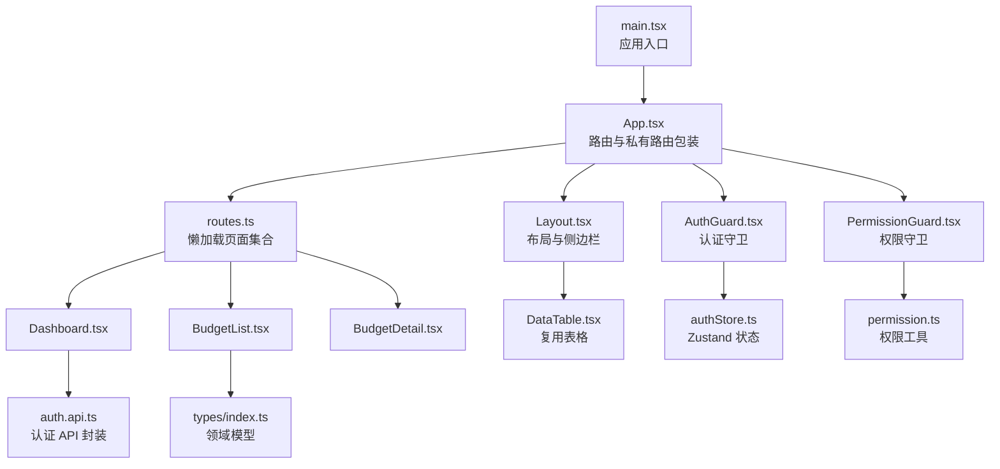
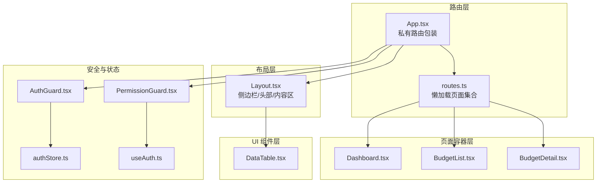
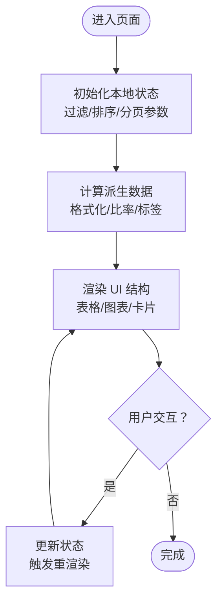
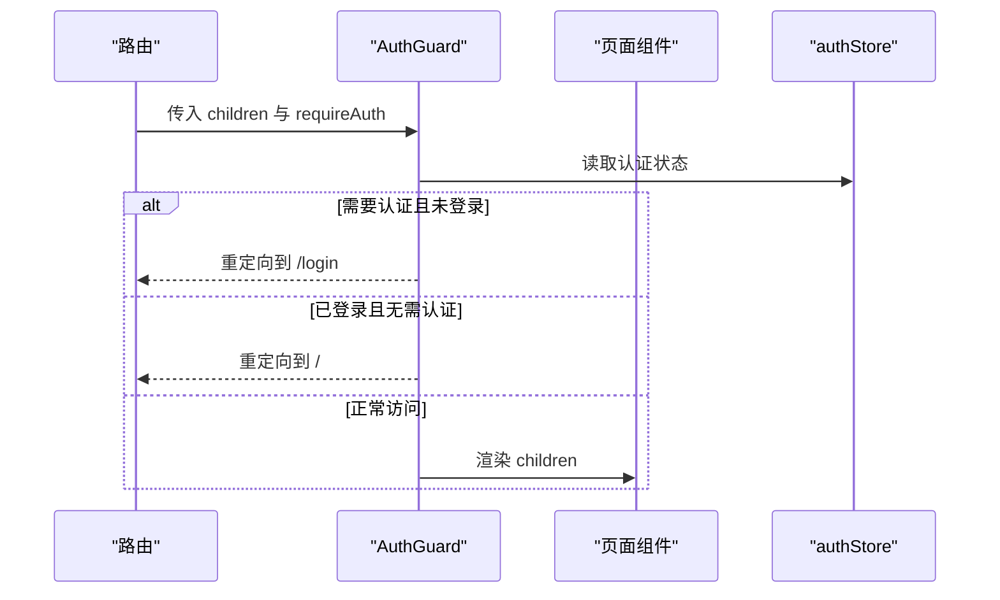
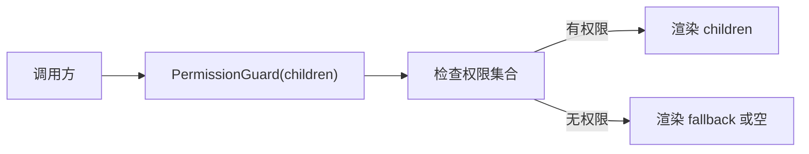
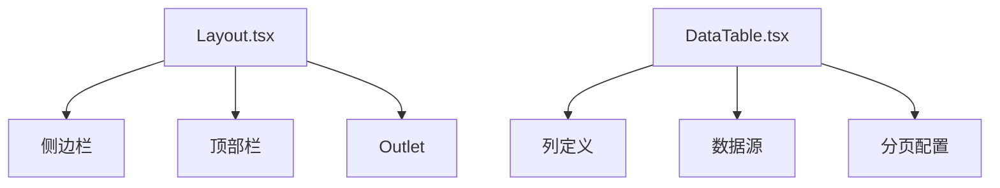
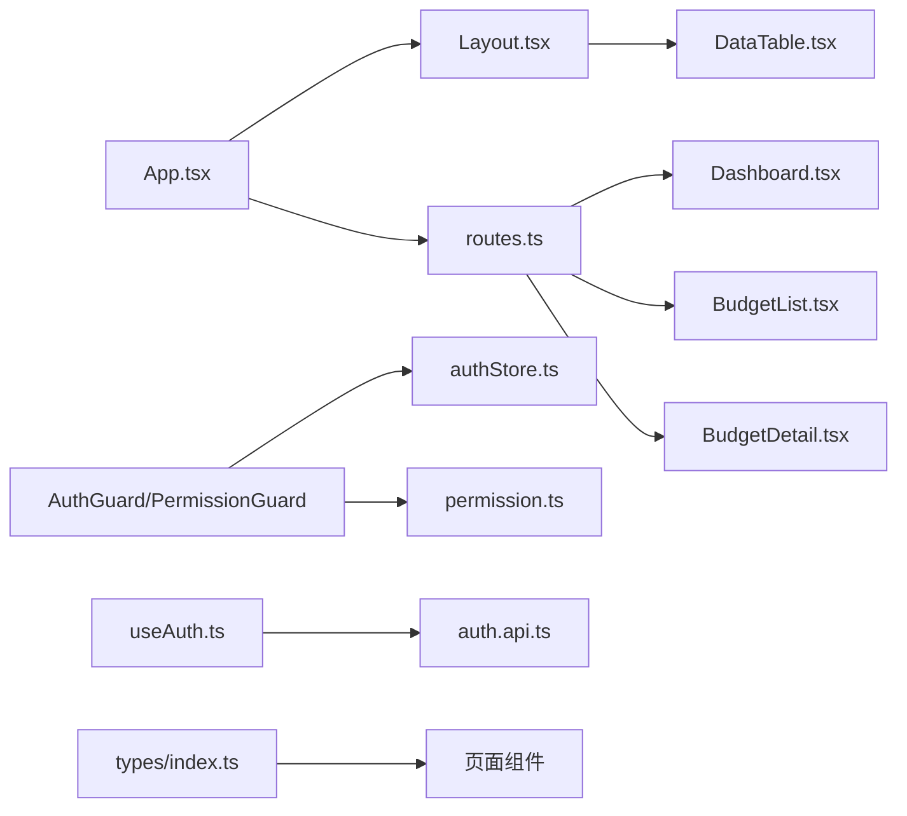

# 组件设计模式

<cite>
**本文引用的文件**
- [src\App.tsx](file://src\App.tsx)
- [src\main.tsx](file://src\main.tsx)
- [src\components\Layout.tsx](file://src\components\Layout.tsx)
- [src\router\routes.ts](file://src\router\routes.ts)
- [src\store\authStore.ts](file://src\store\authStore.ts)
- [src\pages\Dashboard.tsx](file://src\pages\Dashboard.tsx)
- [src\pages\BudgetList.tsx](file://src\pages\BudgetList.tsx)
- [src\pages\BudgetDetail.tsx](file://src\pages\BudgetDetail.tsx)
- [src\components\ui\Table\DataTable.tsx](file://src\components\ui\Table\DataTable.tsx)
- [src\components\guard\AuthGuard.tsx](file://src\components\guard\AuthGuard.tsx)
- [src\components\guard\PermissionGuard.tsx](file://src\components\guard\PermissionGuard.tsx)
- [src\hooks\useAuth.ts](file://src\hooks\useAuth.ts)
- [src\utils\permission.ts](file://src\utils\permission.ts)
- [src\api\modules\auth.api.ts](file://src\api\modules\auth.api.ts)
- [src\types\index.ts](file://src\types\index.ts)
- [package.json](file://package.json)
</cite>

## 目录
1. [引言](#引言)
2. [项目结构](#项目结构)
3. [核心组件](#核心组件)
4. [架构总览](#架构总览)
5. [组件详解](#组件详解)
6. [依赖关系分析](#依赖关系分析)
7. [性能考量](#性能考量)
8. [故障排查指南](#故障排查指南)
9. [结论](#结论)
10. [附录](#附录)

## 引言
本文件围绕预算管理系统的前端组件设计模式进行系统化梳理，重点覆盖以下主题：
- 容器组件与展示组件的分离：通过页面组件承载状态与业务逻辑（容器），UI 表格等复用组件专注渲染（展示）。
- 高阶组件（HOC）与守卫组件：以认证守卫与权限守卫实现路由级与元素级的安全控制。
- Render Props 模式：在权限守卫中体现“以子组件作为属性”的可组合思想。
- 组件组合与复合组件：布局组件与页面组件的组合、表格组件的复合能力。
- 可测试性与 Mock 策略：对 API 层、Hook 层与 Store 的隔离与替换建议。
- 性能优化：懒加载、状态最小化、渲染粒度控制与外部库优化。
- 最佳实践与反模式：清晰的职责边界、避免过度渲染、保持组件纯度。

## 项目结构
系统采用按功能域划分的组织方式，前端入口负责挂载应用与全局样式，路由层负责页面级懒加载与导航，页面组件承担容器职责，UI 组件提供复用能力，守卫组件保障安全，Hook 与 Store 提供横切关注点。

图表来源
- [src\main.tsx:1-26](file://src\main.tsx#L1-L26)
- [src\App.tsx:1-66](file://src\App.tsx#L1-L66)
- [src\components\Layout.tsx:1-99](file://src\components\Layout.tsx#L1-L99)
- [src\router\routes.ts:1-122](file://src\router\routes.ts#L1-L122)
- [src\store\authStore.ts:1-31](file://src\store\authStore.ts#L1-L31)
- [src\components\guard\AuthGuard.tsx:1-31](file://src\components\guard\AuthGuard.tsx#L1-L31)
- [src\components\guard\PermissionGuard.tsx:1-88](file://src\components\guard\PermissionGuard.tsx#L1-L88)
- [src\utils\permission.ts:1-84](file://src\utils\permission.ts#L1-L84)
- [src\api\modules\auth.api.ts:1-50](file://src\api\modules\auth.api.ts#L1-L50)
- [src\types\index.ts:1-338](file://src\types\index.ts#L1-L338)

章节来源
- [src\main.tsx:1-26](file://src\main.tsx#L1-L26)
- [src\App.tsx:1-66](file://src\App.tsx#L1-L66)
- [src\router\routes.ts:1-122](file://src\router\routes.ts#L1-L122)

## 核心组件
- 应用入口与挂载：负责引入全局样式与 StrictMode 包裹，确保开发期严格检查。
- 路由与私有路由包装：集中定义路由与认证拦截，支持嵌套路由与 Outlet 渲染。
- 布局组件：提供移动端友好的侧边栏、顶部栏与内容区域，配合 Outlet 实现页面切换。
- 页面容器组件：承载状态、过滤、表单与交互逻辑，作为容器组件；展示部分尽量复用 UI 组件。
- UI 复用组件：如增强型表格组件，提供分页、排序、筛选等能力，作为展示组件。
- 守卫组件：认证守卫与权限守卫分别处理页面访问与元素级权限控制。
- Hook 与 Store：封装认证流程与状态持久化，降低页面组件复杂度。
- 类型体系：统一的领域模型与状态接口，保证跨组件契约稳定。

章节来源
- [src\main.tsx:1-26](file://src\main.tsx#L1-L26)
- [src\App.tsx:24-27](file://src\App.tsx#L24-L27)
- [src\components\Layout.tsx:18-99](file://src\components\Layout.tsx#L18-L99)
- [src\components\ui\Table\DataTable.tsx:16-108](file://src\components\ui\Table\DataTable.tsx#L16-L108)
- [src\hooks\useAuth.ts:8-84](file://src\hooks\useAuth.ts#L8-L84)
- [src\store\authStore.ts:19-31](file://src\store\authStore.ts#L19-L31)
- [src\types\index.ts:1-338](file://src\types\index.ts#L1-L338)

## 架构总览
系统采用“路由层 -> 布局层 -> 页面容器层 -> UI 组件层”的分层结构，结合守卫组件实现安全控制，Store 与 Hook 解耦横切关注点。

图表来源
- [src\App.tsx:1-66](file://src\App.tsx#L1-L66)
- [src\router\routes.ts:1-122](file://src\router\routes.ts#L1-L122)
- [src\components\Layout.tsx:18-99](file://src\components\Layout.tsx#L18-L99)
- [src\components\ui\Table\DataTable.tsx:16-108](file://src\components\ui\Table\DataTable.tsx#L16-L108)
- [src\components\guard\AuthGuard.tsx:13-30](file://src\components\guard\AuthGuard.tsx#L13-L30)
- [src\components\guard\PermissionGuard.tsx:15-46](file://src\components\guard\PermissionGuard.tsx#L15-L46)
- [src\store\authStore.ts:19-31](file://src\store\authStore.ts#L19-L31)
- [src\hooks\useAuth.ts:8-84](file://src\hooks\useAuth.ts#L8-L84)

## 组件详解

### 容器组件与展示组件的分离
- 容器组件（页面）：Dashboard、BudgetList、BudgetDetail 承担状态管理、数据处理与交互逻辑，内部包含本地状态与计算属性，对外仅暴露必要的 props。
- 展示组件（UI）：DataTable 专注于表格渲染与交互行为，不直接持有业务状态，便于复用与测试。

图表来源
- [src\pages\Dashboard.tsx:59-274](file://src\pages\Dashboard.tsx#L59-L274)
- [src\pages\BudgetList.tsx:28-329](file://src\pages\BudgetList.tsx#L28-L329)
- [src\pages\BudgetDetail.tsx:32-159](file://src\pages\BudgetDetail.tsx#L32-L159)
- [src\components\ui\Table\DataTable.tsx:16-108](file://src\components\ui\Table\DataTable.tsx#L16-L108)

章节来源
- [src\pages\Dashboard.tsx:59-274](file://src\pages\Dashboard.tsx#L59-L274)
- [src\pages\BudgetList.tsx:28-329](file://src\pages\BudgetList.tsx#L28-L329)
- [src\pages\BudgetDetail.tsx:32-159](file://src\pages\BudgetDetail.tsx#L32-L159)
- [src\components\ui\Table\DataTable.tsx:16-108](file://src\components\ui\Table\DataTable.tsx#L16-L108)

### 高阶组件（HOC）与守卫组件
- 认证守卫（AuthGuard）：以 props.children 作为渲染出口，根据 requireAuth 与认证状态决定放行或重定向。
- 权限守卫（PermissionGuard）：基于用户权限集合判断是否渲染子节点，支持“任一/全部”权限策略与回退节点。

图表来源
- [src\components\guard\AuthGuard.tsx:13-30](file://src\components\guard\AuthGuard.tsx#L13-L30)
- [src\store\authStore.ts:19-31](file://src\store\authStore.ts#L19-L31)

章节来源
- [src\components\guard\AuthGuard.tsx:13-30](file://src\components\guard\AuthGuard.tsx#L13-L30)
- [src\components\guard\PermissionGuard.tsx:15-46](file://src\components\guard\PermissionGuard.tsx#L15-L46)
- [src\utils\permission.ts:11-41](file://src\utils\permission.ts#L11-L41)

### Render Props 模式
- 权限守卫通过 children 属性接收渲染内容，体现了 Render Props 的思想：将“如何渲染”委托给调用方，提升组件的可组合性与灵活性。

图表来源
- [src\components\guard\PermissionGuard.tsx:15-46](file://src\components\guard\PermissionGuard.tsx#L15-L46)

章节来源
- [src\components\guard\PermissionGuard.tsx:15-46](file://src\components\guard\PermissionGuard.tsx#L15-L46)

### 组件组合与复合组件
- 布局组合：Layout 将侧边栏、顶部栏与主内容区组合，通过 Outlet 插槽渲染具体页面。
- 复合组件：DataTable 通过列定义、数据源与分页配置组合成完整的表格能力，便于在不同页面复用。

图表来源
- [src\components\Layout.tsx:43-96](file://src\components\Layout.tsx#L43-L96)
- [src\components\ui\Table\DataTable.tsx:16-108](file://src\components\ui\Table\DataTable.tsx#L16-L108)

章节来源
- [src\components\Layout.tsx:43-96](file://src\components\Layout.tsx#L43-L96)
- [src\components\ui\Table\DataTable.tsx:16-108](file://src\components\ui\Table\DataTable.tsx#L16-L108)

### 可测试性设计与 Mock 策略
- API 层隔离：auth.api.ts 封装了认证相关请求，便于在测试中替换为 Mock 实现，避免真实网络请求。
- Hook 层隔离：useAuth.ts 将登录、登出、修改密码等逻辑封装为独立 Hook，便于单元测试与集成测试。
- Store 层隔离：authStore.ts 使用 Zustand 并持久化，可在测试中注入替代实现或内存态。
- 页面组件 Mock：Dashboard、BudgetList 等页面组件可通过 props 注入或 Jest Mock 对外部依赖进行替换。

章节来源
- [src\api\modules\auth.api.ts:14-49](file://src\api\modules\auth.api.ts#L14-L49)
- [src\hooks\useAuth.ts:8-84](file://src\hooks\useAuth.ts#L8-L84)
- [src\store\authStore.ts:19-31](file://src\store\authStore.ts#L19-L31)
- [src\pages\Dashboard.tsx:18-57](file://src\pages\Dashboard.tsx#L18-L57)
- [src\pages\BudgetList.tsx:5-13](file://src\pages\BudgetList.tsx#L5-L13)

### 性能优化模式
- 懒加载：routes.ts 中使用 React.lazy 对页面组件进行懒加载，减少首屏包体与初次渲染压力。
- 状态最小化：页面组件仅维护必要状态，避免在渲染路径上持有大对象。
- 渲染粒度控制：将复杂列表拆分为多个小组件，减少不必要的重渲染。
- 外部库优化：图表库与 UI 库按需引入，避免全量打包。

章节来源
- [src\router\routes.ts:1-22](file://src\router\routes.ts#L1-L22)
- [package.json:12-32](file://package.json#L12-L32)

### 最佳实践与常见反模式
- 最佳实践
  - 明确容器与展示组件边界，展示组件保持无副作用与可预测渲染。
  - 使用 Hook 抽离横切逻辑，Store 仅存放全局状态。
  - 通过守卫组件统一处理认证与权限，避免在页面内分散处理。
  - 使用 TypeScript 接口约束数据结构，提升类型安全。
- 常见反模式
  - 在展示组件中混入业务逻辑与副作用。
  - 在页面组件中直接操作 DOM 或外部副作用。
  - 将权限判断散落在多处，破坏一致性。

## 依赖关系分析
- 组件间依赖：App.tsx 依赖 Layout.tsx 与路由配置；页面组件依赖 UI 组件与类型定义；守卫组件依赖 Store 与权限工具。
- 外部依赖：React、React Router、Ant Design、Recharts、Lucide React、Zustand 等。

图表来源
- [src\App.tsx:1-66](file://src\App.tsx#L1-L66)
- [src\components\Layout.tsx:18-99](file://src\components\Layout.tsx#L18-L99)
- [src\router\routes.ts:1-122](file://src\router\routes.ts#L1-L122)
- [src\components\ui\Table\DataTable.tsx:16-108](file://src\components\ui\Table\DataTable.tsx#L16-L108)
- [src\components\guard\AuthGuard.tsx:13-30](file://src\components\guard\AuthGuard.tsx#L13-L30)
- [src\components\guard\PermissionGuard.tsx:15-46](file://src\components\guard\PermissionGuard.tsx#L15-L46)
- [src\store\authStore.ts:19-31](file://src\store\authStore.ts#L19-L31)
- [src\utils\permission.ts:11-41](file://src\utils\permission.ts#L11-L41)
- [src\hooks\useAuth.ts:8-84](file://src\hooks\useAuth.ts#L8-L84)
- [src\api\modules\auth.api.ts:14-49](file://src\api\modules\auth.api.ts#L14-L49)
- [src\types\index.ts:1-338](file://src\types\index.ts#L1-L338)

章节来源
- [src\App.tsx:1-66](file://src\App.tsx#L1-L66)
- [src\router\routes.ts:1-122](file://src\router\routes.ts#L1-L122)
- [src\store\authStore.ts:19-31](file://src\store\authStore.ts#L19-L31)
- [src\utils\permission.ts:11-41](file://src\utils\permission.ts#L11-L41)
- [src\hooks\useAuth.ts:8-84](file://src\hooks\useAuth.ts#L8-L84)
- [src\api\modules\auth.api.ts:14-49](file://src\api\modules\auth.api.ts#L14-L49)
- [src\types\index.ts:1-338](file://src\types\index.ts#L1-L338)

## 性能考量
- 代码分割：通过 React.lazy 与路由懒加载，按需加载页面组件，降低首屏体积。
- 状态管理：Zustand 提供轻量状态管理，避免过度订阅导致的重渲染。
- 图表与 UI：Ant Design 与 Recharts 按需引入，减少打包体积。
- 渲染优化：页面组件内部使用本地状态与计算属性，避免在渲染路径上做昂贵运算。

章节来源
- [src\router\routes.ts:1-22](file://src\router\routes.ts#L1-L22)
- [src\store\authStore.ts:19-31](file://src\store\authStore.ts#L19-L31)
- [package.json:12-32](file://package.json#L12-L32)

## 故障排查指南
- 认证失败或跳转异常
  - 检查 AuthGuard 的 requireAuth 与认证状态，确认守卫是否正确重定向。
  - 确认 localStorage 中 token 与 user 是否存在。
- 权限不足导致元素不显示
  - 检查 PermissionGuard 的权限集合与 requiredPermission，确认用户权限是否正确解析。
- 页面空白或渲染异常
  - 检查路由懒加载是否成功，确认页面组件导出是否正确。
  - 检查页面组件中的本地状态初始化与副作用绑定。

章节来源
- [src\components\guard\AuthGuard.tsx:13-30](file://src\components\guard\AuthGuard.tsx#L13-L30)
- [src\components\guard\PermissionGuard.tsx:15-46](file://src\components\guard\PermissionGuard.tsx#L15-L46)
- [src\store\authStore.ts:19-31](file://src\store\authStore.ts#L19-L31)

## 结论
本系统在组件设计上遵循了容器与展示分离、守卫组件统一安全控制、UI 组件复用与组合的原则。通过懒加载、状态最小化与类型约束，提升了可维护性与性能。建议在后续迭代中进一步引入组件 memo 化、错误边界与更完善的测试策略，持续优化用户体验与开发效率。

## 附录
- 关键依赖版本与用途概览
  - React 生态：react、react-router-dom、lucide-react
  - UI 与可视化：antd、recharts
  - 状态管理：zustand
  - 请求与工具：axios、dayjs、clsx、file-saver、xlsx、exceljs

章节来源
- [package.json:12-32](file://package.json#L12-L32)