# 通用UI组件

<cite>
**本文档引用的文件**
- [DataTable.tsx](file://src/components/ui/Table/DataTable.tsx)
- [BudgetList.tsx](file://src/pages/BudgetList.tsx)
- [BudgetDetail.tsx](file://src/pages/BudgetDetail.tsx)
- [PurchaseRequestList.tsx](file://src/pages/PurchaseRequestList.tsx)
- [index.ts](file://src/types/index.ts)
- [App.tsx](file://src/App.tsx)
- [routes.ts](file://src/router/routes.ts)
- [package.json](file://package.json)
</cite>

## 目录
1. [简介](#简介)
2. [项目结构](#项目结构)
3. [核心组件](#核心组件)
4. [架构概览](#架构概览)
5. [详细组件分析](#详细组件分析)
6. [依赖关系分析](#依赖关系分析)
7. [性能考虑](#性能考虑)
8. [故障排除指南](#故障排除指南)
9. [结论](#结论)

## 简介

本项目是一个基于React和TypeScript构建的预算管理系统，专注于提供企业级的预算管理解决方案。系统采用现代化的技术栈，包括Vite作为构建工具、Ant Design作为UI框架、React Router进行路由管理，并集成了多种实用工具库。

该系统的核心目标是为企业提供完整的预算管理能力，包括预算编制、执行跟踪、审批流程、数据分析等功能模块。通过模块化的设计和可扩展的架构，系统能够适应不同规模企业的预算管理需求。

## 项目结构

项目采用清晰的分层架构，主要包含以下核心目录：

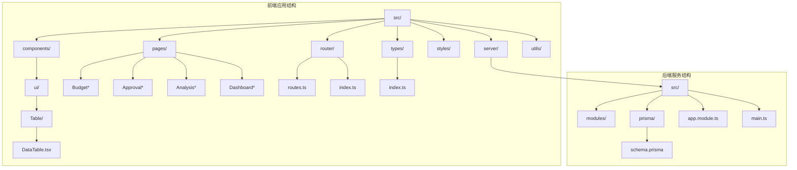

**图表来源**
- [App.tsx:1-66](file://src/App.tsx#L1-L66)
- [routes.ts:1-122](file://src/router/routes.ts#L1-L122)

**章节来源**
- [App.tsx:1-66](file://src/App.tsx#L1-L66)
- [routes.ts:1-122](file://src/router/routes.ts#L1-L122)

## 核心组件

### DataTable组件设计

DataTable组件是系统中最核心的UI组件之一，基于Ant Design的Table组件进行了深度定制，提供了丰富的数据展示和交互功能。

#### 设计理念

组件采用了"增强型表格"的设计理念，通过以下特性实现了高度的可复用性和扩展性：

1. **类型安全**: 使用TypeScript接口确保数据结构的完整性
2. **可配置性**: 支持动态列定义和渲染逻辑
3. **性能优化**: 内置分页和虚拟滚动支持
4. **用户体验**: 提供排序、筛选、批量操作等高级功能

#### 核心功能特性

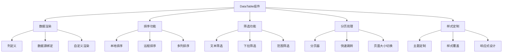

**图表来源**
- [DataTable.tsx:12-15](file://src/components/ui/Table/DataTable.tsx#L12-L15)

**章节来源**
- [DataTable.tsx:1-108](file://src/components/ui/Table/DataTable.tsx#L1-L108)

## 架构概览

系统采用前后端分离的架构设计，前端使用React构建用户界面，后端使用NestJS提供RESTful API服务。

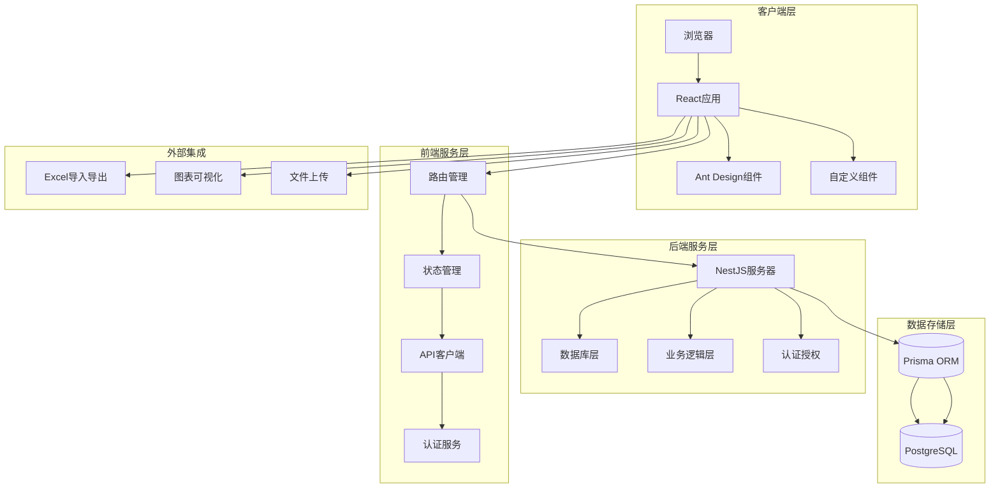

**图表来源**
- [package.json:12-32](file://package.json#L12-L32)
- [App.tsx:29-64](file://src/App.tsx#L29-L64)

**章节来源**
- [package.json:1-45](file://package.json#L1-L45)
- [App.tsx:1-66](file://src/App.tsx#L1-L66)

## 详细组件分析

### DataTable组件深度解析

#### 数据结构设计

组件使用了专门的数据类型接口来确保类型安全：

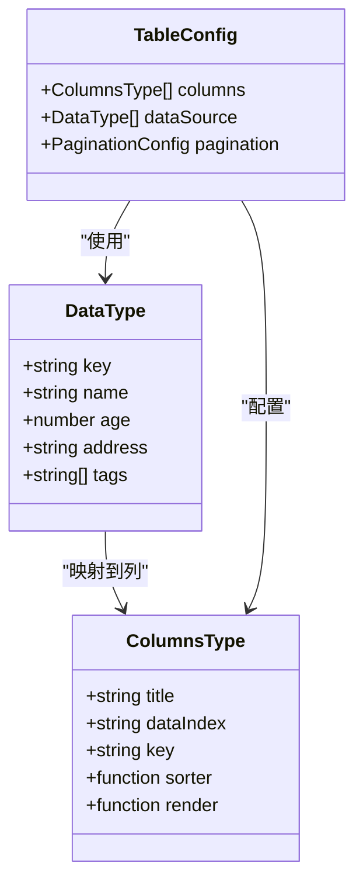

**图表来源**
- [DataTable.tsx:4-10](file://src/components/ui/Table/DataTable.tsx#L4-L10)
- [DataTable.tsx:17-69](file://src/components/ui/Table/DataTable.tsx#L17-L69)

#### 排序功能实现

排序功能通过列定义中的sorter属性实现，支持本地和远程排序：

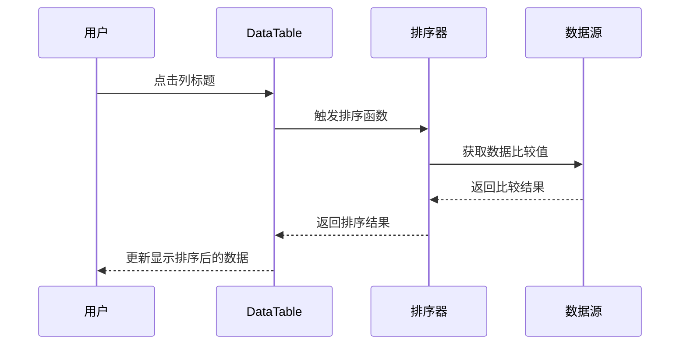

**图表来源**
- [DataTable.tsx:22-28](file://src/components/ui/Table/DataTable.tsx#L22-L28)

#### 分页处理机制

分页功能通过Ant Design的Table组件内置的分页器实现：

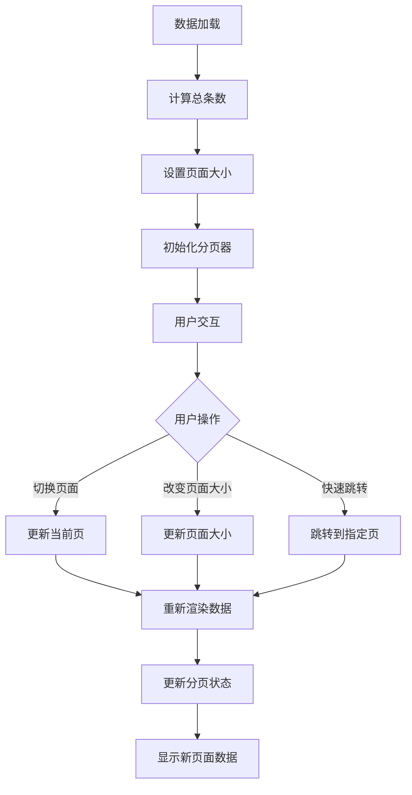

**图表来源**
- [DataTable.tsx:99-104](file://src/components/ui/Table/DataTable.tsx#L99-L104)

#### 样式定制选项

组件提供了丰富的样式定制选项：

| 属性 | 类型 | 描述 | 默认值 |
|------|------|------|--------|
| columns | ColumnsType[] | 列定义数组 | 必需 |
| dataSource | DataType[] | 数据源数组 | 必需 |
| pagination | PaginationConfig | 分页配置 | 自动分页 |
| bordered | boolean | 是否显示边框 | false |
| size | 'small' \| 'middle' \| 'large' | 表格尺寸 | 'middle' |
| scroll | { x: number, y: number } | 滚动配置 | 不滚动 |

**章节来源**
- [DataTable.tsx:1-108](file://src/components/ui/Table/DataTable.tsx#L1-L108)

### 页面组件集成分析

#### 预算列表页面

预算列表页面展示了如何在实际业务场景中使用DataTable组件：

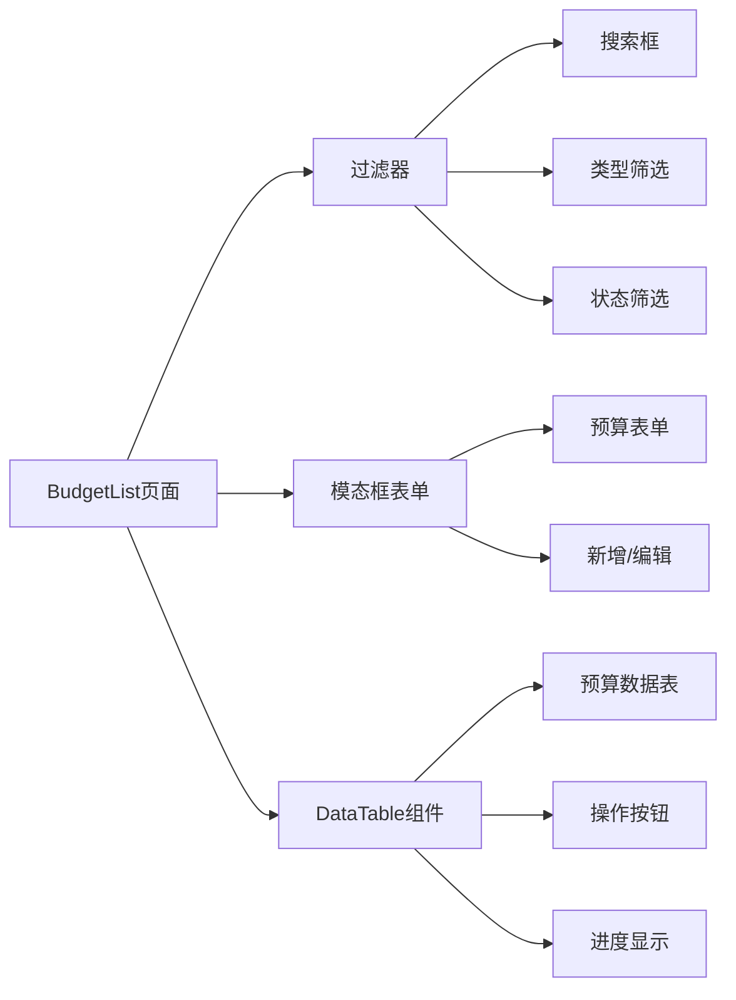

**图表来源**
- [BudgetList.tsx:28-329](file://src/pages/BudgetList.tsx#L28-L329)

#### 预算详情页面

详情页面展示了复杂数据的表格展示：

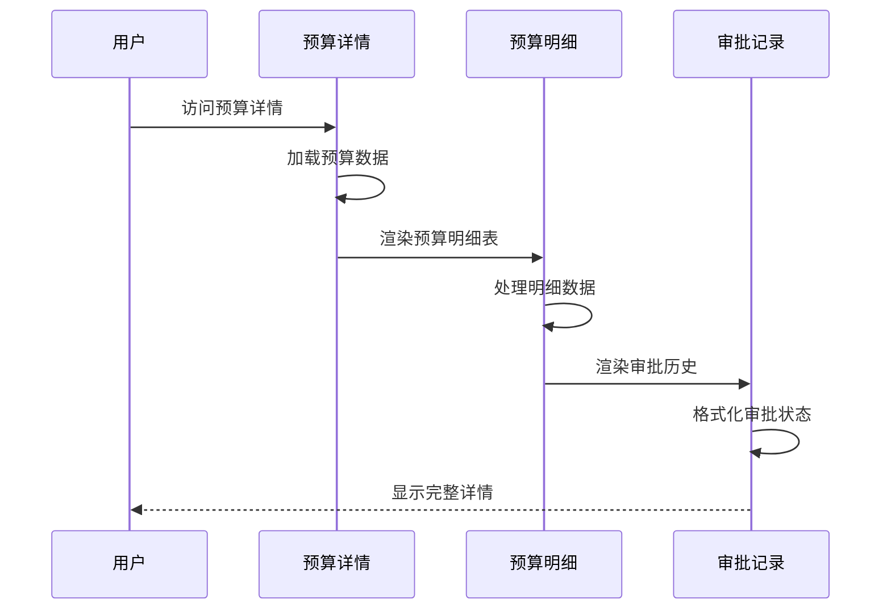

**图表来源**
- [BudgetDetail.tsx:32-159](file://src/pages/BudgetDetail.tsx#L32-L159)

**章节来源**
- [BudgetList.tsx:1-329](file://src/pages/BudgetList.tsx#L1-L329)
- [BudgetDetail.tsx:1-159](file://src/pages/BudgetDetail.tsx#L1-L159)

### 类型系统设计

系统使用了完整的TypeScript类型定义，确保代码的类型安全性和可维护性：

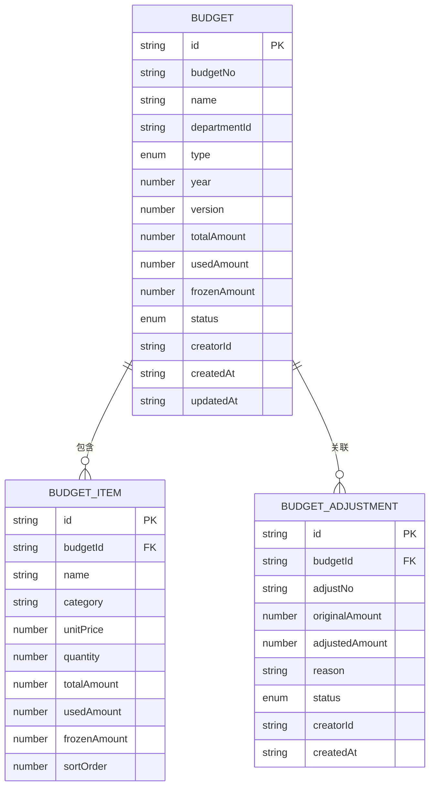

**图表来源**
- [index.ts:80-153](file://src/types/index.ts#L80-L153)

**章节来源**
- [index.ts:1-338](file://src/types/index.ts#L1-L338)

## 依赖关系分析

### 技术栈依赖

系统采用了现代化的技术栈组合，每个依赖都有其特定的作用：

```mermaid
graph TB
subgraph "核心依赖"
A[react] --> A1[18.3.1]
B[react-dom] --> B1[18.3.1]
C[antd] --> C1[6.3.4]
D[react-router-dom] --> D1[6.22.0]
end
subgraph "开发工具"
E[vite] --> E1[5.4.1]
F[typescript] --> F1[5.4.2]
G[@ant-design/icons] --> G1[6.1.1]
end
subgraph "业务工具"
H[@tanstack/react-query] --> H1[5.95.2]
I[lucide-react] --> I1[0.344.0]
J[axios] --> J1[1.13.6]
K[zustand] --> K1[4.5.0]
end
subgraph "后端服务"
L[nestjs] --> L1[10.x]
M[prisma] --> M1[5.x]
N[reflect-metadata] --> N1[0.1.13]
end
```

**图表来源**
- [package.json:12-32](file://package.json#L12-L32)

### 组件间依赖关系

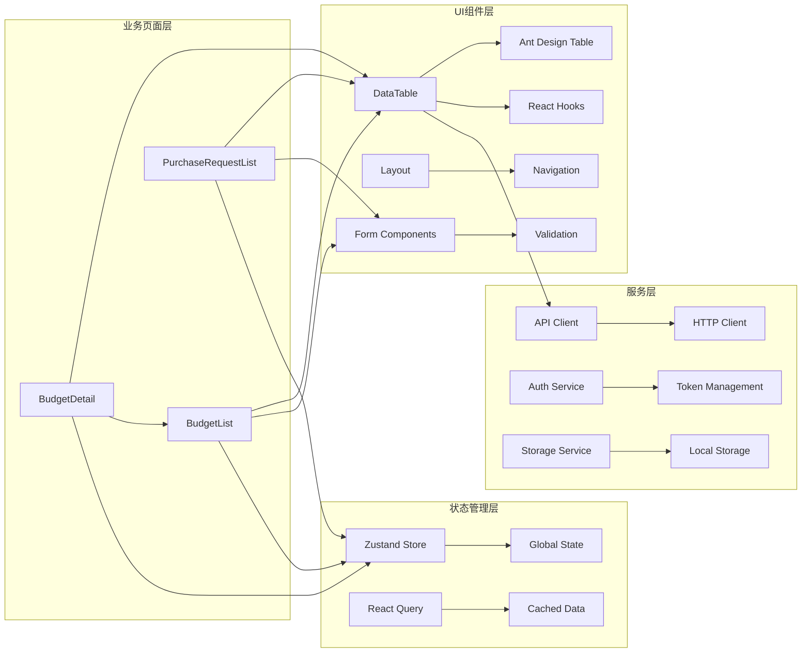

**图表来源**
- [DataTable.tsx:1](file://src/components/ui/Table/DataTable.tsx#L1)
- [BudgetList.tsx:1](file://src/pages/BudgetList.tsx#L1)
- [BudgetDetail.tsx:1](file://src/pages/BudgetDetail.tsx#L1)

**章节来源**
- [package.json:1-45](file://package.json#L1-L45)

## 性能考虑

### 渲染优化策略

系统采用了多种性能优化策略来确保良好的用户体验：

1. **虚拟滚动**: 对于大量数据的表格，建议使用虚拟滚动技术
2. **懒加载**: 页面组件使用React.lazy进行懒加载
3. **缓存策略**: 使用React Query进行数据缓存
4. **防抖处理**: 输入框的搜索功能使用防抖优化

### 内存管理

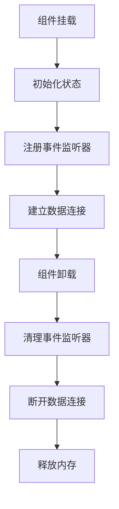

### 错误边界处理

系统实现了完善的错误处理机制：

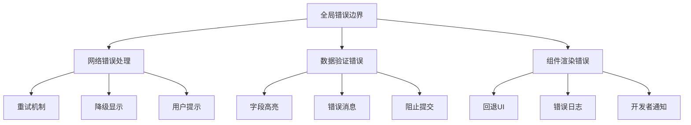

## 故障排除指南

### 常见问题及解决方案

#### DataTable组件问题

| 问题 | 可能原因 | 解决方案 |
|------|----------|----------|
| 数据不显示 | dataSource为空或格式错误 | 检查数据结构和类型定义 |
| 排序无效 | sorter函数返回值不正确 | 验证比较逻辑和数据类型 |
| 分页异常 | pagination配置错误 | 检查pageSize和total设置 |
| 样式冲突 | CSS类名冲突 | 使用CSS Modules或命名空间 |

#### 路由问题

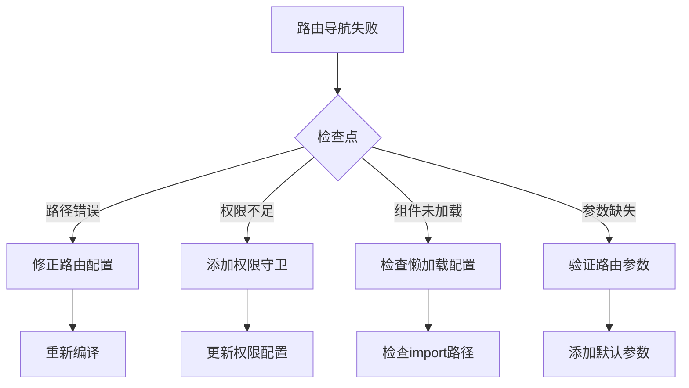

#### API调用问题

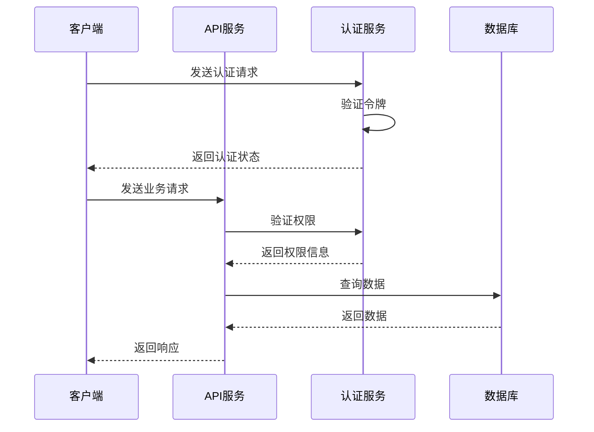

**章节来源**
- [DataTable.tsx:16-107](file://src/components/ui/Table/DataTable.tsx#L16-L107)

## 结论

预算管理系统的通用UI组件设计体现了现代前端开发的最佳实践。通过精心设计的组件架构、完善的类型系统和丰富的功能特性，系统为用户提供了优秀的使用体验。

### 主要优势

1. **高度可复用性**: 组件设计遵循单一职责原则，易于在不同场景中使用
2. **类型安全**: 完整的TypeScript类型定义确保代码质量和开发效率
3. **性能优化**: 采用多种优化策略确保良好的用户体验
4. **扩展性强**: 模块化的架构设计便于功能扩展和维护

### 技术亮点

- 基于Ant Design的成熟UI框架，保证了组件的稳定性和一致性
- 完整的TypeScript类型系统，提供编译时错误检测
- 现代化的构建工具链，提升开发和部署效率
- 丰富的业务场景适配，满足多样化的预算管理需求

### 未来发展方向

1. **国际化支持**: 扩展多语言支持功能
2. **主题定制**: 提供更灵活的主题定制选项
3. **移动端优化**: 改进移动端的用户体验
4. **无障碍访问**: 增强无障碍访问功能

该系统为预算管理领域的数字化转型提供了坚实的技术基础，通过持续的优化和扩展，将能够更好地服务于各类企业用户的预算管理需求。