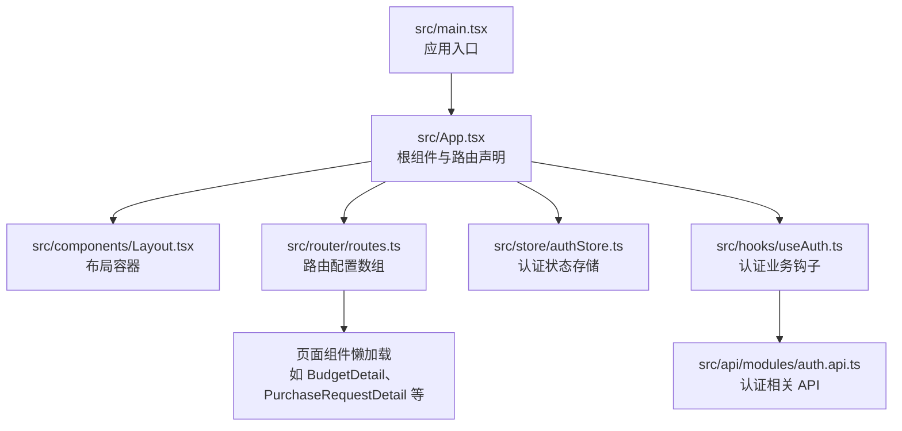
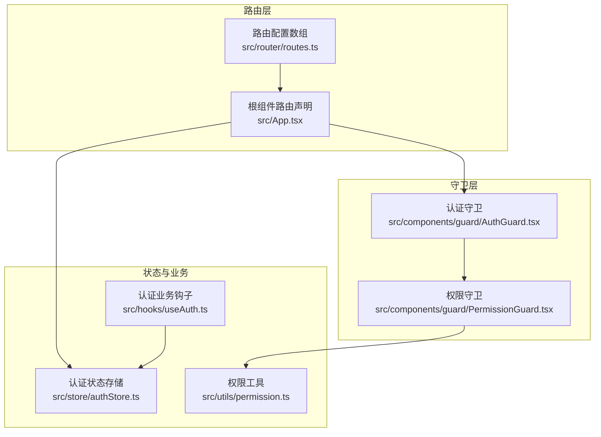
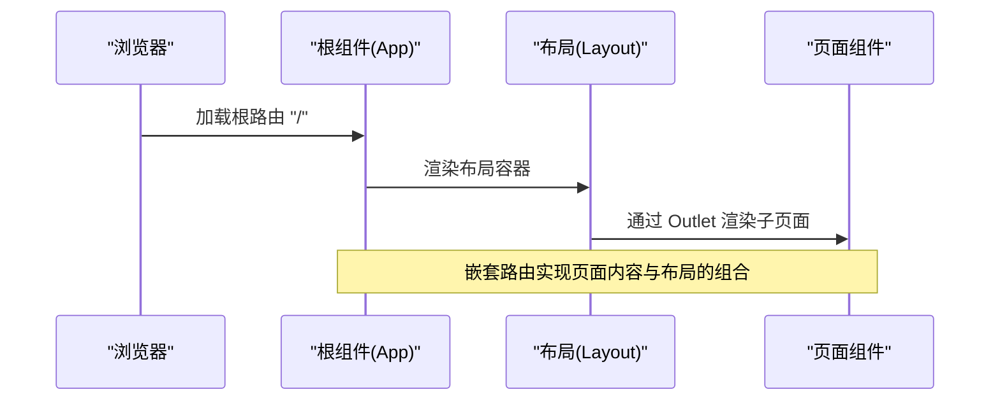
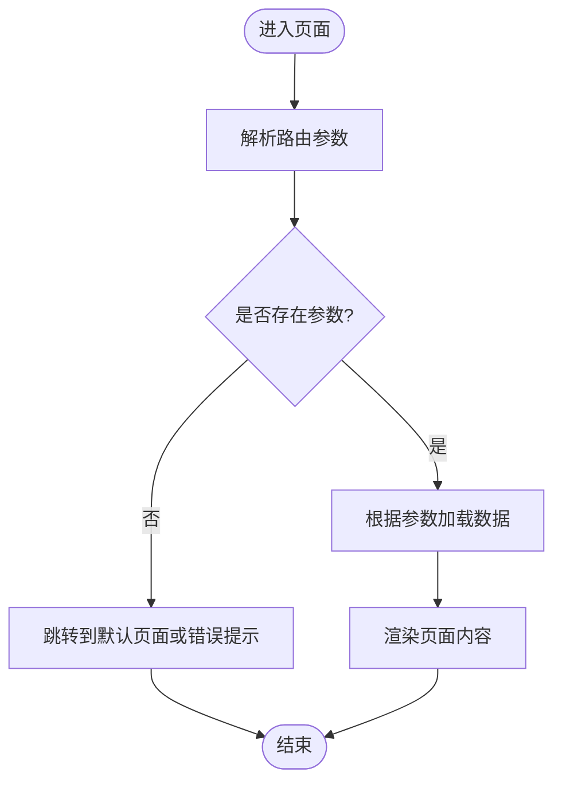
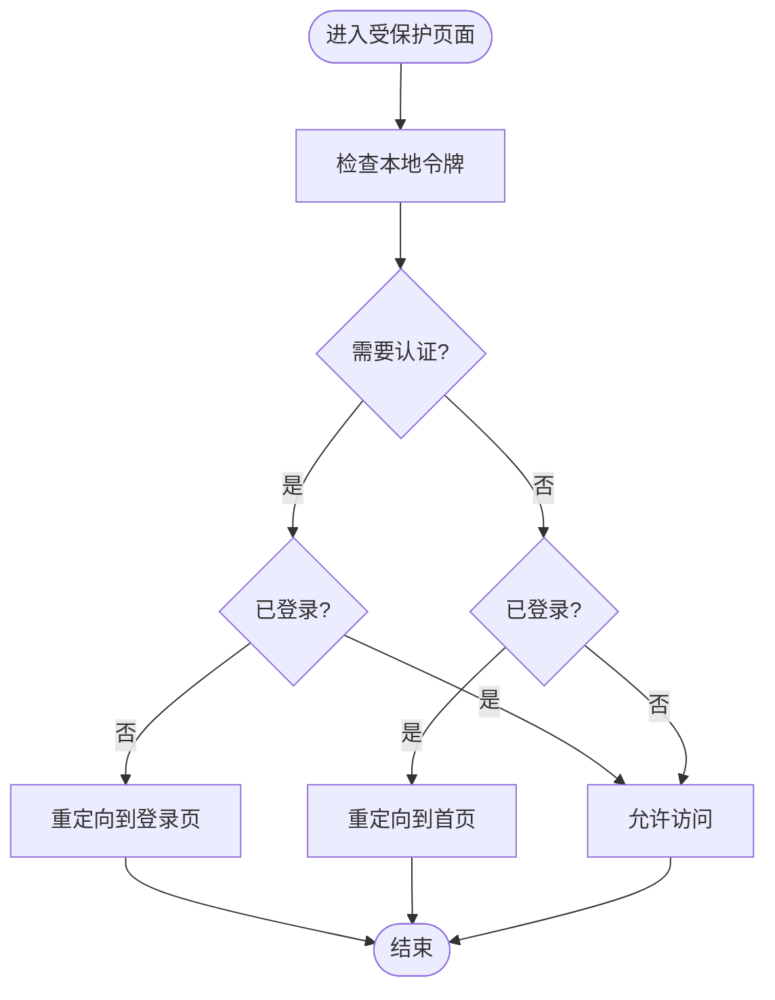
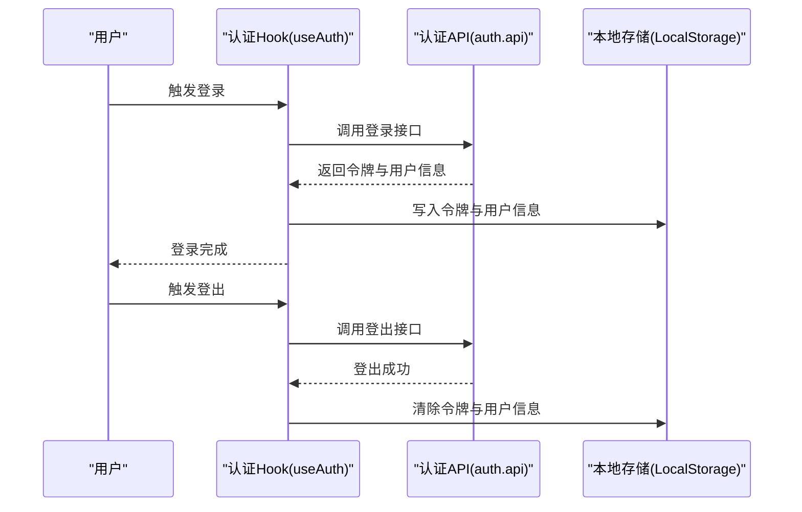
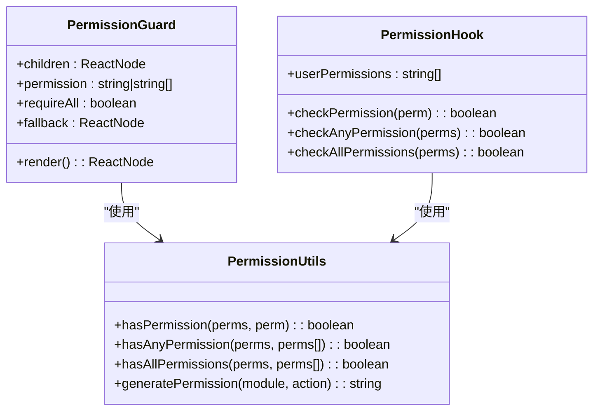
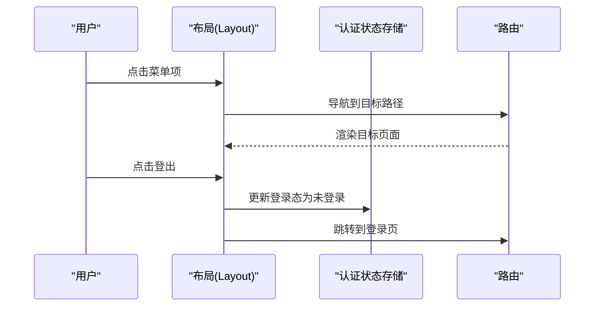
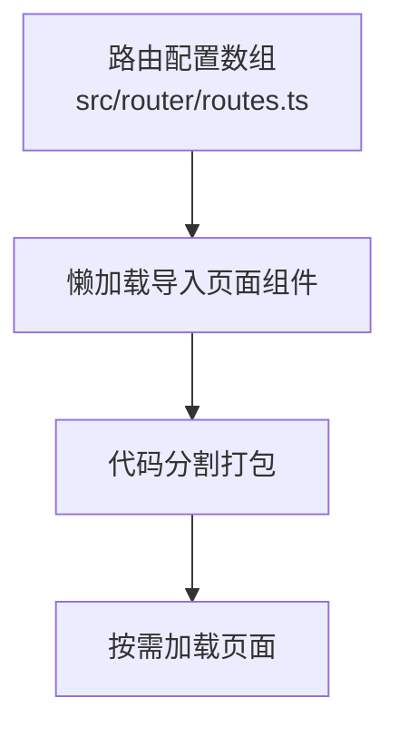
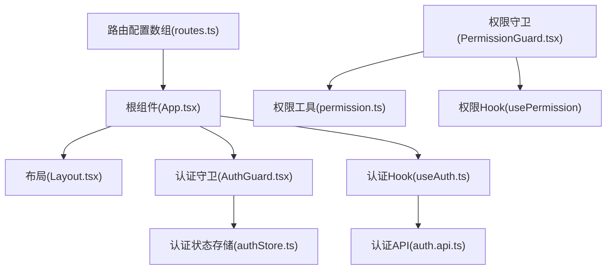

# 路由系统与页面导航

<cite>
**本文引用的文件**
- [src/router/routes.ts](file://src/router/routes.ts)
- [src/router/index.ts](file://src/router/index.ts)
- [src/App.tsx](file://src/App.tsx)
- [src/components/guard/AuthGuard.tsx](file://src/components/guard/AuthGuard.tsx)
- [src/components/guard/PermissionGuard.tsx](file://src/components/guard/PermissionGuard.tsx)
- [src/store/authStore.ts](file://src/store/authStore.ts)
- [src/hooks/useAuth.ts](file://src/hooks/useAuth.ts)
- [src/utils/permission.ts](file://src/utils/permission.ts)
- [src/components/Layout.tsx](file://src/components/Layout.tsx)
- [src/pages/BudgetDetail.tsx](file://src/pages/BudgetDetail.tsx)
- [src/pages/PurchaseRequestDetail.tsx](file://src/pages/PurchaseRequestDetail.tsx)
- [src/api/modules/auth.api.ts](file://src/api/modules/auth.api.ts)
- [src/main.tsx](file://src/main.tsx)
</cite>

## 目录
1. [简介](#简介)
2. [项目结构](#项目结构)
3. [核心组件](#核心组件)
4. [架构总览](#架构总览)
5. [详细组件分析](#详细组件分析)
6. [依赖关系分析](#依赖关系分析)
7. [性能考虑](#性能考虑)
8. [故障排查指南](#故障排查指南)
9. [结论](#结论)
10. [附录](#附录)

## 简介
本文件围绕预算管理系统的前端路由体系进行系统化梳理，重点覆盖以下方面：
- React Router 的配置与使用模式：路由定义、嵌套路由与动态路由参数处理
- 私有路由保护机制：AuthGuard 设计与本地存储令牌校验流程
- 路由守卫的使用场景与实现原理：认证守卫与权限守卫
- 页面间导航逻辑与路由跳转最佳实践
- 路由配置扩展方法与性能优化建议
- 路由懒加载与代码分割的实现方案

## 项目结构
系统采用基于文件的路由组织方式，主应用在根组件中集中声明路由，并通过布局组件承载嵌套路由内容。路由配置分为两部分：
- 基于文件导出的路由数组，便于集中管理与扩展
- 在根组件中以嵌套路由形式挂载布局与子页面

图表来源
- [src/main.tsx:22-26](file://src/main.tsx#L22-L26)
- [src/App.tsx:29-64](file://src/App.tsx#L29-L64)
- [src/router/routes.ts:25-121](file://src/router/routes.ts#L25-L121)
- [src/components/Layout.tsx:18-99](file://src/components/Layout.tsx#L18-L99)
- [src/store/authStore.ts:19-31](file://src/store/authStore.ts#L19-L31)
- [src/hooks/useAuth.ts:8-83](file://src/hooks/useAuth.ts#L8-L83)
- [src/api/modules/auth.api.ts:14-49](file://src/api/modules/auth.api.ts#L14-L49)

章节来源
- [src/main.tsx:22-26](file://src/main.tsx#L22-L26)
- [src/App.tsx:29-64](file://src/App.tsx#L29-L64)
- [src/router/routes.ts:25-121](file://src/router/routes.ts#L25-L121)
- [src/components/Layout.tsx:18-99](file://src/components/Layout.tsx#L18-L99)

## 核心组件
- 路由配置数组：集中定义路径、元素与认证要求，支持懒加载页面组件
- 根组件路由声明：使用嵌套路由与布局容器承载子页面
- 认证守卫组件：基于本地存储令牌进行登录态判断与重定向
- 权限守卫组件：基于用户权限集合进行细粒度权限控制
- 认证状态存储：Zustand 状态管理，持久化存储登录状态
- 认证业务钩子：封装登录、登出、修改密码等认证相关操作
- 权限工具：统一的权限判断与权限枚举

章节来源
- [src/router/routes.ts:1-122](file://src/router/routes.ts#L1-L122)
- [src/App.tsx:24-60](file://src/App.tsx#L24-L60)
- [src/components/guard/AuthGuard.tsx:1-31](file://src/components/guard/AuthGuard.tsx#L1-L31)
- [src/components/guard/PermissionGuard.tsx:1-88](file://src/components/guard/PermissionGuard.tsx#L1-L88)
- [src/store/authStore.ts:1-31](file://src/store/authStore.ts#L1-L31)
- [src/hooks/useAuth.ts:1-84](file://src/hooks/useAuth.ts#L1-L84)
- [src/utils/permission.ts:1-84](file://src/utils/permission.ts#L1-L84)

## 架构总览
系统采用“路由配置 + 嵌套路由 + 守卫”的组合架构：
- 路由配置数组统一管理路径与页面映射，支持懒加载
- 根组件通过嵌套路由将布局与子页面绑定，形成父子关系
- 认证守卫在进入受保护页面前检查登录态
- 权限守卫在组件级别对按钮或功能进行细粒度控制
- 认证状态与业务逻辑分离，通过状态存储与业务钩子解耦

图表来源
- [src/router/routes.ts:25-121](file://src/router/routes.ts#L25-L121)
- [src/App.tsx:34-60](file://src/App.tsx#L34-L60)
- [src/components/guard/AuthGuard.tsx:13-30](file://src/components/guard/AuthGuard.tsx#L13-L30)
- [src/components/guard/PermissionGuard.tsx:15-46](file://src/components/guard/PermissionGuard.tsx#L15-L46)
- [src/store/authStore.ts:19-31](file://src/store/authStore.ts#L19-L31)
- [src/hooks/useAuth.ts:8-83](file://src/hooks/useAuth.ts#L8-L83)
- [src/utils/permission.ts:11-41](file://src/utils/permission.ts#L11-L41)

## 详细组件分析

### 路由配置与嵌套路由
- 路由配置数组集中定义路径、元素与认证要求，便于统一维护与扩展
- 根组件使用嵌套路由将布局容器与子页面绑定，形成父子关系
- 子页面通过 Outlet 接收嵌套内容，实现布局与页面的解耦

图表来源
- [src/App.tsx:34-60](file://src/App.tsx#L34-L60)
- [src/components/Layout.tsx:94-95](file://src/components/Layout.tsx#L94-L95)

章节来源
- [src/router/routes.ts:25-121](file://src/router/routes.ts#L25-L121)
- [src/App.tsx:34-60](file://src/App.tsx#L34-L60)
- [src/components/Layout.tsx:94-95](file://src/components/Layout.tsx#L94-L95)

### 动态路由参数处理
- 动态路由参数通过路径占位符定义，页面组件通过参数解析器读取
- 示例：预算详情页通过参数解析器获取预算 ID，实现按 ID 展示详情
- 示例：采购申请详情页通过参数解析器获取申请 ID，实现按 ID 展示详情

图表来源
- [src/pages/BudgetDetail.tsx:32-34](file://src/pages/BudgetDetail.tsx#L32-L34)
- [src/pages/PurchaseRequestDetail.tsx:54-56](file://src/pages/PurchaseRequestDetail.tsx#L54-L56)

章节来源
- [src/pages/BudgetDetail.tsx:32-34](file://src/pages/BudgetDetail.tsx#L32-L34)
- [src/pages/PurchaseRequestDetail.tsx:54-56](file://src/pages/PurchaseRequestDetail.tsx#L54-L56)

### 私有路由保护机制（AuthGuard）
- 认证守卫基于本地存储中的令牌进行登录态判断
- 当需要认证且未登录时，自动跳转至登录页；当不需要认证但已登录时，跳转至首页
- 与根组件的私有路由配合，确保受保护页面仅对已登录用户开放

图表来源
- [src/components/guard/AuthGuard.tsx:17-27](file://src/components/guard/AuthGuard.tsx#L17-L27)
- [src/App.tsx:24-27](file://src/App.tsx#L24-L27)

章节来源
- [src/components/guard/AuthGuard.tsx:13-30](file://src/components/guard/AuthGuard.tsx#L13-L30)
- [src/App.tsx:24-27](file://src/App.tsx#L24-L27)

### JWT 令牌验证流程（本地存储）
- 登录成功后，认证业务钩子将令牌与用户信息写入本地存储
- 认证守卫通过读取本地存储判断登录态
- 登出时清除本地存储，确保安全退出

图表来源
- [src/hooks/useAuth.ts:12-21](file://src/hooks/useAuth.ts#L12-L21)
- [src/hooks/useAuth.ts:26-36](file://src/hooks/useAuth.ts#L26-L36)
- [src/api/modules/auth.api.ts:18-27](file://src/api/modules/auth.api.ts#L18-L27)

章节来源
- [src/hooks/useAuth.ts:12-21](file://src/hooks/useAuth.ts#L12-L21)
- [src/hooks/useAuth.ts:26-36](file://src/hooks/useAuth.ts#L26-L36)
- [src/api/modules/auth.api.ts:18-27](file://src/api/modules/auth.api.ts#L18-L27)

### 权限守卫与权限控制
- 权限守卫基于用户权限集合进行判断，支持单个权限与多个权限的“任意满足”“全部满足”
- 权限工具提供统一的权限判断与权限枚举，便于在业务中复用
- 权限 Hook 提供便捷的权限检查能力，减少重复代码

图表来源
- [src/components/guard/PermissionGuard.tsx:15-46](file://src/components/guard/PermissionGuard.tsx#L15-L46)
- [src/utils/permission.ts:11-41](file://src/utils/permission.ts#L11-L41)
- [src/components/guard/PermissionGuard.tsx:51-87](file://src/components/guard/PermissionGuard.tsx#L51-L87)

章节来源
- [src/components/guard/PermissionGuard.tsx:15-46](file://src/components/guard/PermissionGuard.tsx#L15-L46)
- [src/utils/permission.ts:11-41](file://src/utils/permission.ts#L11-L41)
- [src/components/guard/PermissionGuard.tsx:51-87](file://src/components/guard/PermissionGuard.tsx#L51-L87)

### 页面间导航与最佳实践
- 使用链接组件进行页面内导航，保持用户体验一致
- 在布局组件中统一管理导航菜单，结合激活态样式提升可发现性
- 登出时通过状态存储更新登录态并跳转至登录页

图表来源
- [src/components/Layout.tsx:28-41](file://src/components/Layout.tsx#L28-L41)
- [src/components/Layout.tsx:23-26](file://src/components/Layout.tsx#L23-L26)
- [src/store/authStore.ts:24-25](file://src/store/authStore.ts#L24-L25)

章节来源
- [src/components/Layout.tsx:28-41](file://src/components/Layout.tsx#L28-L41)
- [src/components/Layout.tsx:23-26](file://src/components/Layout.tsx#L23-L26)
- [src/store/authStore.ts:24-25](file://src/store/authStore.ts#L24-L25)

### 路由懒加载与代码分割
- 路由配置数组中使用懒加载导入页面组件，降低首屏包体
- 结合路由嵌套与守卫，实现按需加载与权限控制的协同

图表来源
- [src/router/routes.ts:4-22](file://src/router/routes.ts#L4-L22)

章节来源
- [src/router/routes.ts:4-22](file://src/router/routes.ts#L4-L22)

## 依赖关系分析
- 路由配置数组与根组件路由声明存在直接依赖关系
- 认证守卫依赖本地存储中的令牌，与认证业务钩子形成闭环
- 权限守卫依赖权限工具与用户权限集合，与权限 Hook 协同工作
- 布局组件依赖认证状态存储与导航逻辑

图表来源
- [src/router/routes.ts:25-121](file://src/router/routes.ts#L25-L121)
- [src/App.tsx:34-60](file://src/App.tsx#L34-L60)
- [src/components/guard/AuthGuard.tsx:17](file://src/components/guard/AuthGuard.tsx#L17)
- [src/store/authStore.ts:19-31](file://src/store/authStore.ts#L19-L31)
- [src/components/guard/PermissionGuard.tsx:15-46](file://src/components/guard/PermissionGuard.tsx#L15-L46)
- [src/utils/permission.ts:11-41](file://src/utils/permission.ts#L11-L41)
- [src/hooks/useAuth.ts:8-83](file://src/hooks/useAuth.ts#L8-L83)
- [src/api/modules/auth.api.ts:14-49](file://src/api/modules/auth.api.ts#L14-L49)

章节来源
- [src/router/routes.ts:25-121](file://src/router/routes.ts#L25-L121)
- [src/App.tsx:34-60](file://src/App.tsx#L34-L60)
- [src/components/guard/AuthGuard.tsx:17](file://src/components/guard/AuthGuard.tsx#L17)
- [src/store/authStore.ts:19-31](file://src/store/authStore.ts#L19-L31)
- [src/components/guard/PermissionGuard.tsx:15-46](file://src/components/guard/PermissionGuard.tsx#L15-L46)
- [src/utils/permission.ts:11-41](file://src/utils/permission.ts#L11-L41)
- [src/hooks/useAuth.ts:8-83](file://src/hooks/useAuth.ts#L8-L83)
- [src/api/modules/auth.api.ts:14-49](file://src/api/modules/auth.api.ts#L14-L49)

## 性能考虑
- 路由懒加载：通过懒加载导入页面组件，减少初始包体积，提升首屏加载速度
- 代码分割：结合路由嵌套与守卫，实现按需加载与权限控制的协同，避免不必要的资源加载
- 状态持久化：认证状态存储采用持久化策略，减少刷新后的重复请求
- 导航优化：在布局组件中统一管理导航菜单，减少重复渲染与跳转开销

## 故障排查指南
- 登录后仍被重定向到登录页
  - 检查本地存储中是否存在令牌与用户信息
  - 确认认证守卫的令牌检查逻辑是否正确
- 已登录却无法访问受保护页面
  - 检查路由配置中的认证要求与守卫逻辑
  - 确认根组件的私有路由包装是否生效
- 权限不足导致功能不可见
  - 检查用户权限集合与权限守卫的判断逻辑
  - 确认权限枚举与权限字符串格式是否一致
- 登出后状态未更新
  - 检查登出流程是否正确清除本地存储
  - 确认认证状态存储的更新逻辑是否触发重新渲染

章节来源
- [src/hooks/useAuth.ts:26-36](file://src/hooks/useAuth.ts#L26-L36)
- [src/components/guard/AuthGuard.tsx:17-27](file://src/components/guard/AuthGuard.tsx#L17-L27)
- [src/components/guard/PermissionGuard.tsx:21-43](file://src/components/guard/PermissionGuard.tsx#L21-L43)
- [src/store/authStore.ts:24-25](file://src/store/authStore.ts#L24-L25)

## 结论
本路由系统通过“路由配置 + 嵌套路由 + 守卫”的架构实现了清晰的页面组织与严格的访问控制。认证守卫与权限守卫分别从全局与组件级两个维度保障了系统的安全性与可用性。结合懒加载与代码分割，系统在保证功能完整性的同时兼顾了性能表现。后续可在鉴权模型、权限粒度与导航体验等方面持续优化。

## 附录
- 路由配置扩展方法
  - 新增页面：在路由配置数组中添加新的路由项，选择性启用懒加载
  - 新增权限：在权限工具中新增权限枚举，并在权限守卫中使用
  - 新增导航：在布局组件的导航菜单中添加新菜单项
- 性能优化建议
  - 对热点页面启用缓存策略，减少重复渲染
  - 合理拆分路由模块，避免单个路由文件过大
  - 使用骨架屏或占位符提升用户体验