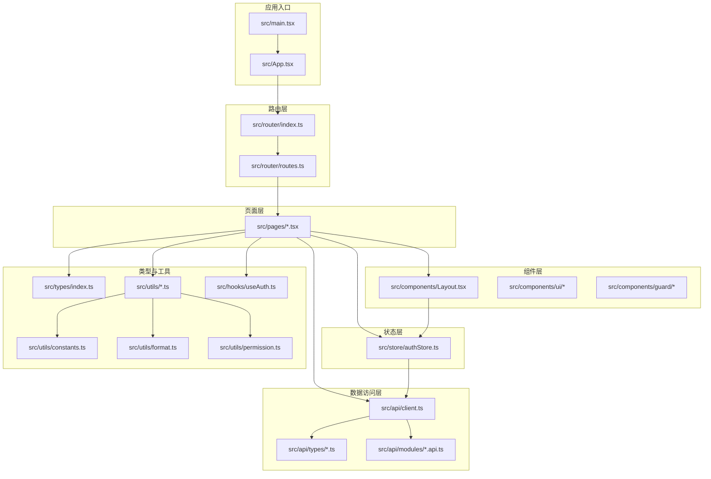
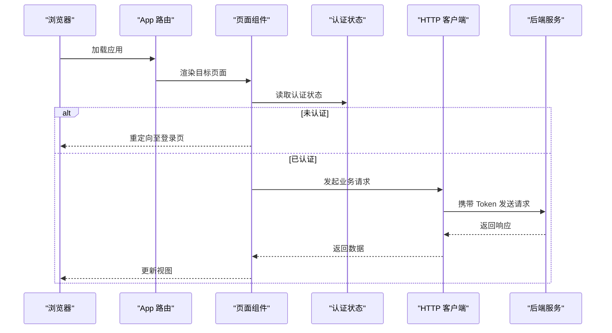
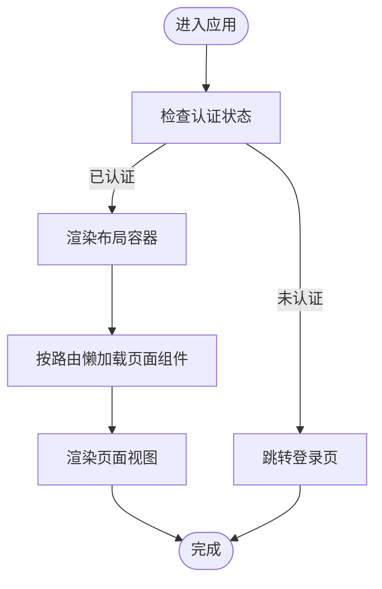
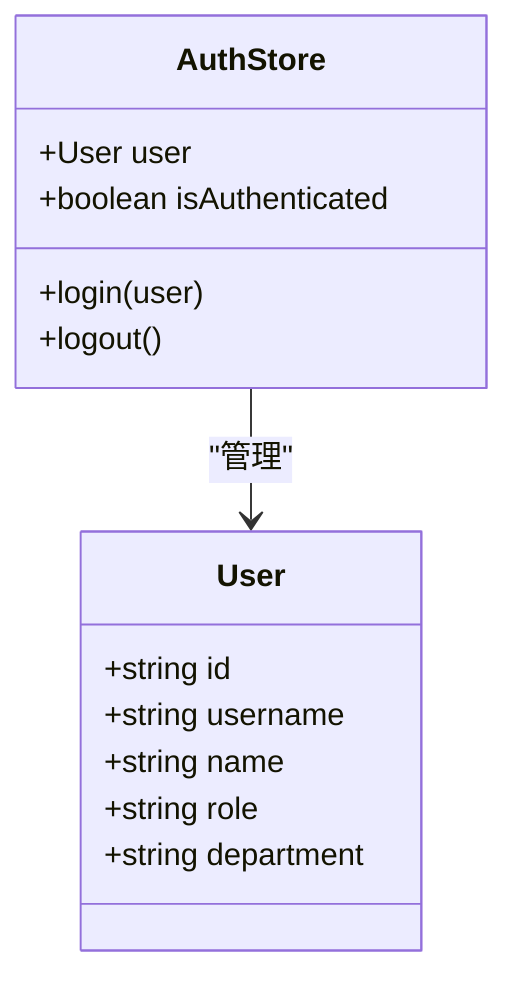
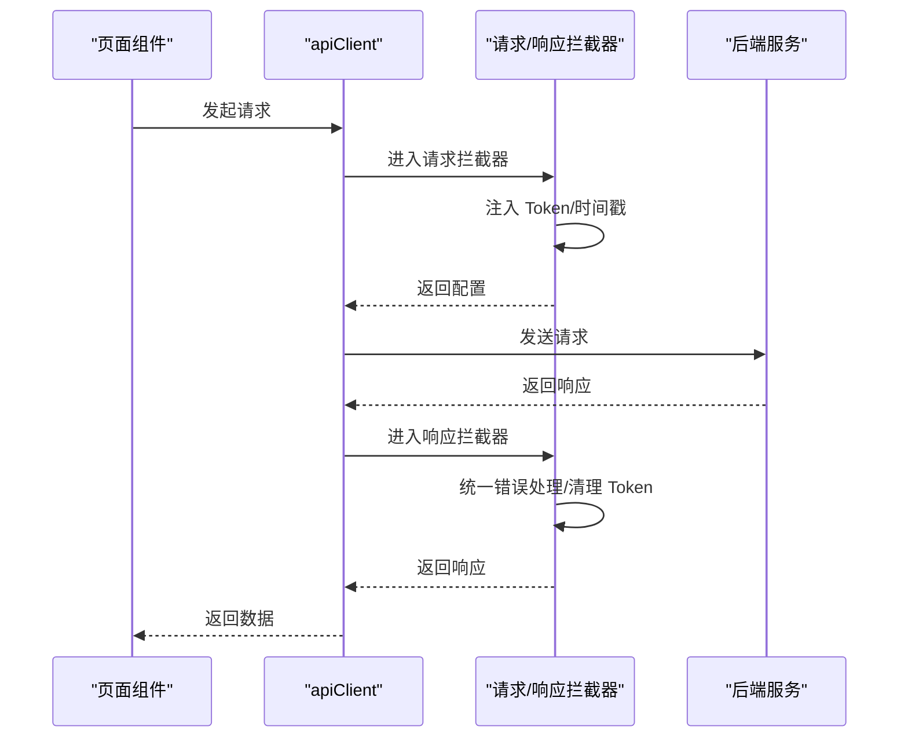
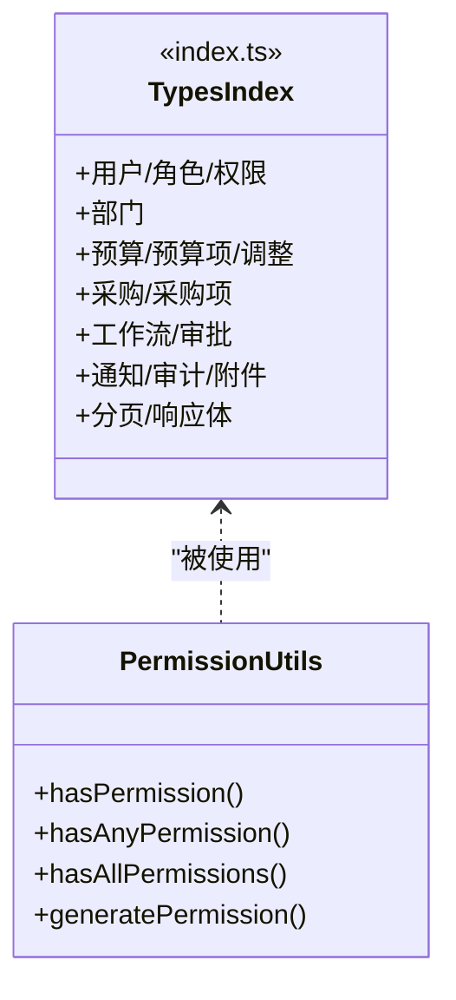
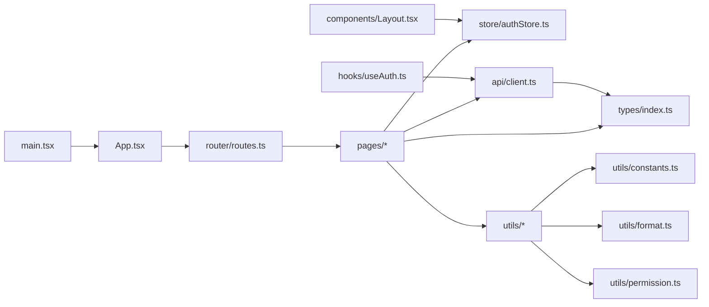

# 项目结构与目录组织

<cite>
**本文档引用的文件**
- [package.json](file://package.json)
- [tsconfig.json](file://tsconfig.json)
- [tsconfig.node.json](file://tsconfig.node.json)
- [vite.config.ts](file://vite.config.ts)
- [src/main.tsx](file://src/main.tsx)
- [src/App.tsx](file://src/App.tsx)
- [src/router/index.ts](file://src/router/index.ts)
- [src/router/routes.ts](file://src/router/routes.ts)
- [src/store/authStore.ts](file://src/store/authStore.ts)
- [src/components/Layout.tsx](file://src/components/Layout.tsx)
- [src/hooks/useAuth.ts](file://src/hooks/useAuth.ts)
- [src/api/client.ts](file://src/api/client.ts)
- [src/types/index.ts](file://src/types/index.ts)
- [src/utils/constants.ts](file://src/utils/constants.ts)
- [src/utils/format.ts](file://src/utils/format.ts)
- [src/utils/permission.ts](file://src/utils/permission.ts)
- [src/pages/Login.tsx](file://src/pages/Login.tsx)
</cite>

## 目录
1. [简介](#简介)
2. [项目结构](#项目结构)
3. [核心组件](#核心组件)
4. [架构总览](#架构总览)
5. [详细组件分析](#详细组件分析)
6. [依赖关系分析](#依赖关系分析)
7. [性能考虑](#性能考虑)
8. [故障排查指南](#故障排查指南)
9. [结论](#结论)
10. [附录](#附录)

## 简介
本文件面向预算管理系统的前端工程，系统性梳理 src 目录下的文件组织原则与设计理念，覆盖 pages、components、api、store、router、types、utils 等目录的职责划分与命名规范；同时阐释 Vite 构建配置与 TypeScript 配置的作用边界，并总结静态资源与公共样式组织方式、最佳实践与扩展建议，以及 Git 忽略规则与开发工具配置要点。

## 项目结构
- 采用“按功能域+按关注点”混合组织方式：
  - pages：页面级组件，承载路由对应的视图与业务逻辑入口
  - components：UI 组件与布局容器，复用性强
  - api：统一的 HTTP 客户端与类型定义，封装请求/响应拦截与文件操作
  - store：状态管理（Zustand），集中维护认证态与全局状态
  - router：路由配置与懒加载策略
  - types：全站类型定义，避免重复与耦合
  - utils：通用工具函数库，含格式化、权限、常量等
  - hooks：自定义 Hook，封装认证、查询等横切能力
- 根目录通过 Vite 提供开发服务器与构建打包，TypeScript 提供类型安全与路径别名支持

图表来源
- [src/main.tsx:1-26](file://src/main.tsx#L1-L26)
- [src/App.tsx:1-66](file://src/App.tsx#L1-L66)
- [src/router/index.ts:1-2](file://src/router/index.ts#L1-L2)
- [src/router/routes.ts:1-122](file://src/router/routes.ts#L1-L122)
- [src/store/authStore.ts:1-31](file://src/store/authStore.ts#L1-L31)
- [src/components/Layout.tsx:1-99](file://src/components/Layout.tsx#L1-L99)
- [src/api/client.ts:1-183](file://src/api/client.ts#L1-L183)
- [src/types/index.ts:1-338](file://src/types/index.ts#L1-L338)
- [src/utils/constants.ts:1-111](file://src/utils/constants.ts#L1-L111)
- [src/utils/format.ts:1-166](file://src/utils/format.ts#L1-L166)
- [src/utils/permission.ts:1-84](file://src/utils/permission.ts#L1-L84)
- [src/hooks/useAuth.ts:1-84](file://src/hooks/useAuth.ts#L1-L84)

章节来源
- [src/main.tsx:1-26](file://src/main.tsx#L1-L26)
- [src/App.tsx:1-66](file://src/App.tsx#L1-L66)
- [src/router/index.ts:1-2](file://src/router/index.ts#L1-L2)
- [src/router/routes.ts:1-122](file://src/router/routes.ts#L1-L122)

## 核心组件
- 应用入口与启动
  - main.tsx：挂载根节点，集中引入全局样式与页面样式，确保首屏样式一致
  - App.tsx：基于 React Router 的路由配置，提供私有路由守卫与页面嵌套
- 路由与导航
  - router/index.ts：导出路由配置入口
  - router/routes.ts：集中定义路由表，结合 React.lazy 实现按需加载
- 布局与导航
  - components/Layout.tsx：侧边栏、顶部栏、用户信息与登出流程
- 状态管理
  - store/authStore.ts：使用 Zustand + persist 实现认证状态持久化
- 数据访问
  - api/client.ts：Axios 实例封装，统一请求/响应拦截、Token 注入、错误处理、文件上传下载
- 类型体系
  - types/index.ts：涵盖用户、部门、预算、采购、审批、通知、审计、附件等完整领域模型
- 工具库
  - utils/constants.ts：全局常量（预算类型、状态、分页、文件限制等）
  - utils/format.ts：金额、百分比、日期、文件大小、防抖节流、深拷贝、下载等工具
  - utils/permission.ts：权限判断与权限字符串生成
- 自定义 Hook
  - hooks/useAuth.ts：封装登录、登出、修改密码、获取当前用户等认证相关操作

章节来源
- [src/main.tsx:1-26](file://src/main.tsx#L1-L26)
- [src/App.tsx:1-66](file://src/App.tsx#L1-L66)
- [src/router/index.ts:1-2](file://src/router/index.ts#L1-L2)
- [src/router/routes.ts:1-122](file://src/router/routes.ts#L1-L122)
- [src/components/Layout.tsx:1-99](file://src/components/Layout.tsx#L1-L99)
- [src/store/authStore.ts:1-31](file://src/store/authStore.ts#L1-L31)
- [src/api/client.ts:1-183](file://src/api/client.ts#L1-L183)
- [src/types/index.ts:1-338](file://src/types/index.ts#L1-L338)
- [src/utils/constants.ts:1-111](file://src/utils/constants.ts#L1-L111)
- [src/utils/format.ts:1-166](file://src/utils/format.ts#L1-L166)
- [src/utils/permission.ts:1-84](file://src/utils/permission.ts#L1-L84)
- [src/hooks/useAuth.ts:1-84](file://src/hooks/useAuth.ts#L1-L84)

## 架构总览
- 前端采用单页应用（SPA）架构，路由驱动页面切换
- 页面组件通过 store 与 api 层交互，实现数据与状态的解耦
- 组件层以 Layout 为核心容器，提供统一导航与用户上下文
- 工具层与类型层为各层提供基础支撑，保证一致性与可维护性

图表来源
- [src/App.tsx:24-27](file://src/App.tsx#L24-L27)
- [src/store/authStore.ts:19-31](file://src/store/authStore.ts#L19-L31)
- [src/api/client.ts:21-94](file://src/api/client.ts#L21-L94)

## 详细组件分析

### 目录组织与职责划分

- pages
  - 职责：承载页面级组件，负责业务视图与交互逻辑入口
  - 命名规范：采用 PascalCase，如 BudgetList.tsx、PurchaseRequestDetail.tsx；样式文件与页面同名，如 BudgetList.css
  - 示例：Login.tsx、Dashboard.tsx、BudgetList.tsx、PurchaseRequestList.tsx 等
- components
  - 职责：可复用 UI 组件与布局容器
  - 命名规范：UI 组件采用 PascalCase，如 DataTable.tsx；布局组件如 Layout.tsx；守卫组件如 AuthGuard.tsx、PermissionGuard.tsx
  - 结构：business、guard 子目录按功能域细分
- api
  - 职责：统一 HTTP 客户端与类型定义
  - 结构：modules 存放模块化 API；types 存放请求/响应类型；client.ts 封装 Axios 实例与拦截器
- store
  - 职责：集中管理认证与全局状态
  - 结构：authStore.ts 使用 Zustand + persist 实现状态持久化
- router
  - 职责：路由配置与懒加载
  - 结构：index.ts 导出路由配置；routes.ts 定义路由表
- types
  - 职责：全站类型定义，避免重复与耦合
  - 结构：index.ts 汇总导出，按领域分段注释
- utils
  - 职责：通用工具函数库
  - 结构：constants.ts 常量；format.ts 格式化；permission.ts 权限；其他工具函数
- hooks
  - 职责：封装横切能力，如认证 Hook
  - 结构：useAuth.ts 封装登录/登出/修改密码等

章节来源
- [src/pages/Login.tsx:1-102](file://src/pages/Login.tsx#L1-L102)
- [src/components/Layout.tsx:1-99](file://src/components/Layout.tsx#L1-L99)
- [src/api/client.ts:1-183](file://src/api/client.ts#L1-L183)
- [src/store/authStore.ts:1-31](file://src/store/authStore.ts#L1-L31)
- [src/router/routes.ts:1-122](file://src/router/routes.ts#L1-L122)
- [src/types/index.ts:1-338](file://src/types/index.ts#L1-L338)
- [src/utils/constants.ts:1-111](file://src/utils/constants.ts#L1-L111)
- [src/utils/format.ts:1-166](file://src/utils/format.ts#L1-L166)
- [src/utils/permission.ts:1-84](file://src/utils/permission.ts#L1-L84)
- [src/hooks/useAuth.ts:1-84](file://src/hooks/useAuth.ts#L1-L84)

### 路由与页面组件

图表来源
- [src/App.tsx:24-27](file://src/App.tsx#L24-L27)
- [src/router/routes.ts:1-122](file://src/router/routes.ts#L1-L122)

章节来源
- [src/App.tsx:1-66](file://src/App.tsx#L1-L66)
- [src/router/routes.ts:1-122](file://src/router/routes.ts#L1-L122)

### 认证与状态管理

图表来源
- [src/store/authStore.ts:4-17](file://src/store/authStore.ts#L4-L17)
- [src/store/authStore.ts:19-31](file://src/store/authStore.ts#L19-L31)

章节来源
- [src/store/authStore.ts:1-31](file://src/store/authStore.ts#L1-L31)

### 数据访问与拦截器

图表来源
- [src/api/client.ts:21-94](file://src/api/client.ts#L21-L94)

章节来源
- [src/api/client.ts:1-183](file://src/api/client.ts#L1-L183)

### 类型体系与权限工具

图表来源
- [src/types/index.ts:1-338](file://src/types/index.ts#L1-L338)
- [src/utils/permission.ts:1-84](file://src/utils/permission.ts#L1-L84)

章节来源
- [src/types/index.ts:1-338](file://src/types/index.ts#L1-L338)
- [src/utils/permission.ts:1-84](file://src/utils/permission.ts#L1-L84)

## 依赖关系分析

图表来源
- [src/main.tsx:1-26](file://src/main.tsx#L1-L26)
- [src/App.tsx:1-66](file://src/App.tsx#L1-L66)
- [src/router/routes.ts:1-122](file://src/router/routes.ts#L1-L122)
- [src/store/authStore.ts:1-31](file://src/store/authStore.ts#L1-L31)
- [src/api/client.ts:1-183](file://src/api/client.ts#L1-L183)
- [src/types/index.ts:1-338](file://src/types/index.ts#L1-L338)
- [src/utils/constants.ts:1-111](file://src/utils/constants.ts#L1-L111)
- [src/utils/format.ts:1-166](file://src/utils/format.ts#L1-L166)
- [src/utils/permission.ts:1-84](file://src/utils/permission.ts#L1-L84)
- [src/hooks/useAuth.ts:1-84](file://src/hooks/useAuth.ts#L1-L84)

章节来源
- [src/main.tsx:1-26](file://src/main.tsx#L1-L26)
- [src/App.tsx:1-66](file://src/App.tsx#L1-L66)
- [src/router/routes.ts:1-122](file://src/router/routes.ts#L1-L122)
- [src/store/authStore.ts:1-31](file://src/store/authStore.ts#L1-L31)
- [src/api/client.ts:1-183](file://src/api/client.ts#L1-L183)
- [src/types/index.ts:1-338](file://src/types/index.ts#L1-L338)
- [src/utils/constants.ts:1-111](file://src/utils/constants.ts#L1-L111)
- [src/utils/format.ts:1-166](file://src/utils/format.ts#L1-L166)
- [src/utils/permission.ts:1-84](file://src/utils/permission.ts#L1-L84)
- [src/hooks/useAuth.ts:1-84](file://src/hooks/useAuth.ts#L1-L84)

## 性能考虑
- 路由懒加载：通过 React.lazy 与动态 import 减少首屏包体，提升初始加载速度
- 组件拆分：Layout 作为容器组件，页面组件按功能拆分，降低重绘范围
- 状态粒度：使用 Zustand 管理轻量认证状态，避免过度订阅
- 工具函数：格式化与权限判断尽量纯函数化，减少副作用
- 构建优化：Vite 默认开启按需编译与热更新，TypeScript 配置启用严格模式与路径别名，提升开发体验与编译效率

## 故障排查指南
- 登录失败或跳转异常
  - 检查登录页面是否正确调用认证状态与路由跳转
  - 参考：[src/pages/Login.tsx:14-38](file://src/pages/Login.tsx#L14-L38)
- 未授权或 Token 失效
  - 检查响应拦截器是否正确清除本地 Token 并跳转登录页
  - 参考：[src/api/client.ts:62-67](file://src/api/client.ts#L62-L67)
- 请求超时或网络错误
  - 检查请求拦截器中的超时配置与错误分支处理
  - 参考：[src/api/client.ts:6-8](file://src/api/client.ts#L6-L8)，[src/api/client.ts:86-89](file://src/api/client.ts#L86-L89)
- 样式未生效
  - 确认 main.tsx 中是否引入对应页面样式
  - 参考：[src/main.tsx:9-21](file://src/main.tsx#L9-L21)
- 路由不匹配或白屏
  - 检查路由配置与懒加载路径是否一致
  - 参考：[src/router/routes.ts:4-22](file://src/router/routes.ts#L4-L22)，[src/router/index.ts:1](file://src/router/index.ts#L1)

章节来源
- [src/pages/Login.tsx:1-102](file://src/pages/Login.tsx#L1-L102)
- [src/api/client.ts:1-183](file://src/api/client.ts#L1-L183)
- [src/main.tsx:1-26](file://src/main.tsx#L1-L26)
- [src/router/routes.ts:1-122](file://src/router/routes.ts#L1-L122)
- [src/router/index.ts:1-2](file://src/router/index.ts#L1-L2)

## 结论
该前端工程遵循清晰的目录分层与职责划分，结合路由懒加载、统一 API 客户端、类型化与工具函数库，形成高内聚、低耦合的结构。通过 Zustand 管理认证状态，配合权限工具与拦截器机制，保障了用户体验与安全性。建议在后续迭代中持续完善类型覆盖、测试用例与文档，保持架构演进的一致性与可维护性。

## 附录

### Vite 构建配置与 TypeScript 配置
- Vite 配置
  - 插件：React 插件
  - 别名：@ 指向 src 目录
  - 开发服务器：端口 5173，代理 /api 到后端服务
  - 参考：[vite.config.ts:1-24](file://vite.config.ts#L1-L24)
- TypeScript 配置
  - 编译目标：ES2020
  - 模块解析：bundler
  - JSX：react-jsx
  - 路径别名：@/* 映射 ./src/*
  - 参考：[tsconfig.json:1-25](file://tsconfig.json#L1-L25)
- Node 环境配置
  - 参考：[tsconfig.node.json](file://tsconfig.node.json)

章节来源
- [vite.config.ts:1-24](file://vite.config.ts#L1-L24)
- [tsconfig.json:1-25](file://tsconfig.json#L1-L25)
- [tsconfig.node.json](file://tsconfig.node.json)

### 静态资源与公共样式组织
- 静态资源：public 目录用于放置公共资源（如图标、字体、HTML 模板等）
- 公共样式：在 main.tsx 中集中引入全局样式与页面样式，确保首屏一致
  - 参考：[src/main.tsx:9-21](file://src/main.tsx#L9-L21)
- 组件样式：按页面同名样式文件组织，便于维护与查找

章节来源
- [src/main.tsx:1-26](file://src/main.tsx#L1-L26)

### 目录结构最佳实践与扩展指导
- 命名规范
  - 目录：小写 + 复数（如 pages、components、utils）
  - 文件：PascalCase（组件）、小写（工具函数）、同名样式文件（页面）
- 扩展建议
  - 新增页面：在 pages 下新增文件，按需引入样式与组件
  - 新增组件：在 components 下按功能域新建子目录
  - 新增 API：在 api/modules 下新增模块文件，类型定义放入 api/types
  - 新增工具：在 utils 下新增函数文件，必要时补充类型定义
  - 新增路由：在 router/routes.ts 中添加条目，必要时使用 React.lazy
- 代码组织
  - 优先使用类型定义，避免魔法字符串
  - 将跨页面使用的逻辑抽取为 Hook 或工具函数
  - 对外暴露的接口通过 index.ts 汇总导出，保持导入简洁

### Git 忽略规则与开发工具配置
- Git 忽略规则
  - 建议忽略 node_modules、dist、.env、IDE 临时文件、系统缓存等
  - 参考：[package.json:6-11](file://package.json#L6-L11)（脚本示例）
- 开发工具
  - ESLint：代码质量检查（参考 scripts.lint）
  - TypeScript：类型检查与智能提示
  - Vite：快速开发与构建
  - 参考：[package.json:34-43](file://package.json#L34-L43)

章节来源
- [package.json:1-45](file://package.json#L1-L45)