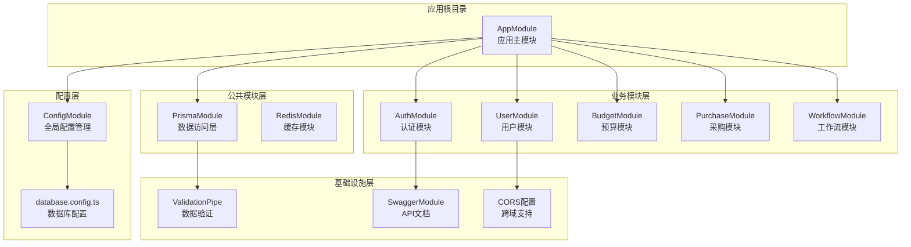
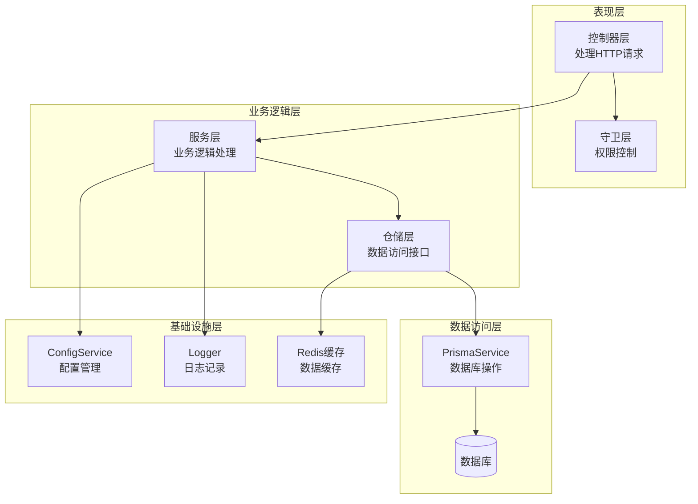
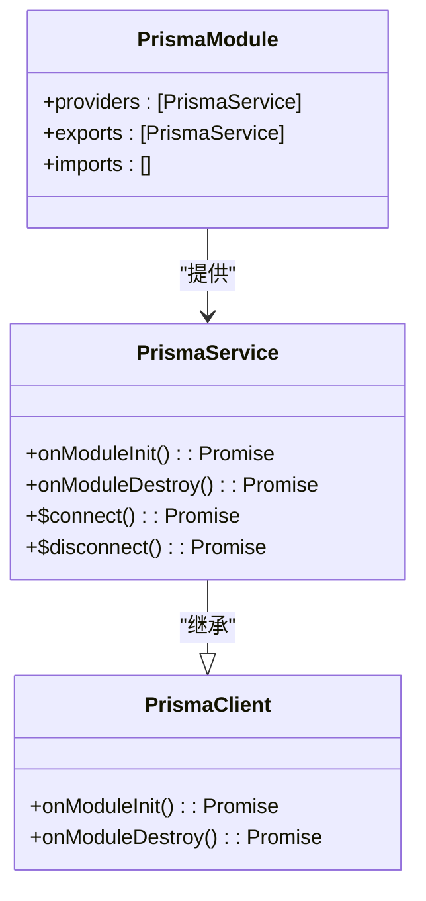
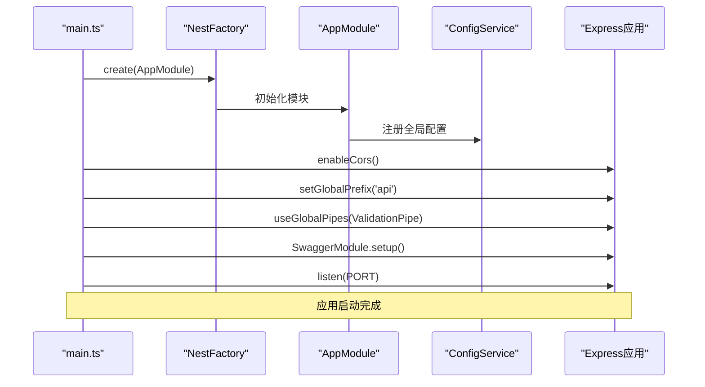
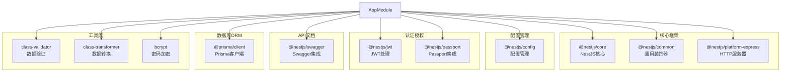
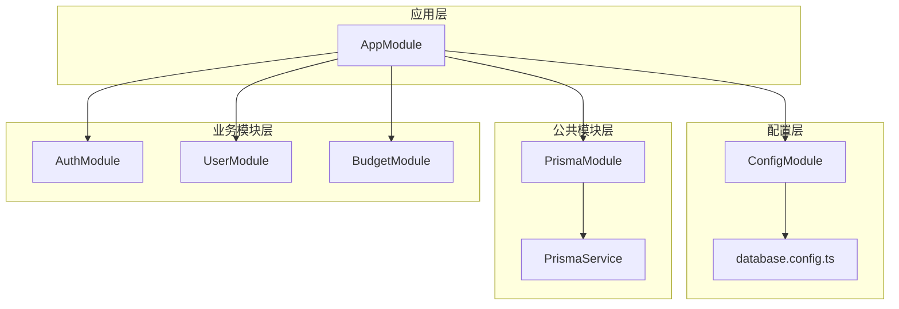

# NestJS应用模块

<cite>
**本文档引用的文件**
- [app.module.ts](file://server/src/app.module.ts)
- [main.ts](file://server/src/main.ts)
- [prisma.module.ts](file://server/src/common/prisma/prisma.module.ts)
- [prisma.service.ts](file://server/src/common/prisma/prisma.service.ts)
- [database.config.ts](file://server/src/config/database.config.ts)
- [nest-cli.json](file://server/nest-cli.json)
- [package.json](file://server/package.json)
</cite>

## 目录
1. [简介](#简介)
2. [项目结构](#项目结构)
3. [核心组件](#核心组件)
4. [架构概览](#架构概览)
5. [详细组件分析](#详细组件分析)
6. [依赖分析](#依赖分析)
7. [性能考虑](#性能考虑)
8. [故障排除指南](#故障排除指南)
9. [结论](#结论)

## 简介

本项目是一个基于NestJS的企业级预算管理系统后端服务。该系统采用模块化架构设计，通过精心组织的模块结构实现了业务功能的清晰分离和可维护性。系统的核心设计理念是通过@Module装饰器管理应用的依赖关系，利用ConfigModule的全局配置机制统一管理环境变量和配置参数，同时通过PrismaModule提供数据访问层的抽象。

该应用支持RESTful API接口，集成了Swagger文档生成、JWT认证、数据验证等现代Web开发特性，并为后续的功能扩展预留了完整的模块化架构基础。

## 项目结构

项目采用典型的NestJS项目结构，主要分为以下层次：

**图表来源**
- [app.module.ts:22-51](file://server/src/app.module.ts#L22-L51)
- [prisma.module.ts:4-9](file://server/src/common/prisma/prisma.module.ts#L4-L9)

**章节来源**
- [app.module.ts:1-52](file://server/src/app.module.ts#L1-L52)
- [nest-cli.json:1-17](file://server/nest-cli.json#L1-L17)

## 核心组件

### 应用主模块 (AppModule)

AppModule作为应用的根模块，采用了延迟加载和模块化设计策略。其设计特点包括：

- **模块导入策略**：使用注释方式预留了所有业务模块的导入位置，便于后续按需启用
- **全局配置机制**：通过ConfigModule.forRoot()实现配置的全局可用性
- **模块组织原则**：将公共模块和业务模块分层管理，提高代码的可维护性

### 配置管理 (ConfigModule)

系统采用全局配置管理模式，通过ConfigModule实现：

- **环境变量管理**：统一管理所有环境相关配置
- **类型安全**：结合TypeScript实现配置项的类型检查
- **延迟初始化**：支持按需加载特定配置模块

**章节来源**
- [app.module.ts:22-51](file://server/src/app.module.ts#L22-L51)
- [main.ts:10-17](file://server/src/main.ts#L10-L17)

## 架构概览

系统采用分层架构设计，各层职责明确，耦合度低：

**图表来源**
- [app.module.ts:22-51](file://server/src/app.module.ts#L22-L51)
- [prisma.service.ts:4-13](file://server/src/common/prisma/prisma.service.ts#L4-L13)

## 详细组件分析

### 数据库配置模块

#### PrismaModule 设计

PrismaModule采用了全局模块的设计模式，确保在整个应用中都可以访问到数据库连接：

**图表来源**
- [prisma.module.ts:4-9](file://server/src/common/prisma/prisma.module.ts#L4-L9)
- [prisma.service.ts:4-13](file://server/src/common/prisma/prisma.service.ts#L4-L13)

#### 数据库配置策略

database.config.ts实现了配置模块的标准格式，提供了灵活的配置管理：

- **默认值设置**：为开发环境提供合理的默认配置
- **环境变量优先**：支持通过环境变量覆盖默认配置
- **模块化配置**：采用registerAs模式便于按需导入

**章节来源**
- [prisma.module.ts:1-10](file://server/src/common/prisma/prisma.module.ts#L1-L10)
- [prisma.service.ts:1-14](file://server/src/common/prisma/prisma.service.ts#L1-L14)
- [database.config.ts:1-6](file://server/src/config/database.config.ts#L1-L6)

### 应用启动流程

系统启动过程遵循NestJS的标准流程，但进行了定制化的配置：

**图表来源**
- [main.ts:7-50](file://server/src/main.ts#L7-L50)

#### 启动流程的关键步骤

1. **应用实例创建**：通过NestFactory.create()创建应用实例
2. **配置服务获取**：从应用实例中获取ConfigService进行配置管理
3. **CORS配置**：启用跨域支持，支持前端开发环境
4. **全局中间件**：设置全局前缀和数据验证管道
5. **API文档**：集成Swagger提供API文档服务
6. **服务器启动**：监听配置的端口并输出启动信息

**章节来源**
- [main.ts:7-50](file://server/src/main.ts#L7-L50)

### 模块导入最佳实践

#### 公共模块与业务模块分离

系统采用了清晰的模块分离策略：

- **公共模块**：提供跨业务共享的功能，如数据访问、缓存等
- **业务模块**：封装特定领域的业务逻辑，如认证、用户管理等
- **延迟加载**：通过注释方式预留导入位置，便于按需启用

#### 依赖注入容器工作原理

NestJS的依赖注入容器通过以下机制工作：

1. **模块注册**：每个模块通过@Module装饰器声明其依赖关系
2. **提供者注册**：服务、仓储等通过providers数组注册
3. **依赖解析**：容器自动解析模块间的依赖关系
4. **生命周期管理**：自动管理对象的创建和销毁

**章节来源**
- [app.module.ts:22-51](file://server/src/app.module.ts#L22-L51)

## 依赖分析

### 外部依赖关系

系统依赖于多个NestJS生态系统中的核心包：

**图表来源**
- [package.json:26-51](file://server/package.json#L26-L51)

### 内部模块依赖

内部模块间存在清晰的依赖层次：

**图表来源**
- [app.module.ts:22-51](file://server/src/app.module.ts#L22-L51)

**章节来源**
- [package.json:26-96](file://server/package.json#L26-L96)

## 性能考虑

### 模块懒加载策略

系统通过延迟加载机制优化启动性能：

- **按需导入**：业务模块通过注释预留，避免不必要的模块加载
- **条件导入**：根据环境变量决定是否加载特定模块
- **资源优化**：减少内存占用和启动时间

### 数据访问优化

PrismaService实现了连接池管理：

- **连接复用**：通过继承PrismaClient实现连接复用
- **生命周期管理**：在模块销毁时正确关闭数据库连接
- **异步操作**：支持Promise-based的数据访问模式

## 故障排除指南

### 常见启动问题

1. **数据库连接失败**
   - 检查DATABASE_URL环境变量配置
   - 验证数据库服务状态
   - 确认网络连接正常

2. **配置加载错误**
   - 检查.env文件格式
   - 验证配置项名称拼写
   - 确认process.env可用性

3. **模块导入错误**
   - 检查模块路径正确性
   - 验证模块导出声明
   - 确认循环依赖问题

### 调试技巧

- **启用详细日志**：在开发环境中增加日志级别
- **使用调试模式**：通过--debug选项启动应用
- **检查依赖版本**：确保所有依赖包版本兼容

**章节来源**
- [main.ts:42-48](file://server/src/main.ts#L42-L48)

## 结论

本NestJS应用模块展现了现代企业级应用开发的最佳实践。通过精心设计的模块化架构，系统实现了：

1. **清晰的职责分离**：公共模块与业务模块的明确划分
2. **灵活的配置管理**：全局配置机制支持多环境部署
3. **可扩展的架构**：预留的模块导入位置便于功能扩展
4. **完善的基础设施**：集成认证、文档、验证等核心功能

该架构为预算管理系统的长期发展奠定了坚实基础，支持快速迭代和功能扩展，同时保持了良好的代码质量和可维护性。