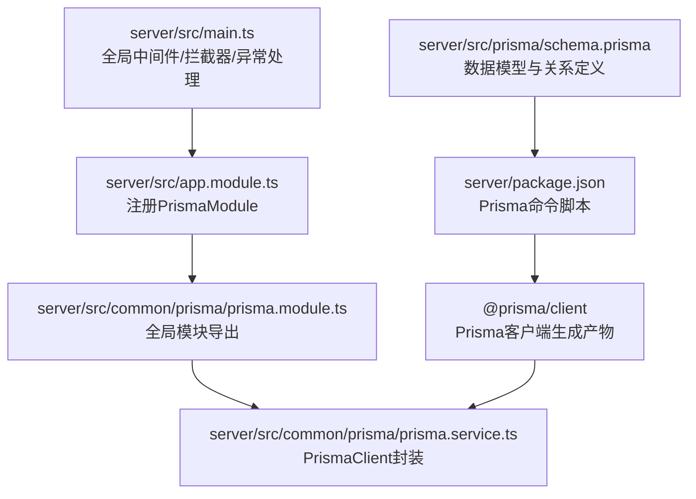
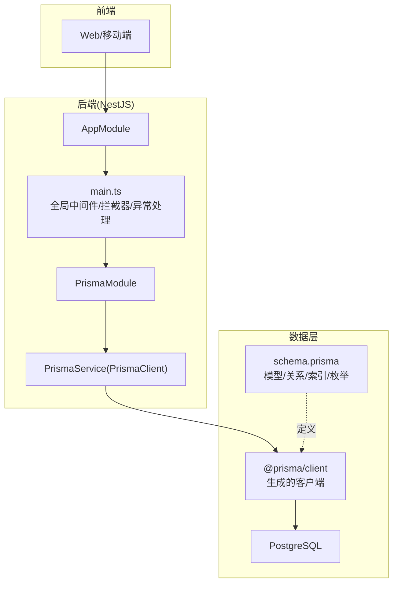
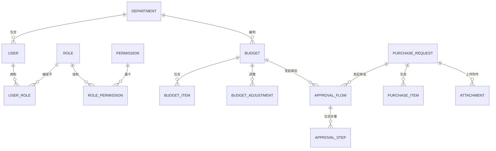
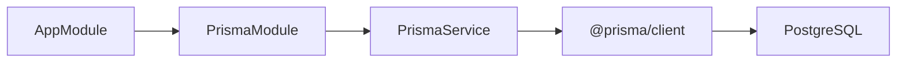

# Prisma数据模型

<cite>
**本文引用的文件**
- [schema.prisma](file://server/src/prisma/schema.prisma)
- [package.json](file://server/package.json)
- [prisma.module.ts](file://server/src/common/prisma/prisma.module.ts)
- [prisma.service.ts](file://server/src/common/prisma/prisma.service.ts)
- [app.module.ts](file://server/src/app.module.ts)
- [main.ts](file://server/src/main.ts)
</cite>

## 目录
1. [简介](#简介)
2. [项目结构](#项目结构)
3. [核心组件](#核心组件)
4. [架构总览](#架构总览)
5. [详细组件分析](#详细组件分析)
6. [依赖分析](#依赖分析)
7. [性能考量](#性能考量)
8. [故障排查指南](#故障排查指南)
9. [结论](#结论)
10. [附录](#附录)

## 简介
本文件面向预算管理系统的Prisma数据模型，围绕schema.prisma的结构与配置展开，系统性说明数据模型定义、字段类型与约束、实体关系映射（一对一、一对多、多对多）、Prisma客户端生成与查询API使用、数据验证与索引设计、性能优化策略、数据库迁移与版本管理、数据模型演进最佳实践、反范式化设计考虑，以及数据安全、访问控制与审计日志的设计要点。本文同时结合后端NestJS集成方式，帮助读者从“模型—生成—服务—应用”全链路理解Prisma在本项目中的落地。

## 项目结构
本项目的Prisma相关代码集中在后端工程中，核心位置如下：
- 模型定义：server/src/prisma/schema.prisma
- Prisma客户端生成脚本：server/package.json 中的 scripts
- NestJS集成：PrismaModule、PrismaService
- 应用入口与全局配置：AppModule、main.ts

图表来源
- [schema.prisma:1-448](file://server/src/prisma/schema.prisma#L1-L448)
- [package.json:1-96](file://server/package.json#L1-L96)
- [prisma.module.ts:1-10](file://server/src/common/prisma/prisma.module.ts#L1-L10)
- [prisma.service.ts:1-14](file://server/src/common/prisma/prisma.service.ts#L1-L14)
- [app.module.ts:1-26](file://server/src/app.module.ts#L1-L26)
- [main.ts:1-59](file://server/src/main.ts#L1-L59)

章节来源
- [schema.prisma:1-448](file://server/src/prisma/schema.prisma#L1-L448)
- [package.json:1-96](file://server/package.json#L1-L96)
- [prisma.module.ts:1-10](file://server/src/common/prisma/prisma.module.ts#L1-L10)
- [prisma.service.ts:1-14](file://server/src/common/prisma/prisma.service.ts#L1-L14)
- [app.module.ts:1-26](file://server/src/app.module.ts#L1-L26)
- [main.ts:1-59](file://server/src/main.ts#L1-L59)

## 核心组件
- 数据模型层：通过schema.prisma集中定义实体、字段、索引、关系与枚举，覆盖用户与权限、组织结构、预算管理、采购管理、工作流与审批、数据导入与三单关联、通知系统、审计日志、附件管理等业务域。
- Prisma客户端生成：通过package.json中的脚本生成强类型的Prisma客户端，供业务模块调用。
- NestJS集成：PrismaModule全局导出PrismaService，业务模块可直接注入使用；PrismaService继承PrismaClient并在模块生命周期内自动连接/断开数据库。
- 应用层配置：main.ts中启用全局验证管道、异常过滤器与拦截器，确保请求参数校验与统一响应格式，为Prisma查询提供稳定前置条件。

章节来源
- [schema.prisma:1-448](file://server/src/prisma/schema.prisma#L1-L448)
- [package.json:21-24](file://server/package.json#L21-L24)
- [prisma.module.ts:1-10](file://server/src/common/prisma/prisma.module.ts#L1-L10)
- [prisma.service.ts:1-14](file://server/src/common/prisma/prisma.service.ts#L1-L14)
- [app.module.ts:1-26](file://server/src/app.module.ts#L1-L26)
- [main.ts:24-37](file://server/src/main.ts#L24-L37)

## 架构总览
下图展示Prisma在预算管理系统中的端到端架构：前端通过API调用后端，后端使用Prisma进行数据持久化，Prisma基于schema.prisma的模型定义与索引设计实现高效查询与事务控制。

图表来源
- [schema.prisma:1-448](file://server/src/prisma/schema.prisma#L1-L448)
- [package.json:21-24](file://server/package.json#L21-L24)
- [prisma.module.ts:1-10](file://server/src/common/prisma/prisma.module.ts#L1-L10)
- [prisma.service.ts:1-14](file://server/src/common/prisma/prisma.service.ts#L1-L14)
- [app.module.ts:1-26](file://server/src/app.module.ts#L1-L26)
- [main.ts:1-59](file://server/src/main.ts#L1-L59)

## 详细组件分析

### 数据模型与字段类型
- 基础类型与约束
  - 字符串主键：多数实体使用String类型主键并通过默认uuid()生成。
  - 时间戳：普遍采用DateTime类型，使用@default(now())与@updatedAt自动维护创建与更新时间。
  - 数值精度：预算与采购金额使用Decimal类型，并通过@db.Decimal(18, 2)指定精度，确保财务数据准确性。
  - 可空与唯一：大量字段声明为可空或唯一，如用户名、邮箱、预算编号、采购编号、调整编号等，配合索引提升查询效率。
- 关系字段
  - 外键字段以实体名+Id形式命名，如departmentId、budgetId、requestId等，便于直观识别。
  - 关系声明通过fields与references绑定，支持级联删除（onDelete: Cascade）与可选关系（父节点、审批目标等）。
- 索引设计
  - 在高频查询列上建立索引，如用户表的username、email、departmentId；预算表的budgetNo、departmentId、year、status；采购请购单的requestNo、budgetId、status等。
  - 复合索引用于联合查询场景，如用户-角色多对多表的(userId, roleId)联合主键与索引。
- 枚举类型
  - 用户状态、部门状态、预算类型、预算状态、调整状态、采购状态、紧急度、审批状态与动作、匹配状态、通知类型等，均以枚举形式定义，保证数据一致性与可读性。

章节来源
- [schema.prisma:15-35](file://server/src/prisma/schema.prisma#L15-L35)
- [schema.prisma:84-103](file://server/src/prisma/schema.prisma#L84-L103)
- [schema.prisma:107-134](file://server/src/prisma/schema.prisma#L107-L134)
- [schema.prisma:178-200](file://server/src/prisma/schema.prisma#L178-L200)
- [schema.prisma:371-447](file://server/src/prisma/schema.prisma#L371-L447)

### 实体关系映射
- 一对一
  - 部门与用户：部门存在managerId与budgetAdminId外键，分别指向用户表，体现职责关系；一对一关系通过可空外键实现。
- 一对多
  - 部门-用户：Department.users一对多；Department-预算：Department.budgets一对多。
  - 预算-预算条目：Budget.items一对多；预算-调整：Budget.adjustments一对多；预算-审批流：Budget.approvals一对多。
  - 采购请购单-条目：PurchaseRequest.items一对多；采购请购单-附件：PurchaseRequest.attachments一对多。
  - 审批流-步骤：ApprovalFlow.steps一对多。
  - 用户-角色：User.roles一对多；角色-权限：Role.permissions一对多。
- 多对多
  - 用户-角色：User.roles与Role.users通过UserRole中间表实现多对多，联合主键(userId, roleId)，并为两列建立索引。
  - 角色-权限：Role.permissions与Permission.roles通过RolePermission中间表实现多对多，联合主键(roleId, permissionId)，并为两列建立索引。
- 自引用
  - 部门树形结构：Department.parent与Department.children通过parentId自引用，形成层级组织。

图表来源
- [schema.prisma:60-80](file://server/src/prisma/schema.prisma#L60-L80)
- [schema.prisma:107-134](file://server/src/prisma/schema.prisma#L107-L134)
- [schema.prisma:178-200](file://server/src/prisma/schema.prisma#L178-L200)
- [schema.prisma:233-264](file://server/src/prisma/schema.prisma#L233-L264)

章节来源
- [schema.prisma:60-80](file://server/src/prisma/schema.prisma#L60-L80)
- [schema.prisma:107-134](file://server/src/prisma/schema.prisma#L107-L134)
- [schema.prisma:178-200](file://server/src/prisma/schema.prisma#L178-L200)
- [schema.prisma:233-264](file://server/src/prisma/schema.prisma#L233-L264)

### Prisma客户端生成机制与查询API使用
- 生成机制
  - 通过package.json中的脚本执行prisma generate，生成@prisma/client，包含强类型模型与查询方法。
- 使用方式
  - 在NestJS中，通过PrismaModule全局导出PrismaService，业务模块注入后即可使用PrismaClient提供的CRUD与关系查询能力。
  - 生命周期：PrismaService在模块初始化时自动连接，在销毁时断开连接，避免资源泄漏。
- 查询API建议
  - 使用select与include精确控制返回字段与关系加载，减少不必要的网络传输与序列化开销。
  - 对高频查询使用索引列作为过滤条件，必要时组合where与orderBy提升查询性能。
  - 批量操作使用事务包裹，确保一致性与原子性。

章节来源
- [package.json:21-24](file://server/package.json#L21-L24)
- [prisma.module.ts:1-10](file://server/src/common/prisma/prisma.module.ts#L1-L10)
- [prisma.service.ts:1-14](file://server/src/common/prisma/prisma.service.ts#L1-L14)

### 数据验证规则
- 参数校验
  - 在main.ts中启用全局ValidationPipe，开启白名单与非白名单禁止，自动类型转换，降低脏数据进入数据库的风险。
- 模型约束
  - schema.prisma中通过@unique、@default、枚举类型等约束保证数据完整性与一致性。
- 业务规则
  - 金额字段使用Decimal并限定精度；状态字段使用枚举；时间戳字段自动维护；外键关系明确，避免悬挂引用。

章节来源
- [main.ts:24-31](file://server/src/main.ts#L24-L31)
- [schema.prisma:15-35](file://server/src/prisma/schema.prisma#L15-L35)
- [schema.prisma:107-134](file://server/src/prisma/schema.prisma#L107-L134)

### 索引设计与性能优化
- 索引策略
  - 为高频过滤与排序列建立单列索引，如用户表的username、email、departmentId；预算表的budgetNo、departmentId、year、status；采购请购单的requestNo、budgetId、status等。
  - 为多对多中间表建立联合主键与索引，如UserRole与RolePermission。
- 性能建议
  - 使用select精准投影，避免N+1查询；合理使用include与游标分页。
  - 对复杂查询使用事务隔离级别与超时控制，避免长事务阻塞。
  - 定期分析慢查询日志，针对性补充索引或重构查询。

章节来源
- [schema.prisma:32-35](file://server/src/prisma/schema.prisma#L32-L35)
- [schema.prisma:46-47](file://server/src/prisma/schema.prisma#L46-L47)
- [schema.prisma:130-134](file://server/src/prisma/schema.prisma#L130-L134)
- [schema.prisma:197-200](file://server/src/prisma/schema.prisma#L197-L200)
- [schema.prisma:66-69](file://server/src/prisma/schema.prisma#L66-L69)
- [schema.prisma:77-80](file://server/src/prisma/schema.prisma#L77-L80)

### 数据库迁移流程与版本管理
- 迁移命令
  - 通过package.json中的脚本执行prisma migrate dev进行开发环境迁移，生成迁移文件并同步数据库结构。
- 版本管理
  - 迁移文件记录结构变更历史，建议每次模型改动后提交迁移文件与注释，保持团队协作一致。
- 最佳实践
  - 在生产环境使用prisma migrate deploy进行受控部署；对破坏性变更先在测试环境验证。
  - 对大表变更采用在线DDL策略或分批处理，避免长时间锁表。

章节来源
- [package.json:22-24](file://server/package.json#L22-L24)

### 数据模型演进最佳实践与反范式化考虑
- 演进原则
  - 优先向后兼容：新增字段使用可空，避免破坏既有查询；对枚举扩展遵循向后兼容。
  - 渐进式迁移：通过视图或计算列过渡旧数据结构，逐步替换。
  - 变更追踪：在审计日志中记录模型版本与迁移元数据，便于回溯。
- 反范式化
  - 对高读低写场景可适度冗余关键字段（如预算余额、状态），配合定时任务或触发器保持一致性。
  - 对热点报表聚合数据可引入物化视图或汇总表，减少实时计算成本。

[本节为通用指导，无需特定文件引用]

### 数据安全、访问控制与审计日志
- 数据安全
  - 密码字段使用哈希存储；敏感字段（如手机号、邮箱）在传输与存储层面加强加密。
- 访问控制
  - 用户-角色-权限三层体系：通过RolePermission将权限分配给角色，再由UserRole赋予用户，实现最小权限原则。
- 审计日志
  - AuditLog记录用户行为、模块、目标对象、IP与UA等信息，支持合规追溯与安全审计。

章节来源
- [schema.prisma:15-35](file://server/src/prisma/schema.prisma#L15-L35)
- [schema.prisma:37-58](file://server/src/prisma/schema.prisma#L37-L58)
- [schema.prisma:334-351](file://server/src/prisma/schema.prisma#L334-L351)

## 依赖分析
- 模块耦合
  - AppModule仅导入PrismaModule，PrismaModule提供PrismaService，业务模块通过依赖注入使用，降低耦合度。
- 外部依赖
  - @prisma/client为运行时依赖，负责类型安全的数据库访问；prisma为开发时依赖，负责生成客户端与迁移。
- 集成点
  - PrismaService继承PrismaClient，贯穿应用生命周期；main.ts中的全局中间件为Prisma查询提供统一前置条件。

图表来源
- [app.module.ts:1-26](file://server/src/app.module.ts#L1-L26)
- [prisma.module.ts:1-10](file://server/src/common/prisma/prisma.module.ts#L1-L10)
- [prisma.service.ts:1-14](file://server/src/common/prisma/prisma.service.ts#L1-L14)
- [package.json:36-70](file://server/package.json#L36-L70)

章节来源
- [app.module.ts:1-26](file://server/src/app.module.ts#L1-L26)
- [prisma.module.ts:1-10](file://server/src/common/prisma/prisma.module.ts#L1-L10)
- [prisma.service.ts:1-14](file://server/src/common/prisma/prisma.service.ts#L1-L14)
- [package.json:36-70](file://server/package.json#L36-L70)

## 性能考量
- 查询优化
  - 优先使用索引列过滤；避免SELECT *，使用select精准投影；对关联查询使用include并限制深度。
- 写入优化
  - 批量插入/更新使用事务；对高并发场景使用乐观锁或版本号字段。
- 缓存策略
  - 对静态配置与只读数据引入缓存；对热点读取引入Redis缓存层。
- 监控与诊断
  - 开启慢查询日志与数据库性能指标监控，定期审查索引使用情况。

[本节为通用指导，无需特定文件引用]

## 故障排查指南
- 连接问题
  - 确认DATABASE_URL环境变量正确；检查PostgreSQL服务状态；确认PrismaService在模块初始化时已连接。
- 生成失败
  - 确保prisma与@prisma/client版本兼容；清理node_modules后重新安装；检查schema.prisma语法与枚举定义。
- 查询异常
  - 检查全局ValidationPipe是否过滤了非法字段；核对关系字段与索引是否存在；对复杂查询添加事务与超时控制。
- 审计与日志
  - 审计日志缺失时检查AuditLog写入逻辑与数据库权限；关注异常过滤器是否拦截了关键错误。

章节来源
- [prisma.service.ts:6-12](file://server/src/common/prisma/prisma.service.ts#L6-L12)
- [main.ts:24-37](file://server/src/main.ts#L24-L37)
- [schema.prisma:334-351](file://server/src/prisma/schema.prisma#L334-L351)

## 结论
本项目的Prisma数据模型以清晰的领域划分与严谨的约束设计为基础，结合NestJS的模块化架构与Prisma客户端生成机制，实现了从模型定义到查询执行的完整闭环。通过合理的索引设计、事务与批量操作策略、以及完善的审计日志与访问控制，系统在功能完备性与运行稳定性方面具备良好基础。后续演进建议持续关注查询性能、模型演进的向后兼容性与反范式化的平衡点。

[本节为总结性内容，无需特定文件引用]

## 附录
- 快速命令
  - 生成客户端：npm run prisma:generate
  - 开发迁移：npm run prisma:migrate
  - 启动Studio：npm run prisma:studio
- 建议流程
  - 新增字段：先在schema.prisma中定义，执行迁移，再在业务层使用；对破坏性变更先在测试环境验证。

章节来源
- [package.json:21-24](file://server/package.json#L21-L24)