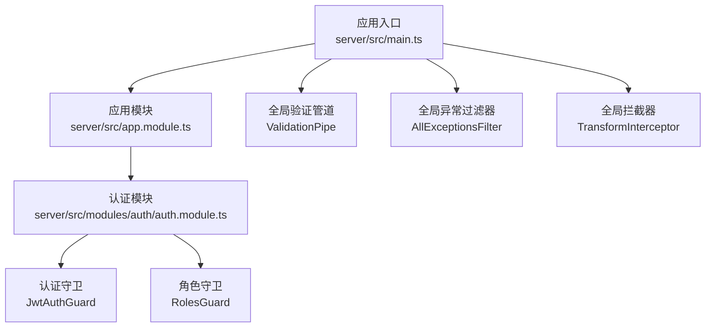
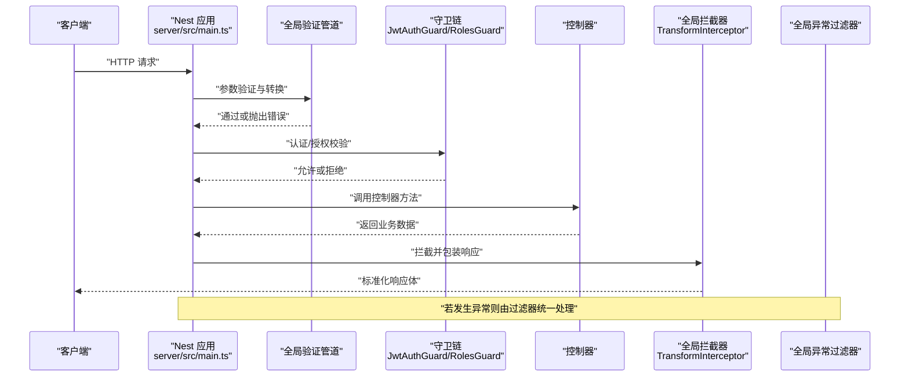
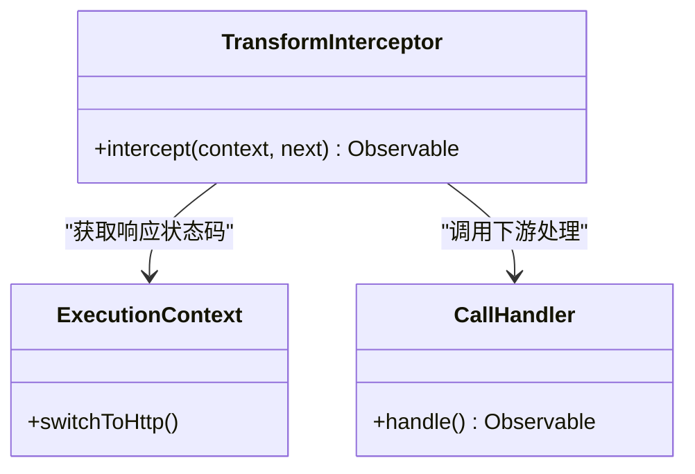
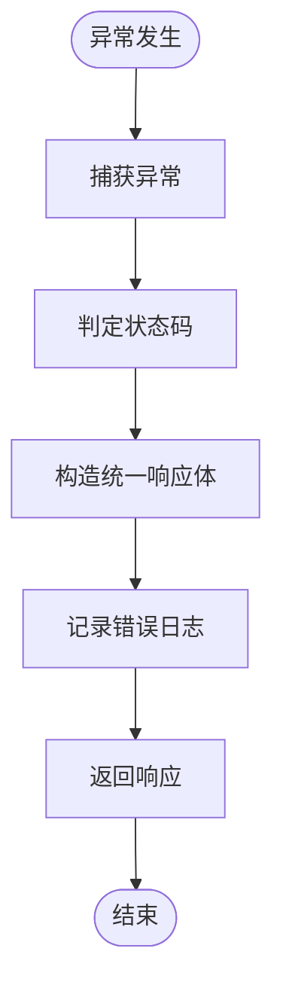
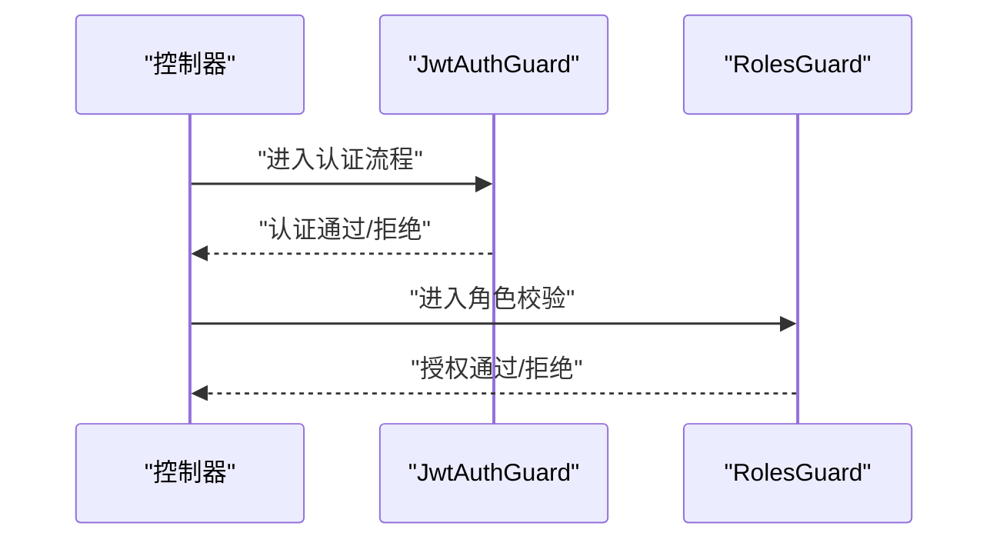
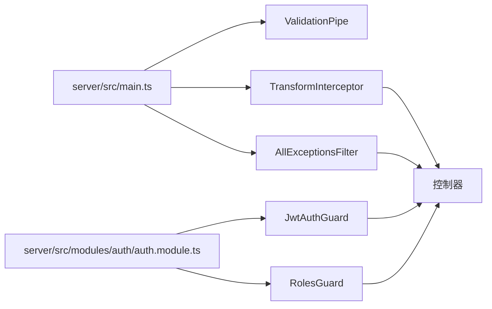

# 中间件与拦截器

<cite>
**本文引用的文件**
- [server/src/main.ts](file://server/src/main.ts)
- [server/src/app.module.ts](file://server/src/app.module.ts)
- [server/src/common/interceptors/transform.interceptor.ts](file://server/src/common/interceptors/transform.interceptor.ts)
- [server/src/common/filters/all-exceptions.filter.ts](file://server/src/common/filters/all-exceptions.filter.ts)
- [server/src/modules/auth/auth.module.ts](file://server/src/modules/auth/auth.module.ts)
- [server/src/modules/auth/guards/jwt-auth.guard.ts](file://server/src/modules/auth/guards/jwt-auth.guard.ts)
- [server/src/modules/auth/guards/roles.guard.ts](file://server/src/modules/auth/guards/roles.guard.ts)
</cite>

## 目录
1. [简介](#简介)
2. [项目结构](#项目结构)
3. [核心组件](#核心组件)
4. [架构总览](#架构总览)
5. [详细组件分析](#详细组件分析)
6. [依赖关系分析](#依赖关系分析)
7. [性能考量](#性能考量)
8. [故障排查指南](#故障排查指南)
9. [结论](#结论)
10. [附录](#附录)

## 简介
本文件面向预算管理系统的后端（NestJS）中间件与拦截器主题，系统性说明以下内容：
- 请求生命周期与执行顺序：请求预处理、路由匹配、响应后处理
- 拦截器功能与场景：统一响应包装、日志记录、异常转换
- 管道（Pipes）在数据验证与转换中的作用：内置 ValidationPipe 的全局配置
- 守卫（Guards）在权限控制中的应用：认证守卫与角色守卫
- 性能监控、请求追踪与错误处理的实现思路与最佳实践
- 中间件链的组合使用与落地建议

## 项目结构
后端采用 NestJS 标准分层与模块化组织，关键位置如下：
- 应用入口与全局配置：server/src/main.ts
- 应用模块聚合：server/src/app.module.ts
- 全局拦截器：server/src/common/interceptors/transform.interceptor.ts
- 全局异常过滤器：server/src/common/filters/all-exceptions.filter.ts
- 认证与授权模块：server/src/modules/auth/*
  - 认证守卫：server/src/modules/auth/guards/jwt-auth.guard.ts
  - 角色守卫：server/src/modules/auth/guards/roles.guard.ts
  - JWT 模块与策略：server/src/modules/auth/auth.module.ts

图表来源
- [server/src/main.ts:1-59](file://server/src/main.ts#L1-L59)
- [server/src/app.module.ts:1-28](file://server/src/app.module.ts#L1-L28)
- [server/src/common/interceptors/transform.interceptor.ts:1-25](file://server/src/common/interceptors/transform.interceptor.ts#L1-L25)
- [server/src/common/filters/all-exceptions.filter.ts:1-32](file://server/src/common/filters/all-exceptions.filter.ts#L1-L32)
- [server/src/modules/auth/auth.module.ts:1-32](file://server/src/modules/auth/auth.module.ts#L1-L32)
- [server/src/modules/auth/guards/jwt-auth.guard.ts:1-6](file://server/src/modules/auth/guards/jwt-auth.guard.ts#L1-L6)
- [server/src/modules/auth/guards/roles.guard.ts:1-33](file://server/src/modules/auth/guards/roles.guard.ts#L1-L33)

章节来源
- [server/src/main.ts:1-59](file://server/src/main.ts#L1-L59)
- [server/src/app.module.ts:1-28](file://server/src/app.module.ts#L1-L28)

## 核心组件
- 全局验证管道（ValidationPipe）
  - 功能：白名单过滤、非白名单字段禁止、自动类型转换
  - 配置位置：server/src/main.ts
- 全局异常过滤器（AllExceptionsFilter）
  - 功能：统一捕获异常并返回标准化响应体
  - 配置位置：server/src/main.ts
- 全局拦截器（TransformInterceptor）
  - 功能：将控制器返回的数据包装为统一响应结构
  - 配置位置：server/src/main.ts
- 认证守卫（JwtAuthGuard）
  - 功能：基于 JWT 的认证校验
  - 实现位置：server/src/modules/auth/guards/jwt-auth.guard.ts
- 角色守卫（RolesGuard）
  - 功能：基于反射读取所需角色并校验用户角色集合
  - 实现位置：server/src/modules/auth/guards/roles.guard.ts
- 认证模块（AuthModule）
  - 功能：整合 Passport、JWT、策略与控制器
  - 实现位置：server/src/modules/auth/auth.module.ts

章节来源
- [server/src/main.ts:24-37](file://server/src/main.ts#L24-L37)
- [server/src/common/interceptors/transform.interceptor.ts:12-24](file://server/src/common/interceptors/transform.interceptor.ts#L12-L24)
- [server/src/common/filters/all-exceptions.filter.ts:4-31](file://server/src/common/filters/all-exceptions.filter.ts#L4-L31)
- [server/src/modules/auth/guards/jwt-auth.guard.ts:1-6](file://server/src/modules/auth/guards/jwt-auth.guard.ts#L1-L6)
- [server/src/modules/auth/guards/roles.guard.ts:7-31](file://server/src/modules/auth/guards/roles.guard.ts#L7-L31)
- [server/src/modules/auth/auth.module.ts:12-31](file://server/src/modules/auth/auth.module.ts#L12-L31)

## 架构总览
下图展示请求从进入应用到返回响应的关键路径，以及各中间件/拦截器/守卫的参与点。

图表来源
- [server/src/main.ts:24-37](file://server/src/main.ts#L24-L37)
- [server/src/common/interceptors/transform.interceptor.ts:12-24](file://server/src/common/interceptors/transform.interceptor.ts#L12-L24)
- [server/src/common/filters/all-exceptions.filter.ts:4-31](file://server/src/common/filters/all-exceptions.filter.ts#L4-L31)
- [server/src/modules/auth/guards/jwt-auth.guard.ts:1-6](file://server/src/modules/auth/guards/jwt-auth.guard.ts#L1-L6)
- [server/src/modules/auth/guards/roles.guard.ts:7-31](file://server/src/modules/auth/guards/roles.guard.ts#L7-L31)

## 详细组件分析

### 全局拦截器：TransformInterceptor
- 职责
  - 在响应阶段对控制器返回的数据进行统一包装，附加状态码、消息、时间戳等信息
  - 通过 RxJS 的 map 操作符实现“后处理”
- 关键点
  - 使用 ExecutionContext 获取响应状态码
  - 将原始数据包裹为统一结构体
- 适用场景
  - 统一前端响应格式
  - 便于前端一致处理成功/失败状态

图表来源
- [server/src/common/interceptors/transform.interceptor.ts:12-24](file://server/src/common/interceptors/transform.interceptor.ts#L12-L24)

章节来源
- [server/src/common/interceptors/transform.interceptor.ts:12-24](file://server/src/common/interceptors/transform.interceptor.ts#L12-L24)

### 全局异常过滤器：AllExceptionsFilter
- 职责
  - 捕获所有未处理异常，输出统一结构的错误响应
  - 区分 HttpException 与内部错误，设置相应状态码
- 关键点
  - 使用 ArgumentsHost 切换到 HTTP 上下文
  - 输出包含路径、时间戳等上下文信息
- 适用场景
  - 统一错误输出，避免泄露内部细节
  - 便于前端统一提示与埋点

图表来源
- [server/src/common/filters/all-exceptions.filter.ts:4-31](file://server/src/common/filters/all-exceptions.filter.ts#L4-L31)

章节来源
- [server/src/common/filters/all-exceptions.filter.ts:4-31](file://server/src/common/filters/all-exceptions.filter.ts#L4-L31)

### 全局验证管道：ValidationPipe
- 职责
  - 在进入控制器前对请求体/查询参数/路径参数进行校验与清洗
  - 支持自动类型转换与白名单策略
- 关键点
  - 全局启用，无需在每个控制器/参数上重复声明
  - 结合 DTO 使用效果更佳
- 适用场景
  - 输入数据规范化与安全防护
  - 快速构建健壮的 API

章节来源
- [server/src/main.ts:24-31](file://server/src/main.ts#L24-L31)

### 守卫：JwtAuthGuard 与 RolesGuard
- JwtAuthGuard
  - 基于 @nestjs/passport 的 JWT 策略，负责认证
  - 可在控制器或方法上启用
- RolesGuard
  - 通过 Reflector 读取装饰器标记的角色列表
  - 校验当前用户是否具备所需角色之一
- 组合使用
  - 先 JwtAuthGuard 认证，再 RolesGuard 校验角色
  - 可配合装饰器在控制器/方法上声明所需角色

图表来源
- [server/src/modules/auth/guards/jwt-auth.guard.ts:1-6](file://server/src/modules/auth/guards/jwt-auth.guard.ts#L1-L6)
- [server/src/modules/auth/guards/roles.guard.ts:7-31](file://server/src/modules/auth/guards/roles.guard.ts#L7-L31)

章节来源
- [server/src/modules/auth/guards/jwt-auth.guard.ts:1-6](file://server/src/modules/auth/guards/jwt-auth.guard.ts#L1-L6)
- [server/src/modules/auth/guards/roles.guard.ts:7-31](file://server/src/modules/auth/guards/roles.guard.ts#L7-L31)

### 认证模块：AuthModule
- 职责
  - 注册 Passport、JWT 模块
  - 提供策略（本地/JWT）、服务与控制器
- 关键点
  - JWT 配置通过异步工厂注入 ConfigService
  - 导出 AuthService 供其他模块使用

章节来源
- [server/src/modules/auth/auth.module.ts:12-31](file://server/src/modules/auth/auth.module.ts#L12-L31)

## 依赖关系分析
- 全局配置集中于应用入口，确保一致性与可维护性
- 拦截器与过滤器属于“横切关注点”，对所有路由生效
- 守卫按需在控制器/方法上启用，形成细粒度的权限控制

图表来源
- [server/src/main.ts:24-37](file://server/src/main.ts#L24-L37)
- [server/src/common/interceptors/transform.interceptor.ts:12-24](file://server/src/common/interceptors/transform.interceptor.ts#L12-L24)
- [server/src/common/filters/all-exceptions.filter.ts:4-31](file://server/src/common/filters/all-exceptions.filter.ts#L4-L31)
- [server/src/modules/auth/auth.module.ts:12-31](file://server/src/modules/auth/auth.module.ts#L12-L31)
- [server/src/modules/auth/guards/jwt-auth.guard.ts:1-6](file://server/src/modules/auth/guards/jwt-auth.guard.ts#L1-L6)
- [server/src/modules/auth/guards/roles.guard.ts:7-31](file://server/src/modules/auth/guards/roles.guard.ts#L7-L31)

章节来源
- [server/src/main.ts:24-37](file://server/src/main.ts#L24-L37)
- [server/src/common/interceptors/transform.interceptor.ts:12-24](file://server/src/common/interceptors/transform.interceptor.ts#L12-L24)
- [server/src/common/filters/all-exceptions.filter.ts:4-31](file://server/src/common/filters/all-exceptions.filter.ts#L4-L31)
- [server/src/modules/auth/auth.module.ts:12-31](file://server/src/modules/auth/auth.module.ts#L12-L31)
- [server/src/modules/auth/guards/jwt-auth.guard.ts:1-6](file://server/src/modules/auth/guards/jwt-auth.guard.ts#L1-L6)
- [server/src/modules/auth/guards/roles.guard.ts:7-31](file://server/src/modules/auth/guards/roles.guard.ts#L7-L31)

## 性能考量
- 全局拦截器与过滤器的开销较低，但应避免在拦截器中执行重 IO 或阻塞操作
- ValidationPipe 的 transform 会带来一定 CPU 开销，建议仅在必要时开启
- 守卫应尽量轻量，避免在守卫中做数据库查询；如需复杂逻辑，考虑在服务层或拦截器中处理
- 对高频接口可结合缓存与限流策略，减少重复计算与外部依赖

## 故障排查指南
- 统一错误输出
  - 若出现未捕获异常，请检查全局异常过滤器是否正确注册
  - 章节来源: [server/src/main.ts:33-34](file://server/src/main.ts#L33-L34), [server/src/common/filters/all-exceptions.filter.ts:4-31](file://server/src/common/filters/all-exceptions.filter.ts#L4-L31)
- 响应格式不统一
  - 确认全局拦截器已启用且未被局部覆盖
  - 章节来源: [server/src/main.ts:36-37](file://server/src/main.ts#L36-L37), [server/src/common/interceptors/transform.interceptor.ts:12-24](file://server/src/common/interceptors/transform.interceptor.ts#L12-L24)
- 参数校验失败
  - 检查 ValidationPipe 的配置与 DTO 是否匹配
  - 章节来源: [server/src/main.ts:24-31](file://server/src/main.ts#L24-L31)
- 权限拒绝
  - 确认 JwtAuthGuard 已启用且 Token 有效
  - 确认 RolesGuard 所需角色已在用户信息中设置
  - 章节来源: [server/src/modules/auth/guards/jwt-auth.guard.ts:1-6](file://server/src/modules/auth/guards/jwt-auth.guard.ts#L1-L6), [server/src/modules/auth/guards/roles.guard.ts:7-31](file://server/src/modules/auth/guards/roles.guard.ts#L7-L31)

## 结论
本项目通过全局管道、拦截器与过滤器实现了输入规范化、统一响应与异常兜底；通过守卫实现了认证与授权的分层控制。建议在后续迭代中：
- 明确区分“请求预处理”（管道/拦截器）与“响应后处理”（拦截器/过滤器）
- 将日志与追踪纳入拦截器或专用中间件，避免侵入业务代码
- 对高频接口引入缓存与限流，提升整体吞吐与稳定性

## 附录
- 最佳实践清单
  - 将通用逻辑放入全局拦截器/过滤器，避免重复代码
  - 将认证与授权拆分为独立守卫，便于组合与复用
  - 使用 DTO 与 ValidationPipe 进行输入约束，开启 transform 时注意性能
  - 错误处理统一由过滤器承担，控制器专注业务
  - 日志与追踪建议在拦截器中完成，便于统一埋点与审计