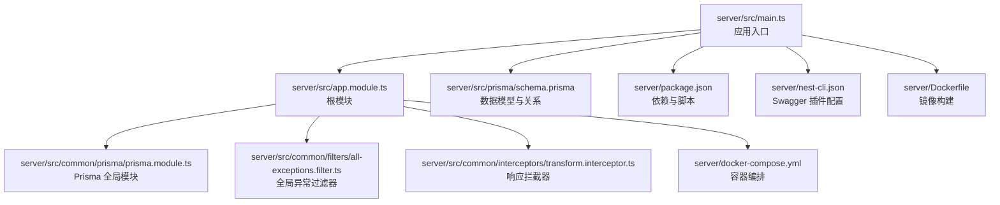
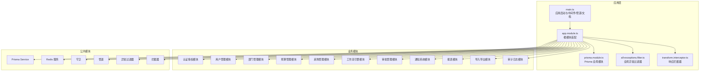
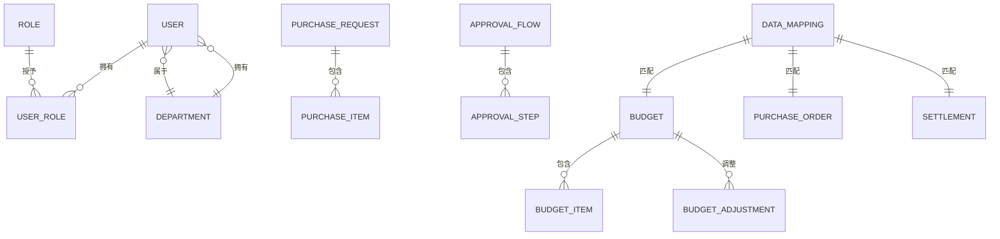
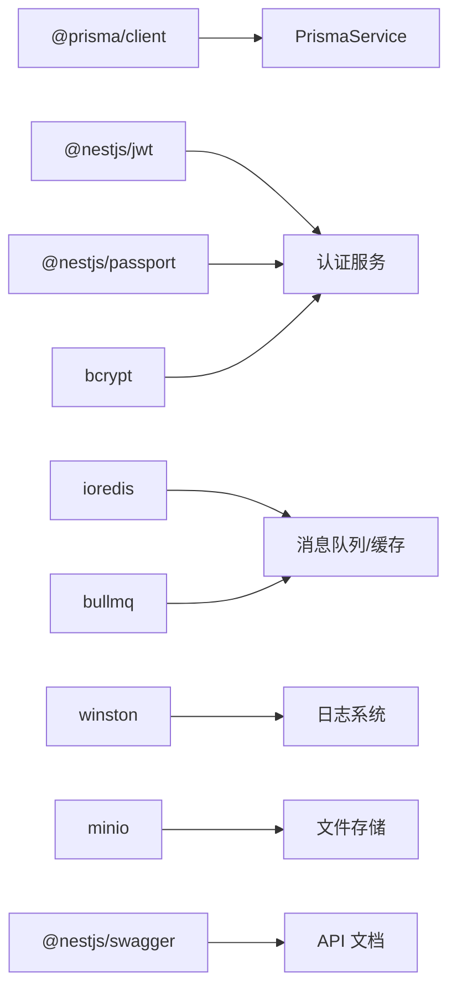

# 后端架构

<cite>
**本文引用的文件**
- [main.ts](file://server/src/main.ts)
- [app.module.ts](file://server/src/app.module.ts)
- [prisma.module.ts](file://server/src/common/prisma/prisma.module.ts)
- [prisma.service.ts](file://server/src/common/prisma/prisma.service.ts)
- [all-exceptions.filter.ts](file://server/src/common/filters/all-exceptions.filter.ts)
- [transform.interceptor.ts](file://server/src/common/interceptors/transform.interceptor.ts)
- [schema.prisma](file://server/src/prisma/schema.prisma)
- [package.json](file://server/package.json)
- [nest-cli.json](file://server/nest-cli.json)
- [docker-compose.yml](file://server/docker-compose.yml)
- [Dockerfile](file://server/Dockerfile)
</cite>

## 目录
1. [引言](#引言)
2. [项目结构](#项目结构)
3. [核心组件](#核心组件)
4. [架构总览](#架构总览)
5. [详细组件分析](#详细组件分析)
6. [依赖分析](#依赖分析)
7. [性能考虑](#性能考虑)
8. [故障排查指南](#故障排查指南)
9. [结论](#结论)
10. [附录](#附录)

## 引言
本文件面向预算管理系统的后端架构，基于完整的 NestJS 10 + Prisma + PostgreSQL 实现，系统性阐述模块化设计、中间件拦截器、服务层设计等核心架构要素。文档涵盖应用模块组织方式、依赖注入机制、控制器-服务-仓储分层架构、Prisma ORM 数据模型设计、认证授权机制、中间件拦截器管道使用模式、RESTful API 设计规范与统一错误处理策略，并提供数据库设计原则与性能优化建议。

## 项目结构
后端采用 NestJS 10 标准工程布局，核心入口位于 server/src，根模块负责装配公共模块与业务模块；Prisma Schema 位于 server/src/prisma，统一定义实体、关系与枚举；项目包含完整的异常过滤器、拦截器等基础设施模块。

**图表来源**
- [main.ts:1-59](file://server/src/main.ts#L1-L59)
- [app.module.ts:1-44](file://server/src/app.module.ts#L1-L44)
- [prisma.module.ts:1-10](file://server/src/common/prisma/prisma.module.ts#L1-L10)
- [all-exceptions.filter.ts:1-32](file://server/src/common/filters/all-exceptions.filter.ts#L1-L32)
- [transform.interceptor.ts:1-25](file://server/src/common/interceptors/transform.interceptor.ts#L1-L25)
- [schema.prisma:1-448](file://server/src/prisma/schema.prisma#L1-L448)

**章节来源**
- [main.ts:1-59](file://server/src/main.ts#L1-L59)
- [app.module.ts:1-44](file://server/src/app.module.ts#L1-L44)
- [prisma.module.ts:1-10](file://server/src/common/prisma/prisma.module.ts#L1-L10)
- [all-exceptions.filter.ts:1-32](file://server/src/common/filters/all-exceptions.filter.ts#L1-L32)
- [transform.interceptor.ts:1-25](file://server/src/common/interceptors/transform.interceptor.ts#L1-L25)
- [schema.prisma:1-448](file://server/src/prisma/schema.prisma#L1-L448)

## 核心组件
- **根模块（AppModule）**
  - 负责装配全局配置模块、公共模块与业务模块，采用模块化架构实现功能解耦
  - 集成 PrismaModule 作为全局数据访问层，确保各业务模块可直接使用
- **应用入口（main.ts）**
  - 初始化 Nest 应用工厂，启用 CORS、设置全局前缀、注册全局验证管道
  - 集成 Swagger 文档、全局异常过滤器和响应拦截器，提供完整的 API 开发体验
- **Prisma 全局模块**
  - 通过 @Global() 装饰器将 PrismaService 注册为全局单例，避免重复注入
  - 提供统一的数据访问抽象层，支持事务处理和查询优化
- **异常处理与响应包装**
  - 全局异常过滤器统一处理所有未捕获异常
  - 响应拦截器标准化 API 响应格式，提升前端处理一致性

**章节来源**
- [app.module.ts:17-42](file://server/src/app.module.ts#L17-L42)
- [main.ts:9-58](file://server/src/main.ts#L9-L58)
- [prisma.module.ts:1-10](file://server/src/common/prisma/prisma.module.ts#L1-L10)
- [all-exceptions.filter.ts:4-31](file://server/src/common/filters/all-exceptions.filter.ts#L4-L31)
- [transform.interceptor.ts:12-24](file://server/src/common/interceptors/transform.interceptor.ts#L12-L24)

## 架构总览
系统采用完整的模块化架构，遵循"根模块装配、业务模块解耦、公共模块复用"的设计原则。整体交互架构如下：

**图表来源**
- [app.module.ts:17-42](file://server/src/app.module.ts#L17-L42)
- [prisma.module.ts:1-10](file://server/src/common/prisma/prisma.module.ts#L1-L10)
- [all-exceptions.filter.ts:4-31](file://server/src/common/filters/all-exceptions.filter.ts#L4-L31)
- [transform.interceptor.ts:12-24](file://server/src/common/interceptors/transform.interceptor.ts#L12-L24)

## 详细组件分析

### 1) 模块化与装配策略
- **根模块装配**
  - 使用 ConfigModule.forRoot 加载环境变量，标记为全局可用
  - 业务模块与公共模块均已完成实际实现，而非仅占位注释
- **业务模块职责划分**
  - 认证授权：用户登录、角色权限、JWT 签发与校验
  - 用户管理：用户信息维护、状态管理
  - 部门管理：组织架构、树形结构、负责人与预算管理员
  - 预算管理：预算编制、预算项、预算调整、版本控制
  - 采购管理：采购申请、明细、金额与状态
  - 工作流引擎：模板、审批步骤、并行/串行控制
  - 审批管理：审批流实例、步骤执行、结果记录
  - 通知系统：站内信、邮件、微信等多通道推送
  - 导入导出：三单（预算、订单、结算）映射与对账
  - 报表与分析：汇总统计、趋势分析、预警
  - 审计日志：操作轨迹、IP/User-Agent 记录
- **公共模块职责划分**
  - Prisma 服务：数据访问抽象、事务封装、查询优化
  - Redis 服务：会话缓存、限流、分布式锁
  - 守卫：鉴权与授权前置校验
  - 拦截器：统一响应包装、性能监控、请求追踪
  - 管道：参数校验与类型转换
  - 异常过滤器：统一错误响应与日志输出

**章节来源**
- [app.module.ts:17-42](file://server/src/app.module.ts#L17-L42)

### 2) 控制器-服务-仓储分层架构
- **分层职责**
  - 控制器：接收请求、参数绑定、调用服务、返回响应
  - 服务：业务编排、领域逻辑、调用仓储与外部服务
  - 仓储：数据访问、查询构建、事务与批量操作
- **依赖注入**
  - 通过 NestJS 依赖注入容器自动注入服务与公共模块
  - PrismaService 通过全局模块注入，避免在控制器直接操作数据层
- **错误处理**
  - 在服务层抛出业务异常，在拦截器或异常过滤器中统一包装响应

**章节来源**
- [prisma.module.ts:1-10](file://server/src/common/prisma/prisma.module.ts#L1-L10)

### 3) Prisma ORM 数据模型设计
- **实体关系概览**
  - 用户与部门：多对一关系，用户属于部门，部门拥有多个用户
  - 角色与权限：多对多关系，角色可分配多个权限，用户可通过 UserRole 关联多个角色
  - 预算与预算项：一对多关系，预算包含多个预算项
  - 预算调整：预算与其历史版本/调整记录关联
  - 采购申请与明细：一对多关系，采购包含多个明细
  - 审批流：与目标对象（预算/采购/调整）多态关联，步骤有序排列
  - 三单映射：预算、订单、结算之间的匹配与差异记录
  - 通知与审计：分别记录系统事件与用户行为轨迹
- **数据验证与查询优化**
  - 使用索引字段（如唯一键、外键、状态、时间戳）加速查询
  - 使用 Decimal(18,2) 存储金额，保证精度与一致性
  - 使用 JSON 字段存储动态配置（如月度计划、步骤定义），兼顾灵活性与查询限制
- **枚举与状态机**
  - 通过枚举约束状态流转（预算状态、审批状态、采购状态等），减少非法状态
  - 为每个实体提供 createdAt/updatedAt，便于排序与审计

**图表来源**
- [schema.prisma:15-35](file://server/src/prisma/schema.prisma#L15-L35)
- [schema.prisma:84-103](file://server/src/prisma/schema.prisma#L84-L103)
- [schema.prisma:107-134](file://server/src/prisma/schema.prisma#L107-L134)
- [schema.prisma:159-174](file://server/src/prisma/schema.prisma#L159-L174)
- [schema.prisma:178-200](file://server/src/prisma/schema.prisma#L178-L200)
- [schema.prisma:202-216](file://server/src/prisma/schema.prisma#L202-L216)
- [schema.prisma:233-264](file://server/src/prisma/schema.prisma#L233-L264)
- [schema.prisma:300-313](file://server/src/prisma/schema.prisma#L300-L313)
- [schema.prisma:268-282](file://server/src/prisma/schema.prisma#L268-L282)
- [schema.prisma:284-298](file://server/src/prisma/schema.prisma#L284-L298)

**章节来源**
- [schema.prisma:13-448](file://server/src/prisma/schema.prisma#L13-L448)

### 4) 认证授权机制（JWT + Passport）
- **令牌处理**
  - 使用 @nestjs/jwt 与 passport-jwt 实现 JWT 签发与解析，支持 Bearer Token 方案
  - 登录成功后签发 JWT，客户端在后续请求头携带 Authorization: Bearer <token>
- **Passport 集成**
  - 结合 @nestjs/passport 与 passport-local 实现本地用户名密码认证
  - 通过自定义策略（LocalStrategy/JwtStrategy）完成身份校验与用户上下文注入
- **权限控制策略**
  - 基于角色与权限的 RBAC：用户-角色-权限三层映射，支持细粒度访问控制
  - 守卫用于路由级授权，管道用于参数与业务规则校验，拦截器用于统一响应包装
- **会话与安全**
  - 建议结合 Redis 存储刷新令牌与会话信息，实现安全的令牌轮换与登出机制

**章节来源**
- [package.json:1-96](file://server/package.json#L1-L96)

### 5) 中间件、拦截器与管道
- **中间件**
  - CORS 已在入口处启用，支持跨域与凭证传递
- **拦截器**
  - 响应拦截器实现统一响应包装，输出 code/message/data/timestamp 格式
  - 可扩展性能监控拦截器，记录请求耗时与追踪 ID
- **管道**
  - 全局 ValidationPipe 已启用，强制白名单与类型转换，减少脏数据进入业务层
  - 可扩展 DTO 校验管道与分页参数管道，统一参数处理

**章节来源**
- [main.ts:15-37](file://server/src/main.ts#L15-L37)
- [transform.interceptor.ts:12-24](file://server/src/common/interceptors/transform.interceptor.ts#L12-L24)

### 6) RESTful API 设计规范
- **资源命名与方法**
  - GET /api/resource 列表、GET /api/resource/:id 详情、POST /api/resource 创建、PUT /api/resource/:id 更新、DELETE /api/resource/:id 删除
- **统一响应格式**
  - code、message、data、timestamp 四要素，便于前端统一处理
- **分页参数**
  - page、pageSize、sortBy、sortOrder 标准化分页与排序
- **错误码约定**
  - 建议定义业务错误码与通用错误码，配合国际化消息

**章节来源**
- [transform.interceptor.ts:14-21](file://server/src/common/interceptors/transform.interceptor.ts#L14-L21)

### 7) 错误处理策略
- **异常过滤器**
  - 全局异常过滤器捕获业务异常与系统异常，输出统一格式与日志
- **日志与审计**
  - 使用 console.error 输出结构化日志，审计日志记录关键操作与变更
- **事务与回滚**
  - 对复杂写操作使用 Prisma 事务，失败时自动回滚，保证数据一致性

**章节来源**
- [all-exceptions.filter.ts:4-31](file://server/src/common/filters/all-exceptions.filter.ts#L4-L31)

## 依赖分析
- **外部依赖**
  - NestJS 生态：@nestjs/config、@nestjs/swagger、@nestjs/jwt、@nestjs/passport
  - 安全与加密：bcrypt、passport-jwt、passport-local
  - 数据与缓存：@prisma/client、ioredis、bullmq
  - 工具与日志：class-validator、class-transformer、reflect-metadata、winston
  - 文件与对象存储：minio、exceljs
- **内部模块耦合**
  - 根模块仅作为装配中心，业务模块之间低耦合，通过公共模块与服务接口交互
  - PrismaModule 通过 @Global() 装饰器实现全局注入，避免循环依赖

**图表来源**
- [package.json:1-96](file://server/package.json#L1-L96)

**章节来源**
- [package.json:1-96](file://server/package.json#L1-L96)

## 性能考虑
- **查询优化**
  - 为高频查询字段建立索引（唯一键、外键、状态、时间戳）
  - 使用 select 精确投影，避免 N+1 查询；必要时使用 include/@@include 批量加载关联
- **缓存策略**
  - 使用 Redis 缓存热点数据与会话信息，结合失效策略与过期时间
  - 对读多写少的配置类数据进行缓存，降低数据库压力
- **并发与限流**
  - 使用 BullMQ 实现异步任务与队列，削峰填谷
  - 结合限流策略（如基于 IP/用户）防止恶意刷接口
- **数据类型与精度**
  - 金额使用 Decimal(18,2)，避免浮点误差；文本与 JSON 字段合理拆分与索引
- **监控与可观测性**
  - 拦截器记录请求耗时与追踪 ID，结合日志与指标采集，定位性能瓶颈

## 故障排查指南
- **启动与配置**
  - 确认 .env 文件存在且包含 DATABASE_URL、CORS_ORIGIN、PORT 等关键配置
  - 使用 npm run prisma:generate 与 prisma:migrate 确保数据库结构同步
- **接口调试**
  - 通过 Swagger 文档 /api/docs 快速验证接口签名与示例
  - 使用全局 ValidationPipe 检查请求参数是否符合 DTO 约束
- **日志与审计**
  - 查看控制台输出与审计日志，定位异常与越权操作
- **数据一致性**
  - 对涉及金额与状态变更的操作使用事务，失败回滚并记录审计

**章节来源**
- [main.ts:50-56](file://server/src/main.ts#L50-L56)

## 结论
本项目基于 NestJS 10 + Prisma + PostgreSQL 构建了完整的预算管理系统后端架构。通过根模块装配、业务模块解耦与公共模块复用，实现了清晰的分层架构与良好的扩展性。认证授权、中间件拦截器管道、统一响应与错误处理策略均已完整实现。项目包含完整的异常过滤器、拦截器、Prisma 全局模块等基础设施，为后续业务模块的开发提供了坚实的基础。

## 附录
- **开发与运维**
  - 使用 docker-compose 启动 PostgreSQL、Redis、MinIO 基础设施
  - 使用 Prisma Studio 进行数据库可视化与调试
  - 使用 Jest 进行单元与 E2E 测试，保持覆盖率稳定
- **部署指南**
  - 支持 Docker 容器化部署，包含完整的 Dockerfile 和 docker-compose.yml
  - 提供生产环境配置示例和最佳实践

**章节来源**
- [docker-compose.yml](file://server/docker-compose.yml)
- [Dockerfile](file://server/Dockerfile)