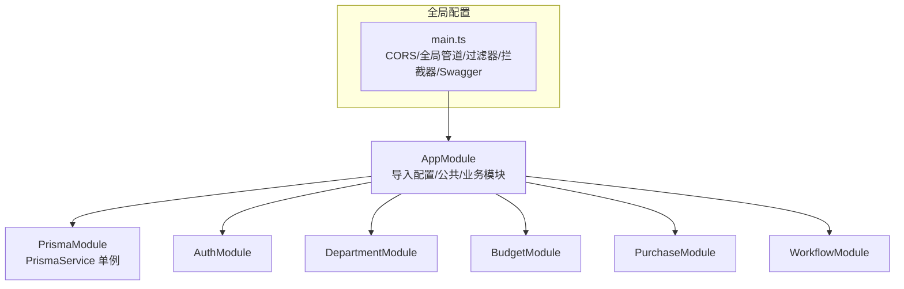
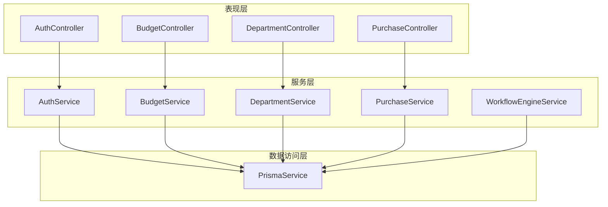
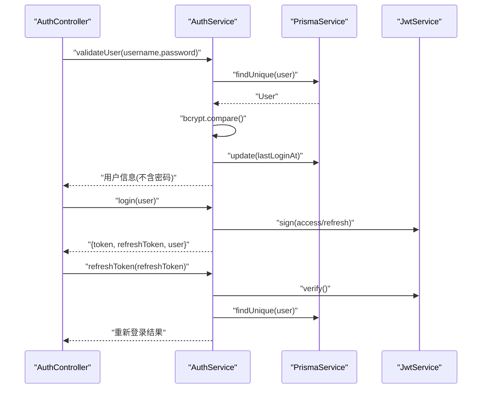
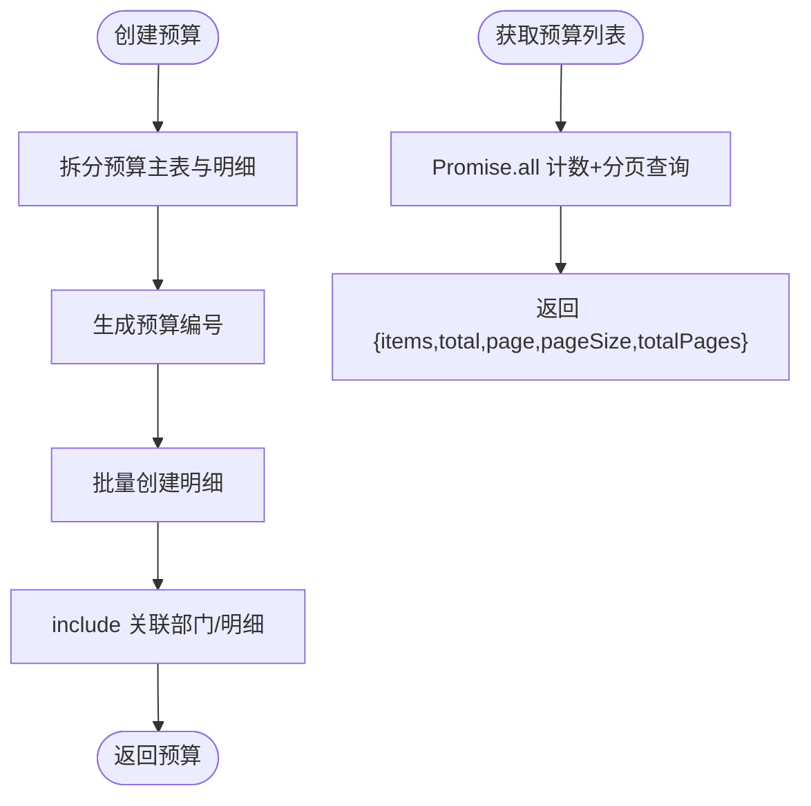
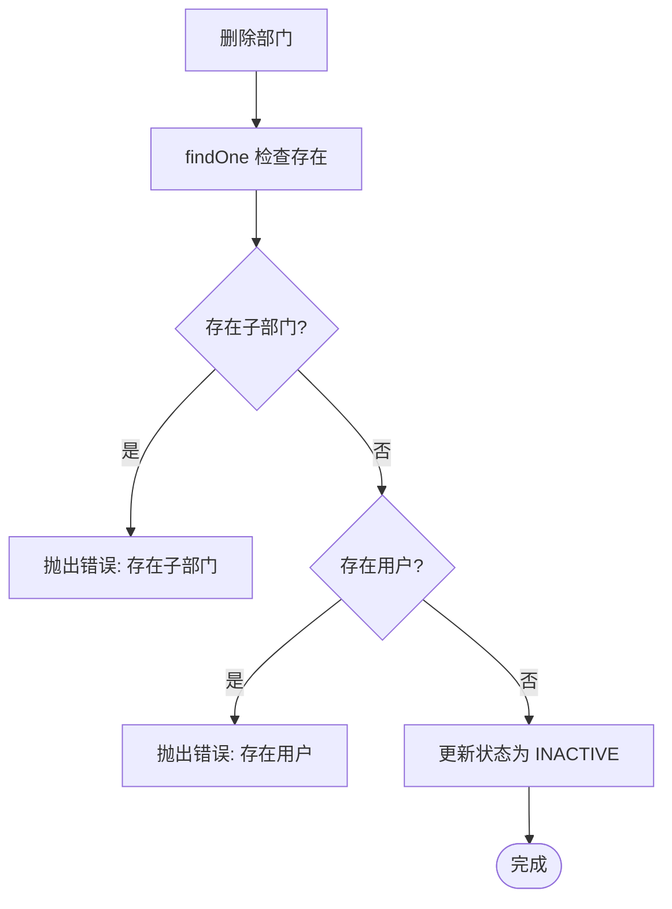
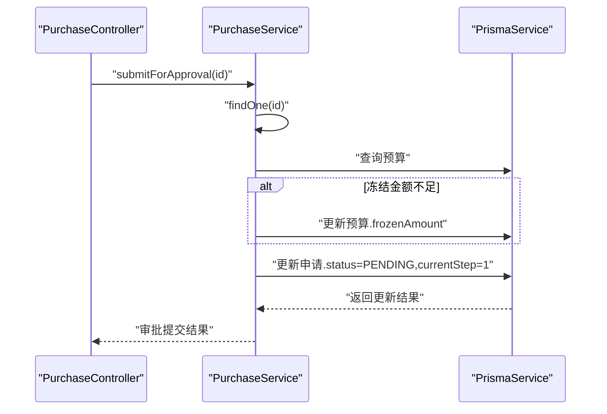
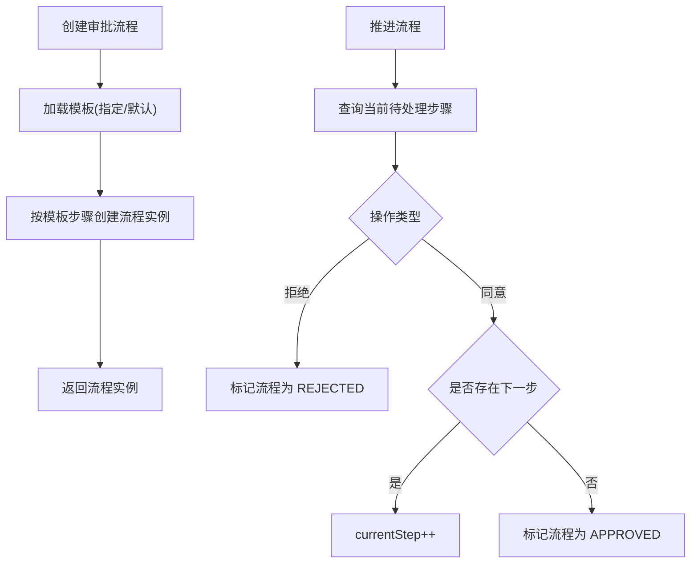
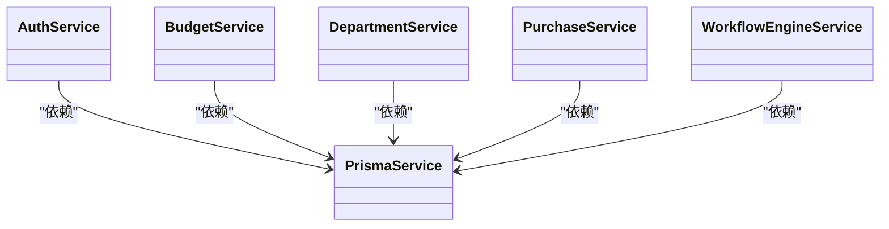

# 服务层设计

<cite>
**本文引用的文件**
- [server/src/app.module.ts](file://server/src/app.module.ts)
- [server/src/main.ts](file://server/src/main.ts)
- [server/src/common/prisma/prisma.service.ts](file://server/src/common/prisma/prisma.service.ts)
- [server/src/modules/auth/auth.service.ts](file://server/src/modules/auth/auth.service.ts)
- [server/src/modules/auth/auth.controller.ts](file://server/src/modules/auth/auth.controller.ts)
- [server/src/modules/budget/budget.service.ts](file://server/src/modules/budget/budget.service.ts)
- [server/src/modules/budget/budget.controller.ts](file://server/src/modules/budget/budget.controller.ts)
- [server/src/modules/department/department.service.ts](file://server/src/modules/department/department.service.ts)
- [server/src/modules/department/department.controller.ts](file://server/src/modules/department/department.controller.ts)
- [server/src/modules/purchase/purchase.service.ts](file://server/src/modules/purchase/purchase.service.ts)
- [server/src/modules/purchase/purchase.controller.ts](file://server/src/modules/purchase/purchase.controller.ts)
- [server/src/modules/workflow/workflow-engine.service.ts](file://server/src/modules/workflow/workflow-engine.service.ts)
</cite>

## 目录
1. [引言](#引言)
2. [项目结构](#项目结构)
3. [核心组件](#核心组件)
4. [架构总览](#架构总览)
5. [详细组件分析](#详细组件分析)
6. [依赖关系分析](#依赖关系分析)
7. [性能考虑](#性能考虑)
8. [故障排查指南](#故障排查指南)
9. [结论](#结论)
10. [附录](#附录)

## 引言
本文件面向预算管理系统的服务层设计，系统采用 NestJS + Prisma 的分层架构，围绕“控制器-服务-仓储”三层进行组织。服务层负责封装业务逻辑、协调数据访问与外部依赖，并通过依赖注入实现松耦合与可测试性。本文将从职责边界、设计原则、事务管理、依赖注入与单例应用、异步与错误处理、服务间协作与 API 规范、性能优化与测试策略等方面进行全面阐述。

## 项目结构
后端位于 server 目录，采用模块化组织，AppModule 统一导入各业务模块与公共模块（如 Prisma）。全局中间件包括 CORS、统一验证管道、异常过滤器与响应拦截器；Swagger 提供 API 文档。

图表来源
- [server/src/app.module.ts:12-32](file://server/src/app.module.ts#L12-L32)
- [server/src/main.ts:9-58](file://server/src/main.ts#L9-L58)

章节来源
- [server/src/app.module.ts:1-34](file://server/src/app.module.ts#L1-L34)
- [server/src/main.ts:1-59](file://server/src/main.ts#L1-L59)

## 核心组件
- 服务层职责
  - 封装业务规则与流程控制，避免控制器承担过多业务逻辑。
  - 统一数据访问入口，隐藏 Prisma 查询细节，提供领域友好的方法语义。
  - 处理跨实体关联与复杂查询，如多表联结、聚合统计、树形结构构建等。
  - 管理错误与异常传播，确保对外一致的错误语义与状态码。
- 设计原则
  - 单一职责：每个服务聚焦一个业务域。
  - 依赖倒置：服务依赖抽象（PrismaService），便于替换与测试。
  - 开闭原则：新增业务时尽量扩展而非修改既有服务。
  - 可测试性：通过构造函数注入，便于单元测试 mock。
- 数据访问抽象
  - 通过 PrismaService 统一连接数据库，自动生命周期管理（OnModuleInit/OnModuleDestroy）。
  - 服务内部使用 Prisma 客户端进行 CRUD 与复杂查询，避免在控制器中直接操作数据库。
- 事务管理
  - 当前服务层未显式使用 Prisma 事务上下文；对于需要强一致性的复合写入，建议在服务层引入 Prisma 事务包裹，或在工作流引擎中集中管理跨实体事务。

章节来源
- [server/src/common/prisma/prisma.service.ts:1-14](file://server/src/common/prisma/prisma.service.ts#L1-L14)
- [server/src/modules/auth/auth.service.ts:1-229](file://server/src/modules/auth/auth.service.ts#L1-L229)
- [server/src/modules/budget/budget.service.ts:1-157](file://server/src/modules/budget/budget.service.ts#L1-L157)
- [server/src/modules/department/department.service.ts:1-151](file://server/src/modules/department/department.service.ts#L1-L151)
- [server/src/modules/purchase/purchase.service.ts:1-205](file://server/src/modules/purchase/purchase.service.ts#L1-L205)

## 架构总览
控制器仅负责参数解析、鉴权与调用服务；服务层负责业务编排与数据访问；工作流引擎独立处理审批流程推进；Prisma 提供数据持久化能力。

图表来源
- [server/src/modules/auth/auth.controller.ts:11-61](file://server/src/modules/auth/auth.controller.ts#L11-L61)
- [server/src/modules/budget/budget.controller.ts:11-61](file://server/src/modules/budget/budget.controller.ts#L11-L61)
- [server/src/modules/department/department.controller.ts:12-62](file://server/src/modules/department/department.controller.ts#L12-L62)
- [server/src/modules/purchase/purchase.controller.ts:11-59](file://server/src/modules/purchase/purchase.controller.ts#L11-L59)
- [server/src/modules/auth/auth.service.ts:7-13](file://server/src/modules/auth/auth.service.ts#L7-L13)
- [server/src/modules/budget/budget.service.ts:5-7](file://server/src/modules/budget/budget.service.ts#L5-L7)
- [server/src/modules/department/department.service.ts:6-8](file://server/src/modules/department/department.service.ts#L6-L8)
- [server/src/modules/purchase/purchase.service.ts:5-7](file://server/src/modules/purchase/purchase.service.ts#L5-L7)
- [server/src/modules/workflow/workflow-engine.service.ts:4-6](file://server/src/modules/workflow/workflow-engine.service.ts#L4-L6)
- [server/src/common/prisma/prisma.service.ts:4-13](file://server/src/common/prisma/prisma.service.ts#L4-L13)

## 详细组件分析

### 认证服务（AuthService）
- 职责
  - 用户登录校验、密码比对、登录态维护与 Token 签发。
  - 用户注册、默认角色分配与密码加密。
  - 修改密码、刷新 Token 与权限加载。
- 关键流程
  - 登录：查询用户、校验状态与密码、更新登录时间、签发访问与刷新 Token。
  - 注册：检查唯一性、哈希密码、创建用户并绑定默认角色。
  - 刷新：校验刷新 Token、重新加载用户权限并签发新 Token。
- 错误处理
  - 使用统一异常类型抛出业务错误，便于全局过滤器处理。
- 依赖注入
  - 通过构造函数注入 PrismaService、JwtService、ConfigService，形成服务内聚与可测试性。

图表来源
- [server/src/modules/auth/auth.controller.ts:19-36](file://server/src/modules/auth/auth.controller.ts#L19-L36)
- [server/src/modules/auth/auth.service.ts:18-91](file://server/src/modules/auth/auth.service.ts#L18-L91)
- [server/src/modules/auth/auth.service.ts:173-204](file://server/src/modules/auth/auth.service.ts#L173-L204)

章节来源
- [server/src/modules/auth/auth.service.ts:1-229](file://server/src/modules/auth/auth.service.ts#L1-L229)
- [server/src/modules/auth/auth.controller.ts:1-62](file://server/src/modules/auth/auth.controller.ts#L1-L62)

### 预算服务（BudgetService）
- 职责
  - 预算创建、列表查询、详情获取、状态变更（提交审批）、更新与删除。
  - 预算编号生成、明细计算与排序。
- 关键流程
  - 创建：生成编号、拆分主表与明细、批量写入。
  - 列表：并发统计总数与分页查询，返回分页结构。
  - 提交审批：校验状态并更新为待审批。
- 性能注意
  - 使用 Promise.all 并发执行计数与查询，减少往返。
  - 对明细排序与关联统计使用 Prisma orderBy 与 _count。

图表来源
- [server/src/modules/budget/budget.service.ts:12-42](file://server/src/modules/budget/budget.service.ts#L12-L42)
- [server/src/modules/budget/budget.service.ts:61-84](file://server/src/modules/budget/budget.service.ts#L61-L84)

章节来源
- [server/src/modules/budget/budget.service.ts:1-157](file://server/src/modules/budget/budget.service.ts#L1-L157)
- [server/src/modules/budget/budget.controller.ts:1-62](file://server/src/modules/budget/budget.controller.ts#L1-L62)

### 部门服务（DepartmentService）
- 职责
  - 部门创建（编码唯一性校验）、树形结构构建、详情查询、更新（含编码唯一性校验）、软删除（条件约束）。
- 关键流程
  - 树构建：基于父子关系递归组装层级结构。
  - 删除：禁止存在子部门与用户时删除，软删除改为状态字段。

图表来源
- [server/src/modules/department/department.service.ts:118-137](file://server/src/modules/department/department.service.ts#L118-L137)

章节来源
- [server/src/modules/department/department.service.ts:1-151](file://server/src/modules/department/department.service.ts#L1-L151)
- [server/src/modules/department/department.controller.ts:1-63](file://server/src/modules/department/department.controller.ts#L1-L63)

### 采购服务（PurchaseService）
- 职责
  - 采购申请创建（预算校验、编号生成、明细计算）、列表与详情查询、提交审批（预算冻结金额更新）、更新与删除。
- 关键流程
  - 提交审批：校验草稿状态，若预算冻结不足则先更新冻结金额，再推进到下一审批节点。
- 与工作流协作
  - 服务层可触发工作流引擎创建审批流程实例，推进流程由工作流引擎负责。

图表来源
- [server/src/modules/purchase/purchase.controller.ts:54-58](file://server/src/modules/purchase/purchase.controller.ts#L54-L58)
- [server/src/modules/purchase/purchase.service.ts:148-173](file://server/src/modules/purchase/purchase.service.ts#L148-L173)

章节来源
- [server/src/modules/purchase/purchase.service.ts:1-205](file://server/src/modules/purchase/purchase.service.ts#L1-L205)
- [server/src/modules/purchase/purchase.controller.ts:1-60](file://server/src/modules/purchase/purchase.controller.ts#L1-L60)

### 工作流引擎服务（WorkflowEngineService）
- 职责
  - 基于模板创建审批流程实例，推进流程（同意/拒绝），维护流程状态与步骤顺序。
- 关键流程
  - 创建：根据目标类型选择模板或指定模板，按步骤顺序初始化流程实例。
  - 推进：定位当前待处理步骤，记录操作，若拒绝则结束，否则判断是否还有下一步。

图表来源
- [server/src/modules/workflow/workflow-engine.service.ts:11-61](file://server/src/modules/workflow/workflow-engine.service.ts#L11-L61)
- [server/src/modules/workflow/workflow-engine.service.ts:66-135](file://server/src/modules/workflow/workflow-engine.service.ts#L66-L135)

章节来源
- [server/src/modules/workflow/workflow-engine.service.ts:1-149](file://server/src/modules/workflow/workflow-engine.service.ts#L1-L149)

## 依赖关系分析
- 控制器到服务：控制器仅注入对应服务，保持薄控制器。
- 服务到数据访问：服务统一通过 PrismaService 访问数据库，避免在控制器中直接使用 ORM。
- 服务到服务：服务之间不直接互相调用，避免循环依赖；跨实体业务可通过工作流引擎或上层编排。
- 依赖注入与单例
  - PrismaService 作为单例提供数据库连接，服务通过构造函数注入，NestJS 默认按请求作用域管理服务实例，适合无状态服务。
- 事务管理
  - 当前未见显式事务包裹；对于跨表一致性要求高的场景，可在服务层使用 Prisma 事务上下文或在工作流引擎中集中管理。

图表来源
- [server/src/common/prisma/prisma.service.ts:4-13](file://server/src/common/prisma/prisma.service.ts#L4-L13)
- [server/src/modules/auth/auth.service.ts:7-13](file://server/src/modules/auth/auth.service.ts#L7-L13)
- [server/src/modules/budget/budget.service.ts:5-7](file://server/src/modules/budget/budget.service.ts#L5-L7)
- [server/src/modules/department/department.service.ts:6-8](file://server/src/modules/department/department.service.ts#L6-L8)
- [server/src/modules/purchase/purchase.service.ts:5-7](file://server/src/modules/purchase/purchase.service.ts#L5-L7)
- [server/src/modules/workflow/workflow-engine.service.ts:4-6](file://server/src/modules/workflow/workflow-engine.service.ts#L4-L6)

章节来源
- [server/src/app.module.ts:5-29](file://server/src/app.module.ts#L5-L29)
- [server/src/main.ts:9-38](file://server/src/main.ts#L9-L38)

## 性能考虑
- 缓存策略
  - 对热点查询（如部门树、字典类数据）引入内存缓存；结合失效策略与缓存穿透防护。
- 批量操作
  - 使用 Prisma 的批量写入与并发查询（如 Promise.all）降低往返次数。
- 连接池管理
  - 通过 Prisma 的连接池配置与数据库侧连接池参数协同优化吞吐。
- 查询优化
  - 使用 select/include 精准投影，避免 N+1；对大列表使用分页与索引覆盖。
- 异步与并发
  - 服务层广泛使用 async/await 与 Promise.all 并发，提升响应速度。
- 事务与一致性
  - 对关键写入组合（如预算冻结金额更新）建议使用事务包裹，保证原子性。

[本节为通用性能指导，无需特定文件来源]

## 故障排查指南
- 全局异常过滤器
  - 应用注册了全局异常过滤器，统一捕获未处理异常并输出标准格式响应。
- 业务异常
  - 服务层使用具体异常类型（如 UnauthorizedException、NotFoundException）表达业务错误，便于前端识别与提示。
- 日志与可观测性
  - 建议在服务层增加结构化日志，记录关键业务事件与耗时，配合全局过滤器输出统一错误格式。
- 常见问题
  - 参数校验失败：全局 ValidationPipe 已启用，确保 DTO 字段正确。
  - 跨模块协作：服务间不直接调用，应通过工作流引擎或上层编排，避免循环依赖。

章节来源
- [server/src/main.ts:33-34](file://server/src/main.ts#L33-L34)
- [server/src/modules/auth/auth.service.ts:39-47](file://server/src/modules/auth/auth.service.ts#L39-L47)
- [server/src/modules/budget/budget.service.ts:107-109](file://server/src/modules/budget/budget.service.ts#L107-L109)
- [server/src/modules/purchase/purchase.service.ts:196-198](file://server/src/modules/purchase/purchase.service.ts#L196-L198)

## 结论
服务层通过清晰的职责划分与依赖注入，实现了业务逻辑与数据访问的解耦；控制器专注于接口与安全；工作流引擎独立处理审批流程。当前架构具备良好的可扩展性与可测试性，建议在关键写入路径引入事务管理，并完善缓存与批量优化策略以进一步提升性能与稳定性。

## 附录

### 服务层依赖注入与单例应用
- PrismaService 作为单例提供数据库连接，服务通过构造函数注入使用。
- NestJS 默认按请求作用域管理服务实例，适合无状态服务；若需进程级共享，可调整提供者范围。

章节来源
- [server/src/common/prisma/prisma.service.ts:4-13](file://server/src/common/prisma/prisma.service.ts#L4-L13)
- [server/src/modules/auth/auth.service.ts:7-13](file://server/src/modules/auth/auth.service.ts#L7-L13)

### 异步操作、错误传播与回滚策略
- 异步：服务层广泛使用 async/await，控制器与服务之间通过 Promise 传递结果。
- 错误：服务层抛出明确异常，全局过滤器统一处理。
- 回滚：当前未见显式事务；建议在复合写入场景引入 Prisma 事务上下文或在工作流引擎中集中管理。

章节来源
- [server/src/modules/purchase/purchase.service.ts:155-164](file://server/src/modules/purchase/purchase.service.ts#L155-L164)
- [server/src/modules/workflow/workflow-engine.service.ts:66-135](file://server/src/modules/workflow/workflow-engine.service.ts#L66-L135)

### 服务间协作模式与 API 设计规范
- 协作模式：服务间不直接调用，跨实体业务通过工作流引擎或上层编排；控制器仅编排调用。
- API 规范：控制器使用 Swagger 注解标注接口语义与响应；统一鉴权守卫与 Bearer 认证。

章节来源
- [server/src/modules/auth/auth.controller.ts:9-61](file://server/src/modules/auth/auth.controller.ts#L9-L61)
- [server/src/modules/budget/budget.controller.ts:7-61](file://server/src/modules/budget/budget.controller.ts#L7-L61)
- [server/src/modules/department/department.controller.ts:8-62](file://server/src/modules/department/department.controller.ts#L8-L62)
- [server/src/modules/purchase/purchase.controller.ts:7-59](file://server/src/modules/purchase/purchase.controller.ts#L7-L59)

### 性能优化技巧（摘要）
- 缓存：热点数据内存缓存 + 失效策略。
- 批量：批量写入、并发查询（Promise.all）。
- 连接池：Prisma 与数据库侧参数协同优化。
- 查询：精准投影、分页与索引。
- 事务：关键写入组合使用事务保证一致性。

[本节为通用指导，无需特定文件来源]

### 单元测试与集成测试的 Mock 策略
- 单元测试
  - 使用构造函数注入，通过测试框架（如 Jest）mock 服务依赖（如 PrismaService），隔离业务逻辑。
- 集成测试
  - 使用内存数据库或测试专用数据库，启动最小化应用（AppModule 子集），验证控制器-服务-仓储链路。
- 建议
  - 为每个服务编写针对关键业务方法的测试用例，覆盖正常路径与异常分支。

[本节为通用指导，无需特定文件来源]