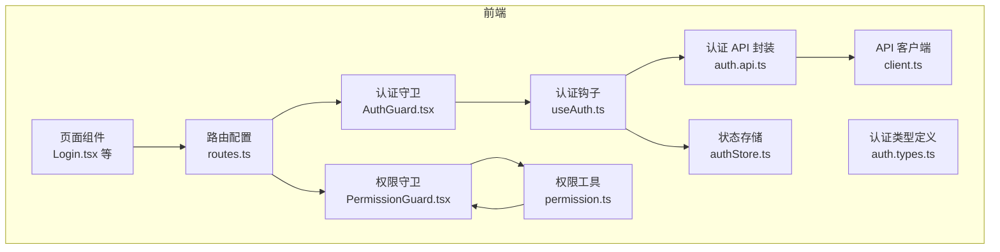
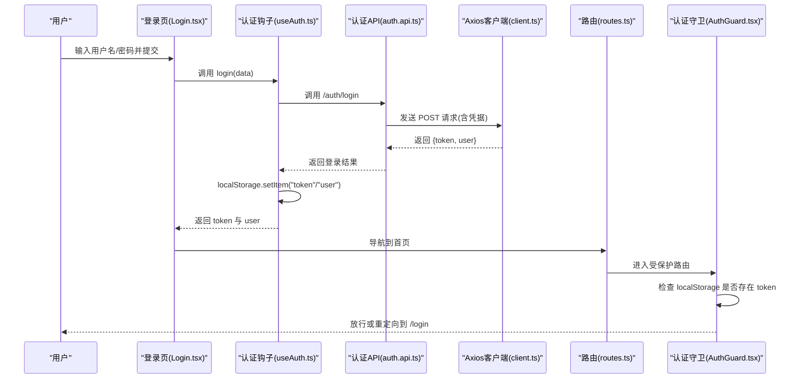
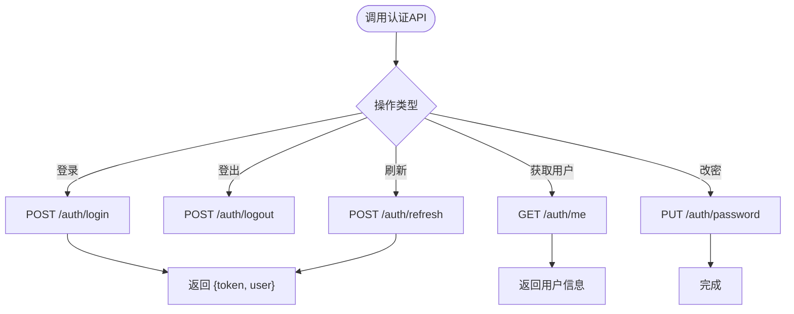
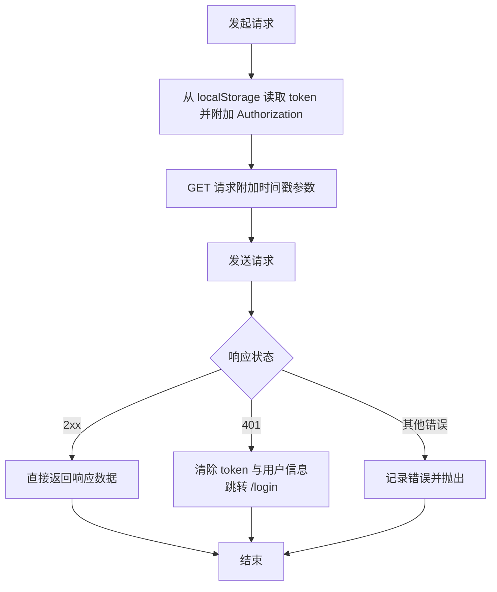
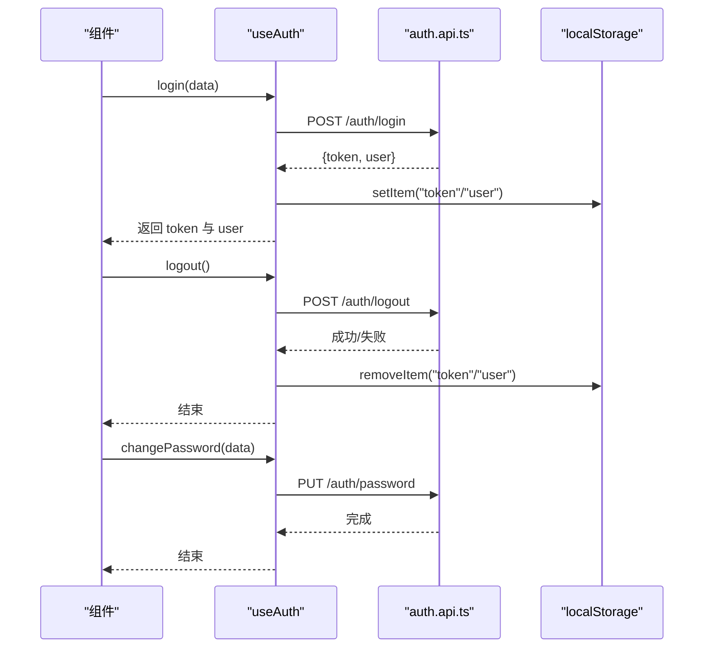
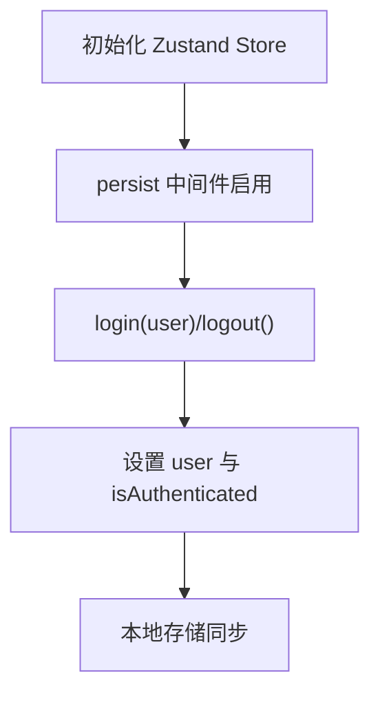
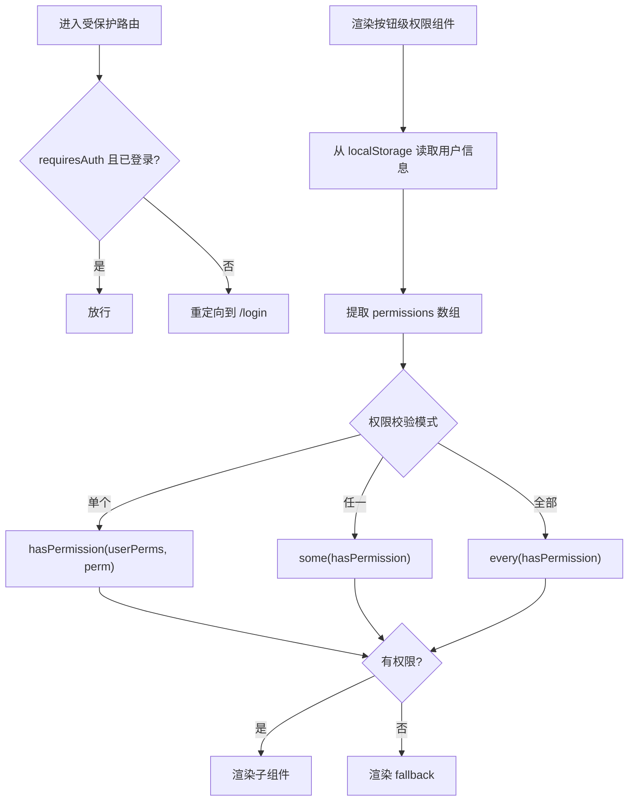
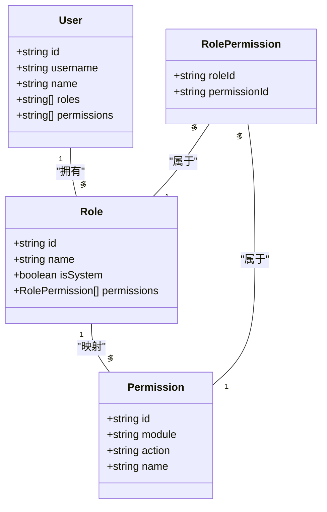

# 认证与授权

<cite>
**本文引用的文件**
- [src/api/modules/auth.api.ts](file://src/api/modules/auth.api.ts)
- [src/api/client.ts](file://src/api/client.ts)
- [src/hooks/useAuth.ts](file://src/hooks/useAuth.ts)
- [src/store/authStore.ts](file://src/store/authStore.ts)
- [src/components/guard/AuthGuard.tsx](file://src/components/guard/AuthGuard.tsx)
- [src/components/guard/PermissionGuard.tsx](file://src/components/guard/PermissionGuard.tsx)
- [src/utils/permission.ts](file://src/utils/permission.ts)
- [src/api/types/auth.types.ts](file://src/api/types/auth.types.ts)
- [src/router/routes.ts](file://src/router/routes.ts)
- [src/pages/Login.tsx](file://src/pages/Login.tsx)
- [src/types/index.ts](file://src/types/index.ts)
- [package.json](file://package.json)
</cite>

## 目录
1. [引言](#引言)
2. [项目结构](#项目结构)
3. [核心组件](#核心组件)
4. [架构总览](#架构总览)
5. [详细组件分析](#详细组件分析)
6. [依赖分析](#依赖分析)
7. [性能考虑](#性能考虑)
8. [故障排除指南](#故障排除指南)
9. [结论](#结论)
10. [附录](#附录)

## 引言
本文件面向预算管理系统的认证与授权机制，聚焦以下目标：
- 解释前端侧的认证流程、状态管理和路由守卫实现
- 描述权限模型（RBAC）与权限判断逻辑
- 总结安全最佳实践（密码加密、令牌存储、CSRF防护等）
- 提供中间件与异常处理策略建议（基于现有前端拦截器）

说明：当前仓库前端代码展示了完整的认证与授权前端实现，包括登录、登出、令牌携带、权限判断与路由保护。后端（NestJS）相关配置与策略文件不在当前工作区可见范围内，因此本文不直接引用后端源码，仅基于前端实现进行解读与扩展建议。

## 项目结构
前端采用 React + TypeScript + Zustand 状态管理，配合 React Router v6 的懒加载路由与守卫组件。认证相关的核心文件分布如下：
- API 层：统一的 Axios 实例与认证 API 封装
- 钩子层：useAuth 提供登录、登出、修改密码、获取用户信息等能力
- 状态层：Zustand 存储用户与认证状态，并持久化到本地存储
- 守卫层：AuthGuard 与 PermissionGuard 实现页面级与按钮级权限控制
- 工具层：权限判断工具函数与权限枚举
- 类型层：认证与权限相关接口定义
- 路由层：路由配置与 requiresAuth 标记

图表来源
- [src/pages/Login.tsx:1-102](file://src/pages/Login.tsx#L1-L102)
- [src/router/routes.ts:1-122](file://src/router/routes.ts#L1-L122)
- [src/components/guard/AuthGuard.tsx:1-31](file://src/components/guard/AuthGuard.tsx#L1-L31)
- [src/components/guard/PermissionGuard.tsx:1-88](file://src/components/guard/PermissionGuard.tsx#L1-L88)
- [src/hooks/useAuth.ts:1-84](file://src/hooks/useAuth.ts#L1-L84)
- [src/store/authStore.ts:1-31](file://src/store/authStore.ts#L1-L31)
- [src/utils/permission.ts:1-84](file://src/utils/permission.ts#L1-L84)
- [src/api/client.ts:1-183](file://src/api/client.ts#L1-L183)
- [src/api/modules/auth.api.ts:1-50](file://src/api/modules/auth.api.ts#L1-L50)
- [src/api/types/auth.types.ts:1-44](file://src/api/types/auth.types.ts#L1-L44)

章节来源
- [src/pages/Login.tsx:1-102](file://src/pages/Login.tsx#L1-L102)
- [src/router/routes.ts:1-122](file://src/router/routes.ts#L1-L122)
- [src/components/guard/AuthGuard.tsx:1-31](file://src/components/guard/AuthGuard.tsx#L1-L31)
- [src/components/guard/PermissionGuard.tsx:1-88](file://src/components/guard/PermissionGuard.tsx#L1-L88)
- [src/hooks/useAuth.ts:1-84](file://src/hooks/useAuth.ts#L1-L84)
- [src/store/authStore.ts:1-31](file://src/store/authStore.ts#L1-L31)
- [src/utils/permission.ts:1-84](file://src/utils/permission.ts#L1-L84)
- [src/api/client.ts:1-183](file://src/api/client.ts#L1-L183)
- [src/api/modules/auth.api.ts:1-50](file://src/api/modules/auth.api.ts#L1-L50)
- [src/api/types/auth.types.ts:1-44](file://src/api/types/auth.types.ts#L1-L44)

## 核心组件
- 认证 API 封装：提供登录、登出、刷新令牌、获取当前用户、修改密码等方法，统一调用后端 /auth/* 接口。
- Axios 客户端：全局请求拦截器自动附加 Bearer Token；响应拦截器统一处理 401 未授权并清空本地存储。
- 认证钩子 useAuth：封装登录、登出、修改密码、获取用户信息、判断登录态与读取用户信息。
- 状态存储 authStore：使用 Zustand 管理用户与登录态，并通过 persist 中间件持久化。
- 路由守卫：
  - AuthGuard：根据 requiresAuth 决定是否重定向至登录页或首页。
  - PermissionGuard：基于用户权限数组进行按钮级权限判断。
- 权限工具：hasPermission、hasAnyPermission、hasAllPermissions 以及权限枚举与权限字符串生成。

章节来源
- [src/api/modules/auth.api.ts:1-50](file://src/api/modules/auth.api.ts#L1-L50)
- [src/api/client.ts:1-183](file://src/api/client.ts#L1-L183)
- [src/hooks/useAuth.ts:1-84](file://src/hooks/useAuth.ts#L1-L84)
- [src/store/authStore.ts:1-31](file://src/store/authStore.ts#L1-L31)
- [src/components/guard/AuthGuard.tsx:1-31](file://src/components/guard/AuthGuard.tsx#L1-L31)
- [src/components/guard/PermissionGuard.tsx:1-88](file://src/components/guard/PermissionGuard.tsx#L1-L88)
- [src/utils/permission.ts:1-84](file://src/utils/permission.ts#L1-L84)

## 架构总览
下图展示从前端到后端的整体认证与授权流程，包括登录、令牌携带、权限判断与路由保护。

图表来源
- [src/pages/Login.tsx:14-38](file://src/pages/Login.tsx#L14-L38)
- [src/hooks/useAuth.ts:12-21](file://src/hooks/useAuth.ts#L12-L21)
- [src/api/modules/auth.api.ts:18-20](file://src/api/modules/auth.api.ts#L18-L20)
- [src/api/client.ts:22-44](file://src/api/client.ts#L22-L44)
- [src/router/routes.ts:25-35](file://src/router/routes.ts#L25-L35)
- [src/components/guard/AuthGuard.tsx:17](file://src/components/guard/AuthGuard.tsx#L17)

## 详细组件分析

### 认证 API 封装与类型定义
- 认证 API 封装提供登录、登出、刷新令牌、获取当前用户、修改密码等方法，统一调用后端 /auth/* 接口。
- 类型定义包含登录请求体、登录响应体、用户信息、刷新令牌请求体、修改密码请求体及通用响应包装。

图表来源
- [src/api/modules/auth.api.ts:14-49](file://src/api/modules/auth.api.ts#L14-L49)
- [src/api/types/auth.types.ts:5-39](file://src/api/types/auth.types.ts#L5-L39)

章节来源
- [src/api/modules/auth.api.ts:1-50](file://src/api/modules/auth.api.ts#L1-L50)
- [src/api/types/auth.types.ts:1-44](file://src/api/types/auth.types.ts#L1-L44)

### Axios 客户端与拦截器
- 请求拦截器：自动从 localStorage 读取 token 并附加 Authorization: Bearer 头；GET 请求追加时间戳参数以避免缓存。
- 响应拦截器：统一处理常见 HTTP 错误码，特别是 401 未授权时清除本地存储并跳转到登录页。

图表来源
- [src/api/client.ts:22-94](file://src/api/client.ts#L22-L94)

章节来源
- [src/api/client.ts:1-183](file://src/api/client.ts#L1-L183)

### 认证钩子 useAuth
- 提供 login、logout、changePassword、getCurrentUser、isAuthenticated、getUserInfo 等方法。
- 登录成功后将 token 与用户信息写入 localStorage；登出时尝试调用后端登出接口并清理本地存储；修改密码调用对应接口。

图表来源
- [src/hooks/useAuth.ts:12-43](file://src/hooks/useAuth.ts#L12-L43)
- [src/api/modules/auth.api.ts:18-27](file://src/api/modules/auth.api.ts#L18-L27)

章节来源
- [src/hooks/useAuth.ts:1-84](file://src/hooks/useAuth.ts#L1-L84)

### 状态存储 authStore
- 使用 Zustand 管理用户与登录态，并通过 persist 中间件持久化到本地存储。
- 提供 login(user) 与 logout() 方法，分别设置与清除用户与登录态。

图表来源
- [src/store/authStore.ts:19-31](file://src/store/authStore.ts#L19-L31)

章节来源
- [src/store/authStore.ts:1-31](file://src/store/authStore.ts#L1-L31)

### 路由守卫与权限守卫
- AuthGuard：根据路由 requiresAuth 字段与本地是否存在 token 决定放行或重定向到 /login 或 /。
- PermissionGuard：从 localStorage 读取用户信息，提取 permissions 数组，使用 hasPermission 等工具函数进行权限判断，支持单个权限、任一权限或全部权限校验。

图表来源
- [src/components/guard/AuthGuard.tsx:17-29](file://src/components/guard/AuthGuard.tsx#L17-L29)
- [src/components/guard/PermissionGuard.tsx:21-46](file://src/components/guard/PermissionGuard.tsx#L21-L46)
- [src/utils/permission.ts:11-41](file://src/utils/permission.ts#L11-L41)

章节来源
- [src/components/guard/AuthGuard.tsx:1-31](file://src/components/guard/AuthGuard.tsx#L1-L31)
- [src/components/guard/PermissionGuard.tsx:1-88](file://src/components/guard/PermissionGuard.tsx#L1-L88)
- [src/utils/permission.ts:1-84](file://src/utils/permission.ts#L1-L84)

### RBAC 权限模型与权限枚举
- 权限模型：用户拥有多个角色，角色映射到权限集合；管理员拥有所有权限（通配符）。
- 权限枚举覆盖预算、采购、审批、报表、系统管理等模块的操作维度。
- 权限字符串格式为“模块.操作”，便于细粒度控制。

图表来源
- [src/types/index.ts:3-53](file://src/types/index.ts#L3-L53)
- [src/utils/permission.ts:53-83](file://src/utils/permission.ts#L53-L83)

章节来源
- [src/types/index.ts:1-338](file://src/types/index.ts#L1-L338)
- [src/utils/permission.ts:1-84](file://src/utils/permission.ts#L1-L84)

### 登录页与演示账号
- 登录页提供表单输入与错误提示，包含演示账号与角色标签，便于测试不同角色权限。
- 登录成功后通过 useAuthStore 更新全局状态并导航到首页。

章节来源
- [src/pages/Login.tsx:1-102](file://src/pages/Login.tsx#L1-L102)

## 依赖分析
- Axios：提供请求/响应拦截器与统一错误处理
- React Router：提供路由懒加载与守卫组件
- Zustand：轻量状态管理，支持持久化
- Lucide Icons：UI 图标库

章节来源
- [package.json:12-32](file://package.json#L12-L32)

## 性能考虑
- 请求缓存：GET 请求已附加时间戳参数以避免浏览器缓存，确保接口实时性。
- 状态持久化：Zustand 的 persist 中间件减少重复登录成本，提升用户体验。
- 组件懒加载：路由懒加载降低首屏体积，提升初始加载速度。
- 权限判断：在 PermissionGuard 中对用户权限数组进行本地判断，避免不必要的网络请求。

## 故障排除指南
- 401 未授权：响应拦截器会清除本地 token 与用户信息并跳转到登录页。请确认后端返回的 token 是否有效、是否过期。
- 登录后仍被重定向：检查 localStorage 中是否存在 token；确认 AuthGuard 的 requiresAuth 与路由配置一致。
- 权限不足：确认用户 permissions 数组是否包含所需权限；检查权限字符串格式是否正确。
- 网络错误：检查 VITE_API_BASE_URL 环境变量与网络连通性。

章节来源
- [src/api/client.ts:52-94](file://src/api/client.ts#L52-L94)
- [src/components/guard/AuthGuard.tsx:17-29](file://src/components/guard/AuthGuard.tsx#L17-L29)
- [src/utils/permission.ts:11-21](file://src/utils/permission.ts#L11-L21)

## 结论
本项目在前端层面实现了完整的认证与授权闭环：通过 Axios 拦截器统一携带令牌、通过守卫组件实现页面与按钮级权限控制、通过状态管理持久化用户信息。结合 RBAC 权限模型与权限枚举，能够灵活支撑预算管理场景下的多角色权限需求。建议后续补充后端 JWT 策略与 Passport 配置，以形成前后端一致的认证体系。

## 附录
- 安全最佳实践（建议）
  - 密码加密：后端应使用强哈希算法存储密码，前端仅传输明文或经 TLS 加密的传输通道。
  - 令牌存储：建议使用 HttpOnly Cookie 存储短期令牌，LocalStorage 仅用于演示或特殊场景。
  - CSRF 防护：后端启用 SameSite Cookie、CSRF Token 校验与 CORS 白名单。
  - 令牌刷新：后端提供独立刷新接口，前端在 401 时触发刷新流程并重试原请求。
  - 权限验证中间件：后端实现基于 RBAC 的中间件，校验用户角色与权限。
  - 异常处理：统一错误码与错误消息，避免泄露敏感信息；对 401/403 进行前端重定向与提示。