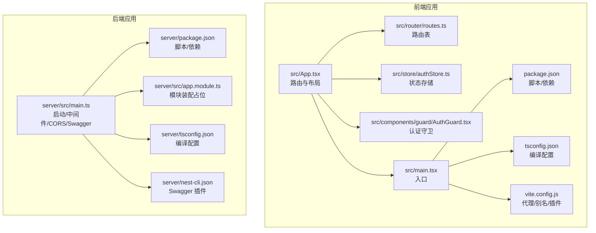
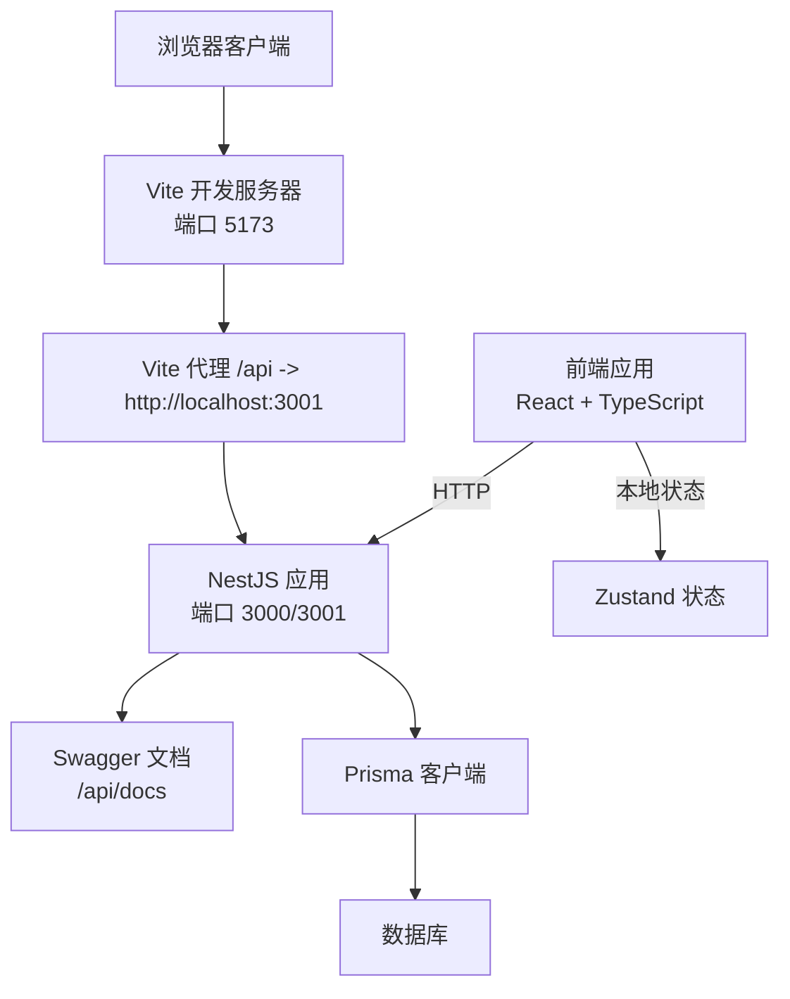
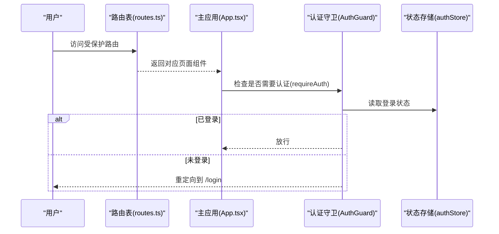
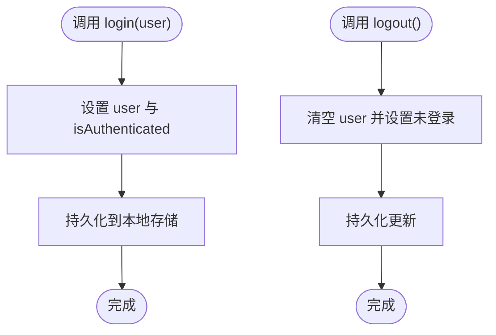
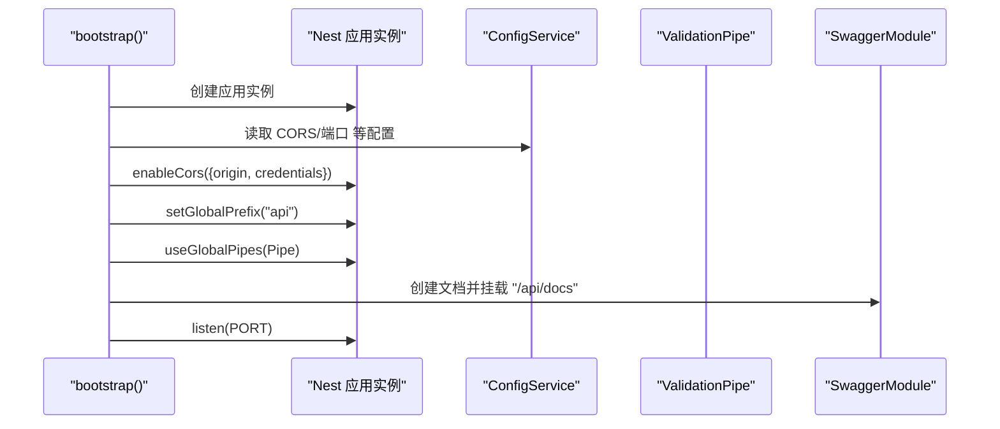
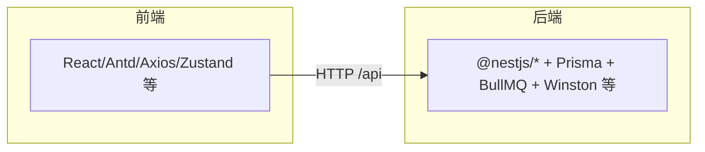

# 开发指南

<cite>
**本文引用的文件**
- [package.json](file://package.json)
- [tsconfig.json](file://tsconfig.json)
- [tsconfig.node.json](file://tsconfig.node.json)
- [vite.config.js](file://vite.config.js)
- [server/package.json](file://server/package.json)
- [server/tsconfig.json](file://server/tsconfig.json)
- [server/nest-cli.json](file://server/nest-cli.json)
- [server/src/main.ts](file://server/src/main.ts)
- [server/src/app.module.ts](file://server/src/app.module.ts)
- [src/main.tsx](file://src/main.tsx)
- [src/App.tsx](file://src/App.tsx)
- [src/router/routes.ts](file://src/router/routes.ts)
- [src/store/authStore.ts](file://src/store/authStore.ts)
- [src/components/guard/AuthGuard.tsx](file://src/components/guard/AuthGuard.tsx)
- [.gitignore](file://.gitignore)
</cite>

## 目录
1. [简介](#简介)
2. [项目结构](#项目结构)
3. [核心组件](#核心组件)
4. [架构总览](#架构总览)
5. [详细组件分析](#详细组件分析)
6. [依赖分析](#依赖分析)
7. [性能考虑](#性能考虑)
8. [故障排查指南](#故障排查指南)
9. [结论](#结论)
10. [附录](#附录)

## 简介
本开发指南面向预算管理系统的前端与后端开发者，目标是帮助团队快速搭建一致的开发环境、统一代码规范与最佳实践，并明确项目结构、路由与状态管理设计、调试与测试策略、以及性能优化与内存管理建议。系统采用前后端分离架构：前端基于 Vite + React + TypeScript，后端基于 NestJS + TypeScript，数据库通过 Prisma 管理，使用 Swagger 提供 API 文档，Zustand 管理前端状态，Ant Design 作为 UI 基础组件库。

## 项目结构
项目采用“根应用 + 服务端子项目”的双工程布局，便于前后端独立构建与部署：
- 根目录包含前端应用与通用配置（Vite、TypeScript、ESLint、包管理脚本等）
- server 子目录为 NestJS 后端工程，包含模块化结构、Prisma schema、Swagger 文档与测试配置

图表来源
- [src/main.tsx:1-26](file://src/main.tsx#L1-L26)
- [src/App.tsx:1-66](file://src/App.tsx#L1-L66)
- [src/router/routes.ts:1-122](file://src/router/routes.ts#L1-L122)
- [src/store/authStore.ts:1-31](file://src/store/authStore.ts#L1-L31)
- [src/components/guard/AuthGuard.tsx:1-31](file://src/components/guard/AuthGuard.tsx#L1-L31)
- [vite.config.js:1-23](file://vite.config.js#L1-L23)
- [tsconfig.json:1-25](file://tsconfig.json#L1-L25)
- [server/src/main.ts:1-51](file://server/src/main.ts#L1-L51)
- [server/src/app.module.ts:1-52](file://server/src/app.module.ts#L1-L52)
- [server/tsconfig.json:1-27](file://server/tsconfig.json#L1-L27)
- [server/nest-cli.json:1-17](file://server/nest-cli.json#L1-L17)

章节来源
- [package.json:1-45](file://package.json#L1-L45)
- [tsconfig.json:1-25](file://tsconfig.json#L1-L25)
- [vite.config.js:1-23](file://vite.config.js#L1-L23)
- [server/package.json:1-96](file://server/package.json#L1-L96)
- [server/tsconfig.json:1-27](file://server/tsconfig.json#L1-L27)
- [server/nest-cli.json:1-17](file://server/nest-cli.json#L1-L17)

## 核心组件
- 前端入口与渲染：在入口文件中集中引入样式与根组件，确保全局样式与应用初始化顺序一致
- 路由与权限：通过路由表与守卫组件控制访问，支持登录页与受保护页面的分流
- 状态管理：使用 Zustand 管理用户认证状态，并持久化到本地存储
- 后端启动与中间件：启用 CORS、全局校验管道、Swagger 文档与全局 API 前缀
- 配置与别名：前端通过路径别名与 Vite 代理将 /api 请求转发至后端服务

章节来源
- [src/main.tsx:1-26](file://src/main.tsx#L1-L26)
- [src/App.tsx:1-66](file://src/App.tsx#L1-L66)
- [src/router/routes.ts:1-122](file://src/router/routes.ts#L1-L122)
- [src/store/authStore.ts:1-31](file://src/store/authStore.ts#L1-L31)
- [src/components/guard/AuthGuard.tsx:1-31](file://src/components/guard/AuthGuard.tsx#L1-L31)
- [server/src/main.ts:1-51](file://server/src/main.ts#L1-L51)

## 架构总览
系统采用前后端分离架构，前端负责用户界面与交互，后端提供 REST API 与业务逻辑；两者通过 /api 前缀通信，Swagger 提供接口文档，Prisma 管理数据模型与迁移。

图表来源
- [vite.config.js:13-21](file://vite.config.js#L13-L21)
- [server/src/main.ts:14-47](file://server/src/main.ts#L14-L47)
- [server/src/app.module.ts:22-51](file://server/src/app.module.ts#L22-L51)

## 详细组件分析

### 前端应用与路由
- 路由表采用懒加载与权限标记，减少首屏体积并统一权限控制
- 主应用通过私有路由包装器与守卫组件实现登录态判断
- 入口文件集中引入样式，保证主题与布局一致性

图表来源
- [src/router/routes.ts:24-35](file://src/router/routes.ts#L24-L35)
- [src/App.tsx:24-27](file://src/App.tsx#L24-L27)
- [src/components/guard/AuthGuard.tsx:13-30](file://src/components/guard/AuthGuard.tsx#L13-L30)
- [src/store/authStore.ts:19-30](file://src/store/authStore.ts#L19-L30)

章节来源
- [src/router/routes.ts:1-122](file://src/router/routes.ts#L1-L122)
- [src/App.tsx:1-66](file://src/App.tsx#L1-L66)
- [src/components/guard/AuthGuard.tsx:1-31](file://src/components/guard/AuthGuard.tsx#L1-L31)
- [src/store/authStore.ts:1-31](file://src/store/authStore.ts#L1-L31)

### 状态管理（Zustand）
- 使用持久化中间件将认证状态写入本地存储，提升用户体验
- 状态结构清晰，包含用户信息与登录标识，便于全局共享

图表来源
- [src/store/authStore.ts:19-30](file://src/store/authStore.ts#L19-L30)

章节来源
- [src/store/authStore.ts:1-31](file://src/store/authStore.ts#L1-L31)

### 后端启动与中间件
- 启用 CORS 并允许凭据，支持跨域前端访问
- 设置全局 API 前缀与 Swagger 文档端点
- 注册全局验证管道，自动白名单过滤与类型转换

图表来源
- [server/src/main.ts:7-47](file://server/src/main.ts#L7-L47)

章节来源
- [server/src/main.ts:1-51](file://server/src/main.ts#L1-L51)
- [server/src/app.module.ts:1-52](file://server/src/app.module.ts#L1-L52)

### 配置与别名
- 前端通过路径别名 @ 指向 src，简化导入路径
- Vite 代理将 /api 请求转发到后端服务，便于开发联调
- TypeScript 配置启用严格模式与 JSX 编译，确保类型安全

章节来源
- [vite.config.js:8-12](file://vite.config.js#L8-L12)
- [tsconfig.json:19-21](file://tsconfig.json#L19-L21)
- [tsconfig.json:13-14](file://tsconfig.json#L13-L14)

## 依赖分析
- 前端依赖：React 生态、Ant Design、Axios、Zustand、Recharts/ECharts 等可视化库、i18n 国际化、Excel 导入导出工具等
- 后端依赖：NestJS 核心、Swagger、Passport/JWT、Prisma、BullMQ/Redis、Winston 日志、Nodemailer 等
- 测试与格式化：Jest 单元测试、E2E 测试、ESLint + Prettier 规则、Prisma CLI

图表来源
- [package.json:12-33](file://package.json#L12-L33)
- [server/package.json:26-51](file://server/package.json#L26-L51)

章节来源
- [package.json:1-45](file://package.json#L1-L45)
- [server/package.json:1-96](file://server/package.json#L1-L96)

## 性能考虑
- 代码分割与懒加载：路由层采用懒加载组件，降低首屏资源体积
- 状态持久化：Zustand 持久化避免频繁重新登录，但需注意仅保存必要字段，避免本地存储膨胀
- 组件缓存：对高频展示的数据使用缓存策略（如 React Query），减少重复请求
- 图表与大列表：按需渲染、虚拟化滚动与分页，避免一次性渲染大量节点
- 打包优化：Vite 默认开启 Tree Shaking，保持依赖精简，避免引入不必要的 polyfill
- 数据库查询：Prisma 查询尽量使用 select 与 include 的最小集，避免 N+1 查询

## 故障排查指南
- 启动失败
  - 前端：确认 Vite 代理目标与后端端口一致，检查 /api 代理配置
  - 后端：检查端口占用与 CORS 配置，确认 Swagger 文档端点可访问
- 跨域问题
  - 确认后端已启用 CORS 并允许前端域名与凭据
- 登录态异常
  - 检查 localStorage 中 token 是否存在，守卫组件是否正确读取
  - 确认 Zustand 持久化中间件是否生效
- API 请求失败
  - 使用浏览器网络面板查看 /api 前缀请求是否被代理到后端
  - 检查全局验证管道返回的错误信息，确认请求体字段与类型
- 数据库相关
  - 使用 Prisma CLI 进行生成、迁移与 Studio 调试，确保 schema 正确

章节来源
- [vite.config.js:13-21](file://vite.config.js#L13-L21)
- [server/src/main.ts:14-17](file://server/src/main.ts#L14-L17)
- [src/components/guard/AuthGuard.tsx](file://src/components/guard/AuthGuard.tsx#L17)
- [src/store/authStore.ts:20-29](file://src/store/authStore.ts#L20-L29)
- [server/package.json:21-24](file://server/package.json#L21-L24)

## 结论
本指南提供了从环境搭建、代码规范、项目结构、调试与测试到性能优化的完整开发指引。建议团队在开发过程中遵循统一的 TypeScript、ESLint 与 Prettier 配置，保持前后端接口契约稳定，并持续完善路由、状态与权限体系，以支撑预算管理系统的长期演进。

## 附录

### 开发环境搭建
- Node.js 版本
  - 前端与后端均使用 TypeScript 5.x，建议使用 Node.js LTS 版本（如 18 或 20）以获得最佳兼容性
- 包管理器
  - 推荐使用 npm 9+ 或 pnpm 8+，确保与 TypeScript 5.x 和 Vite/NestJS 生态兼容
- IDE 配置
  - VS Code：安装推荐扩展（TypeScript、ESLint、Prettier、Tailwind CSS、Prisma）
  - 启用 ESLint 与 Prettier 自动修复，保存时格式化
- 代理与端口
  - 前端默认端口 5173，代理 /api 到后端 3001；可在 Vite 配置中调整

章节来源
- [package.json:41-42](file://package.json#L41-L42)
- [server/package.json:63-76](file://server/package.json#L63-L76)
- [vite.config.js:13-21](file://vite.config.js#L13-L21)

### 代码规范与最佳实践
- TypeScript
  - 启用严格模式与 noUnused* 规则，确保类型安全与无冗余代码
  - 使用路径别名 @/* 简化导入，保持层级清晰
- ESLint 与 Prettier
  - 前端：ESLint + Prettier，结合 Vite 插件与脚本 lint
  - 后端：ESLint + Prettier 集成，配合 Jest 与 Prisma CLI
- 命名约定
  - 组件文件：PascalCase（如 DataTable.tsx）
  - 页面文件：PascalCase（如 BudgetList.tsx）
  - Store：useXxxStore（如 authStore.ts）
  - 路由：小驼峰或短横线（如 budgets/create）
- 提交信息
  - 使用简洁语义化的提交信息，配合 Git 工作流与分支策略

章节来源
- [tsconfig.json:14-17](file://tsconfig.json#L14-L17)
- [tsconfig.json:19-21](file://tsconfig.json#L19-L21)
- [package.json](file://package.json#L9)
- [server/package.json:63-67](file://server/package.json#L63-L67)

### 调试技巧与开发工具
- 浏览器调试
  - React DevTools：检查组件树与状态变化
  - Redux DevTools（Zustand Devtools）：追踪状态变更历史
- 网络请求监控
  - 使用浏览器 Network 面板观察 /api 请求与响应
  - 关注 CORS、鉴权头与状态码
- Swagger 文档
  - 访问 /api/docs 查看接口定义与示例
- 后端调试
  - 使用 NestJS 调试脚本启动，结合断点与日志定位问题

章节来源
- [server/src/main.ts:31-40](file://server/src/main.ts#L31-L40)
- [server/package.json](file://server/package.json#L13)

### Git 工作流程与分支管理
- 分支策略
  - develop：日常开发分支
  - feature/*：功能开发分支，完成后合并到 develop
  - release/*：发布准备分支，合并到 main/master
  - hotfix/*：线上紧急修复分支
- 提交与审查
  - 小步提交，清晰描述变更内容
  - Pull Request 审查，确保代码质量与接口一致性

章节来源
- [.gitignore:1-29](file://.gitignore#L1-L29)

### 单元测试与集成测试
- 前端
  - 使用 React Testing Library 或 Jest + React Testing Library
  - 对组件、Hook、工具函数进行单元测试
- 后端
  - Jest 单测：覆盖控制器、服务与 DTO 校验
  - E2E 测试：使用 @nestjs/testing 与测试数据库
- 测试脚本
  - 前端：npm run test（或相应脚本）
  - 后端：npm run test、npm run test:watch、npm run test:cov、npm run test:e2e

章节来源
- [server/package.json:16-20](file://server/package.json#L16-L20)

### 性能优化与内存管理
- 前端
  - 懒加载与代码分割，减少首屏体积
  - 合理使用缓存（React Query/本地缓存），避免重复请求
  - 控制组件重渲染，使用 memo、useMemo、useCallback
  - 大列表虚拟化与分页
- 后端
  - Prisma 查询最小化，避免 N+1
  - 使用 BullMQ/Redis 缓存热点数据，异步处理耗时任务
  - Winston 日志分级，避免生产环境过多调试日志