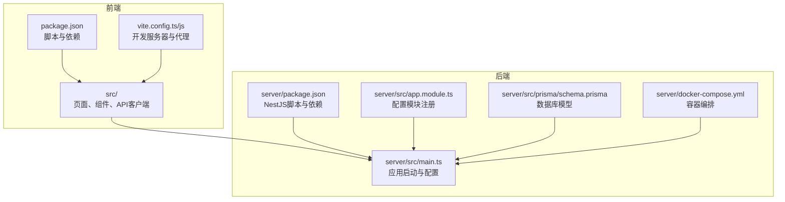
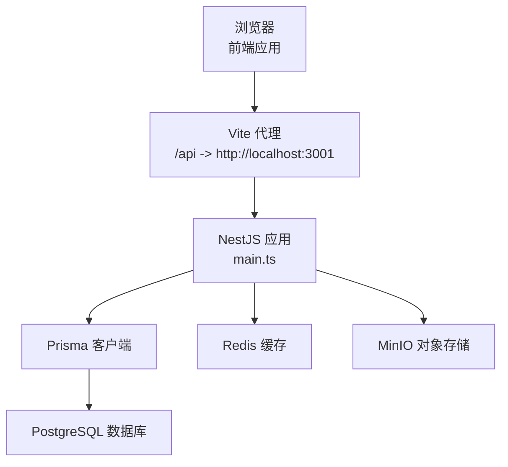
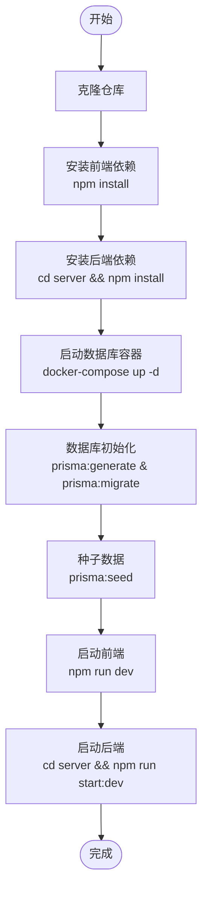
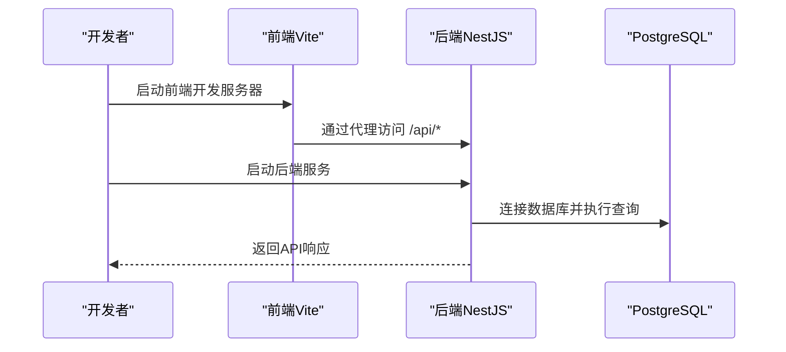
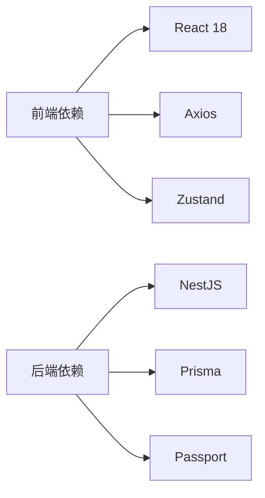

# 快速开始

<cite>
**本文引用的文件**
- [package.json](file://package.json)
- [server/package.json](file://server/package.json)
- [vite.config.js](file://vite.config.js)
- [vite.config.ts](file://vite.config.ts)
- [server/src/main.ts](file://server/src/main.ts)
- [server/src/app.module.ts](file://server/src/app.module.ts)
- [server/src/prisma/schema.prisma](file://server/src/prisma/schema.prisma)
- [server/docker-compose.yml](file://server/docker-compose.yml)
- [src/api/client.ts](file://src/api/client.ts)
- [src/pages/Login.tsx](file://src/pages/Login.tsx)
- [src/store/authStore.ts](file://src/store/authStore.ts)
- [src/hooks/useAuth.ts](file://src/hooks/useAuth.ts)
- [src/router/routes.ts](file://src/router/routes.ts)
- [tsconfig.json](file://tsconfig.json)
- [tsconfig.node.json](file://tsconfig.node.json)
- [README.md](file://README.md)
</cite>

## 目录
1. [简介](#简介)
2. [项目结构](#项目结构)
3. [核心组件](#核心组件)
4. [架构概览](#架构概览)
5. [详细组件分析](#详细组件分析)
6. [依赖分析](#依赖分析)
7. [性能考虑](#性能考虑)
8. [故障排除指南](#故障排除指南)
9. [结论](#结论)
10. [附录](#附录)

## 简介
本指南旨在帮助新开发者在30分钟内成功运行预算管理系统。项目采用前后端分离架构：前端基于React 18 + TypeScript，后端基于NestJS，数据库使用PostgreSQL，配合Prisma ORM进行数据建模与迁移。

## 项目结构
项目采用分层组织方式，主要目录如下：
- 根目录：前端应用源码、构建配置与脚本
- server目录：后端服务源码、配置与数据库模型
- src/api：前端API客户端封装
- src/pages：页面组件
- src/store：状态管理（Zustand）
- server/src/prisma：数据库Schema定义
- server/docker-compose.yml：数据库与对象存储容器编排

**图示来源**
- [package.json:1-45](file://package.json#L1-L45)
- [server/package.json:1-96](file://server/package.json#L1-L96)
- [vite.config.ts:1-24](file://vite.config.ts#L1-L24)
- [server/src/main.ts:1-51](file://server/src/main.ts#L1-L51)
- [server/src/app.module.ts:1-52](file://server/src/app.module.ts#L1-L52)
- [server/src/prisma/schema.prisma:1-448](file://server/src/prisma/schema.prisma#L1-L448)
- [server/docker-compose.yml:1-59](file://server/docker-compose.yml#L1-L59)

**章节来源**
- [README.md:1-77](file://README.md#L1-L77)
- [package.json:1-45](file://package.json#L1-L45)
- [server/package.json:1-96](file://server/package.json#L1-L96)

## 核心组件
- 前端开发服务器：Vite提供热更新与代理，端口默认5173，代理/api到后端3001端口
- 后端服务：NestJS应用，启用CORS、全局验证管道、Swagger文档，全局前缀/api
- 数据库：PostgreSQL，使用Prisma进行ORM映射与迁移
- 状态管理：Zustand + localStorage持久化
- API客户端：Axios封装，统一拦截器与错误处理

**章节来源**
- [vite.config.ts:15-23](file://vite.config.ts#L15-L23)
- [server/src/main.ts:13-47](file://server/src/main.ts#L13-L47)
- [server/src/prisma/schema.prisma:1-11](file://server/src/prisma/schema.prisma#L1-L11)
- [src/api/client.ts:1-183](file://src/api/client.ts#L1-L183)
- [src/store/authStore.ts:1-31](file://src/store/authStore.ts#L1-L31)

## 架构概览
系统采用前后端分离架构，前端通过代理访问后端API，后端通过Prisma连接PostgreSQL数据库，并提供Swagger文档。

**图示来源**
- [vite.config.ts:17-19](file://vite.config.ts#L17-L19)
- [server/src/main.ts:43-47](file://server/src/main.ts#L43-L47)
- [server/src/prisma/schema.prisma:8-11](file://server/src/prisma/schema.prisma#L8-L11)
- [server/docker-compose.yml:4-20](file://server/docker-compose.yml#L4-L20)
- [server/docker-compose.yml:22-34](file://server/docker-compose.yml#L22-L34)
- [server/docker-compose.yml:36-53](file://server/docker-compose.yml#L36-L53)

## 详细组件分析

### 环境要求
- Node.js：建议使用LTS版本（18.x或20.x），TypeScript 5.x，Vite 5.x
- 数据库：PostgreSQL 16（Docker镜像已提供）
- 可选：Redis 7、MinIO（对象存储）

**章节来源**
- [server/docker-compose.yml:6](file://server/docker-compose.yml#L6)
- [server/docker-compose.yml:24](file://server/docker-compose.yml#L24)
- [server/docker-compose.yml:38](file://server/docker-compose.yml#L38)

### 安装步骤
1) 克隆仓库并进入项目根目录
2) 安装前端依赖
3) 安装后端依赖
4) 启动数据库容器（PostgreSQL、Redis、MinIO）
5) 初始化数据库（Prisma迁移与种子数据）
6) 启动前端开发服务器
7) 启动后端服务

**图示来源**
- [server/package.json:21-24](file://server/package.json#L21-L24)
- [server/docker-compose.yml:1-59](file://server/docker-compose.yml#L1-L59)

**章节来源**
- [README.md:27-38](file://README.md#L27-L38)
- [server/package.json:8-24](file://server/package.json#L8-L24)

### 开发环境配置
- 环境变量（后端）：通过ConfigModule加载.env文件，支持CORS_ORIGIN、PORT等配置
- 数据库连接：DATABASE_URL指向PostgreSQL，Prisma Schema已定义
- API代理：前端Vite将/api代理到后端3001端口
- 前端API基础URL：VITE_API_BASE_URL可覆盖默认http://localhost:3000/api

**章节来源**
- [server/src/app.module.ts:25-28](file://server/src/app.module.ts#L25-L28)
- [server/src/main.ts:14-17](file://server/src/main.ts#L14-L17)
- [server/src/main.ts:43-47](file://server/src/main.ts#L43-L47)
- [vite.config.ts:17-19](file://vite.config.ts#L17-L19)
- [src/api/client.ts:4](file://src/api/client.ts#L4)

### 启动指南
- 前端开发服务器：在项目根目录执行npm run dev，默认端口5173
- 后端服务：在server目录执行npm run start:dev，默认端口3001，Swagger在/api/docs
- 数据库初始化：先生成Prisma客户端，再执行迁移，最后可执行种子数据

**图示来源**
- [vite.config.ts:15-23](file://vite.config.ts#L15-L23)
- [server/src/main.ts:43-47](file://server/src/main.ts#L43-L47)
- [server/src/prisma/schema.prisma:8-11](file://server/src/prisma/schema.prisma#L8-L11)

**章节来源**
- [README.md:61-63](file://README.md#L61-L63)
- [server/src/main.ts:31-40](file://server/src/main.ts#L31-L40)

### 依赖分析
- 前端依赖：React 18、Ant Design、Axios、Zustand、Recharts等
- 后端依赖：NestJS、Prisma、Passport、BullMQ、Winston等
- 构建工具：TypeScript、Vite、ESLint

**图示来源**
- [package.json:12-33](file://package.json#L12-L33)
- [server/package.json:26-51](file://server/package.json#L26-L51)

**章节来源**
- [package.json:12-43](file://package.json#L12-L43)
- [server/package.json:26-77](file://server/package.json#L26-L77)

## 性能考虑
- 前端：使用懒加载组件减少首屏体积；合理拆分路由以提升加载速度
- 后端：启用全局验证管道减少无效请求；使用Prisma查询优化与索引
- 数据库：为常用查询字段建立索引；合理使用事务与批量操作
- 缓存：Redis可用于会话与热点数据缓存

## 故障排除指南
- 端口冲突
  - 前端端口：修改vite.config.ts中的server.port
  - 后端端口：设置环境变量PORT或在main.ts中调整
- 数据库连接失败
  - 检查DATABASE_URL格式与可达性
  - 确认PostgreSQL容器已启动且端口映射正确
- CORS错误
  - 配置CORS_ORIGIN允许前端域名
  - 确保credentials: true与前端Cookie一致
- API代理不通
  - 确认代理目标地址与后端端口一致
  - 检查防火墙与网络策略
- 登录鉴权问题
  - 检查Token存储与请求头Authorization
  - 确认后端JWT配置与前端拦截器一致

**章节来源**
- [vite.config.ts:15-23](file://vite.config.ts#L15-L23)
- [server/src/main.ts:14-17](file://server/src/main.ts#L14-L17)
- [src/api/client.ts:22-44](file://src/api/client.ts#L22-L44)
- [src/hooks/useAuth.ts:16-18](file://src/hooks/useAuth.ts#L16-L18)

## 结论
通过本快速开始指南，您可以在30分钟内完成环境准备、安装依赖、启动数据库与服务，并成功访问预算管理系统。建议在开发过程中遵循配置规范与错误排查流程，确保开发效率与稳定性。

## 附录
- 访问地址：前端本地开发地址见README中的本地开发地址
- 路由配置：前端路由采用懒加载，支持多页面导航
- TypeScript配置：严格模式与路径别名配置便于维护

**章节来源**
- [README.md:61-63](file://README.md#L61-L63)
- [src/router/routes.ts:1-122](file://src/router/routes.ts#L1-L122)
- [tsconfig.json:18-22](file://tsconfig.json#L18-L22)
- [tsconfig.node.json:1-11](file://tsconfig.node.json#L1-L11)