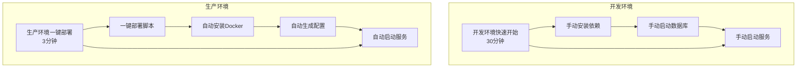
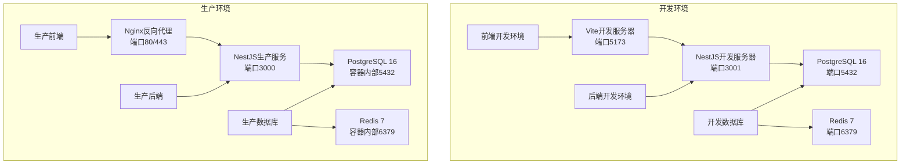
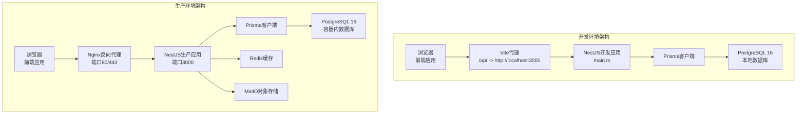
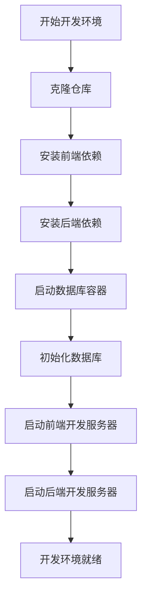
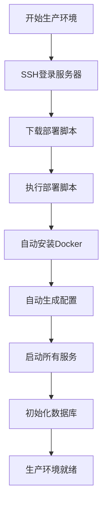
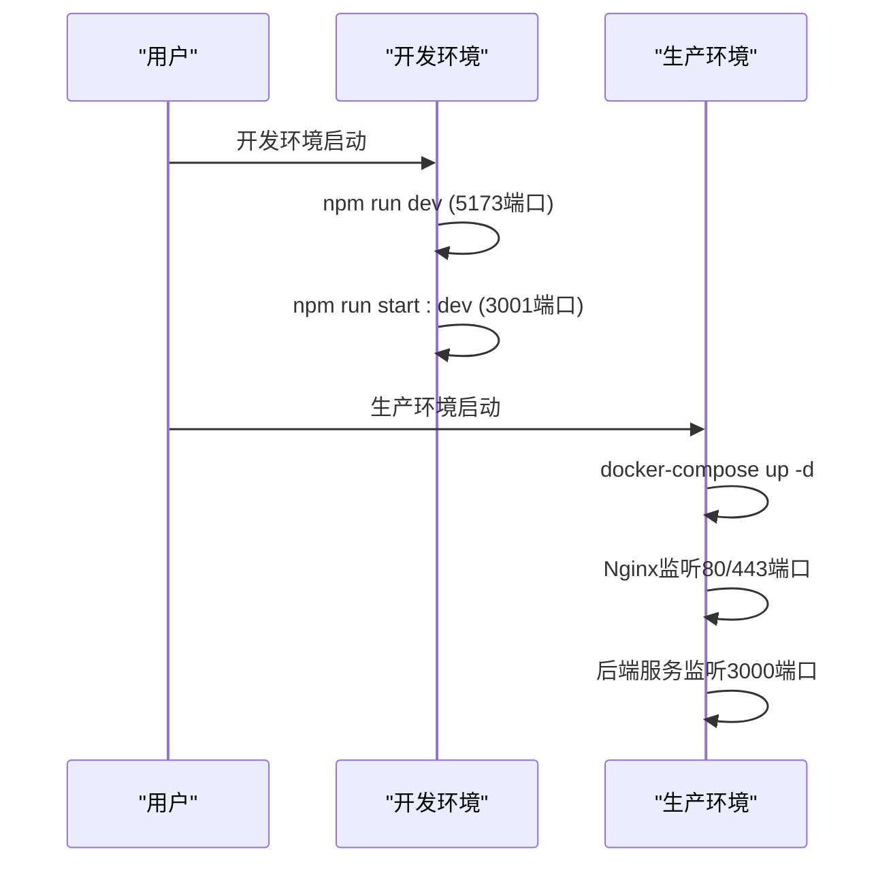
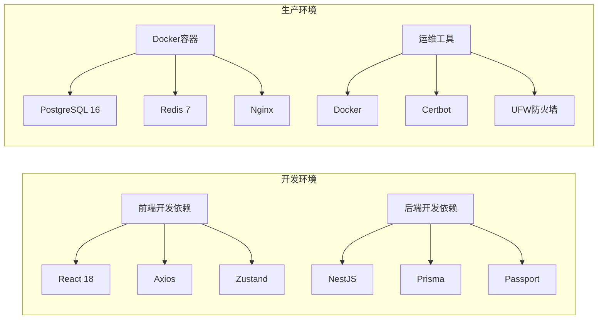

# 快速开始

<cite>
**本文引用的文件**
- [QUICK_START.md](file://QUICK_START.md)
- [DEPLOYMENT_GUIDE.md](file://DEPLOYMENT_GUIDE.md)
- [README.md](file://README.md)
- [deploy.sh](file://deploy.sh)
- [docker-compose.prod.yml](file://docker-compose.prod.yml)
- [server/docker-compose.yml](file://server/docker-compose.yml)
- [package.json](file://package.json)
- [server/package.json](file://server/package.json)
- [vite.config.js](file://vite.config.js)
- [vite.config.ts](file://vite.config.ts)
- [server/src/main.ts](file://server/src/main.ts)
- [server/src/app.module.ts](file://server/src/app.module.ts)
- [server/src/prisma/schema.prisma](file://server/src/prisma/schema.prisma)
- [src/api/client.ts](file://src/api/client.ts)
- [src/pages/Login.tsx](file://src/pages/Login.tsx)
- [src/store/authStore.ts](file://src/store/authStore.ts)
- [src/hooks/useAuth.ts](file://src/hooks/useAuth.ts)
- [src/router/routes.ts](file://src/router/routes.ts)
- [tsconfig.json](file://tsconfig.json)
- [tsconfig.node.json](file://tsconfig.node.json)
</cite>

## 更新摘要
**变更内容**
- 新增3分钟快速部署路径，提供一键部署脚本
- 整合生产环境部署指南与开发环境指南
- 补充企业级部署的安全加固和运维建议
- 优化部署流程，区分开发环境与生产环境

## 目录
1. [简介](#简介)
2. [部署方式选择](#部署方式选择)
3. [开发环境快速开始](#开发环境快速开始)
4. [生产环境3分钟部署](#生产环境3分钟部署)
5. [项目结构](#项目结构)
6. [核心组件](#核心组件)
7. [架构概览](#架构概览)
8. [详细组件分析](#详细组件分析)
9. [依赖分析](#依赖分析)
10. [性能考虑](#性能考虑)
11. [故障排除指南](#故障排除指南)
12. [结论](#结论)
13. [附录](#附录)

## 简介
本指南旨在帮助新开发者根据不同的需求场景快速运行预算管理系统。项目提供两种部署方式：开发环境快速开始（30分钟）和生产环境一键部署（3分钟）。开发环境适合个人学习和功能验证，生产环境适合企业级部署和长期使用。

## 部署方式选择

### 开发环境快速开始（推荐给个人开发者）
- 适合：个人学习、功能验证、本地开发
- 时间：约30分钟
- 特点：手动配置、灵活定制、便于调试
- 适用场景：开发测试、学习研究

### 生产环境一键部署（推荐给企业用户）
- 适合：企业部署、生产环境、团队协作
- 时间：约3分钟（脚本执行10-15分钟）
- 特点：自动化部署、安全配置、运维完善
- 适用场景：正式上线、企业使用



**章节来源**
- [QUICK_START.md:1-106](file://QUICK_START.md#L1-L106)
- [DEPLOYMENT_GUIDE.md:1-383](file://DEPLOYMENT_GUIDE.md#L1-L383)

## 开发环境快速开始

### 环境要求
- **操作系统**：Windows、macOS或Linux
- **Node.js**：建议使用LTS版本（18.x或20.x）
- **数据库**：PostgreSQL 16（Docker镜像已提供）
- **可选工具**：Git、Docker Desktop

### 安装步骤
1) **克隆仓库**
```bash
git clone https://github.com/LouisFantansy/Budget_Management_System.git
cd Budget_Management_System
```

2) **安装前端依赖**
```bash
npm install
```

3) **安装后端依赖**
```bash
cd server
npm install
```

4) **启动数据库容器**
```bash
cd ..
docker-compose up -d
```

5) **初始化数据库**
```bash
# 生成Prisma客户端
npx prisma generate

# 执行数据库迁移
npx prisma migrate dev

# 初始化种子数据
npm run prisma:seed
```

6) **启动开发服务器**
```bash
# 启动前端
npm run dev

# 启动后端（新开终端）
cd server
npm run start:dev
```

### 开发环境配置
- **前端代理**：Vite将/api代理到后端3001端口
- **后端端口**：默认3001，可通过环境变量PORT修改
- **数据库连接**：DATABASE_URL指向本地PostgreSQL
- **API基础URL**：VITE_API_BASE_URL可覆盖默认http://localhost:3000/api

**章节来源**
- [README.md:27-38](file://README.md#L27-L38)
- [server/docker-compose.yml:1-59](file://server/docker-compose.yml#L1-L59)
- [vite.config.ts:15-23](file://vite.config.ts#L15-L23)
- [server/src/main.ts:13-47](file://server/src/main.ts#L13-L47)

## 生产环境一键部署

### 前置条件
- **服务器**：Ubuntu 22.04 LTS 云服务器
- **权限**：root用户或sudo权限
- **网络**：服务器可访问外网
- **硬件**：至少2核CPU、4GB内存、40GB硬盘

### 3分钟部署步骤

#### 第1步：SSH登录服务器
```bash
ssh root@你的服务器IP
```

#### 第2步：下载并执行部署脚本
```bash
# 复制粘贴这一行命令即可
curl -O https://raw.githubusercontent.com/LouisFantansy/Budget_Mgt_Enterprise/main/deploy.sh && chmod +x deploy.sh && sudo ./deploy.sh
```

#### 第3步：等待部署完成
脚本会自动完成以下工作（约10-15分钟）：
- ✅ 安装Docker环境
- ✅ 克隆项目代码
- ✅ 生成安全配置
- ✅ 启动所有服务
- ✅ 初始化数据库

### 部署完成后的访问信息
```bash
🎉 部署完成！
==========================================
访问地址：
  前端：http://你的服务器IP
  后端 API: http://你的服务器IP:3000
  Swagger 文档：http://你的服务器IP:3000/swagger

默认管理员账号：
  用户名：admin
  密码：Admin@123456
```

### 常用运维命令
```bash
# 查看服务状态
cd /opt/Budget_Mgt_Enterprise
sudo docker-compose ps

# 查看日志
sudo docker-compose logs -f

# 重启服务
sudo docker-compose restart

# 备份数据库
sudo ./backup.sh
```

### 安全加固建议
1. **保存好密码**：部署完成后显示的数据库密码和管理员密码要妥善保存
2. **修改默认密码**：首次登录后请立即修改管理员默认密码
3. **定期备份**：建议每天备份数据库
4. **启用HTTPS**：有域名的话建议申请SSL证书

**章节来源**
- [QUICK_START.md:3-106](file://QUICK_START.md#L3-L106)
- [deploy.sh:1-284](file://deploy.sh#L1-L284)
- [docker-compose.prod.yml:1-81](file://docker-compose.prod.yml#L1-L81)

## 项目结构
项目采用分层组织方式，主要目录如下：
- 根目录：前端应用源码、构建配置与脚本
- server目录：后端服务源码、配置与数据库模型
- src/api：前端API客户端封装
- src/pages：页面组件
- src/store：状态管理（Zustand）
- server/src/prisma：数据库Schema定义
- server/docker-compose.yml：开发环境数据库容器编排
- docker-compose.prod.yml：生产环境容器编排



**图示来源**
- [server/docker-compose.yml:1-59](file://server/docker-compose.yml#L1-L59)
- [docker-compose.prod.yml:1-81](file://docker-compose.prod.yml#L1-L81)
- [vite.config.ts:15-23](file://vite.config.ts#L15-L23)
- [server/src/main.ts:13-47](file://server/src/main.ts#L13-L47)

**章节来源**
- [README.md:1-77](file://README.md#L1-L77)
- [package.json:1-45](file://package.json#L1-L45)
- [server/package.json:1-96](file://server/package.json#L1-L96)

## 核心组件
- **前端开发服务器**：Vite提供热更新与代理，端口默认5173，代理/api到后端3001端口
- **后端服务**：NestJS应用，启用CORS、全局验证管道、Swagger文档，全局前缀/api
- **数据库**：PostgreSQL 16，使用Prisma进行ORM映射与迁移
- **状态管理**：Zustand + localStorage持久化
- **API客户端**：Axios封装，统一拦截器与错误处理
- **生产环境**：Nginx反向代理，Docker容器化部署

**章节来源**
- [vite.config.ts:15-23](file://vite.config.ts#L15-L23)
- [server/src/main.ts:13-47](file://server/src/main.ts#L13-L47)
- [server/src/prisma/schema.prisma:1-11](file://server/src/prisma/schema.prisma#L1-L11)
- [src/api/client.ts:1-183](file://src/api/client.ts#L1-L183)
- [src/store/authStore.ts:1-31](file://src/store/authStore.ts#L1-L31)
- [docker-compose.prod.yml:58-72](file://docker-compose.prod.yml#L58-L72)

## 架构概览
系统采用前后端分离架构，支持开发环境和生产环境两种部署模式。开发环境使用本地数据库和开发服务器，生产环境使用Docker容器化部署和Nginx反向代理。



**图示来源**
- [vite.config.ts:17-19](file://vite.config.ts#L17-L19)
- [server/src/main.ts:43-47](file://server/src/main.ts#L43-L47)
- [server/src/prisma/schema.prisma:8-11](file://server/src/prisma/schema.prisma#L8-L11)
- [server/docker-compose.yml:4-20](file://server/docker-compose.yml#L4-L20)
- [server/docker-compose.yml:22-34](file://server/docker-compose.yml#L22-L34)
- [server/docker-compose.yml:36-53](file://server/docker-compose.yml#L36-L53)
- [docker-compose.prod.yml:58-72](file://docker-compose.prod.yml#L58-L72)

## 详细组件分析

### 环境要求对比

#### 开发环境要求
- **Node.js**：建议使用LTS版本（18.x或20.x）
- **数据库**：PostgreSQL 16（Docker镜像已提供）
- **可选**：Redis 7、MinIO（对象存储）

#### 生产环境要求
- **操作系统**：Ubuntu Server 22.04 LTS
- **硬件**：至少2核CPU、4GB内存、40GB硬盘
- **Docker**：自动安装Docker和Docker Compose
- **网络**：可访问外网，开放80/443端口

**章节来源**
- [server/docker-compose.yml:6](file://server/docker-compose.yml#L6)
- [server/docker-compose.yml:24](file://server/docker-compose.yml#L24)
- [server/docker-compose.yml:38](file://server/docker-compose.yml#L38)
- [QUICK_START.md:3-8](file://QUICK_START.md#L3-L8)

### 安装步骤对比

#### 开发环境手动安装


#### 生产环境一键部署


**图示来源**
- [README.md:27-38](file://README.md#L27-L38)
- [QUICK_START.md:19-35](file://QUICK_START.md#L19-L35)
- [deploy.sh:118-134](file://deploy.sh#L118-L134)

**章节来源**
- [README.md:27-38](file://README.md#L27-L38)
- [QUICK_START.md:19-35](file://QUICK_START.md#L19-L35)
- [deploy.sh:118-251](file://deploy.sh#L118-L251)

### 开发环境配置
- **环境变量**：通过ConfigModule加载.env文件，支持CORS_ORIGIN、PORT等配置
- **数据库连接**：DATABASE_URL指向本地PostgreSQL，Prisma Schema已定义
- **API代理**：前端Vite将/api代理到后端3001端口
- **前端API基础URL**：VITE_API_BASE_URL可覆盖默认http://localhost:3000/api

### 生产环境配置
- **Docker容器**：自动拉取PostgreSQL 16、Redis 7、Nginx等官方镜像
- **环境变量**：自动随机生成JWT_SECRET、POSTGRES_PASSWORD、REDIS_PASSWORD
- **安全配置**：自动配置防火墙、SSL证书（可选）
- **服务暴露**：前端通过Nginx暴露80/443端口，后端通过反向代理

**章节来源**
- [server/src/app.module.ts:25-28](file://server/src/app.module.ts#L25-L28)
- [server/src/main.ts:14-17](file://server/src/main.ts#L14-L17)
- [server/src/main.ts:43-47](file://server/src/main.ts#L43-L47)
- [vite.config.ts:17-19](file://vite.config.ts#L17-L19)
- [src/api/client.ts:4](file://src/api/client.ts#L4)
- [deploy.sh:136-164](file://deploy.sh#L136-L164)
- [docker-compose.prod.yml:22-31](file://docker-compose.prod.yml#L22-L31)

### 启动指南对比

#### 开发环境启动
- **前端开发服务器**：在项目根目录执行npm run dev，默认端口5173
- **后端服务**：在server目录执行npm run start:dev，默认端口3001，Swagger在/api/docs
- **数据库初始化**：先生成Prisma客户端，再执行迁移，最后可执行种子数据

#### 生产环境启动
- **服务管理**：使用docker-compose管理所有容器
- **访问地址**：前端http://服务器IP，后端http://服务器IP:3000
- **健康检查**：容器自带健康检查，支持自动重启
- **日志管理**：使用docker-compose logs查看日志



**图示来源**
- [vite.config.ts:15-23](file://vite.config.ts#L15-L23)
- [server/src/main.ts:43-47](file://server/src/main.ts#L43-L47)
- [server/src/prisma/schema.prisma:8-11](file://server/src/prisma/schema.prisma#L8-L11)
- [docker-compose.prod.yml:63-65](file://docker-compose.prod.yml#L63-L65)

**章节来源**
- [README.md:61-63](file://README.md#L61-L63)
- [server/src/main.ts:31-40](file://server/src/main.ts#L31-L40)
- [docker-compose.prod.yml:21-31](file://docker-compose.prod.yml#L21-L31)

## 依赖分析

### 开发环境依赖
- **前端依赖**：React 18、Ant Design、Axios、Zustand、Recharts等
- **后端依赖**：NestJS、Prisma、Passport、BullMQ、Winston等
- **开发工具**：TypeScript、Vite、ESLint、Jest等

### 生产环境依赖
- **容器镜像**：PostgreSQL 16、Redis 7、Nginx、Node.js等
- **自动化工具**：Docker、Docker Compose、Certbot等
- **运维工具**：UFW防火墙、htop监控、unattended-upgrades等



**图示来源**
- [package.json:12-33](file://package.json#L12-L33)
- [server/package.json:26-51](file://server/package.json#L26-L51)
- [deploy.sh:106-114](file://deploy.sh#L106-L114)

**章节来源**
- [package.json:12-43](file://package.json#L12-L43)
- [server/package.json:26-77](file://server/package.json#L26-L77)
- [deploy.sh:106-114](file://deploy.sh#L106-L114)

## 性能考虑

### 开发环境性能优化
- **前端**：使用懒加载组件减少首屏体积；合理拆分路由以提升加载速度
- **后端**：启用全局验证管道减少无效请求；使用Prisma查询优化与索引
- **数据库**：为常用查询字段建立索引；合理使用事务与批量操作

### 生产环境性能优化
- **容器优化**：合理配置容器资源限制和重启策略
- **数据库优化**：PostgreSQL参数调优，Redis内存策略配置
- **网络优化**：Nginx缓存配置，Gzip压缩启用
- **监控优化**：系统资源监控，容器健康检查

### 安全加固建议
- **防火墙配置**：仅开放必要端口，启用UFW防火墙
- **SSH安全**：禁用密码登录，使用公钥认证
- **自动更新**：配置unattended-upgrades自动安全更新
- **SSL证书**：申请Let's Encrypt免费SSL证书

**章节来源**
- [DEPLOYMENT_GUIDE.md:173-223](file://DEPLOYMENT_GUIDE.md#L173-L223)
- [deploy.sh:71-85](file://deploy.sh#L71-L85)
- [deploy.sh:176-211](file://deploy.sh#L176-L211)

## 故障排除指南

### 开发环境常见问题
- **端口冲突**
  - 前端端口：修改vite.config.ts中的server.port
  - 后端端口：设置环境变量PORT或在main.ts中调整
- **数据库连接失败**
  - 检查DATABASE_URL格式与可达性
  - 确认PostgreSQL容器已启动且端口映射正确
- **CORS错误**
  - 配置CORS_ORIGIN允许前端域名
  - 确保credentials: true与前端Cookie一致
- **API代理不通**
  - 确认代理目标地址与后端端口一致
  - 检查防火墙与网络策略

### 生产环境常见问题
- **服务无法访问**
  - 检查docker-compose ps服务状态
  - 检查防火墙ufw status端口开放情况
  - 检查Nginx配置和SSL证书
- **数据库连接失败**
  - 检查PostgreSQL容器状态
  - 查看数据库日志docker logs budget_postgres
  - 测试连接docker exec budget_postgres psql
- **部署脚本执行失败**
  - 检查网络连接：ping github.com
  - 确认有sudo权限
  - 检查磁盘空间是否充足

### 登录鉴权问题
- **开发环境**：检查Token存储与请求头Authorization
- **生产环境**：确认JWT_SECRET配置与前端拦截器一致
- **管理员密码**：首次登录后立即修改默认密码

**章节来源**
- [vite.config.ts:15-23](file://vite.config.ts#L15-L23)
- [server/src/main.ts:14-17](file://server/src/main.ts#L14-L17)
- [src/api/client.ts:22-44](file://src/api/client.ts#L22-L44)
- [src/hooks/useAuth.ts:16-18](file://src/hooks/useAuth.ts#L16-L18)
- [QUICK_START.md:92-101](file://QUICK_START.md#L92-L101)
- [DEPLOYMENT_GUIDE.md:267-306](file://DEPLOYMENT_GUIDE.md#L267-L306)

## 结论
通过本快速开始指南，您可以根据不同的需求场景选择合适的部署方式：

- **个人开发者**：使用开发环境快速开始，在30分钟内完成环境准备和功能验证
- **企业用户**：使用生产环境一键部署，在3分钟内完成自动化部署和配置

两种部署方式都提供了完整的功能演示和良好的用户体验。建议在开发过程中遵循配置规范与错误排查流程，确保开发效率与稳定性。

## 附录

### 访问地址参考
- **开发环境**：前端本地开发地址http://localhost:5173，后端API地址http://localhost:3001/api
- **生产环境**：前端访问地址http://服务器IP，后端API地址http://服务器IP:3000/api

### 路由配置参考
- **前端路由**：采用懒加载，支持多页面导航
- **后端路由**：全局前缀/api，支持Swagger文档

### TypeScript配置参考
- **开发环境**：严格模式与路径别名配置便于维护
- **生产环境**：TypeScript编译配置，Docker容器内运行

### 常用命令参考
- **开发环境**：npm run dev、npm run start:dev、npx prisma migrate dev
- **生产环境**：docker-compose ps、docker-compose logs -f、docker-compose restart

**章节来源**
- [README.md:61-63](file://README.md#L61-L63)
- [src/router/routes.ts:1-122](file://src/router/routes.ts#L1-L122)
- [tsconfig.json:18-22](file://tsconfig.json#L18-L22)
- [tsconfig.node.json:1-11](file://tsconfig.node.json#L1-L11)
- [docker-compose.prod.yml:63-65](file://docker-compose.prod.yml#L63-L65)