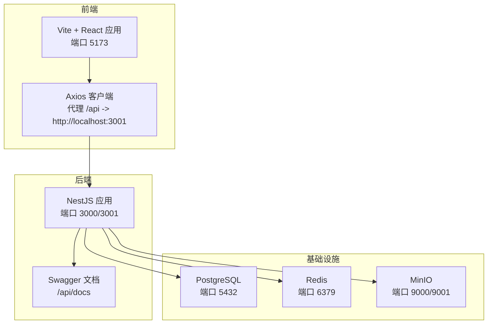
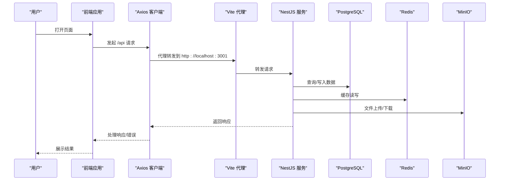
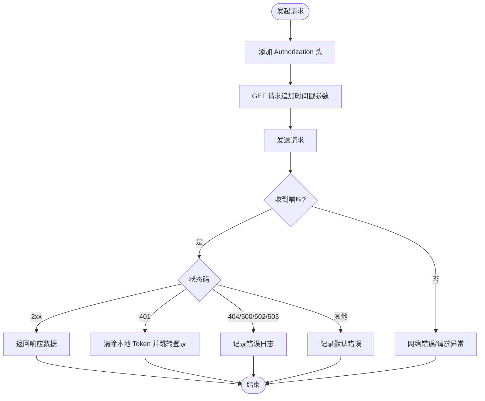
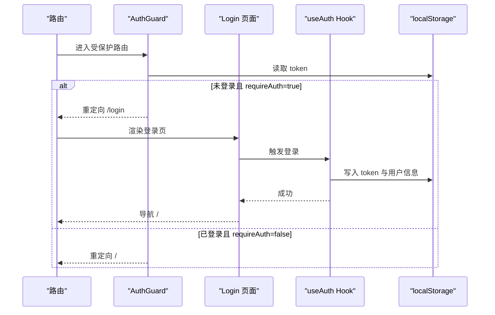
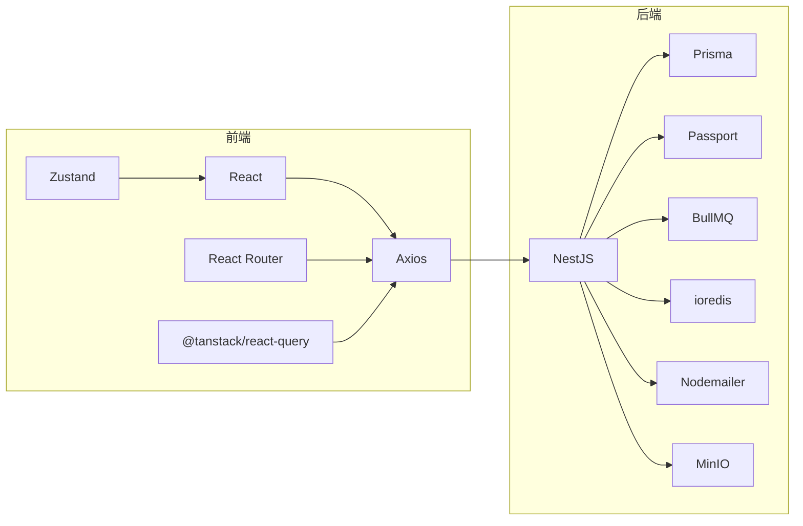

# 故障排除与常见问题

<cite>
**本文引用的文件**
- [package.json](file://package.json)
- [server/package.json](file://server/package.json)
- [vite.config.js](file://vite.config.js)
- [server/src/main.ts](file://server/src/main.ts)
- [server/src/app.module.ts](file://server/src/app.module.ts)
- [src/api/client.ts](file://src/api/client.ts)
- [src/components/guard/AuthGuard.tsx](file://src/components/guard/AuthGuard.tsx)
- [src/hooks/useAuth.ts](file://src/hooks/useAuth.ts)
- [src/pages/Login.tsx](file://src/pages/Login.tsx)
- [src/router/routes.ts](file://src/router/routes.ts)
- [src/utils/constants.ts](file://src/utils/constants.ts)
- [server/docker-compose.yml](file://server/docker-compose.yml)
</cite>

## 目录
1. [简介](#简介)
2. [项目结构](#项目结构)
3. [核心组件](#核心组件)
4. [架构总览](#架构总览)
5. [详细组件分析](#详细组件分析)
6. [依赖关系分析](#依赖关系分析)
7. [性能考虑](#性能考虑)
8. [故障排除指南](#故障排除指南)
9. [结论](#结论)
10. [附录](#附录)

## 简介
本文件面向预算管理系统的使用者与维护者，提供一套系统化的故障排除与常见问题解答。内容覆盖环境配置、依赖冲突、端口占用、权限问题、运行时错误（内存泄漏、性能瓶颈、并发问题）、API 调用失败、数据库连接与数据同步异常、浏览器兼容性与前端打包错误，以及问题反馈与报告机制。所有建议均基于仓库现有配置与实现进行归纳总结。

## 项目结构
系统采用前后端分离架构：
- 前端使用 Vite + React，通过代理将 /api 请求转发至后端服务，默认端口为 5173；API 基础地址默认指向 http://localhost:3000/api。
- 后端使用 NestJS，全局启用 CORS，允许来源为 http://localhost:5173，并设置全局 API 前缀为 api；Swagger 文档路径为 /api/docs。
- 开发环境通过 Docker Compose 提供 PostgreSQL、Redis、MinIO 等基础设施服务，便于快速搭建与隔离测试。

图表来源
- [vite.config.js:13-21](file://vite.config.js#L13-L21)
- [server/src/main.ts:14-17](file://server/src/main.ts#L14-L17)
- [server/src/main.ts:40-47](file://server/src/main.ts#L40-L47)
- [server/docker-compose.yml:12-13](file://server/docker-compose.yml#L12-L13)
- [server/docker-compose.yml:26-27](file://server/docker-compose.yml#L26-L27)
- [server/docker-compose.yml:43-45](file://server/docker-compose.yml#L43-L45)

章节来源
- [vite.config.js:1-23](file://vite.config.js#L1-L23)
- [server/src/main.ts:1-51](file://server/src/main.ts#L1-L51)
- [server/docker-compose.yml:1-59](file://server/docker-compose.yml#L1-L59)

## 核心组件
- 前端 Axios 客户端：统一处理请求头、Token 注入、GET 请求防缓存、响应错误分类与统一处理。
- 认证守卫与认证 Hook：基于本地存储 Token 的路由保护与用户状态管理。
- 路由配置：按需懒加载页面组件，区分需要认证与无需认证的路由。
- 常量与配置：集中定义预算类型、状态、分页、文件大小与类型等常量，便于统一校验与展示。

章节来源
- [src/api/client.ts:100-183](file://src/api/client.ts#L100-L183)
- [src/components/guard/AuthGuard.tsx:13-31](file://src/components/guard/AuthGuard.tsx#L13-L31)
- [src/hooks/useAuth.ts:8-84](file://src/hooks/useAuth.ts#L8-L84)
- [src/router/routes.ts:25-121](file://src/router/routes.ts#L25-L121)
- [src/utils/constants.ts:5-111](file://src/utils/constants.ts#L5-L111)

## 架构总览
下图展示了从前端到后端再到基础设施的整体交互流程，以及常见故障点的定位思路。

图表来源
- [vite.config.js:15-20](file://vite.config.js#L15-L20)
- [server/src/main.ts:43-47](file://server/src/main.ts#L43-L47)
- [src/api/client.ts:105-136](file://src/api/client.ts#L105-L136)

## 详细组件分析

### 前端 Axios 客户端与 API 错误处理
- 请求拦截：自动注入 Authorization 头与 Bearer Token；对 GET 请求追加时间戳参数以避免缓存。
- 响应拦截：根据状态码执行统一错误处理（401 清除本地 Token 并跳转登录；404/500/502/503 等分别输出对应提示）；网络错误与未知错误分别记录。
- 文件上传/下载：支持进度回调与 Blob 下载，便于大文件场景的可视化反馈。

图表来源
- [src/api/client.ts:22-44](file://src/api/client.ts#L22-L44)
- [src/api/client.ts:47-94](file://src/api/client.ts#L47-L94)
- [src/api/client.ts:105-136](file://src/api/client.ts#L105-L136)

章节来源
- [src/api/client.ts:100-183](file://src/api/client.ts#L100-L183)

### 认证守卫与登录流程
- 认证守卫：根据 requireAuth 决定是否重定向至登录页；未登录访问受保护路由将被拦截。
- 登录页面：演示账号与密码硬编码于前端（生产环境应改为真实 API），成功后写入本地存储并导航至首页。
- 认证 Hook：封装登录、登出、修改密码、获取当前用户、判断登录状态与读取用户信息等逻辑。

图表来源
- [src/components/guard/AuthGuard.tsx:13-31](file://src/components/guard/AuthGuard.tsx#L13-L31)
- [src/pages/Login.tsx:14-38](file://src/pages/Login.tsx#L14-L38)
- [src/hooks/useAuth.ts:12-21](file://src/hooks/useAuth.ts#L12-L21)

章节来源
- [src/components/guard/AuthGuard.tsx:13-31](file://src/components/guard/AuthGuard.tsx#L13-L31)
- [src/pages/Login.tsx:1-102](file://src/pages/Login.tsx#L1-L102)
- [src/hooks/useAuth.ts:8-84](file://src/hooks/useAuth.ts#L8-L84)

### 路由与页面懒加载
- 使用 React.lazy 与 Suspense 实现页面级懒加载，减少首屏体积。
- routes 配置明确标注每个路由是否需要认证，配合 AuthGuard 实现访问控制。

章节来源
- [src/router/routes.ts:1-122](file://src/router/routes.ts#L1-L122)

### 常量与配置
- 预算类型、状态、紧急程度、审批状态、通知类型、用户与部门状态、分页与文件大小限制、允许的文件类型、财年配置、系统名称与版本等集中定义，便于统一校验与展示。

章节来源
- [src/utils/constants.ts:5-111](file://src/utils/constants.ts#L5-L111)

## 依赖关系分析
- 前端依赖：React、React Router、Ant Design、Axios、Zustand、React Query 等；构建工具链为 Vite + TypeScript。
- 后端依赖：NestJS、Prisma、Passport、BullMQ、ioredis、Nodemailer、MinIO 等；测试与格式化工具齐全。
- 代理与跨域：前端 Vite 代理目标为 http://localhost:3001，后端启用 CORS 并设置全局前缀与 Swagger 文档。

图表来源
- [package.json:12-33](file://package.json#L12-L33)
- [server/package.json:26-51](file://server/package.json#L26-L51)

章节来源
- [package.json:1-45](file://package.json#L1-L45)
- [server/package.json:1-96](file://server/package.json#L1-L96)

## 性能考虑
- 前端懒加载：通过路由懒加载降低首屏资源压力，结合 Suspense 提升用户体验。
- 请求缓存与防抖：Axios GET 请求追加时间戳参数避免缓存；对于频繁查询可结合 React Query 的缓存策略与去重。
- 并发与队列：后端使用 BullMQ + ioredis 实现异步任务队列，适合导入导出、报表生成等耗时任务。
- 数据库与缓存：Prisma 与 Redis 双通道优化读写性能，注意连接池与键空间设计。

[本节为通用指导，不直接分析具体文件]

## 故障排除指南

### 环境配置与依赖问题
- 依赖安装失败或版本冲突
  - 症状：npm install 或 yarn 安装报错、TypeScript 编译失败、Vite 启动报错。
  - 排查步骤：
    - 清理缓存并重新安装：删除 node_modules 与 lock 文件后重试。
    - 检查 Node 版本与包管理器版本是否满足项目要求。
    - 分别在前后端目录执行安装命令，确保各自依赖独立安装。
  - 参考文件：
    - [package.json:12-11](file://package.json#L12-L11)
    - [server/package.json:8-24](file://server/package.json#L8-L24)

- 端口占用
  - 症状：Vite 启动失败（端口 5173）、后端启动失败（端口 3000/3001）。
  - 排查步骤：
    - 使用系统工具查看占用进程并释放端口。
    - 在 Vite 配置中修改 server.port 或在后端配置中调整 PORT。
  - 参考文件：
    - [vite.config.js:14](file://vite.config.js#L14)
    - [server/src/main.ts:43](file://server/src/main.ts#L43)

- 权限问题
  - 症状：Docker 启动失败、卷挂载失败、MinIO 控制台无法访问。
  - 排查步骤：
    - 检查 Docker 服务状态与权限（Windows 用户组加入 docker-users）。
    - 确认数据卷目录存在且具备读写权限。
  - 参考文件：
    - [server/docker-compose.yml:14-15](file://server/docker-compose.yml#L14-L15)
    - [server/docker-compose.yml:28-29](file://server/docker-compose.yml#L28-L29)
    - [server/docker-compose.yml:46-48](file://server/docker-compose.yml#L46-L48)

### 运行时错误排查
- 内存泄漏
  - 症状：长时间运行后内存持续增长、页面卡顿。
  - 排查步骤：
    - 使用浏览器开发者工具的 Memory 面板监控堆快照变化。
    - 检查是否存在未清理的事件监听器、定时器与订阅（如 React Query、Zustand、WebSocket）。
    - 确保组件卸载时清理副作用（useEffect cleanup）。
  - 参考文件：
    - [src/api/client.ts:22-44](file://src/api/client.ts#L22-L44)
    - [src/hooks/useAuth.ts:26-36](file://src/hooks/useAuth.ts#L26-L36)

- 性能瓶颈
  - 症状：接口响应慢、页面渲染卡顿。
  - 排查步骤：
    - 使用 Performance 面板分析长任务与重绘。
    - 检查路由懒加载与组件拆分是否合理。
    - 后端关注数据库慢查询与 Redis 缓存命中率。
  - 参考文件：
    - [src/router/routes.ts:3-22](file://src/router/routes.ts#L3-L22)
    - [server/package.json:46-47](file://server/package.json#L46-L47)

- 并发问题
  - 症状：多实例部署时数据不一致、队列堆积。
  - 排查步骤：
    - 检查 BullMQ 队列与 Redis 连接配置。
    - 确认 Prisma 连接池与事务边界正确。
  - 参考文件：
    - [server/package.json:46-47](file://server/package.json#L46-L47)
    - [server/package.json:36](file://server/package.json#L36)

### API 调用失败
- 常见原因
  - 代理配置错误：前端代理目标与后端监听端口不一致。
  - 跨域问题：CORS 来源未包含前端地址或凭证未开启。
  - 认证失败：Token 丢失或过期导致 401。
  - 网络异常：DNS 解析失败、防火墙阻断、代理链路中断。
- 排查步骤
  - 检查 Vite 代理配置与后端 CORS 设置。
  - 在浏览器 Network 面板观察请求与响应状态码。
  - 在 Axios 响应拦截器中确认错误分支是否触发。
  - 使用 curl 或 Postman 直连后端接口验证服务可用性。
- 参考文件：
  - [vite.config.js:15-20](file://vite.config.js#L15-L20)
  - [server/src/main.ts:14-17](file://server/src/main.ts#L14-L17)
  - [src/api/client.ts:52-94](file://src/api/client.ts#L52-L94)

### 数据库连接与数据同步异常
- 连接问题
  - 症状：后端启动时报数据库连接失败、Prisma 初始化失败。
  - 排查步骤：
    - 使用 docker-compose 启动数据库与缓存服务，确认健康检查通过。
    - 检查数据库凭据、网络连通性与防火墙规则。
    - 在后端配置中核对 DATABASE_URL 与环境变量。
  - 参考文件：
    - [server/docker-compose.yml:6-20](file://server/docker-compose.yml#L6-L20)
    - [server/src/app.module.ts:25-28](file://server/src/app.module.ts#L25-L28)

- 数据同步异常
  - 症状：导入/导出数据不一致、报表数据延迟。
  - 排查步骤：
    - 核对 MinIO 存储桶与对象键命名规则。
    - 检查 BullMQ 队列作业状态与重试策略。
    - 对比源数据与目标表字段映射与约束。
  - 参考文件：
    - [server/docker-compose.yml:37-53](file://server/docker-compose.yml#L37-L53)
    - [server/package.json:46](file://server/package.json#L46)

### 浏览器兼容性与前端打包错误
- 兼容性问题
  - 症状：部分浏览器不支持 ES 模块或新语法。
  - 排查步骤：
    - 检查 browserslist 配置与 polyfill 引入。
    - 使用兼容性检测工具（如 Can I Use）验证特性支持度。
  - 参考文件：
    - [package.json:42](file://package.json#L42)

- 打包错误
  - 症状：构建失败、模块解析错误、样式加载异常。
  - 排查步骤：
    - 清理 node_modules 与 dist 缓存后重试构建。
    - 检查 Vite 插件与别名配置（@ 指向 src）。
    - 确认 TypeScript 声明文件与类型定义完整。
  - 参考文件：
    - [vite.config.js:8-12](file://vite.config.js#L8-L12)
    - [package.json:8](file://package.json#L8)

### 问题反馈与报告机制
- 建议流程
  - 收集信息：操作系统、浏览器版本、Node/Vite/NestJS 版本、依赖版本。
  - 复现步骤：最小化复现路径、关键操作序列、期望与实际结果。
  - 日志与截图：浏览器控制台错误、网络面板请求详情、后端日志片段。
  - 提交渠道：通过项目 Issue 模板提交，附带上述信息以便快速定位。
- 参考文件：
  - [package.json:12-11](file://package.json#L12-L11)
  - [server/package.json:8-24](file://server/package.json#L8-L24)

## 结论
本指南围绕预算管理系统的实际配置与实现，提供了从环境准备到运行时问题的全链路排查方法。建议在开发与运维实践中遵循“先代理/跨域，再数据库/缓存，后前端打包”的顺序化排查思路，并结合日志与网络面板进行定位。对于高频问题（如 401、端口占用、依赖冲突），可建立标准化的检查清单与自动化脚本，提升问题解决效率。

## 附录
- 快速检查清单
  - 前端：Vite 代理是否指向正确后端端口；CORS 来源是否包含前端地址；Token 是否存在。
  - 后端：端口是否被占用；Prisma 连接字符串是否正确；Swagger 文档是否可达。
  - 基础设施：Docker 服务是否运行；健康检查是否通过；卷权限是否正确。
  - 性能：浏览器 Memory/Performance 面板是否发现异常；队列与缓存是否积压。

[本节为通用指导，不直接分析具体文件]