# 数据库设计

<cite>
**本文引用的文件**
- [schema.prisma](file://server/src/prisma/schema.prisma)
- [README.md（后端）](file://server/README.md)
- [app.module.ts](file://server/src/app.module.ts)
- [main.ts](file://server/src/main.ts)
- [package.json（后端）](file://server/package.json)
- [FEATURES_GUIDE.md](file://FEATURES_GUIDE.md)
- [IMPLEMENTATION_PROGRESS.md](file://IMPLEMENTATION_PROGRESS.md)
</cite>

## 目录
1. [简介](#简介)
2. [项目结构](#项目结构)
3. [核心组件](#核心组件)
4. [架构总览](#架构总览)
5. [详细组件分析](#详细组件分析)
6. [依赖分析](#依赖分析)
7. [性能考虑](#性能考虑)
8. [故障排查指南](#故障排查指南)
9. [结论](#结论)
10. [附录](#附录)

## 简介
本文件围绕预算管理系统的数据库设计进行系统化说明，基于 Prisma 数据模型 schema.prisma，梳理实体关系、字段定义、约束与索引策略，并结合业务流程给出 ER 关系图、数据验证与迁移流程、版本管理策略、数据字典与枚举、以及备份与维护最佳实践。该系统采用 NestJS + Prisma + PostgreSQL 架构，配合 Swagger 文档与 Docker 化部署。

## 项目结构
后端采用模块化组织，数据库模型集中于 Prisma Schema；应用入口负责全局配置（CORS、Swagger、ValidationPipe），并通过脚本驱动 Prisma Client 生成与数据库迁移。

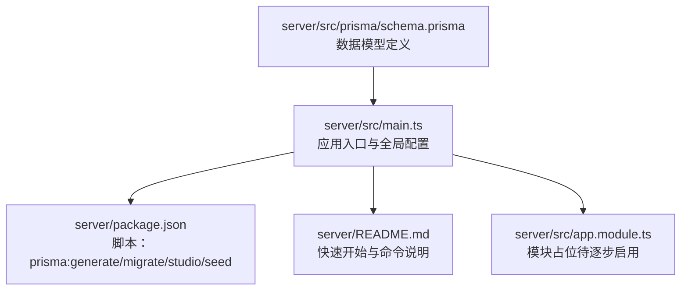

**图示来源**
- [schema.prisma:1-448](file://server/src/prisma/schema.prisma#L1-L448)
- [main.ts:1-51](file://server/src/main.ts#L1-L51)
- [package.json（后端）:1-96](file://server/package.json#L1-L96)
- [README.md（后端）:1-210](file://server/README.md#L1-L210)
- [app.module.ts:1-52](file://server/src/app.module.ts#L1-L52)

**章节来源**
- [schema.prisma:1-448](file://server/src/prisma/schema.prisma#L1-L448)
- [main.ts:1-51](file://server/src/main.ts#L1-L51)
- [package.json（后端）:1-96](file://server/package.json#L1-L96)
- [README.md（后端）:1-210](file://server/README.md#L1-L210)
- [app.module.ts:1-52](file://server/src/app.module.ts#L1-L52)

## 核心组件
本节聚焦用户与权限、组织结构、预算管理、采购管理、工作流与审批、数据导入（三单关联）、通知系统、审计日志、附件管理等核心数据模型，说明其字段、关系与约束。

- 用户与权限
  - User：用户基本信息、状态、登录尝试次数、所属部门、角色集合
  - Role：角色定义、显示名、描述、是否系统内置、权限集合、用户集合
  - Permission：权限模块与动作、唯一标识、归属角色
  - UserRole：用户-角色多对多关联表（联合主键）
  - RolePermission：角色-权限多对多关联表（联合主键）

- 组织结构
  - Department：部门树形结构（父子关系）、负责人、预算管理员、排序、状态、用户与预算集合

- 预算管理
  - Budget：预算编号唯一、类型（OPEX/CAPEX）、年份、版本、父版本、总额、已用、冻结、状态、条目、审批流、采购请求、调整记录、备注
  - BudgetItem：预算条目明细、单价、数量、小计、已用、冻结、月度计划、项目/用途/供应商/交货日期
  - BudgetAdjustment：预算调整单据、原始金额、调整金额、原因、调整快照、状态、创建者

- 采购管理
  - PurchaseRequest：申请编号唯一、申请人、部门、预算、条目集合、总金额、用途、紧急度、状态、审批流、附件
  - PurchaseItem：采购条目明细、单价、数量、小计、供应商/交货日期/备注

- 工作流与审批
  - WorkflowTemplate：流程模板（类型、步骤定义、触发条件、版本）
  - ApprovalFlow：审批流（目标类型与ID、步骤集合、当前步骤、状态、完成时间）
  - ApprovalStep：审批步骤（顺序、名称、审批人或角色、动作、评论、操作时间）

- 数据导入（三单关联）
  - PurchaseOrder：采购订单、供应商、金额、订单日期、状态、预算号、映射ID、批次ID
  - Settlement：结算单、发票号、金额、结算日期、供应商、预算号、映射ID、批次ID
  - DataMapping：三单匹配（预算号/订单号/结算号、匹配状态、差异金额、核验信息）

- 通知系统
  - Notification：通知类型、标题、内容、跳转链接、渠道、是否已读

- 审计日志
  - AuditLog：用户、动作、模块、目标类型与ID、旧值/新值、IP/UserAgent

- 附件管理
  - Attachment：文件名、大小、MIME、存储路径、上传者、目标类型与ID

**章节来源**
- [schema.prisma:15-370](file://server/src/prisma/schema.prisma#L15-L370)

## 架构总览
下图展示数据库层与业务模块的关系，突出用户-角色-权限、部门-预算-采购-审批、三单关联与审计日志等关键链路。

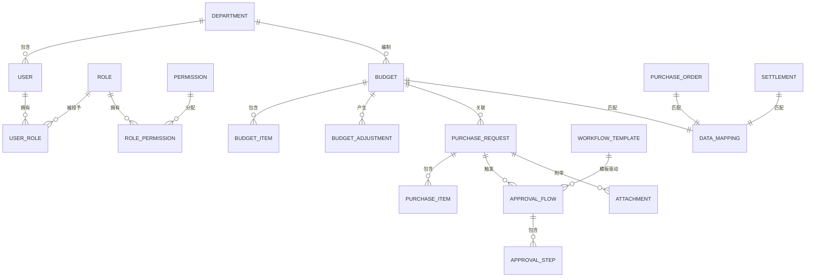

**图示来源**
- [schema.prisma:15-370](file://server/src/prisma/schema.prisma#L15-L370)

## 详细组件分析

### 用户与权限模型
- 设计要点
  - 用户状态、登录尝试次数用于账户安全控制
  - 多对多关系通过中间表实现，支持灵活的角色与权限组合
  - 系统内置角色标记避免误删
- 关系映射
  - User 与 Department 多对一
  - User 与 Role 多对多（UserRole）
  - Role 与 Permission 多对多（RolePermission）

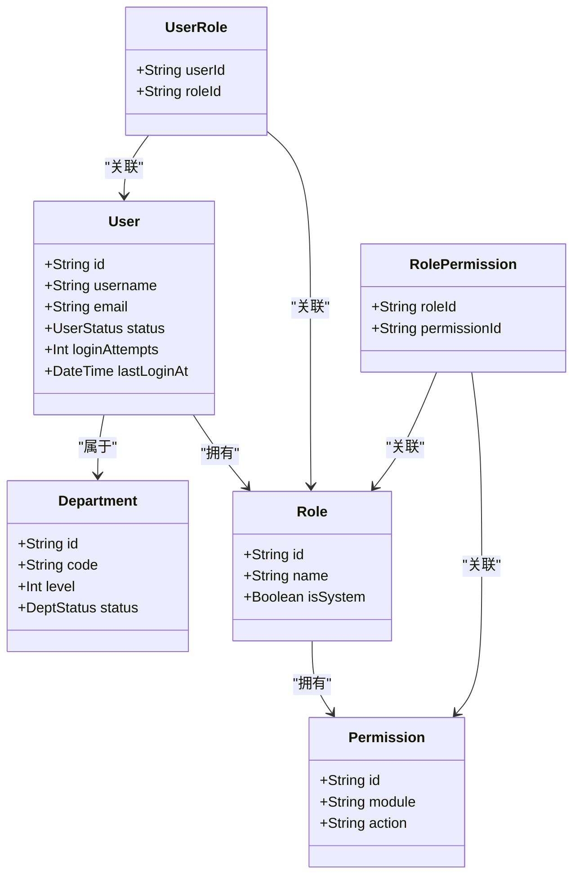

**图示来源**
- [schema.prisma:15-80](file://server/src/prisma/schema.prisma#L15-L80)

**章节来源**
- [schema.prisma:15-80](file://server/src/prisma/schema.prisma#L15-L80)

### 组织结构模型
- 设计要点
  - 部门树形结构通过 parentId/children 实现层级
  - 支持负责人与预算管理员配置
  - 状态与排序字段便于展示与筛选
- 关系映射
  - Department 与 User、Budget 一对多

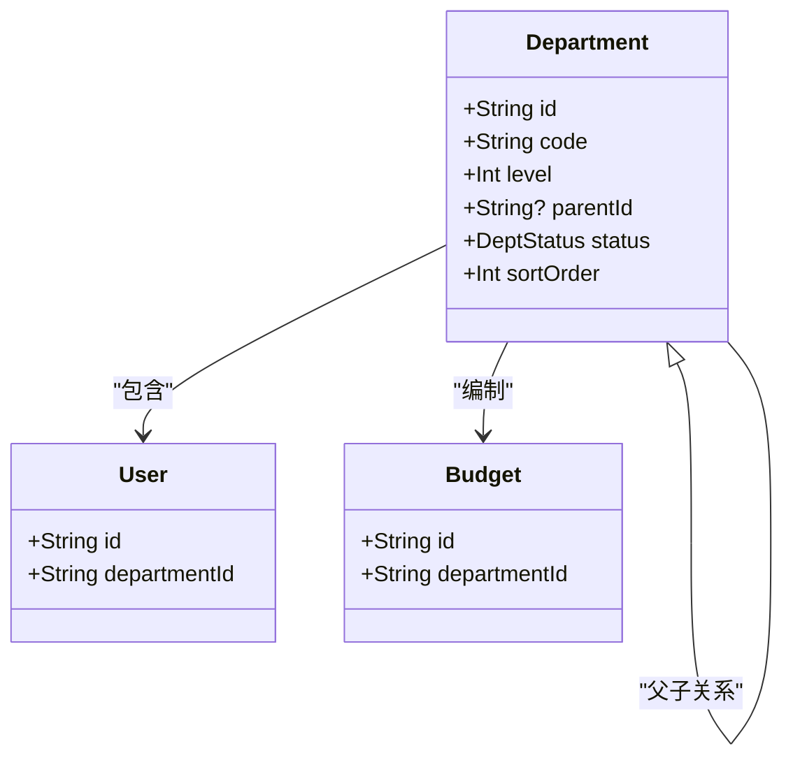

**图示来源**
- [schema.prisma:84-103](file://server/src/prisma/schema.prisma#L84-L103)

**章节来源**
- [schema.prisma:84-103](file://server/src/prisma/schema.prisma#L84-L103)

### 预算管理模型
- 设计要点
  - 预算编号唯一、版本号用于调整追踪
  - 冻结金额用于“占用”控制，已用金额用于“实际使用”
  - 预算条目支持月度计划 JSON 字段
- 关系映射
  - Budget 与 BudgetItem、BudgetAdjustment、PurchaseRequest、ApprovalFlow 一对多

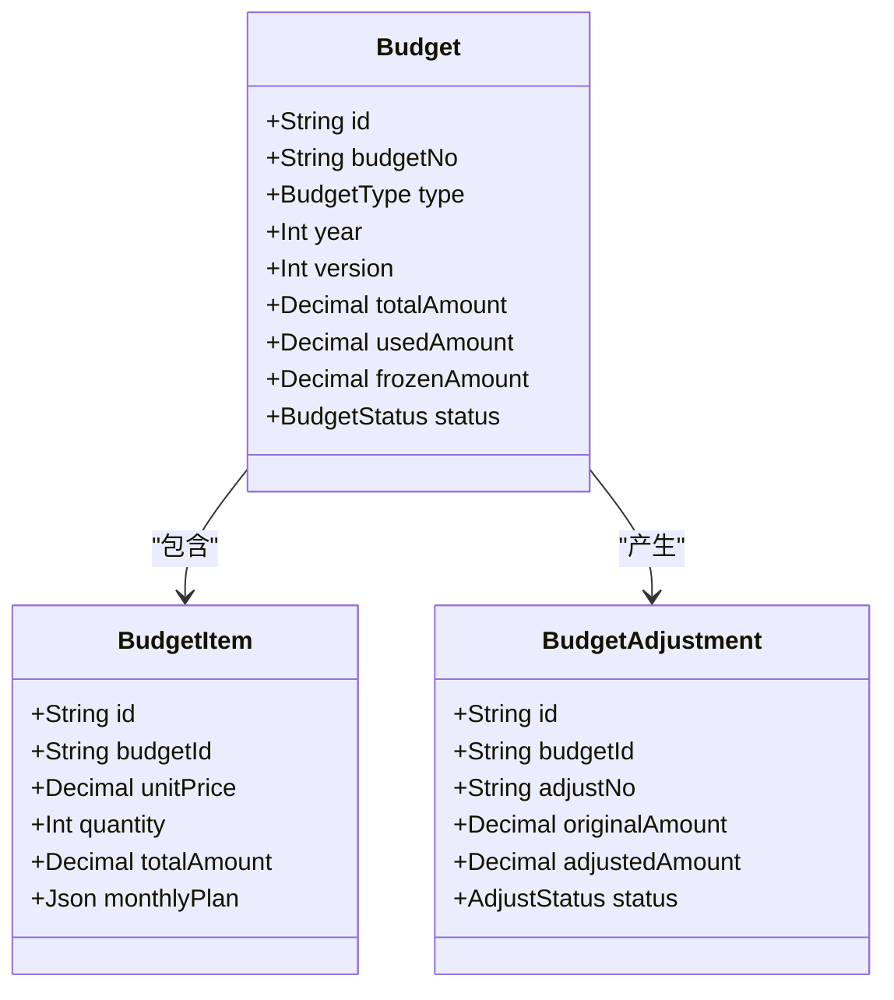

**图示来源**
- [schema.prisma:107-174](file://server/src/prisma/schema.prisma#L107-L174)

**章节来源**
- [schema.prisma:107-174](file://server/src/prisma/schema.prisma#L107-L174)

### 采购管理模型
- 设计要点
  - 采购申请与预算强关联，自动占用预算额度
  - 紧急度枚举支持差异化审批策略
  - 附件与审批流贯穿申请生命周期
- 关系映射
  - PurchaseRequest 与 Budget、PurchaseItem、ApprovalFlow、Attachment 一对多

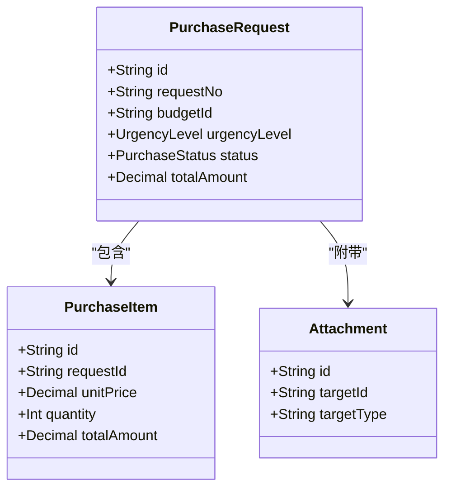

**图示来源**
- [schema.prisma:178-216](file://server/src/prisma/schema.prisma#L178-L216)

**章节来源**
- [schema.prisma:178-216](file://server/src/prisma/schema.prisma#L178-L216)

### 工作流与审批模型
- 设计要点
  - 流程模板定义步骤与条件，审批流绑定目标实体
  - 审批步骤支持指定审批人或按角色匹配
- 关系映射
  - WorkflowTemplate 与 ApprovalFlow 一对多
  - ApprovalFlow 与 ApprovalStep 一对多

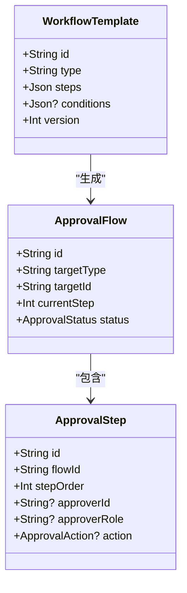

**图示来源**
- [schema.prisma:220-264](file://server/src/prisma/schema.prisma#L220-L264)

**章节来源**
- [schema.prisma:220-264](file://server/src/prisma/schema.prisma#L220-L264)

### 数据导入（三单关联）模型
- 设计要点
  - 通过预算号、订单号、结算号建立匹配关系
  - 匹配状态支持完全/部分/无匹配，差异金额辅助核对
- 关系映射
  - PurchaseOrder、Settlement 与 DataMapping 多对一

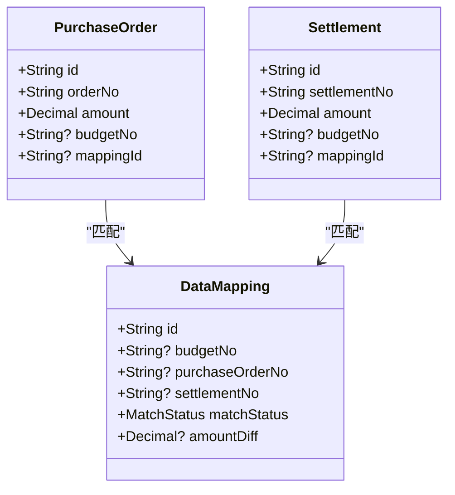

**图示来源**
- [schema.prisma:268-313](file://server/src/prisma/schema.prisma#L268-L313)

**章节来源**
- [schema.prisma:268-313](file://server/src/prisma/schema.prisma#L268-L313)

### 通知系统与审计日志
- 设计要点
  - 通知类型区分审批待办、结果、预算预警、系统消息等
  - 审计日志记录用户行为、模块、目标与变更前后值
- 关系映射
  - Notification 与 User 一对多
  - AuditLog 与用户/模块/时间索引

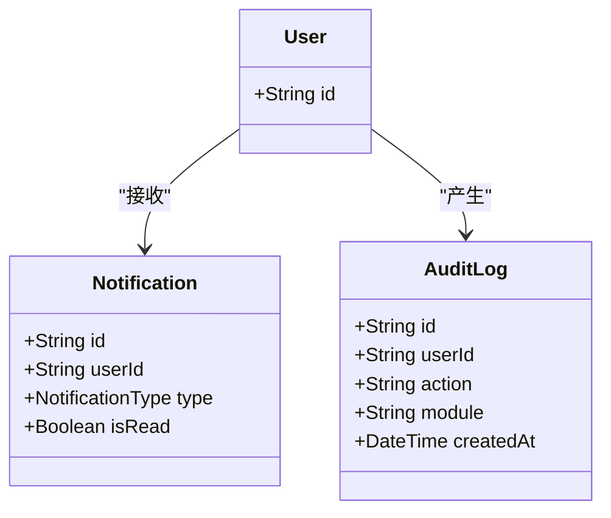

**图示来源**
- [schema.prisma:317-351](file://server/src/prisma/schema.prisma#L317-L351)

**章节来源**
- [schema.prisma:317-351](file://server/src/prisma/schema.prisma#L317-L351)

## 依赖分析
- 外部依赖
  - Prisma Client 用于类型安全的数据库访问
  - PostgreSQL 作为主数据库
  - Swagger 用于 API 文档
- 内部模块
  - 应用入口负责全局配置与启动
  - 模块占位（待逐步启用）体现分层与解耦

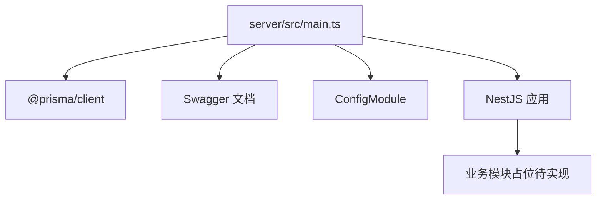

**图示来源**
- [main.ts:1-51](file://server/src/main.ts#L1-L51)
- [package.json（后端）:26-51](file://server/package.json#L26-L51)
- [app.module.ts:1-52](file://server/src/app.module.ts#L1-L52)

**章节来源**
- [main.ts:1-51](file://server/src/main.ts#L1-L51)
- [package.json（后端）:26-51](file://server/package.json#L26-L51)
- [app.module.ts:1-52](file://server/src/app.module.ts#L1-L52)

## 性能考虑
- 索引策略
  - 用户：username、email、departmentId
  - 角色：name
  - 部门：code、parentId
  - 预算：budgetNo、departmentId、year、status
  - 采购：requestNo、budgetId、status
  - 审批：targetId、status
  - 三单：orderNo、settlementNo、budgetNo
  - 通知：userId、isRead
  - 审计：userId、module、createdAt
  - 附件：targetId、uploaderId
- 查询优化建议
  - 在高频筛选字段上保持索引
  - 使用分页与排序参数，避免一次性返回大结果集
  - 对复杂报表使用物化视图或缓存（Redis）
- 存储与并发
  - PostgreSQL 事务隔离级别与锁粒度合理设置
  - 预算占用/释放采用原子更新与乐观锁

[本节为通用指导，无需列出具体文件来源]

## 故障排查指南
- 常见问题
  - 数据库连接失败：检查 DATABASE_URL 环境变量与容器连通性
  - Prisma Client 未生成：执行生成脚本并确认 schema.prisma 语法正确
  - 迁移失败：查看迁移日志，确保 PostgreSQL 版本满足要求
- 审计与诊断
  - 使用 Swagger 文档定位接口
  - 审计日志记录关键操作，便于回溯
  - 通知系统用于提醒审批与异常状态

**章节来源**
- [README.md（后端）:78-97](file://server/README.md#L78-L97)
- [schema.prisma:334-351](file://server/src/prisma/schema.prisma#L334-L351)

## 结论
本数据库设计以 Prisma Schema 为核心，围绕用户权限、组织结构、预算与采购、审批流与三单关联构建了完整的企业级预算管理体系。通过明确的实体关系、索引策略与迁移脚本，既满足当前业务需求，也为后续扩展（如自定义审批流、数据分析、报表增强）提供了坚实基础。

[本节为总结性内容，无需列出具体文件来源]

## 附录

### 数据验证规则
- 唯一性
  - 用户名、邮箱、部门编码、预算编号、采购申请编号、调整编号、订单编号、结算编号、权限名称等字段具备唯一约束
- 外键一致性
  - 多对一关系均通过外键字段与引用字段建立约束
- 默认值
  - 状态枚举默认值、时间戳默认值、布尔默认值等
- 枚举约束
  - 用户状态、部门状态、预算类型、预算状态、调整状态、采购状态、紧急度、审批状态/动作、匹配状态、通知类型等

**章节来源**
- [schema.prisma:15-448](file://server/src/prisma/schema.prisma#L15-L448)

### 索引策略与性能优化
- 建议索引
  - 用户：username、email、departmentId
  - 角色：name
  - 部门：code、parentId
  - 预算：budgetNo、departmentId、year、status
  - 采购：requestNo、budgetId、status
  - 审批：targetId、status
  - 三单：orderNo、settlementNo、budgetNo
  - 通知：userId、isRead
  - 审计：userId、module、createdAt
  - 附件：targetId、uploaderId
- 性能优化
  - 分页查询、排序字段索引、批量导入/导出任务队列（BullMQ/Redis）
  - 预算占用/释放采用原子更新与幂等设计

**章节来源**
- [schema.prisma:31-351](file://server/src/prisma/schema.prisma#L31-L351)
- [package.json（后端）:46-50](file://server/package.json#L46-L50)

### 数据迁移流程与版本管理
- 迁移流程
  - 生成 Prisma Client：prisma:generate
  - 运行数据库迁移：prisma:migrate
  - 可选：Prisma Studio 可视化调试
  - 可选：种子数据：prisma:seed
- 版本管理
  - 通过版本号字段（预算版本、流程模板版本）追踪变更
  - 迁移脚本与 Prisma 版本保持一致，遵循语义化版本

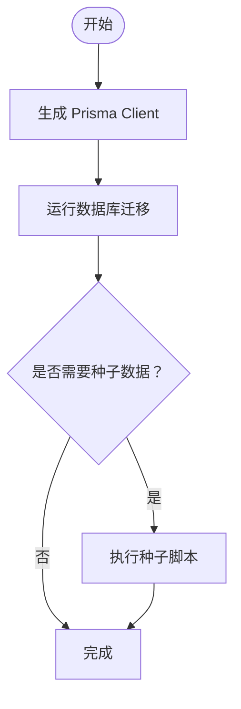

**图示来源**
- [README.md（后端）:86-97](file://server/README.md#L86-L97)
- [package.json（后端）:21-24](file://server/package.json#L21-L24)

**章节来源**
- [README.md（后端）:86-97](file://server/README.md#L86-L97)
- [package.json（后端）:21-24](file://server/package.json#L21-L24)

### 数据字典与业务规则
- 数据字典（节选）
  - 用户：用户名、邮箱、状态、登录尝试次数、所属部门
  - 角色：名称、显示名、描述、是否系统内置
  - 权限：模块、动作、名称
  - 部门：编码、层级、父部门、负责人、预算管理员、状态
  - 预算：编号、名称、类型、年份、版本、总额、已用、冻结、状态、备注
  - 预算条目：名称、类别、规格、单价、数量、小计、月度计划
  - 预算调整：编号、原始金额、调整金额、原因、状态
  - 采购申请：编号、申请人、部门、预算、条目、总金额、用途、紧急度、状态
  - 采购条目：名称、规格、数量、单价、小计
  - 工作流模板：类型、步骤、条件、版本
  - 审批流：目标类型与ID、当前步骤、状态
  - 审批步骤：顺序、名称、审批人或角色、动作
  - 三单：订单/结算编号、供应商、金额、日期、状态、预算号、映射ID
  - 数据映射：预算号/订单号/结算号、匹配状态、差异金额
  - 通知：类型、标题、内容、渠道、是否已读
  - 审计日志：用户、动作、模块、目标、旧值/新值、IP/UserAgent
  - 附件：文件名、大小、MIME、存储路径、上传者、目标类型与ID
- 业务规则
  - 预算生命周期：可用 → 占用 → 实际使用；占用/释放与审批状态联动
  - 申请状态流转：草稿 → 待审批 → 审批中 → 已批准/已拒绝/取消
  - 预算调整必须生成新版本并记录调整快照
  - 三单匹配支持差异核对与人工核验

**章节来源**
- [schema.prisma:15-370](file://server/src/prisma/schema.prisma#L15-L370)
- [FEATURES_GUIDE.md:47-127](file://FEATURES_GUIDE.md#L47-L127)

### 备份、恢复与维护最佳实践
- 备份
  - 使用 PostgreSQL 备份工具定期导出数据
  - 对关键表（预算、采购、审批、三单）制定增量备份策略
- 恢复
  - 在测试环境先行验证备份文件完整性
  - 恢复后执行一致性检查与索引重建
- 维护
  - 定期清理过期通知与审计日志
  - 监控慢查询与高并发场景下的锁竞争
  - 通过 Prisma Studio 与日志分析定位问题

**章节来源**
- [README.md（后端）:1-210](file://server/README.md#L1-L210)
- [schema.prisma:317-351](file://server/src/prisma/schema.prisma#L317-L351)