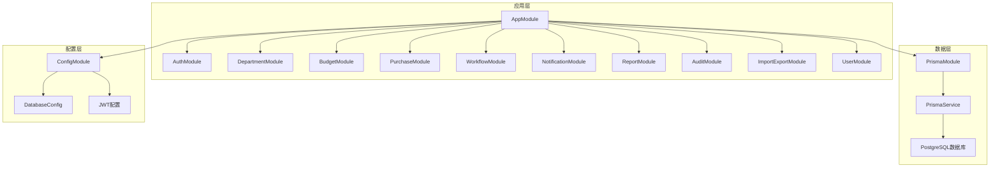
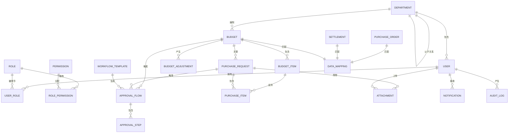
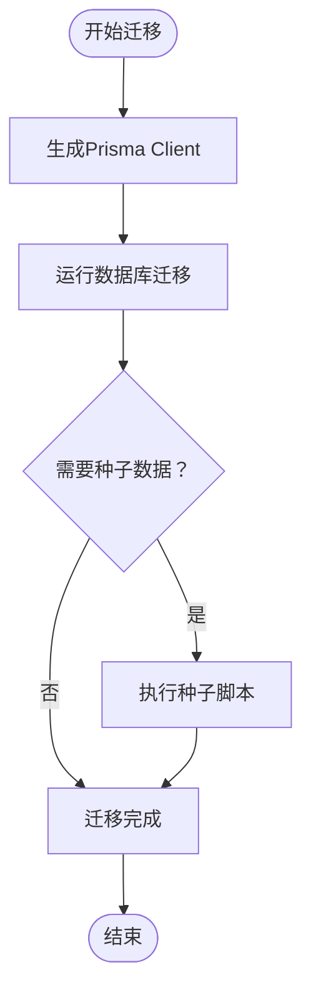
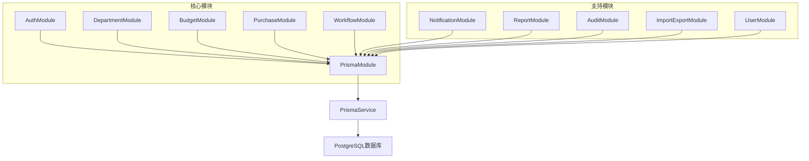

# 数据库设计

<cite>
**本文引用的文件**
- [schema.prisma](file://server/src/prisma/schema.prisma)
- [seed.ts](file://server/src/prisma/seed.ts)
- [README.md（后端）](file://server/README.md)
- [app.module.ts](file://server/src/app.module.ts)
- [main.ts](file://server/src/main.ts)
- [package.json（后端）](file://server/package.json)
- [budget.module.ts](file://server/src/modules/budget/budget.module.ts)
- [purchase.module.ts](file://server/src/modules/purchase/purchase.module.ts)
- [workflow.module.ts](file://server/src/modules/workflow/workflow.module.ts)
- [create-budget.dto.ts](file://server/src/modules/budget/dto/create-budget.dto.ts)
- [create-purchase-request.dto.ts](file://server/src/modules/purchase/dto/create-purchase-request.dto.ts)
- [create-department.dto.ts](file://server/src/modules/department/dto/create-department.dto.ts)
- [prisma.service.ts](file://server/src/common/prisma/prisma.service.ts)
- [database.config.ts](file://server/src/config/database.config.ts)
</cite>

## 更新摘要
**所做更改**
- 完整更新了18个核心实体的数据模型定义
- 新增了详细的实体关系图和ER关系图
- 扩展了数据验证规则和业务规则说明
- 更新了性能优化和索引策略
- 完善了数据迁移和种子数据流程
- 增加了完整的数据字典和枚举值定义

## 目录
1. [简介](#简介)
2. [项目架构概览](#项目架构概览)
3. [核心数据模型](#核心数据模型)
4. [实体关系分析](#实体关系分析)
5. [数据验证与约束](#数据验证与约束)
6. [索引策略与性能优化](#索引策略与性能优化)
7. [数据迁移与版本管理](#数据迁移与版本管理)
8. [种子数据与初始化](#种子数据与初始化)
9. [业务规则与流程](#业务规则与流程)
10. [备份与维护策略](#备份与维护策略)
11. [模块集成与依赖关系](#模块集成与依赖关系)
12. [故障排查指南](#故障排查指南)

## 简介
本文件全面阐述预算管理系统的数据库设计，基于完整的Prisma ORM数据模型。系统采用NestJS + Prisma + PostgreSQL架构，实现了18个核心实体的完整数据模型，包括用户权限管理、组织结构、预算管理、采购管理、工作流审批、数据导入导出、通知系统、审计日志和附件管理等模块。

系统通过类型安全的Prisma Client提供数据库访问，支持复杂的多对多关系、级联删除、事务处理和高性能查询。每个实体都经过精心设计，确保数据完整性、业务逻辑正确性和系统可扩展性。

## 项目架构概览
系统采用模块化架构，所有业务模块通过AppModule统一管理，PrismaModule提供数据库连接服务。

**图示来源**
- [app.module.ts:17-42](file://server/src/app.module.ts#L17-L42)
- [main.ts:9-58](file://server/src/main.ts#L9-L58)

## 核心数据模型

### 用户与权限模型
系统实现了完整的用户权限体系，支持多角色多权限的灵活配置。

**用户实体 (User)**
- 主键：UUID
- 唯一约束：username, email
- 外键：departmentId → Department
- 索引：username, email, departmentId
- 字段：用户名、密码哈希、姓名、邮箱、电话、头像、状态、登录时间、登录尝试次数

**角色实体 (Role)**
- 主键：UUID
- 唯一约束：name
- 字段：角色名称、显示名称、描述、系统内置标志
- 索引：name

**权限实体 (Permission)**
- 主键：UUID
- 唯一约束：name
- 字段：模块、动作、权限名称
- 索引：module, name

**用户-角色关联 (UserRole)**
- 复合主键：userId, roleId
- 级联删除：Cascade
- 索引：userId, roleId

**角色-权限关联 (RolePermission)**
- 复合主键：roleId, permissionId
- 级联删除：Cascade
- 索引：roleId, permissionId

### 组织结构模型
支持树形部门结构，实现层级管理和权限继承。

**部门实体 (Department)**
- 主键：UUID
- 唯一约束：code
- 外键：parentId → Department (自关联)
- 字段：部门名称、编码、层级、父部门ID、负责人ID、预算管理员ID、排序号、状态
- 索引：code, parentId

### 预算管理模型
完整的预算生命周期管理，支持预算编制、执行、调整和监控。

**预算实体 (Budget)**
- 主键：UUID
- 唯一约束：budgetNo
- 外键：departmentId → Department
- 字段：预算编号、名称、部门ID、类型(OPEX/CAPEX)、年份、版本号、父版本ID、总额、已用金额、冻结金额、状态
- 索引：budgetNo, departmentId, year, status

**预算条目实体 (BudgetItem)**
- 主键：UUID
- 外键：budgetId → Budget (Cascade删除)
- 字段：预算ID、名称、类别、规格、功能描述、单价、数量、小计、已用、冻结、月度计划JSON、项目、用途、供应商、交货日期、排序号
- 索引：budgetId

**预算调整实体 (BudgetAdjustment)**
- 主键：UUID
- 唯一约束：adjustNo
- 外键：budgetId → Budget
- 字段：预算ID、调整编号、原始金额、调整金额、原因、调整快照JSON、状态、创建者
- 索引：budgetId, adjustNo

### 采购管理模型
完整的采购申请生命周期管理。

**采购申请实体 (PurchaseRequest)**
- 主键：UUID
- 唯一约束：requestNo
- 外键：budgetId → Budget
- 字段：申请编号、申请人ID、部门ID、预算ID、预算条目ID、总金额、用途、紧急程度、状态、当前步骤
- 索引：requestNo, budgetId, status

**采购条目实体 (PurchaseItem)**
- 主键：UUID
- 外键：requestId → PurchaseRequest (Cascade删除)
- 字段：申请ID、名称、规格、数量、单价、小计、供应商、交货日期、备注
- 索引：requestId

### 工作流与审批模型
灵活的工作流引擎，支持多种审批场景。

**工作流模板实体 (WorkflowTemplate)**
- 主键：UUID
- 字段：名称、类型、步骤定义JSON、触发条件JSON、激活状态、版本号
- 索引：type

**审批流实体 (ApprovalFlow)**
- 主键：UUID
- 外键：templateId → WorkflowTemplate
- 字段：模板ID、目标类型、目标ID、步骤集合、当前步骤、状态、创建时间、完成时间
- 索引：targetId, status

**审批步骤实体 (ApprovalStep)**
- 主键：UUID
- 外键：flowId → ApprovalFlow (Cascade删除)
- 字段：流程ID、步骤序号、步骤名称、审批人ID、审批角色、动作、评论、操作时间
- 索引：flowId, approverId

### 数据导入导出模型
三单关联（采购订单、结算单、预算）的智能匹配系统。

**采购订单实体 (PurchaseOrder)**
- 主键：UUID
- 唯一约束：orderNo
- 字段：订单编号、供应商、金额、订单日期、状态、预算编号、映射ID、导入批次ID
- 索引：orderNo, budgetNo

**结算实体 (Settlement)**
- 主键：UUID
- 唯一约束：settlementNo
- 字段：结算编号、发票号、金额、结算日期、供应商、预算编号、映射ID、导入批次ID
- 索引：settlementNo, budgetNo

**数据映射实体 (DataMapping)**
- 主键：UUID
- 字段：预算编号、订单编号、结算编号、匹配状态、差异金额、核验时间、核验人
- 索引：budgetNo, matchStatus

### 通知系统与审计日志
完整的用户通知和系统审计机制。

**通知实体 (Notification)**
- 主键：UUID
- 外键：userId → User
- 字段：用户ID、类型、标题、内容、跳转链接、已读状态、通知渠道数组
- 索引：userId, isRead

**审计日志实体 (AuditLog)**
- 主键：UUID
- 字段：用户ID、用户名、动作、模块、目标类型、目标ID、旧值JSON、新值JSON、IP、UserAgent
- 索引：userId, module, createdAt

### 附件管理模型
灵活的文件附件管理系统。

**附件实体 (Attachment)**
- 主键：UUID
- 外键：uploaderId → User, targetId → PurchaseRequest
- 字段：文件名、文件大小、MIME类型、存储路径、上传者ID、目标类型、目标ID
- 索引：targetId, uploaderId

**章节来源**
- [schema.prisma:15-448](file://server/src/prisma/schema.prisma#L15-L448)

## 实体关系分析

### ER关系图
系统实现了18个核心实体的复杂关系网络，支持完整的业务流程。

**图示来源**
- [schema.prisma:15-448](file://server/src/prisma/schema.prisma#L15-L448)

### 关系映射详解

**一对一关系**
- User → Department: 多对一，用户属于一个部门
- BudgetItem → PurchaseItem: 一对一支持关系，预算条目支持多个采购条目

**一对多关系**
- Department → User: 一个部门包含多个用户
- Department → Budget: 一个部门编制多个预算
- Budget → BudgetItem: 一个预算包含多个条目
- Budget → BudgetAdjustment: 一个预算产生多次调整
- Budget → PurchaseRequest: 一个预算关联多个采购申请
- PurchaseRequest → PurchaseItem: 一个申请包含多个条目
- ApprovalFlow → ApprovalStep: 一个流程包含多个步骤
- WorkflowTemplate → ApprovalFlow: 一个模板生成多个流程

**多对多关系**
- User → Role: 通过UserRole中间表实现
- Role → Permission: 通过RolePermission中间表实现

**章节来源**
- [schema.prisma:15-448](file://server/src/prisma/schema.prisma#L15-L448)

## 数据验证与约束

### 字段验证规则
系统通过class-validator实现前端和后端双重验证：

**用户实体验证**
- username: 非空字符串，唯一约束
- email: 可选邮箱格式
- password: 必须，使用bcrypt哈希存储
- phone: 可选电话号码格式

**预算实体验证**
- name: 非空字符串
- departmentId: 非空字符串
- type: 枚举验证 (OPEX/CAPEX)
- year: 非空整数，最小值验证
- totalAmount: 非空数字字符串

**采购实体验证**
- budgetId: 非空字符串
- items: 非空数组，至少一个元素
- purpose: 非空字符串
- urgencyLevel: 可选枚举，默认NORMAL

### 数据库约束
- 唯一约束：username、email、budgetNo、requestNo、adjustNo、orderNo、settlementNo
- 外键约束：所有外键字段都有对应的引用关系
- 默认值：状态枚举默认值、时间戳默认值、布尔默认值
- 级联删除：适当的Cascade删除策略

**章节来源**
- [create-budget.dto.ts:1-101](file://server/src/modules/budget/dto/create-budget.dto.ts#L1-L101)
- [create-purchase-request.dto.ts:1-72](file://server/src/modules/purchase/dto/create-purchase-request.dto.ts#L1-L72)
- [create-department.dto.ts:1-40](file://server/src/modules/department/dto/create-department.dto.ts#L1-L40)

## 索引策略与性能优化

### 建议索引策略
系统为高频查询字段建立了完善的索引策略：

**用户相关索引**
- username: 唯一索引，支持用户登录查询
- email: 唯一索引，支持邮件查找
- departmentId: 普通索引，支持部门查询

**预算相关索引**
- budgetNo: 唯一索引，支持预算编号查询
- departmentId: 普通索引，支持部门预算查询
- year: 普通索引，支持年度查询
- status: 普通索引，支持状态过滤

**采购相关索引**
- requestNo: 唯一索引，支持申请编号查询
- budgetId: 普通索引，支持预算关联查询
- status: 普通索引，支持状态过滤

**审批相关索引**
- targetId: 普通索引，支持目标对象查询
- status: 普通索引，支持流程状态查询

**其他重要索引**
- orderNo: 唯一索引，支持订单查询
- settlementNo: 唯通索引，支持结算查询
- budgetNo: 普通索引，支持预算匹配查询
- matchStatus: 普通索引，支持匹配状态查询
- userId: 普通索引，支持用户相关查询
- isRead: 普通索引，支持通知状态查询

### 性能优化建议
- 使用分页查询避免大数据集加载
- 在WHERE子句中使用索引字段
- 合理使用JOIN操作，避免N+1查询
- 对频繁查询的字段建立复合索引
- 使用适当的查询投影减少数据传输
- 实施缓存策略处理热点数据

**章节来源**
- [schema.prisma:32-369](file://server/src/prisma/schema.prisma#L32-L369)

## 数据迁移与版本管理

### 迁移流程
系统提供了完整的数据库迁移和版本管理流程：

**图示来源**
- [README.md:86-97](file://server/README.md#L86-L97)
- [package.json:21-24](file://server/package.json#L21-L24)

### 迁移脚本
系统通过package.json提供标准化的迁移命令：

**开发环境**
- `npm run prisma:generate`: 生成Prisma Client
- `npm run prisma:migrate`: 运行数据库迁移
- `npm run prisma:studio`: 启动Prisma Studio可视化工具

**生产环境**
- `npm run prisma:seed`: 执行种子数据初始化
- `npm run build`: 编译TypeScript代码
- `npm run start:prod`: 启动生产环境

### 版本管理策略
- 使用Git管理schema.prisma文件版本
- 通过Prisma版本控制数据库结构变更
- 采用语义化版本管理API和数据库版本
- 建立迁移历史记录和回滚机制

**章节来源**
- [README.md:86-131](file://server/README.md#L86-L131)
- [package.json:8-24](file://server/package.json#L8-L24)

## 种子数据与初始化

### 默认角色和权限
系统提供完整的种子数据初始化，包括：

**系统内置角色**
- admin: 系统管理员，拥有所有权限
- budget_manager: 预算管理员，负责预算管理
- dept_head: 部门负责人，管理本部门
- finance: 财务人员，负责财务审批
- purchaser: 采购员，负责采购申请
- viewer: 普通用户，仅具有查看权限

**权限矩阵**
系统为每个角色预设了相应的权限组合，确保最小权限原则：
- admin: 拥有所有模块的所有权限
- budget_manager: 预算模块的完整权限
- dept_head: 部门相关的读写权限
- finance: 审批和财务相关权限
- purchaser: 采购申请权限
- viewer: 仅限查看权限

### 默认管理员账户
系统初始化一个默认管理员账户：
- 用户名：admin
- 密码：admin123（bcrypt哈希存储）
- 邮箱：admin@example.com
- 状态：ACTIVE

**章节来源**
- [seed.ts:6-142](file://server/src/prisma/seed.ts#L6-L142)

## 业务规则与流程

### 预算管理流程
**预算生命周期**
1. 草稿阶段：预算编制中，可编辑修改
2. 待审批：提交审批，等待审核
3. 审批中：审批流程进行中
4. 已批准：预算正式生效
5. 已拒绝：预算被拒绝
6. 已调整：预算发生调整
7. 已关闭：预算周期结束

**预算占用机制**
- 采购申请提交时自动占用预算
- 审批通过后确认占用
- 采购完成后释放占用
- 支持部分占用和释放

### 采购申请流程
**申请状态流转**
1. 草稿：保存的临时状态
2. 待审批：提交审批
3. 审批中：审批流程进行
4. 已批准：采购执行
5. 已拒绝：申请被拒绝
6. 已取消：申请人取消

**紧急程度影响**
- LOW: 标准审批流程
- NORMAL: 正常审批流程
- HIGH: 加快审批流程
- URGENT: 最快审批流程

### 审批工作流
**流程模板配置**
- 支持多步骤审批
- 支持并行和串行审批
- 支持按金额阈值触发不同流程
- 支持按角色自动匹配审批人

**审批决策**
- APPROVE: 通过审批
- REJECT: 拒绝申请
- WITHDRAW: 撤销申请

### 三单匹配规则
**匹配算法**
- 首先按预算编号匹配
- 其次按订单编号匹配
- 最后按结算编号匹配
- 支持部分匹配和差异核对

**匹配状态**
- FULL: 完全匹配
- PARTIAL: 部分匹配
- NONE: 无匹配

**章节来源**
- [schema.prisma:389-447](file://server/src/prisma/schema.prisma#L389-L447)

## 备份与维护策略

### 数据备份策略
**定期备份**
- 全量备份：每周日凌晨2点执行
- 增量备份：每日执行，保留7天
- 实时备份：PostgreSQL WAL归档

**备份存储**
- 本地存储：保留最近30天
- 远程存储：云存储服务
- 离线存储：磁带库归档

### 系统维护
**性能监控**
- 数据库性能指标监控
- 查询性能分析
- 缓存命中率监控
- 磁盘空间监控

**维护任务**
- 定期VACUUM和ANALYZE
- 索引重建和优化
- 统计信息更新
- 日志清理和归档

### 故障恢复
**灾难恢复**
- RTO目标：4小时
- RPO目标：15分钟
- 多地域备份
- 自动故障转移

**数据恢复**
- 点-in-time恢复
- 部分表恢复
- 用户数据恢复
- 完整系统恢复

## 模块集成与依赖关系

### 业务模块架构
系统采用模块化设计，每个业务模块独立管理：

**图示来源**
- [app.module.ts:17-42](file://server/src/app.module.ts#L17-L42)

### 依赖注入机制
- PrismaService继承PrismaClient，提供数据库连接
- 所有业务模块通过PrismaModule注入PrismaService
- 支持模块间的服务共享和依赖传递

**章节来源**
- [app.module.ts:17-42](file://server/src/app.module.ts#L17-L42)
- [prisma.service.ts:1-14](file://server/src/common/prisma/prisma.service.ts#L1-L14)

## 故障排查指南

### 常见问题诊断
**数据库连接问题**
- 检查DATABASE_URL环境变量配置
- 验证PostgreSQL服务状态
- 确认网络连接和防火墙设置
- 查看连接池配置和限制

**Prisma客户端问题**
- 确认schema.prisma语法正确
- 检查Prisma Client版本兼容性
- 验证数据库迁移状态
- 查看TypeScript编译错误

**性能问题**
- 分析慢查询日志
- 检查索引使用情况
- 监控数据库连接数
- 评估硬件资源使用

### 调试工具
**开发工具**
- Prisma Studio：数据库可视化工具
- Swagger UI：API文档和测试
- NestJS DevTools：应用调试工具
- PostgreSQL Admin：数据库管理工具

**监控工具**
- 数据库性能监控
- 应用日志分析
- 缓存使用统计
- 文件存储监控

### 错误处理
**异常过滤器**
- AllExceptionsFilter：全局异常处理
- 自定义业务异常
- 参数验证异常
- 数据库操作异常

**日志记录**
- 结构化日志格式
- 关键业务事件记录
- 错误堆栈跟踪
- 性能指标收集

**章节来源**
- [main.ts:34-37](file://server/src/main.ts#L34-L37)
- [README.md:78-131](file://server/README.md#L78-L131)