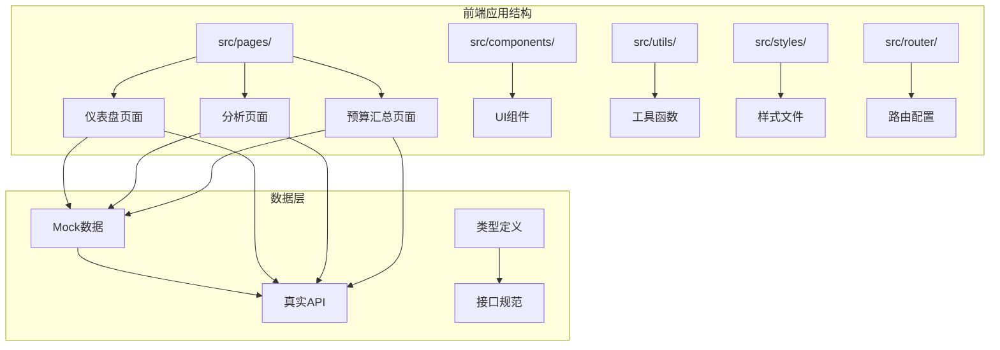
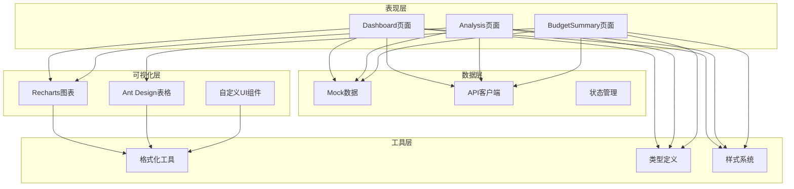
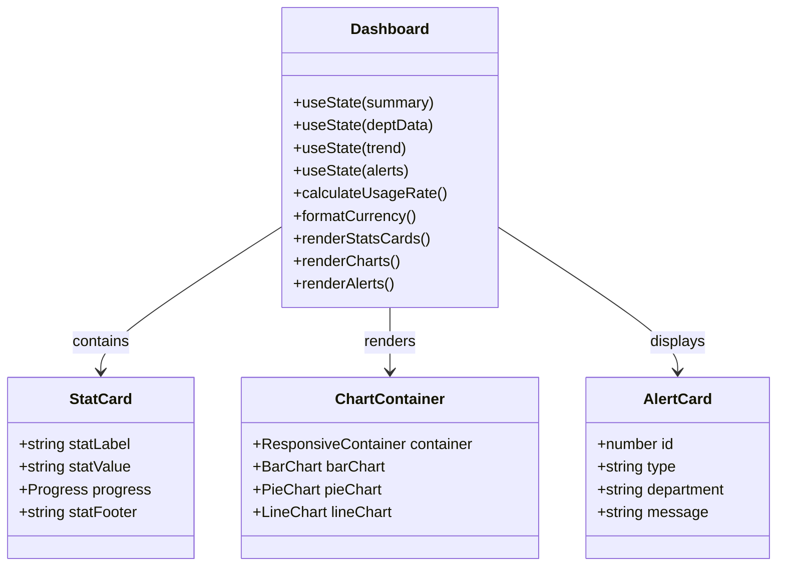
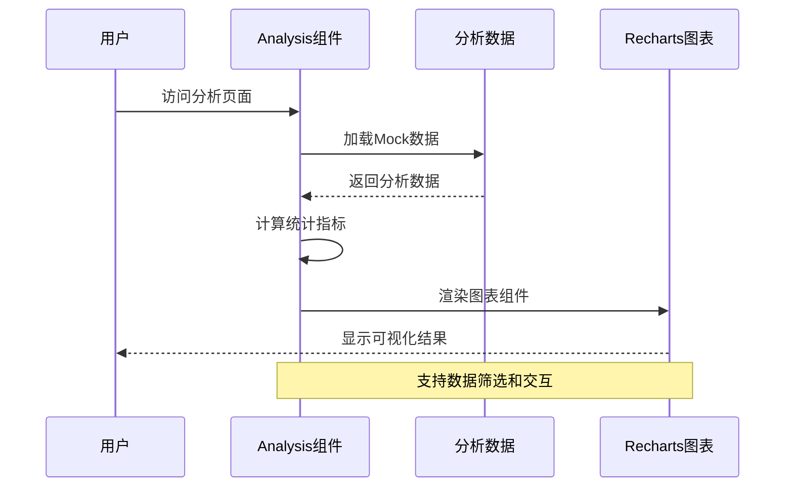
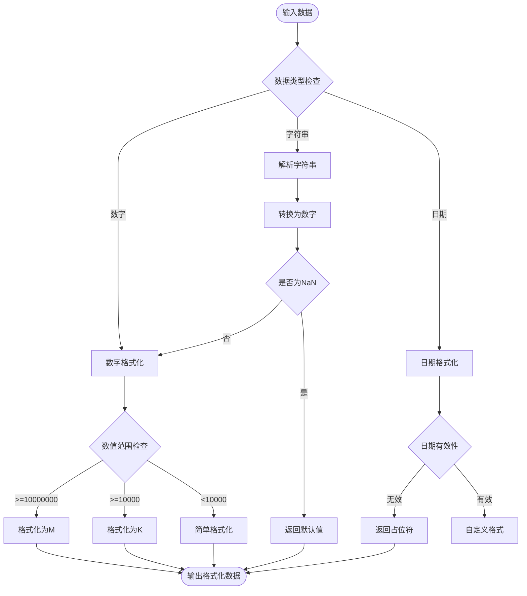
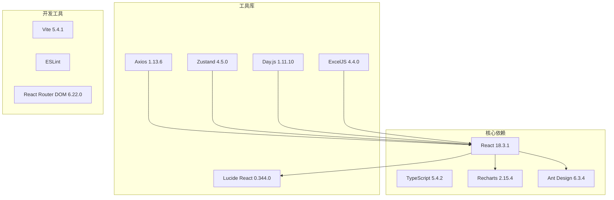

# 数据分析与可视化

<cite>
**本文档引用的文件**
- [Dashboard.tsx](file://src/pages/Dashboard.tsx)
- [Analysis.tsx](file://src/pages/Analysis.tsx)
- [BudgetSummary.tsx](file://src/pages/BudgetSummary.tsx)
- [format.ts](file://src/utils/format.ts)
- [routes.ts](file://src/router/routes.ts)
- [variables.css](file://src/styles/variables.css)
- [DataTable.tsx](file://src/components/ui/Table/DataTable.tsx)
- [client.ts](file://src/api/client.ts)
- [index.ts](file://src/types/index.ts)
- [package.json](file://package.json)
</cite>

## 目录
1. [简介](#简介)
2. [项目结构](#项目结构)
3. [核心组件](#核心组件)
4. [架构概览](#架构概览)
5. [详细组件分析](#详细组件分析)
6. [依赖关系分析](#依赖关系分析)
7. [性能考虑](#性能考虑)
8. [故障排除指南](#故障排除指南)
9. [结论](#结论)
10. [附录](#附录)

## 简介
本项目是一个企业级预算管理系统，专注于数据分析与可视化功能。系统提供了完整的预算执行监控、差异分析、部门对比等功能，并通过丰富的图表组件实现了直观的数据可视化。

系统采用现代化的技术栈，包括React、TypeScript、Recharts等，确保了良好的用户体验和可维护性。本文档将详细介绍数据分析与可视化模块的设计理念、实现方式和最佳实践。

## 项目结构
项目采用模块化的组织方式，数据分析与可视化功能主要分布在以下目录：



**图表来源**
- [Dashboard.tsx:1-274](file://src/pages/Dashboard.tsx#L1-L274)
- [Analysis.tsx:1-163](file://src/pages/Analysis.tsx#L1-L163)
- [BudgetSummary.tsx:1-193](file://src/pages/BudgetSummary.tsx#L1-L193)

**章节来源**
- [Dashboard.tsx:1-274](file://src/pages/Dashboard.tsx#L1-L274)
- [Analysis.tsx:1-163](file://src/pages/Analysis.tsx#L1-L163)
- [BudgetSummary.tsx:1-193](file://src/pages/BudgetSummary.tsx#L1-L193)

## 核心组件
数据分析与可视化模块的核心组件包括：

### 1. 仪表盘组件
- **功能**：提供预算执行情况的总览视图
- **特点**：实时数据展示、响应式布局、多维度分析
- **数据源**：Mock数据 + 可扩展的真实API集成

### 2. 分析组件
- **功能**：预算差异分析和趋势预测
- **特点**：部门对比分析、差异趋势可视化、统计摘要
- **数据源**：Mock分析数据

### 3. 数据格式化工具
- **功能**：统一的数据格式化标准
- **特点**：货币格式化、百分比计算、日期处理
- **应用场景**：所有可视化组件的数据展示

**章节来源**
- [Dashboard.tsx:59-274](file://src/pages/Dashboard.tsx#L59-L274)
- [Analysis.tsx:35-163](file://src/pages/Analysis.tsx#L35-L163)
- [format.ts:1-166](file://src/utils/format.ts#L1-L166)

## 架构概览
系统采用分层架构设计，确保数据流的清晰性和可维护性：



**图表来源**
- [Dashboard.tsx:1-16](file://src/pages/Dashboard.tsx#L1-L16)
- [Analysis.tsx:1-12](file://src/pages/Analysis.tsx#L1-L12)
- [format.ts:1-166](file://src/utils/format.ts#L1-L166)

## 详细组件分析

### 仪表盘组件分析

仪表盘是整个数据分析系统的核心界面，提供了多层次的数据可视化：

#### 关键指标展示
仪表盘包含三个核心指标卡片：
- **年度预算总额**：显示总预算、使用情况和剩余金额
- **Capex资本性支出**：专门展示固定资产投资预算
- **Opex运营性支出**：专门展示日常运营成本预算

每个指标都包含进度条显示和百分比计算，颜色根据使用率自动调整。

#### 实时数据更新机制
虽然当前使用Mock数据，但系统设计支持实时数据更新：
- 使用React状态管理数据变化
- 支持定时刷新机制
- 可扩展WebSocket连接实现真正的实时更新

#### 响应式布局设计
采用CSS Grid和Flexbox实现响应式布局：
- 在不同屏幕尺寸下自动调整布局
- 图表容器使用ResponsiveContainer确保自适应
- 移动端友好的交互设计



**图表来源**
- [Dashboard.tsx:59-274](file://src/pages/Dashboard.tsx#L59-L274)

**章节来源**
- [Dashboard.tsx:59-274](file://src/pages/Dashboard.tsx#L59-L274)

### 分析组件分析

分析页面专注于预算差异分析和趋势预测：

#### 预算差异分析
- **部门维度分析**：比较预算与实际支出的差异
- **差异率计算**：自动计算每个部门的预算执行效率
- **状态标识**：根据差异率自动标记节约或超支状态

#### 趋势预测功能
- **月度趋势**：展示预算与实际支出的历史趋势
- **预测算法**：基于历史数据进行简单的趋势预测
- **可视化展示**：使用折线图清晰展示变化趋势



**图表来源**
- [Analysis.tsx:35-163](file://src/pages/Analysis.tsx#L35-L163)

**章节来源**
- [Analysis.tsx:35-163](file://src/pages/Analysis.tsx#L35-L163)

### 数据可视化组件

系统集成了多种图表组件来满足不同的数据展示需求：

#### 柱状图组件
- **用途**：展示部门预算执行情况
- **特性**：支持垂直布局、双轴对比、交互式工具提示
- **配置**：自定义颜色、标签格式化、响应式适配

#### 饼图组件  
- **用途**：展示预算类型分布
- **特性**：环形设计、百分比标签、颜色区分
- **配置**：内外半径设置、标签位置控制

#### 折线图组件
- **用途**：展示月度趋势变化
- **特性**：平滑曲线、多系列数据对比
- **配置**：坐标轴格式化、网格线设置

**章节来源**
- [Dashboard.tsx:147-215](file://src/pages/Dashboard.tsx#L147-L215)
- [Analysis.tsx:78-117](file://src/pages/Analysis.tsx#L78-L117)

### 数据格式化工具

系统提供了完整的数据格式化解决方案：

#### 货币格式化
- **功能**：支持千分位分隔符、货币符号显示
- **范围**：从元到万元、百万、千万的智能格式化
- **精度**：可配置的小数位数

#### 百分比计算
- **功能**：标准化的百分比格式化
- **精度**：可配置的小数位数
- **应用场景**：预算执行率、差异率等

#### 日期和时间处理
- **日期格式化**：支持多种日期格式
- **相对时间**：显示"几分钟前"、"几小时前"等友好格式
- **文件大小**：自动转换为合适的单位（B, KB, MB, GB）



**图表来源**
- [format.ts:4-8](file://src/utils/format.ts#L4-L8)
- [format.ts:13-15](file://src/utils/format.ts#L13-L15)
- [format.ts:20-38](file://src/utils/format.ts#L20-L38)

**章节来源**
- [format.ts:1-166](file://src/utils/format.ts#L1-L166)

## 依赖关系分析

系统的技术依赖关系如下：



**图表来源**
- [package.json:12-32](file://package.json#L12-L32)

**章节来源**
- [package.json:1-45](file://package.json#L1-L45)

### Mock数据设计

系统采用Mock数据策略，确保开发和演示的独立性：

#### Mock数据结构
- **预算摘要数据**：包含总预算、已用、剩余等核心指标
- **部门数据**：按部门维度的预算执行数据
- **趋势数据**：月度预算执行趋势
- **分析数据**：预算差异分析所需的数据

#### 数据设计原则
- **一致性**：确保数据间的逻辑关系正确
- **完整性**：覆盖所有必要的业务场景
- **扩展性**：便于替换为真实API数据

**章节来源**
- [Dashboard.tsx:18-57](file://src/pages/Dashboard.tsx#L18-L57)
- [Analysis.tsx:14-33](file://src/pages/Analysis.tsx#L14-L33)

### 真实数据集成方案

系统提供了灵活的API集成方案：

#### API客户端设计
- **Axios封装**：统一的HTTP请求处理
- **拦截器机制**：自动添加认证信息和错误处理
- **类型安全**：完整的TypeScript类型定义

#### 集成步骤
1. **配置API基础URL**：通过环境变量配置
2. **实现数据获取函数**：封装具体的API调用
3. **状态管理集成**：使用React Query或Zustand管理数据状态
4. **错误处理**：统一的错误处理和用户反馈

**章节来源**
- [client.ts:1-53](file://src/api/client.ts#L1-L53)
- [index.ts:78-153](file://src/types/index.ts#L78-L153)

## 性能考虑

### 图表性能优化
- **懒加载**：使用React.lazy延迟加载图表组件
- **虚拟滚动**：大数据量时使用虚拟滚动提升渲染性能
- **数据分页**：避免一次性加载大量数据

### 内存管理
- **组件卸载清理**：及时清理事件监听器和定时器
- **状态优化**：使用useMemo和useCallback避免不必要的重渲染
- **数据缓存**：合理使用缓存减少重复计算

### 网络优化
- **请求合并**：将多个小请求合并为批量请求
- **缓存策略**：实现合理的缓存策略
- **错误重试**：实现智能的错误重试机制

## 故障排除指南

### 常见问题及解决方案

#### 图表不显示
- **检查数据格式**：确保传入图表的数据格式正确
- **验证依赖安装**：确认Recharts等依赖已正确安装
- **检查容器尺寸**：确保图表容器有明确的宽高

#### 数据格式化异常
- **验证输入参数**：检查传入格式化函数的参数类型
- **处理边界情况**：确保处理NaN、null等特殊情况
- **检查本地化设置**：验证语言环境设置

#### 性能问题
- **分析内存使用**：使用浏览器开发者工具分析内存泄漏
- **优化重渲染**：检查组件的重渲染频率
- **实施懒加载**：对大型组件实施懒加载策略

**章节来源**
- [format.ts:6-8](file://src/utils/format.ts#L6-L8)
- [Dashboard.tsx:69-73](file://src/pages/Dashboard.tsx#L69-L73)

## 结论

数据分析与可视化模块通过精心设计的架构和丰富的组件，为企业预算管理提供了强大的数据洞察能力。系统不仅具备完善的仪表盘和分析功能，还提供了灵活的扩展机制，能够轻松集成真实数据源并支持未来的功能扩展。

模块的主要优势包括：
- **直观的可视化**：通过多种图表类型提供丰富的数据展示
- **响应式设计**：适配各种设备和屏幕尺寸
- **可扩展性**：支持Mock数据和真实API的无缝切换
- **性能优化**：采用多种技术手段确保良好的用户体验

## 附录

### 使用示例

#### 基础图表使用
```typescript
// 导入图表组件
import { BarChart, Bar, XAxis, YAxis } from 'recharts';

// 准备数据
const data = [
  { name: '预算', value: 1000000 },
  { name: '实际', value: 800000 }
];

// 渲染图表
<BarChart data={data}>
  <XAxis dataKey="name" />
  <YAxis />
  <Bar dataKey="value" />
</BarChart>
```

#### 自定义配置方法
- **颜色定制**：通过fill属性自定义图表颜色
- **尺寸调整**：使用width和height属性调整图表尺寸
- **交互配置**：通过各种props配置图表交互行为

### 最佳实践

#### 数据设计
- **保持数据一致性**：确保不同图表间的数据逻辑关系正确
- **合理选择图表类型**：根据数据特点选择最适合的图表类型
- **优化数据结构**：设计扁平化的数据结构便于处理

#### 用户体验
- **加载状态**：为异步数据提供加载指示器
- **错误处理**：优雅地处理数据加载失败的情况
- **响应式设计**：确保在移动设备上的良好体验