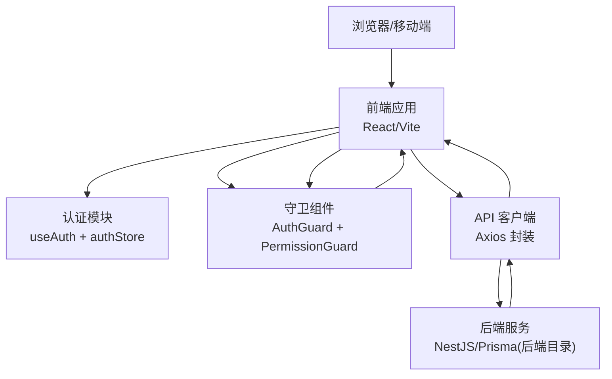
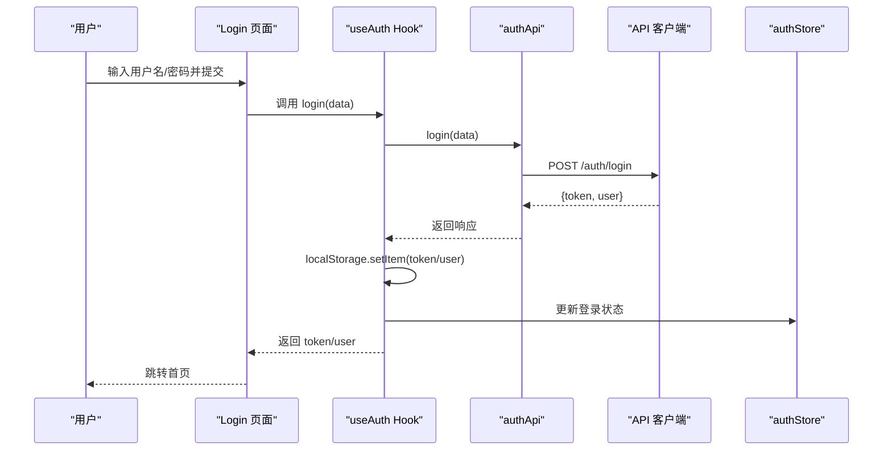
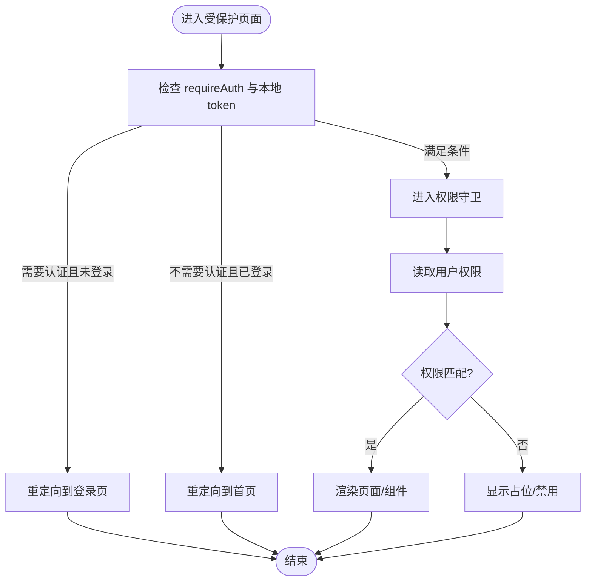
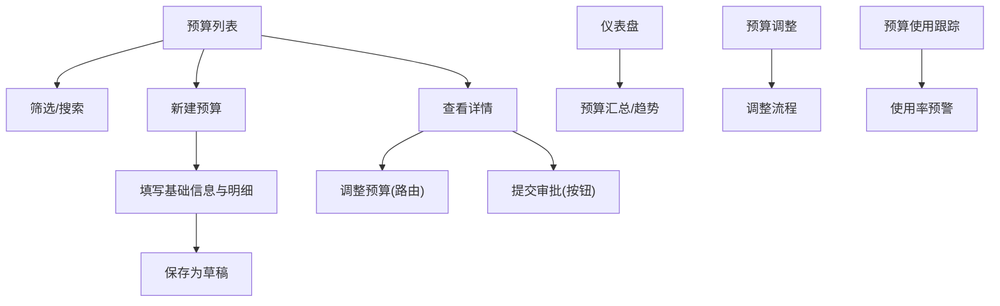
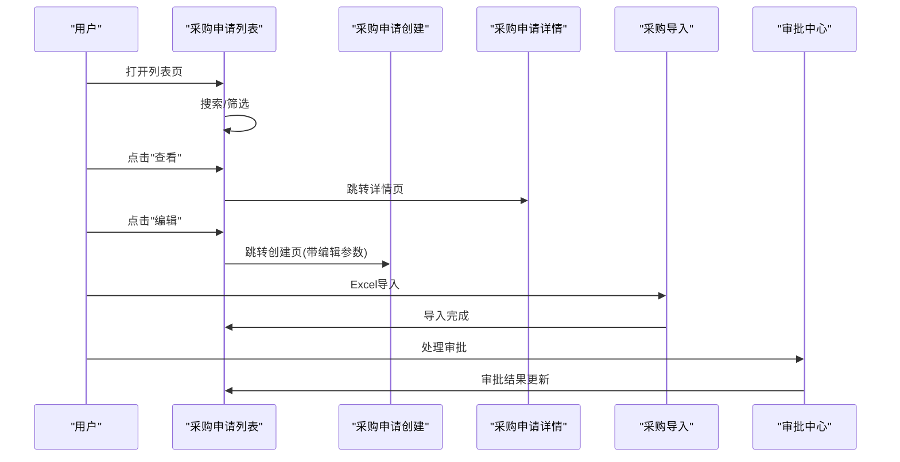
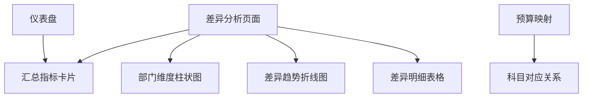
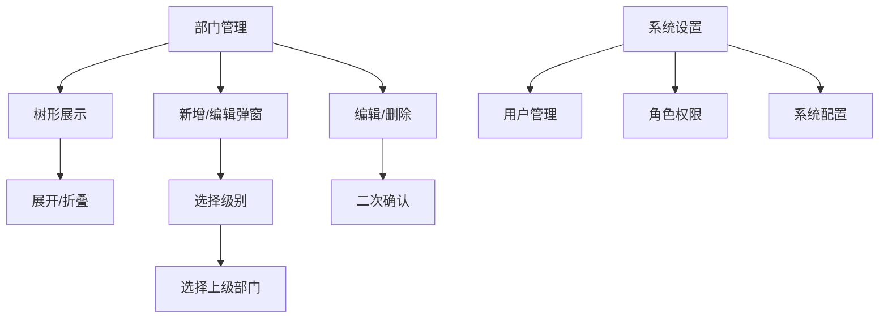
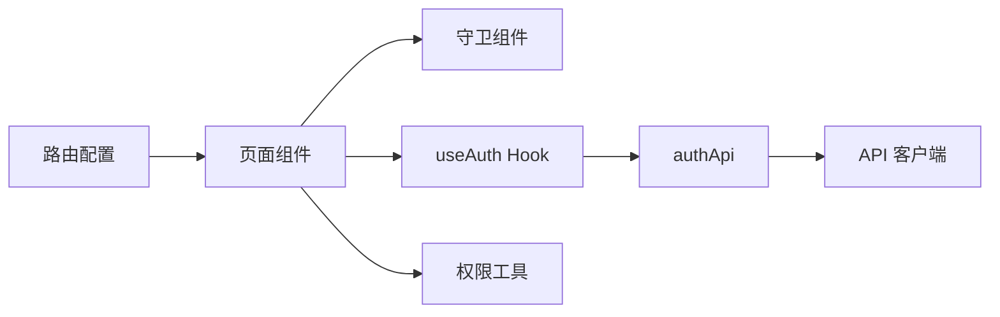

# 核心功能模块

<cite>
**本文引用的文件**
- [App.tsx](file://src/App.tsx)
- [routes.ts](file://src/router/routes.ts)
- [auth.api.ts](file://src/api/modules/auth.api.ts)
- [auth.types.ts](file://src/api/types/auth.types.ts)
- [client.ts](file://src/api/client.ts)
- [useAuth.ts](file://src/hooks/useAuth.ts)
- [authStore.ts](file://src/store/authStore.ts)
- [AuthGuard.tsx](file://src/components/guard/AuthGuard.tsx)
- [PermissionGuard.tsx](file://src/components/guard/PermissionGuard.tsx)
- [permission.ts](file://src/utils/permission.ts)
- [Login.tsx](file://src/pages/Login.tsx)
- [Dashboard.tsx](file://src/pages/Dashboard.tsx)
- [BudgetList.tsx](file://src/pages/BudgetList.tsx)
- [BudgetCreate.tsx](file://src/pages/BudgetCreate.tsx)
- [BudgetDetail.tsx](file://src/pages/BudgetDetail.tsx)
- [BudgetAdjust.tsx](file://src/pages/BudgetAdjust.tsx)
- [BudgetSummary.tsx](file://src/pages/BudgetSummary.tsx)
- [BudgetUsageTracker.tsx](file://src/pages/BudgetUsageTracker.tsx)
- [PurchaseRequestList.tsx](file://src/pages/PurchaseRequestList.tsx)
- [PurchaseRequestCreate.tsx](file://src/pages/PurchaseRequestCreate.tsx)
- [PurchaseRequestDetail.tsx](file://src/pages/PurchaseRequestDetail.tsx)
- [PurchaseImport.tsx](file://src/pages/PurchaseImport.tsx)
- [SettlementImport.tsx](file://src/pages/SettlementImport.tsx)
- [Approval.tsx](file://src/pages/Approval.tsx)
- [Analysis.tsx](file://src/pages/Analysis.tsx)
- [Mapping.tsx](file://src/pages/Mapping.tsx)
- [DepartmentList.tsx](file://src/pages/DepartmentList.tsx)
- [Settings.tsx](file://src/pages/Settings.tsx)
</cite>

## 目录
1. [简介](#简介)
2. [项目结构](#项目结构)
3. [核心组件](#核心组件)
4. [架构总览](#架构总览)
5. [详细组件分析](#详细组件分析)
6. [依赖分析](#依赖分析)
7. [性能考虑](#性能考虑)
8. [故障排除指南](#故障排除指南)
9. [结论](#结论)
10. [附录](#附录)

## 简介
本文件面向预算管理系统的各个核心功能模块，提供完整、可操作的技术文档。内容覆盖用户认证与权限管理、预算管理、采购管理、数据分析、系统管理等12个核心业务模块，配套功能流程图、API 接口说明与前端页面展示说明，并补充业务逻辑、数据流转与异常处理机制，帮助开发者与产品人员快速理解与落地。

## 项目结构
前端采用 React + Vite 构建，路由通过 React Router v6 管理；认证与权限通过自研 Hook、Store 与守卫组件协同实现；API 层基于 Axios 封装统一客户端，支持拦截器与错误处理；页面组件按功能模块划分，便于扩展与维护。

```mermaid
graph TB
subgraph "前端应用"
A_App["App 路由入口<br/>src/App.tsx"]
A_Router["路由配置<br/>src/router/routes.ts"]
A_Login["登录页<br/>src/pages/Login.tsx"]
A_Dash["仪表盘<br/>src/pages/Dashboard.tsx"]
A_BudgetList["预算列表<br/>src/pages/BudgetList.tsx"]
A_BudgetCreate["预算创建<br/>src/pages/BudgetCreate.tsx"]
A_BudgetDetail["预算详情<br/>src/pages/BudgetDetail.tsx"]
A_BudgetAdjust["预算调整<br/>src/pages/BudgetAdjust.tsx"]
A_BudgetSummary["预算汇总<br/>src/pages/BudgetSummary.tsx"]
A_BudgetUsage["预算使用跟踪<br/>src/pages/BudgetUsageTracker.tsx"]
A_PurchaseList["采购申请列表<br/>src/pages/PurchaseRequestList.tsx"]
A_PurchaseCreate["采购申请创建<br/>src/pages/PurchaseRequestCreate.tsx"]
A_PurchaseDetail["采购申请详情<br/>src/pages/PurchaseRequestDetail.tsx"]
A_PurchaseImport["采购导入<br/>src/pages/PurchaseImport.tsx"]
A_SettlementImport["结算导入<br/>src/pages/SettlementImport.tsx"]
A_Approval["审批中心<br/>src/pages/Approval.tsx"]
A_Analysis["差异分析<br/>src/pages/Analysis.tsx"]
A_Mapping["预算映射<br/>src/pages/Mapping.tsx"]
A_Dept["部门管理<br/>src/pages/DepartmentList.tsx"]
A_Settings["系统设置<br/>src/pages/Settings.tsx"]
end
subgraph "认证与权限"
U_AuthHook["useAuth Hook<br/>src/hooks/useAuth.ts"]
S_AuthStore["authStore Store<br/>src/store/authStore.ts"]
G_AuthGuard["认证守卫<br/>src/components/guard/AuthGuard.tsx"]
G_PermissionGuard["权限守卫<br/>src/components/guard/PermissionGuard.tsx"]
U_Permission["权限工具<br/>src/utils/permission.ts"]
A_API["认证 API<br/>src/api/modules/auth.api.ts"]
T_AuthTypes["认证类型<br/>src/api/types/auth.types.ts"]
C_Client["API 客户端<br/>src/api/client.ts"]
end
A_App --> A_Router
A_Router --> A_Login
A_Router --> A_Dash
A_Router --> A_BudgetList
A_Router --> A_BudgetCreate
A_Router --> A_BudgetDetail
A_Router --> A_BudgetAdjust
A_Router --> A_BudgetSummary
A_Router --> A_BudgetUsage
A_Router --> A_PurchaseList
A_Router --> A_PurchaseCreate
A_Router --> A_PurchaseDetail
A_Router --> A_PurchaseImport
A_Router --> A_SettlementImport
A_Router --> A_Approval
A_Router --> A_Analysis
A_Router --> A_Mapping
A_Router --> A_Dept
A_Router --> A_Settings
A_Login --> U_AuthHook
U_AuthHook --> A_API
A_API --> C_Client
U_AuthHook --> S_AuthStore
A_Router --> G_AuthGuard
G_AuthGuard --> G_PermissionGuard
G_PermissionGuard --> U_Permission
```

图表来源
- [App.tsx:1-66](file://src/App.tsx#L1-L66)
- [routes.ts:1-122](file://src/router/routes.ts#L1-L122)
- [useAuth.ts:1-84](file://src/hooks/useAuth.ts#L1-L84)
- [authStore.ts:1-31](file://src/store/authStore.ts#L1-L31)
- [AuthGuard.tsx:1-31](file://src/components/guard/AuthGuard.tsx#L1-L31)
- [PermissionGuard.tsx:1-88](file://src/components/guard/PermissionGuard.tsx#L1-L88)
- [permission.ts:1-84](file://src/utils/permission.ts#L1-L84)
- [auth.api.ts:1-50](file://src/api/modules/auth.api.ts#L1-L50)
- [auth.types.ts:1-44](file://src/api/types/auth.types.ts#L1-L44)
- [client.ts:1-183](file://src/api/client.ts#L1-L183)

章节来源
- [App.tsx:1-66](file://src/App.tsx#L1-L66)
- [routes.ts:1-122](file://src/router/routes.ts#L1-L122)

## 核心组件
- 路由与页面：通过路由配置集中管理页面访问路径与鉴权要求，支持懒加载优化首屏性能。
- 认证与会话：登录成功后持久化用户信息与 Token，全局拦截器自动注入 Authorization 头。
- 权限体系：基于角色与细粒度权限点进行按钮级与页面级控制，支持"任一/全部"权限校验。
- API 客户端：统一封装 GET/POST/PUT/DELETE/上传/下载，内置 401 自动清空与跳转逻辑。

章节来源
- [routes.ts:25-121](file://src/router/routes.ts#L25-L121)
- [useAuth.ts:12-51](file://src/hooks/useAuth.ts#L12-L51)
- [authStore.ts:19-31](file://src/store/authStore.ts#L19-L31)
- [client.ts:21-94](file://src/api/client.ts#L21-L94)
- [permission.ts:53-83](file://src/utils/permission.ts#L53-L83)

## 架构总览
系统采用前后端分离架构，前端负责页面渲染与交互，后端提供 REST API。认证采用 Bearer Token，权限采用 RBAC 模型，页面通过守卫组件与 Hook 控制访问与操作能力。

图表来源
- [useAuth.ts:1-84](file://src/hooks/useAuth.ts#L1-L84)
- [authStore.ts:1-31](file://src/store/authStore.ts#L1-L31)
- [AuthGuard.tsx:1-31](file://src/components/guard/AuthGuard.tsx#L1-L31)
- [PermissionGuard.tsx:1-88](file://src/components/guard/PermissionGuard.tsx#L1-L88)
- [client.ts:1-183](file://src/api/client.ts#L1-L183)

## 详细组件分析

### 用户认证与权限管理模块
- 登录流程
  - 前端 Login 页面收集用户名/密码，调用 useAuth 的 login。
  - useAuth 调用 authApi.login，接收 token 与用户信息。
  - 将 token 与用户信息写入 localStorage，并更新 authStore 状态。
  - 跳转至首页。
- 令牌管理
  - 请求拦截器自动在 Authorization 头添加 Bearer token。
  - 响应拦截器处理 401 未授权：清除本地 token 与用户信息并跳转登录。
- 权限控制
  - AuthGuard：根据路由配置的 requireAuth 决定是否放行。
  - PermissionGuard：基于用户权限数组与权限点进行"任一/全部"匹配。
  - 权限工具：提供 hasPermission、hasAnyPermission、hasAllPermissions 与权限枚举。

图表来源
- [Login.tsx:14-38](file://src/pages/Login.tsx#L14-L38)
- [useAuth.ts:12-21](file://src/hooks/useAuth.ts#L12-L21)
- [auth.api.ts:18-20](file://src/api/modules/auth.api.ts#L18-L20)
- [client.ts:21-44](file://src/api/client.ts#L21-L44)
- [authStore.ts:22-26](file://src/store/authStore.ts#L22-L26)

图表来源
- [AuthGuard.tsx:17-29](file://src/components/guard/AuthGuard.tsx#L17-L29)
- [PermissionGuard.tsx:21-46](file://src/components/guard/PermissionGuard.tsx#L21-L46)
- [permission.ts:11-21](file://src/utils/permission.ts#L11-L21)

章节来源
- [Login.tsx:14-38](file://src/pages/Login.tsx#L14-L38)
- [useAuth.ts:12-51](file://src/hooks/useAuth.ts#L12-L51)
- [auth.api.ts:18-48](file://src/api/modules/auth.api.ts#L18-L48)
- [client.ts:21-94](file://src/api/client.ts#L21-L94)
- [authStore.ts:19-31](file://src/store/authStore.ts#L19-L31)
- [AuthGuard.tsx:13-30](file://src/components/guard/AuthGuard.tsx#L13-L30)
- [PermissionGuard.tsx:15-46](file://src/components/guard/PermissionGuard.tsx#L15-L46)
- [permission.ts:11-41](file://src/utils/permission.ts#L11-L41)

### 预算管理模块
- 功能概览
  - 预算创建：支持基础信息与明细条目，计算合计金额，保存为草稿。
  - 预算列表：筛选搜索、状态与类型过滤、增删改操作。
  - 预算详情：汇总统计、明细表格、审批历史时间轴。
  - 预算调整：预算变更申请与审批流程。
  - 预算汇总：总览预算执行情况、部门对比与趋势。
  - 预算使用跟踪：实时监控预算使用情况与预警。
- 数据流
  - 创建：表单数据 + 明细数组 → 本地临时保存 → 生产环境提交后跳转列表。
  - 列表：本地状态维护 mock 数据，支持筛选与弹窗编辑。
  - 详情：根据路由参数加载 mock 数据，展示预算与审批历史。
- 异常处理
  - 表单输入校验与必填项提示。
  - 删除前二次确认与状态限制（草稿/已拒绝）。

图表来源
- [BudgetList.tsx:47-105](file://src/pages/BudgetList.tsx#L47-L105)
- [BudgetCreate.tsx:42-47](file://src/pages/BudgetCreate.tsx#L42-L47)
- [BudgetDetail.tsx:52-59](file://src/pages/BudgetDetail.tsx#L52-L59)
- [BudgetAdjust.tsx:1-200](file://src/pages/BudgetAdjust.tsx#L1-L200)
- [BudgetSummary.tsx:1-200](file://src/pages/BudgetSummary.tsx#L1-L200)
- [BudgetUsageTracker.tsx:1-200](file://src/pages/BudgetUsageTracker.tsx#L1-L200)
- [Dashboard.tsx:75-274](file://src/pages/Dashboard.tsx#L75-L274)

章节来源
- [BudgetList.tsx:28-329](file://src/pages/BudgetList.tsx#L28-L329)
- [BudgetCreate.tsx:12-211](file://src/pages/BudgetCreate.tsx#L12-L211)
- [BudgetDetail.tsx:32-159](file://src/pages/BudgetDetail.tsx#L32-L159)
- [BudgetAdjust.tsx:1-200](file://src/pages/BudgetAdjust.tsx#L1-L200)
- [BudgetSummary.tsx:1-200](file://src/pages/BudgetSummary.tsx#L1-L200)
- [BudgetUsageTracker.tsx:1-200](file://src/pages/BudgetUsageTracker.tsx#L1-L200)
- [Dashboard.tsx:59-274](file://src/pages/Dashboard.tsx#L59-L274)

### 采购管理模块
- 功能概览
  - 采购申请列表：支持搜索、状态过滤、快速查看、编辑与删除（草稿/已拒绝）。
  - 采购申请创建：详细填写申请信息、附件上传、预算匹配。
  - 采购申请详情：查看申请详情、审批流程跟踪、历史记录。
  - 采购导入：Excel 批量导入采购申请。
  - 结算导入：Excel 批量导入结算数据。
  - 审批中心：集中处理各类审批任务。
- 数据流
  - 列表页维护本地 mock 数据，支持筛选与操作按钮。
  - 编辑入口支持草稿/被拒状态的二次编辑。
- 异常处理
  - 删除操作前二次确认与状态限制。
  - 状态图标与颜色区分审批阶段。

图表来源
- [PurchaseRequestList.tsx:57-212](file://src/pages/PurchaseRequestList.tsx#L57-L212)
- [PurchaseRequestCreate.tsx:1-200](file://src/pages/PurchaseRequestCreate.tsx#L1-L200)
- [PurchaseRequestDetail.tsx:1-200](file://src/pages/PurchaseRequestDetail.tsx#L1-L200)
- [PurchaseImport.tsx:1-200](file://src/pages/PurchaseImport.tsx#L1-L200)
- [SettlementImport.tsx:1-200](file://src/pages/SettlementImport.tsx#L1-L200)
- [Approval.tsx:1-99](file://src/pages/Approval.tsx#L1-L99)

章节来源
- [PurchaseRequestList.tsx:57-212](file://src/pages/PurchaseRequestList.tsx#L57-L212)
- [PurchaseRequestCreate.tsx:1-200](file://src/pages/PurchaseRequestCreate.tsx#L1-L200)
- [PurchaseRequestDetail.tsx:1-200](file://src/pages/PurchaseRequestDetail.tsx#L1-L200)
- [PurchaseImport.tsx:1-200](file://src/pages/PurchaseImport.tsx#L1-L200)
- [SettlementImport.tsx:1-200](file://src/pages/SettlementImport.tsx#L1-L200)
- [Approval.tsx:1-99](file://src/pages/Approval.tsx#L1-L99)

### 数据分析模块
- 功能概览
  - 差异分析：部门维度预算/实际对比、差异趋势折线图、差异明细表。
  - 仪表盘：总预算、实际支出、差异、执行率等指标卡片。
  - 预算映射：预算科目与会计科目的对应关系管理。
- 数据流
  - 使用 mock 数据驱动图表与表格，格式化货币单位与百分比。
  - 支持横向对比与纵向趋势分析。
- 异常处理
  - 数值格式化与边界值处理（如负差异显示为节约）。

图表来源
- [Analysis.tsx:35-163](file://src/pages/Analysis.tsx#L35-L163)
- [Dashboard.tsx:59-274](file://src/pages/Dashboard.tsx#L59-L274)
- [Mapping.tsx:1-200](file://src/pages/Mapping.tsx#L1-L200)

章节来源
- [Analysis.tsx:35-163](file://src/pages/Analysis.tsx#L35-L163)
- [Dashboard.tsx:59-274](file://src/pages/Dashboard.tsx#L59-L274)
- [Mapping.tsx:1-200](file://src/pages/Mapping.tsx#L1-L200)

### 系统管理模块
- 功能概览
  - 部门管理：树形结构展示、展开/折叠、新增/编辑/删除、负责人与预算管理员设置。
  - 系统设置：用户管理、角色权限配置、系统参数设置。
  - 支持多级部门（一级/二级/三级），父子关系动态维护。
  - 快速入口：编制预算、预算汇总、采购申请。
- 数据流
  - 本地维护部门树，递归渲染与操作。
  - 新增/编辑时根据级别选择上级部门，避免循环引用。
- 异常处理
  - 删除前二次确认与树形结构安全删除。

图表来源
- [DepartmentList.tsx:83-440](file://src/pages/DepartmentList.tsx#L83-L440)
- [Settings.tsx:1-200](file://src/pages/Settings.tsx#L1-L200)

章节来源
- [DepartmentList.tsx:83-440](file://src/pages/DepartmentList.tsx#L83-L440)
- [Settings.tsx:1-200](file://src/pages/Settings.tsx#L1-L200)

## 依赖分析
- 组件耦合
  - 页面组件依赖路由配置与守卫组件，保持页面访问控制的一致性。
  - 认证模块通过 Hook 与 Store 解耦，API 客户端集中处理网络层。
- 外部依赖
  - 图表库 recharts 用于可视化展示。
  - lucide-react 图标库提供统一视觉元素。
- 可能的循环依赖
  - 当前结构以页面与工具函数为主，未见直接循环导入。

图表来源
- [routes.ts:25-121](file://src/router/routes.ts#L25-L121)
- [useAuth.ts:1-84](file://src/hooks/useAuth.ts#L1-L84)
- [auth.api.ts:1-50](file://src/api/modules/auth.api.ts#L1-L50)
- [client.ts:1-183](file://src/api/client.ts#L1-L183)
- [permission.ts:1-84](file://src/utils/permission.ts#L1-L84)

章节来源
- [routes.ts:25-121](file://src/router/routes.ts#L25-L121)
- [useAuth.ts:1-84](file://src/hooks/useAuth.ts#L1-L84)
- [auth.api.ts:1-50](file://src/api/modules/auth.api.ts#L1-L50)
- [client.ts:1-183](file://src/api/client.ts#L1-L183)
- [permission.ts:1-84](file://src/utils/permission.ts#L1-L84)

## 性能考虑
- 路由懒加载：通过 lazy 与 Suspense 减少初始包体积，提升首屏加载速度。
- 图表渲染：使用响应式容器与按需渲染，避免大数据量时的卡顿。
- 本地状态：页面内使用 useState 维护轻量数据，减少不必要的全局状态同步。
- 网络优化：GET 请求附加时间戳参数防缓存，上传进度回调与超时控制。

## 故障排除指南
- 登录失败
  - 检查用户名/密码是否正确，确认 useAuth.login 是否成功写入 token 与用户信息。
  - 若出现 401，确认响应拦截器是否触发清理逻辑并跳转登录。
- 权限不足
  - 使用 PermissionGuard 包裹按钮或页面，确认用户权限数组是否包含所需权限点。
  - 使用 usePermission 检查权限结果，排查权限枚举拼写与权限分配。
- 图表不显示
  - 确认数据格式与字段名一致，检查 recharts 组件的 dataKey 与样式。
- 部门树异常
  - 新增/编辑时注意级别与上级部门的约束，避免非法父子关系导致渲染异常。

章节来源
- [client.ts:52-94](file://src/api/client.ts#L52-L94)
- [PermissionGuard.tsx:21-46](file://src/components/guard/PermissionGuard.tsx#L21-L46)
- [permission.ts:11-41](file://src/utils/permission.ts#L11-L41)

## 结论
本系统通过清晰的路由与守卫机制、完善的认证与权限体系、以及模块化的页面组件，实现了预算管理系统的12个核心业务模块。系统涵盖了从预算编制、执行监控到采购管理、数据分析的完整业务闭环。建议后续在生产环境中接入真实后端 API，完善权限模型与审计日志，并持续优化前端性能与用户体验。

## 附录
- API 接口一览（基于前端类型）
  - 登录：POST /auth/login
  - 登出：POST /auth/logout
  - 刷新 Token：POST /auth/refresh
  - 获取当前用户：GET /auth/me
  - 修改密码：PUT /auth/password
- 权限点清单（模块.操作）
  - 预算：create/read/update/delete/approve/export
  - 采购：create/read/update/delete/approve/import
  - 审批：read/approve
  - 报表：read/export
  - 系统：user.manage/role.manage/config/audit
  - 部门：manage/view
  - 设置：view/manage

章节来源
- [auth.api.ts:18-48](file://src/api/modules/auth.api.ts#L18-L48)
- [auth.types.ts:5-39](file://src/api/types/auth.types.ts#L5-L39)
- [permission.ts:53-83](file://src/utils/permission.ts#L53-L83)