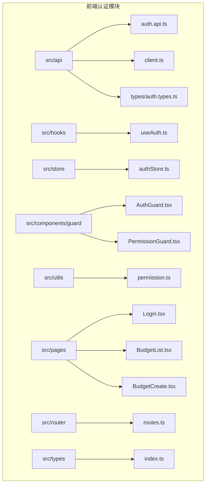
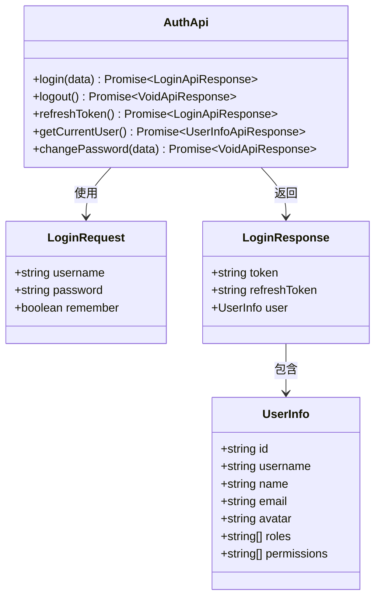
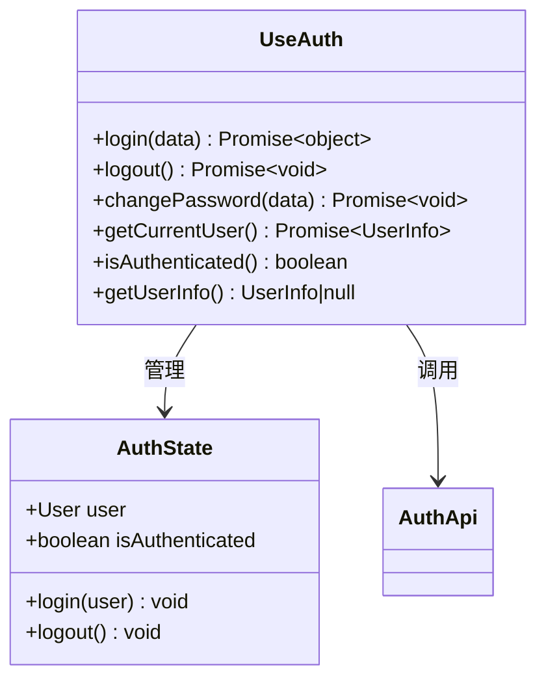
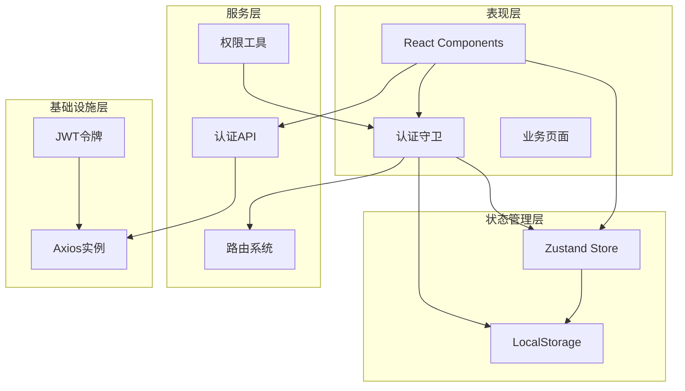
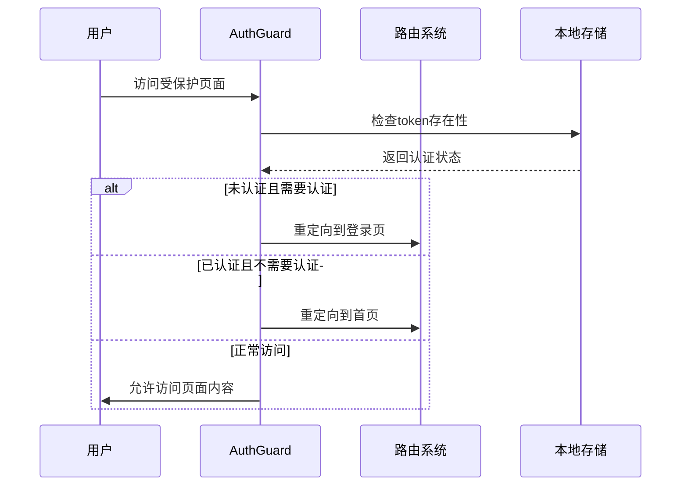
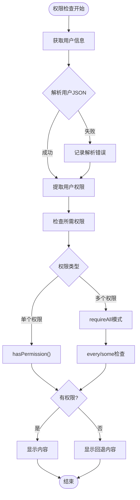
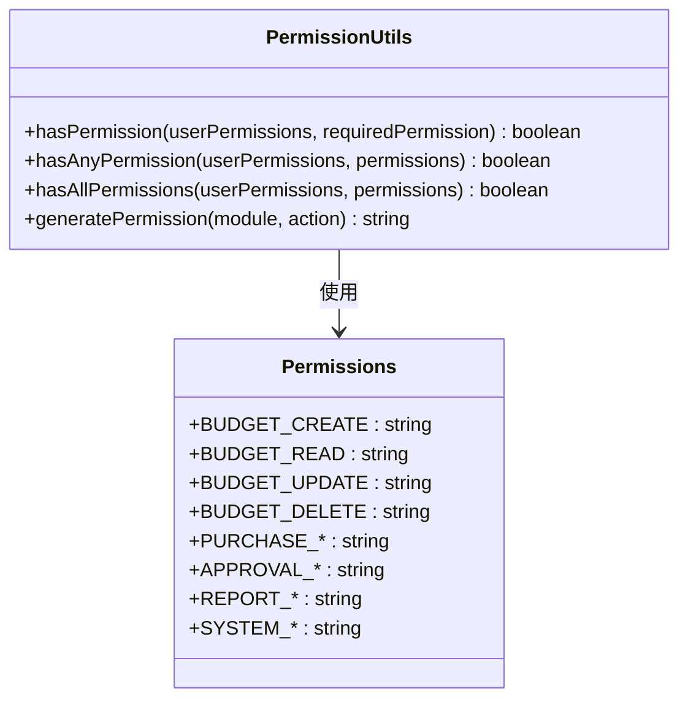
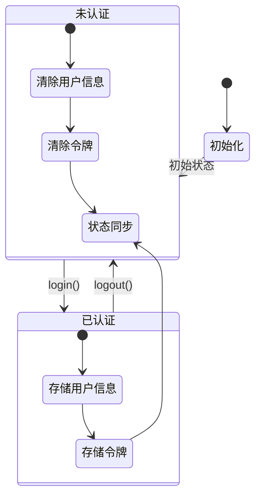
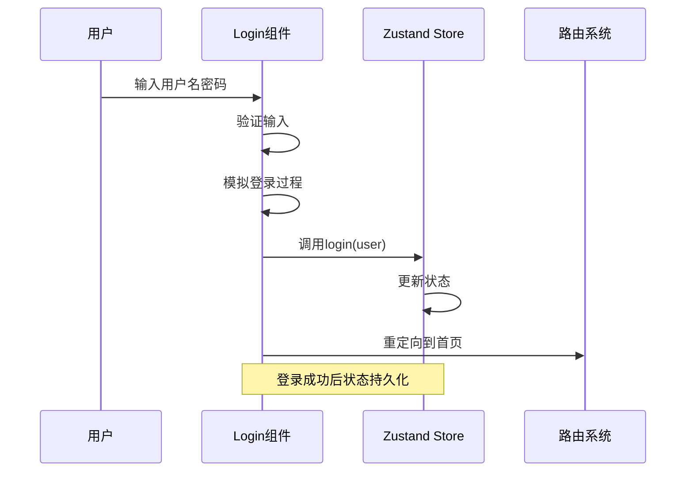
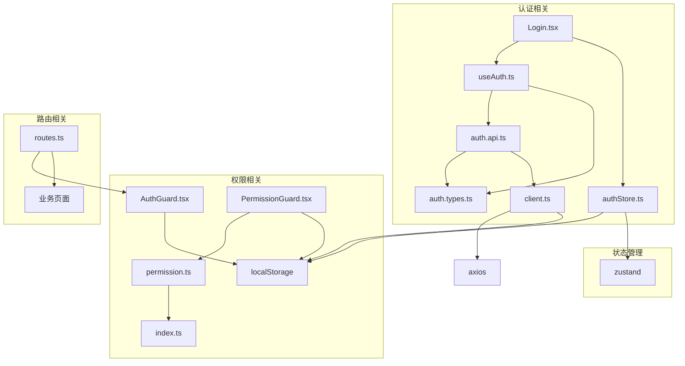

# 用户认证与权限管理

<cite>
**本文档引用的文件**
- [src/api/modules/auth.api.ts](file://src/api/modules/auth.api.ts)
- [src/api/types/auth.types.ts](file://src/api/types/auth.types.ts)
- [src/store/authStore.ts](file://src/store/authStore.ts)
- [src/hooks/useAuth.ts](file://src/hooks/useAuth.ts)
- [src/components/guard/AuthGuard.tsx](file://src/components/guard/AuthGuard.tsx)
- [src/components/guard/PermissionGuard.tsx](file://src/components/guard/PermissionGuard.tsx)
- [src/utils/permission.ts](file://src/utils/permission.ts)
- [src/pages/Login.tsx](file://src/pages/Login.tsx)
- [src/router/routes.ts](file://src/router/routes.ts)
- [src/api/client.ts](file://src/api/client.ts)
- [src/types/index.ts](file://src/types/index.ts)
- [src/pages/BudgetList.tsx](file://src/pages/BudgetList.tsx)
- [src/pages/BudgetCreate.tsx](file://src/pages/BudgetCreate.tsx)
</cite>

## 目录
1. [简介](#简介)
2. [项目结构](#项目结构)
3. [核心组件](#核心组件)
4. [架构概览](#架构概览)
5. [详细组件分析](#详细组件分析)
6. [依赖关系分析](#依赖关系分析)
7. [性能考虑](#性能考虑)
8. [故障排除指南](#故障排除指南)
9. [结论](#结论)
10. [附录](#附录)

## 简介

本项目实现了完整的用户认证与权限管理模块，采用前后端分离架构，结合JWT令牌认证机制和基于角色的权限控制系统。系统支持多种认证方式、细粒度的权限控制、以及完善的错误处理机制。

## 项目结构

认证与权限管理模块主要分布在以下目录结构中：

**图表来源**
- [src/api/modules/auth.api.ts:1-50](file://src/api/modules/auth.api.ts#L1-L50)
- [src/hooks/useAuth.ts:1-84](file://src/hooks/useAuth.ts#L1-L84)
- [src/store/authStore.ts:1-31](file://src/store/authStore.ts#L1-L31)

**章节来源**
- [src/api/modules/auth.api.ts:1-50](file://src/api/modules/auth.api.ts#L1-L50)
- [src/hooks/useAuth.ts:1-84](file://src/hooks/useAuth.ts#L1-L84)
- [src/store/authStore.ts:1-31](file://src/store/authStore.ts#L1-L31)
- [src/components/guard/AuthGuard.tsx:1-31](file://src/components/guard/AuthGuard.tsx#L1-L31)
- [src/components/guard/PermissionGuard.tsx:1-88](file://src/components/guard/PermissionGuard.tsx#L1-L88)
- [src/utils/permission.ts:1-84](file://src/utils/permission.ts#L1-L84)
- [src/pages/Login.tsx:1-102](file://src/pages/Login.tsx#L1-L102)
- [src/router/routes.ts:1-122](file://src/router/routes.ts#L1-L122)
- [src/api/client.ts:1-183](file://src/api/client.ts#L1-L183)
- [src/types/index.ts:1-338](file://src/types/index.ts#L1-L338)

## 核心组件

### 认证API层

认证API层提供了完整的用户认证接口，包括登录、登出、令牌刷新和用户信息获取等功能。

**图表来源**
- [src/api/modules/auth.api.ts:14-49](file://src/api/modules/auth.api.ts#L14-L49)
- [src/api/types/auth.types.ts:5-25](file://src/api/types/auth.types.ts#L5-L25)

### 认证Hook层

认证Hook层封装了所有认证相关的业务逻辑，提供了简洁的API供组件使用。

**图表来源**
- [src/hooks/useAuth.ts:8-83](file://src/hooks/useAuth.ts#L8-L83)
- [src/store/authStore.ts:12-17](file://src/store/authStore.ts#L12-L17)

**章节来源**
- [src/api/modules/auth.api.ts:1-50](file://src/api/modules/auth.api.ts#L1-L50)
- [src/api/types/auth.types.ts:1-44](file://src/api/types/auth.types.ts#L1-L44)
- [src/hooks/useAuth.ts:1-84](file://src/hooks/useAuth.ts#L1-L84)
- [src/store/authStore.ts:1-31](file://src/store/authStore.ts#L1-L31)

## 架构概览

系统采用分层架构设计，实现了清晰的关注点分离：

**图表来源**
- [src/components/guard/AuthGuard.tsx:1-31](file://src/components/guard/AuthGuard.tsx#L1-L31)
- [src/components/guard/PermissionGuard.tsx:1-88](file://src/components/guard/PermissionGuard.tsx#L1-L88)
- [src/store/authStore.ts:1-31](file://src/store/authStore.ts#L1-L31)
- [src/api/client.ts:1-183](file://src/api/client.ts#L1-L183)

## 详细组件分析

### 认证守卫组件

认证守卫组件是路由保护的核心，负责控制页面访问权限。

**图表来源**
- [src/components/guard/AuthGuard.tsx:13-30](file://src/components/guard/AuthGuard.tsx#L13-L30)

认证守卫支持两种模式：
- `requireAuth = true`：需要认证才能访问（默认）
- `requireAuth = false`：无需认证即可访问

**章节来源**
- [src/components/guard/AuthGuard.tsx:1-31](file://src/components/guard/AuthGuard.tsx#L1-L31)
- [src/router/routes.ts:25-121](file://src/router/routes.ts#L25-L121)

### 权限守卫组件

权限守卫组件实现了细粒度的权限控制，支持按钮级权限验证。

**图表来源**
- [src/components/guard/PermissionGuard.tsx:15-46](file://src/components/guard/PermissionGuard.tsx#L15-L46)
- [src/utils/permission.ts:11-21](file://src/utils/permission.ts#L11-L21)

权限守卫支持三种检查模式：
- 单个权限检查：`hasPermission(userPermissions, permission)`
- 任意权限检查：`requireAll = false`（some模式）
- 所有权限检查：`requireAll = true`（every模式）

**章节来源**
- [src/components/guard/PermissionGuard.tsx:1-88](file://src/components/guard/PermissionGuard.tsx#L1-L88)
- [src/utils/permission.ts:1-84](file://src/utils/permission.ts#L1-L84)

### 权限工具函数

权限工具函数提供了统一的权限判断逻辑，支持管理员特殊权限处理。

**图表来源**
- [src/utils/permission.ts:11-83](file://src/utils/permission.ts#L11-L83)

权限系统特性：
- 管理员拥有所有权限（包括特殊权限标识符）
- 支持权限字符串格式化（module.action）
- 提供多种权限检查方法

**章节来源**
- [src/utils/permission.ts:1-84](file://src/utils/permission.ts#L1-L84)

### 前端状态管理

使用Zustand实现轻量级的状态管理，支持状态持久化。

**图表来源**
- [src/store/authStore.ts:19-30](file://src/store/authStore.ts#L19-L30)

状态管理特性：
- 使用Zustand简化状态管理
- 支持localStorage持久化
- 自动同步认证状态

**章节来源**
- [src/store/authStore.ts:1-31](file://src/store/authStore.ts#L1-L31)

### 登录页面实现

登录页面提供了用户界面和认证逻辑，支持多角色演示账户。

**图表来源**
- [src/pages/Login.tsx:14-38](file://src/pages/Login.tsx#L14-L38)

登录功能特性：
- 支持5种角色演示账户
- 密码统一为123456
- 自动状态管理和路由跳转

**章节来源**
- [src/pages/Login.tsx:1-102](file://src/pages/Login.tsx#L1-L102)

## 依赖关系分析

认证系统各组件之间的依赖关系如下：

**图表来源**
- [src/api/modules/auth.api.ts:1-9](file://src/api/modules/auth.api.ts#L1-L9)
- [src/hooks/useAuth.ts:1-3](file://src/hooks/useAuth.ts#L1-L3)
- [src/components/guard/AuthGuard.tsx:1-2](file://src/components/guard/AuthGuard.tsx#L1-L2)
- [src/components/guard/PermissionGuard.tsx:1-2](file://src/components/guard/PermissionGuard.tsx#L1-L2)
- [src/utils/permission.ts:1-4](file://src/utils/permission.ts#L1-L4)
- [src/router/routes.ts:1-1](file://src/router/routes.ts#L1-L1)

**章节来源**
- [src/api/modules/auth.api.ts:1-50](file://src/api/modules/auth.api.ts#L1-L50)
- [src/hooks/useAuth.ts:1-84](file://src/hooks/useAuth.ts#L1-L84)
- [src/components/guard/AuthGuard.tsx:1-31](file://src/components/guard/AuthGuard.tsx#L1-L31)
- [src/components/guard/PermissionGuard.tsx:1-88](file://src/components/guard/PermissionGuard.tsx#L1-L88)
- [src/utils/permission.ts:1-84](file://src/utils/permission.ts#L1-L84)
- [src/router/routes.ts:1-122](file://src/router/routes.ts#L1-L122)

## 性能考虑

### 缓存策略
- **本地存储缓存**：用户信息和认证状态持久化存储
- **请求缓存**：GET请求自动添加时间戳参数防止缓存
- **状态缓存**：Zustand状态管理减少不必要的重渲染

### 网络优化
- **超时设置**：30秒请求超时避免长时间等待
- **拦截器优化**：统一处理请求和响应
- **错误重试**：401错误自动清除认证状态并重定向

### 内存管理
- **状态清理**：登出时自动清理所有认证相关状态
- **组件卸载**：及时清理事件监听器和定时器

## 故障排除指南

### 常见问题及解决方案

#### 1. 登录失败
**症状**：用户名密码正确但无法登录
**原因**：演示账户密码为123456
**解决方案**：使用提供的演示账户登录

#### 2. 页面访问受限
**症状**：访问受保护页面被重定向到登录页
**原因**：未检测到有效认证令牌
**解决方案**：先完成登录流程

#### 3. 权限不足
**症状**：按钮或功能不可用
**原因**：当前用户缺少相应权限
**解决方案**：使用具有相应权限的角色登录

#### 4. 状态不同步
**症状**：登录后页面状态未更新
**原因**：Zustand状态未正确更新
**解决方案**：检查状态更新逻辑和持久化配置

**章节来源**
- [src/pages/Login.tsx:20-37](file://src/pages/Login.tsx#L20-L37)
- [src/components/guard/AuthGuard.tsx:17-22](file://src/components/guard/AuthGuard.tsx#L17-L22)
- [src/components/guard/PermissionGuard.tsx:22-32](file://src/components/guard/PermissionGuard.tsx#L22-L32)

## 结论

本认证与权限管理模块实现了完整的用户认证体系，具有以下特点：

1. **安全性**：采用JWT令牌认证，支持令牌刷新和过期处理
2. **灵活性**：支持多种认证模式和权限控制级别
3. **易用性**：提供简洁的API和组件接口
4. **可维护性**：清晰的分层架构和模块化设计

系统通过合理的架构设计和完善的错误处理机制，为用户提供安全可靠的认证体验。

## 附录

### API接口说明

#### 认证相关接口
- `POST /auth/login` - 用户登录
- `POST /auth/logout` - 用户登出  
- `POST /auth/refresh` - 刷新令牌
- `GET /auth/me` - 获取当前用户信息
- `PUT /auth/password` - 修改密码

#### 数据模型

**用户信息结构**：
- `id`: 用户唯一标识
- `username`: 用户名
- `name`: 姓名
- `email`: 邮箱地址
- `avatar`: 头像URL
- `roles`: 角色数组
- `permissions`: 权限数组

**权限枚举**：
- 预算管理：create, read, update, delete, approve, export
- 采购管理：create, read, update, delete, approve, export  
- 审批管理：read, approve
- 报表管理：read, export
- 系统管理：user.manage, role.manage, config, audit

**章节来源**
- [src/api/modules/auth.api.ts:14-49](file://src/api/modules/auth.api.ts#L14-L49)
- [src/api/types/auth.types.ts:17-25](file://src/api/types/auth.types.ts#L17-L25)
- [src/utils/permission.ts:53-83](file://src/utils/permission.ts#L53-L83)