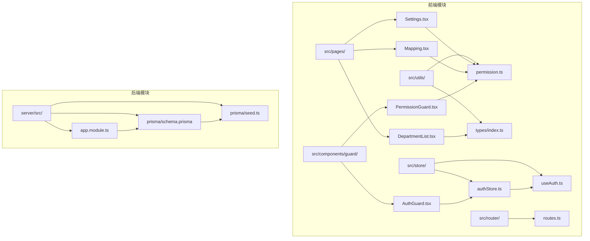
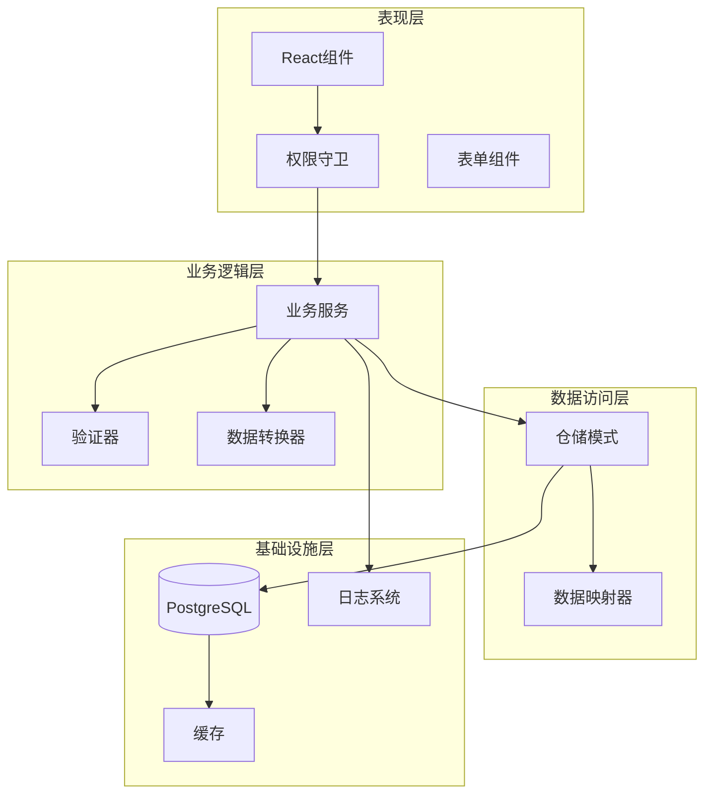
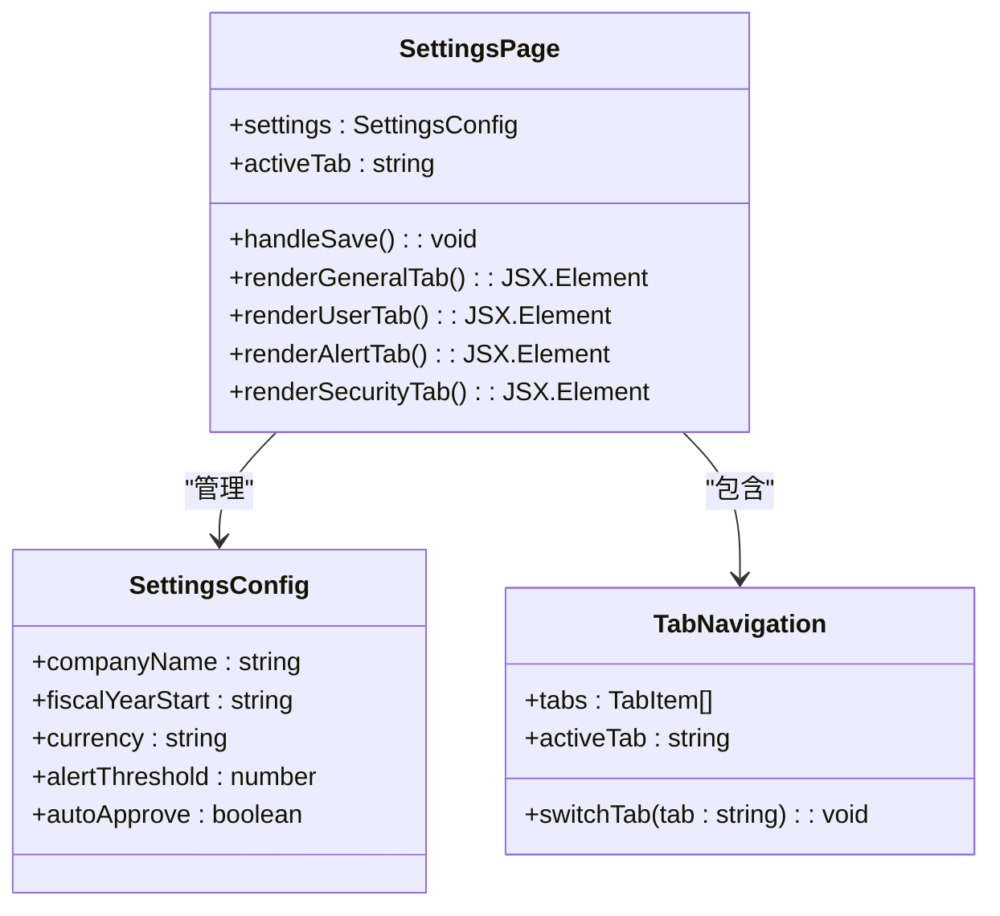
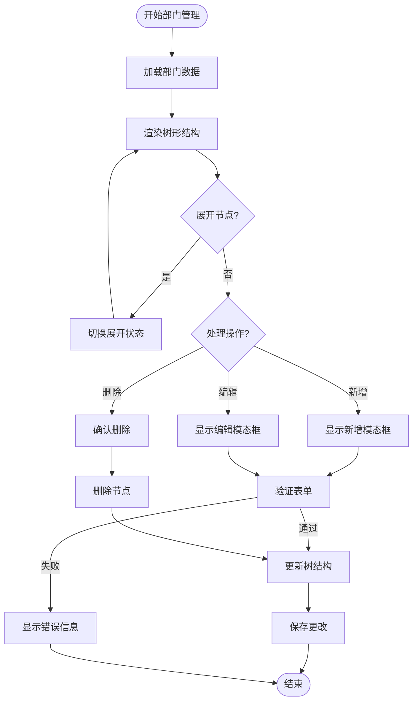
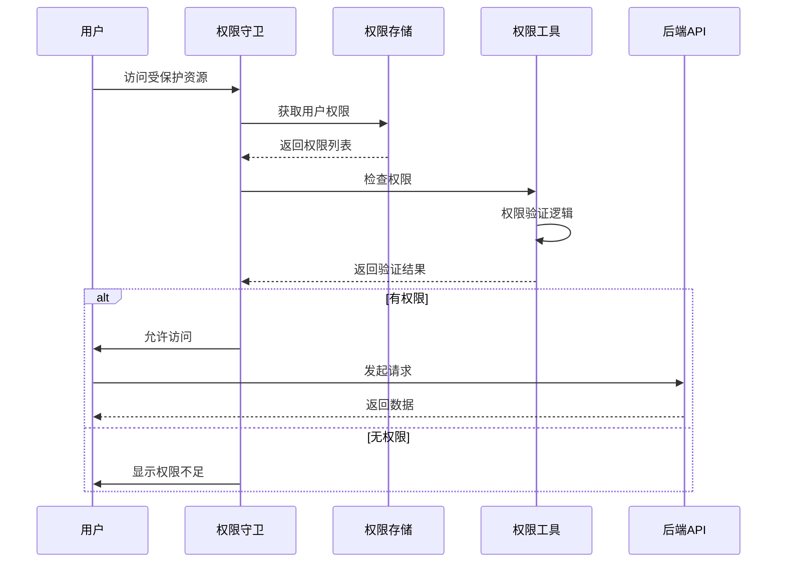
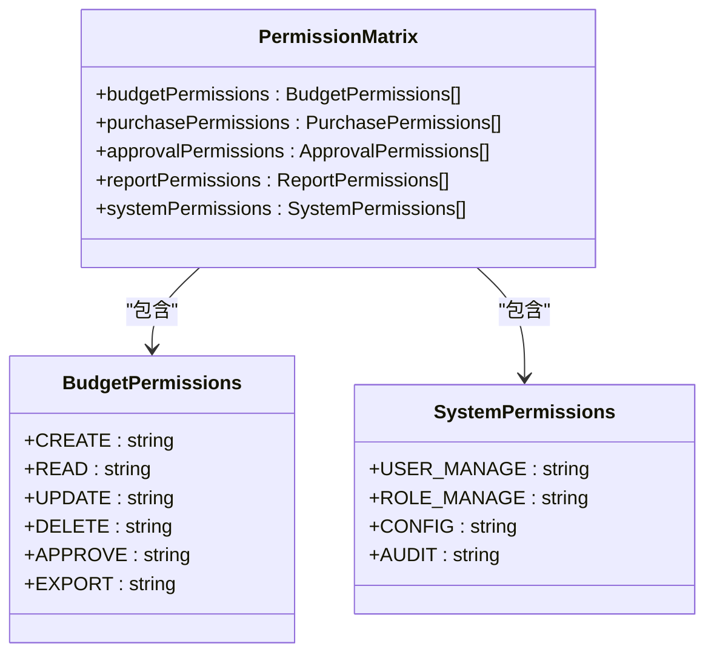
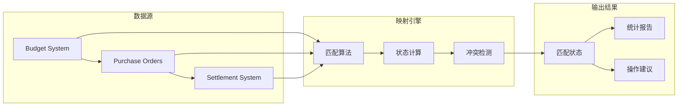
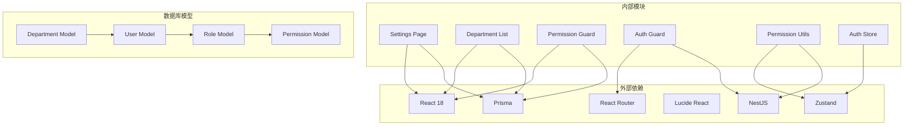

# 系统管理模块

<cite>
**本文档引用的文件**
- [Settings.tsx](file://src/pages/Settings.tsx)
- [DepartmentList.tsx](file://src/pages/DepartmentList.tsx)
- [Mapping.tsx](file://src/pages/Mapping.tsx)
- [PermissionGuard.tsx](file://src/components/guard/PermissionGuard.tsx)
- [permission.ts](file://src/utils/permission.ts)
- [index.ts](file://src/types/index.ts)
- [routes.ts](file://src/router/routes.ts)
- [authStore.ts](file://src/store/authStore.ts)
- [AuthGuard.tsx](file://src/components/guard/AuthGuard.tsx)
- [useAuth.ts](file://src/hooks/useAuth.ts)
- [app.module.ts](file://server/src/app.module.ts)
- [schema.prisma](file://server/src/prisma/schema.prisma)
- [seed.ts](file://server/src/prisma/seed.ts)
</cite>

## 目录
1. [简介](#简介)
2. [项目结构](#项目结构)
3. [核心组件](#核心组件)
4. [架构概览](#架构概览)
5. [详细组件分析](#详细组件分析)
6. [依赖分析](#依赖分析)
7. [性能考虑](#性能考虑)
8. [故障排除指南](#故障排除指南)
9. [结论](#结论)

## 简介

系统管理模块是预算管理系统的核心管理功能集合，负责维护整个系统的组织架构、用户权限和基础配置。该模块提供了完整的部门管理、用户权限控制、系统配置和数据映射功能，确保预算管理系统的正常运行和安全管控。

系统管理模块采用前后端分离架构，前端使用React技术栈构建用户界面，后端基于NestJS框架提供RESTful API服务，数据库采用PostgreSQL配合Prisma ORM进行数据持久化。

## 项目结构

系统管理模块在项目中的组织结构如下：

**图表来源**
- [Settings.tsx:1-160](file://src/pages/Settings.tsx#L1-L160)
- [DepartmentList.tsx:1-440](file://src/pages/DepartmentList.tsx#L1-L440)
- [PermissionGuard.tsx:1-88](file://src/components/guard/PermissionGuard.tsx#L1-L88)
- [permission.ts:1-84](file://src/utils/permission.ts#L1-L84)
- [schema.prisma:1-448](file://server/src/prisma/schema.prisma#L1-L448)

**章节来源**
- [routes.ts:1-122](file://src/router/routes.ts#L1-L122)
- [app.module.ts:1-34](file://server/src/app.module.ts#L1-L34)

## 核心组件

系统管理模块包含以下核心组件：

### 1. 系统设置组件
- **功能**: 提供系统参数配置、用户管理和安全设置
- **界面**: 多标签页布局，支持通用设置、用户管理、预警设置和安全设置
- **数据**: 使用本地状态管理，支持实时预览和批量保存

### 2. 部门管理组件
- **功能**: 维护组织架构树形结构，支持多级部门管理
- **特性**: 树形展示、动态展开折叠、父子关系验证、批量操作
- **权限**: 支持部门负责人和预算管理员配置

### 3. 数据映射组件
- **功能**: 关联预算、采购、财务三单数据，提供匹配状态统计
- **状态**: 支持已匹配、部分匹配、未匹配三种状态
- **统计**: 实时显示匹配统计信息和状态分布

### 4. 权限控制组件
- **认证守卫**: 页面级权限控制，基于路由配置
- **按钮级权限**: 组件内权限控制，支持AND/OR逻辑组合
- **权限工具**: 统一的权限判断和生成工具函数

**章节来源**
- [Settings.tsx:13-160](file://src/pages/Settings.tsx#L13-L160)
- [DepartmentList.tsx:83-440](file://src/pages/DepartmentList.tsx#L83-L440)
- [Mapping.tsx:12-90](file://src/pages/Mapping.tsx#L12-L90)
- [PermissionGuard.tsx:15-88](file://src/components/guard/PermissionGuard.tsx#L15-L88)

## 架构概览

系统管理模块采用分层架构设计，确保职责分离和可维护性：

**图表来源**
- [app.module.ts:12-32](file://server/src/app.module.ts#L12-L32)
- [schema.prisma:15-103](file://server/src/prisma/schema.prisma#L15-L103)

## 详细组件分析

### 系统设置组件分析

系统设置组件提供了一个完整的配置管理界面，支持多种类型的系统配置：

**图表来源**
- [Settings.tsx:4-20](file://src/pages/Settings.tsx#L4-L20)

#### 配置类型定义

系统设置支持以下配置类型：

| 配置类别 | 字段名称 | 数据类型 | 描述 |
|---------|----------|----------|------|
| 通用设置 | companyName | string | 公司名称 |
| 通用设置 | fiscalYearStart | string | 财年起始月份 |
| 通用设置 | currency | string | 货币单位 |
| 预警设置 | alertThreshold | number | 预算消耗预警阈值 |
| 安全设置 | autoApprove | boolean | 自动审批开关 |

**章节来源**
- [Settings.tsx:5-11](file://src/pages/Settings.tsx#L5-L11)

### 部门管理组件分析

部门管理组件实现了完整的组织架构树形管理功能：

**图表来源**
- [DepartmentList.tsx:107-224](file://src/pages/DepartmentList.tsx#L107-L224)

#### 部门层级设计

系统支持三级部门结构设计：

| 层级 | 名称 | 描述 | 示例 |
|------|------|------|------|
| 一级 | 事业部 | 最高层级部门 | 研发事业部、生产事业部、职能部门 |
| 二级 | 部门 | 二级管理单元 | 研发部、测试部、生产部、财务部等 |
| 三级 | 组 | 最小管理单元 | 芯片研发组、软件研发组、功能测试组等 |

**章节来源**
- [DepartmentList.tsx:16-81](file://src/pages/DepartmentList.tsx#L16-L81)

### 权限管理组件分析

权限管理组件提供了多层次的权限控制机制：

**图表来源**
- [PermissionGuard.tsx:21-45](file://src/components/guard/PermissionGuard.tsx#L21-L45)

#### 权限矩阵设计

系统权限采用模块化设计，支持细粒度的权限控制：

**图表来源**
- [permission.ts:53-83](file://src/utils/permission.ts#L53-L83)

**章节来源**
- [permission.ts:11-21](file://src/utils/permission.ts#L11-L21)

### 数据映射组件分析

数据映射组件实现了预算、采购、财务三单的数据关联功能：

**图表来源**
- [Mapping.tsx:15-19](file://src/pages/Mapping.tsx#L15-L19)

#### 映射状态管理

系统提供三种映射状态：

| 状态 | 图标 | 颜色 | 描述 | 处理建议 |
|------|------|------|------|----------|
| matched | ✓ | green | 完全匹配 | 无需处理 |
| partial | ⚠ | yellow | 部分匹配 | 检查差异项 |
| unmatched | ✗ | red | 未匹配 | 手动匹配或检查数据 |

**章节来源**
- [Mapping.tsx:15-19](file://src/pages/Mapping.tsx#L15-L19)

## 依赖分析

系统管理模块的依赖关系如下：

**图表来源**
- [routes.ts:1-22](file://src/router/routes.ts#L1-L22)
- [app.module.ts:5-10](file://server/src/app.module.ts#L5-L10)

**章节来源**
- [index.ts:3-53](file://src/types/index.ts#L3-L53)
- [schema.prisma:15-103](file://server/src/prisma/schema.prisma#L15-L103)

## 性能考虑

系统管理模块在设计时充分考虑了性能优化：

### 前端性能优化
- **懒加载**: 所有页面组件采用懒加载策略，减少初始包体积
- **虚拟滚动**: 大数据量表格使用虚拟滚动提升渲染性能
- **状态管理**: 使用Zustand替代Redux，减少不必要的重渲染
- **权限缓存**: 权限信息本地缓存，避免重复计算

### 后端性能优化
- **数据库索引**: 关键字段建立复合索引，优化查询性能
- **连接池**: 数据库连接池配置，提高并发处理能力
- **缓存策略**: Redis缓存热点数据，减少数据库压力
- **分页查询**: 大数据量查询使用分页机制

### 安全性能
- **权限验证**: 前后端双重权限验证，确保数据安全
- **SQL注入防护**: Prisma ORM自动防护SQL注入攻击
- **XSS防护**: 输入数据严格验证和过滤
- **CSRF防护**: Token验证防止跨站请求伪造

## 故障排除指南

### 常见问题及解决方案

#### 1. 权限相关问题
**问题**: 用户无法访问某些功能
**原因**: 权限配置不正确或权限缓存异常
**解决方案**:
- 检查用户角色是否包含相应权限
- 清除浏览器本地存储的权限缓存
- 验证后端权限服务是否正常运行

#### 2. 部门树形结构异常
**问题**: 部门层级显示错误或无法展开
**原因**: 数据库父子关系不完整或前端状态同步问题
**解决方案**:
- 检查数据库中部门的parentId字段
- 验证前端树形渲染逻辑
- 重新加载页面清除缓存状态

#### 3. 系统设置保存失败
**问题**: 设置更改无法保存到数据库
**原因**: API接口异常或网络连接问题
**解决方案**:
- 检查后端API服务状态
- 验证数据库连接配置
- 查看浏览器开发者工具中的网络请求

#### 4. 数据映射不准确
**问题**: 预算、采购、财务数据无法正确关联
**原因**: 数据格式不一致或匹配算法问题
**解决方案**:
- 检查数据导入格式是否符合要求
- 验证匹配规则配置
- 手动执行数据清洗和标准化

**章节来源**
- [PermissionGuard.tsx:21-45](file://src/components/guard/PermissionGuard.tsx#L21-L45)
- [DepartmentList.tsx:162-175](file://src/pages/DepartmentList.tsx#L162-L175)

## 结论

系统管理模块为预算管理系统提供了完整的管理功能集合，涵盖了组织架构管理、用户权限控制、系统配置和数据映射等核心功能。模块采用现代化的技术栈和架构设计，具有良好的可扩展性和维护性。

### 主要优势
1. **功能完整性**: 涵盖了系统管理的所有关键功能
2. **权限安全**: 多层次权限控制确保系统安全
3. **用户体验**: 直观的界面设计和流畅的操作体验
4. **技术先进**: 采用最新的前端和后端技术栈
5. **可扩展性**: 模块化设计便于功能扩展和维护

### 技术特色
- 响应式设计适配多种设备
- 实时权限验证和状态同步
- 完善的审计日志和监控机制
- 高性能的数据处理和存储方案
- 安全可靠的身份认证和授权体系

系统管理模块为整个预算管理系统的稳定运行奠定了坚实的基础，为用户提供了一个功能强大、安全可靠的管理平台。