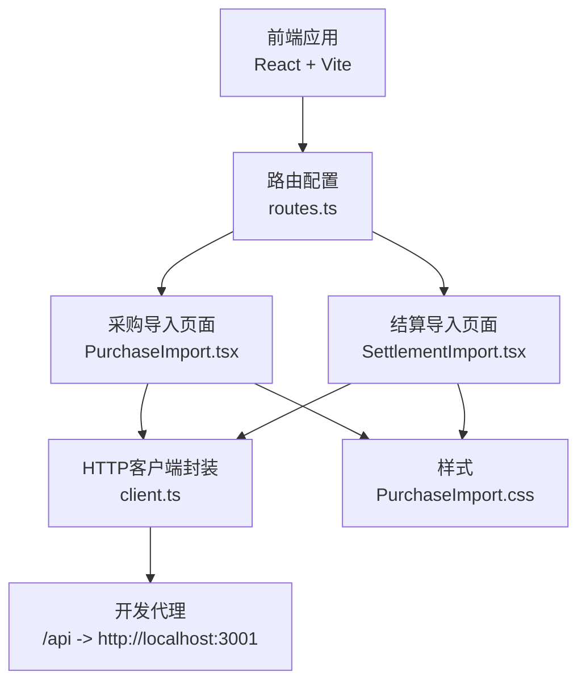
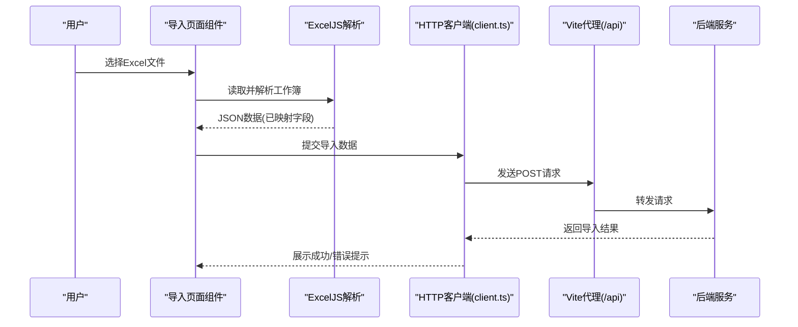
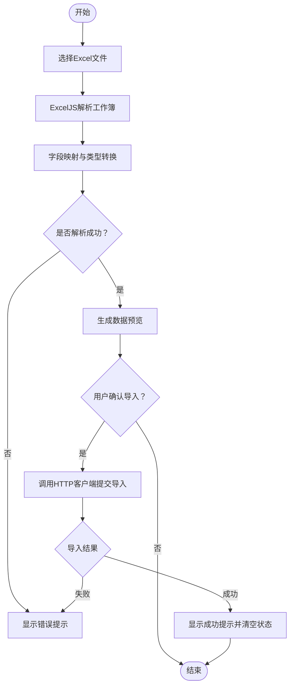
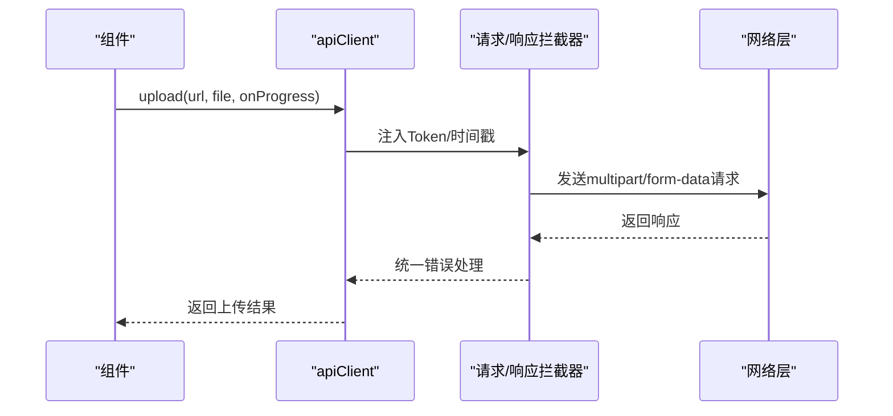
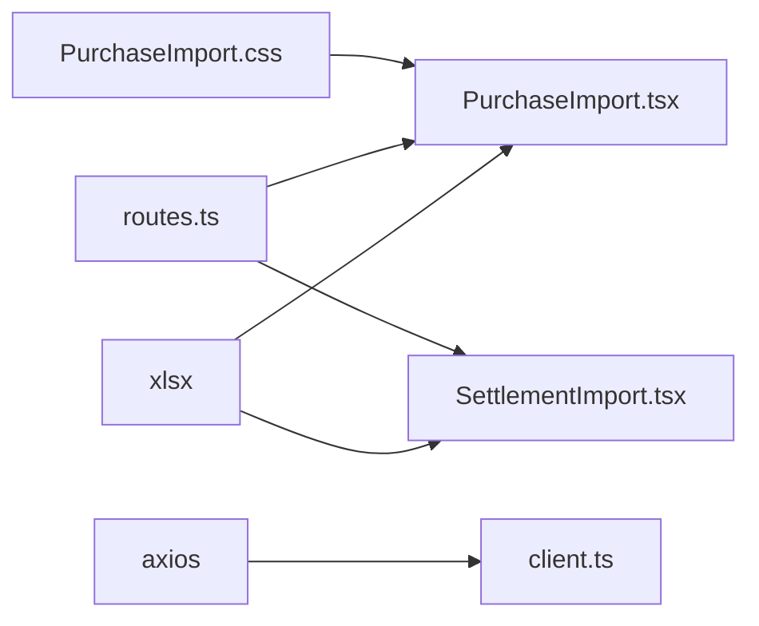
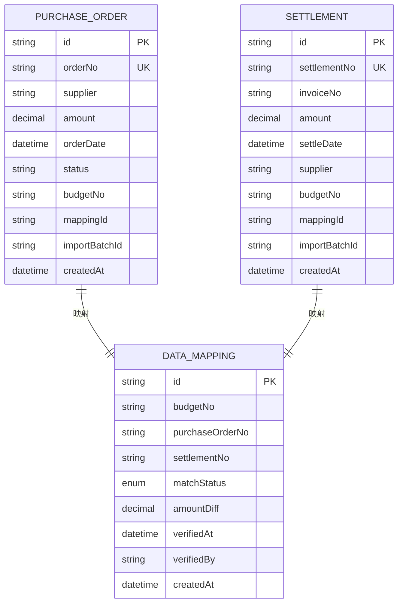

# Excel数据导入

<cite>
**本文引用的文件**
- [PurchaseImport.tsx](file://src/pages/PurchaseImport.tsx)
- [SettlementImport.tsx](file://src/pages/SettlementImport.tsx)
- [routes.ts](file://src/router/routes.ts)
- [client.ts](file://src/api/client.ts)
- [schema.prisma](file://server/src/prisma/schema.prisma)
- [PurchaseImport.css](file://src/pages/PurchaseImport.css)
- [vite.config.ts](file://vite.config.ts)
- [main.tsx](file://src/main.tsx)
- [package.json](file://package.json)
</cite>

## 目录
1. [简介](#简介)
2. [项目结构](#项目结构)
3. [核心组件](#核心组件)
4. [架构总览](#架构总览)
5. [详细组件分析](#详细组件分析)
6. [依赖关系分析](#依赖关系分析)
7. [性能考虑](#性能考虑)
8. [故障排查指南](#故障排查指南)
9. [结论](#结论)
10. [附录](#附录)

## 简介
本文件面向“Excel数据导入”功能，围绕采购订单导入与财务结算单导入两大场景，系统性梳理前端文件上传组件实现、Excel解析与数据转换、模板下载、以及与后端交互的接口封装与代理配置。同时结合后端Prisma数据模型，给出导入后的数据落库、批次管理、三单关联与状态更新的建议方案，并提供基于ExcelJS库的使用要点与最佳实践。

## 项目结构
- 前端采用React + Vite，路由通过懒加载组织页面组件；导入页面位于src/pages目录下，分别提供采购订单导入与财务结算单导入页面。
- 前端通过Axios封装统一的HTTP客户端，内置请求/响应拦截器、Token注入、超时控制与错误处理。
- 后端Prisma定义了导入相关的实体模型（采购订单、结算单、数据映射），并提供索引与枚举类型支撑后续的匹配与状态管理。

图表来源
- [routes.ts:86-95](file://src/router/routes.ts#L86-L95)
- [PurchaseImport.tsx:14-170](file://src/pages/PurchaseImport.tsx#L14-L170)
- [SettlementImport.tsx:14-145](file://src/pages/SettlementImport.tsx#L14-L145)
- [client.ts:1-183](file://src/api/client.ts#L1-L183)
- [vite.config.ts:15-23](file://vite.config.ts#L15-L23)

章节来源
- [routes.ts:86-95](file://src/router/routes.ts#L86-L95)
- [PurchaseImport.tsx:14-170](file://src/pages/PurchaseImport.tsx#L14-L170)
- [SettlementImport.tsx:14-145](file://src/pages/SettlementImport.tsx#L14-L145)
- [client.ts:1-183](file://src/api/client.ts#L1-L183)
- [vite.config.ts:15-23](file://vite.config.ts#L15-L23)

## 核心组件
- 采购订单导入页面：负责Excel文件选择、解析、字段映射、数据预览与导入确认。
- 财务结算单导入页面：负责Excel文件选择、解析、字段映射、数据预览与导入确认。
- HTTP客户端：统一封装Axios实例，提供GET/POST/PUT/DELETE与文件上传/下载能力，内置鉴权与错误处理。
- 路由配置：暴露导入页面路由，确保页面可访问。
- 样式：提供上传区域、文件信息、错误与成功提示的视觉样式。

章节来源
- [PurchaseImport.tsx:14-170](file://src/pages/PurchaseImport.tsx#L14-L170)
- [SettlementImport.tsx:14-145](file://src/pages/SettlementImport.tsx#L14-L145)
- [client.ts:105-183](file://src/api/client.ts#L105-L183)
- [routes.ts:86-95](file://src/router/routes.ts#L86-L95)
- [PurchaseImport.css:1-58](file://src/pages/PurchaseImport.css#L1-L58)

## 架构总览
前端导入页面通过ExcelJS解析用户上传的Excel文件，生成标准化的数据结构，随后调用HTTP客户端进行导入提交。开发环境下，前端通过Vite代理将/api请求转发至后端服务端口。

图表来源
- [PurchaseImport.tsx:21-65](file://src/pages/PurchaseImport.tsx#L21-L65)
- [SettlementImport.tsx:21-63](file://src/pages/SettlementImport.tsx#L21-L63)
- [client.ts:112-183](file://src/api/client.ts#L112-L183)
- [vite.config.ts:17-22](file://vite.config.ts#L17-L22)

## 详细组件分析

### 采购订单导入页面
- 文件上传与解析：监听文件输入事件，使用ExcelJS读取第一个工作表并转换为JSON；随后对关键字段进行映射与类型转换。
- 字段映射规则：订单号、供应商、金额、日期、状态、预算编号，其中状态默认值为“待匹配”，便于后续匹配流程。
- 数据预览：展示前10条记录及总数，支持确认导入。
- 成功/错误提示：根据解析结果设置成功或错误状态，提示用户。
- 模板下载：生成包含示例数据的工作簿并下载。

图表来源
- [PurchaseImport.tsx:21-65](file://src/pages/PurchaseImport.tsx#L21-L65)

章节来源
- [PurchaseImport.tsx:14-170](file://src/pages/PurchaseImport.tsx#L14-L170)

### 财务结算单导入页面
- 文件上传与解析：与采购导入类似，读取第一个工作表并转换为JSON；对结算单号、发票号、金额、日期、供应商、预算编号进行映射。
- 数据预览：展示前10条记录及总数，支持确认导入。
- 成功/错误提示：根据解析结果设置成功或错误状态。
- 模板下载：生成包含示例数据的工作簿并下载。

图表来源
- [SettlementImport.tsx:21-63](file://src/pages/SettlementImport.tsx#L21-L63)

章节来源
- [SettlementImport.tsx:14-145](file://src/pages/SettlementImport.tsx#L14-L145)

### HTTP客户端与文件上传
- 统一基地址与超时：基于环境变量配置API基础路径，默认30秒超时。
- 请求拦截：自动注入Authorization头（Bearer Token），GET请求附加时间戳参数。
- 响应拦截：集中处理401等错误并触发登出逻辑。
- 文件上传：封装FormData上传，支持进度回调。
- 文件下载：封装Blob下载，自动触发浏览器下载。

图表来源
- [client.ts:12-97](file://src/api/client.ts#L12-L97)
- [client.ts:159-183](file://src/api/client.ts#L159-L183)

章节来源
- [client.ts:1-183](file://src/api/client.ts#L1-L183)

### 路由与页面挂载
- 路由：导入页面通过懒加载方式注册在路由表中，确保按需加载。
- 页面挂载：在入口文件中引入导入页面样式，保证UI正常渲染。

章节来源
- [routes.ts:86-95](file://src/router/routes.ts#L86-L95)
- [main.tsx](file://src/main.tsx#L12)

### ExcelJS库使用要点
- 解析：读取二进制流，获取首个工作表并转换为JSON。
- 字段映射：优先中文列名，其次英文列名，缺失时回退为空字符串或默认值。
- 模板生成：使用json_to_sheet生成示例数据，book_new与append_sheet组合导出。

章节来源
- [PurchaseImport.tsx:30-75](file://src/pages/PurchaseImport.tsx#L30-L75)
- [SettlementImport.tsx:29-73](file://src/pages/SettlementImport.tsx#L29-L73)
- [package.json](file://package.json#L30)

## 依赖关系分析
- 前端依赖：ExcelJS用于解析Excel；Axios用于HTTP通信；Vite提供开发代理与构建工具链。
- 路由依赖：导入页面通过路由注册接入应用。
- 样式依赖：导入页面样式独立于主样式，确保上传区域与提示框的视觉一致性。

图表来源
- [package.json](file://package.json#L30)
- [PurchaseImport.tsx](file://src/pages/PurchaseImport.tsx#L3)
- [SettlementImport.tsx](file://src/pages/SettlementImport.tsx#L3)
- [client.ts](file://src/api/client.ts#L1)
- [routes.ts:16-17](file://src/router/routes.ts#L16-L17)
- [routes.ts:92-93](file://src/router/routes.ts#L92-L93)
- [PurchaseImport.css](file://src/pages/PurchaseImport.css#L1)

章节来源
- [package.json:12-32](file://package.json#L12-L32)
- [routes.ts:16-17](file://src/router/routes.ts#L16-L17)
- [routes.ts:92-93](file://src/router/routes.ts#L92-L93)

## 性能考虑
- 大文件处理：前端解析Excel会占用内存与CPU，建议限制文件大小并在移动端谨慎使用。
- 批量导入：当前前端示例直接在内存中生成数组，建议后端实现分批写入与事务控制，避免单次导入过大导致超时。
- 进度反馈：文件上传已具备进度回调，可在后端实现分片/批次导入后同步进度。
- 缓存与重试：后端可引入幂等键与重试机制，避免重复导入造成脏数据。

## 故障排查指南
- 文件解析失败：检查Excel格式是否为.xlsx/.xls，列名是否包含中文或英文对应字段，确保第一张工作表存在。
- 金额/日期类型异常：确认金额为数值型，日期为标准日期格式；前端已做Number转换，后端亦需做二次校验。
- 401未授权：检查本地Token是否存在且有效，响应拦截器会在401时清除Token并跳转登录页。
- 网络错误：确认Vite代理配置正确，/api指向后端服务端口。

章节来源
- [PurchaseImport.tsx:49-52](file://src/pages/PurchaseImport.tsx#L49-L52)
- [SettlementImport.tsx:48-51](file://src/pages/SettlementImport.tsx#L48-L51)
- [client.ts:52-94](file://src/api/client.ts#L52-L94)
- [vite.config.ts:17-22](file://vite.config.ts#L17-L22)

## 结论
当前前端已完整实现Excel文件上传、解析、字段映射与数据预览，并提供模板下载与基本的错误/成功提示。后端Prisma模型明确了导入实体与关联关系，建议在后端完善导入接口、批次管理、三单匹配与状态更新逻辑，以形成闭环的数据导入与治理流程。

## 附录

### Excel文件格式规范与字段映射
- 采购订单导入
  - 支持列名：中文“订单号/供应商/金额/日期/状态/预算编号”或英文“orderNo/supplier/amount/date/status/budgetCode”
  - 默认值：状态默认“待匹配”
  - 示例模板字段：订单号、供应商、金额、日期、状态、预算编号
- 财务结算单导入
  - 支持列名：中文“结算单号/发票号/金额/日期/供应商/预算编号”或英文“settlementNo/invoiceNo/amount/date/supplier/budgetCode”
  - 示例模板字段：结算单号、发票号、金额、日期、供应商、预算编号

章节来源
- [PurchaseImport.tsx:38-44](file://src/pages/PurchaseImport.tsx#L38-L44)
- [SettlementImport.tsx:37-43](file://src/pages/SettlementImport.tsx#L37-L43)
- [PurchaseImport.tsx:67-75](file://src/pages/PurchaseImport.tsx#L67-L75)
- [SettlementImport.tsx:65-73](file://src/pages/SettlementImport.tsx#L65-L73)

### 导入前数据校验机制（建议）
- 必填字段检查：订单号/结算单号、金额、日期、供应商
- 数据类型验证：金额必须为数值，日期必须为合法日期
- 格式规范校验：日期格式统一为YYYY-MM-DD，金额保留两位小数
- 业务规则验证：金额>0，同一导入批次内订单号/结算单号唯一

### 导入过程中的错误处理策略（建议）
- 单条记录错误标记：后端返回每条记录的校验结果与错误原因，前端以表格形式高亮错误行
- 批量导入失败处理：后端事务回滚，返回失败批次与失败原因
- 错误信息反馈：统一错误码与消息，前端以Toast或弹窗提示

### 导入后的数据处理流程（建议）
- 数据清洗：去除空白、标准化文本大小写、统一日期格式
- 重复检测：按订单号/结算单号与预算编号进行去重
- 关联查询：与预算、采购请购单进行三单关联，生成匹配关系
- 状态更新：根据匹配结果更新状态（如“待匹配/部分匹配/完全匹配”）

### 后端Prisma模型与导入相关的关键点
- 采购订单模型：包含订单号唯一索引、金额精度、导入批次标识、预算编号与映射ID
- 结算单模型：包含结算单号唯一索引、发票号、金额精度、导入批次标识、预算编号与映射ID
- 数据映射模型：用于记录预算编号与采购/结算单的匹配状态与差异

图表来源
- [schema.prisma:268-313](file://server/src/prisma/schema.prisma#L268-L313)

章节来源
- [schema.prisma:268-313](file://server/src/prisma/schema.prisma#L268-L313)

### 前端文件上传组件实现要点
- 拖拽上传：可通过点击触发文件选择，或在上传区域添加拖拽事件（建议扩展）
- 进度显示：利用文件上传的进度回调，展示百分比
- 错误提示：解析失败、格式不支持、空文件等情况统一提示
- 成功确认：导入成功后清空状态并提示用户

章节来源
- [PurchaseImport.tsx:95-126](file://src/pages/PurchaseImport.tsx#L95-L126)
- [SettlementImport.tsx:92-108](file://src/pages/SettlementImport.tsx#L92-L108)
- [PurchaseImport.css:1-58](file://src/pages/PurchaseImport.css#L1-L58)

### ExcelJS库使用示例与最佳实践
- 使用xlsx库读取Excel并转换为JSON，再进行字段映射与类型转换
- 模板下载：使用json_to_sheet与book_new/append_sheet生成示例工作簿
- 最佳实践：严格区分中文与英文列名，提供默认值与容错处理；对大文件进行分页/分批处理

章节来源
- [PurchaseImport.tsx:30-75](file://src/pages/PurchaseImport.tsx#L30-L75)
- [SettlementImport.tsx:29-73](file://src/pages/SettlementImport.tsx#L29-L73)
- [package.json](file://package.json#L30)