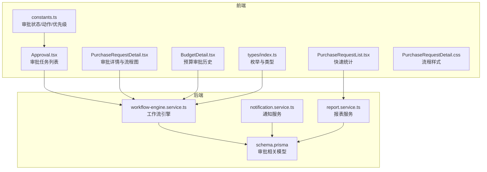
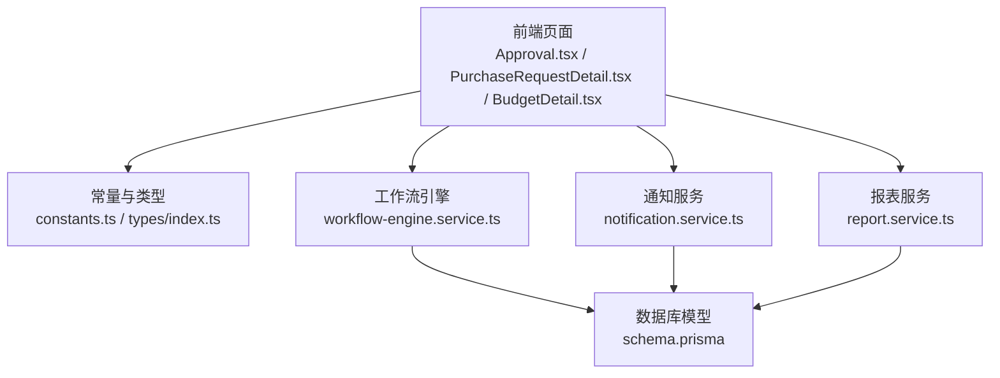
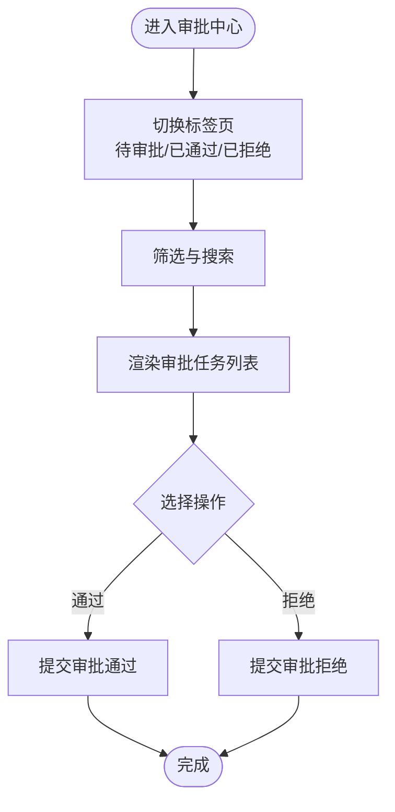
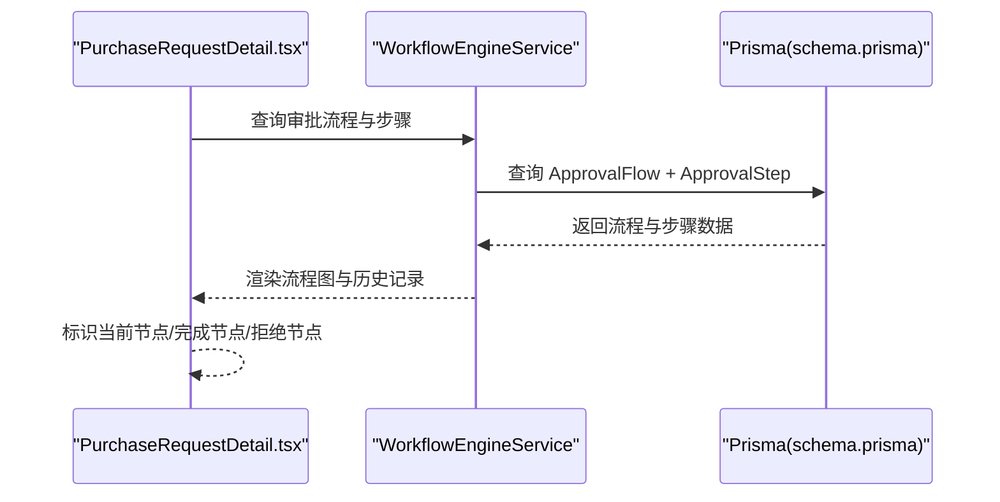
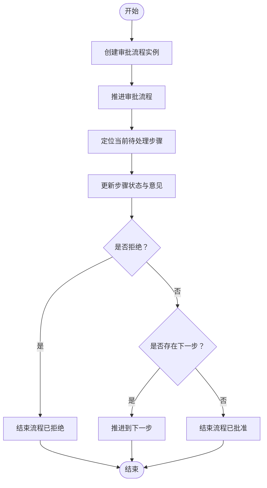
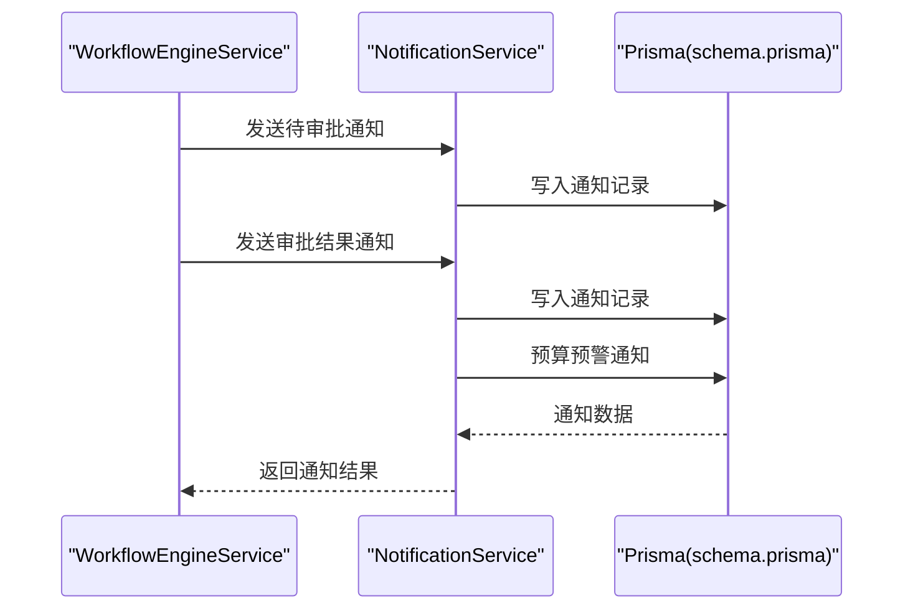
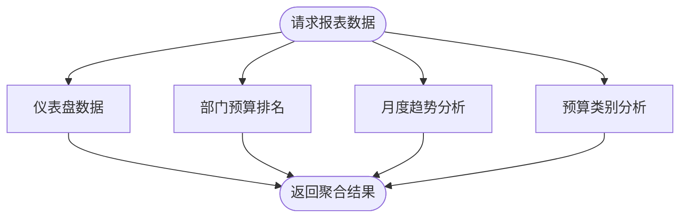
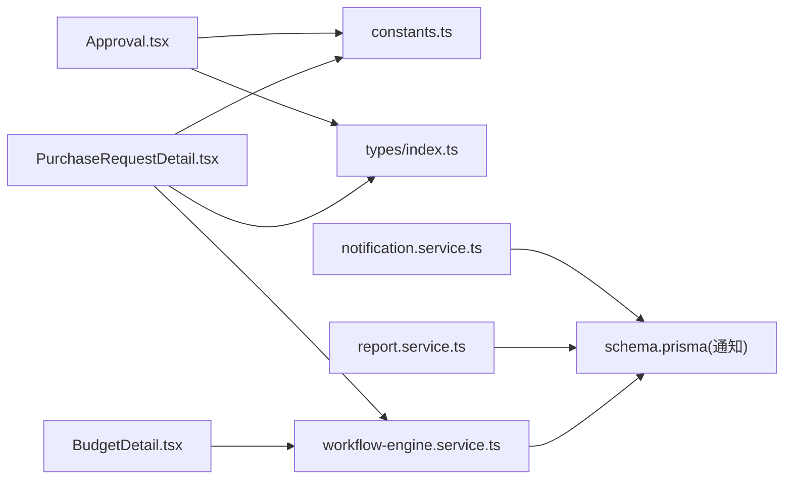

# 审批中心

<cite>
**本文引用的文件**
- [Approval.tsx](file://src/pages/Approval.tsx)
- [PurchaseRequestDetail.tsx](file://src/pages/PurchaseRequestDetail.tsx)
- [PurchaseRequestDetail.css](file://src/pages/PurchaseRequestDetail.css)
- [BudgetDetail.tsx](file://src/pages/BudgetDetail.tsx)
- [PurchaseRequestList.tsx](file://src/pages/PurchaseRequestList.tsx)
- [constants.ts](file://src/utils/constants.ts)
- [types/index.ts](file://src/types/index.ts)
- [workflow-engine.service.ts](file://server/src/modules/workflow/workflow-engine.service.ts)
- [notification.service.ts](file://server/src/modules/notification/notification.service.ts)
- [schema.prisma](file://server/src/prisma/schema.prisma)
- [report.service.ts](file://server/src/modules/report/report.service.ts)
</cite>

## 目录
1. [简介](#简介)
2. [项目结构](#项目结构)
3. [核心组件](#核心组件)
4. [架构总览](#架构总览)
5. [详细组件分析](#详细组件分析)
6. [依赖关系分析](#依赖关系分析)
7. [性能考量](#性能考量)
8. [故障排查指南](#故障排查指南)
9. [结论](#结论)
10. [附录](#附录)

## 简介
本文件面向“审批中心”功能，系统化阐述多级审批流程的实现机制与扩展方案，覆盖审批任务分配、状态跟踪、历史查询、节点配置、权限控制、时限管理、紧急审批、任务分类与优先级、审批操作（通过/拒绝/退回/转办）、通知机制、统计报表与效率分析等。文档以仓库现有代码为基础，结合数据库模型与服务层实现，提供可落地的架构视图与开发指引。

## 项目结构
审批中心涉及前端页面、通用常量与类型定义，以及后端工作流引擎、通知与报表模块。整体采用前后端分离架构，前端负责审批任务列表与流程可视化，后端通过工作流引擎驱动审批流转，并通过通知服务推送消息。

图表来源
- [Approval.tsx:1-99](file://src/pages/Approval.tsx#L1-L99)
- [PurchaseRequestDetail.tsx:150-219](file://src/pages/PurchaseRequestDetail.tsx#L150-L219)
- [BudgetDetail.tsx:140-159](file://src/pages/BudgetDetail.tsx#L140-L159)
- [PurchaseRequestList.tsx:177-212](file://src/pages/PurchaseRequestList.tsx#L177-L212)
- [constants.ts:33-60](file://src/utils/constants.ts#L33-L60)
- [types/index.ts:244-307](file://src/types/index.ts#L244-L307)
- [workflow-engine.service.ts:1-149](file://server/src/modules/workflow/workflow-engine.service.ts#L1-L149)
- [notification.service.ts:1-157](file://server/src/modules/notification/notification.service.ts#L1-L157)
- [report.service.ts:1-144](file://server/src/modules/report/report.service.ts#L1-L144)
- [schema.prisma:218-264](file://server/src/prisma/schema.prisma#L218-L264)

章节来源
- [Approval.tsx:1-99](file://src/pages/Approval.tsx#L1-L99)
- [PurchaseRequestDetail.tsx:150-219](file://src/pages/PurchaseRequestDetail.tsx#L150-L219)
- [BudgetDetail.tsx:140-159](file://src/pages/BudgetDetail.tsx#L140-L159)
- [PurchaseRequestList.tsx:177-212](file://src/pages/PurchaseRequestList.tsx#L177-L212)
- [constants.ts:33-60](file://src/utils/constants.ts#L33-L60)
- [types/index.ts:244-307](file://src/types/index.ts#L244-L307)
- [workflow-engine.service.ts:1-149](file://server/src/modules/workflow/workflow-engine.service.ts#L1-L149)
- [notification.service.ts:1-157](file://server/src/modules/notification/notification.service.ts#L1-L157)
- [report.service.ts:1-144](file://server/src/modules/report/report.service.ts#L1-L144)
- [schema.prisma:218-264](file://server/src/prisma/schema.prisma#L218-L264)

## 核心组件
- 前端审批任务列表：提供待审批/已通过/已拒绝的筛选与展示，支持基础审批操作按钮。
- 审批详情与流程图：展示审批流程的多级节点、当前节点标识与历史记录。
- 通知服务：发送待审批提醒、审批结果通知与预算预警。
- 工作流引擎：创建审批流程实例、推进流程、终止与完成流程。
- 报表服务：提供仪表盘、部门排名、月度趋势与预算类别分析等统计能力。
- 数据模型：审批流程、审批步骤、工作流模板、通知与审计日志等。

章节来源
- [Approval.tsx:11-99](file://src/pages/Approval.tsx#L11-L99)
- [PurchaseRequestDetail.tsx:150-219](file://src/pages/PurchaseRequestDetail.tsx#L150-L219)
- [notification.service.ts:93-156](file://server/src/modules/notification/notification.service.ts#L93-L156)
- [workflow-engine.service.ts:11-135](file://server/src/modules/workflow/workflow-engine.service.ts#L11-L135)
- [report.service.ts:11-142](file://server/src/modules/report/report.service.ts#L11-L142)
- [schema.prisma:220-264](file://server/src/prisma/schema.prisma#L220-L264)

## 架构总览
审批中心采用“前端页面 + 后端服务 + 数据库模型”的分层架构。前端通过页面组件渲染审批任务与流程图，后端通过工作流引擎与通知服务协同完成审批流转与消息推送，数据库模型支撑审批状态、流程步骤与通知记录。

图表来源
- [Approval.tsx:1-99](file://src/pages/Approval.tsx#L1-L99)
- [PurchaseRequestDetail.tsx:150-219](file://src/pages/PurchaseRequestDetail.tsx#L150-L219)
- [BudgetDetail.tsx:140-159](file://src/pages/BudgetDetail.tsx#L140-L159)
- [constants.ts:33-60](file://src/utils/constants.ts#L33-L60)
- [types/index.ts:244-307](file://src/types/index.ts#L244-L307)
- [workflow-engine.service.ts:1-149](file://server/src/modules/workflow/workflow-engine.service.ts#L1-L149)
- [notification.service.ts:1-157](file://server/src/modules/notification/notification.service.ts#L1-L157)
- [report.service.ts:1-144](file://server/src/modules/report/report.service.ts#L1-L144)
- [schema.prisma:218-264](file://server/src/prisma/schema.prisma#L218-L264)

## 详细组件分析

### 审批任务列表与筛选
- 页面提供“待审批/已通过/已拒绝”三个标签页，分别统计与展示对应状态的任务。
- 支持按类型、部门、金额、申请人、当前步骤等字段筛选与排序。
- 提供“通过/拒绝”等基础审批操作入口（当前为占位按钮，后续接入后端接口）。

图表来源
- [Approval.tsx:32-99](file://src/pages/Approval.tsx#L32-L99)

章节来源
- [Approval.tsx:11-99](file://src/pages/Approval.tsx#L11-L99)

### 审批流程可视化与历史追溯
- 审批详情页以时间轴形式展示审批流程，标注每个节点的角色、处理人、时间与意见。
- 当前节点以图标与颜色标识，已完成/已拒绝节点有明确视觉区分。
- 预算详情页同样提供审批历史的简化展示，便于跨模块关联查看。

图表来源
- [PurchaseRequestDetail.tsx:150-219](file://src/pages/PurchaseRequestDetail.tsx#L150-L219)
- [workflow-engine.service.ts:66-135](file://server/src/modules/workflow/workflow-engine.service.ts#L66-L135)
- [schema.prisma:233-264](file://server/src/prisma/schema.prisma#L233-L264)

章节来源
- [PurchaseRequestDetail.tsx:150-219](file://src/pages/PurchaseRequestDetail.tsx#L150-L219)
- [PurchaseRequestDetail.css:63-130](file://src/pages/PurchaseRequestDetail.css#L63-L130)
- [BudgetDetail.tsx:140-159](file://src/pages/BudgetDetail.tsx#L140-L159)
- [workflow-engine.service.ts:66-135](file://server/src/modules/workflow/workflow-engine.service.ts#L66-L135)
- [schema.prisma:233-264](file://server/src/prisma/schema.prisma#L233-L264)

### 工作流引擎与审批推进
- 创建流程：根据目标类型与模板ID选择流程模板，生成审批流程实例与初始步骤。
- 推进流程：定位当前待处理步骤，更新步骤状态与意见，判断是否继续下一流程或结束。
- 类型映射：将目标类型映射为工作流类型，支持预算、采购、调整等场景。

图表来源
- [workflow-engine.service.ts:11-135](file://server/src/modules/workflow/workflow-engine.service.ts#L11-L135)

章节来源
- [workflow-engine.service.ts:11-135](file://server/src/modules/workflow/workflow-engine.service.ts#L11-L135)

### 通知机制
- 待审批通知：向审批人发送待处理提醒，包含跳转链接。
- 审批结果通知：向申请人发送审批通过/拒绝的结果通知。
- 预算预警通知：基于使用率阈值触发预算预警通知。
- 通知列表：支持分页、标记已读/全部已读。

图表来源
- [notification.service.ts:93-156](file://server/src/modules/notification/notification.service.ts#L93-L156)
- [schema.prisma:317-330](file://server/src/prisma/schema.prisma#L317-L330)

章节来源
- [notification.service.ts:93-156](file://server/src/modules/notification/notification.service.ts#L93-L156)
- [schema.prisma:317-330](file://server/src/prisma/schema.prisma#L317-L330)

### 审批状态、动作与优先级
- 审批状态：待处理、进行中、已批准、已拒绝、已取消。
- 审批动作：同意、拒绝、撤回。
- 优先级：低、普通、高、紧急。
- 通知类型：待审批、审批结果、预算预警、预算超支、系统、报表就绪等。

章节来源
- [constants.ts:33-60](file://src/utils/constants.ts#L33-L60)
- [types/index.ts:244-307](file://src/types/index.ts#L244-L307)

### 报表与统计
- 仪表盘数据：预算总数、已批准、待审批、采购总数、待审批、预算执行率等。
- 部门预算排名：按执行率排序的部门预算汇总。
- 月度趋势分析：按月统计预算与使用情况。
- 预算类别分析：按OPEX/CAPEX统计预算与使用。

图表来源
- [report.service.ts:11-142](file://server/src/modules/report/report.service.ts#L11-L142)

章节来源
- [report.service.ts:11-142](file://server/src/modules/report/report.service.ts#L11-L142)

## 依赖关系分析
- 前端页面依赖常量与类型定义，用于状态、动作与优先级的统一管理。
- 审批详情与预算详情依赖工作流引擎查询流程与步骤，渲染流程图。
- 通知服务依赖数据库模型存储通知记录，支持分页与已读状态管理。
- 报表服务依赖数据库聚合查询，输出统计指标。

图表来源
- [Approval.tsx:1-99](file://src/pages/Approval.tsx#L1-L99)
- [PurchaseRequestDetail.tsx:150-219](file://src/pages/PurchaseRequestDetail.tsx#L150-L219)
- [BudgetDetail.tsx:140-159](file://src/pages/BudgetDetail.tsx#L140-L159)
- [constants.ts:33-60](file://src/utils/constants.ts#L33-L60)
- [types/index.ts:244-307](file://src/types/index.ts#L244-L307)
- [workflow-engine.service.ts:1-149](file://server/src/modules/workflow/workflow-engine.service.ts#L1-L149)
- [notification.service.ts:1-157](file://server/src/modules/notification/notification.service.ts#L1-L157)
- [report.service.ts:1-144](file://server/src/modules/report/report.service.ts#L1-L144)
- [schema.prisma:218-264](file://server/src/prisma/schema.prisma#L218-L264)

章节来源
- [Approval.tsx:1-99](file://src/pages/Approval.tsx#L1-L99)
- [PurchaseRequestDetail.tsx:150-219](file://src/pages/PurchaseRequestDetail.tsx#L150-L219)
- [BudgetDetail.tsx:140-159](file://src/pages/BudgetDetail.tsx#L140-L159)
- [constants.ts:33-60](file://src/utils/constants.ts#L33-L60)
- [types/index.ts:244-307](file://src/types/index.ts#L244-L307)
- [workflow-engine.service.ts:1-149](file://server/src/modules/workflow/workflow-engine.service.ts#L1-L149)
- [notification.service.ts:1-157](file://server/src/modules/notification/notification.service.ts#L1-L157)
- [report.service.ts:1-144](file://server/src/modules/report/report.service.ts#L1-L144)
- [schema.prisma:218-264](file://server/src/prisma/schema.prisma#L218-L264)

## 性能考量
- 列表查询优化：对审批状态、目标ID建立索引，减少查询开销。
- 分页与懒加载：通知列表与审批任务列表应采用分页与虚拟滚动，避免一次性加载大量数据。
- 缓存策略：对常用报表数据（如部门排名、月度趋势）进行缓存，降低数据库压力。
- 并发控制：工作流推进时使用数据库事务，确保步骤状态一致性。
- 异步通知：通知发送采用异步队列，避免阻塞主流程。

## 故障排查指南
- 流程模板缺失：创建工作流程时若未找到模板，会抛出异常。检查模板类型映射与激活状态。
- 重复推进：推进流程时仅允许未操作的步骤被处理，确保步骤顺序正确。
- 通知未送达：检查通知记录写入与渠道配置，确认用户接收通道有效。
- 统计异常：报表服务聚合查询需关注空值与除零风险，确保边界条件处理。

章节来源
- [workflow-engine.service.ts:32-83](file://server/src/modules/workflow/workflow-engine.service.ts#L32-L83)
- [notification.service.ts:93-156](file://server/src/modules/notification/notification.service.ts#L93-L156)
- [report.service.ts:38-40](file://server/src/modules/report/report.service.ts#L38-L40)

## 结论
审批中心在现有代码基础上，已具备多级审批流程的核心骨架：前端任务列表与流程可视化、后端工作流引擎与通知服务、数据库模型支撑。建议后续完善审批操作接口、权限控制、时限管理与紧急审批机制，并扩展统计与效率分析能力，以满足企业级预算与采购审批的实际需求。

## 附录
- 审批任务分类与优先级：低/普通/高/紧急，用于任务排序与提醒策略。
- 审批状态与动作：统一的状态机与动作集合，保证前后端一致性。
- 数据模型要点：ApprovalFlow/ApprovalStep/WorkflowTemplate/Notification/AuditLog 等，支撑审批全生命周期与审计追踪。

章节来源
- [constants.ts:33-60](file://src/utils/constants.ts#L33-L60)
- [types/index.ts:244-307](file://src/types/index.ts#L244-L307)
- [schema.prisma:220-264](file://server/src/prisma/schema.prisma#L220-L264)