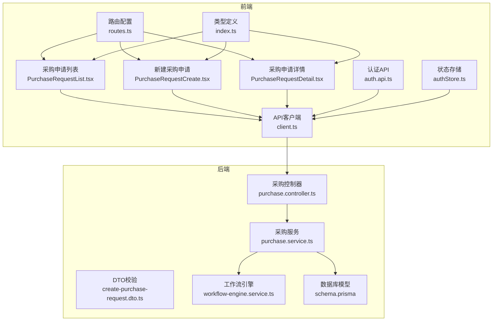
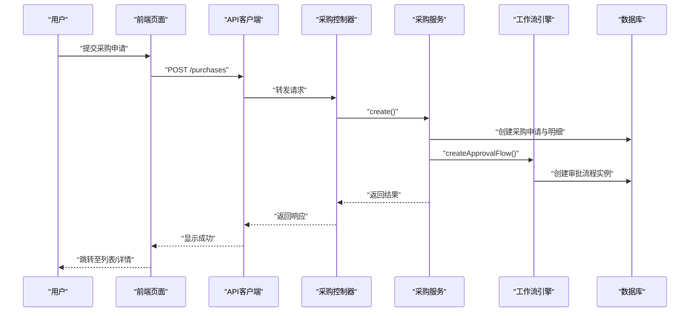
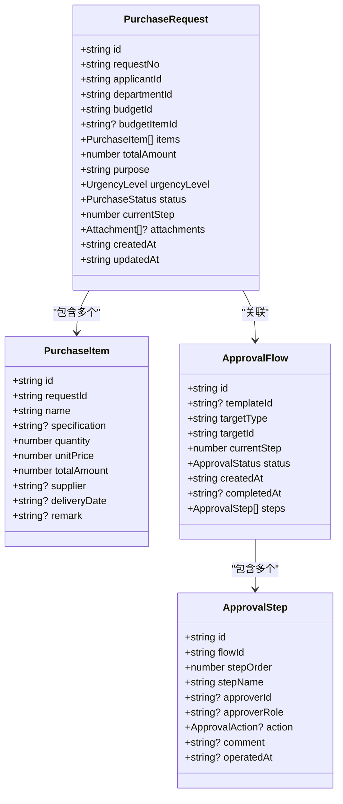
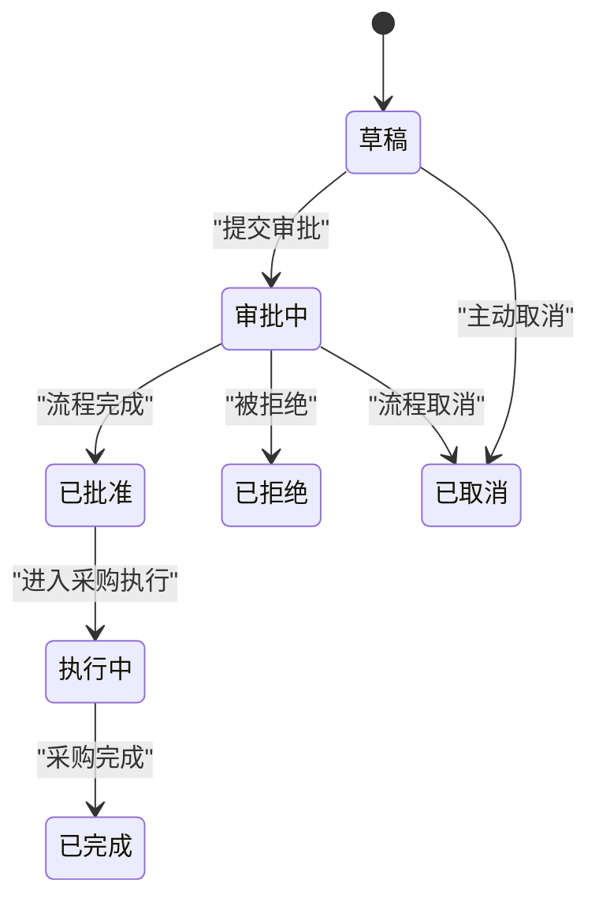
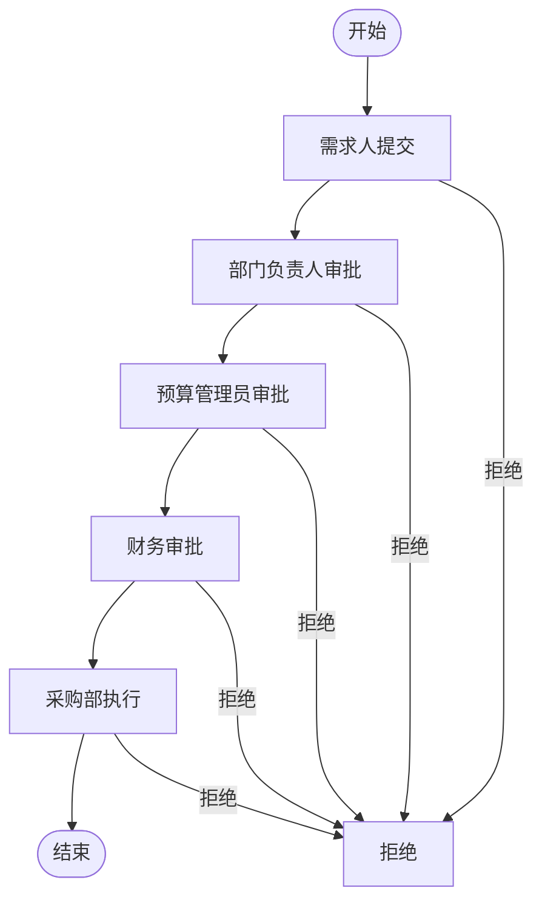
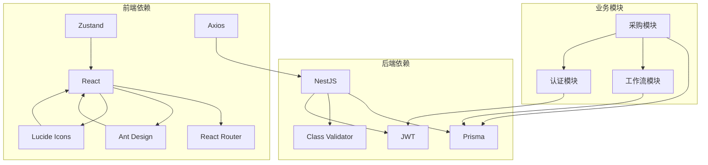

# 采购申请管理

<cite>
**本文引用的文件**
- [PurchaseRequestCreate.tsx](file://src/pages/PurchaseRequestCreate.tsx)
- [PurchaseRequestDetail.tsx](file://src/pages/PurchaseRequestDetail.tsx)
- [PurchaseRequestList.tsx](file://src/pages/PurchaseRequestList.tsx)
- [PurchaseRequestCreate.css](file://src/pages/PurchaseRequestCreate.css)
- [PurchaseRequestDetail.css](file://src/pages/PurchaseRequestDetail.css)
- [PurchaseRequestList.css](file://src/pages/PurchaseRequestList.css)
- [routes.ts](file://src/router/routes.ts)
- [index.ts](file://src/types/index.ts)
- [client.ts](file://src/api/client.ts)
- [auth.api.ts](file://src/api/modules/auth.api.ts)
- [authStore.ts](file://src/store/authStore.ts)
- [purchase.service.ts](file://server/src/modules/purchase/purchase.service.ts)
- [purchase.controller.ts](file://server/src/modules/purchase/purchase.controller.ts)
- [create-purchase-request.dto.ts](file://server/src/modules/purchase/dto/create-purchase-request.dto.ts)
- [workflow-engine.service.ts](file://server/src/modules/workflow/workflow-engine.service.ts)
- [schema.prisma](file://server/src/prisma/schema.prisma)
</cite>

## 目录
1. [简介](#简介)
2. [项目结构](#项目结构)
3. [核心组件](#核心组件)
4. [架构概览](#架构概览)
5. [详细组件分析](#详细组件分析)
6. [依赖关系分析](#依赖关系分析)
7. [性能考虑](#性能考虑)
8. [故障排除指南](#故障排除指南)
9. [结论](#结论)

## 简介
本文件为采购申请管理功能的完整技术文档，覆盖采购申请的全生命周期管理，包括申请单创建、编辑、删除和查看功能；详细说明采购申请的数据模型；阐述状态流转机制；介绍审批流程设计；提供前端表单设计实现；并结合Mock数据结构与实际业务逻辑进行说明。

## 项目结构
采购申请管理功能主要由以下部分组成：
- 前端页面组件：采购申请列表、创建、详情页面
- 类型定义：统一的数据模型与枚举
- 路由配置：页面路由映射
- API客户端：HTTP请求封装与拦截器
- 后端服务：采购申请业务逻辑与数据库交互
- 工作流引擎：审批流程推进与状态管理

**图表来源**
- [routes.ts:25-121](file://src/router/routes.ts#L25-L121)
- [PurchaseRequestList.tsx:1-212](file://src/pages/PurchaseRequestList.tsx#L1-L212)
- [PurchaseRequestCreate.tsx:1-202](file://src/pages/PurchaseRequestCreate.tsx#L1-L202)
- [PurchaseRequestDetail.tsx:1-219](file://src/pages/PurchaseRequestDetail.tsx#L1-L219)
- [index.ts:157-259](file://src/types/index.ts#L157-L259)
- [client.ts:1-183](file://src/api/client.ts#L1-L183)
- [auth.api.ts:1-50](file://src/api/modules/auth.api.ts#L1-L50)
- [authStore.ts:1-31](file://src/store/authStore.ts#L1-L31)
- [purchase.controller.ts:1-59](file://server/src/modules/purchase/purchase.controller.ts#L1-L59)
- [purchase.service.ts:1-150](file://server/src/modules/purchase/purchase.service.ts#L1-L150)
- [create-purchase-request.dto.ts:1-48](file://server/src/modules/purchase/dto/create-purchase-request.dto.ts#L1-L48)
- [workflow-engine.service.ts:1-148](file://server/src/modules/workflow/workflow-engine.service.ts#L1-L148)
- [schema.prisma:202-237](file://server/src/prisma/schema.prisma#L202-L237)

**章节来源**
- [routes.ts:25-121](file://src/router/routes.ts#L25-L121)
- [PurchaseRequestList.tsx:1-212](file://src/pages/PurchaseRequestList.tsx#L1-L212)
- [PurchaseRequestCreate.tsx:1-202](file://src/pages/PurchaseRequestCreate.tsx#L1-L202)
- [PurchaseRequestDetail.tsx:1-219](file://src/pages/PurchaseRequestDetail.tsx#L1-L219)
- [index.ts:157-259](file://src/types/index.ts#L157-L259)
- [client.ts:1-183](file://src/api/client.ts#L1-L183)
- [auth.api.ts:1-50](file://src/api/modules/auth.api.ts#L1-L50)
- [authStore.ts:1-31](file://src/store/authStore.ts#L1-L31)
- [purchase.controller.ts:1-59](file://server/src/modules/purchase/purchase.controller.ts#L1-L59)
- [purchase.service.ts:1-150](file://server/src/modules/purchase/purchase.service.ts#L1-L150)
- [create-purchase-request.dto.ts:1-48](file://server/src/modules/purchase/dto/create-purchase-request.dto.ts#L1-L48)
- [workflow-engine.service.ts:1-148](file://server/src/modules/workflow/workflow-engine.service.ts#L1-L148)
- [schema.prisma:202-237](file://server/src/prisma/schema.prisma#L202-L237)

## 核心组件
本功能的核心组件包括：
- 采购申请数据模型：统一的PurchaseRequest、PurchaseItem、ApprovalFlow、ApprovalStep等类型定义
- 前端页面组件：列表展示、创建表单、详情查看与审批操作
- 后端服务：创建、查询、更新、删除、提交审批等业务逻辑
- 工作流引擎：审批流程推进与状态变更
- API客户端：统一的HTTP请求封装与错误处理

**章节来源**
- [index.ts:157-259](file://src/types/index.ts#L157-L259)
- [PurchaseRequestList.tsx:1-212](file://src/pages/PurchaseRequestList.tsx#L1-L212)
- [PurchaseRequestCreate.tsx:1-202](file://src/pages/PurchaseRequestCreate.tsx#L1-L202)
- [PurchaseRequestDetail.tsx:1-219](file://src/pages/PurchaseRequestDetail.tsx#L1-L219)
- [purchase.service.ts:1-150](file://server/src/modules/purchase/purchase.service.ts#L1-L150)
- [workflow-engine.service.ts:1-148](file://server/src/modules/workflow/workflow-engine.service.ts#L1-L148)
- [client.ts:1-183](file://src/api/client.ts#L1-L183)

## 架构概览
采购申请管理采用前后端分离架构：
- 前端负责用户界面与交互，通过API客户端调用后端接口
- 后端提供RESTful API，处理业务逻辑与数据持久化
- 工作流引擎独立管理审批流程状态与步骤推进
- 数据库采用Prisma ORM进行模型定义与查询

**图表来源**
- [client.ts:105-136](file://src/api/client.ts#L105-L136)
- [purchase.controller.ts:14-18](file://server/src/modules/purchase/purchase.controller.ts#L14-L18)
- [purchase.service.ts:12-58](file://server/src/modules/purchase/purchase.service.ts#L12-L58)
- [workflow-engine.service.ts:11-61](file://server/src/modules/workflow/workflow-engine.service.ts#L11-L61)

## 详细组件分析

### 数据模型定义
采购申请的数据模型在类型文件中进行了完整定义，涵盖以下关键实体：

**图表来源**
- [index.ts:157-259](file://src/types/index.ts#L157-L259)

**章节来源**
- [index.ts:157-259](file://src/types/index.ts#L157-L259)

### 采购申请状态流转机制
系统支持多种状态流转，包括草稿、审批中、已批准、已拒绝等状态。状态转换遵循工作流引擎的推进规则：

**图表来源**
- [index.ts:191-198](file://src/types/index.ts#L191-L198)
- [workflow-engine.service.ts:66-135](file://server/src/modules/workflow/workflow-engine.service.ts#L66-L135)

**章节来源**
- [index.ts:191-198](file://src/types/index.ts#L191-L198)
- [workflow-engine.service.ts:66-135](file://server/src/modules/workflow/workflow-engine.service.ts#L66-L135)

### 审批流程设计
审批流程采用五级审批模式，包含需求人、部门负责人、预算管理员、财务、采购部五个步骤。每个步骤包含角色、用户、状态、时间、评论等信息。

**图表来源**
- [PurchaseRequestDetail.tsx:44-50](file://src/pages/PurchaseRequestDetail.tsx#L44-L50)
- [PurchaseRequestDetail.tsx:165-186](file://src/pages/PurchaseRequestDetail.tsx#L165-L186)

**章节来源**
- [PurchaseRequestDetail.tsx:44-50](file://src/pages/PurchaseRequestDetail.tsx#L44-L50)
- [PurchaseRequestDetail.tsx:165-186](file://src/pages/PurchaseRequestDetail.tsx#L165-L186)

### 前端表单设计实现
前端提供了完整的表单设计，包括数据验证、状态管理、用户交互和响应式布局：

#### 采购申请创建表单
- 预算条目选择与余额显示
- 采购明细输入（物品名称、规格型号、数量、单价、用途说明）
- 金额自动计算与汇总
- 审批流程预览
- 表单验证与提交

#### 采购申请列表
- 申请单列表展示
- 状态筛选与搜索
- 操作按钮（查看、编辑、删除）
- 快速统计信息

#### 采购申请详情
- 申请信息展示
- 预算条目信息
- 采购明细表格
- 审批流程可视化
- 审批操作界面

**章节来源**
- [PurchaseRequestCreate.tsx:1-202](file://src/pages/PurchaseRequestCreate.tsx#L1-L202)
- [PurchaseRequestList.tsx:1-212](file://src/pages/PurchaseRequestList.tsx#L1-L212)
- [PurchaseRequestDetail.tsx:1-219](file://src/pages/PurchaseRequestDetail.tsx#L1-L219)

### Mock数据结构与实际业务逻辑
系统同时提供Mock数据用于演示和开发：
- Mock预算条目数据用于选择预算
- Mock采购申请数据用于列表和详情展示
- Mock审批流程数据用于审批状态展示

实际业务逻辑通过后端服务实现：
- 数据库模型定义（Prisma）
- 业务逻辑处理（创建、查询、更新、删除）
- 审批流程推进
- DTO参数校验

**章节来源**
- [PurchaseRequestCreate.tsx:16-20](file://src/pages/PurchaseRequestCreate.tsx#L16-L20)
- [PurchaseRequestList.tsx:22-55](file://src/pages/PurchaseRequestList.tsx#L22-L55)
- [PurchaseRequestDetail.tsx:31-52](file://src/pages/PurchaseRequestDetail.tsx#L31-L52)
- [schema.prisma:202-237](file://server/src/prisma/schema.prisma#L202-L237)
- [purchase.service.ts:12-58](file://server/src/modules/purchase/purchase.service.ts#L12-L58)

## 依赖关系分析
采购申请管理功能的依赖关系如下：

**图表来源**
- [PurchaseRequestCreate.tsx:1-5](file://src/pages/PurchaseRequestCreate.tsx#L1-L5)
- [PurchaseRequestList.tsx:1-4](file://src/pages/PurchaseRequestList.tsx#L1-L4)
- [PurchaseRequestDetail.tsx:1-4](file://src/pages/PurchaseRequestDetail.tsx#L1-L4)
- [authStore.ts:1-10](file://src/store/authStore.ts#L1-L10)
- [client.ts:1-10](file://src/api/client.ts#L1-L10)
- [purchase.controller.ts:1-6](file://server/src/modules/purchase/purchase.controller.ts#L1-L6)
- [purchase.service.ts:1-7](file://server/src/modules/purchase/purchase.service.ts#L1-L7)
- [workflow-engine.service.ts:1-6](file://server/src/modules/workflow/workflow-engine.service.ts#L1-L6)

**章节来源**
- [PurchaseRequestCreate.tsx:1-5](file://src/pages/PurchaseRequestCreate.tsx#L1-L5)
- [PurchaseRequestList.tsx:1-4](file://src/pages/PurchaseRequestList.tsx#L1-L4)
- [PurchaseRequestDetail.tsx:1-4](file://src/pages/PurchaseRequestDetail.tsx#L1-L4)
- [authStore.ts:1-10](file://src/store/authStore.ts#L1-L10)
- [client.ts:1-10](file://src/api/client.ts#L1-L10)
- [purchase.controller.ts:1-6](file://server/src/modules/purchase/purchase.controller.ts#L1-L6)
- [purchase.service.ts:1-7](file://server/src/modules/purchase/purchase.service.ts#L1-L7)
- [workflow-engine.service.ts:1-6](file://server/src/modules/workflow/workflow-engine.service.ts#L1-L6)

## 性能考虑
- 前端性能优化：使用懒加载页面组件，减少初始包体积
- API性能优化：统一的请求拦截器，避免重复请求
- 数据库性能：合理使用索引，优化查询条件
- 工作流性能：异步处理审批流程，避免阻塞主线程

## 故障排除指南
- 认证失败：检查Token是否过期，重新登录
- 网络错误：检查API基础URL配置，确认服务端可达
- 数据验证错误：检查表单字段是否符合要求
- 审批流程异常：检查工作流模板配置，确认步骤顺序正确

**章节来源**
- [client.ts:52-94](file://src/api/client.ts#L52-L94)
- [auth.api.ts:18-48](file://src/api/modules/auth.api.ts#L18-L48)

## 结论
采购申请管理功能提供了完整的业务闭环，从前端表单到后端服务，再到工作流引擎，形成了清晰的技术架构。通过Mock数据与实际业务逻辑的结合，既保证了开发效率，又确保了系统的可扩展性。建议后续根据实际业务需求完善审批规则、增加报表统计、优化用户体验等功能。