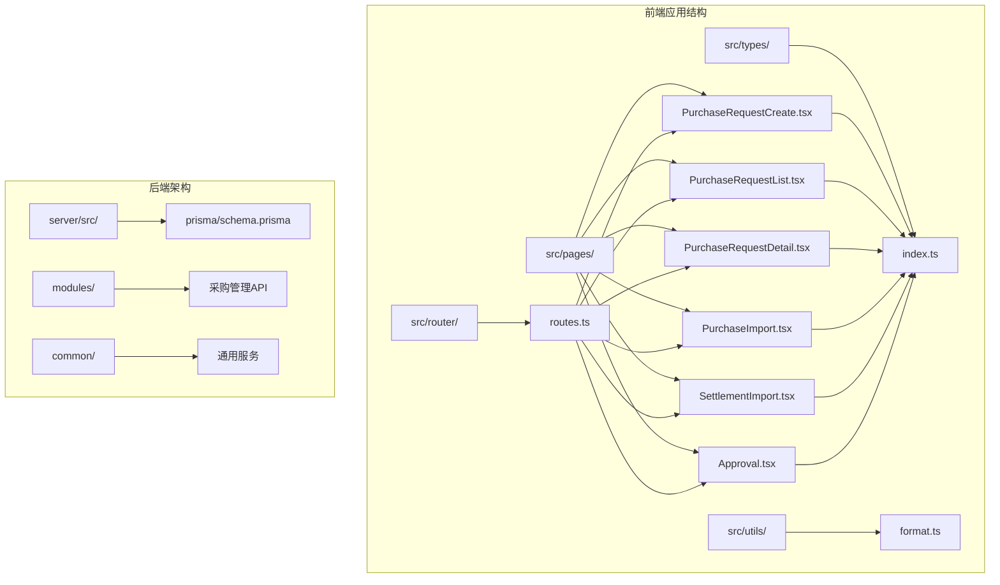
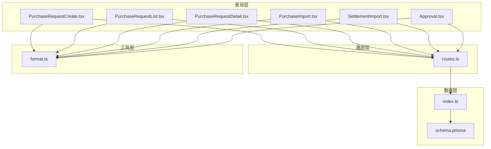
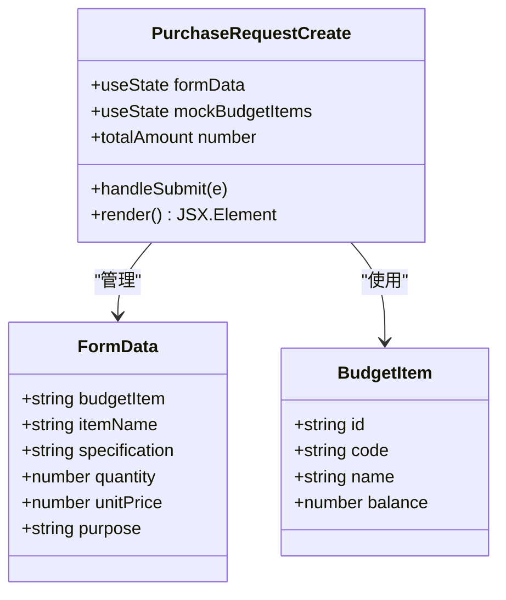
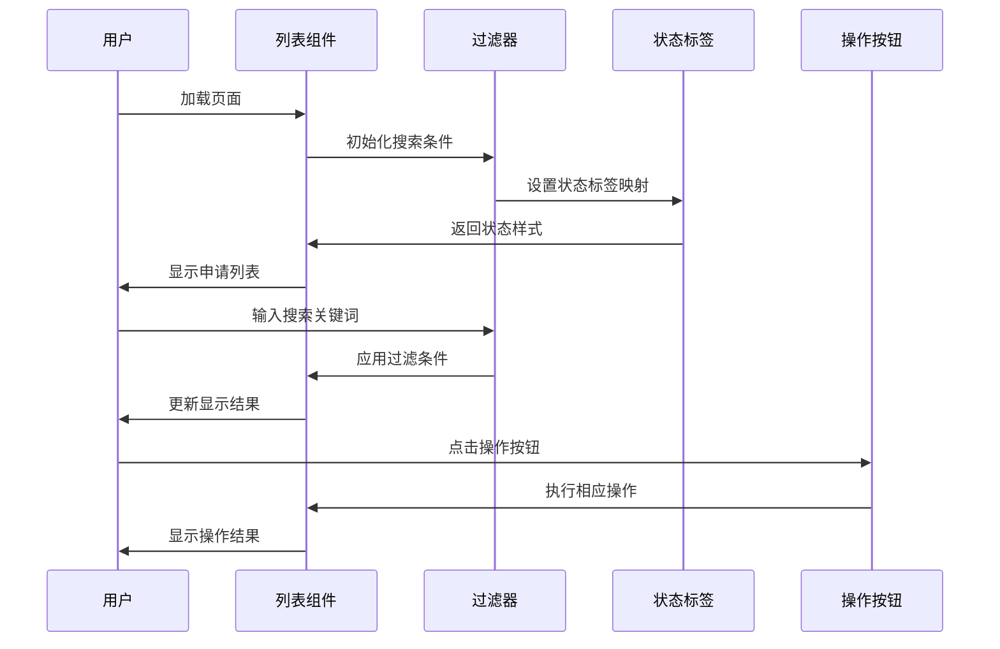
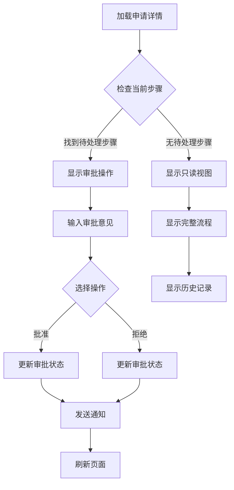
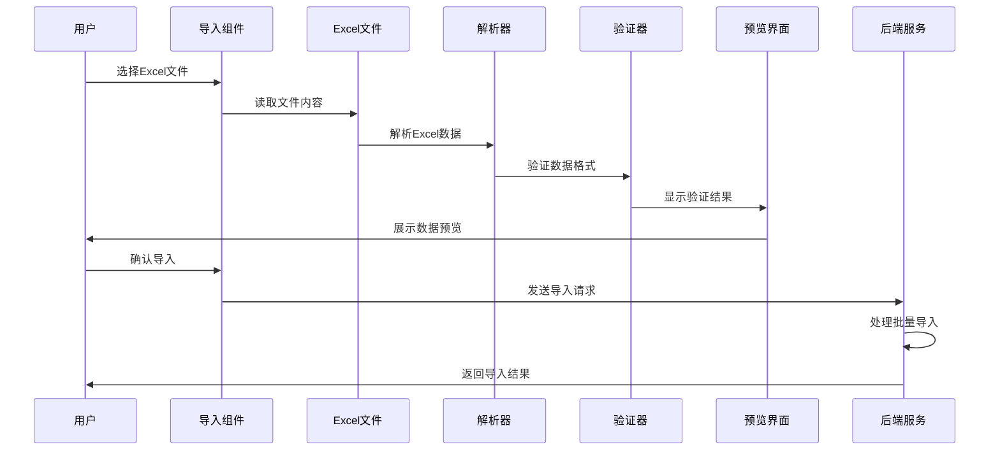
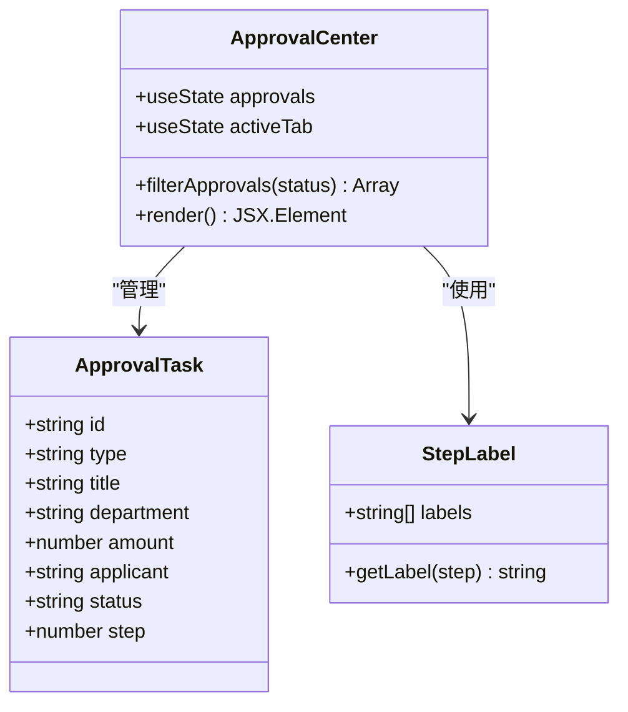
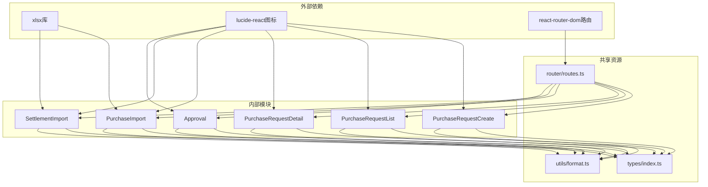
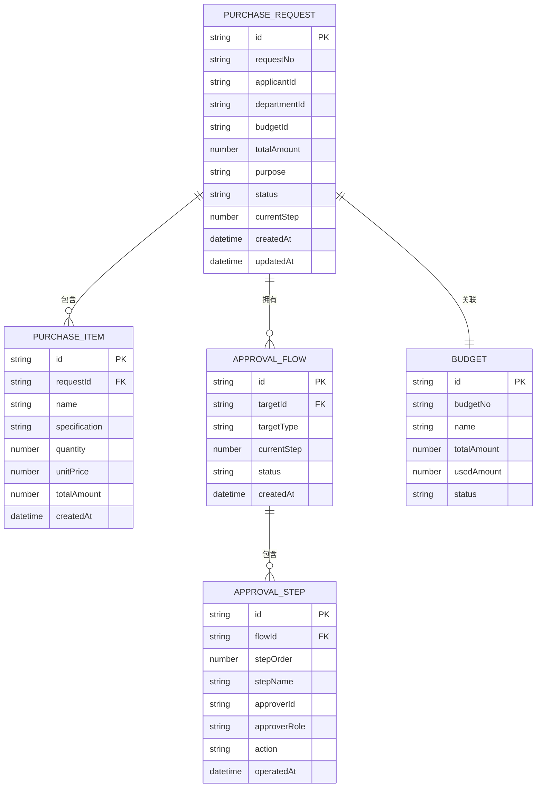

# 采购管理模块

<cite>
**本文档引用的文件**
- [PurchaseRequestCreate.tsx](file://src/pages/PurchaseRequestCreate.tsx)
- [PurchaseRequestList.tsx](file://src/pages/PurchaseRequestList.tsx)
- [PurchaseRequestDetail.tsx](file://src/pages/PurchaseRequestDetail.tsx)
- [PurchaseImport.tsx](file://src/pages/PurchaseImport.tsx)
- [SettlementImport.tsx](file://src/pages/SettlementImport.tsx)
- [Approval.tsx](file://src/pages/Approval.tsx)
- [routes.ts](file://src/router/routes.ts)
- [index.ts](file://src/types/index.ts)
- [schema.prisma](file://server/src/prisma/schema.prisma)
- [format.ts](file://src/utils/format.ts)
</cite>

## 目录
1. [简介](#简介)
2. [项目结构](#项目结构)
3. [核心组件](#核心组件)
4. [架构概览](#架构概览)
5. [详细组件分析](#详细组件分析)
6. [依赖关系分析](#依赖关系分析)
7. [性能考虑](#性能考虑)
8. [故障排除指南](#故障排除指南)
9. [结论](#结论)
10. [附录](#附录)

## 简介

采购管理模块是预算管理系统中的重要组成部分，负责处理从采购需求提交到最终结算的完整业务流程。该模块实现了现代化的采购申请流程，包括多级审批、Excel数据导入、供应商结算管理和付款状态跟踪等功能。

本模块采用前后端分离架构，前端使用React技术栈构建用户界面，后端基于NestJS框架提供RESTful API服务。数据库采用Prisma ORM进行数据建模和管理。

## 项目结构

采购管理模块在项目中的组织结构如下：

**图表来源**
- [routes.ts:25-121](file://src/router/routes.ts#L25-L121)
- [PurchaseRequestCreate.tsx:1-202](file://src/pages/PurchaseRequestCreate.tsx#L1-L202)
- [PurchaseRequestList.tsx:1-212](file://src/pages/PurchaseRequestList.tsx#L1-L212)
- [PurchaseRequestDetail.tsx:1-219](file://src/pages/PurchaseRequestDetail.tsx#L1-L219)

**章节来源**
- [routes.ts:25-121](file://src/router/routes.ts#L25-L121)

## 核心组件

采购管理模块包含以下核心组件：

### 前端组件
- **采购申请创建组件**：处理采购需求提交和申请创建
- **采购申请列表组件**：展示和管理所有采购申请
- **采购申请详情组件**：显示申请详细信息和审批流程
- **Excel导入组件**：处理采购订单和结算单的数据导入
- **审批中心组件**：管理多级审批流程

### 数据模型
- **采购请求模型**：定义采购申请的数据结构
- **审批流程模型**：管理多级审批状态
- **预算条目模型**：关联预算和采购项目
- **工作流模板模型**：定义审批流程规则

**章节来源**
- [index.ts:157-198](file://src/types/index.ts#L157-L198)
- [index.ts:220-245](file://src/types/index.ts#L220-L245)

## 架构概览

采购管理模块采用分层架构设计，确保各层职责清晰分离：

**图表来源**
- [routes.ts:13-18](file://src/router/routes.ts#L13-L18)
- [PurchaseRequestCreate.tsx:5-202](file://src/pages/PurchaseRequestCreate.tsx#L5-L202)
- [PurchaseRequestList.tsx:57-212](file://src/pages/PurchaseRequestList.tsx#L57-L212)
- [PurchaseRequestDetail.tsx:54-219](file://src/pages/PurchaseRequestDetail.tsx#L54-L219)

## 详细组件分析

### 采购申请创建组件

采购申请创建组件提供了完整的采购需求提交界面，包含预算选择、采购明细输入和审批流程预览功能。

**图表来源**
- [PurchaseRequestCreate.tsx:7-29](file://src/pages/PurchaseRequestCreate.tsx#L7-L29)
- [PurchaseRequestCreate.tsx:16-20](file://src/pages/PurchaseRequestCreate.tsx#L16-L20)

#### 表单字段设计

| 字段名称 | 类型 | 必填 | 描述 |
|---------|------|------|------|
| 预算条目 | 下拉选择 | 是 | 关联的预算编号 |
| 物品名称 | 文本输入 | 是 | 采购物品的详细描述 |
| 规格型号 | 文本输入 | 是 | 物品的技术规格 |
| 数量 | 数字输入 | 是 | 采购数量，最小值1 |
| 单价 | 数字输入 | 是 | 单位价格，最小值0 |
| 用途说明 | 文本域 | 是 | 详细的用途和使用计划 |

#### 审批流程预览

系统提供五级审批流程预览：
1. 需求人提交
2. 部门负责人审批
3. 预算管理员审批
4. 财务审批
5. 采购部执行

**章节来源**
- [PurchaseRequestCreate.tsx:42-202](file://src/pages/PurchaseRequestCreate.tsx#L42-L202)

### 采购申请列表组件

采购申请列表组件提供了完整的采购申请管理界面，支持搜索、筛选和批量操作功能。

**图表来源**
- [PurchaseRequestList.tsx:57-212](file://src/pages/PurchaseRequestList.tsx#L57-L212)

#### 状态管理

| 状态代码 | 显示标签 | 颜色类 | 图标 | 可操作性 |
|---------|----------|--------|------|----------|
| draft | 草稿 | tag-primary | FileText | 可编辑、可删除 |
| pending | 审批中 | tag-warning | Clock | 只读 |
| approved | 已批准 | tag-success | CheckCircle | 只读 |
| rejected | 已拒绝 | tag-danger | XCircle | 可重新编辑 |

**章节来源**
- [PurchaseRequestList.tsx:65-70](file://src/pages/PurchaseRequestList.tsx#L65-L70)
- [PurchaseRequestList.tsx:74-81](file://src/pages/PurchaseRequestList.tsx#L74-L81)

### 采购申请详情组件

采购申请详情组件展示了单个采购申请的完整信息，包括审批流程跟踪和审批操作功能。

**图表来源**
- [PurchaseRequestDetail.tsx:54-219](file://src/pages/PurchaseRequestDetail.tsx#L54-L219)

#### 审批流程状态

| 步骤序号 | 角色 | 状态 | 操作 |
|---------|------|------|------|
| 1 | 需求人 | 已完成 | 自动完成 |
| 2 | 部门负责人 | 待处理 | 审批操作 |
| 3 | 预算管理员 | 待处理 | 审批操作 |
| 4 | 财务 | 待处理 | 审批操作 |
| 5 | 采购部 | 待处理 | 执行操作 |

**章节来源**
- [PurchaseRequestDetail.tsx:44-51](file://src/pages/PurchaseRequestDetail.tsx#L44-L51)
- [PurchaseRequestDetail.tsx:66-67](file://src/pages/PurchaseRequestDetail.tsx#L66-L67)

### Excel数据导入功能

Excel数据导入功能支持批量处理采购订单和结算单数据，提供完整的数据校验和错误处理机制。

**图表来源**
- [PurchaseImport.tsx:21-55](file://src/pages/PurchaseImport.tsx#L21-L55)
- [SettlementImport.tsx:21-54](file://src/pages/SettlementImport.tsx#L21-L54)

#### 采购订单导入格式

| 字段名称 | 英文列名 | 必填 | 数据类型 | 示例值 |
|---------|----------|------|----------|--------|
| 订单号 | orderNo | 是 | 字符串 | PO2024001 |
| 供应商 | supplier | 是 | 字符串 | 供应商A |
| 金额 | amount | 是 | 数字 | 50000 |
| 日期 | date | 是 | 日期 | 2024-01-15 |
| 状态 | status | 否 | 字符串 | 已完成 |
| 预算编号 | budgetCode | 否 | 字符串 | BUD-2024-001 |

#### 结算单导入格式

| 字段名称 | 英文列名 | 必填 | 数据类型 | 示例值 |
|---------|----------|------|----------|--------|
| 结算单号 | settlementNo | 是 | 字符串 | S2024001 |
| 发票号 | invoiceNo | 否 | 字符串 | INV2024001 |
| 金额 | amount | 是 | 数字 | 50000 |
| 日期 | date | 是 | 日期 | 2024-01-15 |
| 供应商 | supplier | 是 | 字符串 | 供应商A |
| 预算编号 | budgetCode | 否 | 字符串 | BUD-2024-001 |

**章节来源**
- [PurchaseImport.tsx:38-45](file://src/pages/PurchaseImport.tsx#L38-L45)
- [SettlementImport.tsx:37-44](file://src/pages/SettlementImport.tsx#L37-L44)

### 审批中心功能

审批中心组件提供了统一的审批任务管理界面，支持待审批、已通过和已拒绝三种状态的查看和操作。

**图表来源**
- [Approval.tsx:11-99](file://src/pages/Approval.tsx#L11-L99)
- [Approval.tsx:5-9](file://src/pages/Approval.tsx#L5-L9)

#### 审批任务状态

| 状态代码 | 显示标签 | 颜色类 | 功能特性 |
|---------|----------|--------|----------|
| pending | 待审批 | active | 支持通过/拒绝操作 |
| approved | 已通过 | approved | 只读显示 |
| rejected | 已拒绝 | rejected | 只读显示 |

**章节来源**
- [Approval.tsx:15-17](file://src/pages/Approval.tsx#L15-L17)
- [Approval.tsx:21](file://src/pages/Approval.tsx#L21)

## 依赖关系分析

采购管理模块的依赖关系体现了清晰的分层架构：

**图表来源**
- [PurchaseImport.tsx:3](file://src/pages/PurchaseImport.tsx#L3)
- [SettlementImport.tsx:3](file://src/pages/SettlementImport.tsx#L3)
- [PurchaseRequestCreate.tsx:2-3](file://src/pages/PurchaseRequestCreate.tsx#L2-L3)

### 数据模型关系

**图表来源**
- [index.ts:157-198](file://src/types/index.ts#L157-L198)
- [index.ts:220-245](file://src/types/index.ts#L220-L245)
- [schema.prisma:268-298](file://server/src/prisma/schema.prisma#L268-L298)

**章节来源**
- [index.ts:157-198](file://src/types/index.ts#L157-L198)
- [schema.prisma:268-298](file://server/src/prisma/schema.prisma#L268-L298)

## 性能考虑

### 前端性能优化

1. **懒加载机制**：所有页面组件都使用React.lazy进行懒加载，减少初始包体积
2. **虚拟滚动**：列表组件支持大数据集的虚拟滚动渲染
3. **防抖处理**：搜索和过滤操作使用防抖机制避免频繁重渲染
4. **状态管理**：合理使用useState和useEffect，避免不必要的状态更新

### 数据导入性能

1. **分批处理**：Excel导入支持分批处理大量数据
2. **进度反馈**：提供导入进度和状态反馈
3. **错误隔离**：单条数据错误不影响整体导入流程
4. **内存管理**：及时清理文件读取缓存

### 数据库性能

1. **索引优化**：关键字段建立数据库索引
2. **查询优化**：使用关联查询减少数据库访问次数
3. **分页查询**：支持大数据集的分页查询
4. **连接池**：数据库连接池管理

## 故障排除指南

### 常见问题及解决方案

#### Excel导入问题
- **问题**：文件格式不支持
  - **解决**：确保使用.xlsx或.xls格式文件
- **问题**：数据解析失败
  - **解决**：检查Excel列名是否正确，参考导入模板
- **问题**：导入数据重复
  - **解决**：检查唯一键约束，如订单号或结算号

#### 审批流程问题
- **问题**：无法看到待审批任务
  - **解决**：确认用户角色权限和当前步骤
- **问题**：审批状态更新异常
  - **解决**：检查审批流程配置和数据库状态同步

#### 表单验证问题
- **问题**：必填字段验证失败
  - **解决**：检查字段是否正确填写，注意数字类型的验证
- **问题**：预算超支警告
  - **解决**：确认预算余额是否充足

**章节来源**
- [PurchaseImport.tsx:49-52](file://src/pages/PurchaseImport.tsx#L49-L52)
- [PurchaseRequestCreate.tsx:22-27](file://src/pages/PurchaseRequestCreate.tsx#L22-L27)

## 结论

采购管理模块通过现代化的技术架构和完善的业务流程设计，为用户提供了一套完整的采购管理解决方案。模块具有以下特点：

1. **完整的业务流程**：从采购需求提交到最终结算的全流程覆盖
2. **灵活的审批机制**：支持多级审批和自定义审批流程
3. **高效的数据处理**：Excel批量导入和实时数据校验
4. **友好的用户体验**：直观的界面设计和响应式布局
5. **强大的扩展性**：模块化设计便于功能扩展和维护

该模块为企业的采购管理提供了坚实的技术基础，能够有效提升采购效率和管理水平。

## 附录

### 路由配置

| 路径 | 组件 | 权限要求 |
|------|------|----------|
| `/purchases` | PurchaseRequestList | 需要登录 |
| `/purchases/create` | PurchaseRequestCreate | 需要登录 |
| `/purchases/:id` | PurchaseRequestDetail | 需要登录 |
| `/purchases/import` | PurchaseImport | 需要登录 |
| `/settlements/import` | SettlementImport | 需要登录 |
| `/approvals` | Approval | 需要登录 |

### 数据验证规则

1. **数量验证**：必须为正整数
2. **金额验证**：必须为非负数，支持两位小数
3. **日期验证**：必须为有效的日期格式
4. **预算关联**：必须关联有效的预算条目
5. **文件验证**：仅支持Excel格式文件

### 开发建议

1. **单元测试**：为关键组件编写单元测试
2. **集成测试**：测试完整的业务流程
3. **性能监控**：监控关键指标和用户体验
4. **安全审计**：定期进行安全漏洞扫描
5. **文档维护**：保持技术文档与代码同步更新