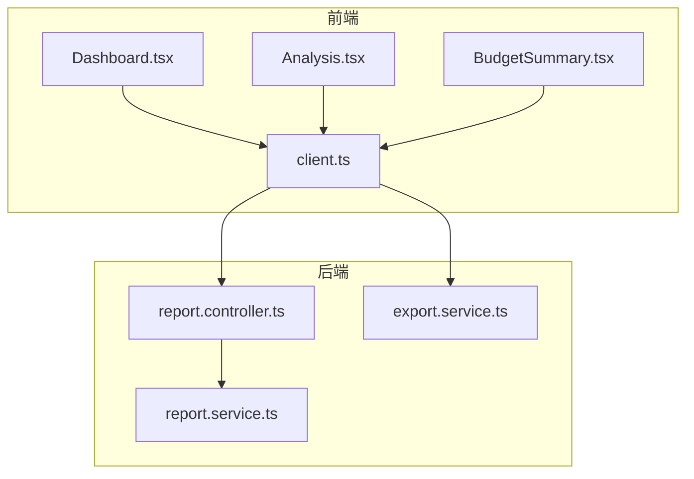
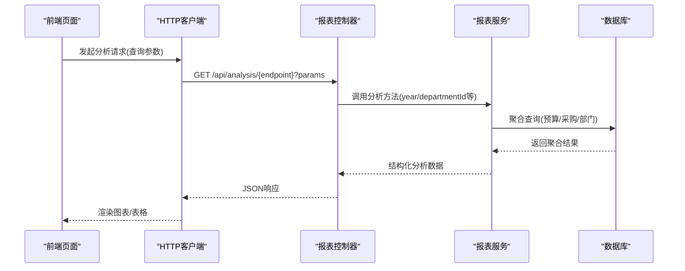
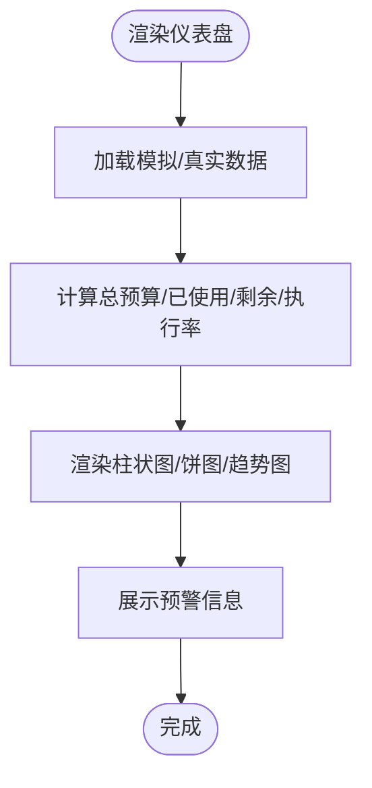
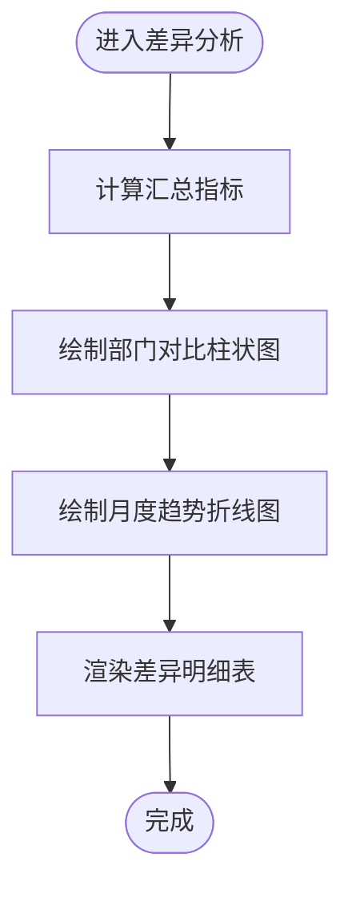
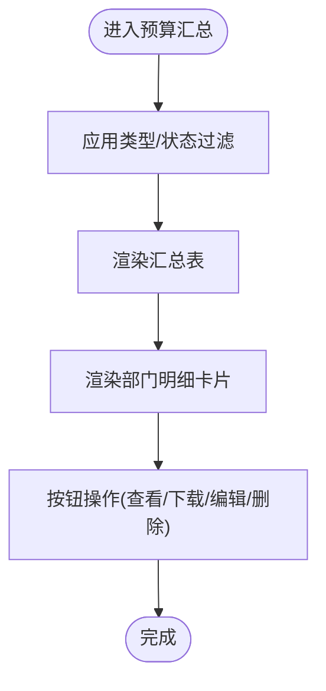
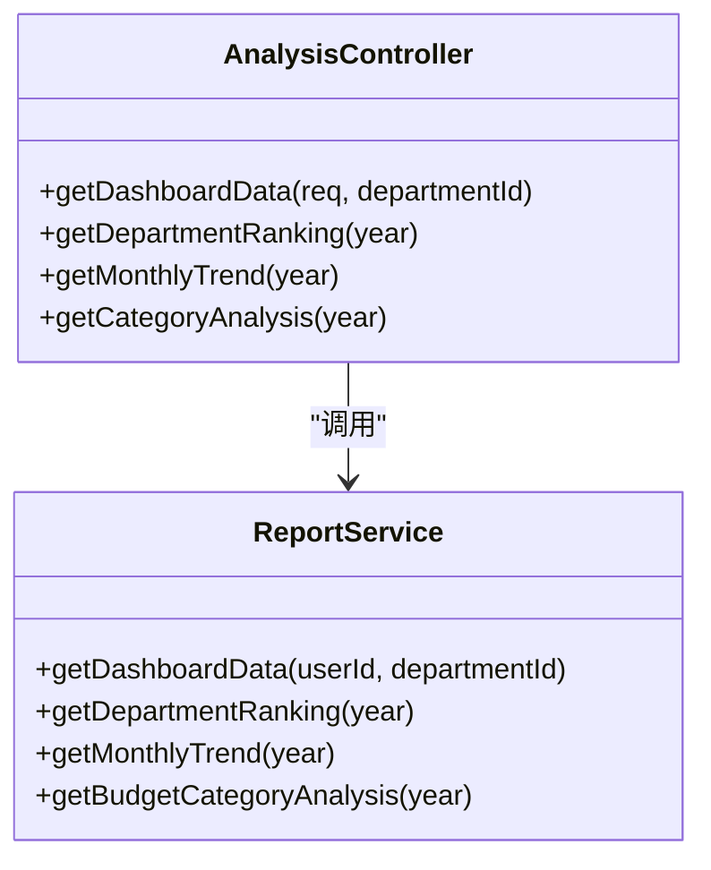
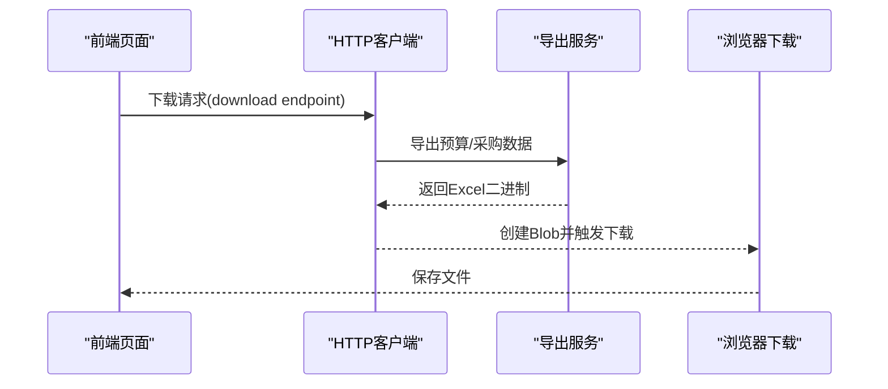
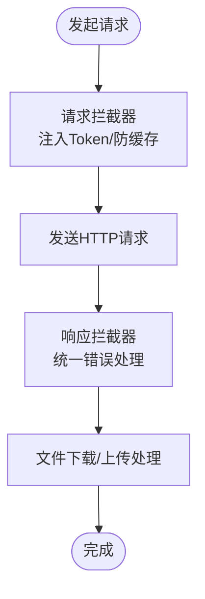
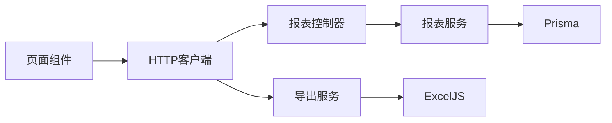

# 预算分析与汇总

<cite>
**本文引用的文件**
- [Analysis.tsx](file://src/pages/Analysis.tsx)
- [BudgetSummary.tsx](file://src/pages/BudgetSummary.tsx)
- [Dashboard.tsx](file://src/pages/Dashboard.tsx)
- [client.ts](file://src/api/client.ts)
- [index.ts](file://src/types/index.ts)
- [report.controller.ts](file://server/src/modules/report/report.controller.ts)
- [report.service.ts](file://server/src/modules/report/report.service.ts)
- [export.service.ts](file://server/src/modules/import-export/export.service.ts)
- [FEATURES_GUIDE.md](file://FEATURES_GUIDE.md)
- [IMPLEMENTATION_PROGRESS.md](file://IMPLEMENTATION_PROGRESS.md)
</cite>

## 目录
1. [简介](#简介)
2. [项目结构](#项目结构)
3. [核心组件](#核心组件)
4. [架构总览](#架构总览)
5. [详细组件分析](#详细组件分析)
6. [依赖关系分析](#依赖关系分析)
7. [性能考虑](#性能考虑)
8. [故障排查指南](#故障排查指南)
9. [结论](#结论)
10. [附录](#附录)

## 简介
本文件面向预算分析与汇总功能，系统性梳理前端可视化页面、后端报表服务与数据导出能力，并结合项目现有实现，给出预算差异分析、预算完成度统计、预算趋势分析、报表生成与导出、异常检测与预警、可视化图表设计、结果解读与决策支持、数据准确性验证与性能优化等实践方案。当前前端以图表组件展示为主，后端提供报表接口与Excel导出能力，后续可在现有基础上扩展预测模型与未来预算建议。

## 项目结构
项目采用前后端分离架构：
- 前端：React + Vite，页面组件负责预算仪表盘、差异分析、汇总报表等可视化展示
- 后端：NestJS + Prisma + PostgreSQL，提供报表分析接口与导入导出服务
- 通信：前端通过封装的HTTP客户端调用后端API，支持统一鉴权与错误处理

**图表来源**
- [Dashboard.tsx:1-274](file://src/pages/Dashboard.tsx#L1-L274)
- [Analysis.tsx:1-163](file://src/pages/Analysis.tsx#L1-L163)
- [BudgetSummary.tsx:1-193](file://src/pages/BudgetSummary.tsx#L1-L193)
- [client.ts:1-183](file://src/api/client.ts#L1-L183)
- [report.controller.ts:1-40](file://server/src/modules/report/report.controller.ts#L1-L40)
- [report.service.ts:1-144](file://server/src/modules/report/report.service.ts#L1-L144)
- [export.service.ts:1-81](file://server/src/modules/import-export/export.service.ts#L1-L81)

**章节来源**
- [Dashboard.tsx:1-274](file://src/pages/Dashboard.tsx#L1-L274)
- [Analysis.tsx:1-163](file://src/pages/Analysis.tsx#L1-L163)
- [BudgetSummary.tsx:1-193](file://src/pages/BudgetSummary.tsx#L1-L193)
- [client.ts:1-183](file://src/api/client.ts#L1-L183)
- [report.controller.ts:1-40](file://server/src/modules/report/report.controller.ts#L1-L40)
- [report.service.ts:1-144](file://server/src/modules/report/report.service.ts#L1-L144)
- [export.service.ts:1-81](file://server/src/modules/import-export/export.service.ts#L1-L81)

## 核心组件
- 前端页面组件
  - 仪表盘：总览预算执行情况、部门对比、类型分布、月度趋势与预警
  - 差异分析：部门维度差异、差异趋势、差异明细表
  - 预算汇总：汇总表、部门明细卡片
- 后端报表服务
  - 仪表盘数据、部门排名、月度趋势、预算类别分析
- 数据导出
  - Excel导出预算报表与采购申请报表

**章节来源**
- [Dashboard.tsx:1-274](file://src/pages/Dashboard.tsx#L1-L274)
- [Analysis.tsx:1-163](file://src/pages/Analysis.tsx#L1-L163)
- [BudgetSummary.tsx:1-193](file://src/pages/BudgetSummary.tsx#L1-L193)
- [report.service.ts:1-144](file://server/src/modules/report/report.service.ts#L1-L144)
- [export.service.ts:1-81](file://server/src/modules/import-export/export.service.ts#L1-L81)

## 架构总览
前端通过HTTP客户端发起请求，后端控制器接收查询参数并调用报表服务进行聚合统计，最终返回JSON数据；导出服务将数据写入Excel工作簿并返回二进制内容供前端触发下载。

**图表来源**
- [client.ts:1-183](file://src/api/client.ts#L1-L183)
- [report.controller.ts:1-40](file://server/src/modules/report/report.controller.ts#L1-L40)
- [report.service.ts:1-144](file://server/src/modules/report/report.service.ts#L1-L144)

## 详细组件分析

### 仪表盘组件（Dashboard.tsx）
- 功能要点
  - 总览：年度预算总额、已使用、剩余、执行率
  - 类型对比：Capex与Opex预算与使用对比
  - 部门对比：各部预算与使用对比（垂直柱状图）
  - 月度趋势：预算与实际对比（柱状图）
  - 预警提示：基于阈值的状态标签
- 关键逻辑
  - 使用格式化函数对金额进行千/万元单位显示
  - 计算执行率并映射进度条颜色
  - 图表使用响应式容器，支持横向滚动与缩放

**图表来源**
- [Dashboard.tsx:1-274](file://src/pages/Dashboard.tsx#L1-L274)

**章节来源**
- [Dashboard.tsx:1-274](file://src/pages/Dashboard.tsx#L1-L274)

### 差异分析组件（Analysis.tsx）
- 功能要点
  - 汇总卡片：总预算、实际支出、差异、执行率
  - 部门维度对比：预算与实际的垂直柱状图
  - 差异趋势：月度预算与实际对比折线图
  - 明细表：部门差异、差异率、状态标签
- 关键逻辑
  - 对差异率进行分级（如≤-20为“节约”，否则为“超支”）
  - 使用货币格式化函数统一显示

**图表来源**
- [Analysis.tsx:1-163](file://src/pages/Analysis.tsx#L1-L163)

**章节来源**
- [Analysis.tsx:1-163](file://src/pages/Analysis.tsx#L1-L163)

### 预算汇总组件（BudgetSummary.tsx）
- 功能要点
  - 汇总表：版本、部门、类型、总金额、状态、创建人、创建日期
  - 过滤：按类型与状态筛选
  - 操作：查看、下载、编辑、删除（草稿态）
  - 部门明细：Opex/Capex小计与合计
- 关键逻辑
  - 状态标签映射与颜色区分
  - 货币格式化显示

**图表来源**
- [BudgetSummary.tsx:1-193](file://src/pages/BudgetSummary.tsx#L1-L193)

**章节来源**
- [BudgetSummary.tsx:1-193](file://src/pages/BudgetSummary.tsx#L1-L193)

### 报表分析接口与服务（report.controller.ts, report.service.ts）
- 接口定义
  - 仪表盘数据：支持按部门过滤
  - 部门排名：按执行率排序
  - 月度趋势：按年聚合
  - 预算类别分析：按OPEX/CAPEX聚合
- 服务实现
  - 使用Prisma聚合查询，计算总数、求和与计数
  - 返回结构化数据供前端渲染

**图表来源**
- [report.controller.ts:1-40](file://server/src/modules/report/report.controller.ts#L1-L40)
- [report.service.ts:1-144](file://server/src/modules/report/report.service.ts#L1-L144)

**章节来源**
- [report.controller.ts:1-40](file://server/src/modules/report/report.controller.ts#L1-L40)
- [report.service.ts:1-144](file://server/src/modules/report/report.service.ts#L1-L144)

### 数据导出服务（export.service.ts）
- 功能
  - 导出预算报表：包含预算编号、名称、部门、类型、年份、总金额、已使用、执行率、状态
  - 导出采购申请报表：包含申请编号、申请人、预算信息、物品明细等
- 实现
  - 使用ExcelJS创建工作簿与工作表，设置列宽与标题
  - 写入聚合后的数据并返回二进制缓冲区

**图表来源**
- [client.ts:138-154](file://src/api/client.ts#L138-L154)
- [export.service.ts:1-81](file://server/src/modules/import-export/export.service.ts#L1-L81)

**章节来源**
- [export.service.ts:1-81](file://server/src/modules/import-export/export.service.ts#L1-L81)
- [client.ts:138-154](file://src/api/client.ts#L138-L154)

### 前端HTTP客户端（client.ts）
- 功能
  - 统一基础URL、超时、请求头
  - 请求拦截：注入Authorization、GET请求添加时间戳防缓存
  - 响应拦截：统一错误处理（401登出、403/404/5xx提示）
  - 文件下载：Blob下载与自动命名
  - 文件上传：FormData上传与进度回调

**图表来源**
- [client.ts:1-183](file://src/api/client.ts#L1-L183)

**章节来源**
- [client.ts:1-183](file://src/api/client.ts#L1-L183)

### 数据模型与类型（index.ts）
- 预算相关
  - 预算实体：预算编号、名称、部门、类型、年份、版本、总金额、已用、冻结、状态、明细项
  - 预算调整：调整编号、原金额、调整后金额、原因、状态
  - 预算项：名称、分类、规格、单价、数量、小计、月度计划、项目、供应商等
- 采购相关
  - 采购申请：申请人、部门、预算、物品明细、总金额、用途、紧急度、状态、审批流、附件
- 通知与审计
  - 通知类型：审批待办、审批结果、预算预警、预算超支、系统、报表就绪
  - 审计日志：用户行为记录

**章节来源**
- [index.ts:78-153](file://src/types/index.ts#L78-L153)
- [index.ts:155-205](file://src/types/index.ts#L155-L205)
- [index.ts:261-282](file://src/types/index.ts#L261-L282)
- [index.ts:284-299](file://src/types/index.ts#L284-L299)

## 依赖关系分析
- 前端页面依赖HTTP客户端进行数据获取与导出
- 报表控制器依赖报表服务进行数据聚合
- 报表服务依赖Prisma进行数据库查询
- 导出服务依赖ExcelJS生成Excel文件

**图表来源**
- [client.ts:1-183](file://src/api/client.ts#L1-L183)
- [report.controller.ts:1-40](file://server/src/modules/report/report.controller.ts#L1-L40)
- [report.service.ts:1-144](file://server/src/modules/report/report.service.ts#L1-L144)
- [export.service.ts:1-81](file://server/src/modules/import-export/export.service.ts#L1-L81)

**章节来源**
- [client.ts:1-183](file://src/api/client.ts#L1-L183)
- [report.controller.ts:1-40](file://server/src/modules/report/report.controller.ts#L1-L40)
- [report.service.ts:1-144](file://server/src/modules/report/report.service.ts#L1-L144)
- [export.service.ts:1-81](file://server/src/modules/import-export/export.service.ts#L1-L81)

## 性能考虑
- 前端
  - 图表组件使用响应式容器，避免大屏渲染阻塞
  - 表格与筛选在前端完成，建议在大数据量时引入虚拟滚动与服务端分页
- 后端
  - 报表接口使用聚合查询，减少联表复杂度
  - 使用Promise并发查询多个指标，缩短响应时间
  - 导出服务批量写入Excel，建议限制导出范围与并发
- 通用
  - 前端请求拦截器加入防缓存参数，确保数据新鲜度
  - 错误拦截统一处理，避免重复请求与无意义重试

[本节为通用指导，无需列出具体文件来源]

## 故障排查指南
- 常见问题
  - 401未授权：检查本地Token是否存在与过期，确认登录状态
  - 403拒绝访问：检查用户角色与权限
  - 404资源不存在：确认API路径与查询参数
  - 500/502/503：检查后端服务状态与数据库连接
- 建议
  - 在响应拦截器中打印错误码与消息，便于定位
  - 对高频接口增加缓存策略（如仪表盘数据短期缓存）

**章节来源**
- [client.ts:52-94](file://src/api/client.ts#L52-L94)

## 结论
当前系统已具备预算仪表盘、差异分析、预算汇总与报表导出的基础能力。建议在现有基础上：
- 扩展异常检测：基于阈值与历史趋势识别异常波动
- 引入预测模型：使用时间序列方法预测未来预算需求
- 完善决策支持：提供预算调整建议与风险评估
- 加强数据校验：在前端与后端增加输入校验与一致性检查
- 优化性能：服务端分页与缓存、前端虚拟滚动与懒加载

[本节为总结性内容，无需列出具体文件来源]

## 附录

### 预算分析与汇总功能清单
- 部门预算对比：柱状图/表格，支持按部门筛选
- 预算完成度统计：执行率、已使用、剩余、使用率分级
- 预算趋势分析：月度/年度趋势折线图
- 预算报表生成：汇总表、明细表、类别分析
- 数据导出：Excel格式，支持预算与采购申请导出
- 异常检测：阈值预警、状态标签、异常标记
- 可视化图表：柱状图、折线图、饼图、进度条
- 结果解读与决策支持：差异率分级、建议标签、预警提示
- 数据准确性验证：前后端校验、聚合一致性检查
- 性能优化：并发查询、缓存、分页、虚拟滚动

**章节来源**
- [FEATURES_GUIDE.md:193-223](file://FEATURES_GUIDE.md#L193-L223)
- [IMPLEMENTATION_PROGRESS.md:272-327](file://IMPLEMENTATION_PROGRESS.md#L272-L327)