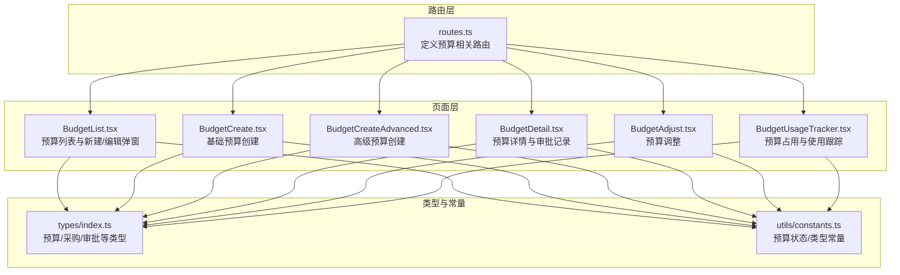
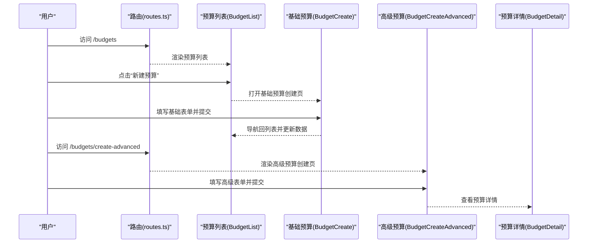
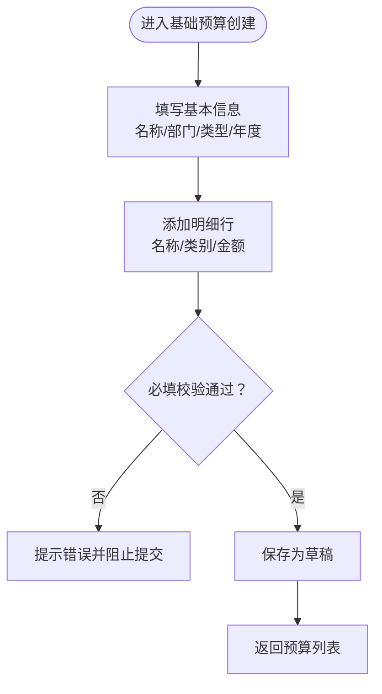
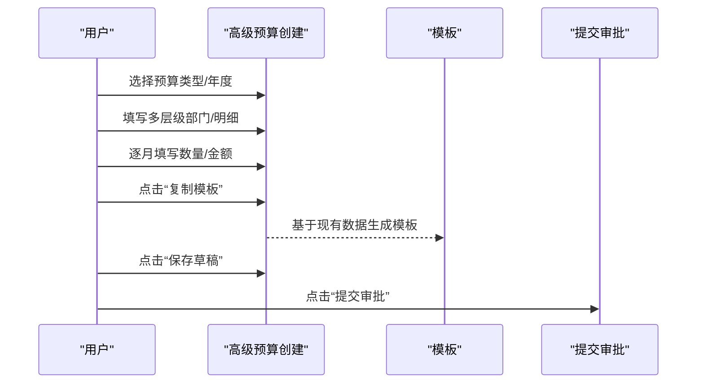
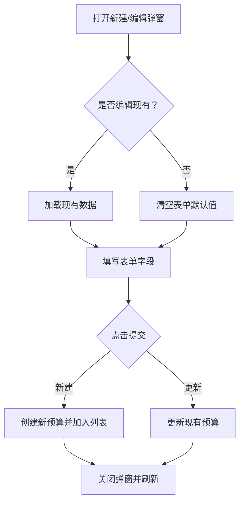
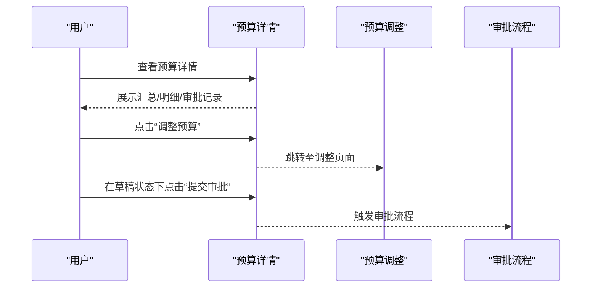
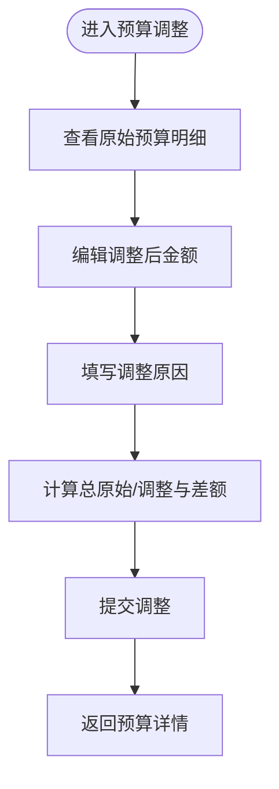
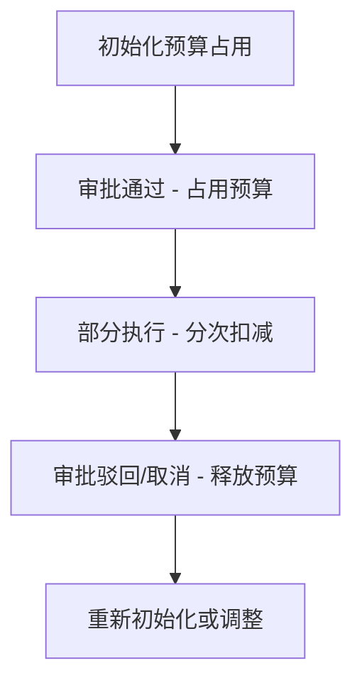
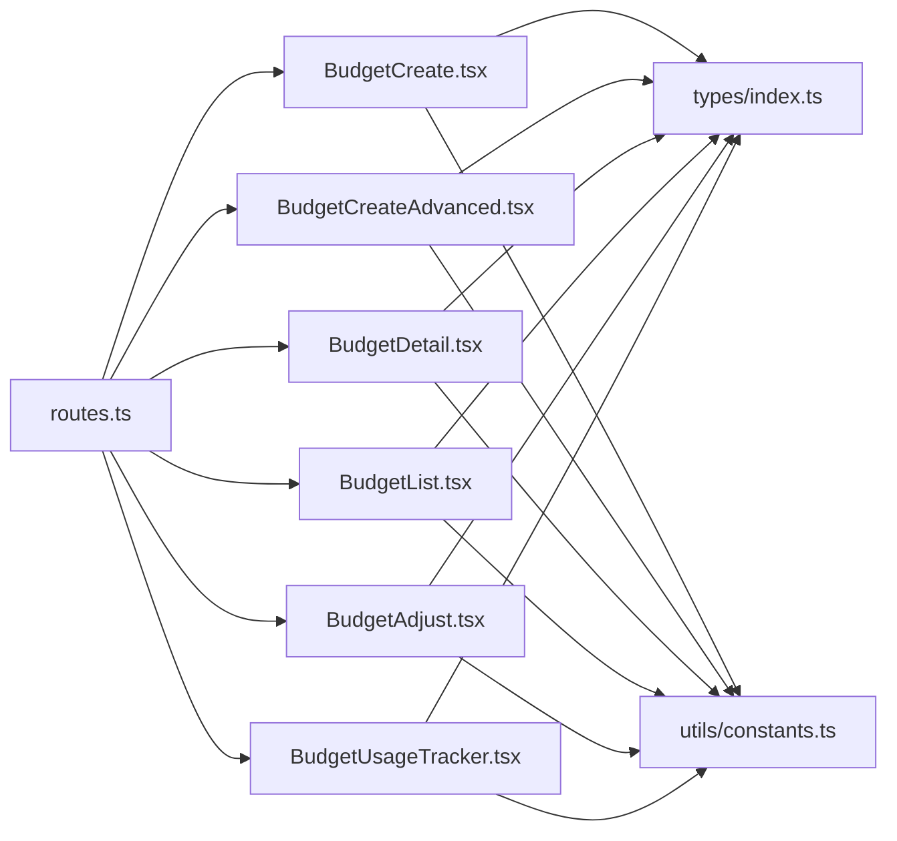

# 预算创建与编辑

<cite>
**本文引用的文件**
- [BudgetCreate.tsx](file://src/pages/BudgetCreate.tsx)
- [BudgetCreateAdvanced.tsx](file://src/pages/BudgetCreateAdvanced.tsx)
- [BudgetDetail.tsx](file://src/pages/BudgetDetail.tsx)
- [BudgetList.tsx](file://src/pages/BudgetList.tsx)
- [BudgetAdjust.tsx](file://src/pages/BudgetAdjust.tsx)
- [BudgetUsageTracker.tsx](file://src/pages/BudgetUsageTracker.tsx)
- [routes.ts](file://src/router/routes.ts)
- [index.ts](file://src/types/index.ts)
- [constants.ts](file://src/utils/constants.ts)
- [BudgetCreate.css](file://src/pages/BudgetCreate.css)
- [BudgetCreateAdvanced.css](file://src/pages/BudgetCreateAdvanced.css)
- [BudgetDetail.css](file://src/pages/BudgetDetail.css)
- [BudgetList.css](file://src/pages/BudgetList.css)
</cite>

## 目录
1. [简介](#简介)
2. [项目结构](#项目结构)
3. [核心组件](#核心组件)
4. [架构概览](#架构概览)
5. [详细组件分析](#详细组件分析)
6. [依赖关系分析](#依赖关系分析)
7. [性能考虑](#性能考虑)
8. [故障排除指南](#故障排除指南)
9. [结论](#结论)
10. [附录](#附录)

## 简介
本文件面向预算创建与编辑功能，系统化梳理从基础预算到高级预算的完整流程，涵盖表单字段设计、模板复用机制、编辑与状态变更、版本管理、前端校验与用户体验设计，并提供最佳实践与常见问题解决方案。当前仓库中的前端页面展示了预算创建、高级预算编制、预算详情、预算列表与调整等关键能力，配合路由与类型定义，形成清晰的功能边界与数据模型。

## 项目结构
预算相关页面集中在 src/pages 下，采用按功能模块划分的组织方式；路由通过懒加载统一管理；类型定义与常量集中于 src/types 与 src/utils，确保前后端一致的数据契约与状态枚举。

**图表来源**
- [routes.ts:1-122](file://src/router/routes.ts#L1-L122)
- [BudgetList.tsx:1-329](file://src/pages/BudgetList.tsx#L1-L329)
- [BudgetCreate.tsx:1-211](file://src/pages/BudgetCreate.tsx#L1-L211)
- [BudgetCreateAdvanced.tsx:1-334](file://src/pages/BudgetCreateAdvanced.tsx#L1-L334)
- [BudgetDetail.tsx:1-159](file://src/pages/BudgetDetail.tsx#L1-L159)
- [BudgetAdjust.tsx:1-120](file://src/pages/BudgetAdjust.tsx#L1-L120)
- [BudgetUsageTracker.tsx:1-200](file://src/pages/BudgetUsageTracker.tsx#L1-L200)
- [index.ts:78-153](file://src/types/index.ts#L78-L153)
- [constants.ts:5-111](file://src/utils/constants.ts#L5-L111)

**章节来源**
- [routes.ts:1-122](file://src/router/routes.ts#L1-L122)
- [BudgetList.tsx:1-329](file://src/pages/BudgetList.tsx#L1-L329)
- [BudgetCreate.tsx:1-211](file://src/pages/BudgetCreate.tsx#L1-L211)
- [BudgetCreateAdvanced.tsx:1-334](file://src/pages/BudgetCreateAdvanced.tsx#L1-L334)
- [BudgetDetail.tsx:1-159](file://src/pages/BudgetDetail.tsx#L1-L159)
- [BudgetAdjust.tsx:1-120](file://src/pages/BudgetAdjust.tsx#L1-L120)
- [BudgetUsageTracker.tsx:1-200](file://src/pages/BudgetUsageTracker.tsx#L1-L200)
- [index.ts:78-153](file://src/types/index.ts#L78-L153)
- [constants.ts:5-111](file://src/utils/constants.ts#L5-L111)

## 核心组件
- 预算列表与新建/编辑弹窗：提供预算的增删改查、筛选与批量操作入口，内置表单校验与模态框交互。
- 基础预算创建：聚焦预算基本信息与明细行的快速录入，支持动态添加/删除行与小计计算。
- 高级预算创建：支持多层级部门、月度计划、复杂明细字段，提供模板复制与审批提交能力。
- 预算详情：展示预算汇总、明细执行率、审批历史与调整入口。
- 预算调整：针对已审批预算进行额度调整，记录原因与差异。
- 预算使用跟踪：展示预算占用、冻结与使用情况，说明预算执行逻辑。

**章节来源**
- [BudgetList.tsx:28-329](file://src/pages/BudgetList.tsx#L28-L329)
- [BudgetCreate.tsx:12-211](file://src/pages/BudgetCreate.tsx#L12-L211)
- [BudgetCreateAdvanced.tsx:45-334](file://src/pages/BudgetCreateAdvanced.tsx#L45-L334)
- [BudgetDetail.tsx:32-159](file://src/pages/BudgetDetail.tsx#L32-L159)
- [BudgetAdjust.tsx:16-120](file://src/pages/BudgetAdjust.tsx#L16-L120)
- [BudgetUsageTracker.tsx:109-146](file://src/pages/BudgetUsageTracker.tsx#L109-L146)

## 架构概览
预算功能遵循“页面-类型-常量-路由”的分层设计，页面负责用户交互与状态管理，类型定义约束数据结构，常量统一状态与标签，路由控制导航与权限。

**图表来源**
- [routes.ts:25-60](file://src/router/routes.ts#L25-L60)
- [BudgetList.tsx:114-118](file://src/pages/BudgetList.tsx#L114-L118)
- [BudgetCreate.tsx:42-47](file://src/pages/BudgetCreate.tsx#L42-L47)
- [BudgetCreateAdvanced.tsx:320-331](file://src/pages/BudgetCreateAdvanced.tsx#L320-L331)
- [BudgetDetail.tsx:52-60](file://src/pages/BudgetDetail.tsx#L52-L60)

## 详细组件分析

### 基础预算创建（BudgetCreate）
- 表单字段设计
  - 预算名称：必填，用于标识预算主题。
  - 所属部门：下拉选择，内置部门选项。
  - 预算类型：Opex/Capex 二选一。
  - 年度：下拉选择当前财年范围。
  - 明细行：项目名称、类别、预算金额，支持动态增删与小计。
- 前端校验
  - 必填字段在表单提交前强制校验。
  - 数值输入进行类型转换与空值处理。
- 用户体验
  - 返回按钮、保存为草稿、添加/删除明细行等交互。
  - 移动端自适应网格布局。

**图表来源**
- [BudgetCreate.tsx:14-47](file://src/pages/BudgetCreate.tsx#L14-L47)
- [BudgetCreate.tsx:67-118](file://src/pages/BudgetCreate.tsx#L67-L118)
- [BudgetCreate.tsx:128-197](file://src/pages/BudgetCreate.tsx#L128-L197)

**章节来源**
- [BudgetCreate.tsx:12-211](file://src/pages/BudgetCreate.tsx#L12-L211)
- [BudgetCreate.css:1-37](file://src/pages/BudgetCreate.css#L1-L37)

### 高级预算创建（BudgetCreateAdvanced）
- 字段扩展
  - 多层级部门：一级/二级/三级部门联动选择。
  - 月度计划：12个月数量与金额列，支持逐月编辑。
  - 详细属性：规格型号、功能描述、供应商、交付日期等。
- 模板与复用
  - 提供“复制模板”按钮，便于快速生成新预算。
- 版本管理
  - 显示版本号与状态（如 V1.0 - 草稿），为后续版本演进预留。
- 审批流程
  - 提供“保存草稿”“提交审批”按钮，串联审批工作流。

**图表来源**
- [BudgetCreateAdvanced.tsx:45-102](file://src/pages/BudgetCreateAdvanced.tsx#L45-L102)
- [BudgetCreateAdvanced.tsx:146-300](file://src/pages/BudgetCreateAdvanced.tsx#L146-L300)
- [BudgetCreateAdvanced.tsx:320-331](file://src/pages/BudgetCreateAdvanced.tsx#L320-L331)

**章节来源**
- [BudgetCreateAdvanced.tsx:1-334](file://src/pages/BudgetCreateAdvanced.tsx#L1-L334)
- [BudgetCreateAdvanced.css:1-82](file://src/pages/BudgetCreateAdvanced.css#L1-L82)

### 预算列表与编辑（BudgetList）
- 列表展示
  - 支持按预算名称/部门搜索、按类型与状态筛选。
  - 展示预算金额、已使用、执行率与状态标签。
- 新建/编辑弹窗
  - 弹窗内包含预算名称、部门、类型、预算金额、年度等字段。
  - 提交后区分新建与更新两种路径。
- 删除确认
  - 删除前弹出二次确认，防止误操作。

**图表来源**
- [BudgetList.tsx:54-105](file://src/pages/BudgetList.tsx#L54-L105)
- [BudgetList.tsx:120-206](file://src/pages/BudgetList.tsx#L120-L206)
- [BudgetList.tsx:236-326](file://src/pages/BudgetList.tsx#L236-L326)

**章节来源**
- [BudgetList.tsx:28-329](file://src/pages/BudgetList.tsx#L28-L329)
- [BudgetList.css:56-141](file://src/pages/BudgetList.css#L56-L141)

### 预算详情与审批（BudgetDetail）
- 汇总卡片：预算金额、已使用、剩余、执行率与进度条。
- 明细表格：项目名称、类别、预算金额、已使用、剩余、执行率标签。
- 审批记录：时间轴式展示审批步骤、角色、意见与时间。
- 操作入口：根据状态显示“调整预算”“提交审批”等按钮。

**图表来源**
- [BudgetDetail.tsx:32-159](file://src/pages/BudgetDetail.tsx#L32-L159)

**章节来源**
- [BudgetDetail.tsx:1-159](file://src/pages/BudgetDetail.tsx#L1-L159)
- [BudgetDetail.css:1-89](file://src/pages/BudgetDetail.css#L1-L89)

### 预算调整（BudgetAdjust）
- 调整表单：展示原始预算与调整后金额，支持逐项填写调整原因。
- 差异计算：自动计算总原始金额、总调整金额与差额。
- 提交流程：提交后跳转回预算详情。

**图表来源**
- [BudgetAdjust.tsx:16-41](file://src/pages/BudgetAdjust.tsx#L16-L41)

**章节来源**
- [BudgetAdjust.tsx:1-120](file://src/pages/BudgetAdjust.tsx#L1-L120)

### 预算使用跟踪（BudgetUsageTracker）
- 执行逻辑说明：预算占用、释放、部分执行与分次扣减。
- 明细表格：预算编号、名称、总预算、已占用、已使用、可用余额、使用率与状态。

**图表来源**
- [BudgetUsageTracker.tsx:109-146](file://src/pages/BudgetUsageTracker.tsx#L109-L146)

**章节来源**
- [BudgetUsageTracker.tsx:1-200](file://src/pages/BudgetUsageTracker.tsx#L1-L200)

## 依赖关系分析
- 页面依赖类型定义：预算、预算明细、调整、审批等接口约束。
- 页面依赖常量：预算类型与状态标签映射，保证界面文案一致性。
- 路由依赖页面：统一的懒加载路由配置，控制访问权限与导航。

**图表来源**
- [BudgetCreate.tsx:1-211](file://src/pages/BudgetCreate.tsx#L1-L211)
- [BudgetCreateAdvanced.tsx:1-334](file://src/pages/BudgetCreateAdvanced.tsx#L1-L334)
- [BudgetDetail.tsx:1-159](file://src/pages/BudgetDetail.tsx#L1-L159)
- [BudgetList.tsx:1-329](file://src/pages/BudgetList.tsx#L1-L329)
- [BudgetAdjust.tsx:1-120](file://src/pages/BudgetAdjust.tsx#L1-L120)
- [BudgetUsageTracker.tsx:1-200](file://src/pages/BudgetUsageTracker.tsx#L1-L200)
- [index.ts:78-153](file://src/types/index.ts#L78-L153)
- [constants.ts:5-111](file://src/utils/constants.ts#L5-L111)
- [routes.ts:1-122](file://src/router/routes.ts#L1-L122)

**章节来源**
- [index.ts:78-153](file://src/types/index.ts#L78-L153)
- [constants.ts:5-111](file://src/utils/constants.ts#L5-L111)
- [routes.ts:1-122](file://src/router/routes.ts#L1-L122)

## 性能考虑
- 表单渲染优化
  - 使用受控组件与局部状态更新，避免不必要的重渲染。
  - 大表格场景建议虚拟滚动或分页，减少DOM节点数量。
- 数据处理
  - 小计与差异计算在客户端完成，注意大数据量时的性能影响。
- 路由懒加载
  - 页面组件懒加载降低首屏包体，提升初始加载速度。

## 故障排除指南
- 表单提交失败
  - 检查必填字段是否为空，数值字段是否正确转换。
  - 确认弹窗提交逻辑区分新建与更新分支。
- 预算类型/状态显示异常
  - 对照常量映射，确保类型值与标签一致。
- 预算调整差异为负数
  - 核对原始金额与调整金额的计算逻辑，确保差额正确定义。
- 预算使用跟踪不准确
  - 检查占用、释放与分次扣减的触发条件与顺序。

**章节来源**
- [BudgetList.tsx:83-105](file://src/pages/BudgetList.tsx#L83-L105)
- [BudgetAdjust.tsx:29-41](file://src/pages/BudgetAdjust.tsx#L29-L41)
- [constants.ts:11-19](file://src/utils/constants.ts#L11-L19)

## 结论
该预算系统以清晰的页面职责与类型约束构建了从创建、审批到使用的闭环。基础与高级两种创建模式覆盖不同复杂度场景，列表与详情提供良好的管理与可视化体验。建议后续结合后端接口完善数据持久化与审批流程，同时引入更严格的表单校验与错误提示，进一步提升稳定性与可维护性。

## 附录

### 表单字段与类型对照
- 基础预算
  - 基本信息：预算名称、所属部门、预算类型、年度
  - 明细行：项目名称、类别、预算金额
- 高级预算
  - 基本信息：预算类型、年度、编制部门、版本
  - 明细行：多层级部门、类别、名称、规格型号、功能描述、单价、数量、12个月数量/金额、项目信息、用途说明、供应商、交付日期

**章节来源**
- [BudgetCreate.tsx:67-118](file://src/pages/BudgetCreate.tsx#L67-L118)
- [BudgetCreate.tsx:128-197](file://src/pages/BudgetCreate.tsx#L128-L197)
- [BudgetCreateAdvanced.tsx:110-135](file://src/pages/BudgetCreateAdvanced.tsx#L110-L135)
- [BudgetCreateAdvanced.tsx:146-300](file://src/pages/BudgetCreateAdvanced.tsx#L146-L300)

### 最佳实践
- 表单设计
  - 使用语义化标签与占位符，明确必填字段。
  - 数字输入限制最小值与步长，避免非法输入。
- 用户体验
  - 提供实时小计与执行率，增强反馈。
  - 移动端适配网格布局与触摸尺寸。
- 数据治理
  - 严格区分预算类型与状态，保持常量与界面一致。
  - 为预算调整与使用跟踪建立清晰的业务规则与日志记录。