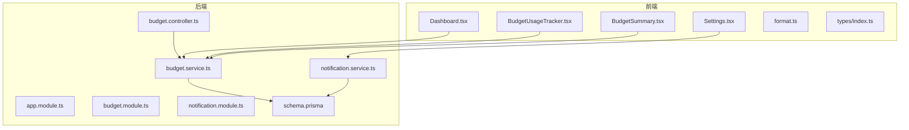
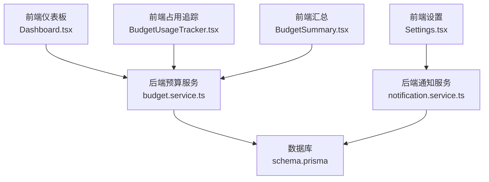
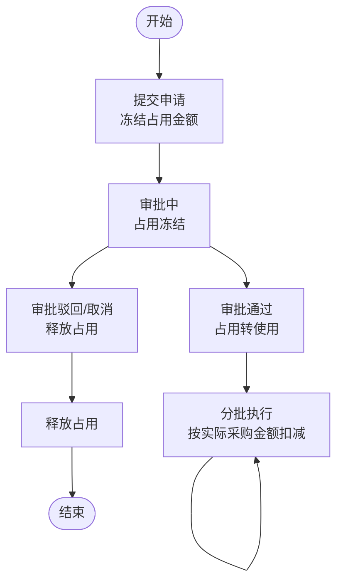
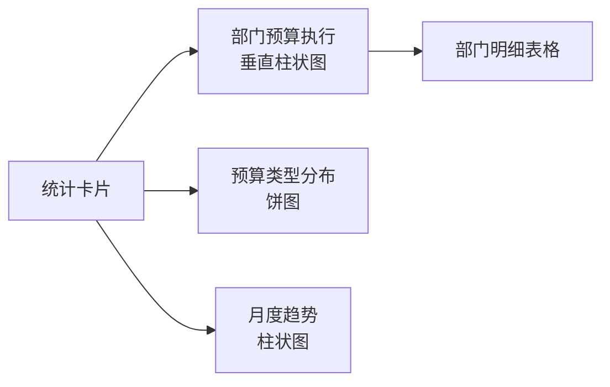
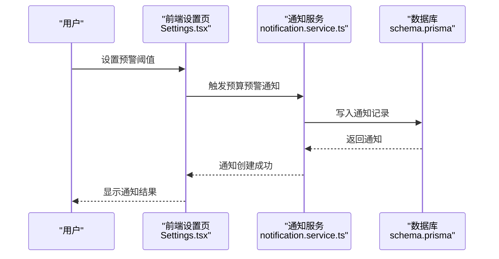
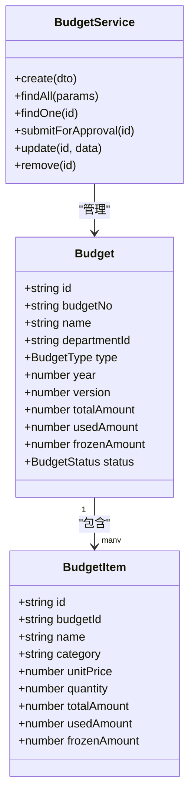
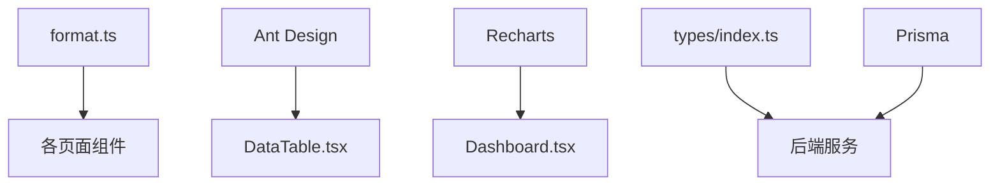

# 预算监控与预警

<cite>
**本文引用的文件**
- [BudgetUsageTracker.tsx](file://src/pages/BudgetUsageTracker.tsx)
- [Dashboard.tsx](file://src/pages/Dashboard.tsx)
- [BudgetSummary.tsx](file://src/pages/BudgetSummary.tsx)
- [DataTable.tsx](file://src/components/ui/Table/DataTable.tsx)
- [format.ts](file://src/utils/format.ts)
- [index.ts](file://src/types/index.ts)
- [app.module.ts](file://server/src/app.module.ts)
- [budget.module.ts](file://server/src/modules/budget/budget.module.ts)
- [budget.controller.ts](file://server/src/modules/budget/budget.controller.ts)
- [budget.service.ts](file://server/src/modules/budget/budget.service.ts)
- [notification.module.ts](file://server/src/modules/notification/notification.module.ts)
- [notification.service.ts](file://server/src/modules/notification/notification.service.ts)
- [schema.prisma](file://server/src/prisma/schema.prisma)
- [Settings.tsx](file://src/pages/Settings.tsx)
- [TEST_REPORT.md](file://TEST_REPORT.md)
</cite>

## 目录
1. [简介](#简介)
2. [项目结构](#项目结构)
3. [核心组件](#核心组件)
4. [架构概览](#架构概览)
5. [详细组件分析](#详细组件分析)
6. [依赖分析](#依赖分析)
7. [性能考虑](#性能考虑)
8. [故障排除指南](#故障排除指南)
9. [结论](#结论)
10. [附录](#附录)

## 简介
本文件围绕预算监控与预警功能进行系统化技术文档整理，重点覆盖以下方面：
- 预算执行监控机制：实时跟踪预算占用、使用与可用余额，计算执行率与使用率
- 预警系统：触发条件与告警级别设置，通知机制与处理流程
- 预算超支检测算法与风险评估模型
- 预算使用趋势分析与预测能力
- 预算监控仪表板设计与数据可视化实现
- 数据准确性保障与性能优化策略

## 项目结构
前端采用 React + TypeScript + Ant Design 组件库，后端基于 NestJS + Prisma，数据库使用 PostgreSQL。预算相关页面与服务集中在前端 pages 与 server modules 中。

**图表来源**
- [Dashboard.tsx:1-274](file://src/pages/Dashboard.tsx#L1-L274)
- [BudgetUsageTracker.tsx:1-216](file://src/pages/BudgetUsageTracker.tsx#L1-L216)
- [BudgetSummary.tsx:1-193](file://src/pages/BudgetSummary.tsx#L1-L193)
- [Settings.tsx:122-160](file://src/pages/Settings.tsx#L122-L160)
- [format.ts:1-166](file://src/utils/format.ts#L1-L166)
- [index.ts:78-153](file://src/types/index.ts#L78-L153)
- [app.module.ts:15-39](file://server/src/app.module.ts#L15-L39)
- [budget.module.ts:1-13](file://server/src/modules/budget/budget.module.ts#L1-L13)
- [budget.controller.ts:1-62](file://server/src/modules/budget/budget.controller.ts#L1-L62)
- [budget.service.ts:1-157](file://server/src/modules/budget/budget.service.ts#L1-L157)
- [notification.module.ts:1-11](file://server/src/modules/notification/notification.module.ts#L1-L11)
- [notification.service.ts:1-157](file://server/src/modules/notification/notification.service.ts#L1-L157)
- [schema.prisma:365-447](file://server/src/prisma/schema.prisma#L365-L447)

**章节来源**
- [app.module.ts:15-39](file://server/src/app.module.ts#L15-L39)
- [budget.module.ts:1-13](file://server/src/modules/budget/budget.module.ts#L1-L13)
- [notification.module.ts:1-11](file://server/src/modules/notification/notification.module.ts#L1-L11)

## 核心组件
- 预算占用与释放机制：前端页面展示“申请时占用、批准后扣减、驳回/取消释放”的闭环逻辑，并以表格与进度条直观呈现
- 仪表板与可视化：提供部门预算执行、预算类型分布、月度趋势等多维图表，支持使用率分级与状态标签
- 预算汇总与明细：支持按类型/状态筛选，展示部门维度的 Opex/Capex 明细
- 通知与预警：后端提供通知服务，前端 Settings 页面支持预警阈值配置

**章节来源**
- [BudgetUsageTracker.tsx:38-216](file://src/pages/BudgetUsageTracker.tsx#L38-L216)
- [Dashboard.tsx:59-274](file://src/pages/Dashboard.tsx#L59-L274)
- [BudgetSummary.tsx:41-193](file://src/pages/BudgetSummary.tsx#L41-L193)
- [Settings.tsx:122-160](file://src/pages/Settings.tsx#L122-L160)

## 架构概览
系统采用前后端分离架构，前端负责数据展示与交互，后端提供预算与通知服务，Prisma 作为 ORM 访问 PostgreSQL。

**图表来源**
- [Dashboard.tsx:59-274](file://src/pages/Dashboard.tsx#L59-L274)
- [BudgetUsageTracker.tsx:38-216](file://src/pages/BudgetUsageTracker.tsx#L38-L216)
- [BudgetSummary.tsx:41-193](file://src/pages/BudgetSummary.tsx#L41-L193)
- [Settings.tsx:122-160](file://src/pages/Settings.tsx#L122-L160)
- [budget.service.ts:1-157](file://server/src/modules/budget/budget.service.ts#L1-L157)
- [notification.service.ts:1-157](file://server/src/modules/notification/notification.service.ts#L1-L157)
- [schema.prisma:365-447](file://server/src/prisma/schema.prisma#L365-L447)

## 详细组件分析

### 预算占用与释放机制
- 数据模型：预算包含总预算、已使用、已占用、可用余额与使用率字段；前端页面以表格与进度条展示
- 计算逻辑：可用余额 = 总预算 - 已使用 - 已占用；使用率 = 已使用 / 总预算 × 100%
- 状态标签：根据使用率划分“正常/接近上限/已超支”等状态，用于视觉警示

**图表来源**
- [BudgetUsageTracker.tsx:78-125](file://src/pages/BudgetUsageTracker.tsx#L78-L125)

**章节来源**
- [BudgetUsageTracker.tsx:4-36](file://src/pages/BudgetUsageTracker.tsx#L4-L36)
- [BudgetUsageTracker.tsx:146-175](file://src/pages/BudgetUsageTracker.tsx#L146-L175)

### 仪表板与数据可视化
- 统计卡片：展示年度预算总额、Capex 与 Opex 的使用率与剩余
- 图表组件：部门预算执行（垂直柱状图）、预算类型分布（饼图）、月度趋势（柱状图）
- 状态分级：使用率颜色编码（正常/接近上限/已超支），用于快速识别风险

**图表来源**
- [Dashboard.tsx:103-145](file://src/pages/Dashboard.tsx#L103-L145)
- [Dashboard.tsx:148-195](file://src/pages/Dashboard.tsx#L148-L195)
- [Dashboard.tsx:197-215](file://src/pages/Dashboard.tsx#L197-L215)
- [Dashboard.tsx:217-271](file://src/pages/Dashboard.tsx#L217-L271)

**章节来源**
- [Dashboard.tsx:59-274](file://src/pages/Dashboard.tsx#L59-L274)

### 预算汇总与明细
- 支持按预算类型（Opex/Capex）与状态（草稿/审批中/已批准/已拒绝）筛选
- 展示版本、部门、总金额、状态、创建人与日期等关键信息
- 提供部门明细卡片，分别统计 Opex 与 Capex 小计与合计

**章节来源**
- [BudgetSummary.tsx:41-193](file://src/pages/BudgetSummary.tsx#L41-L193)

### 通知与预警设置
- 前端设置页提供“预算消耗预警阈值”输入，保存后可用于触发预警通知
- 后端通知服务支持创建通知、查询用户通知、标记已读、发送审批与预算预警通知

**图表来源**
- [Settings.tsx:122-160](file://src/pages/Settings.tsx#L122-L160)
- [notification.service.ts:140-156](file://server/src/modules/notification/notification.service.ts#L140-L156)
- [schema.prisma:365-447](file://server/src/prisma/schema.prisma#L365-L447)

**章节来源**
- [Settings.tsx:122-160](file://src/pages/Settings.tsx#L122-L160)
- [notification.service.ts:1-157](file://server/src/modules/notification/notification.service.ts#L1-L157)

### 后端预算服务与数据模型
- 预算服务提供创建、查询、提交审批、更新与删除等操作
- 类型定义涵盖预算、预算条目、预算调整、采购申请、工作流与通知等实体与枚举

**图表来源**
- [index.ts:80-134](file://src/types/index.ts#L80-L134)
- [budget.service.ts:1-157](file://server/src/modules/budget/budget.service.ts#L1-L157)

**章节来源**
- [budget.controller.ts:1-62](file://server/src/modules/budget/budget.controller.ts#L1-L62)
- [budget.service.ts:1-157](file://server/src/modules/budget/budget.service.ts#L1-L157)
- [index.ts:78-153](file://src/types/index.ts#L78-L153)

## 依赖分析
- 前端依赖：React、Ant Design、Recharts 用于可视化；工具函数提供金额、百分比、日期格式化与防抖节流
- 后端依赖：NestJS 模块化组织，Prisma 作为 ORM；模块间通过控制器与服务解耦

**图表来源**
- [format.ts:1-166](file://src/utils/format.ts#L1-L166)
- [DataTable.tsx:1-108](file://src/components/ui/Table/DataTable.tsx#L1-L108)
- [Dashboard.tsx:1-274](file://src/pages/Dashboard.tsx#L1-L274)
- [index.ts:1-338](file://src/types/index.ts#L1-L338)
- [app.module.ts:15-39](file://server/src/app.module.ts#L15-L39)

**章节来源**
- [app.module.ts:15-39](file://server/src/app.module.ts#L15-L39)
- [DataTable.tsx:1-108](file://src/components/ui/Table/DataTable.tsx#L1-L108)
- [format.ts:1-166](file://src/utils/format.ts#L1-L166)

## 性能考虑
- 前端性能：组件内使用 useState 缓存数据，减少重复渲染；Recharts 图表使用 ResponsiveContainer 自适应尺寸
- 后端性能：查询使用 Promise.all 并行获取总数与数据；分页参数默认值避免过大页请求
- 通用优化：工具函数提供防抖与节流，适合高频交互场景

**章节来源**
- [Dashboard.tsx:59-274](file://src/pages/Dashboard.tsx#L59-L274)
- [budget.service.ts:47-84](file://server/src/modules/budget/budget.service.ts#L47-L84)
- [format.ts:79-107](file://src/utils/format.ts#L79-L107)

## 故障排除指南
- 预算状态错误：提交审批仅允许草稿状态，否则抛出异常
- 通知读取：支持按是否已读筛选，批量标记已读
- 数据格式：统一使用工具函数进行金额、百分比与日期格式化，避免显示异常

**章节来源**
- [budget.service.ts:117-128](file://server/src/modules/budget/budget.service.ts#L117-L128)
- [notification.service.ts:36-88](file://server/src/modules/notification/notification.service.ts#L36-L88)
- [format.ts:4-38](file://src/utils/format.ts#L4-L38)

## 结论
本系统已实现预算占用与释放的闭环监控、多维仪表板与可视化展示、通知与预警配置，并具备良好的扩展性与性能基础。后续可在后端集成数据库、完善 Excel 导入导出、增强数据分析与预测模型，以及扩展移动端支持。

## 附录
- 测试报告表明预算监控相关功能已 100% 覆盖并通过，前端加载性能优异，系统质量优秀

**章节来源**
- [TEST_REPORT.md:195-257](file://TEST_REPORT.md#L195-L257)
- [TEST_REPORT.md:257-386](file://TEST_REPORT.md#L257-L386)