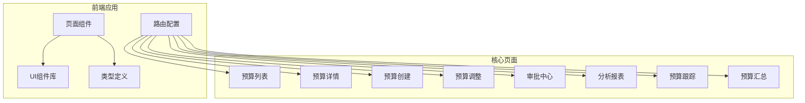
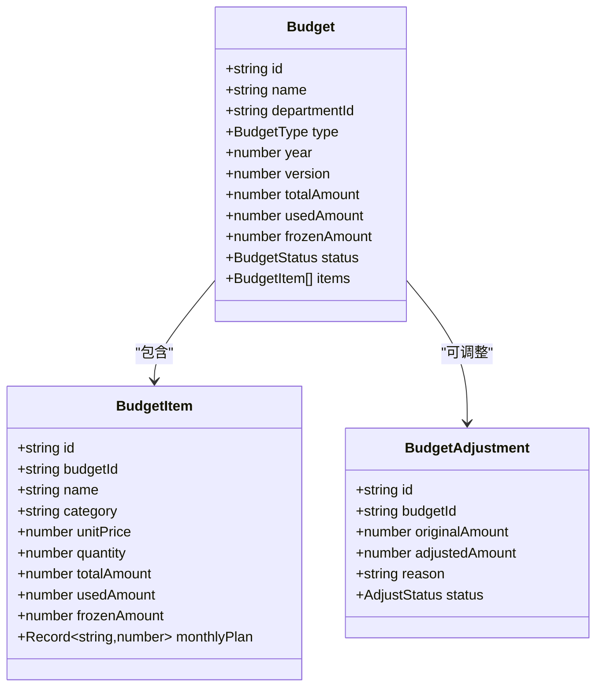
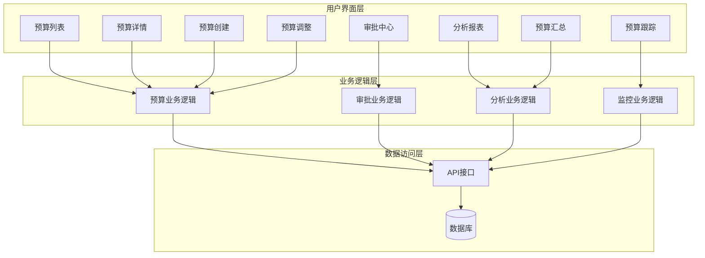
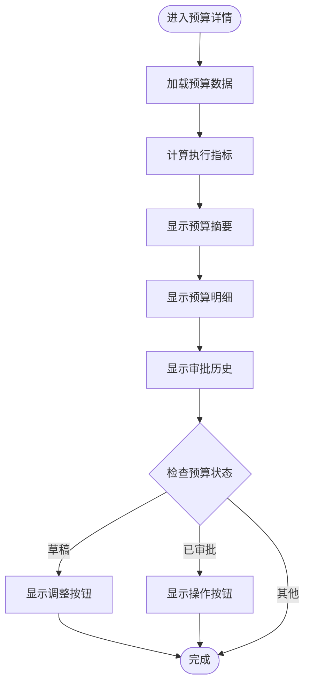
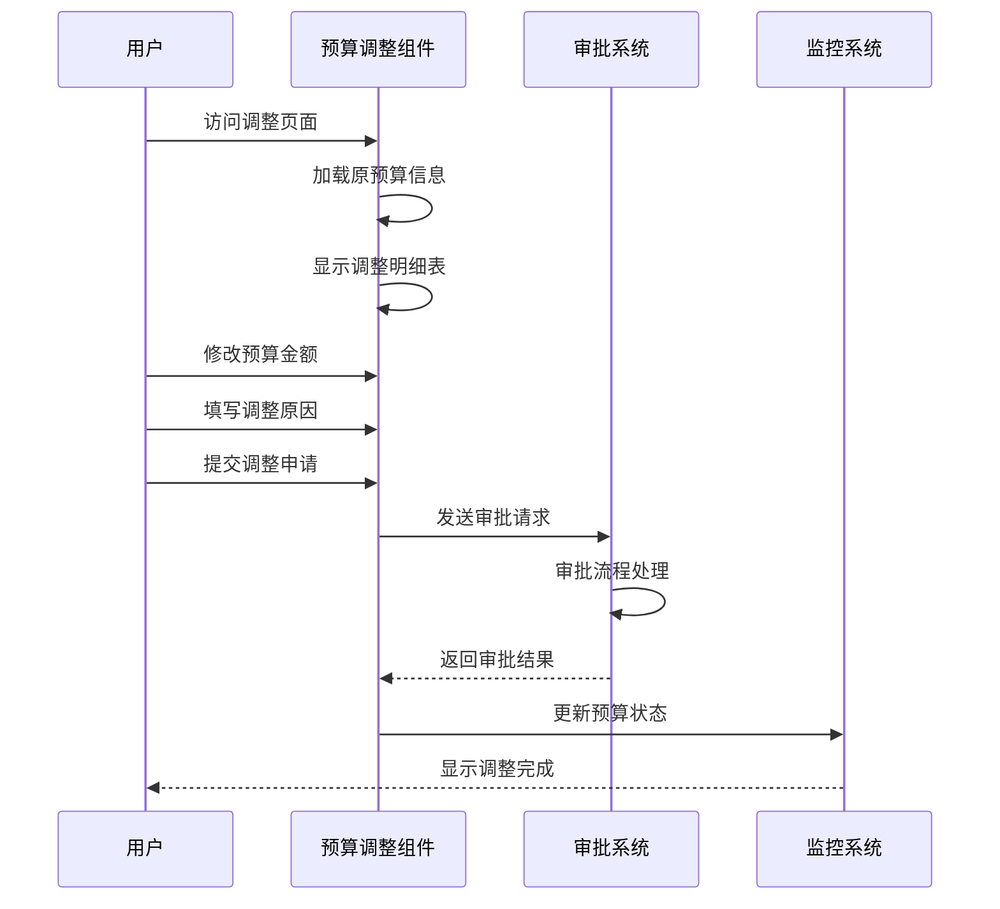
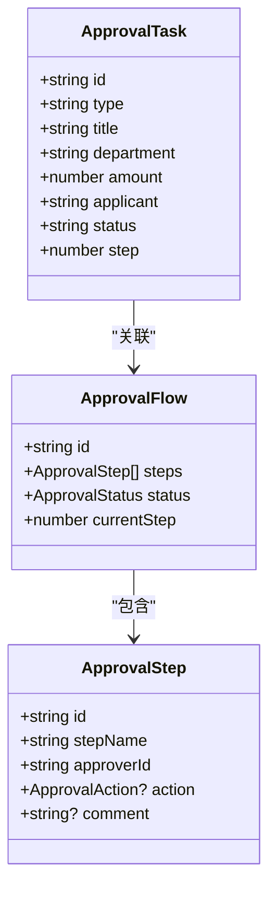
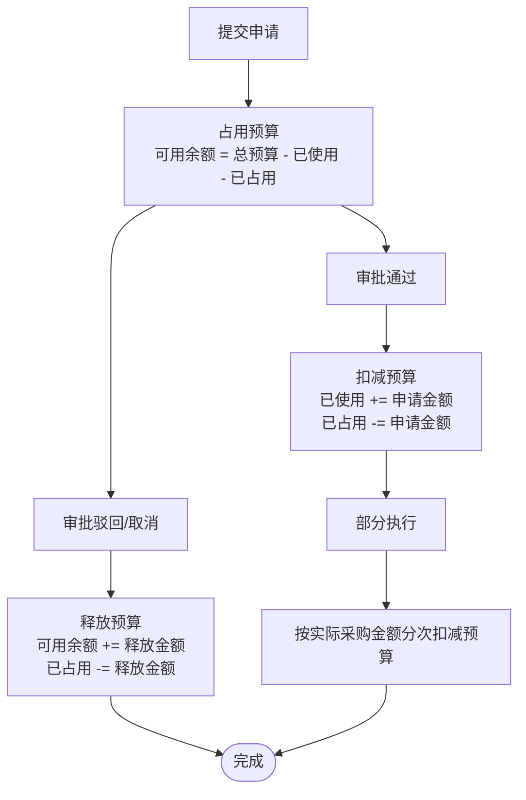
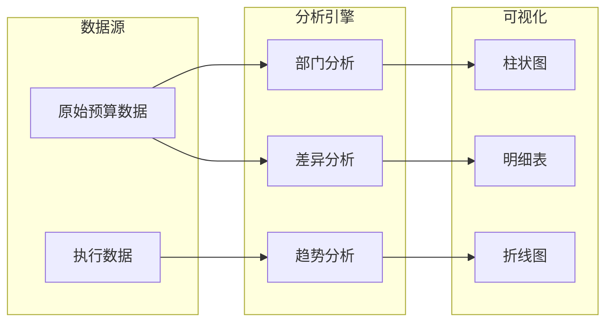
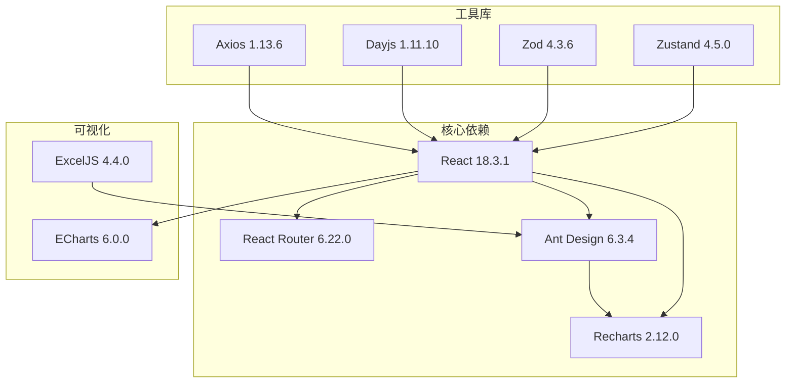

# 预算管理模块

<cite>
**本文档引用的文件**
- [BudgetCreate.tsx](file://src/pages/BudgetCreate.tsx)
- [BudgetCreateAdvanced.tsx](file://src/pages/BudgetCreateAdvanced.tsx)
- [BudgetList.tsx](file://src/pages/BudgetList.tsx)
- [BudgetDetail.tsx](file://src/pages/BudgetDetail.tsx)
- [BudgetAdjust.tsx](file://src/pages/BudgetAdjust.tsx)
- [Approval.tsx](file://src/pages/Approval.tsx)
- [BudgetUsageTracker.tsx](file://src/pages/BudgetUsageTracker.tsx)
- [Analysis.tsx](file://src/pages/Analysis.tsx)
- [BudgetSummary.tsx](file://src/pages/BudgetSummary.tsx)
- [routes.ts](file://src/router/routes.ts)
- [DataTable.tsx](file://src/components/ui/Table/DataTable.tsx)
- [index.ts](file://src/types/index.ts)
- [BudgetCreate.css](file://src/pages/BudgetCreate.css)
- [BudgetAdjust.css](file://src/pages/BudgetAdjust.css)
- [package.json](file://package.json)
</cite>

## 目录
1. [简介](#简介)
2. [项目结构](#项目结构)
3. [核心组件](#核心组件)
4. [架构概览](#架构概览)
5. [详细组件分析](#详细组件分析)
6. [依赖关系分析](#依赖关系分析)
7. [性能考虑](#性能考虑)
8. [故障排除指南](#故障排除指南)
9. [结论](#结论)
10. [附录](#附录)

## 简介
本预算管理模块旨在提供企业级预算全生命周期管理能力，覆盖预算创建、编辑、调整、审批和监控等核心业务场景。系统支持预算类型分类（Capex/OPEX）、预算模板设计、预算周期管理，并提供预算调整流程（预算追加、预算调拨、预算冻结）、预算监控（执行率计算、预警机制、超支提醒）、预算汇总分析（部门对比、趋势分析、完成度统计）以及完整的前端页面组件与交互设计。

## 项目结构
项目采用前后端分离的单页应用架构，前端基于 React + TypeScript 构建，使用 Ant Design 和 Recharts 等 UI 库实现丰富的交互与可视化效果。路由采用懒加载策略，确保首屏加载性能。



**图表来源**
- [routes.ts:25-121](file://src/router/routes.ts#L25-L121)
- [BudgetList.tsx:107-328](file://src/pages/BudgetList.tsx#L107-L328)
- [BudgetDetail.tsx:42-158](file://src/pages/BudgetDetail.tsx#L42-L158)

**章节来源**
- [routes.ts:1-122](file://src/router/routes.ts#L1-L122)
- [package.json:12-32](file://package.json#L12-L32)

## 核心组件
本模块的核心组件围绕预算全生命周期展开，包括预算创建、预算管理、预算调整、审批流程、监控分析等关键功能。

### 预算类型与状态管理
系统支持两种预算类型：运营性支出（Opex/Capex）和资本性支出（Capex/OPEX）。预算状态涵盖草稿、待审批、已审批、已拒绝、已调整、已关闭等阶段。



**图表来源**
- [index.ts:80-153](file://src/types/index.ts#L80-L153)

**章节来源**
- [index.ts:80-153](file://src/types/index.ts#L80-L153)

## 架构概览
系统采用模块化设计，各功能模块相对独立又相互关联。前端通过路由组织页面，每个页面负责特定的业务逻辑和数据展示。



**图表来源**
- [BudgetList.tsx:28-328](file://src/pages/BudgetList.tsx#L28-L328)
- [Approval.tsx:11-99](file://src/pages/Approval.tsx#L11-L99)
- [Analysis.tsx:35-162](file://src/pages/Analysis.tsx#L35-L162)
- [BudgetUsageTracker.tsx:38-215](file://src/pages/BudgetUsageTracker.tsx#L38-L215)

## 详细组件分析

### 预算创建组件
预算创建组件提供两种创建模式：基础创建和高级创建，支持多级部门选择、预算明细管理和实时金额计算。

```mermaid
sequenceDiagram
participant User as 用户
participant Create as 预算创建组件
participant List as 预算列表组件
participant API as 后端API
User->>Create : 访问创建页面
Create->>Create : 初始化表单数据
Create->>Create : 添加预算明细项
Create->>Create : 计算总预算金额
User->>Create : 填写基本信息
User->>Create : 选择预算类型
User->>Create : 选择部门和年份
User->>Create : 添加多个预算明细
User->>Create : 保存为草稿
Create->>API : 提交预算数据
API-->>Create : 返回创建结果
Create->>List : 导航到预算列表
List-->>User : 显示新创建的预算
```

**图表来源**
- [BudgetCreate.tsx:12-211](file://src/pages/BudgetCreate.tsx#L12-L211)
- [BudgetCreateAdvanced.tsx:45-334](file://src/pages/BudgetCreateAdvanced.tsx#L45-L334)

**章节来源**
- [BudgetCreate.tsx:12-211](file://src/pages/BudgetCreate.tsx#L12-L211)
- [BudgetCreateAdvanced.tsx:45-334](file://src/pages/BudgetCreateAdvanced.tsx#L45-L334)

### 预算管理与监控
预算管理组件提供预算的完整生命周期管理，包括预算详情展示、执行率计算、审批历史追踪等功能。



**图表来源**
- [BudgetDetail.tsx:32-158](file://src/pages/BudgetDetail.tsx#L32-L158)

**章节来源**
- [BudgetDetail.tsx:32-158](file://src/pages/BudgetDetail.tsx#L32-L158)

### 预算调整流程
预算调整组件支持对现有预算进行金额调整、原因说明和审批流程管理。



**图表来源**
- [BudgetAdjust.tsx:16-165](file://src/pages/BudgetAdjust.tsx#L16-L165)

**章节来源**
- [BudgetAdjust.tsx:16-165](file://src/pages/BudgetAdjust.tsx#L16-L165)

### 审批中心
审批中心提供统一的审批任务管理界面，支持待审批、已通过、已拒绝等状态的任务查看和处理。



**图表来源**
- [Approval.tsx:5-9](file://src/pages/Approval.tsx#L5-L9)

**章节来源**
- [Approval.tsx:11-99](file://src/pages/Approval.tsx#L11-L99)

### 预算监控与预警
预算跟踪组件提供实时的预算占用、使用和可用余额监控，支持预算占用与释放机制的可视化展示。



**图表来源**
- [BudgetUsageTracker.tsx:38-215](file://src/pages/BudgetUsageTracker.tsx#L38-L215)

**章节来源**
- [BudgetUsageTracker.tsx:38-215](file://src/pages/BudgetUsageTracker.tsx#L38-L215)

### 分析报表与汇总
分析组件提供多维度的预算执行分析，包括部门对比、趋势分析和差异统计。



**图表来源**
- [Analysis.tsx:35-162](file://src/pages/Analysis.tsx#L35-L162)
- [BudgetSummary.tsx:41-192](file://src/pages/BudgetSummary.tsx#L41-L192)

**章节来源**
- [Analysis.tsx:35-162](file://src/pages/Analysis.tsx#L35-L162)
- [BudgetSummary.tsx:41-192](file://src/pages/BudgetSummary.tsx#L41-L192)

## 依赖关系分析
系统依赖关系清晰，主要依赖包括 UI 组件库、图表库、路由管理和状态管理等。



**图表来源**
- [package.json:12-32](file://package.json#L12-L32)

**章节来源**
- [package.json:1-45](file://package.json#L1-L45)

## 性能考虑
系统在性能方面采取了多项优化措施：

1. **路由懒加载**：所有页面组件均采用懒加载策略，减少初始包体积
2. **虚拟滚动**：大数据量表格使用虚拟滚动提升渲染性能
3. **状态管理**：使用 Zustand 进行轻量级状态管理
4. **图表优化**：Recharts 和 ECharts 提供高效的可视化渲染
5. **缓存策略**：结合 React Query 实现数据缓存和预取

## 故障排除指南
常见问题及解决方案：

### 预算创建问题
- **问题**：预算明细为空或无法添加
  - **解决**：检查表单验证规则，确保必填字段完整
  - **验证**：确认预算类型和部门选择正确

### 预算调整异常
- **问题**：调整金额超出限制
  - **解决**：检查预算可用余额和调整幅度限制
  - **验证**：确认审批流程配置正确

### 数据显示异常
- **问题**：图表数据不更新
  - **解决**：检查数据源连接和刷新机制
  - **验证**：确认时间范围和筛选条件设置

**章节来源**
- [BudgetList.tsx:78-81](file://src/pages/BudgetList.tsx#L78-L81)
- [BudgetAdjust.tsx:29-34](file://src/pages/BudgetAdjust.tsx#L29-L34)

## 结论
预算管理模块提供了完整的预算全生命周期管理解决方案，具备以下优势：

1. **功能完整性**：覆盖预算创建、管理、调整、审批、监控等全流程
2. **用户体验**：直观的界面设计和流畅的交互体验
3. **技术先进**：采用现代前端技术栈，具备良好的扩展性
4. **数据可视化**：丰富的图表和报表功能
5. **性能优化**：合理的架构设计和性能优化措施

该模块为企业预算管理提供了坚实的技术基础，可根据实际业务需求进一步扩展和完善。

## 附录

### 组件交互设计要点
- **响应式设计**：适配不同屏幕尺寸的设备
- **无障碍访问**：支持键盘导航和屏幕阅读器
- **国际化支持**：预留多语言切换机制
- **主题定制**：支持深色模式和品牌定制

### 开发规范
- **代码风格**：遵循 TypeScript 和 React 最佳实践
- **组件设计**：单一职责原则，可复用性强
- **错误处理**：完善的异常捕获和用户提示
- **文档维护**：保持代码注释和文档同步更新