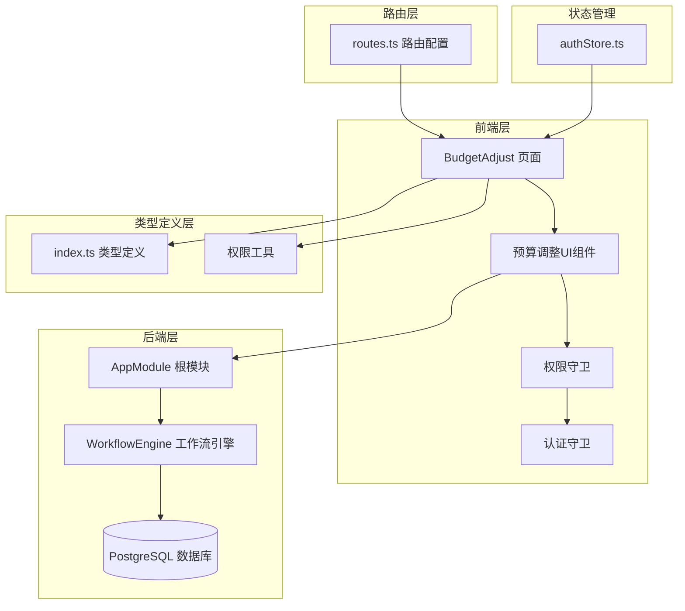
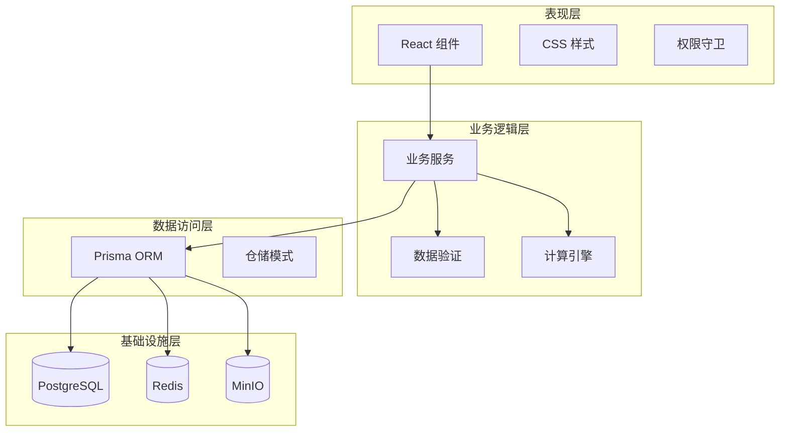
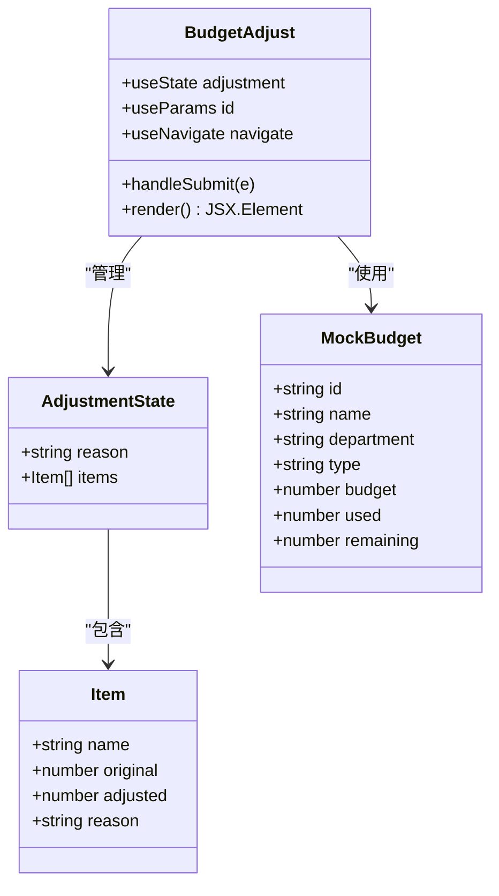
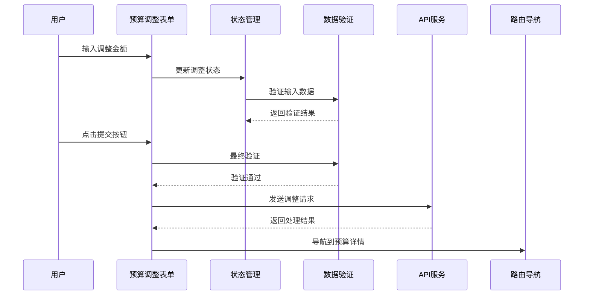
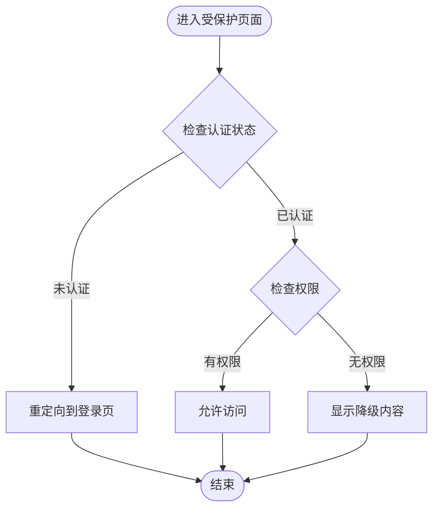
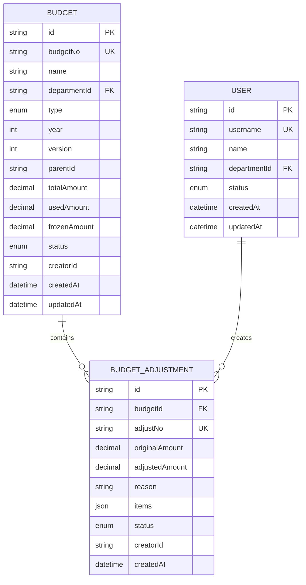
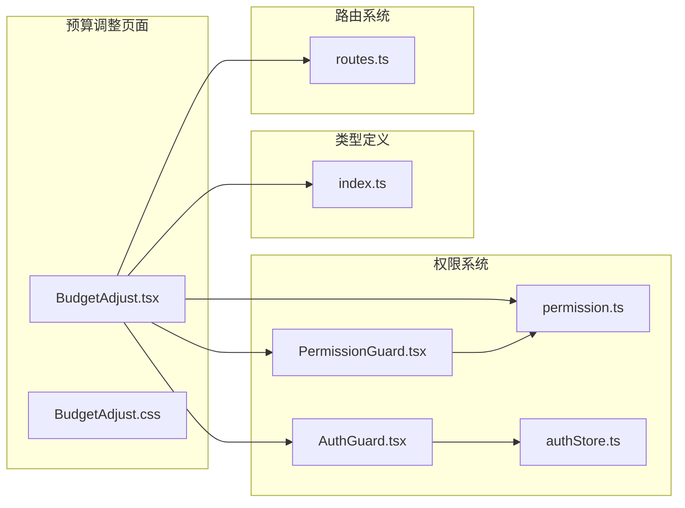
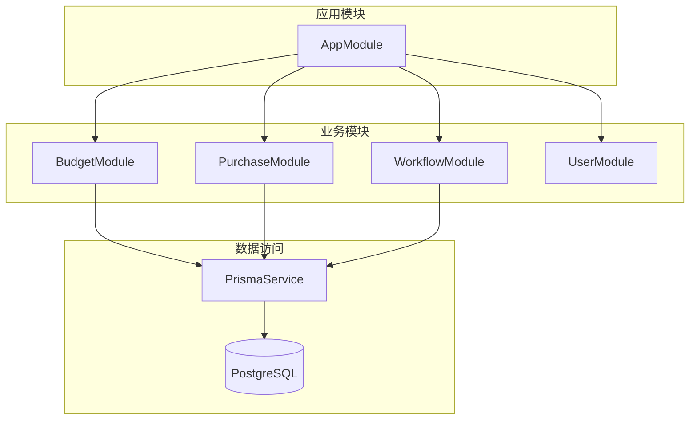
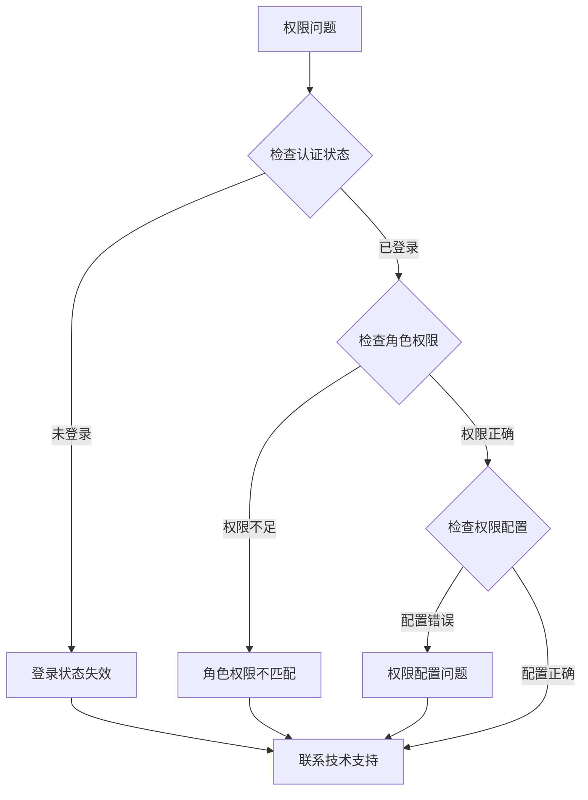

# 预算调整管理

<cite>
**本文档引用的文件**
- [BudgetAdjust.tsx](file://src/pages/BudgetAdjust.tsx)
- [BudgetAdjust.css](file://src/pages/BudgetAdjust.css)
- [index.ts](file://src/types/index.ts)
- [routes.ts](file://src/router/routes.ts)
- [AuthGuard.tsx](file://src/components/guard/AuthGuard.tsx)
- [PermissionGuard.tsx](file://src/components/guard/PermissionGuard.tsx)
- [permission.ts](file://src/utils/permission.ts)
- [authStore.ts](file://src/store/authStore.ts)
- [schema.prisma](file://server/src/prisma/schema.prisma)
- [app.module.ts](file://server/src/app.module.ts)
- [workflow-engine.service.ts](file://server/src/modules/workflow/workflow-engine.service.ts)
- [auth.api.ts](file://src/api/modules/auth.api.ts)
</cite>

## 目录
1. [简介](#简介)
2. [项目结构](#项目结构)
3. [核心组件](#核心组件)
4. [架构概览](#架构概览)
5. [详细组件分析](#详细组件分析)
6. [依赖关系分析](#依赖关系分析)
7. [性能考虑](#性能考虑)
8. [故障排除指南](#故障排除指南)
9. [结论](#结论)

## 简介

预算调整管理功能是企业级预算管理系统的核心模块之一，负责处理预算的追加、调拨和冻结等操作类型。该功能提供了完整的预算调整申请、审批和执行流程，支持实时预算执行率计算和历史记录管理。

系统采用前后端分离架构，前端使用React + TypeScript构建用户界面，后端基于NestJS + Prisma + PostgreSQL提供RESTful API服务。整个系统实现了完善的权限控制、工作流审批和审计追踪功能。

## 项目结构

预算调整管理功能在项目中的组织结构如下：

**图表来源**
- [BudgetAdjust.tsx:1-165](file://src/pages/BudgetAdjust.tsx#L1-L165)
- [routes.ts:1-122](file://src/router/routes.ts#L1-L122)
- [index.ts:1-338](file://src/types/index.ts#L1-L338)

**章节来源**
- [BudgetAdjust.tsx:1-165](file://src/pages/BudgetAdjust.tsx#L1-L165)
- [routes.ts:1-122](file://src/router/routes.ts#L1-L122)
- [index.ts:78-153](file://src/types/index.ts#L78-L153)

## 核心组件

### 预算调整页面组件

预算调整页面是用户交互的核心界面，提供了完整的预算调整功能：

- **原预算信息展示**：显示当前预算的基本信息和执行情况
- **调整明细表格**：支持逐项调整预算金额和填写调整原因
- **实时计算功能**：自动计算调整前后金额差异
- **表单验证**：确保必填字段的完整性和有效性

### 权限控制系统

系统实现了多层次的权限控制机制：

- **认证守卫**：保护需要登录访问的页面
- **权限守卫**：控制按钮级别的权限访问
- **权限工具**：提供权限判断和组合检查功能
- **角色管理**：支持多种预定义角色和权限组合

### 数据模型设计

系统使用Prisma ORM定义了完整的数据模型：

- **预算实体**：包含预算基本信息、状态和金额字段
- **预算调整实体**：记录每次预算调整的详细信息
- **预算条目实体**：支持预算项目的细粒度管理
- **工作流实体**：支持复杂的审批流程管理

**章节来源**
- [BudgetAdjust.tsx:16-38](file://src/pages/BudgetAdjust.tsx#L16-L38)
- [index.ts:136-153](file://src/types/index.ts#L136-L153)
- [permission.ts:53-83](file://src/utils/permission.ts#L53-L83)

## 架构概览

系统采用分层架构设计，实现了清晰的关注点分离：

**图表来源**
- [app.module.ts:15-35](file://server/src/app.module.ts#L15-L35)
- [schema.prisma:1-448](file://server/src/prisma/schema.prisma#L1-L448)

**章节来源**
- [app.module.ts:1-40](file://server/src/app.module.ts#L1-L40)
- [schema.prisma:107-174](file://server/src/prisma/schema.prisma#L107-L174)

## 详细组件分析

### 预算调整页面组件

#### 组件结构分析

**图表来源**
- [BudgetAdjust.tsx:16-27](file://src/pages/BudgetAdjust.tsx#L16-L27)
- [BudgetAdjust.tsx:5-14](file://src/pages/BudgetAdjust.tsx#L5-L14)

#### 表单处理流程

**图表来源**
- [BudgetAdjust.tsx:29-34](file://src/pages/BudgetAdjust.tsx#L29-L34)

#### 实时计算机制

系统实现了智能的实时计算功能：

- **合计计算**：自动计算原始总金额和调整后总金额
- **差异计算**：实时显示调整金额差异
- **样式动态切换**：根据差异正负值动态切换颜色样式

**章节来源**
- [BudgetAdjust.tsx:36-38](file://src/pages/BudgetAdjust.tsx#L36-L38)
- [BudgetAdjust.css:23-29](file://src/pages/BudgetAdjust.css#L23-L29)

### 权限控制系统

#### 权限守卫组件

**图表来源**
- [PermissionGuard.tsx:15-46](file://src/components/guard/PermissionGuard.tsx#L15-L46)

#### 权限工具函数

系统提供了灵活的权限检查工具：

- **hasPermission**：检查单一权限
- **hasAnyPermission**：检查任意权限
- **hasAllPermissions**：检查所有权限
- **generatePermission**：权限字符串生成

**章节来源**
- [PermissionGuard.tsx:11-41](file://src/components/guard/PermissionGuard.tsx#L11-L41)
- [permission.ts:11-48](file://src/utils/permission.ts#L11-L48)

### 数据模型设计

#### 预算调整实体

**图表来源**
- [schema.prisma:159-174](file://server/src/prisma/schema.prisma#L159-L174)
- [schema.prisma:107-134](file://server/src/prisma/schema.prisma#L107-L134)

#### 工作流集成

系统集成了完整的工作流审批机制：

- **工作流模板**：支持不同类型的审批流程
- **审批步骤**：可配置的多步骤审批流程
- **状态管理**：完整的审批状态跟踪
- **条件分支**：基于金额等条件的智能路由

**章节来源**
- [schema.prisma:220-264](file://server/src/prisma/schema.prisma#L220-L264)
- [workflow-engine.service.ts:140-148](file://server/src/modules/workflow/workflow-engine.service.ts#L140-L148)

## 依赖关系分析

### 前端依赖关系

**图表来源**
- [BudgetAdjust.tsx:1-3](file://src/pages/BudgetAdjust.tsx#L1-L3)
- [PermissionGuard.tsx:1-2](file://src/components/guard/PermissionGuard.tsx#L1-L2)

### 后端依赖关系

**图表来源**
- [app.module.ts:15-35](file://server/src/app.module.ts#L15-L35)

**章节来源**
- [routes.ts:1-122](file://src/router/routes.ts#L1-L122)
- [app.module.ts:15-35](file://server/src/app.module.ts#L15-L35)

## 性能考虑

### 前端性能优化

- **懒加载组件**：使用React.lazy实现组件的按需加载
- **状态管理**：合理使用useState和useEffect避免不必要的重渲染
- **样式优化**：CSS Grid布局提高页面渲染效率
- **内存管理**：及时清理事件监听器和定时器

### 后端性能优化

- **数据库索引**：为常用查询字段建立索引
- **连接池**：使用Prisma连接池管理数据库连接
- **缓存策略**：Redis缓存热点数据
- **批量操作**：支持批量数据处理

## 故障排除指南

### 常见问题诊断

#### 权限相关问题

#### 数据同步问题

- **检查网络连接**：确认API请求是否成功
- **验证数据格式**：确保请求数据符合接口规范
- **查看错误日志**：分析后端错误信息
- **重试机制**：实现适当的重试策略

**章节来源**
- [AuthGuard.tsx:13-30](file://src/components/guard/AuthGuard.tsx#L13-L30)
- [PermissionGuard.tsx:21-45](file://src/components/guard/PermissionGuard.tsx#L21-L45)

## 结论

预算调整管理功能通过精心设计的架构和完善的组件体系，为企业提供了强大的预算管理能力。系统不仅支持基本的预算调整操作，还集成了完整的权限控制、工作流审批和审计追踪功能。

主要特点包括：

- **完整的业务流程**：从申请到执行的全流程管理
- **灵活的权限控制**：基于角色的精细化权限管理
- **实时的数据计算**：自动化的预算执行率计算
- **完善的审计功能**：完整的操作记录和追踪
- **良好的用户体验**：直观的界面设计和交互体验

未来可以进一步扩展的功能包括移动端支持、更复杂的工作流配置、高级分析报告等。