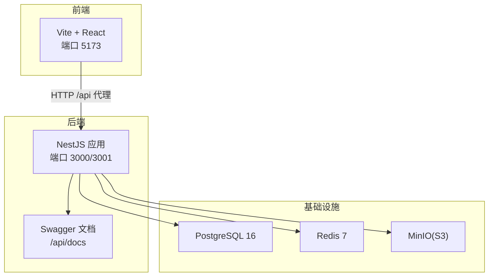
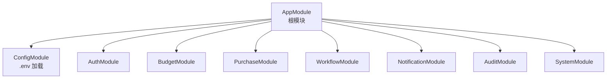
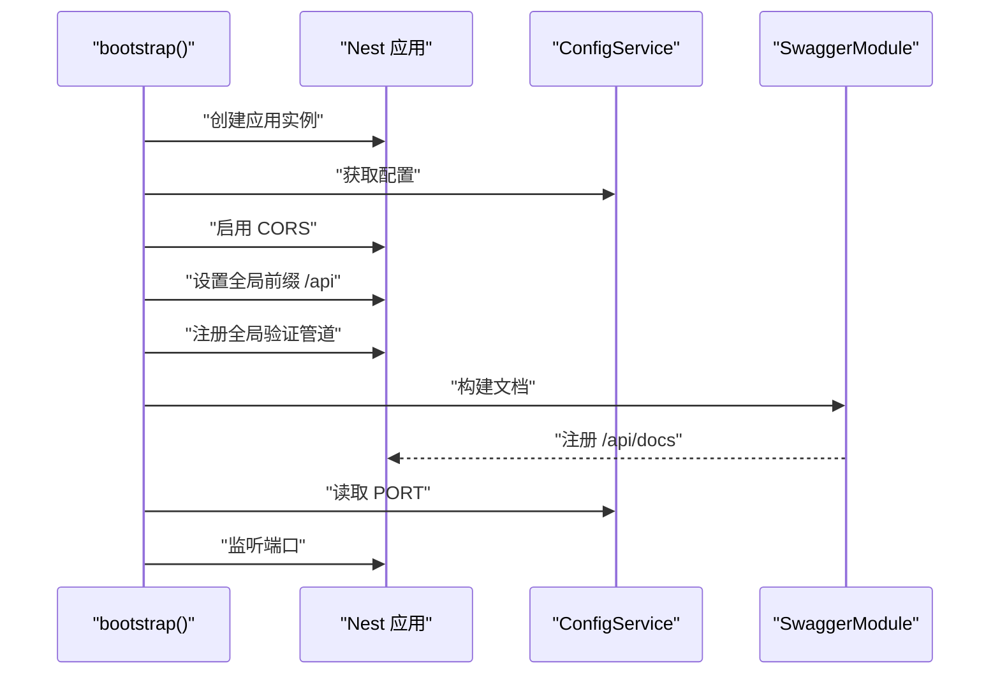
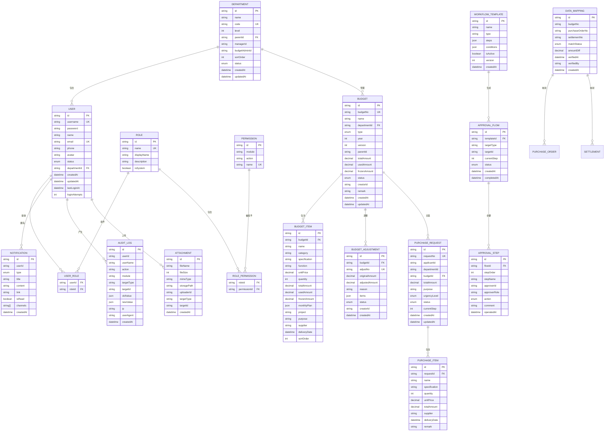
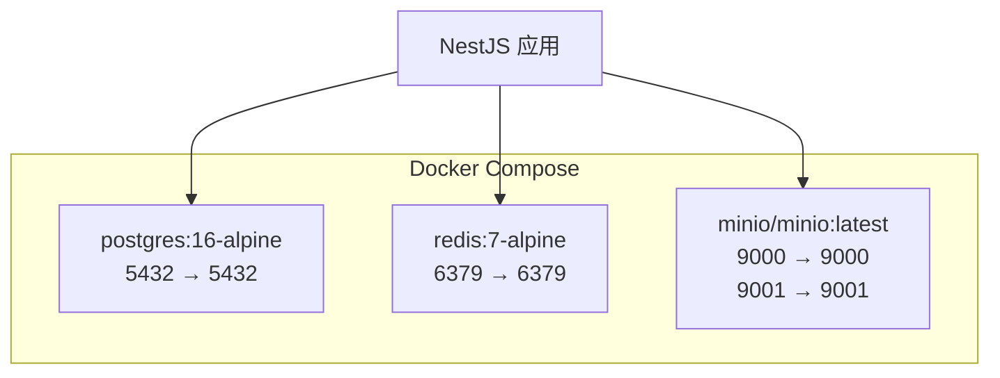
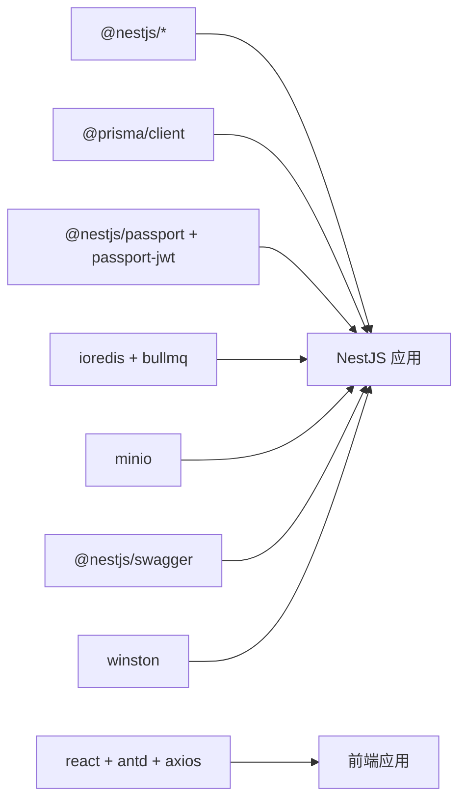

# 部署运维

<cite>
**本文引用的文件**
- [server/package.json](file://server/package.json)
- [package.json](file://package.json)
- [server/docker-compose.yml](file://server/docker-compose.yml)
- [server/src/main.ts](file://server/src/main.ts)
- [server/src/app.module.ts](file://server/src/app.module.ts)
- [server/src/prisma/schema.prisma](file://server/src/prisma/schema.prisma)
- [vite.config.ts](file://vite.config.ts)
- [server/README.md](file://server/README.md)
- [server/src/config/database.config.ts](file://server/src/config/database.config.ts)
- [server/src/config/jwt.config.ts](file://server/src/config/jwt.config.ts)
</cite>

## 目录
1. [简介](#简介)
2. [项目结构](#项目结构)
3. [核心组件](#核心组件)
4. [架构总览](#架构总览)
5. [详细组件分析](#详细组件分析)
6. [依赖关系分析](#依赖关系分析)
7. [性能考虑](#性能考虑)
8. [故障排除指南](#故障排除指南)
9. [结论](#结论)
10. [附录](#附录)

## 简介
本文件面向预算管理系统的生产部署与运维，覆盖环境准备、依赖安装、配置文件设置、Docker 容器化与编排、CI/CD 流水线建议、性能监控与日志管理、数据库备份与恢复、安全加固以及故障排除与应急响应流程。文档以仓库现有代码与配置为基础，结合最佳实践给出可落地的实施方案。

## 项目结构
系统由前后端分离架构组成：
- 前端：Vite + React 应用，通过代理将 /api 请求转发至后端服务，默认端口 5173。
- 后端：NestJS 应用，使用 Prisma 访问 PostgreSQL，集成 Redis 缓存、MinIO 对象存储、Swagger 文档、JWT 认证等。
- 基础设施：PostgreSQL、Redis、MinIO 通过 Docker Compose 编排。

图表来源
- [vite.config.ts:15-23](file://vite.config.ts#L15-L23)
- [server/src/main.ts:43-47](file://server/src/main.ts#L43-L47)
- [server/docker-compose.yml:4-53](file://server/docker-compose.yml#L4-L53)

章节来源
- [server/README.md:16-49](file://server/README.md#L16-L49)
- [vite.config.ts:15-23](file://vite.config.ts#L15-L23)
- [server/src/main.ts:43-47](file://server/src/main.ts#L43-L47)
- [server/docker-compose.yml:4-53](file://server/docker-compose.yml#L4-L53)

## 核心组件
- 后端入口与全局配置：应用启动、CORS、全局前缀、全局验证管道、Swagger 文档。
- 配置模块：全局 ConfigModule 加载 .env，支持数据库、JWT 等配置项。
- 数据模型：Prisma schema 定义用户、角色、部门、预算、采购、工作流、审计日志、通知、附件等实体及枚举。
- 基础设施编排：PostgreSQL、Redis、MinIO 通过 docker-compose 提供健康检查与持久化卷。

章节来源
- [server/src/main.ts:7-48](file://server/src/main.ts#L7-L48)
- [server/src/app.module.ts:22-47](file://server/src/app.module.ts#L22-L47)
- [server/src/prisma/schema.prisma:1-448](file://server/src/prisma/schema.prisma#L1-L448)
- [server/docker-compose.yml:1-59](file://server/docker-compose.yml#L1-L59)

## 架构总览
后端采用模块化设计，ConfigModule 作为配置中心；业务模块按功能拆分；公共模块封装通用能力（如 Prisma、Redis）。前端通过代理访问后端 API，Swagger 提供接口文档。

图表来源
- [server/src/app.module.ts:22-47](file://server/src/app.module.ts#L22-L47)

章节来源
- [server/src/app.module.ts:22-47](file://server/src/app.module.ts#L22-L47)

## 详细组件分析

### 后端启动与配置
- CORS：允许来自前端域名的跨域请求，并支持凭据。
- 全局前缀：统一为 /api。
- 全局验证管道：白名单过滤、非白名单禁止、自动类型转换。
- Swagger：生成 API 文档并通过 /api/docs 访问。
- 端口：默认从环境变量读取，未设置则使用 3000/3001。

图表来源
- [server/src/main.ts:7-48](file://server/src/main.ts#L7-L48)

章节来源
- [server/src/main.ts:7-48](file://server/src/main.ts#L7-L48)

### 配置模块与环境变量
- ConfigModule.forRoot：全局加载 .env 文件。
- 数据库配置：database.url 默认从 DATABASE_URL 读取。
- JWT 配置：secret、expiresIn、refreshExpiresIn 支持环境变量覆盖。

图表来源
- [server/src/app.module.ts:25-28](file://server/src/app.module.ts#L25-L28)
- [server/src/config/database.config.ts:3-5](file://server/src/config/database.config.ts#L3-L5)
- [server/src/config/jwt.config.ts:3-7](file://server/src/config/jwt.config.ts#L3-L7)

章节来源
- [server/src/app.module.ts:25-28](file://server/src/app.module.ts#L25-L28)
- [server/src/config/database.config.ts:3-5](file://server/src/config/database.config.ts#L3-L5)
- [server/src/config/jwt.config.ts:3-7](file://server/src/config/jwt.config.ts#L3-L7)

### 数据模型与数据库
- 数据源：PostgreSQL，Prisma 生成客户端。
- 实体覆盖：用户与权限、组织结构、预算管理、采购管理、工作流与审批、数据导入映射、通知系统、审计日志、附件管理。
- 枚举：用户状态、部门状态、预算类型/状态、调整状态、采购状态、紧急度、审批状态/动作、匹配状态、通知类型等。

图表来源
- [server/src/prisma/schema.prisma:15-448](file://server/src/prisma/schema.prisma#L15-L448)

章节来源
- [server/src/prisma/schema.prisma:15-448](file://server/src/prisma/schema.prisma#L15-L448)

### 基础设施编排与服务发现
- PostgreSQL：16 版本，健康检查、持久化卷。
- Redis：7 版本，健康检查、持久化卷。
- MinIO：对象存储，提供 API 与控制台端口，健康检查。
- 服务间通信：后端通过 DATABASE_URL 连接数据库；通过 Redis 缓存；通过 MinIO SDK 访问对象存储。

图表来源
- [server/docker-compose.yml:4-53](file://server/docker-compose.yml#L4-L53)

章节来源
- [server/docker-compose.yml:4-53](file://server/docker-compose.yml#L4-L53)

### 前端代理与端口
- 前端 Vite 代理将 /api 请求转发到后端，默认目标为 http://localhost:3001。
- 建议在生产环境中将代理目标指向实际后端域名或负载均衡器。

章节来源
- [vite.config.ts:15-23](file://vite.config.ts#L15-L23)

## 依赖关系分析
- 后端依赖：NestJS 核心、Config、Swagger、WebSockets、Prisma、Passport、BullMQ、ioredis、Nodemailer、ExcelJS、MinIO。
- 前端依赖：React、Ant Design、Axios、React Router、Recharts、Zustand 等。
- 测试：Jest 配置位于后端 package.json 中，支持单元测试与覆盖率统计。

图表来源
- [server/package.json:26-51](file://server/package.json#L26-L51)
- [package.json:12-33](file://package.json#L12-L33)

章节来源
- [server/package.json:26-51](file://server/package.json#L26-L51)
- [package.json:12-33](file://package.json#L12-L33)

## 性能考虑
- 数据库层
  - 使用索引优化高频查询字段（如用户、部门、预算、采购、审计日志等的多维索引）。
  - 合理分页与排序参数，避免一次性返回大量数据。
  - 连接池与只读副本（如需）用于高并发场景。
- 缓存层
  - 利用 Redis 缓存热点数据与会话信息，降低数据库压力。
  - 对频繁变更的数据设置合理过期时间。
- 对象存储
  - 使用 MinIO 作为 S3 兼容存储，注意分片上传与断点续传策略。
- API 层
  - 启用全局验证管道减少脏数据进入业务逻辑。
  - 使用 Swagger 文档辅助压测与回归验证。
- 前端
  - 按需加载与懒加载组件，减少首屏体积。
  - 图表与表格组件使用虚拟化渲染处理大数据集。

## 故障排除指南
- 启动失败
  - 检查 .env 是否正确配置 DATABASE_URL、JWT_SECRET 等关键变量。
  - 确认 PostgreSQL、Redis、MinIO 容器已健康运行且端口未被占用。
- API 无法访问
  - 确认后端监听端口与防火墙放行。
  - 检查 CORS 配置是否允许前端域名。
- 数据库迁移问题
  - 使用 Prisma 命令生成客户端与执行迁移，确保 schema.prisma 最新。
- 日志与监控
  - 后端使用 winston 输出日志，建议接入集中式日志系统（如 ELK/Fluentd）。
  - 结合 Swagger 文档定位接口异常，记录请求与响应上下文。
- 性能问题
  - 使用慢查询日志与数据库分析工具定位瓶颈。
  - 检查 Redis 缓存命中率与内存使用情况。

章节来源
- [server/src/main.ts:14-17](file://server/src/main.ts#L14-L17)
- [server/src/config/database.config.ts:3-5](file://server/src/config/database.config.ts#L3-L5)
- [server/src/config/jwt.config.ts:3-7](file://server/src/config/jwt.config.ts#L3-L7)
- [server/docker-compose.yml:16-20](file://server/docker-compose.yml#L16-L20)
- [server/docker-compose.yml:30-34](file://server/docker-compose.yml#L30-L34)
- [server/docker-compose.yml:49-53](file://server/docker-compose.yml#L49-L53)

## 结论
本部署运维文档基于现有代码与配置，给出了生产环境的准备清单、容器化编排、配置要点、监控与日志、数据库策略、安全加固与故障排除流程。建议在上线前完善 CI/CD 流水线、密钥管理与备份演练，持续优化性能与可观测性。

## 附录

### 生产环境部署流程
- 环境准备
  - 准备 Linux 服务器，安装 Docker 与 Docker Compose。
  - 准备域名与反向代理（Nginx/Traefik），开启 HTTPS。
- 依赖安装
  - 在服务器上克隆仓库，安装后端与前端依赖。
- 配置文件设置
  - 复制 .env.example 为 .env，填写 DATABASE_URL、JWT_SECRET、CORS_ORIGIN、端口等。
- 启动基础设施
  - 使用 docker-compose 启动 PostgreSQL、Redis、MinIO。
- 数据库迁移
  - 执行 Prisma 命令生成客户端与迁移，必要时导入种子数据。
- 启动后端与前端
  - 后端：使用 npm run start:prod 启动生产服务。
  - 前端：构建静态资源并部署至 Nginx 或 CDN。
- 验证
  - 访问 /api/docs 检查接口文档，调用登录接口验证鉴权链路。

章节来源
- [server/README.md:53-107](file://server/README.md#L53-L107)
- [server/README.md:119-131](file://server/README.md#L119-L131)
- [server/src/config/database.config.ts:3-5](file://server/src/config/database.config.ts#L3-L5)
- [server/src/config/jwt.config.ts:3-7](file://server/src/config/jwt.config.ts#L3-L7)

### Docker 容器化与编排
- 使用 docker-compose.yml 启动 PostgreSQL、Redis、MinIO。
- 健康检查确保服务可用性。
- 持久化卷用于数据持久化。

章节来源
- [server/docker-compose.yml:4-53](file://server/docker-compose.yml#L4-L53)

### CI/CD 流水线建议
- 触发条件：push 到主分支或创建标签。
- 步骤建议：
  - 安装依赖（后端与前端）。
  - 运行 Lint 与单元测试。
  - 构建后端（NestJS）与前端（Vite）产物。
  - 执行数据库迁移（Prisma）。
  - 构建镜像并推送至私有仓库。
  - 部署至预生产环境并执行 E2E 测试。
  - 发布至生产环境（滚动更新或蓝绿部署）。
- 注意事项：
  - 使用环境变量文件管理敏感信息。
  - 将 .env 与密钥纳入安全管控。

章节来源
- [server/package.json:78-94](file://server/package.json#L78-L94)
- [package.json:6-11](file://package.json#L6-L11)

### 性能监控与日志管理
- 应用监控：集成 APM（如自建 Prometheus + Grafana）采集后端指标。
- 错误追踪：接入错误上报（如 Sentry），记录堆栈与上下文。
- 性能分析：对慢查询、Redis 命中率、对象存储上传耗时进行专项分析。
- 日志管理：统一输出结构化日志，接入集中式日志平台。

章节来源
- [server/package.json:45](file://server/package.json#L45)

### 数据库备份与恢复
- 备份策略
  - PostgreSQL：定期逻辑备份（pg_dump）与物理备份（文件系统快照）。
  - Redis：RDB/AOF 持久化与周期性备份。
  - MinIO：定期导出桶数据，验证恢复路径。
- 恢复策略
  - 制定 RTO/RPO 目标，演练恢复流程。
  - 在隔离环境验证备份完整性。
- 数据迁移与版本升级
  - 使用 Prisma 迁移管理数据库演进，先在预生产验证再上线。
  - 对大表操作采用分批与索引优化策略。

章节来源
- [server/src/prisma/schema.prisma:1-11](file://server/src/prisma/schema.prisma#L1-L11)
- [server/docker-compose.yml:14-15](file://server/docker-compose.yml#L14-L15)
- [server/docker-compose.yml:28-29](file://server/docker-compose.yml#L28-L29)
- [server/docker-compose.yml:46-47](file://server/docker-compose.yml#L46-L47)

### 安全加固
- 防火墙：仅开放反向代理端口，内网访问数据库与缓存。
- SSL 证书：通过反向代理启用 HTTPS，定期续期。
- 访问控制：JWT 令牌管理、刷新令牌策略、接口限流与黑名单。
- 密钥管理：使用环境变量或密钥管理服务（如 Vault），不将密钥提交到仓库。
- 审计与合规：启用审计日志，记录关键操作与异常行为。

章节来源
- [server/src/config/jwt.config.ts:3-7](file://server/src/config/jwt.config.ts#L3-L7)
- [server/src/prisma/schema.prisma:334-351](file://server/src/prisma/schema.prisma#L334-L351)

### 故障排除与应急响应
- 应急响应流程
  - 快速隔离问题（降级、熔断、限流）。
  - 回滚至上一个稳定版本。
  - 查看日志与指标，定位根因。
  - 修复后验证并重新发布。
- 常见问题
  - CORS 失败：检查前端域名与后端 CORS_ORIGIN。
  - 数据库连接失败：确认网络连通与 DATABASE_URL。
  - 代理不通：核对 /api 代理目标与端口。

章节来源
- [server/src/main.ts:14-17](file://server/src/main.ts#L14-L17)
- [server/src/config/database.config.ts:3-5](file://server/src/config/database.config.ts#L3-L5)
- [vite.config.ts:17-21](file://vite.config.ts#L17-L21)