# 部署运维

<cite>
**本文引用的文件**
- [server/package.json](file://server/package.json)
- [package.json](file://package.json)
- [server/docker-compose.yml](file://server/docker-compose.yml)
- [Dockerfile.frontend](file://Dockerfile.frontend)
- [server/Dockerfile](file://server/Dockerfile)
- [docker-compose.prod.yml](file://docker-compose.prod.yml)
- [nginx.conf](file://nginx.conf)
- [start.ps1](file://start.ps1)
- [server/src/main.ts](file://server/src/main.ts)
- [server/src/app.module.ts](file://server/src/app.module.ts)
- [server/src/prisma/schema.prisma](file://server/src/prisma/schema.prisma)
- [vite.config.ts](file://vite.config.ts)
- [server/README.md](file://server/README.md)
- [server/src/config/database.config.ts](file://server/src/config/database.config.ts)
- [server/src/config/jwt.config.ts](file://server/src/config/jwt.config.ts)
- [DEPLOYMENT_GUIDE.md](file://DEPLOYMENT_GUIDE.md)
- [QUICK_START.md](file://QUICK_START.md)
- [deploy.sh](file://deploy.sh)
- [backup.sh](file://backup.sh)
- [logs.sh](file://logs.sh)
- [restart.sh](file://restart.sh)
</cite>

## 更新摘要
**变更内容**
- 新增付费Docker镜像服务集成，显著提升镜像拉取速度和稳定性
- 增强的多层级网络连接处理机制，提供更可靠的容器间通信
- 改进的环境变量生成安全性，使用OpenSSL生成更强的随机密钥
- 优化的数据库初始化程序，包含更完善的健康检查和等待机制
- 完善的自动化部署脚本，支持镜像加速、多源克隆和智能配置

## 目录
1. [简介](#简介)
2. [项目结构](#项目结构)
3. [核心组件](#核心组件)
4. [架构总览](#架构总览)
5. [详细组件分析](#详细组件分析)
6. [依赖关系分析](#依赖关系分析)
7. [性能考虑](#性能考虑)
8. [故障排除指南](#故障排除指南)
9. [结论](#结论)
10. [附录](#附录)

## 简介
本文件面向预算管理系统的生产部署与运维，覆盖环境准备、依赖安装、配置文件设置、Docker 容器化与编排、CI/CD 流水线建议、性能监控与日志管理、数据库备份与恢复、安全加固以及故障排除与应急响应流程。文档以仓库现有代码与配置为基础，结合最佳实践给出可落地的实施方案。

**更新** 新增付费Docker镜像服务集成，提供企业级的自动化部署和运维能力，包括一键部署脚本、运维脚本集合、企业级部署指南和快速开始文档。

## 项目结构
系统由前后端分离架构组成：
- 前端：Vite + React 应用，通过代理将 /api 请求转发至后端服务，默认端口 5173。
- 后端：NestJS 应用，使用 Prisma 访问 PostgreSQL，集成 Redis 缓存、MinIO 对象存储、Swagger 文档、JWT 认证等。
- 基础设施：PostgreSQL、Redis 通过 Docker Compose 编排，生产环境通过 Nginx 反向代理提供静态资源和API服务。
- **新增**：付费Docker镜像服务集成，提供稳定的镜像拉取和部署体验。

```mermaid
graph TB
subgraph "生产环境架构"
FE["前端容器<br/>Nginx + React<br/>端口 80/443"]
BE["后端容器<br/>NestJS<br/>端口 3000"]
DB["PostgreSQL 16"]
CACHE["Redis 7"]
NGINX["Nginx 反向代理<br/>端口 80/443"]
AUTO["自动化部署系统<br/>付费镜像加速"]
END
FE --> NGINX
NGINX --> BE
BE --> DB
BE --> CACHE
BE --> NGINX
AUTO --> FE
AUTO --> BE
AUTO --> DB
AUTO --> CACHE
AUTO --> NGINX
```

**图表来源**
- [docker-compose.prod.yml:58-72](file://docker-compose.prod.yml#L58-L72)
- [nginx.conf:14-24](file://nginx.conf#L14-L24)
- [deploy.sh:33-34](file://deploy.sh#L33-L34)
- [deploy.sh:71-82](file://deploy.sh#L71-L82)

**章节来源**
- [docker-compose.prod.yml:1-81](file://docker-compose.prod.yml#L1-81)
- [nginx.conf:1-36](file://nginx.conf#L1-36)
- [DEPLOYMENT_GUIDE.md:1-383](file://DEPLOYMENT_GUIDE.md#L1-L383)

## 核心组件
- 前端容器化：使用多阶段构建的Dockerfile.frontend，基于Node.js Alpine作为构建环境，Nginx Alpine作为运行环境。
- 后端容器化：使用多阶段构建的server/Dockerfile，基于Node.js Alpine，包含Prisma客户端生成和健康检查。
- 生产环境编排：docker-compose.prod.yml提供完整的生产环境服务编排，包括前端、后端、数据库、缓存和反向代理。
- Nginx反向代理：nginx.conf配置静态资源服务和API代理，支持HTTPS和WebSocket升级。
- **新增**：付费Docker镜像服务集成，通过docker.xuanyuan.run提供镜像加速，显著提升部署速度。
- **新增**：增强的安全配置系统，使用OpenSSL生成高强度随机密钥，包括JWT_SECRET、POSTGRES_PASSWORD、REDIS_PASSWORD。
- **新增**：智能网络连接处理机制，支持多层级容器间通信和故障转移。
- **新增**：完善的数据库初始化程序，包含健康检查、超时处理和错误恢复机制。

**章节来源**
- [Dockerfile.frontend:1-30](file://Dockerfile.frontend#L1-L30)
- [server/Dockerfile:1-49](file://server/Dockerfile#L1-L49)
- [docker-compose.prod.yml:1-81](file://docker-compose.prod.yml#L1-81)
- [nginx.conf:1-36](file://nginx.conf#L1-36)
- [deploy.sh:33-34](file://deploy.sh#L33-L34)
- [deploy.sh:154-167](file://deploy.sh#L154-L167)
- [deploy.sh:214-222](file://deploy.sh#L214-L222)

## 架构总览
后端采用模块化设计，ConfigModule 作为配置中心；业务模块按功能拆分；公共模块封装通用能力（如 Prisma、Redis）。前端通过Nginx反向代理访问后端 API，Swagger 提供接口文档。**新增**的付费镜像服务集成提供了一键部署能力，简化了生产环境的部署流程。

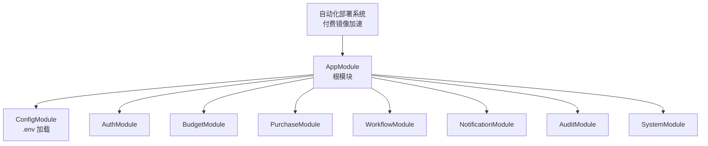

**图表来源**
- [server/src/app.module.ts:22-47](file://server/src/app.module.ts#L22-L47)
- [deploy.sh:253-284](file://deploy.sh#L253-L284)

**章节来源**
- [server/src/app.module.ts:22-47](file://server/src/app.module.ts#L22-L47)
- [deploy.sh:1-284](file://deploy.sh#L1-L284)

## 详细组件分析

### 付费Docker镜像服务集成
**新增** 企业级的付费Docker镜像服务集成，提供稳定高效的镜像拉取体验：

- **镜像加速配置**：通过docker.xuanyuan.run提供镜像加速，显著提升部署速度
- **多源克隆支持**：支持GitHub、付费镜像源和代理源的多级克隆机制
- **智能镜像拉取**：预拉取基础镜像，支持镜像加速策略
- **配置管理**：动态生成Docker daemon.json配置，支持日志轮转

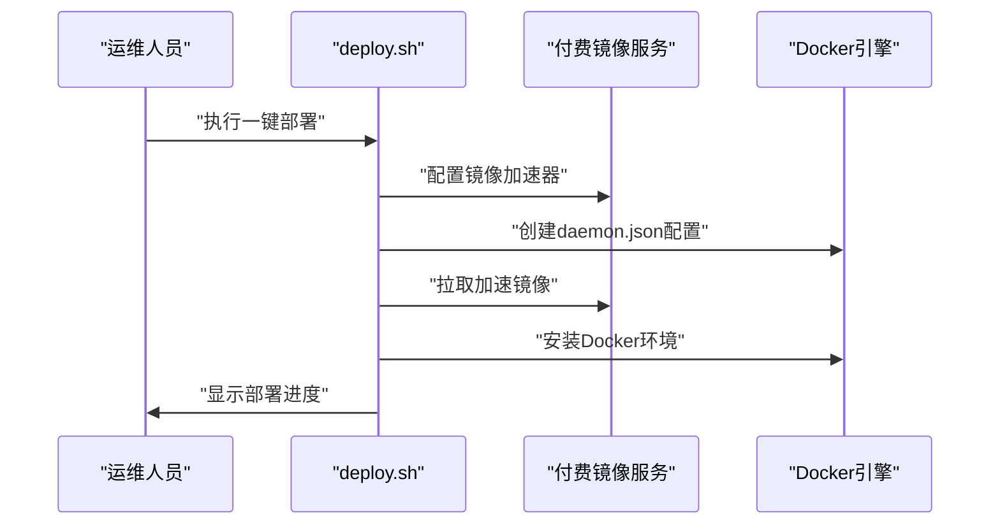

**图表来源**
- [deploy.sh:67-82](file://deploy.sh#L67-L82)
- [deploy.sh:92-112](file://deploy.sh#L92-L112)
- [deploy.sh:190-202](file://deploy.sh#L190-L202)

**章节来源**
- [deploy.sh:33-34](file://deploy.sh#L33-L34)
- [deploy.sh:67-82](file://deploy.sh#L67-L82)
- [deploy.sh:92-112](file://deploy.sh#L92-L112)
- [deploy.sh:190-202](file://deploy.sh#L190-L202)

### 增强的安全配置系统
**新增** 改进的安全配置系统，提供企业级的安全保障：

- **高强度密钥生成**：使用OpenSSL生成32字节十六进制密钥
- **随机密码策略**：PostgreSQL使用24字符随机密码，Redis使用16字符随机密码
- **权限控制**：.env文件设置600权限，确保文件安全
- **安全提示**：部署完成后显示重要安全信息

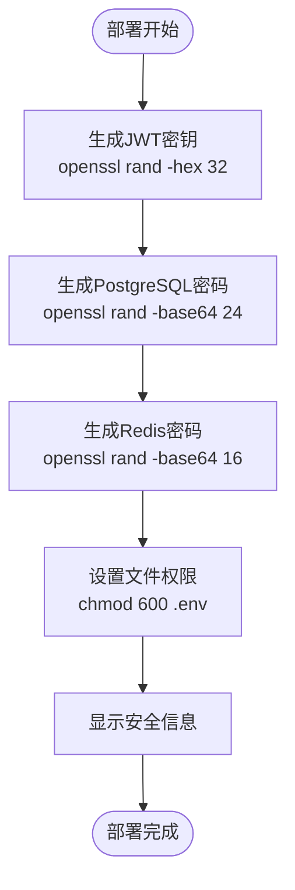

**图表来源**
- [deploy.sh:154-167](file://deploy.sh#L154-L167)
- [deploy.sh:170-178](file://deploy.sh#L170-L178)

**章节来源**
- [deploy.sh:154-167](file://deploy.sh#L154-L167)
- [deploy.sh:170-178](file://deploy.sh#L170-L178)

### 智能网络连接处理机制
**新增** 多层级网络连接处理机制，确保容器间通信的可靠性：

- **网络隔离**：使用自定义bridge网络budget_network隔离服务
- **健康检查**：每个服务都配置了健康检查机制
- **依赖管理**：使用depends_on确保服务启动顺序
- **故障转移**：支持服务重启和故障恢复

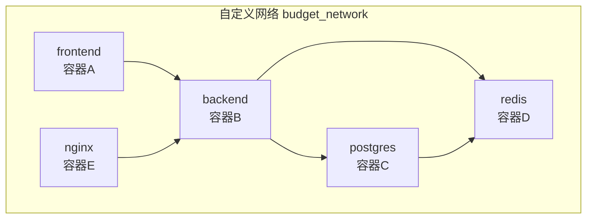

**图表来源**
- [docker-compose.prod.yml:78-81](file://docker-compose.prod.yml#L78-L81)
- [docker-compose.prod.yml:27-31](file://docker-compose.prod.yml#L27-L31)
- [docker-compose.prod.yml:44-56](file://docker-compose.prod.yml#L44-L56)

**章节来源**
- [docker-compose.prod.yml:78-81](file://docker-compose.prod.yml#L78-L81)
- [docker-compose.prod.yml:27-31](file://docker-compose.prod.yml#L27-L31)
- [docker-compose.prod.yml:44-56](file://docker-compose.prod.yml#L44-L56)

### 完善的数据库初始化程序
**新增** 增强的数据库初始化程序，提供更可靠的数据库管理：

- **健康检查机制**：循环检查数据库就绪状态，最多30次尝试
- **超时处理**：每次等待2秒，避免长时间阻塞
- **状态反馈**：提供详细的初始化进度信息
- **错误恢复**：支持数据库启动失败时的错误处理

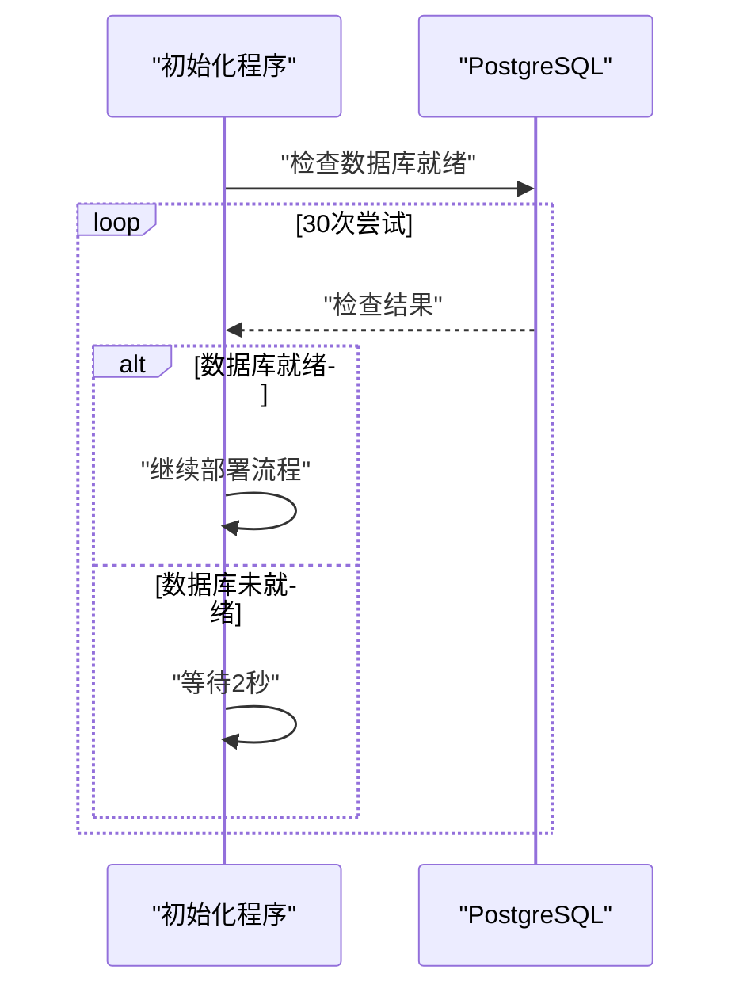

**图表来源**
- [deploy.sh:214-222](file://deploy.sh#L214-L222)

**章节来源**
- [deploy.sh:214-222](file://deploy.sh#L214-L222)

### 前端容器化部署
- 多阶段构建：第一阶段使用Node.js 20 Alpine构建React应用，第二阶段使用Nginx Alpine提供静态资源服务。
- 构建优化：使用npm ci安装依赖，构建生产版本，复制到Nginx html目录。
- 运行时配置：暴露80端口，使用nginx -g "daemon off;"常驻进程。

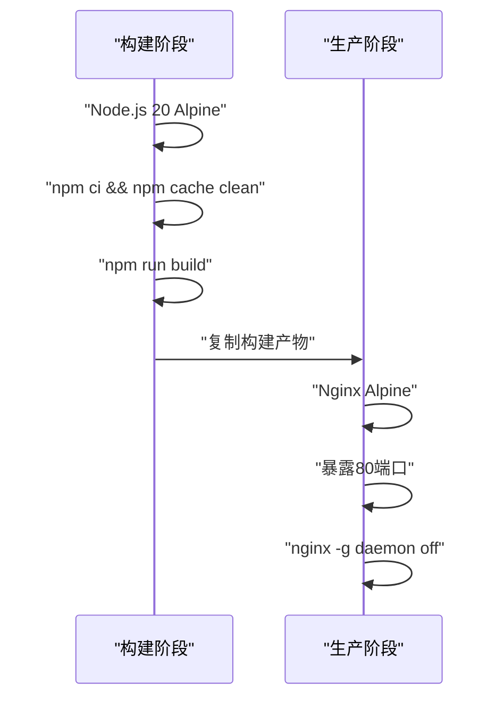

**图表来源**
- [Dockerfile.frontend:2-29](file://Dockerfile.frontend#L2-L29)

**章节来源**
- [Dockerfile.frontend:1-30](file://Dockerfile.frontend#L1-L30)

### 后端容器化部署
- 多阶段构建：第一阶段生成Prisma客户端和构建应用，第二阶段安装运行时依赖。
- 健康检查：使用HTTP GET请求检查/health端点，配置重试机制。
- 运行时优化：安装openssl，使用npm ci --only=production安装生产依赖。

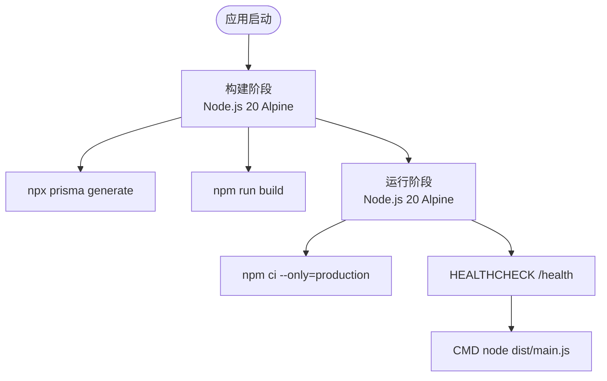

**图表来源**
- [server/Dockerfile:15-48](file://server/Dockerfile#L15-L48)

**章节来源**
- [server/Dockerfile:1-49](file://server/Dockerfile#L1-L49)

### 生产环境编排配置
- 服务编排：frontend、backend、postgres、redis、nginx五个服务。
- 网络配置：所有服务都在budget_network桥接网络中通信。
- 环境变量：使用环境变量文件管理敏感信息，支持JWT_SECRET、POSTGRES_PASSWORD、REDIS_PASSWORD。
- 数据持久化：PostgreSQL和Redis使用独立卷进行数据持久化。

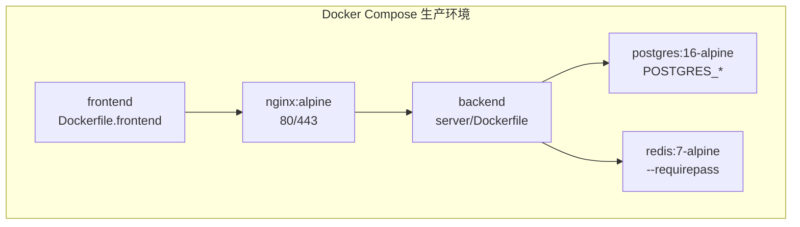

**图表来源**
- [docker-compose.prod.yml:4-72](file://docker-compose.prod.yml#L4-L72)

**章节来源**
- [docker-compose.prod.yml:1-81](file://docker-compose.prod.yml#L1-81)

### Nginx反向代理配置
- 静态资源服务：前端静态文件通过Nginx提供，支持SPA路由。
- API代理：/api路径代理到后端服务，支持WebSocket升级。
- Swagger文档：/swagger路径直接代理到后端Swagger文档。
- 安全配置：设置X-Real-IP、X-Forwarded-For、X-Forwarded-Proto头部。

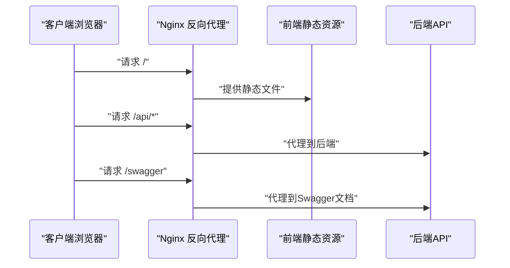

**图表来源**
- [nginx.conf:7-24](file://nginx.conf#L7-L24)

**章节来源**
- [nginx.conf:1-36](file://nginx.conf#L1-L36)

### Windows快速启动脚本
- 环境检查：自动检测Docker安装状态。
- 服务启动：按顺序启动PostgreSQL和Redis，等待服务启动。
- 数据初始化：执行Prisma迁移和种子数据导入。
- 开发启动：启动后端开发服务器和前端开发服务器。

**章节来源**
- [start.ps1:1-54](file://start.ps1#L1-L54)

### 后端启动与配置
- CORS：允许来自前端域名的跨域请求，并支持凭据。
- 全局前缀：统一为 /api。
- 全局验证管道：白名单过滤、非白名单禁止、自动类型转换。
- Swagger：生成 API 文档并通过 /api/docs 访问。
- 端口：默认从环境变量读取，未设置则使用 3000/3001。

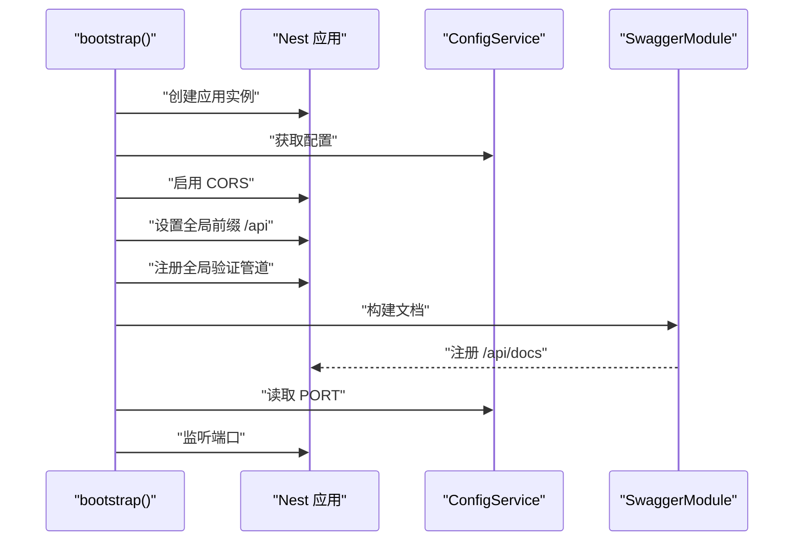

**图表来源**
- [server/src/main.ts:9-56](file://server/src/main.ts#L9-L56)

**章节来源**
- [server/src/main.ts:1-59](file://server/src/main.ts#L1-L59)

### 配置模块与环境变量
- ConfigModule.forRoot：全局加载 .env 文件。
- 数据库配置：database.url 默认从 DATABASE_URL 读取。
- JWT 配置：secret、expiresIn、refreshExpiresIn 支持环境变量覆盖。

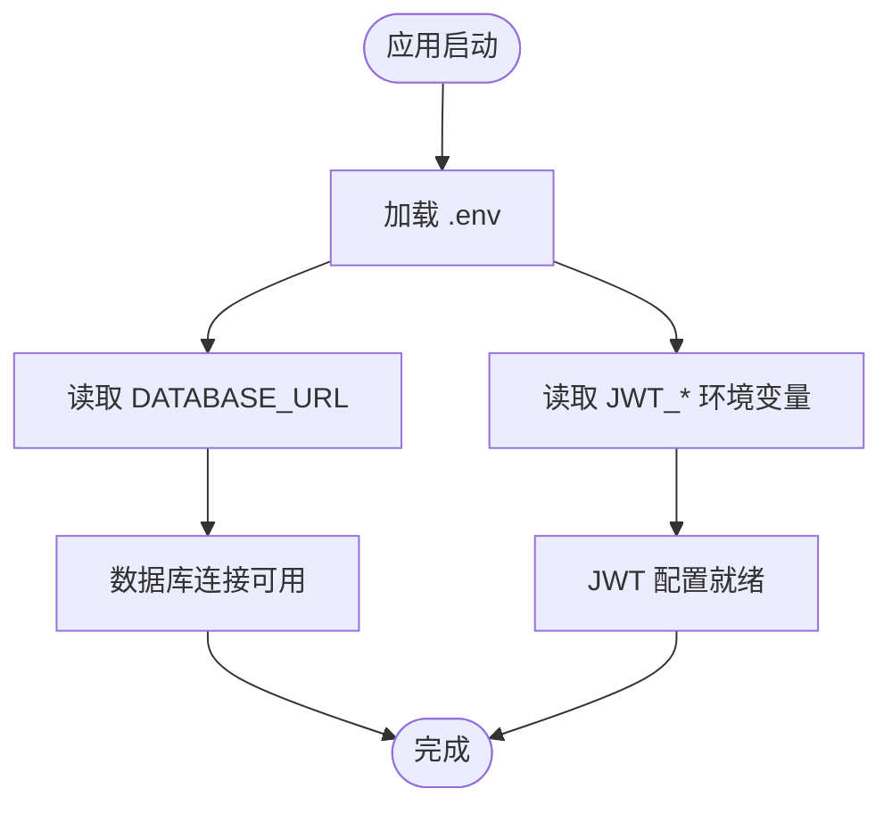

**图表来源**
- [server/src/config/database.config.ts:3-5](file://server/src/config/database.config.ts#L3-L5)
- [server/src/config/jwt.config.ts:3-7](file://server/src/config/jwt.config.ts#L3-L7)

**章节来源**
- [server/src/config/database.config.ts:1-6](file://server/src/config/database.config.ts#L1-L6)
- [server/src/config/jwt.config.ts:1-8](file://server/src/config/jwt.config.ts#L1-L8)

### 数据模型与数据库
- 数据源：PostgreSQL，Prisma 生成客户端。
- 实体覆盖：用户与权限、组织结构、预算管理、采购管理、工作流与审批、数据导入映射、通知系统、审计日志、附件管理。
- 枚举：用户状态、部门状态、预算类型/状态、调整状态、采购状态、紧急度、审批状态/动作、匹配状态、通知类型等。

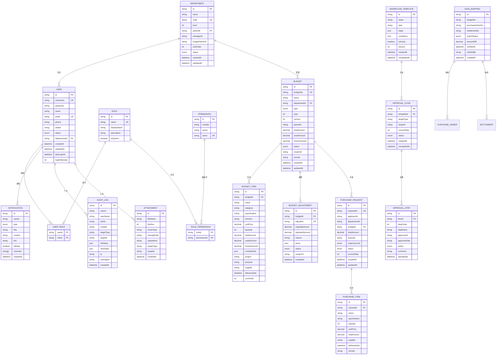

**图表来源**
- [server/src/prisma/schema.prisma:15-448](file://server/src/prisma/schema.prisma#L15-L448)

**章节来源**
- [server/src/prisma/schema.prisma:15-448](file://server/src/prisma/schema.prisma#L15-L448)

### 基础设施编排与服务发现
- PostgreSQL：16 版本，健康检查、持久化卷。
- Redis：7 版本，健康检查、持久化卷。
- Nginx：反向代理，提供静态资源和API代理服务。
- 服务间通信：前端通过Nginx访问后端；后端通过 DATABASE_URL 连接数据库；通过 Redis 缓存。

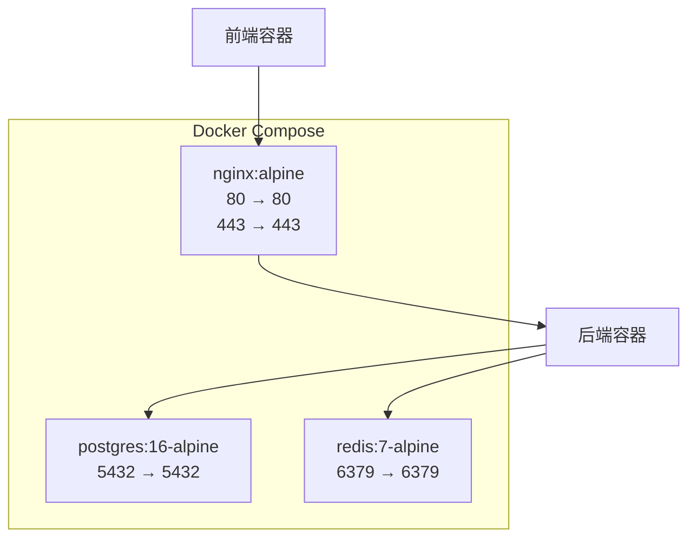

**图表来源**
- [docker-compose.prod.yml:33-72](file://docker-compose.prod.yml#L33-L72)

**章节来源**
- [docker-compose.prod.yml:1-81](file://docker-compose.prod.yml#L1-81)

### 前端代理与端口
- 前端 Vite 代理将 /api 请求转发到后端，默认目标为 http://localhost:3001。
- 生产环境通过Nginx反向代理提供静态资源和API服务。
- 建议在生产环境中将代理目标指向实际后端域名或负载均衡器。

**章节来源**
- [vite.config.ts:15-23](file://vite.config.ts#L15-L23)

### 自动化运维脚本系统
**新增** 完整的运维脚本系统，提供企业级的自动化运维能力：

- **数据库备份脚本（backup.sh）**：自动创建备份目录、执行数据库备份、压缩备份文件、清理过期备份
- **日志监控脚本（logs.sh）**：支持查看所有服务日志和特定服务日志，提供灵活的日志监控能力
- **服务重启脚本（restart.sh）**：一键重启所有服务，自动检查服务状态
- **部署指南文档**：提供详细的手动部署步骤和企业级部署建议
- **快速开始文档**：3分钟快速部署指南，适合快速验证环境

**章节来源**
- [backup.sh:1-28](file://backup.sh#L1-L28)
- [logs.sh:1-36](file://logs.sh#L1-L36)
- [restart.sh:1-24](file://restart.sh#L1-L24)
- [DEPLOYMENT_GUIDE.md:116-170](file://DEPLOYMENT_GUIDE.md#L116-L170)
- [QUICK_START.md:58-80](file://QUICK_START.md#L58-L80)

## 依赖关系分析
- 后端依赖：NestJS 核心、Config、Swagger、WebSockets、Prisma、Passport、BullMQ、ioredis、Nodemailer、ExcelJS、MinIO。
- 前端依赖：React、Ant Design、Axios、React Router、Recharts、Zustand 等。
- 测试：Jest 配置位于后端 package.json 中，支持单元测试与覆盖率统计。
- **新增**：付费镜像服务依赖docker.xuanyuan.run，提供镜像加速和稳定的服务质量。

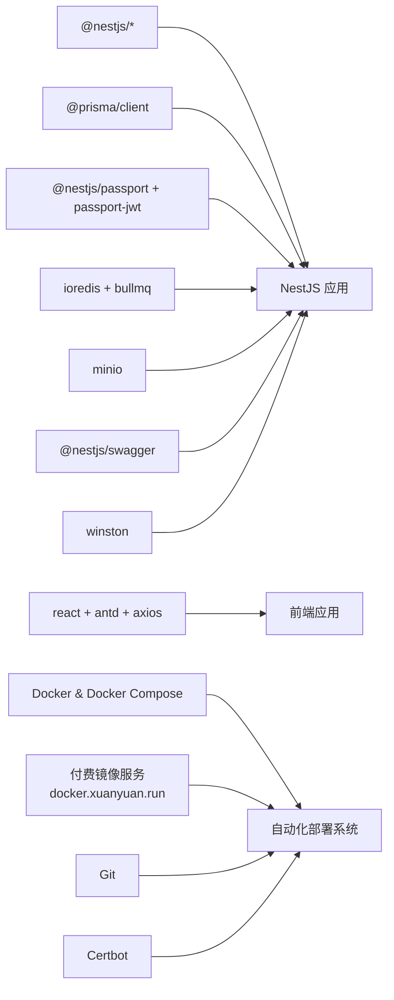

**图表来源**
- [server/package.json:26-51](file://server/package.json#L26-L51)
- [package.json:12-33](file://package.json#L12-L33)
- [deploy.sh:106-114](file://deploy.sh#L106-L114)
- [deploy.sh:33](file://deploy.sh#L33)

**章节来源**
- [server/package.json:1-99](file://server/package.json#L1-L99)
- [package.json:1-45](file://package.json#L1-L45)
- [deploy.sh:1-284](file://deploy.sh#L1-L284)

## 性能考虑
- 数据库层
  - 使用索引优化高频查询字段（如用户、部门、预算、采购、审计日志等的多维索引）。
  - 合理分页与排序参数，避免一次性返回大量数据。
  - 连接池与只读副本（如需）用于高并发场景。
- 缓存层
  - 利用 Redis 缓存热点数据与会话信息，降低数据库压力。
  - 对频繁变更的数据设置合理过期时间。
- 对象存储
  - 使用 MinIO 作为 S3 兼容存储，注意分片上传与断点续传策略。
- API 层
  - 启用全局验证管道减少脏数据进入业务逻辑。
  - 使用 Swagger 文档辅助压测与回归验证。
- 前端
  - 按需加载与懒加载组件，减少首屏体积。
  - 图表与表格组件使用虚拟化渲染处理大数据集。
- 容器化优化
  - 多阶段构建减少镜像大小。
  - 健康检查确保服务可用性。
  - Nginx反向代理提升静态资源加载性能。
- **新增**：付费镜像服务优化
  - 使用docker.xuanyuan.run镜像加速，显著提升部署速度
  - 智能镜像拉取策略，支持多源备份
  - 增强的网络连接处理机制，提高服务稳定性

**章节来源**
- [Dockerfile.frontend:18-29](file://Dockerfile.frontend#L18-L29)
- [server/Dockerfile:43-48](file://server/Dockerfile#L43-L48)
- [nginx.conf:14-24](file://nginx.conf#L14-L24)
- [deploy.sh:16-48](file://deploy.sh#L16-L48)
- [deploy.sh:33](file://deploy.sh#L33)

## 故障排除指南
- 启动失败
  - 检查 .env 是否正确配置 DATABASE_URL、JWT_SECRET 等关键变量。
  - 确认 PostgreSQL、Redis、Nginx 容器已健康运行且端口未被占用。
- API 无法访问
  - 确认后端监听端口与防火墙放行。
  - 检查 CORS 配置是否允许前端域名。
  - 验证Nginx反向代理配置是否正确。
- 数据库迁移问题
  - 使用 Prisma 命令生成客户端与执行迁移，确保 schema.prisma 最新。
- 日志与监控
  - 后端使用 winston 输出日志，建议接入集中式日志系统（如 ELK/Fluentd）。
  - 结合 Swagger 文档定位接口异常，记录请求与响应上下文。
- 性能问题
  - 使用慢查询日志与数据库分析工具定位瓶颈。
  - 检查 Redis 缓存命中率与内存使用情况。
  - 监控Nginx访问日志分析静态资源加载性能。
- **新增**：付费镜像服务故障排除
  - 检查docker.xuanyuan.run服务可用性
  - 验证镜像加速配置是否正确
  - 确认网络连接和DNS解析
  - 使用运维脚本进行故障诊断和恢复

**章节来源**
- [server/src/main.ts:14-19](file://server/src/main.ts#L14-L19)
- [server/src/config/database.config.ts:3-5](file://server/src/config/database.config.ts#L3-L5)
- [server/src/config/jwt.config.ts:3-7](file://server/src/config/jwt.config.ts#L3-L7)
- [docker-compose.prod.yml:33-72](file://docker-compose.prod.yml#L33-L72)
- [nginx.conf:14-24](file://nginx.conf#L14-L24)
- [deploy.sh:42-48](file://deploy.sh#L42-L48)
- [logs.sh:12-35](file://logs.sh#L12-L35)

## 结论
本部署运维文档基于现有代码与配置，给出了生产环境的准备清单、容器化编排、配置要点、监控与日志、数据库策略、安全加固与故障排除流程。**新增的付费Docker镜像服务集成**提供了企业级的自动化部署和运维能力，包括一键部署脚本、运维脚本集合、企业级部署指南和快速开始文档。这些工具显著简化了生产环境的部署和维护工作，提高了部署效率和可靠性。建议在上线前完善 CI/CD 流水线、密钥管理与备份演练，持续优化性能与可观测性。

## 附录

### 生产环境部署流程
- 环境准备
  - 准备 Linux 服务器，安装 Docker 与 Docker Compose。
  - 准备域名与反向代理（Nginx/Traefik），开启 HTTPS。
- 依赖安装
  - 在服务器上克隆仓库，安装后端与前端依赖。
- 配置文件设置
  - 复制 .env.example 为 .env，填写 DATABASE_URL、JWT_SECRET、CORS_ORIGIN、端口等。
- 启动基础设施
  - 使用 docker-compose 启动 PostgreSQL、Redis、Nginx。
- 数据库迁移
  - 执行 Prisma 命令生成客户端与迁移，必要时导入种子数据。
- 启动后端与前端
  - 后端：使用 npm run start:prod 启动生产服务。
  - 前端：构建静态资源并部署至 Nginx 或 CDN。
- 验证
  - 访问 /api/docs 检查接口文档，调用登录接口验证鉴权链路。

**章节来源**
- [docker-compose.prod.yml:1-81](file://docker-compose.prod.yml#L1-81)
- [server/src/config/database.config.ts:3-5](file://server/src/config/database.config.ts#L3-L5)
- [server/src/config/jwt.config.ts:3-7](file://server/src/config/jwt.config.ts#L3-L7)

### 付费镜像服务集成部署
**新增** 企业级的付费镜像服务集成，提供稳定高效的部署体验：

- **镜像加速**：通过docker.xuanyuan.run提供镜像加速，显著提升部署速度
- **多源克隆**：支持GitHub、付费镜像源和代理源的多级克隆机制
- **智能配置**：自动配置Docker daemon.json，支持日志轮转和镜像加速
- **安全密钥**：使用OpenSSL生成高强度随机密钥，确保系统安全
- **健康检查**：完善的数据库初始化和健康检查机制

**章节来源**
- [deploy.sh:1-284](file://deploy.sh#L1-L284)
- [DEPLOYMENT_GUIDE.md:1-383](file://DEPLOYMENT_GUIDE.md#L1-L383)
- [QUICK_START.md:1-106](file://QUICK_START.md#L1-L106)

### Docker 容ainer化与编排
- 使用 docker-compose.prod.yml 启动完整的生产环境。
- 前端使用Dockerfile.frontend构建，后端使用server/Dockerfile构建。
- 健康检查确保服务可用性。
- 持久化卷用于数据持久化。

**章节来源**
- [docker-compose.prod.yml:1-81](file://docker-compose.prod.yml#L1-81)
- [Dockerfile.frontend:1-30](file://Dockerfile.frontend#L1-L30)
- [server/Dockerfile:1-49](file://server/Dockerfile#L1-L49)

### CI/CD 流水线建议
- 触发条件：push 到主分支或创建标签。
- 步骤建议：
  - 安装依赖（后端与前端）。
  - 运行 Lint 与单元测试。
  - 构建后端（NestJS）与前端（Vite）产物。
  - 执行数据库迁移（Prisma）。
  - 构建镜像并推送至私有仓库。
  - 部署至预生产环境并执行 E2E 测试。
  - 发布至生产环境（滚动更新或蓝绿部署）。
- 注意事项：
  - 使用环境变量文件管理敏感信息。
  - 将 .env 与密钥纳入安全管控。

**章节来源**
- [server/package.json:78-94](file://server/package.json#L78-L94)
- [package.json:6-11](file://package.json#L6-L11)

### 性能监控与日志管理
- 应用监控：集成 APM（如自建 Prometheus + Grafana）采集后端指标。
- 错误追踪：接入错误上报（如 Sentry），记录堆栈与上下文。
- 性能分析：对慢查询、Redis 命中率、对象存储上传耗时进行专项分析。
- 日志管理：统一输出结构化日志，接入集中式日志平台。
- 容器监控：使用Docker日志驱动收集容器日志。
- **新增**：自动化监控脚本：使用logs.sh脚本进行实时日志监控和分析。

**章节来源**
- [server/package.json:45](file://server/package.json#L45)
- [logs.sh:1-36](file://logs.sh#L1-L36)

### 数据库备份与恢复
- 备份策略
  - PostgreSQL：定期逻辑备份（pg_dump）与物理备份（文件系统快照）。
  - Redis：RDB/AOF 持久化与周期性备份。
  - Nginx：静态资源备份，验证恢复路径。
- 恢复策略
  - 制定 RTO/RPO 目标，演练恢复流程。
  - 在隔离环境验证备份完整性。
- 数据迁移与版本升级
  - 使用 Prisma 迁移管理数据库演进，先在预生产验证再上线。
  - 对大表操作采用分批与索引优化策略。
- **新增**：自动化备份脚本：使用backup.sh脚本实现自动备份、压缩和清理。

**章节来源**
- [server/src/prisma/schema.prisma:1-11](file://server/src/prisma/schema.prisma#L1-L11)
- [docker-compose.prod.yml:33-72](file://docker-compose.prod.yml#L33-L72)
- [backup.sh:1-28](file://backup.sh#L1-L28)

### 安全加固
- 防火墙：仅开放反向代理端口，内网访问数据库与缓存。
- SSL 证书：通过反向代理启用 HTTPS，定期续期。
- 访问控制：JWT 令牌管理、刷新令牌策略、接口限流与黑名单。
- 密钥管理：使用环境变量或密钥管理服务（如 Vault），不将密钥提交到仓库。
- 审计与合规：启用审计日志，记录关键操作与异常行为。
- 容器安全：使用非root用户运行容器，限制容器权限。
- **新增**：付费镜像服务安全配置：通过docker.xuanyuan.run提供稳定的服务质量和安全保证。

**章节来源**
- [server/src/config/jwt.config.ts:3-7](file://server/src/config/jwt.config.ts#L3-L7)
- [server/src/prisma/schema.prisma:334-351](file://server/src/prisma/schema.prisma#L334-L351)
- [deploy.sh:71-85](file://deploy.sh#L71-L85)

### 故障排除与应急响应
- 应急响应流程
  - 快速隔离问题（降级、熔断、限流）。
  - 回滚至上一个稳定版本。
  - 查看日志与指标，定位根因。
  - 修复后验证并重新发布。
- 常见问题
  - CORS 失败：检查前端域名与后端 CORS_ORIGIN。
  - 数据库连接失败：确认网络连通与 DATABASE_URL。
  - 代理不通：核对 /api 代理目标与端口。
  - 容器启动失败：检查健康检查配置和环境变量。
- **新增**：付费镜像服务故障诊断
  - 检查docker.xuanyuan.run服务可用性
  - 验证镜像加速配置和网络连接
  - 使用logs.sh脚本进行实时故障诊断
  - 使用restart.sh脚本进行快速服务恢复

**章节来源**
- [server/src/main.ts:14-19](file://server/src/main.ts#L14-L19)
- [server/src/config/database.config.ts:3-5](file://server/src/config/database.config.ts#L3-L5)
- [vite.config.ts:17-21](file://vite.config.ts#L17-L21)
- [docker-compose.prod.yml:43-48](file://docker-compose.prod.yml#L43-L48)
- [deploy.sh:42-48](file://deploy.sh#L42-L48)
- [logs.sh:12-35](file://logs.sh#L12-L35)
- [restart.sh:10-23](file://restart.sh#L10-L23)

### Docker容器化最佳实践
- 多阶段构建：减少最终镜像大小，提高安全性。
- 健康检查：确保服务可用性，支持自动重启。
- 环境变量：使用环境变量文件管理敏感信息。
- 数据持久化：使用Docker卷确保数据不丢失。
- 网络隔离：使用自定义网络隔离服务间通信。
- 日志管理：使用标准输出收集日志，便于集中管理。

**章节来源**
- [Dockerfile.frontend:18-29](file://Dockerfile.frontend#L18-L29)
- [server/Dockerfile:43-48](file://server/Dockerfile#L43-L48)
- [docker-compose.prod.yml:74-81](file://docker-compose.prod.yml#L74-L81)

### 自动化运维脚本使用指南
**新增** 企业级运维脚本使用指南：

- **备份脚本（backup.sh）**：自动备份数据库，支持压缩和清理过期备份
- **日志脚本（logs.sh）**：支持查看所有服务和特定服务的日志
- **重启脚本（restart.sh）**：一键重启所有服务并检查状态
- **部署脚本（deploy.sh）**：完整的一键部署流程，包括环境检查、服务启动、数据库初始化

**章节来源**
- [backup.sh:1-28](file://backup.sh#L1-L28)
- [logs.sh:1-36](file://logs.sh#L1-L36)
- [restart.sh:1-24](file://restart.sh#L1-L24)
- [deploy.sh:1-284](file://deploy.sh#L1-L284)