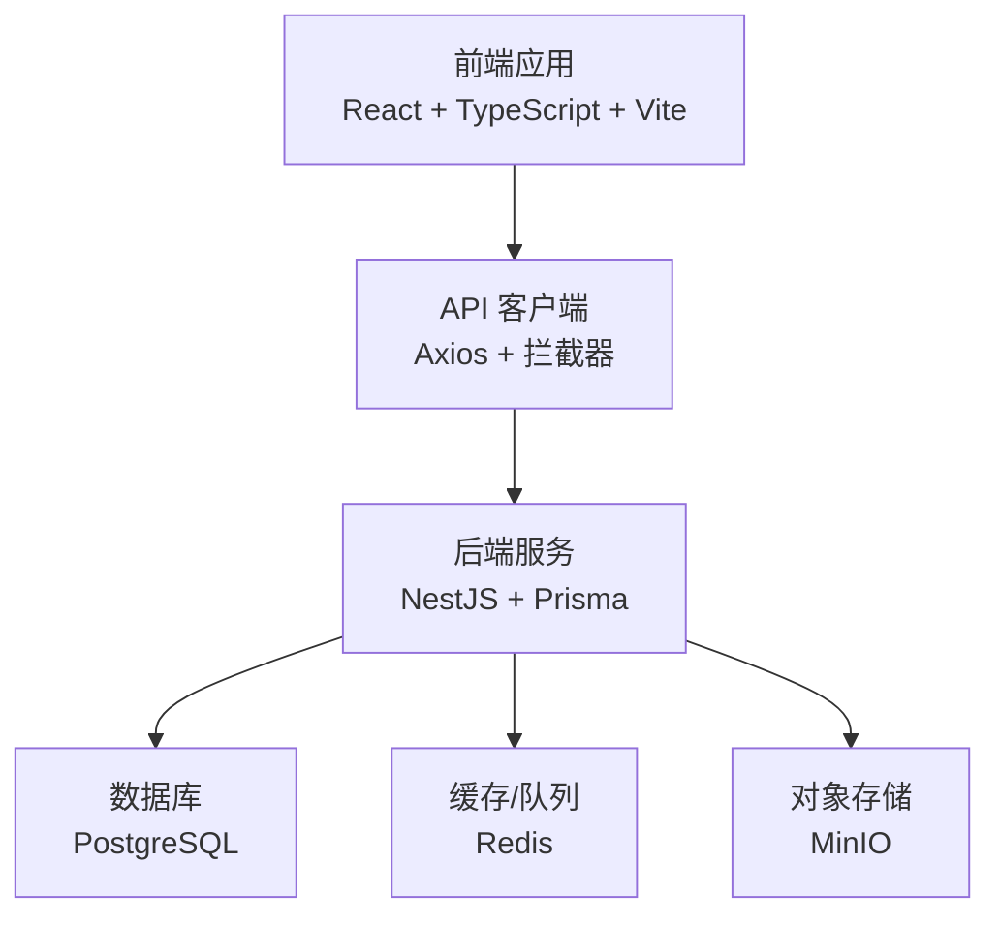
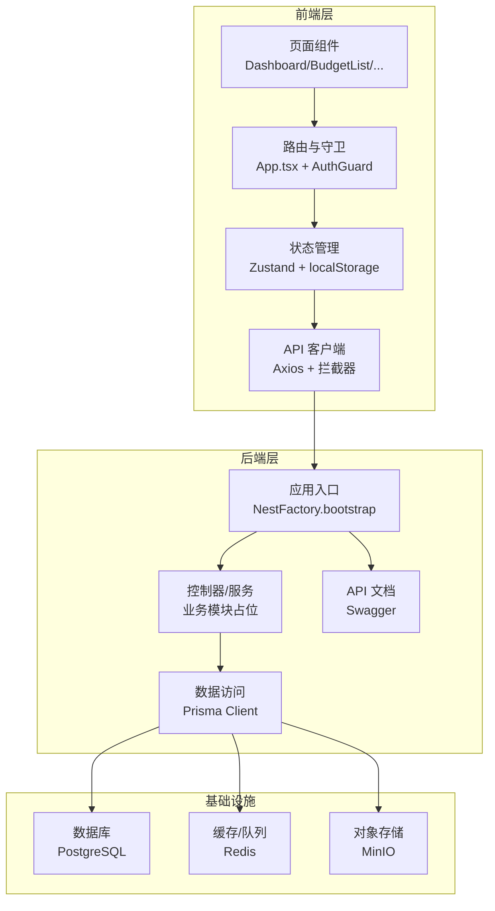
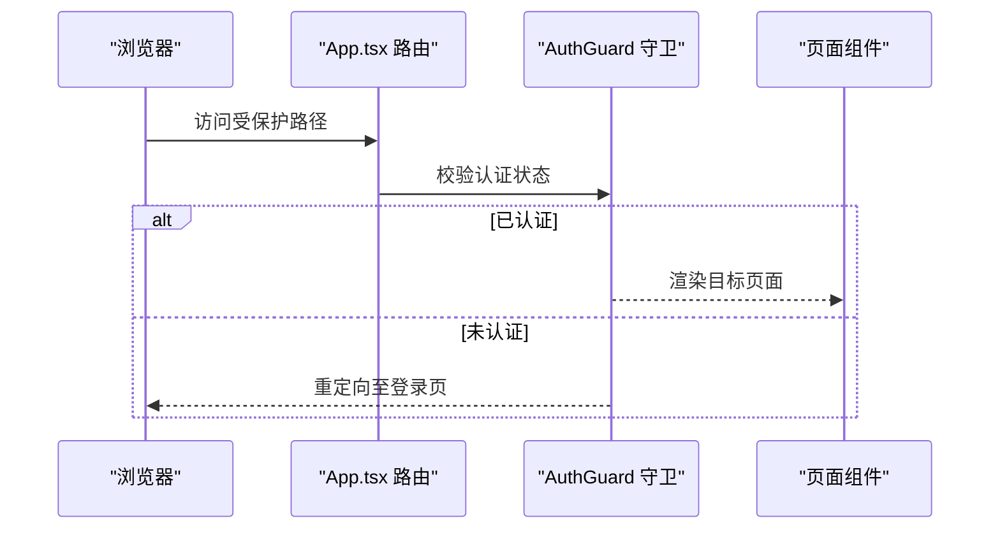
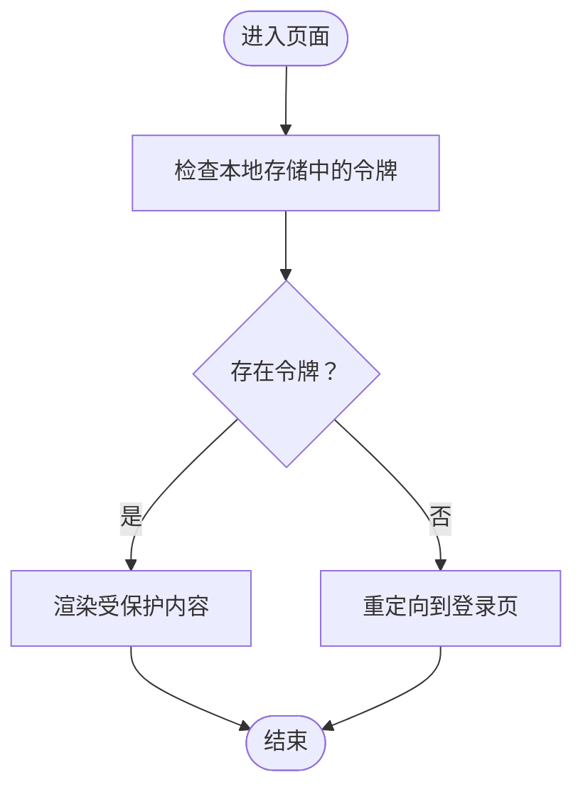
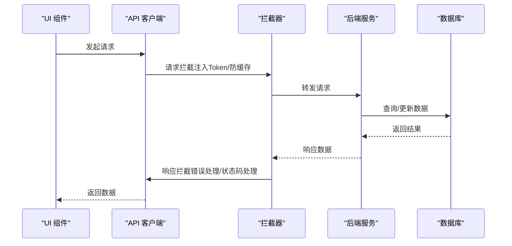
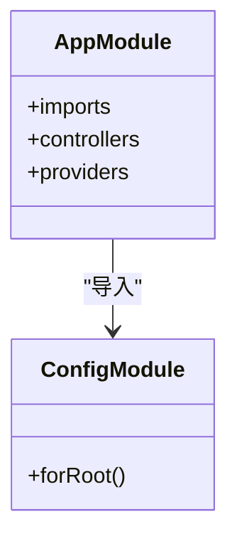
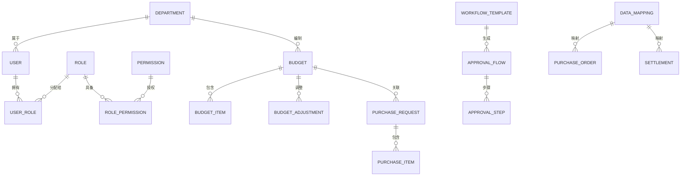

# 项目概述

<cite>
**本文引用的文件**
- [package.json](file://package.json)
- [server/package.json](file://server/package.json)
- [src/App.tsx](file://src/App.tsx)
- [src/router/routes.ts](file://src/router/routes.ts)
- [src/components/Layout.tsx](file://src/components/Layout.tsx)
- [src/components/guard/AuthGuard.tsx](file://src/components/guard/AuthGuard.tsx)
- [src/store/authStore.ts](file://src/store/authStore.ts)
- [src/hooks/useAuth.ts](file://src/hooks/useAuth.ts)
- [src/api/client.ts](file://src/api/client.ts)
- [server/src/main.ts](file://server/src/main.ts)
- [server/src/app.module.ts](file://server/src/app.module.ts)
- [server/src/prisma/schema.prisma](file://server/src/prisma/schema.prisma)
- [vite.config.ts](file://vite.config.ts)
- [server/docker-compose.yml](file://server/docker-compose.yml)
- [FEATURES_GUIDE.md](file://FEATURES_GUIDE.md)
- [IMPLEMENTATION_PROGRESS.md](file://IMPLEMENTATION_PROGRESS.md)
</cite>

## 目录
1. [简介](#简介)
2. [项目结构](#项目结构)
3. [核心组件](#核心组件)
4. [架构总览](#架构总览)
5. [详细组件分析](#详细组件分析)
6. [依赖分析](#依赖分析)
7. [性能考虑](#性能考虑)
8. [故障排查指南](#故障排查指南)
9. [结论](#结论)
10. [附录](#附录)

## 简介
本项目是一个面向半导体研发企业的预算管理系统，旨在实现预算编制、执行监控、审批流程与数据分析的全流程数字化管理。系统采用前后端分离架构，前端基于 React 18 + TypeScript + Vite，后端基于 NestJS + Prisma，结合 PostgreSQL、Redis、MinIO 等基础设施，提供类型安全、模块化、可扩展的企业级解决方案。

系统核心目标：
- 提升预算编制与执行透明度，支持多维度预算与版本管理
- 实现五级审批流程的可视化与可追溯
- 提供预算占用/释放的实时追踪与预警
- 支持数据导入导出与多维分析报表

## 项目结构
项目采用“前端 + 后端 + 基础设施”的分层组织方式，核心目录与职责如下：
- 前端（src/）
  - 应用入口与路由：App.tsx、router/routes.ts
  - 页面与布局：pages/、components/Layout.tsx
  - 状态与守卫：store/authStore.ts、components/guard/
  - API 客户端与认证：api/client.ts、hooks/useAuth.ts
  - 构建与代理：vite.config.ts
- 后端（server/）
  - 应用入口与模块：src/main.ts、src/app.module.ts
  - 数据模型：src/prisma/schema.prisma
  - 基础设施编排：docker-compose.yml
- 文档与进度
  - 功能清单与使用指南：FEATURES_GUIDE.md
  - 实施进度与里程碑：IMPLEMENTATION_PROGRESS.md

**图表来源**
- [src/App.tsx:1-66](file://src/App.tsx#L1-L66)
- [src/api/client.ts:1-183](file://src/api/client.ts#L1-L183)
- [server/src/main.ts:1-51](file://server/src/main.ts#L1-L51)
- [server/src/prisma/schema.prisma:1-448](file://server/src/prisma/schema.prisma#L1-L448)
- [server/docker-compose.yml:1-59](file://server/docker-compose.yml#L1-L59)

**章节来源**
- [src/App.tsx:1-66](file://src/App.tsx#L1-L66)
- [src/router/routes.ts:1-122](file://src/router/routes.ts#L1-L122)
- [vite.config.ts:1-24](file://vite.config.ts#L1-L24)
- [server/src/app.module.ts:1-52](file://server/src/app.module.ts#L1-L52)

## 核心组件
- 路由与页面
  - App.tsx 定义全局路由与私有路由包装，确保登录态保护
  - routes.ts 提供页面懒加载与权限标记，支持按需加载
- 布局与导航
  - Layout.tsx 提供侧边栏导航、顶部栏与用户信息展示
- 认证与权限
  - AuthGuard.tsx 提供页面级认证守卫
  - useAuth.ts 提供登录、登出、修改密码、获取用户信息等 Hook
  - authStore.ts 使用 Zustand 管理用户状态与持久化
- API 客户端
  - client.ts 封装 Axios 实例，统一请求/响应拦截、错误处理与文件上传下载
- 后端入口
  - main.ts 配置 CORS、全局验证管道、Swagger 文档与全局前缀
  - app.module.ts 作为根模块占位，预留业务模块与公共模块挂载点

**章节来源**
- [src/App.tsx:1-66](file://src/App.tsx#L1-L66)
- [src/router/routes.ts:1-122](file://src/router/routes.ts#L1-L122)
- [src/components/Layout.tsx:1-99](file://src/components/Layout.tsx#L1-L99)
- [src/components/guard/AuthGuard.tsx:1-31](file://src/components/guard/AuthGuard.tsx#L1-L31)
- [src/hooks/useAuth.ts:1-84](file://src/hooks/useAuth.ts#L1-L84)
- [src/store/authStore.ts:1-31](file://src/store/authStore.ts#L1-L31)
- [src/api/client.ts:1-183](file://src/api/client.ts#L1-L183)
- [server/src/main.ts:1-51](file://server/src/main.ts#L1-L51)
- [server/src/app.module.ts:1-52](file://server/src/app.module.ts#L1-L52)

## 架构总览
系统采用前后端分离与模块化设计，数据流以“前端页面 -> API 客户端 -> 后端控制器 -> 数据库”为主线，并辅以缓存与对象存储支撑高并发与大文件场景。

**图表来源**
- [src/App.tsx:1-66](file://src/App.tsx#L1-L66)
- [src/components/guard/AuthGuard.tsx:1-31](file://src/components/guard/AuthGuard.tsx#L1-L31)
- [src/store/authStore.ts:1-31](file://src/store/authStore.ts#L1-L31)
- [src/api/client.ts:1-183](file://src/api/client.ts#L1-L183)
- [server/src/main.ts:1-51](file://server/src/main.ts#L1-L51)
- [server/src/prisma/schema.prisma:1-448](file://server/src/prisma/schema.prisma#L1-L448)
- [server/docker-compose.yml:1-59](file://server/docker-compose.yml#L1-L59)

## 详细组件分析

### 前端路由与页面组件
- App.tsx
  - 使用 React Router DOM 管理路由，通过私有路由包装确保受保护页面的访问控制
  - 路由覆盖仪表盘、预算、采购、审批、分析、设置等核心模块
- routes.ts
  - 采用懒加载策略，按需加载页面组件，降低首屏体积
  - 为每个路由标注是否需要认证，配合守卫组件实现细粒度权限控制

**图表来源**
- [src/App.tsx:24-27](file://src/App.tsx#L24-L27)
- [src/components/guard/AuthGuard.tsx:13-30](file://src/components/guard/AuthGuard.tsx#L13-L30)

**章节来源**
- [src/App.tsx:1-66](file://src/App.tsx#L1-L66)
- [src/router/routes.ts:1-122](file://src/router/routes.ts#L1-L122)
- [src/components/guard/AuthGuard.tsx:1-31](file://src/components/guard/AuthGuard.tsx#L1-L31)

### 布局与导航
- Layout.tsx
  - 提供移动端友好的侧边栏导航，包含部门管理、预算管理、采购申请、审批中心、分析、设置等入口
  - 集成用户信息展示与登出逻辑，统一顶部标题与面包屑风格

**章节来源**
- [src/components/Layout.tsx:1-99](file://src/components/Layout.tsx#L1-L99)

### 认证与权限
- useAuth.ts
  - 封装登录、登出、修改密码、获取当前用户信息等方法，统一与后端 API 交互
- authStore.ts
  - 使用 Zustand 管理用户状态与持久化，避免刷新丢失
- AuthGuard.tsx
  - 基于本地存储令牌判断登录态，实现页面级访问控制

**图表来源**
- [src/hooks/useAuth.ts:12-21](file://src/hooks/useAuth.ts#L12-L21)
- [src/store/authStore.ts:19-31](file://src/store/authStore.ts#L19-L31)
- [src/components/guard/AuthGuard.tsx:17-27](file://src/components/guard/AuthGuard.tsx#L17-L27)

**章节来源**
- [src/hooks/useAuth.ts:1-84](file://src/hooks/useAuth.ts#L1-L84)
- [src/store/authStore.ts:1-31](file://src/store/authStore.ts#L1-L31)
- [src/components/guard/AuthGuard.tsx:1-31](file://src/components/guard/AuthGuard.tsx#L1-L31)

### API 客户端与数据流
- client.ts
  - 创建 Axios 实例，统一设置基础 URL、超时、请求头
  - 请求拦截器：自动注入 Bearer Token，GET 请求附加时间戳防缓存
  - 响应拦截器：集中处理 401/403/404/5xx 等错误码，必要时清除本地令牌并跳转登录
  - 提供 get/post/put/del/download/upload 等封装方法

**图表来源**
- [src/api/client.ts:12-96](file://src/api/client.ts#L12-L96)
- [src/api/client.ts:105-180](file://src/api/client.ts#L105-L180)
- [server/src/main.ts:14-40](file://server/src/main.ts#L14-L40)

**章节来源**
- [src/api/client.ts:1-183](file://src/api/client.ts#L1-L183)

### 后端入口与模块化
- main.ts
  - 启用 CORS，设置全局前缀与全局验证管道
  - 集成 Swagger 文档，暴露 API 文档端点
  - 读取配置启动服务，默认端口 3000
- app.module.ts
  - ConfigModule 全局启用，支持 .env 环境变量
  - 模块占位，预留 Auth/User/Department/Budget/Purchase/Workflow/Approval/Notification/Report/ImportExport/Audit/System 等模块挂载点

**图表来源**
- [server/src/app.module.ts:22-51](file://server/src/app.module.ts#L22-L51)
- [server/src/main.ts:7-48](file://server/src/main.ts#L7-L48)

**章节来源**
- [server/src/main.ts:1-51](file://server/src/main.ts#L1-L51)
- [server/src/app.module.ts:1-52](file://server/src/app.module.ts#L1-L52)

### 数据模型与数据库设计
- schema.prisma
  - 用户与权限：User、Role、Permission、UserRole、RolePermission
  - 组织结构：Department（树形结构、父子关系）
  - 预算管理：Budget、BudgetItem、BudgetAdjustment
  - 采购管理：PurchaseRequest、PurchaseItem
  - 工作流与审批：WorkflowTemplate、ApprovalFlow、ApprovalStep
  - 数据导入与三单关联：PurchaseOrder、Settlement、DataMapping
  - 通知系统：Notification
  - 审计日志：AuditLog
  - 附件管理：Attachment
  - 定义了丰富的枚举类型（状态、类型、动作等）

**图表来源**
- [server/src/prisma/schema.prisma:15-448](file://server/src/prisma/schema.prisma#L15-L448)

**章节来源**
- [server/src/prisma/schema.prisma:1-448](file://server/src/prisma/schema.prisma#L1-L448)

### 基础设施与部署
- docker-compose.yml
  - PostgreSQL 16（主数据库）、Redis 7（缓存/队列）、MinIO（对象存储）
  - 提供健康检查与持久化卷
- vite.config.ts
  - 代理 /api 到后端服务（默认 3001），开发环境端口 5173
  - 路径别名 @ 指向 src，提升导入便捷性

**章节来源**
- [server/docker-compose.yml:1-59](file://server/docker-compose.yml#L1-L59)
- [vite.config.ts:1-24](file://vite.config.ts#L1-L24)

## 依赖分析
- 前端依赖
  - React 18 + TypeScript：提供类型安全与组件化开发体验
  - Ant Design + Lucide React：企业级 UI 与图标库
  - Axios + @tanstack/react-query：HTTP 客户端与数据请求管理
  - Recharts + ECharts：可视化图表
  - Zustand + react-router-dom：状态管理与路由
  - ExcelJS + xlsx + file-saver：Excel 文件处理
- 后端依赖
  - NestJS + @nestjs/config/@nestjs/swagger：企业级框架与文档
  - @prisma/client：类型安全的数据访问
  - Passport + JWT：认证与授权
  - BullMQ + ioredis：队列与缓存
  - Nodemailer + MinIO：邮件与对象存储
  - Jest + ESLint：测试与代码质量

**章节来源**
- [package.json:12-32](file://package.json#L12-L32)
- [server/package.json:26-51](file://server/package.json#L26-L51)

## 性能考虑
- 前端
  - 懒加载页面组件，减少首屏加载时间
  - 使用虚拟滚动与防抖/节流优化大数据列表与高频交互
  - Gzip 压缩与按需引入第三方库，降低包体积
- 后端
  - Prisma 自动生成类型安全的查询，减少运行时错误
  - Redis 缓存热点数据与队列处理异步任务
  - MinIO 提供高性能对象存储，支持大文件上传下载
- 架构
  - 前后端分离，便于独立扩展与弹性伸缩
  - Swagger 自动生成 API 文档，提升联调效率

## 故障排查指南
- 常见错误与处理
  - 401 未授权：检查本地存储中的令牌是否存在，必要时清除并重新登录
  - 403 拒绝访问：确认用户角色与权限是否满足页面/接口要求
  - 404 资源不存在：核对请求路径与后端路由是否一致
  - 5xx 服务器错误：查看后端日志与数据库连接状态
  - 网络错误：检查前端代理配置与后端服务是否正常启动
- 建议排查步骤
  - 确认前端代理指向正确的后端端口
  - 检查 .env 环境变量与数据库连接字符串
  - 使用 Swagger 文档验证接口可用性
  - 查看浏览器控制台与网络面板的错误信息

**章节来源**
- [src/api/client.ts:52-94](file://src/api/client.ts#L52-L94)
- [server/src/main.ts:14-40](file://server/src/main.ts#L14-L40)

## 结论
本预算管理系统通过 React + TypeScript 前端与 NestJS + Prisma 后端的组合，实现了类型安全、模块化与可扩展的企业级预算管理平台。系统覆盖预算编制、执行监控、审批流程与数据分析等关键环节，并通过 Docker 化基础设施与 Swagger 文档提升了开发与运维效率。当前项目已完成前端架构重构与后端项目初始化，后续将逐步实现认证授权、部门与预算管理、采购与审批流程、通知与报表等核心模块，最终形成完整的预算管理闭环。

## 附录
- 快速开始
  - 启动后端数据库与中间件：docker-compose up -d
  - 初始化数据库：prisma generate + migrate
  - 启动前端：npm run dev
  - 访问地址：http://localhost:5173
- 技术栈选择理由
  - 前端：React 18 + TypeScript 提供强类型与生态完善；Ant Design 与 Lucide React 提升开发效率与视觉一致性；Axios + @tanstack/react-query 简化数据请求与缓存；Recharts/ECharts 提供丰富可视化能力
  - 后端：NestJS 企业级框架，模块化设计与依赖注入；Prisma 提供类型安全的数据库访问；Docker 化部署简化环境一致性

**章节来源**
- [FEATURES_GUIDE.md:264-285](file://FEATURES_GUIDE.md#L264-L285)
- [IMPLEMENTATION_PROGRESS.md:286-327](file://IMPLEMENTATION_PROGRESS.md#L286-L327)